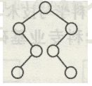

# 百度 2021 校招 C /PHP 研发工程师笔试卷（第二批）

## 1

数据库中的表是数据库最重要的组成部分之一，现假设有关系 S（Sno，SNAME，SAGE），C（Cno，CNAME），SC（Sno，Cno，GRADE），其中 Sno 是学生号，SNAME 是学生姓名，SAGE 是学生年龄， Cno 是课程号，CNAME 是课程名称。要查询选修“ACCESS”课的年龄不小于 20 的全体学生姓名的 SQL 语句是 SELECT SNAME FROM S，C，SC WHERE 子句,则 WHERE 子句的内容是（     ）？

正确答案: A   你的答案: 空 (错误)

```cpp
S.Sno = SC.sno and C.Cno = SC.Cno and SAGE>=20 and CNAME='ACCESS'
```

```cpp
S.Sno = SC.sno and C.Cno = SC.Cno  and SAGE in>=20 and CNAME in 'ACCESS'
```

```cpp
SAGE in>=20 and CNAME in 'ACCESS'
```

```cpp
SAGE>=20 and CNAME=' ACCESS'
```

本题知识点

C++工程师 PHP 工程师 百度 2021 Java 工程师

## 2

以下 C++代码可能会有什么问题?

```cpp
#include<iostream>
void func(int *a, int &c)
{
    a = &c;
}
int main()
{
    int b = 1;
    int *a = &b;
    int c = 2;
    func(a, c);
    std::cout << *a << std::endl;
    return 0;
}
```

正确答案: C   你的答案: 空 (错误)

```cpp
运行报错，a 指向空
```

```cpp
编译报错, a 指向空
```

```cpp
没错误，输出 1
```

```cpp
没错误，输出 2
```

```cpp
没错误，输出一个地址
```

本题知识点

C++工程师 PHP 工程师 百度 2021

## 3

以下哪个模板代码不会出现编译错误?

正确答案: C   你的答案: 空 (错误)

```cpp
float Test[10];
template <typename T>
T getValue(int i)
{
return static_cast<T>(Test[i]);
}
float a = getValue(0);
```

```cpp
template <typename SrcT, typename DstT>
DstT cast(SrcT v)
{
return (DstT)(v);
}
int v = 0;
float i = cast<float>(v);
```

```cpp
template <typename T, int Size>
struct Array
{
T test[Size];
};
Array<int, 10> arr;
```

```cpp
template <int i>
class A {};
int x = 3;
A<x> a;
```

本题知识点

C++工程师 PHP 工程师 百度 2021

## 4

以下代码输出多少?

```cpp
#include <iostream>
int main()
{
    int n = 2021;
    int count = 0;
    while (n) {
        count++;
        n = n&(n - 1);
    }
    std::cout << count << std::endl;
}
```

正确答案: C   你的答案: 空 (错误)

```cpp
6
```

```cpp
7
```

```cpp
8
```

```cpp
9
```

```cpp
10
```

```cpp
无限循环
```

本题知识点

C++工程师 PHP 工程师 百度 2021

讨论

[moenya](https://www.nowcoder.com/profile/469386310)

n&(n - 1) 等价于求 n 的二进制中 1 的个数

发表于 2022-03-22 18:17:17

* * *

## 5

给定一个整数数组 array 和一个目标值 T，如果要你在该数组中找出和为 T 的那 2 个整数(一定存在这 2 个整数)，并返回他们的数组下标。那么至少要遍历几次数组才能找出来?

正确答案: A   你的答案: 空 (错误)

```cpp
1
```

```cpp
2
```

```cpp
4
```

```cpp
3
```

本题知识点

C++工程师 PHP 工程师 百度 2021 前端工程师

讨论

[牛客 941853565 号](https://www.nowcoder.com/profile/941853565)

leetcode 第一题 多记录一个下标

发表于 2021-06-13 00:00:49

* * *

## 6

若栈 S1 中保存整数，栈 S2 中保存运算符，函数 F()依次执行下述各步操作： （1）从 S1 中依次弹出两个操作数 a 和 b； （2）从 S2 中弹出一个运算符 op； （3）执行相应的运算 b op a； （4）将运算结果压人 S1 中。 假定 S1 中的操作数依次是 3, 9, 3, 2（2 在栈顶），S2 中的运算符依次是*, - , +（+在栈顶）。调 用 3 次 F()后，S1 栈顶保存的值是?

正确答案: A   你的答案: 空 (错误)

```cpp
12
```

```cpp
-12
```

```cpp
9
```

```cpp
-9
```

```cpp
-15
```

本题知识点

C++工程师 PHP 工程师 百度 2021 Java 工程师 前端工程师

## 7

已知一棵二叉树的树形如下图所示，其后序序列为 e,a,c,b,d,g,f，树中与结点 a 同层的结点是

正确答案: B   你的答案: 空 (错误)

```cpp
c
```

```cpp
d
```

```cpp
f
```

```cpp
g
```

本题知识点

Java 工程师 2017 C++工程师 PHP 工程师 百度 2021 前端工程师

讨论

[牛客 675683313 号](https://www.nowcoder.com/profile/675683313)

后序序列是先左再右后中间，所以对号入座可知选 d

发表于 2020-10-20 20:37:34

* * *

[Hayle](https://www.nowcoder.com/profile/416498138)

后跟序列：每次都是先遍历树的左子树，然后再遍历树的右子树，最后再遍历根节点，以此类推，直至遍历完整个树。

发表于 2021-05-25 21:15:44

* * *

## 8

下面关于二叉查找树说法正确的有?

正确答案: A B C   你的答案: 空 (错误)

```cpp
中序遍历得到节点值的序列相同的二棵二叉查找树，它们的前序遍历可能不相同
```

```cpp
中序遍历得到节点值的顺序一定是有序的
```

```cpp
中序遍历得到节点值的序列相同的二棵二叉查找树，它们的树的高度可能不相同
```

```cpp
B 树是一颗二叉查找树
```

本题知识点

C++工程师 PHP 工程师 百度 2021 Java 工程师

## 9

将 IP 地址空间 211.211.1.0/24 划分为 2 个子网，每个子网需分配的 IP 地址数不少于 120 个，请问以下哪 2 个子网划分结果可能是对的?

正确答案: A   你的答案: 空 (错误)

```cpp
子网 1：211.211.1.0/25，子网 2：211.211.1.128/25
```

```cpp
子网 1：211.211.1.0/26，子网 2：211.211.1.128/26
```

```cpp
子网 1：211.211.1.0/25，子网 2：211.211.1.64/25
```

```cpp
子网 1：211.211.1.0/26，子网 2：211.211.1.64/26
```

```cpp
子网 1：211.211.1.0/25，子网 2：211.211.1.128/26
```

本题知识点

C++工程师 PHP 工程师 百度 2021 Java 工程师 前端工程师

讨论

[牛客 178885107 号](https://www.nowcoder.com/profile/178885107)

1、先算前面的子网掩码：属于 C 类网络，对这个网络来说范围是：211.211.1.0-211.211.1.255 通俗理解就是最后是 0-255，也就是 256，那么分为两个子网的话，简单计算就是:256/2=128 所以两个个子网的范围分别是 0-127，128-255 所以两子网掩码为：211.211.1.0211.211.1.1282、算主机地址：
2⁶<120<2⁷,所以取 2⁷，那么主机位地址部门只需要 7 位，前缀就是 32-7=25 这里的 32 是 C 类网络中默认的，用就行所以前缀就是/25

发表于 2021-09-06 09:20:14

* * *

[Nk_Idea_0](https://www.nowcoder.com/profile/642499823)

A 选项：11010011.11010011.00000001.0|xxxxxxx
11010011.11010011.00000001.1|xxxxxxx
C 选项：
11010011.11010011.00000001.1|xxxxxxx
11010011.11010011.00000001.0|001xxxx

发表于 2022-01-26 18:26:17

* * *

[sunlightjl](https://www.nowcoder.com/profile/895731249)

2⁷=128>120，所以主机地址部门只需要 7 位 32-7=25 所以前缀是/25

发表于 2021-08-20 10:15:54

* * *

## 10

某操作系统中，页面大小为 4k，分配给每个进程的物理页面数为 1。在一个进程中，定义了如下二位数组 int A[512][512]，该数组按行存放在内存中，每个元素占 8 个字节。有如下编程方法：编程方法：

```cpp
for (int j = 0; j < 512; j++)
{
    for (int i = 0; i < 512; i++)
    {
        A[i][j] = 0;
    }
}
```

那么以上程序运行会产生多少次缺页?

正确答案: C   你的答案: 空 (错误)

```cpp
0
```

```cpp
512
```

```cpp
512*512
```

```cpp
(512*512)/2
```

```cpp
512*1024
```

本题知识点

C++工程师 PHP 工程师 百度 2021 Java 工程师 前端工程师

## 11

下列关于 Linux 内存管理说法不正确的是()：

正确答案: B   你的答案: 空 (错误)

```cpp

malloc()对应到系统调用上两种实现方式，分别为 brk()和 mmap()来分配

```

```cpp

小块内存（小于 128K）使用 mmap()来分配，大块内存（大于 128K），则直接使用内存映射 brk()

```

```cpp

内存回收的方式有三种：LRU（Least Recently Used）算法，回收缓存；Swap 机制，回收不常访问的匿名页；OOM（Out of Memory）机制，杀掉占用大量内存的进程

```

```cpp

LRU 回收算法维护着 active（记录活跃的内存页）和 inactive（记录非活跃的内存页）两个双向链表

```

```cpp

活跃的内存页和非活跃的内存页可通过查看/proc/meminfo 查询

```

本题知识点

C++工程师 PHP 工程师 百度 2021 Java 工程师

讨论

[牛客 178885107 号](https://www.nowcoder.com/profile/178885107)

malloc 小于 128k 的内存，使用 brk 分配内存。malloc 大于 128 的内存，使用 mmap 分配内存。

发表于 2021-09-06 10:14:36

* * *

## 12

下列关于 linux 命令说法不正确的是()：

正确答案: A   你的答案: 空 (错误)

```cpp

top 可查看 CPU 状态，并且可细分进程的用户态 CPU 和内核态 CPU

```

```cpp

pidstat 可查看用户态 CPU 使用率、内核态 CPU 使用率、运行虚拟机 CPU 使用率、等待 CPU 使用率和总的 CPU 使用率

```

```cpp

iostat 可查看 CPU、网卡、磁盘等设备的活动情况, 负载信息

```

```cpp

vmstat 命令可以报告关于进程、内存、I/O 等系统整体运行状态

```

本题知识点

C++工程师 PHP 工程师 百度 2021 Java 工程师 前端工程师

讨论

[牛客 178885107 号](https://www.nowcoder.com/profile/178885107)

*top* 并没有*细分进程的用户态 CPU 和内核态 CPU*

发表于 2021-09-06 10:18:41

* * *

## 13

下面 java 代码求一个比较大的正整数是不是回文数，比如 212 是回文数，返回 true，-212 不是回文数，返回 false，正整数的长度为 N，那么如下代码的时间复杂度以及空间复杂度是多少?

```cpp
public boolean isPalindrome(long x) {
    if (x < 0 || (x % 10 == 0 && x != 0)) {
        return false;
    }

    long tempNum = 0;
    while (x > tempNum) {
        tempNum = tempNum * 10 + x % 10;
        x /= 10;
    }

    return x == tempNum || x == tempNum / 10;
}

```

正确答案: A   你的答案: 空 (错误)

```cpp
O(logN)，O(1)
```

```cpp
O(logN)，O(logN)
```

```cpp
O(N)，O(1)
```

```cpp
O(N)，O(logN)
```

本题知识点

C++工程师 PHP 工程师 百度 2021 Java 工程师 前端工程师

讨论

[山城郴王](https://www.nowcoder.com/profile/462634888)

百度对一个前端工程师要求好高啊：大学必修课的内容都有，三大框架都有一点，还一些算法时空，java 一点点，linux 命令。。。

发表于 2021-12-07 11:22:16

* * *

## 14

下列选项中，不可能将当前进程唤醒的事件是?

正确答案: D   你的答案: 空 (错误)

```cpp
I/O 结束
```

```cpp
某进程退出临界区
```

```cpp
某进程释放锁
```

```cpp
当前进程的时间片用完
```

本题知识点

C++工程师 PHP 工程师 百度 2021 Java 工程师

## 15

一个算法的时间复杂度由以下递归方程表示(N 是非常大的整数，且是 2 的幂):(1).T(1)=1(2).T(N)=2T(N/2)+N 请问 T(N)的表达式为多少?

正确答案: B   你的答案: 空 (错误)

```cpp
T(N)=Nlog2N
```

```cpp
T(N)=N+Nlog2N
```

```cpp
T(N)=N2
```

```cpp
T(N)=N+N2
```

```cpp
T(N)=Nlog2N+1
```

本题知识点

C++工程师 PHP 工程师 百度 2021 Java 工程师

讨论

[Cpp&ming-ming](https://www.nowcoder.com/profile/355819713)

求和后为 N+N²-N，即为 N² 啊，不该选 C 吗

发表于 2022-01-09 16:01:51

* * *

## 16

小度遇上了某个需求，求给定两个字符串的最长公共子序列的长度：一个字符串的 子序列 是指这样一个新的字符串：它是由原字符串在不改变字符的相对顺序的情况下删除某些字符（也可以不删除任何字符）后组成的新字符串。
例如，"bad" 是 "baidu" 的子序列，但 "bud" 不是 "baidu" 的子序列。两个字符串的「公共子序列」是这两个字符串所共同拥有的子序列。如输入： ```cpp
text1 = "baidu", text2 = "bad" 
```

输出: 

```cpp
3
```

小度写了如下 C++代码完成了此功能: ```cpp
int dp[1000][1000];
int max(int a,int b)
{
    if(a>b) return a;
    return b;
}

int longestCommonSubsequence(string text1, string text2) {
        int len1=text1.size();
        int len2=text2.size();
        for(int i=0;i<len1;i++){
            for(int j=0;j<len2;j++){
                if(text1[i]==text2[j]){
                    dp[i+1][j+1]=dp[i][j]+1;
                }
                else{
                    dp[i+1][j+1]=__________;
                }
            }
       }
       return dp[len1][len2];
}

```

则以上核心代码填什么可以正确实现此功能? 

正确答案: A   你的答案: 空 (错误)

```cpp
max(dp[i+1][j],dp[i][j+1])
```

```cpp
max(dp[i+1][j],dp[i][j])
```

```cpp
max(dp[i][j+1],dp[i][j])
```

```cpp
max(dp[i-1][j],dp[i][j-1])
```

```cpp
max(dp[i-1][j],dp[i][j])
```

本题知识点

C++工程师 PHP 工程师 百度 2021 Java 工程师

讨论

[周嘉楠](https://www.nowcoder.com/profile/753370440)

A.当两者字符不相等时，当前最长公共子序列等于 max(不算 test1[i]的最长公共子序列，与不算 test2[j]的最长公共子序列) 发表于 2021-07-06 14:50:15

* * *

## 17

已知字符集{ a, b, c, d, e, f }，若各字符出现的次数分别为{ 6, 3, 8, 2, 10, 4 }，若字符 f 对应的哈夫曼编码为 100，则字符 e 对应的哈夫曼编码为？

正确答案: A   你的答案: 空 (错误)

```cpp
11
```

```cpp
10
```

```cpp
101
```

```cpp
110
```

```cpp
01
```

```cpp
无法确定
```

本题知识点

C++工程师 PHP 工程师 百度 2021 Java 工程师

## 18

请判断以下哪个 C++ STL 容器的底层是哈希表实现的

正确答案: C   你的答案: 空 (错误)

```cpp
std::set
```

```cpp
std::map
```

```cpp
std::unordered_map
```

```cpp
std::multimap
```

本题知识点

C++工程师 PHP 工程师 百度 2021

## 19

下列 php 脚本执行的结果是什么？（）<?phpfunction test(){echo  "HELLO WORLD!\n";}TEST();

正确答案: C   你的答案: 空 (错误)

```cpp
无任何输入
```

```cpp
HELLO WORLD!\n
```

```cpp
HELLO WORLD!
```

```cpp
编译出错
```

本题知识点

C++工程师 PHP 工程师 百度 2021

讨论

[牛客 142901066 号](https://www.nowcoder.com/profile/142901066)

C

发表于 2021-06-26 23:22:46

* * *

## 20

请你判断下面耦合度最高的代码是?

正确答案: A   你的答案: 空 (错误)

```cpp
void funA(int a){
  xxx;
  funB(a);
  xxx;
}

int funB(int b){  int c=b;
  xxx;  return c;
}

```

```cpp
void funA(int a){
   int c=a;
}

void funB(int b){
  int c=b;
}
```

```cpp
int funA(int a){
  xxx;
  return xxx;
}

void funB(int b){
  xxx;
}void funC(){    int a=funA(1);    funB(a);
}
```

```cpp
int global=100;

void funA(){
  int a=global;
  xxx;
}

void funB(){
  int b=global;
  xxx;
}

```

本题知识点

C++工程师 PHP 工程师 百度 2021

## 21

牛牛所在的学校有个学生.并且学校里面有个食堂,因为每个食堂里面有多个取餐点,所以我们描述第个食堂里面有个窗口可以排队取餐.在吃午饭的时候,每个学生都会等概率的选择一个食堂就餐.而且一个食堂内的学生在排队取餐的过程中,他们都会倾向于使最长的队伍尽可能的短,现在牛牛请你帮他计算出所有食堂内最长队伍长度的期望.

本题知识点

C++工程师 PHP 工程师 百度 2021 Java 工程师

## 22

牛牛有一个长度为的数组，牛妹给出个询问，询问有种类型：
:询问区间内有多少子序列的乘积为奇数
:询问区间内有多少子序列的乘积为偶数某个序列的子序列是从最初序列通过去除某些元素但不破坏余下元素的相对位置（在前或在后）而形成的新序列。

本题知识点

C++工程师 PHP 工程师 百度 2021 前端工程师

讨论

[JCoder](https://www.nowcoder.com/profile/1405380)

乘积为奇数的子序列一定是全都是奇数，所以是 2^(奇数数量) - 1 求 [l,r] 内有多少个奇数可以将所有数字模 2，然后求前缀和如果就是求奇数，直接输出求偶数就再求一个全部子序列的数量：2^(r - l + 1) - 1，再减去乘积为奇数的子序列数量至于求 2 的多少次幂可以 O(n)预处理，也可以快速幂

发表于 2021-08-12 19:28:42

* * *

## 23

牛牛参加了大胃王比赛，面前摆上了  道美食，若已知每道美食能够提供的饱腹感以及牛牛感到吃撑时的饱腹感至少需要多少，那么，牛牛最少吃几份能够吃撑自己，请告诉他一种吃美食方案。

本题知识点

C++工程师 PHP 工程师 百度 2021