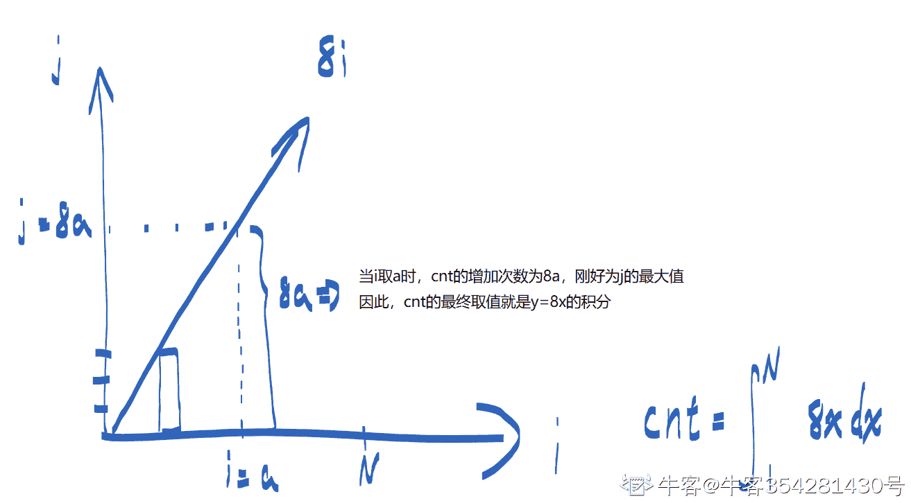

# 百度 2021 校招 C /PHP 研发工程师笔试卷（第三批）

## 1

以下说法中错误的是（）

正确答案: A B   你的答案: 空 (错误)

```cpp
类必须提供一个构造函数；
```

```cpp
默认构造函数没有形参；
```

```cpp
一个类已经定义了构造函数，编译器将不在合成默认构造函数；
```

```cpp
如果一个类没有提供构造函数，编译器会默认生成，并把每个数据成员初始化成相关默认值
```

本题知识点

C++工程师 PHP 工程师 百度 2021

## 2

配接器是 STL 的一个重要配件，一种用来修饰容器、仿函数、迭代器接口的东西。以下那一项是配接器的是（）。

正确答案: D   你的答案: 空 (错误)

```cpp
Set
```

```cpp
List
```

```cpp
deque
```

```cpp
Stack
```

本题知识点

C++工程师 PHP 工程师 百度 2021

讨论

[柴言](https://www.nowcoder.com/profile/958317412)

配接器这个概念其实是一种设计模式。将一个类的接口转换为另一个类的接口，使原本接口不相兼容的类可以一起运作。STL 提供两种容器配接器：stack 和 queue。他们都是修饰 deque 接口而构成另一种风格的容器面貌。

发表于 2021-09-13 22:15:51

* * *

## 3

给定 n 个权值作为 n 个叶子节点，构造一棵二叉树，若该树的带权路径长度达到最小，这样的二叉树为最优二叉树，也称为哈夫曼树(Huffman Tree)，哈夫曼树是带权路径长度最短的树，权值较大的结点离根较近，若一个哈夫曼树有 N 个叶子节点，则其节点总数为（  ）

正确答案: B   你的答案: 空 (错误)

```cpp
不确定
```

```cpp
2N-1
```

```cpp
2N+1
```

```cpp
2N
```

本题知识点

C++工程师 PHP 工程师 百度 2021 Java 工程师 前端工程师

讨论

[徐凤年 201809042100959](https://www.nowcoder.com/profile/782656048)

哈夫曼新增节点，就是在两两之间新增，也就是新增 N-1 个节点，加起来 2N-1

发表于 2021-08-21 01:11:05

* * *

[不偏.](https://www.nowcoder.com/profile/86463628)

比如一开始，只有两个节点来，构建哈夫曼树，那么选择量小造新树 h 就会产生一个三个节点的数。也就是 2N-1

发表于 2021-08-12 19:10:20

* * *

## 4

AVL 树是平衡二叉查找树，在 AVL 树中任何节点的两个子树的高度最大差别为 1，现有一结点序列（100，70，50，80，90，60），逐个插入一颗空的 AVL 树，插入过程中，树不断调整，则在上述情境下，分析正确的是（  ）

正确答案: B   你的答案: 空 (错误)

```cpp
树中插入 90 时，破坏平衡了，需要进行 RL 调整
```

```cpp
树中插入 90 时，破坏平衡了，需要将 90 变为 100 和 80 的父节点
```

```cpp
树中插入 50 时，破坏平衡了，需要将 50 变为 70 的父节点
```

```cpp
树中插入 80 时，破坏平衡了，需要将 80 变为 100 的父节点
```

```cpp
树中插入 90 时，破坏平衡了，需要将 80 变为根节点，90 和 100 变为 80 的右孩子
```

本题知识点

C++工程师 PHP 工程师 百度 2021 Java 工程师

讨论

[杂货店的阿猿](https://www.nowcoder.com/profile/440731268)


发表于 2022-02-26 22:37:20

* * *

[继续春招](https://www.nowcoder.com/profile/929254462)

90 的发现者的在最低点祖先节点，100 的左子树的右边，故是 LR 调整，先右单旋，再左单旋，
原来为:                    100
                  /
                80
                      \
                        90
失衡最小祖先为 100，故先 80(100 的子树)右旋调整，变为         100        /    90
    /80 失衡最小祖先为 100，故先 90(100 的子树)左左旋为         90
        /    \
      80     100

发表于 2021-08-13 16:26:14

* * *

## 5

分页存储管理将进程的逻辑地址空间分成若干个页，并为各页加以编号，从 0 开始，若某一计算机主存按字节编址，逻辑地址和物理地址都是 32 位，页表项大小为 4 字节，若使用一级页表的分页存储管理方式，逻辑地址结构为页号（20 位），页内偏移量（12 位），则页的大小是（  ）？页表最大占用（  ）？

正确答案: A   你的答案: 空 (错误)

```cpp
4KB，4MB
```

```cpp
5KB，5MB
```

```cpp
6KB，6MB
```

```cpp
7KB，7MB
```

本题知识点

C++工程师 PHP 工程师 百度 2021 Java 工程师 前端工程师

讨论

[敲了个锤子](https://www.nowcoder.com/profile/80190292)

地址长度为 32 位，其中 0~11 位为页内地址（即页内偏移量），2¹² 即每页大小为 4KB；同样地，12~31 位为页号，地址空间最多允许有 2²⁰ = 1M 页，又页表项 4 字节， 所以页表最大占用 1M * 4 = 4MB 发表于 2021-09-24 12:08:34

* * *

[机智的路易](https://www.nowcoder.com/profile/747109063)

页内偏移量（12 位）= 页大小 2¹² = 4KB

发表于 2022-03-21 15:13:44

* * *

[牛客 545329987 号](https://www.nowcoder.com/profile/545329987)


发表于 2022-03-19 20:31:34

* * *

## 6

后序遍历为二叉树遍历方式中的一种，假设将{ 3, 8, 9, 1, 2, 6 }依次插入初始为空的二叉排序树。则该树的后序遍历结果是多少（    ）？

正确答案: B   你的答案: 空 (错误)

```cpp
1, 2, 8, 6, 9, 3
```

```cpp
2, 1, 6, 9, 8, 3
```

```cpp
1, 2, 3, 6, 9, 8
```

```cpp
2, 1, 3, 6, 9, 8
```

本题知识点

C++工程师 PHP 工程师 百度 2021 Java 工程师 前端工程师

讨论

[洒下句点](https://www.nowcoder.com/profile/56029131)

A

发表于 2021-09-16 10:24:12

* * *

[linc_c](https://www.nowcoder.com/profile/819544946)

二叉排序树要么是空[二叉树](http://c.biancheng.net/view/3384.html)，要么具有如下特点：

*   二叉排序树中，如果其根结点有左子树，那么左子树上所有结点的值都小于根结点的值；
*   二叉排序树中，如果其根结点有右子树，那么右子树上所有结点的值都大小根结点的值；
*   二叉排序树的左右子树也要求都是二叉排序树；

发表于 2021-09-08 12:45:14

* * *

[牛客 360871401 号](https://www.nowcoder.com/profile/360871401)

（1）先(根)序遍历（根左右）

（2）中(根)序遍历（左根右）

（3）后(根)序遍历（左右根）

发表于 2021-07-15 15:54:58

* * *

## 7

关于以下代码说法正确的有？

```cpp

```
#include<iostream>
#include <map>
#include <memory>
using namespace std;
std::map<int, char*> my;
std::pair<int, char*> test() {
    int a = 10;
    char buff[128];
    sprintf(buff, "%d test", 99);
    return std::make_pair(a, buff);
}
int main() {
    my.insert(test());
    for (auto iter = my.begin(); iter != my.end(); ++iter)
    {
        cout << iter->first << endl;
        cout << iter->second << endl;
    }
    return 0;
}
```cpp

```

正确答案: B E   你的答案: 空 (错误)

```cpp
a 是临时变量，返回会被销毁，可能导致输出结果有问题
```

```cpp
buff[128]是临时变量，返回会被销毁，可能导致输出结果有问题
```

```cpp
my.insert(test());插入会报错
```

```cpp
可以将 test 函数的代码改成如下代码，会解决 test 函数内所有的问题:

std::pair<int, char*> test() {
std::shared_ptr<char> buff(new char[128]);
sprintf(buff.get(), "%d test", 99);

return std::make_pair(10, buff.get());
}
```

```cpp
可以将 test 函数的代码改成如下代码，会解决 test 函数内所有的问题:

std::pair<int, char*> test() {
static char buff[128];
sprintf(buff, "%d test", 99);
return std::make_pair(10, buff);
}
```

本题知识点

C++工程师 PHP 工程师 百度 2021

## 8

执行以下命令后，哪个服务最可能受影响：iptables -A INPUT -i eth0 -s 10.0.0.0/24 -p tcp --dport 22 -j DROP

正确答案: A   你的答案: 空 (错误)

```cpp
sshd
```

```cpp
mysqld
```

```cpp
redis-server
```

```cpp
httpd
```

本题知识点

C++工程师 PHP 工程师 百度 2021 Java 工程师

讨论

[lh-jiezhou](https://www.nowcoder.com/profile/3848158)

端口 22

发表于 2021-08-17 20:25:28

* * *

## 9

现有一个集合：A={16,76,63,58,40}，使用 Hash 法存储该集合,现选取哈希函数：h(B)=B%C，即关键字对 C（正整数）取余作为哈希地址,为了不引起 hash 冲突，C 应该取值为多少（）

正确答案: A   你的答案: 空 (错误)

```cpp
11
```

```cpp
7
```

```cpp
8
```

```cpp
5
```

本题知识点

C++工程师 PHP 工程师 百度 2021

## 10

假设系统中有 7 个同类资源,进程 P1、P2 和 P3 需要的资源数分别为 6、5 和 2 。现在 P1、P2 和 P3 已申请到的资源数分别为 3、2 和 1，则执行安全性检测算法的结果是

正确答案: A   你的答案: 空 (错误)

```cpp
不存在安全序列，系统处于不安全状态
```

```cpp
存在多个安全序列，系统处于安全状态
```

```cpp
存在唯一安全序列 P3、P1、P2，系统处于安全状态
```

```cpp
存在唯一安全序列 P3、P2、P1，系统处于安全状态
```

本题知识点

C++工程师 PHP 工程师 百度 2021 Java 工程师

讨论

[牛客 884272626 号](https://www.nowcoder.com/profile/884272626)

一个资源给 p3，p3 运行完，释放 2 个，p1 和 p2 都满足不了，发生死锁。

发表于 2021-08-04 22:14:18

* * *

[机智的路易](https://www.nowcoder.com/profile/747109063)

|   | 需要的资源 | 初始 | 分配 |   |
| p1 | **6** | 3  | 3 | 3 |
| p2 | **5** | 2  | 2 | 2 |
| p3 | **4** | 1 | 1+1 | 0 |

死锁
 发表于 2022-03-21 15:10:21

* * *

[牛客 441912538 号](https://www.nowcoder.com/profile/441912538)

根据题目，以分配 6 个资源，还剩 1 个空余资源，条件最容易满足的是 P3，P3 满足后可以运行释放 2 个资源，但是 2 个资源都不能满足 P1 和 P2

发表于 2022-02-13 21:28:51

* * *

## 11

在含 N 个节点、高度为 H 的二叉查找树(BST)中进行查找的最坏时间复杂度为?

正确答案: A   你的答案: 空 (错误)

```cpp
O(H)
```

```cpp
O(1)
```

```cpp
O(N)
```

```cpp
O(NH)
```

```cpp
O(N/H)
```

本题知识点

C++工程师 PHP 工程师 百度 2021 Java 工程师

讨论

[不偏.](https://www.nowcoder.com/profile/86463628)

画一个最简单的，只有两个节点的二分查找树，述。

发表于 2021-08-12 19:13:04

* * *

[値言](https://www.nowcoder.com/profile/566984035)

这个 O(N)或者 O(H)应该都可以吧？

发表于 2022-03-20 23:29:15

* * *

[我很菜 123](https://www.nowcoder.com/profile/823190433)

最坏的情况不是单链表然后时间复杂度为 O（N）吗？或者 O（H+1）？求解答🙂

发表于 2022-02-20 12:08:07

* * *

## 12

下列代码中的输出是(): 

class Base {
public:
Base()
{ cout<<"Constructing Base \n"; }
~Base()
{ cout<<"Destructing Base \n"; }
};
class Derived: public Base {
public:
Derived()
{ cout<<"Constructing Derived \n"; }
~Derived()
{ cout<<"Destructing Derived \n"; }
};

int main(void)
{
Derived *d = new Derived();
Base *b = d;
delete b;
return 0;
}

 正确答案: A   你的答案: 空 (错误)

```cpp

Constructing Base

Constructing Derived

Destructing Base

```

```cpp

Constructing Base

Constructing Derived

Destructing Derived

Destructing Base

```

```cpp

Constructing Base

Constructing Derived

Destructing Base

Destructing Derived

```

```cpp

Constructing Derived

Constructing Base

Destructing Base

Destructing Derived

```

本题知识点

C++工程师 PHP 工程师 百度 2021

## 13

以下哪种方法可以用来清理僵尸进程()

正确答案: C   你的答案: 空 (错误)

```cpp
向僵尸进程发送 SIGKILL 信号
```

```cpp
向 init 进程发送 SIGKILL 信号
```

```cpp
向僵尸进程的父进程发送 SIGKILL 信号
```

```cpp
向僵尸进程发送 SIGCHILD 信号
```

本题知识点

C++工程师 PHP 工程师 百度 2021 Java 工程师 前端工程师

讨论

[zvorebri](https://www.nowcoder.com/profile/6689254)

清理僵尸线程：把父进程杀掉，父进程死后，僵尸进程称为“孤儿进程”，过继给 1 号进程 init，init 始终负责清理僵尸进程，它产生的所有僵尸进程跟着消失

发表于 2021-08-16 15:54:11

* * *

## 14

以下代码是计算最长公共子串的一个算法，试分析它的时间复杂度是多少?

```cpp
int findLongest(string A, string B)
{
    int n=A.size();
    int m=B.size();
    //相当于生成一个二维数组 int dp[n][m];
    vector<vector<int>> dp(n + 1, vector<int>(m + 1, 0));
    int max = -1;
    for (int i = 0; i < n; i++)
    {
        for (int j = 0; j < m; j++)
        {
            if (A[i] == B[j])
            {
                dp[i + 1][j + 1] = dp[i][j] + 1;
                if (dp[i + 1][j + 1] > max)
                {
                    max = dp[i + 1][j + 1];
                }
            }
        }
    }
    return max;
}

```

正确答案: D   你的答案: 空 (错误)

```cpp
O(n)
```

```cpp
O(m)
```

```cpp
O(n+m)
```

```cpp
O(n*m)
```

本题知识点

C++工程师 PHP 工程师 百度 2021

## 15

已知 B 类地址的子网掩码为 255.255.0.0，假设某 B 类地址为 127.24.36.55，那么它的网络号为:

正确答案: A   你的答案: 空 (错误)

```cpp
127.24.0.0
```

```cpp
0.0.36.55
```

```cpp
255.255.36.55
```

```cpp
127.24.36.55
```

本题知识点

C++工程师 PHP 工程师 百度 2021 Java 工程师 前端工程师

讨论

[TateTang](https://www.nowcoder.com/profile/1862380)

步骤一：首先将网络的 IP 地址和子网掩码都转换成 32 位二进制字符。
步骤二：将转换后的二进制的 IP 地址和子网掩码进行“逻辑与”运算，得到新的 32 位二进制字符。
步骤三：把得到的新的 32 位二进制字符转换成十进制，就是主机的网络号了。本机 IP 为 127.24.36.55，子网掩码为 255.255.0.0
转换成二进制：
本机 IP 为 01111111.00011000.00100100.00110111
子网掩码 11111111.11111111.00000000.00000000
进行“与运算“ 01111111.00011000.00000000.00000000
转换成十进制：127.24.0.0
即 127.24.0.0 为主机的网络号。 

发表于 2021-11-29 17:05:25

* * *

[牛客 855150961 号](https://www.nowcoder.com/profile/855150961)

B 类子网掩码是 255.255.0.0 网络号不就是指前面的 255.255 吗。

发表于 2021-11-17 12:16:18

* * *

## 16

下列 php 脚本中，命名错误的是哪一个？（）

正确答案: D   你的答案: 空 (错误)

```cpp
$变量 Br
```

```cpp
$vBr
```

```cpp
$v_Br
```

```cpp
$v-Br
```

本题知识点

C++工程师 PHP 工程师 百度 2021

讨论

[牛客 719195924 号](https://www.nowcoder.com/profile/719195924)

A 虽然可以，但给人笑死

发表于 2022-02-12 11:45:57

* * *

[牛客 142901066 号](https://www.nowcoder.com/profile/142901066)

D

发表于 2021-06-26 23:20:23

* * *

## 17

小牛刚刚学习算法，想用动态规划来实现爬楼梯问题：n 阶楼梯每次可以爬 1 或 2 个台阶，让你实现如下代码，来判断总共有多少种方法呢:()int climbStairs(int n) {vector<int>dp(n+3,0);dp[1] = 1;dp[2] = 2;for(int i = 3; i<=n; i++){_____________________}return dp[n];}

正确答案: B   你的答案: 空 (错误)

```cpp
dp[i]=dp[i]+dp[i-2];
```

```cpp
dp[i]=dp[i-1]+dp[i-2];
```

```cpp
dp[i]=max(dp[i],dp[i-1]);
```

```cpp
dp[i]=max(dp[i-1],dp[i-2]);
```

本题知识点

C++工程师 PHP 工程师 百度 2021 Java 工程师 前端工程师

## 18

以下代码中，N 足够大，试分析“cnt++”执行的次数最接近于 ___ 次

```cpp
int test(int N)
{
    int cnt = 0;
    for (int i = 1; i <= N; i++)
    {
        for (int j = 1; j <= 8 * i; j++)
        {
            cnt++;
        }
    }
    return cnt;
}

```

正确答案: D   你的答案: 空 (错误)

```cpp
N2
```

```cpp
2N2
```

```cpp
3N2
```

```cpp
4N2
```

```cpp
8N2
```

本题知识点

C++工程师 PHP 工程师 百度 2021 Java 工程师 前端工程师

讨论

[牛客 354281430 号](https://www.nowcoder.com/profile/354281430)

直观点，这就是一个微积分问题——求阴影空间的面积问题。直观看过去，将 i 理解为 x，j 理解为 y，于是可得知，j 的最大取值随 i 的变化公式为 y=8x，即 max（j）=8i 在第二层循环中，cnt 的增加次数相当于从 1 到 max（j）的次数。于是，当横坐标取 i=N，纵坐标=max（j）=8N，i 取 1~N，所以 cnt 增加次数为 8~8N，三角形面积=4N²

发表于 2021-09-06 13:47:12

* * *

[想要找到好工作](https://www.nowcoder.com/profile/67219244)

i=1：第二层循环执行 8*1 次 i=2：第二层循环执行 8*2 次……i=N：第二层循环执行 8*N 次总共需执行 8*1+8*2+...8*N=8*(1+2+...+N)=8*(N+N*(N-1)/2)=4N²+4N 次

发表于 2021-07-26 17:52:09

* * *

[缄默斯](https://www.nowcoder.com/profile/998590184)

(8+8n)*n/2 约等于 4n² 等差数列

发表于 2022-03-14 10:38:19

* * *

## 19

这里有一张员工信息表（只展示了部分数据，数据格式类似）
+-------+---------------+-------+
|   id  |   language    | name  |
+-------+---------------+-------+
|   1   |   C++         | MA    |
|   2   |   C++         | VA    |
|   3   |   Go          | VC    |
|   4   |   Python      | MB    |
|   5   |   Php         | VA    |
+-------+---------------+-------+
查询哪些员工会使用 3 种及以上的编程语言

正确答案: D   你的答案: 空 (错误)

```cpp
select name,count(*) as count from info  having count > 2 order by count desc;
```

```cpp
select name,count(*) as count from info group by name and count > 2 order by count desc;
```

```cpp
select name,count(*) as count from info group by name where count >= 2 order by count desc;
```

```cpp
select name,count(*) as count from info group by name having count > 2 order by count desc;
```

本题知识点

C++工程师 PHP 工程师 百度 2021 Java 工程师

## 20

下面哪种设计模式的定义为：定义对象间的一种一对多的关系，当一个对象改变时，其他依赖于他的对象都能够得到通知并自动更新

正确答案: D   你的答案: 空 (错误)

```cpp
访问者模式
```

```cpp
适配器模式
```

```cpp
解释器模式 
```

```cpp
观察者模式
```

本题知识点

C++工程师 PHP 工程师 百度 2021

## 21

牛牛有一个特殊的硬币，它有百分之 p 的概率正面朝上，否则反面朝上。牛牛现在有 2*n 个数字 a[1]~a[2*n]， 要把这 2*n 个数字分成 n 组，每组 2 个数字。然后对于每一组，牛牛会投掷他这个特殊的硬币，如果硬币正面朝上，牛牛会将答案加上这组两个数中较大的那个数，否则牛牛会将答案加上这组两个数中较小的那个数。现在问你怎么分组，能使牛牛最后的得到的答案的期望最大。请输出这个最大期望。

本题知识点

C++工程师 PHP 工程师 百度 2021 前端工程师

讨论

[牛客 960295533 号](https://www.nowcoder.com/profile/960295533)

```cpp
#python 版
n,p = map(int,input().split())
mylist = list(map(int,input().split(" ")))
mylist.sort()
sum = 0
i,j=0 , 2*n-1
if p >= 50:
    while True:
        if i >= j:
            break
        sum += mylist[i]*(100-p)+mylist[j]*p
        i += 1
        j -= 1
else:
    while True:
        if i > 2*n-2:
            break
        sum += mylist[i]*(100-p)+mylist[i+1]*p
        i += 2
if sum % 100 == 0:
    print(sum//100)
else:
    print(str(sum)+'%')

```

编辑于 2021-09-13 16:58:03

* * *

[JCoder](https://www.nowcoder.com/profile/1405380)

要用 unsigned long long 或者写高精度就行了 p >= 50 就排序后 0 和 n-1，1 和 n-2 分组 p < 50 就排序后 i 和 i + 1 分组

编辑于 2021-08-12 16:34:20

* * *

## 22

牛牛刚刚学了二叉树和最短路
他现在很好奇，对于一棵完全二叉树(对于有孩子的节点 i，其左孩子为，右孩子为)，给定的两个点之间的最短路的长度是多少
我们认为相邻两点之间的距离为 1

本题知识点

C++工程师 PHP 工程师 百度 2021