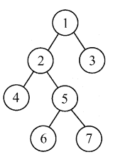
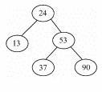
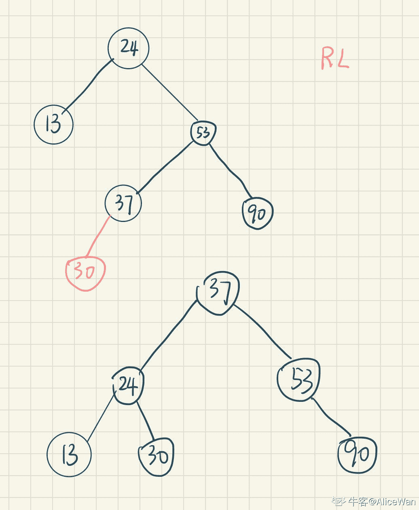
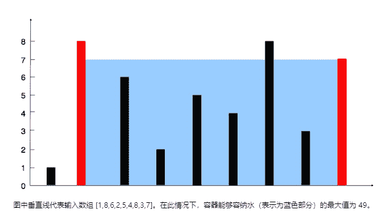

# 百度 2021 校招 Java 研发工程师笔试卷（第一批）

## 1

关于线程池 ThreadPoolExecutor 生命周期的说法错误的是:

正确答案: B   你的答案: 空 (错误)

```cpp
RUNNING: 可以接受新的请求并执行排队的任务。
```

```cpp
WAITING: 将新的任务加入任务队列，打断空闲线程，并挂起所有正在执行的线程。
```

```cpp
SHUTDOWN: 不接受新的任务，打断空闲线程，但是继续执行完内部队列中排队的任务。
```

```cpp
STOP: 不接受新的任务，打断所有线程，清空任务队列，并返回队列中未完成的任务。
```

本题知识点

Java 工程师 百度 2021

讨论

[没有 job 的 steve](https://www.nowcoder.com/profile/592860067)

ThreadPoolExecutor 的五种状态 1\. RUNNING : 线程池创建之后的初始状态，在该状态下可以执行任务 2.SHUTDOWN 该状态下线程池不再接收新任务，但是会将工作队列中的任务执行完毕 3\. STOP : 该状态下线程池不再接收新任务，也不会处理工作队列中的剩余任务，并且将会中断所有工作进程 4\. TIDYING : 该状态下所有任务都已终止或处理完成，将会执行 terminated()钩子方法 5\. TERMINATED : 执行完 terminated 方法之后的状态

发表于 2021-09-07 11:07:57

* * *

## 2

以下代码输出的结果是什么（）

```cpp
public class Test{
    static int a = 1;
    static int b = 2;
    public static void main(String[] args) {
        static String c = "3";
        System.out.println(a+b+c);
    }
}
```

正确答案: D   你的答案: 空 (错误)

```cpp
6
```

```cpp
33
```

```cpp
123
```

```cpp
编译报错
```

本题知识点

Java 工程师 百度 2021

讨论

[va 转行](https://www.nowcoder.com/profile/362513317)

编译错误

发表于 2021-07-18 06:04:10

* * *

## 3

某主机的 IP 地址为 212.212.77.55，子网掩码为 255.255.252.0。若该主机向其所在子网发送广播分组，则目的地址可以是？

正确答案: D   你的答案: 空 (错误)

```cpp
212.212.76.255
```

```cpp
212.212.77.255
```

```cpp
212.212.78.255
```

```cpp
212.212.79.255
```

```cpp
212.212.80.255
```

本题知识点

C++工程师 PHP 工程师 百度 2021 Java 工程师 前端工程师

讨论

[⊱r=a（1-sinx）♒](https://www.nowcoder.com/profile/646955188)

子网掩码 252，即 11111100，而后两位和第四部分是子网，而广播地址是子网号全为 1，主网号不变。因此 212.212.77.55，即 212.212.（100011-01）.55                广播号：212.212.    100011-11.255 即 212.212.79.255

发表于 2021-09-07 15:21:44

* * *

[oceanao](https://www.nowcoder.com/profile/3461356)

正确答案：D 题目解析：
由子网掩码可知前 22 位为子网号、后 10 位为主机号。IP 地址的第 3 个字节为 010011 01 ，后面 2 位是主机号，将主机号全置为 1，可得广播地址为 180.80.79.255

发表于 2021-09-07 19:00:25

* * *

[vaakian](https://www.nowcoder.com/profile/309934583)

主机号为后 10 为，该 ip 后 10 为广播地址全置 0 即 11.11111111，即得到答案。

发表于 2021-09-12 23:57:16

* * *

## 4

小牛在学习了二叉树三种遍历方式后，自己发明了一直与中序遍历相反的遍历方式，称为"反中序遍历"，中序遍历的遍历方式为左孩子->根节点->右孩子，他发明的"反中序遍历"遍历方式为右孩子->根节点->左孩子，那么使用他发明的"反中序遍历"遍历如下图的二叉树，输出的节点应为? 

正确答案: A   你的答案: 空 (错误)

```cpp
3，1，7，5，6，2，4
```

```cpp
3，1，5，7，2，6，4
```

```cpp
3，1，2，7，5，6，4
```

```cpp
3，1，7，5，2，6，4
```

```cpp
3，1，4，2，6，5，7
```

本题知识点

C++工程师 PHP 工程师 百度 2021 Java 工程师 前端工程师

## 5

以下二叉平衡排序树(AVL 树)，插入一个新节点值为 30 后，重平衡调整为一颗 AVL 树。那么请问节点 24 的左右孩子分别为?

正确答案: A   你的答案: 空 (错误)

```cpp
13，30
```

```cpp
13，无右孩子
```

```cpp
13，37
```

```cpp
13，53
```

```cpp
无左孩子，37
```

```cpp
无左孩子，53
```

本题知识点

C++工程师 PHP 工程师 百度 2021 Java 工程师

讨论

[AliceWan](https://www.nowcoder.com/profile/549074977)

A 原题解配图有问题

发表于 2021-06-23 20:39:43

* * *

## 6

当数组 arr= {2,12,17,31,53,69,97,142,150,240,308}，value=53 时，上述函数中 while 循环的次数为：

```cpp
import java.util.Arrays;
public class NowCoder {
    public static void main(String[] args) {
        int[] arr= {2,12,17,31,53,69,97,142,150,240,308};
        System.out.println(BinarySearch(arr,53));
    }
    public static int BinarySearch(int[] arr,int value) {
        int left=0;
        int right=arr.length-1;
        while(left<=right) {
            int mid=(left+right)/2;
            if(value==arr[mid]) {
                return mid;
            }
            if(value>arr[mid]) {
                left=mid+1;
            }
            if(value<arr[mid]) {
                right=mid-1;
            }
        }
        return -1;
    }
}
```

正确答案: C   你的答案: 空 (错误)

```cpp
2
```

```cpp
3
```

```cpp
4
```

```cpp
5
```

本题知识点

C++工程师 PHP 工程师 百度 2021 Java 工程师

## 7

下面程序中，jvm 在进行过一次 Minor GC 后，上述代码在年轻代内存中保留的字符个数：

```cpp
public class NowCoder {
    public static void main(String[] args) {
         String str1="abcde";
         String str2= str1.substring (4);
         String str3=new String (str2);
         String str4=new String (str2.toCharArray ()); 
    }
}
```

正确答案: A   你的答案: 空 (错误)

```cpp
0
```

```cpp
4
```

```cpp
8
```

```cpp
12
```

本题知识点

Java 工程师 百度 2021

讨论

[va 转行](https://www.nowcoder.com/profile/362513317)

全都清理

发表于 2021-07-18 06:04:41

* * *

## 8

身在乙方的小明去甲方对一网站做渗透测试，甲方客户告诉小明，目标站点由 wordpress 搭建，请问下面操作最为合适的是

正确答案: B   你的答案: 空 (错误)

```cpp
访问 robots.txt，查看站点结构及敏感目录
```

```cpp
使用 wpscan 对网站进行扫描
```

```cpp
使用 appscan 或 awvs 对网站进行漏洞扫描
```

```cpp
寻找网站后台，进行暴力破解登录账号密码
```

本题知识点

Java 工程师 百度 2021 前端工程师

讨论

[全废工程师](https://www.nowcoder.com/profile/304463687)

指纹，wordpress 首先那就找通用漏洞喽，对症下药

发表于 2021-05-22 08:26:28

* * *

## 9

下列哪项不会阻止 JVM 终止？

正确答案: A   你的答案: 空 (错误)

```cpp
守护线程
```

```cpp
进程
```

```cpp
用户线程
```

```cpp
JVM 线程
```

本题知识点

Java 工程师 百度 2021

讨论

[va 转行](https://www.nowcoder.com/profile/362513317)

没看懂题意

发表于 2021-07-18 06:05:31

* * *

## 10

关于网络请求延迟增大的问题，以下哪些描述是正确的()

正确答案: B C D   你的答案: 空 (错误)

```cpp
使用 ping 来测试 TCP 端口是不是可以正常连接
```

```cpp
使用 tcpdump 抓包分析网络请求
```

```cpp
使用 strace 观察进程的网络系统调用
```

```cpp
使用 Wireshark 分析网络报文的收发情况
```

本题知识点

C++工程师 PHP 工程师 百度 2021 Java 工程师 前端工程师

讨论

[响亮亮的名字 1](https://www.nowcoder.com/profile/505661295)

ping 是网络层的，tcp 是传输层的

发表于 2021-08-17 14:25:20

* * *

[va 转行](https://www.nowcoder.com/profile/362513317)

使用 TCP

发表于 2021-07-18 06:03:31

* * *

## 11

如下 Java 代码会输出什么?

```cpp
import java.util.HashSet;
import java.util.Set;
public class HashSetTest {
    public static final class Person {
        private String name = "";
        public Person(String n) {
            setName(n);
        }
        public String getName() {
            return name;
        }
        public void setName(String name) {
            this.name = (name == null) ? "" : name;
        }
        @Override
        public int hashCode() {
            return name.length();
        }
        @Override
        public boolean equals(Object obj) {
            if (!(obj instanceof Person)) {
                return false;
            }
            if (obj == this) {
                return true;
            }
            return this.name.equals(((Person) obj).name);
        }
    }
    public static void main(String[] args) {
        Set<Person> persons = new HashSet<Person>();
        Person person = new Person("nowcoder");
        persons.add(person);
        person.setName("nowcodertest");
        boolean isContains = persons.contains(person);
        int size = persons.size();
        System.out.println("isContains=" + isContains);
        System.out.println("size=" + size);
    }
}

```

正确答案: A   你的答案: 空 (错误)

```cpp
isContains=false
size=1

```

```cpp
isContains=true
size=1

```

```cpp
isContains=false
size=2

```

```cpp
isContains=true
size=2

```

本题知识点

Java 工程师 百度 2021

讨论

[⊱r=a（1-sinx）♒](https://www.nowcoder.com/profile/646955188)

哈哈，虽然我一开始做错了，但是这题我真知道（手动狗头）首先，HashSet 的底层就是 HashMap，因此本题就是考 HashMap。其 JDK 源码如下

```cpp
    public HashSet() {
        map = new HashMap<>();
    }
```

下面就需要解释 HashMap 的原理：HashMap 底层是 hash 数组+链表（或者红黑树），因为是 hash 数组，所以与 hashCode 方法息息相关。一、介绍为啥是 false：首先得介绍下 add 方法，其实就是将参数作为 key，一个固定的对象作为 value 放入 HashMap 中。也就是 HashMap 的 put 操作。首先，HashMap 的 put 操作源码如下：

```cpp
return putVal(hash(key), key, value, false, true);
```

而 putVal 的源码太过复杂了，篇幅所限不展示了，但是只需要明白一点：那就是 put 操作人为这个 key 存在的依据是：先判断 hash，如果想同，再判断 equals，如果还想同，才说明该 key 相同。而 contains 的判断依据也是这样。进入正题：而由于一开始的时候 name 值为“newcoder”，所以获得一个 hash 值 h1=8，而执行 contains 时，此时 name 值为为“newcodertest”，此时 hash 值为 h2=12，所以两个 hash 值都不一样，所以必定返回 false；二、介绍大小为 1 因为 Set 也好。Map 也好，都是保持对对象的引用，即指向 person 对象，而代码只执行了一次 add 操作，且该 person 对象没有任何对象地址的变化，所以大小还是 1\.

发表于 2021-09-07 16:04:28

* * *

## 12

假设 tempStr 字符串长度为 N(N 足够大)，试分析以下算法平均时间复杂度和额外空间复杂度(传进来的 tempStr 不算额外的空间)最接近为多少?

```cpp
private boolean isPalindrome(String tempStr){
        int len=tempStr.length();
        if (len==1) return true;
        for (int i=0,j=len-1;i<tempStr.length()/2;i++,j--){
            if (tempStr.charAt(i)!=tempStr.charAt(j)){
                return false;
            }
        }
        return true;
}

```

正确答案: B   你的答案: 空 (错误)

```cpp
O(N)，O(N)
```

```cpp
O(N)，O(1)
```

```cpp
O(log2N)，O(N)
```

```cpp
O(log2N)，O(1)
```

本题知识点

Java 工程师 百度 2021 前端工程师

## 13



```cpp
输入：[1,8,6,2,5,4,8,3,7] 输出：49
```

目前某学生用如下 java 代码解决了此问题，设 height 数组长度为 N，且 N 足够大，他的部分代码如下，请你判断他代码(maxArea 函数)的时间复杂的以及额外的空间复杂度(不包括传入的 height 数组)分别为? 

```cpp
int calculateArea(int start, int end, int sHeight, int eHeight) {
    int len = end - start;
    int height = Math.min(sHeight, eHeight);
    return len * height;
}

public int maxArea(int[] height) {
    int maxLen = -1;
    int arrLen = height.length;
    for (int i = 0, j = arrLen - 1; i < arrLen; ) {
        if (i == j) {
            return maxLen;
        }
        int area = calculateArea(i, j, height[i], height[j]);
        maxLen = Math.max(area, maxLen);
        if (height[i] > height[j]) {
            j--;
        } else {
            i++;
        }
    }

    return 0;
}

```

正确答案: A   你的答案: 空 (错误)

```cpp
O(N)，O(1)
```

```cpp
O(N)，O(N)
```

```cpp
O(N)，O(logN)
```

```cpp
O(N2)，O(1)
```

```cpp
O(NlogN)，O(1)
```

本题知识点

C++工程师 PHP 工程师 百度 2021 Java 工程师

## 14

一个算法的时间复杂度由以下递归方程表示(N,M 都是非常大的正整数):(1).T(1)=1(2).T(N)=2T(N/2)+O(M)(递归的过程中 O(M)不变)那么该算法的时间复杂度为哪个级别的?

正确答案: C   你的答案: 空 (错误)

```cpp
O(MlogN)
```

```cpp
O(MN2)
```

```cpp
O(MN)
```

```cpp
O(M+N)
```

```cpp
O(NlogM)
```

本题知识点

C++工程师 PHP 工程师 百度 2021 Java 工程师

讨论

[徐风](https://www.nowcoder.com/profile/503005674)

反正我没看懂

发表于 2022-03-09 10:30:00

* * *

[va 转行](https://www.nowcoder.com/profile/362513317)

主方法

发表于 2021-07-18 06:06:34

* * *

## 15

下面可以按照从小到大顺序排列显示磁盘中各个分区利用率的命令是

正确答案: C   你的答案: 空 (错误)

```cpp
du | grep -o "\<[0-9]*%.*" -o | sort -n
```

```cpp
df | grep -o "\<[0-9]*%.*" -o | sort -r
```

```cpp
df | grep -o "\<[0-9]*%.*" -o | sort -n
```

```cpp
du | grep -o "\<[0-9]*%.*" -o | sort -m
```

本题知识点

C++工程师 PHP 工程师 百度 2021 Java 工程师 前端工程师

讨论

[扶摇可接 999](https://www.nowcoder.com/profile/423269138)

没什么好解释的，df（disk free）查看文件系统磁盘使用情况，多背多用

发表于 2021-12-11 11:55:27

* * *

## 16

下面关于用户级线程和内核级线程的描述，错误的是?

正确答案: E   你的答案: 空 (错误)

```cpp
内核级线程，线程的创建、撤销和切换等，都需要内核直接实现
```

```cpp
内核级线程是操作系统调度器管理和调度
```

```cpp
用户级线程间的切换比内核级线程间的切换效率高
```

```cpp
用户级线程可以在不支持内核级线程的操作系统上实现
```

```cpp
操作系统为每个用户级线程建立一个线程控制块
```

本题知识点

C++工程师 PHP 工程师 百度 2021 Java 工程师

讨论

[va 转行](https://www.nowcoder.com/profile/362513317)

操作系统不知道用户线程的存在。

发表于 2021-07-18 14:46:16

* * *

## 17

生产者与消费者模型是一个非常经典的同步与互斥问题，如下伪码实现了简单的消费者的功能(生产者的功能是往队列里面添加元素，消费者的功能是从队列里面取元素)

```cpp
void consumption() {
    while(____){
         ____;
    }
    P(mutex);
    往队列里面取一个元素;
    V(mutex);
    ————————;
}
```

里面的 P,V 就是指 PV 操作，mutex 是互斥信号量；现有如下方法：isFull() : 表示队列元素满了 isEmpty(): 表示队列元素为空 m_notFull.wait(): 阻塞当前进程，直到队列元素不满 m_notFull.notify(): 队列元素不满了，唤醒某个进程 m_notEmpty.wait()：阻塞当前进程，直到队列元素不为空 m_notEmpty.notify():队列元素不为空了，唤醒某个进程
请你按选好方法，填到上面空行，完成消费者的功能

正确答案: E   你的答案: 空 (错误)

```cpp
isFull()， m_notFull.wait()，  m_notFull.notify()
```

```cpp
isFull()， m_notFull.wait()，  m_notEmpty.notify()
```

```cpp
isFull()， m_notFull.notify()，  m_notEmpty.wait()
```

```cpp
isEmpty()， m_notEmpty.wait()， m_notEmpty.notify()
```

```cpp
isEmpty()， m_notEmpty.wait()， m_notFull.notify()
```

```cpp
isEmpty()， m_notEmpty.notify()，  m_notFull.wait()
```

本题知识点

C++工程师 PHP 工程师 百度 2021 Java 工程师 前端工程师

## 18

这里有一张中国高校开设课程信息表（课程名称，高校名称）（只展示了部分数据，其余大量数据形式相同）
+-----------+---------+
|     name     | college |
+-----------+---------+
|   S1      |     ZD    |
|   S2      |     BD    |
|   S2      |     QH    |
|   S5      |     SD    |
|   S3      |     JN    |
+-----------+---------+
查询出哪个高校，开设的课程最多？

正确答案: B   你的答案: 空 (错误)

```cpp
select college,count(*) as count from college group by  college  limit 1;
```

```cpp
select college,count(*) as count from college group by  college order by count desc limit 1;
```

```cpp
select college,count(*) as count from college order by count desc limit 1;
```

```cpp
select college,count(*) as count from college group by  college order by count limit 1;
```

本题知识点

C++工程师 PHP 工程师 百度 2021 Java 工程师

## 19

如下有一张球员信息表（info），字段依次为：球员 id、球员名称、体重（球员的 id 和名称均为唯一索引）
+------+------+--------+
| id   | name | weight |
+------+------+--------+
|    1 | A1   |     49 |
|    2 | A2   |     65 |
|    3 | B3   |     55 |
|    4 | T1   |     60 |
|    5 | G2   |     43 |
|    6 | C0   |     55 |
+------+------+--------+
还有一张比赛信息表（game），字段依次为：id、球员 id、进球数目
+------+-----------+-------+
| id   | person_id | count |
+------+-----------+-------+
|    1 |        3  |    10 |
|    2 |        1  |    24 |
|    3 |        6  |     9 |
|    4 |        1  |     2 |
|    5 |        2  |    11 |
|    6 |        5  |    23 |
|    7 |        3  |    15 |
|    8 |        2  |    16 |
|    9 |        4  |     5 |
|   10 |        1  |     3 |
+------+-----------+-------+
查找进球数超过 25,体重小于 50 的球员信息:

正确答案: D   你的答案: 空 (错误)

```cpp
select info.id,info.name,info.weight,sum(game.count) as total from (game inner join info on game.person_id = info.id) group by info.name where total > 25 and info.weight < 50;
```

```cpp
select info.id,info.name,info.weight,sum(game.count) > 25 as total from (game inner join info on game.person_id = info.id) where info.weight < 50;
```

```cpp
select *,info.weight,sum(game.count) as total from (game join info on game.person_id = info.id and info.weight < 50) group by info.id having sum(game.count) > 25;
```

```cpp
select info.id,info.name,info.weight,sum(game.count) as total from (game inner join info on game.person_id = info.id) where info.weight < 50  group by info.name having sum(game.count) > 25;
```

本题知识点

Java 工程师 百度 2021

## 20

以下 crontab 命令在何时会执行
07 01 * * 1 sh /data/nginx_log/ftp_nginxlog.sh >/dev/null  2>&1

正确答案: D   你的答案: 空 (错误)

```cpp
每天 1 点 07 分
```

```cpp
每天 7 点 01 分
```

```cpp
每星期一 7 点 01 分
```

```cpp
每星期一 1 点 07 分
```

本题知识点

Java 工程师 百度 2021

## None None

## 22

牛牛回到家要走恰好 n 个台阶。

由于牛牛步伐不太大，故单步只能跨最多 m 个台阶，最少跨一个台阶。

牛牛有一个奇怪的习惯，他要求每步和之前两步走的台阶数目不能相同。

牛牛想知道有多少种不同的走法，答案对取模。

本题知识点

C++工程师 PHP 工程师 百度 2021 Java 工程师

讨论

[JCoder](https://www.nowcoder.com/profile/1405380)

好想不好写的一个题，dp 的转移方程很好想：dp[i][j][k] = dp[i-j][k][l] 并且保证 j != k != l

```cpp
#include <bits/stdc++.h>
using namespace std;

int dp[100005][8][8];
int main() {
    int n, m, mod = 1e9 + 7;
    scanf("%d%d", &n, &m);
    memset(dp, 0, sizeof dp);
    dp[0][0][0] = 1;
    for (int i = 1; i <= n; i++) {
        for (int j = 1; j <= m; j++) {
            for (int k = 0; k <= m; k++) {
                for (int l = 0; l <= m; l++) {
                    if (i < j || (j == k && k != 0) || (k == l && k != 0) || (j == l && l != 0)) {
                        continue;
                    }
                    dp[i][j][k] += dp[i - j][k][l];
                    dp[i][j][k] %= mod;
                }
            }
        }
    }
    int ans = 0;
    for (int i = 0; i <= m; i++) {
        for (int j = 0; j <= m; j++) {
            ans += dp[n][i][j];
            ans %= mod;
        }
    }
    printf("%d\n", ans);

    return 0;
}

```

发表于 2021-09-17 12:34:13

* * *

[不入流的小林](https://www.nowcoder.com/profile/36774961)

牛牛事真多

发表于 2021-07-09 16:49:45

* * *

[坚持就是 yes](https://www.nowcoder.com/profile/680211508)

用回溯法尝试了下，通过了 40%，其他的超时了。大家看下如何解决这个超时的问题

```cpp
  public void Baidu(int n,int m){
                //存放前两位台阶数
        Deque<Integer> dq = new LinkedList<>();
        getResult(n,m,0, dq);
    }
    public  void getResult(int n, int m, int count,Deque<Integer> dq){
        if(count==n){
            res++;
            return;
        }
        //走过了
        if(count>n){
            return;
        }
        for(int i=1;i<=m;i++){
            if(dq.size()==0){
                dq.addLast(i);
                getResult(n,m,count+i,dq);
                dq.removeFirst();
            }else if(dq.size()==1) {
                if(!dq.contains(i)){
                    dq.addLast(i);
                    getResult(n,m,count+i,dq);
                    dq.removeLast();
                }
            }else if(dq.size()==2){
                if(!dq.contains(i)){
                    int t = dq.removeFirst();
                    dq.addLast(i);
                    getResult(n,m,count+i,dq);
                    dq.addFirst(t);
                    dq.removeLast();
                }
            }
        }
    }
```

编辑于 2021-07-01 15:42:40

* * *

## 23

牛牛管理这一片牧场，在这片牧场中，一共有  头奶牛，为方便统计，它们排成了一排，编号为  ~ 。

现在质检员牛妹在检测这些奶牛的质量，她列出了  条特性，只有满足所有特性的奶牛才可称之为优质奶牛。

但是，牛牛现在只知道对于某条特性，某几段连续区间内的奶牛是满足条件的，如果这样依次排查，会浪费很多时间。由于牛妹时间很急，马上要赶往下一个牧场，所以，牛牛请你帮助他筛选优质奶牛。

本题知识点

Java 工程师 百度 2021 前端工程师

讨论

[Axton](https://www.nowcoder.com/profile/100985170)

JS 代码

```cpp
let t  = parseInt(readline());
while (t) {
  const arr = [];
  let n, m;
  const line1 = readline();
  n = parseInt(line1.split(' ')[0]);
  m = parseInt(line1.split(' ')[1]);
  let cur = m;
  while (cur) {
    let k = parseInt(readline());
    let tempArr = (new Array(n+1)).fill(0);
    while (k) {
      const line2 = readline();
      const left = parseInt(line2.split(' ')[0]);
      const right = parseInt(line2.split(' ')[1]);
      for (let i = left; i <= right; i++) {
        tempArr[i] = 1;
      }
      k--;
    }
    arr.push(tempArr);
    cur--;
  }
  const res = [];
  for (let i = 1; i <= n; i++) {
    let flag = 1;
    for (let j = 0; j < m; j++) {
      if (arr[j][i] == 0) {
        flag = 0;
      }
    }
    if (flag) {
      res.push(i);
    }
  }
  print(res.length);
  print(res.join(' '));
  t--;
}
```

编辑于 2021-08-29 21:13:55

* * *

[JCoder](https://www.nowcoder.com/profile/1405380)

这种数据范围对 java 和 python 太不友好了吧

发表于 2021-08-30 13:26:39

* * *