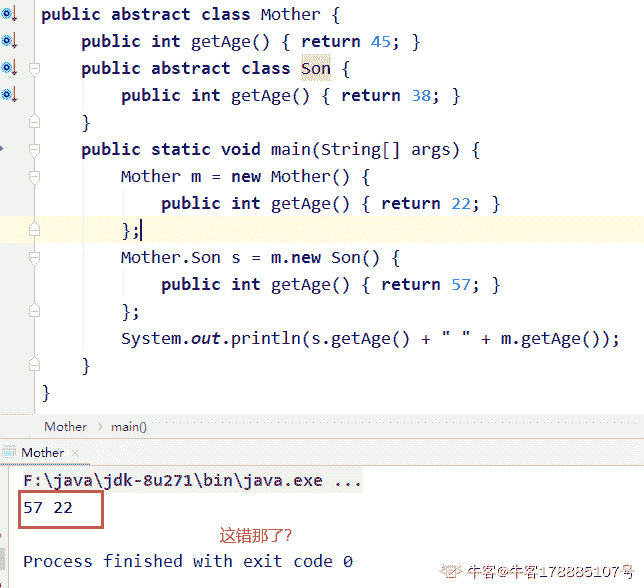

# 百度 2021 校招 Java 研发工程师笔试卷（第二批）

## 1

数据库中的表是数据库最重要的组成部分之一，现假设有关系 S（Sno，SNAME，SAGE），C（Cno，CNAME），SC（Sno，Cno，GRADE），其中 Sno 是学生号，SNAME 是学生姓名，SAGE 是学生年龄， Cno 是课程号，CNAME 是课程名称。要查询选修“ACCESS”课的年龄不小于 20 的全体学生姓名的 SQL 语句是 SELECT SNAME FROM S，C，SC WHERE 子句,则 WHERE 子句的内容是（     ）？

正确答案: A   你的答案: 空 (错误)

```cpp
S.Sno = SC.sno and C.Cno = SC.Cno and SAGE>=20 and CNAME='ACCESS'
```

```cpp
S.Sno = SC.sno and C.Cno = SC.Cno  and SAGE in>=20 and CNAME in 'ACCESS'
```

```cpp
SAGE in>=20 and CNAME in 'ACCESS'
```

```cpp
SAGE>=20 and CNAME=' ACCESS'
```

本题知识点

C++工程师 PHP 工程师 百度 2021 Java 工程师

## 2

若栈 S1 中保存整数，栈 S2 中保存运算符，函数 F()依次执行下述各步操作： （1）从 S1 中依次弹出两个操作数 a 和 b； （2）从 S2 中弹出一个运算符 op； （3）执行相应的运算 b op a； （4）将运算结果压人 S1 中。 假定 S1 中的操作数依次是 3, 9, 3, 2（2 在栈顶），S2 中的运算符依次是*, - , +（+在栈顶）。调 用 3 次 F()后，S1 栈顶保存的值是?

正确答案: A   你的答案: 空 (错误)

```cpp
12
```

```cpp
-12
```

```cpp
9
```

```cpp
-9
```

```cpp
-15
```

本题知识点

C++工程师 PHP 工程师 百度 2021 Java 工程师 前端工程师

## 3

下面关于二叉查找树说法正确的有?

正确答案: A B C   你的答案: 空 (错误)

```cpp
中序遍历得到节点值的序列相同的二棵二叉查找树，它们的前序遍历可能不相同
```

```cpp
中序遍历得到节点值的顺序一定是有序的
```

```cpp
中序遍历得到节点值的序列相同的二棵二叉查找树，它们的树的高度可能不相同
```

```cpp
B 树是一颗二叉查找树
```

本题知识点

C++工程师 PHP 工程师 百度 2021 Java 工程师

## 4

将 IP 地址空间 211.211.1.0/24 划分为 2 个子网，每个子网需分配的 IP 地址数不少于 120 个，请问以下哪 2 个子网划分结果可能是对的?

正确答案: A   你的答案: 空 (错误)

```cpp
子网 1：211.211.1.0/25，子网 2：211.211.1.128/25
```

```cpp
子网 1：211.211.1.0/26，子网 2：211.211.1.128/26
```

```cpp
子网 1：211.211.1.0/25，子网 2：211.211.1.64/25
```

```cpp
子网 1：211.211.1.0/26，子网 2：211.211.1.64/26
```

```cpp
子网 1：211.211.1.0/25，子网 2：211.211.1.128/26
```

本题知识点

C++工程师 PHP 工程师 百度 2021 Java 工程师 前端工程师

讨论

[牛客 178885107 号](https://www.nowcoder.com/profile/178885107)

1、先算前面的子网掩码：属于 C 类网络，对这个网络来说范围是：211.211.1.0-211.211.1.255 通俗理解就是最后是 0-255，也就是 256，那么分为两个子网的话，简单计算就是:256/2=128 所以两个个子网的范围分别是 0-127，128-255 所以两子网掩码为：211.211.1.0211.211.1.1282、算主机地址：
2⁶<120<2⁷,所以取 2⁷，那么主机位地址部门只需要 7 位，前缀就是 32-7=25 这里的 32 是 C 类网络中默认的，用就行所以前缀就是/25

发表于 2021-09-06 09:20:14

* * *

[Nk_Idea_0](https://www.nowcoder.com/profile/642499823)

A 选项：11010011.11010011.00000001.0|xxxxxxx
11010011.11010011.00000001.1|xxxxxxx
C 选项：
11010011.11010011.00000001.1|xxxxxxx
11010011.11010011.00000001.0|001xxxx

发表于 2022-01-26 18:26:17

* * *

[sunlightjl](https://www.nowcoder.com/profile/895731249)

2⁷=128>120，所以主机地址部门只需要 7 位 32-7=25 所以前缀是/25

发表于 2021-08-20 10:15:54

* * *

## 5

某操作系统中，页面大小为 4k，分配给每个进程的物理页面数为 1。在一个进程中，定义了如下二位数组 int A[512][512]，该数组按行存放在内存中，每个元素占 8 个字节。有如下编程方法：编程方法：

```cpp
for (int j = 0; j < 512; j++)
{
    for (int i = 0; i < 512; i++)
    {
        A[i][j] = 0;
    }
}
```

那么以上程序运行会产生多少次缺页?

正确答案: C   你的答案: 空 (错误)

```cpp
0
```

```cpp
512
```

```cpp
512*512
```

```cpp
(512*512)/2
```

```cpp
512*1024
```

本题知识点

C++工程师 PHP 工程师 百度 2021 Java 工程师 前端工程师

## 6

如下代码：

```cpp
public static void main(String[] args) {
  int[] da1 = new int[]{1, 3, 5};
  int[] da2 = new int[]{2, 4, 6};
  System.out.print(da2[da1[0]]);
  interchange(da1, da2);
  System.out.print(da1[da2[0]]);
}
static void interchange(int[] da1, int[] da2) {
  int[] dat = da1;
  da1 = da2;
  da2 = dat;
}
```

请问编译运行的结果是什么？

正确答案: A   你的答案: 空 (错误)

```cpp
45
```

```cpp
54
```

```cpp
抛出一个 ArrayIndexOutOfBoundsException
```

```cpp
12
```

```cpp
43
```

```cpp
23
```

```cpp
[[I@de6ced[[I@de6ced
```

本题知识点

Java 工程师 百度 2021

## 7

如下代码：String str = "I love software engineering!";哪个选项里的代码可以得到 str 里单词的个数？

正确答案: B   你的答案: 空 (错误)

```cpp
str.length();
```

```cpp
str.split(" ").length;
```

```cpp
str.indexOf(" ");
```

```cpp
str.contains(" ");
```

```cpp
str.toCharArray().length;
```

本题知识点

Java 工程师 百度 2021

## 8

给出如下代码片段：

```cpp
class Fat {
  String name = "No name";
  public Fat(String nm) { name = nm; }
}
class Steven extends Fat {
  String weight = "80kg";
  public Steven(String w){ weight = w; }
}
public class FatTest {
  public static void main(String[] args) {
    Steven s = new Steven("90kg");
    System.out.println(s.weight);
  }
}
```

请问编译运行的结果是什么？

正确答案: D   你的答案: 空 (错误)

```cpp
90kg
```

```cpp
80kg
```

```cpp
运行时抛出异常
```

```cpp
编译失败
```

本题知识点

Java 工程师 百度 2021

讨论

[牛客小玮](https://www.nowcoder.com/profile/200045406)

必须要有父类无参构造才能选 A

发表于 2021-09-22 18:03:48

* * *

## 9

给出如下代码：

```cpp
public abstract class Mother {
  public int getAge() { return 45; }
  public abstract class Son {
    public int getAge() { return 38; }
  }
  public static void main(String[] args) {
    Mother m = new Mother() {
      public int getAge() { return 22; }
    };
    Mother.Son s = m.new Son() {
      public int getAge() { return 57; }
    };
    System.out.println(s.getAge() + " " + m.getAge());
  }
}
```

请问程序的输出结果是什么？

正确答案: A   你的答案: 空 (错误)

```cpp
57 22
```

```cpp
45 38
```

```cpp
45 57
```

```cpp
在运行时出现抛出异常
```

```cpp
编译失败
```

本题知识点

Java 工程师 百度 2021

讨论

[牛客 178885107 号](https://www.nowcoder.com/profile/178885107)



发表于 2021-09-06 10:09:42

* * *

## 10

下列关于 Linux 内存管理说法不正确的是()：

正确答案: B   你的答案: 空 (错误)

```cpp

malloc()对应到系统调用上两种实现方式，分别为 brk()和 mmap()来分配

```

```cpp

小块内存（小于 128K）使用 mmap()来分配，大块内存（大于 128K），则直接使用内存映射 brk()

```

```cpp

内存回收的方式有三种：LRU（Least Recently Used）算法，回收缓存；Swap 机制，回收不常访问的匿名页；OOM（Out of Memory）机制，杀掉占用大量内存的进程

```

```cpp

LRU 回收算法维护着 active（记录活跃的内存页）和 inactive（记录非活跃的内存页）两个双向链表

```

```cpp

活跃的内存页和非活跃的内存页可通过查看/proc/meminfo 查询

```

本题知识点

C++工程师 PHP 工程师 百度 2021 Java 工程师

讨论

[牛客 178885107 号](https://www.nowcoder.com/profile/178885107)

malloc 小于 128k 的内存，使用 brk 分配内存。malloc 大于 128 的内存，使用 mmap 分配内存。

发表于 2021-09-06 10:14:36

* * *

## 11

下列关于 linux 命令说法不正确的是()：

正确答案: A   你的答案: 空 (错误)

```cpp

top 可查看 CPU 状态，并且可细分进程的用户态 CPU 和内核态 CPU

```

```cpp

pidstat 可查看用户态 CPU 使用率、内核态 CPU 使用率、运行虚拟机 CPU 使用率、等待 CPU 使用率和总的 CPU 使用率

```

```cpp

iostat 可查看 CPU、网卡、磁盘等设备的活动情况, 负载信息

```

```cpp

vmstat 命令可以报告关于进程、内存、I/O 等系统整体运行状态

```

本题知识点

C++工程师 PHP 工程师 百度 2021 Java 工程师 前端工程师

讨论

[牛客 178885107 号](https://www.nowcoder.com/profile/178885107)

*top* 并没有*细分进程的用户态 CPU 和内核态 CPU*

发表于 2021-09-06 10:18:41

* * *

## 12

有关，说法不正确的是

正确答案: A D   你的答案: 空 (错误)

```cpp
该代码为 php 一句话木马，密码为 cmd
```

```cpp
如若 php 配置不当，该代码可导致直接 getshell
```

```cpp
如果存在该代码的网站具有图片上传功能，也会被 getshell
```

```cpp
该代码可以读取文件，但读取不了 php 文件，会被直接执行
```

本题知识点

Java 工程师 百度 2021 前端工程师

## 13

下面 java 代码求一个比较大的正整数是不是回文数，比如 212 是回文数，返回 true，-212 不是回文数，返回 false，正整数的长度为 N，那么如下代码的时间复杂度以及空间复杂度是多少?

```cpp
public boolean isPalindrome(long x) {
    if (x < 0 || (x % 10 == 0 && x != 0)) {
        return false;
    }

    long tempNum = 0;
    while (x > tempNum) {
        tempNum = tempNum * 10 + x % 10;
        x /= 10;
    }

    return x == tempNum || x == tempNum / 10;
}

```

正确答案: A   你的答案: 空 (错误)

```cpp
O(logN)，O(1)
```

```cpp
O(logN)，O(logN)
```

```cpp
O(N)，O(1)
```

```cpp
O(N)，O(logN)
```

本题知识点

C++工程师 PHP 工程师 百度 2021 Java 工程师 前端工程师

讨论

[山城郴王](https://www.nowcoder.com/profile/462634888)

百度对一个前端工程师要求好高啊：大学必修课的内容都有，三大框架都有一点，还一些算法时空，java 一点点，linux 命令。。。

发表于 2021-12-07 11:22:16

* * *

## 14

下边那个命令可以找到连接到 127.0.0.1:8080 服务上最多 ip

正确答案: A D   你的答案: 空 (错误)

```cpp
netstat -nat | grep "127.0.0.1:8080" |awk '{print $5}'|awk -F: '{print $1}'|sort|uniq -c
```

```cpp
netstat -nat | grep "127.0.0.1:8080" |awk '{print $5}'|awk -F: '{print $1}'|sort -c|sort -nr
```

```cpp
netstat -nat | grep "127.0.0.1:8080" |awk '{print $5}'|sort|uniq -c
```

```cpp
netstat -nat | grep "127.0.0.1:8080" |awk '{print $5}'|awk -F: '{print $1}'|sort|uniq -c|sort -nr
```

本题知识点

Java 工程师 百度 2021 前端工程师

## 15

下列选项中，不可能将当前进程唤醒的事件是?

正确答案: D   你的答案: 空 (错误)

```cpp
I/O 结束
```

```cpp
某进程退出临界区
```

```cpp
某进程释放锁
```

```cpp
当前进程的时间片用完
```

本题知识点

C++工程师 PHP 工程师 百度 2021 Java 工程师

## 16

一个算法的时间复杂度由以下递归方程表示(N 是非常大的整数，且是 2 的幂):(1).T(1)=1(2).T(N)=2T(N/2)+N 请问 T(N)的表达式为多少?

正确答案: B   你的答案: 空 (错误)

```cpp
T(N)=Nlog2N
```

```cpp
T(N)=N+Nlog2N
```

```cpp
T(N)=N2
```

```cpp
T(N)=N+N2
```

```cpp
T(N)=Nlog2N+1
```

本题知识点

C++工程师 PHP 工程师 百度 2021 Java 工程师

讨论

[Cpp&ming-ming](https://www.nowcoder.com/profile/355819713)

求和后为 N+N²-N，即为 N² 啊，不该选 C 吗

发表于 2022-01-09 16:01:51

* * *

## 17

小度遇上了某个需求，求给定两个字符串的最长公共子序列的长度：一个字符串的 子序列 是指这样一个新的字符串：它是由原字符串在不改变字符的相对顺序的情况下删除某些字符（也可以不删除任何字符）后组成的新字符串。
例如，"bad" 是 "baidu" 的子序列，但 "bud" 不是 "baidu" 的子序列。两个字符串的「公共子序列」是这两个字符串所共同拥有的子序列。如输入： ```cpp
text1 = "baidu", text2 = "bad" 
```

输出: 

```cpp
3
```

小度写了如下 C++代码完成了此功能: ```cpp
int dp[1000][1000];
int max(int a,int b)
{
    if(a>b) return a;
    return b;
}

int longestCommonSubsequence(string text1, string text2) {
        int len1=text1.size();
        int len2=text2.size();
        for(int i=0;i<len1;i++){
            for(int j=0;j<len2;j++){
                if(text1[i]==text2[j]){
                    dp[i+1][j+1]=dp[i][j]+1;
                }
                else{
                    dp[i+1][j+1]=__________;
                }
            }
       }
       return dp[len1][len2];
}

```

则以上核心代码填什么可以正确实现此功能? 

正确答案: A   你的答案: 空 (错误)

```cpp
max(dp[i+1][j],dp[i][j+1])
```

```cpp
max(dp[i+1][j],dp[i][j])
```

```cpp
max(dp[i][j+1],dp[i][j])
```

```cpp
max(dp[i-1][j],dp[i][j-1])
```

```cpp
max(dp[i-1][j],dp[i][j])
```

本题知识点

C++工程师 PHP 工程师 百度 2021 Java 工程师

讨论

[周嘉楠](https://www.nowcoder.com/profile/753370440)

A.当两者字符不相等时，当前最长公共子序列等于 max(不算 test1[i]的最长公共子序列，与不算 test2[j]的最长公共子序列) 发表于 2021-07-06 14:50:15

* * *

## 18

已知字符集{ a, b, c, d, e, f }，若各字符出现的次数分别为{ 6, 3, 8, 2, 10, 4 }，若字符 f 对应的哈夫曼编码为 100，则字符 e 对应的哈夫曼编码为？

正确答案: A   你的答案: 空 (错误)

```cpp
11
```

```cpp
10
```

```cpp
101
```

```cpp
110
```

```cpp
01
```

```cpp
无法确定
```

本题知识点

C++工程师 PHP 工程师 百度 2021 Java 工程师

## 19

下面关于 Java 里面的 HashMap 类说法正确的是?

正确答案: B   你的答案: 空 (错误)

```cpp
HashMap 的底层直接由红黑树实现的
```

```cpp
HashMap 非线程安全，即任一时刻可以有多个线程同时写 HashMap，可能会导致数据的不一致
```

```cpp
HashMap 每次扩容都是随机扩容，扩容之后的大小都在原来的容量到原来容量的平方里，这样可以更好的存储元素和不浪费空间
```

```cpp
HashMap 保存了记录的插入顺序，在用 Iterator 遍历 HashMap 时，先得到的记录肯定是先插入的
```

本题知识点

Java 工程师 百度 2021

## 20

有一张挑战赛记录表 Info 表如下，有三个字段 id、name、score，不能选出每个 name 的 score 最高的记录的 sql 是（要包含所有字段）+---------+--------+-------+
|      id |   name | score |
+---------+--------+-------+
|       1 | B      |  9.95 |
|       2 | A      | 10.99 |
|       3 | C      |  1.69 |
|       4 | B      | 19.95 |
|       5 | A      |  6.96 |
+---------+--------+-------+

正确答案: D   你的答案: 空 (错误)

```cpp
select id,name,score
    from Info s1
    where score = (
    select max(s2.score)
    from Info s2
    where s1.name=s2.name); 

```

```cpp
select id,s1.name,s1.score
    from Info s1
    join (
    select name,max(score) score
    from Info
    group by name) s2
    on s1.name=s2.name and s1.score=s2.score;

```

```cpp
select s1.id,s1.name,s1.score
    from Info s1
    left join Info s2
    on s1.name=s2.name and s1.score<s2.score
    where s2.id is null;

```

```cpp
select s1.id,s1.name,s1.score
    from Info s1
    left join Info s2
    on s1.name=s2.name and s1.score>s2.score
    where s2.id is null;

```

本题知识点

Java 工程师 百度 2021

## 21

牛牛所在的学校有个学生.并且学校里面有个食堂,因为每个食堂里面有多个取餐点,所以我们描述第个食堂里面有个窗口可以排队取餐.在吃午饭的时候,每个学生都会等概率的选择一个食堂就餐.而且一个食堂内的学生在排队取餐的过程中,他们都会倾向于使最长的队伍尽可能的短,现在牛牛请你帮他计算出所有食堂内最长队伍长度的期望.

本题知识点

C++工程师 PHP 工程师 百度 2021 Java 工程师

## 22

牛牛是这个赛季的牛王挑战赛的负责人，本赛季一共有  名参赛选手，编号为  ~ ，**初始状态下，每个人都在自己对应编号的候场区域，刚刚开始 1 个候场区域只有 1 个人**，即： 号选手在  号候场区域， 号选手在  号候场区域，以此类推。挑战赛即将开始，每位选手在自己编号相对应的区域候场，每个候场区域都可以看成是一个队列，如果后续还有人进入，则只能排在队伍末尾。由于设备出现了些许问题，所以部分候场区域电压不稳，为了选手能够得到更好的休息，牛牛准备发布若干条指令：关闭某候场区域，同时，该候场区域参赛人员按照顺序依次进入另一个仍然开放的候场区域。
中途，牛牛还希望知道部分参赛选手的候场情况，所以在发布指令的同时，还会进行若干个询问：某两名参赛选手是否在同一个候场区域？如果在同一个候场区域，那么他们之间间隔了几名参赛选手？

本题知识点

Java 工程师 百度 2021 前端工程师

讨论

[JCoder](https://www.nowcoder.com/profile/1405380)

改装并查集，对于每个窗口都维护一个队尾，合并的时候直接追加到队尾，在 find 的时候利用类似于差分的思想，一边路径压缩，一边求深度，注意深度的差值不等于 0 的时候要减一，因为求的是隔着几个人。

```cpp
#include <bits/stdc++.h>
using namespace std;

int fa[100005];
int la[100005];
int w[100005];
int n, m;

int uf_find(int x) {
    if (fa[x] != x) {
        int _fa = fa[x];
        fa[x] = uf_find(fa[x]);
        w[x] += w[_fa];
    }

    return fa[x];
}

int main() {
    scanf("%d%d", &n, &m);
    for (int i = 1; i <= n; i++) {
        fa[i] = la[i] = i;
        w[i] = 0;
    }

    while (m--) {
        int a, b;
        char c;
        getchar();
        scanf("%c %d %d", &c, &a, &b);
        if (c == 'C') {
            fa[a] = la[b];
            la[uf_find(b)] = la[a];
            w[a] = 1;
        }
        else {
            if (uf_find(a) == uf_find(b)) {
                printf("%d\n", max(0, abs(w[a] - w[b]) - 1));
            }
            else {
                printf("-1\n");
            }
        }
    }

    return 0;
}
```

编辑于 2021-08-17 18:26:58

* * *

## 23

牛牛任职于一家演艺公司，这一天，他率领着一共  个小伙伴去某知名剧组面试，在戏中，往往以戏份多少来定义角色的重要性。

现在，这  个小伙伴对自己都有一个定位，想要拿一个多少戏份的角色。假设将戏份多少量化，以  ~  来衡量，那么也就是说，每个人在心中都有一个指标，自己签订的合约角色戏份绝对不能少于这个指标。

在  个小伙伴都进入剧组面试之后，牛牛得到该剧组剩余  个角色的戏份值，现在，牛牛想提前知道，对于每个人而言，一共有多少个角色是满足要求的。

本题知识点

Java 工程师 百度 2021

讨论

[牛客 178885107 号](https://www.nowcoder.com/profile/178885107)

跟着大佬的代码敲的，我只能把每一行代码是个啥意思理一下。

```cpp
import java.util.*;
public class Main{
    public static void main(String[] args){
        Scanner sc = new Scanner(System.in);
        int num = sc.nextInt();//输入需要测试的组数
        //对每一组单独进行循环
        for(int count=0; count<num; count++){
            int numOfPerson = sc.nextInt();//输入小伙伴人数
            sc.nextLine();//声明下面两行要输入的字符串
            //接收用户输入的小伙伴期望的戏份时长的字符串，并将其转换为数组
            int[] arrPerson = Arrays.stream(sc.nextLine().split(" ")).mapToInt(Integer::parseInt).toArray();
            //接收用户输入的剧组还有的戏份时长的字符串，并将其转换为数组
            int[] movie = Arrays.stream(sc.nextLine().split(" ")).mapToInt(Integer::parseInt).toArray();

            int[] result = new int[numOfPerson];//新建一个数组来存放答案，长度与小伙伴人数一样
            //开始进行匹配
            Arrays.sort(movie);//对 movie 数组中的数据进行从小到大排序
            //使用二分法进行循环
            //原理就是将 arrPerson[i]与排序后的 movie 使用二分法比较找到左边界
            for(int i=0; i<numOfPerson; i++){
                int l = 0;
                int r = movie.length-1;
                while(l<=r){
                    int mid = l+(r-l)/2;
                    if(arrPerson[i]<=movie[mid])
                        r=mid-1;
                    if(arrPerson[i]>movie[mid])
                        l=mid+1;
                }
                result[i] = movie.length-l;//数组长度-左边界，得到所有大于 arrPerson[i]的个数
            }
            //现在拿到了结果数组 result[]，将数组转换成字符串输出
             StringBuilder sb = new StringBuilder();
             for(int j=0; j<numOfPerson; j++){
                 sb.append(result[j]+" ");
             }
             //删除最后一位数字后面的空格，因为添加数字的时候格式是【数字+空格】
             sb.deleteCharAt(sb.length()-1);
             System.out.println(sb.toString());
        }
    }
}
```

编辑于 2021-09-06 17:06:53

* * *

[JCoder](https://www.nowcoder.com/profile/1405380)

1000³ 本来是过不去的，c++纯暴力就能过 java py 哪怕用 nlogn 或者 On 的复杂度都不行三种做法：planA ：纯暴力，复杂度 O(T*n*m)，c++ 500+ms java,python 超时 planB ：两个数组全部排序，然后类似于合并有序数组那样去两序列双指针复杂度 O(T*(nlogn + mlogm)) c++ 400+ms java,python 超时

```cpp
#include <bits/stdc++.h>
using namespace std;

int T, n, m, b[1005], ans[1005];
pair<int, int> a[1005];
int main() {
    scanf("%d", &T);
    while (T--) {
        scanf("%d%d", &n, &m);
        for (int i = 0; i < n; i++) {
            scanf("%d", &a[i].first);
            a[i].second = i;
        }
        for (int i = 0; i < m; i++) {
            scanf("%d", &b[i]);
        }
        sort(a, a + n);
        sort(b, b + m);
        memset(ans, 0, sizeof ans);
        int i = 0, j = 0;
        while (i < n && j < m) {
            if (a[i].first <= b[j]) {
                ans[a[i].second] = m - j;
                i++;
            }
            else {
                j++;
            }
        }
        for (int k = 0; k < n; k++) {
            if (k) {
                printf(" ");
            }
            printf("%d", ans[k]);
        }
        printf("\n");
    }

    return 0;
}
```

planC ：利用 a[i] 和 b[i] 的数据范围很小（<100） 的特点，统计每个 b[i] 的数量，然后逆序求出后缀和 cnt[]，cnt[i] 代表 大于等于 i 的数字有 cnt[i] 个，然后遍历 a[i] 直接 O1 得到答案复杂度 O(T*(n + m)) c++ 300+ms java python 超时 但是 python 能过 7 组样例 java 一组都过不去

```cpp
#include <bits/stdc++.h>
using namespace std;

int T, n, m, k, a[1005], cnt[105];
int main() {
    scanf("%d", &T);
    while (T--) {
        scanf("%d%d", &n, &m);
        memset(cnt, 0, sizeof cnt);
        for (int i = 0; i < n; i++) {
            scanf("%d", &a[i]);

        }
        for (int i = 0; i < m; i++) {
            scanf("%d", &k);
            cnt[k]++;
        }
        for (int i = 99; i >= 1; i--) {
            cnt[i] += cnt[i + 1];
        }
        for (int i = 0; i < n; i++) {
            if (i) {
                printf(" ");
            }
            printf("%d", cnt[a[i]]);
        }
        printf("\n");
    }

    return 0;
}
```

编辑于 2021-08-30 12:12:05

* * *