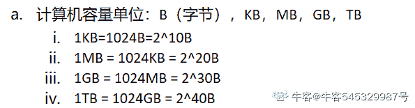

# 百度 2021 校招 Java 研发工程师笔试卷（第三批）

## 1

给定 n 个权值作为 n 个叶子节点，构造一棵二叉树，若该树的带权路径长度达到最小，这样的二叉树为最优二叉树，也称为哈夫曼树(Huffman Tree)，哈夫曼树是带权路径长度最短的树，权值较大的结点离根较近，若一个哈夫曼树有 N 个叶子节点，则其节点总数为（  ）

正确答案: B   你的答案: 空 (错误)

```cpp
不确定
```

```cpp
2N-1
```

```cpp
2N+1
```

```cpp
2N
```

本题知识点

C++工程师 PHP 工程师 百度 2021 Java 工程师 前端工程师

讨论

[徐凤年 201809042100959](https://www.nowcoder.com/profile/782656048)

哈夫曼新增节点，就是在两两之间新增，也就是新增 N-1 个节点，加起来 2N-1

发表于 2021-08-21 01:11:05

* * *

[不偏.](https://www.nowcoder.com/profile/86463628)

比如一开始，只有两个节点来，构建哈夫曼树，那么选择量小造新树 h 就会产生一个三个节点的数。也就是 2N-1

发表于 2021-08-12 19:10:20

* * *

## 2

AVL 树是平衡二叉查找树，在 AVL 树中任何节点的两个子树的高度最大差别为 1，现有一结点序列（100，70，50，80，90，60），逐个插入一颗空的 AVL 树，插入过程中，树不断调整，则在上述情境下，分析正确的是（  ）

正确答案: B   你的答案: 空 (错误)

```cpp
树中插入 90 时，破坏平衡了，需要进行 RL 调整
```

```cpp
树中插入 90 时，破坏平衡了，需要将 90 变为 100 和 80 的父节点
```

```cpp
树中插入 50 时，破坏平衡了，需要将 50 变为 70 的父节点
```

```cpp
树中插入 80 时，破坏平衡了，需要将 80 变为 100 的父节点
```

```cpp
树中插入 90 时，破坏平衡了，需要将 80 变为根节点，90 和 100 变为 80 的右孩子
```

本题知识点

C++工程师 PHP 工程师 百度 2021 Java 工程师

讨论

[杂货店的阿猿](https://www.nowcoder.com/profile/440731268)


发表于 2022-02-26 22:37:20

* * *

[继续春招](https://www.nowcoder.com/profile/929254462)

90 的发现者的在最低点祖先节点，100 的左子树的右边，故是 LR 调整，先右单旋，再左单旋，
原来为:                    100
                  /
                80
                      \
                        90
失衡最小祖先为 100，故先 80(100 的子树)右旋调整，变为         100        /    90
    /80 失衡最小祖先为 100，故先 90(100 的子树)左左旋为         90
        /    \
      80     100

发表于 2021-08-13 16:26:14

* * *

## 3

分页存储管理将进程的逻辑地址空间分成若干个页，并为各页加以编号，从 0 开始，若某一计算机主存按字节编址，逻辑地址和物理地址都是 32 位，页表项大小为 4 字节，若使用一级页表的分页存储管理方式，逻辑地址结构为页号（20 位），页内偏移量（12 位），则页的大小是（  ）？页表最大占用（  ）？

正确答案: A   你的答案: 空 (错误)

```cpp
4KB，4MB
```

```cpp
5KB，5MB
```

```cpp
6KB，6MB
```

```cpp
7KB，7MB
```

本题知识点

C++工程师 PHP 工程师 百度 2021 Java 工程师 前端工程师

讨论

[敲了个锤子](https://www.nowcoder.com/profile/80190292)

地址长度为 32 位，其中 0~11 位为页内地址（即页内偏移量），2¹² 即每页大小为 4KB；同样地，12~31 位为页号，地址空间最多允许有 2²⁰ = 1M 页，又页表项 4 字节， 所以页表最大占用 1M * 4 = 4MB 发表于 2021-09-24 12:08:34

* * *

[机智的路易](https://www.nowcoder.com/profile/747109063)

页内偏移量（12 位）= 页大小 2¹² = 4KB

发表于 2022-03-21 15:13:44

* * *

[牛客 545329987 号](https://www.nowcoder.com/profile/545329987)



发表于 2022-03-19 20:31:34

* * *

## 4

后序遍历为二叉树遍历方式中的一种，假设将{ 3, 8, 9, 1, 2, 6 }依次插入初始为空的二叉排序树。则该树的后序遍历结果是多少（    ）？

正确答案: B   你的答案: 空 (错误)

```cpp
1, 2, 8, 6, 9, 3
```

```cpp
2, 1, 6, 9, 8, 3
```

```cpp
1, 2, 3, 6, 9, 8
```

```cpp
2, 1, 3, 6, 9, 8
```

本题知识点

C++工程师 PHP 工程师 百度 2021 Java 工程师 前端工程师

讨论

[洒下句点](https://www.nowcoder.com/profile/56029131)

A

发表于 2021-09-16 10:24:12

* * *

[linc_c](https://www.nowcoder.com/profile/819544946)

二叉排序树要么是空[二叉树](http://c.biancheng.net/view/3384.html)，要么具有如下特点：

*   二叉排序树中，如果其根结点有左子树，那么左子树上所有结点的值都小于根结点的值；
*   二叉排序树中，如果其根结点有右子树，那么右子树上所有结点的值都大小根结点的值；
*   二叉排序树的左右子树也要求都是二叉排序树；

发表于 2021-09-08 12:45:14

* * *

[牛客 360871401 号](https://www.nowcoder.com/profile/360871401)

（1）先(根)序遍历（根左右）

（2）中(根)序遍历（左根右）

（3）后(根)序遍历（左右根）

发表于 2021-07-15 15:54:58

* * *

## 5

JVM 将堆分成了两个大区：新生代（Young）和老年代（Old），新生代又被进一步划分为 Eden 和 Survivor 区，其中 Young 区划分为 Eden、Survivor1、Survivor2 这三块，请问 JVM 的 hotspot 虚拟机三块默认分配的比例各是多少（）

正确答案: B   你的答案: 空 (错误)

```cpp
6:2:2
```

```cpp
8:1:1
```

```cpp
4:3:3
```

```cpp
8:1:2
```

本题知识点

Java 工程师 百度 2021

讨论

[南知忘](https://www.nowcoder.com/profile/629571563)

b 默认为 8：1：1

发表于 2021-06-15 14:28:28

* * *

[lh-jiezhou](https://www.nowcoder.com/profile/3848158)

新生代（Young）和老年代（Old）1:2Young 区划分为 Eden、SurvivorFrom、SurvivorTo  8:1:1 

发表于 2021-08-17 20:26:40

* * *

## 6

执行以下命令后，哪个服务最可能受影响：iptables -A INPUT -i eth0 -s 10.0.0.0/24 -p tcp --dport 22 -j DROP

正确答案: A   你的答案: 空 (错误)

```cpp
sshd
```

```cpp
mysqld
```

```cpp
redis-server
```

```cpp
httpd
```

本题知识点

C++工程师 PHP 工程师 百度 2021 Java 工程师

讨论

[lh-jiezhou](https://www.nowcoder.com/profile/3848158)

端口 22

发表于 2021-08-17 20:25:28

* * *

## 7

假设系统中有 7 个同类资源,进程 P1、P2 和 P3 需要的资源数分别为 6、5 和 2 。现在 P1、P2 和 P3 已申请到的资源数分别为 3、2 和 1，则执行安全性检测算法的结果是

正确答案: A   你的答案: 空 (错误)

```cpp
不存在安全序列，系统处于不安全状态
```

```cpp
存在多个安全序列，系统处于安全状态
```

```cpp
存在唯一安全序列 P3、P1、P2，系统处于安全状态
```

```cpp
存在唯一安全序列 P3、P2、P1，系统处于安全状态
```

本题知识点

C++工程师 PHP 工程师 百度 2021 Java 工程师

讨论

[牛客 884272626 号](https://www.nowcoder.com/profile/884272626)

一个资源给 p3，p3 运行完，释放 2 个，p1 和 p2 都满足不了，发生死锁。

发表于 2021-08-04 22:14:18

* * *

[机智的路易](https://www.nowcoder.com/profile/747109063)

|   | 需要的资源 | 初始 | 分配 |   |
| p1 | **6** | 3  | 3 | 3 |
| p2 | **5** | 2  | 2 | 2 |
| p3 | **4** | 1 | 1+1 | 0 |

死锁
 发表于 2022-03-21 15:10:21

* * *

[牛客 441912538 号](https://www.nowcoder.com/profile/441912538)

根据题目，以分配 6 个资源，还剩 1 个空余资源，条件最容易满足的是 P3，P3 满足后可以运行释放 2 个资源，但是 2 个资源都不能满足 P1 和 P2

发表于 2022-02-13 21:28:51

* * *

## 8

在含 N 个节点、高度为 H 的二叉查找树(BST)中进行查找的最坏时间复杂度为?

正确答案: A   你的答案: 空 (错误)

```cpp
O(H)
```

```cpp
O(1)
```

```cpp
O(N)
```

```cpp
O(NH)
```

```cpp
O(N/H)
```

本题知识点

C++工程师 PHP 工程师 百度 2021 Java 工程师

讨论

[不偏.](https://www.nowcoder.com/profile/86463628)

画一个最简单的，只有两个节点的二分查找树，述。

发表于 2021-08-12 19:13:04

* * *

[値言](https://www.nowcoder.com/profile/566984035)

这个 O(N)或者 O(H)应该都可以吧？

发表于 2022-03-20 23:29:15

* * *

[我很菜 123](https://www.nowcoder.com/profile/823190433)

最坏的情况不是单链表然后时间复杂度为 O（N）吗？或者 O（H+1）？求解答🙂

发表于 2022-02-20 12:08:07

* * *

## 9

下面答案可能正确的是

```cpp
import java.util.Hashtable;
import java.util.Iterator;
import java.util.Map;
public class NowCoder {
    public static void main(String[] args) {
        String key = null;
        Integer value = null;
        Hashtable table = new Hashtable();
        key="3";value=4;
        table.put(key, value);
        key="2";value=2;
        table.put(key, value);
        key="3";value=2;
        table.put(key, value);
        iteratorEntryset(table);
    }
    private static void iteratorEntryset(Hashtable table) {
        if (table == null)
            return ;
        String key = null;
        Integer integer = null;
        Iterator iter = table.entrySet().iterator();
        while(iter.hasNext()) {
            Map.Entry entry = (Map.Entry)iter.next();
            key = (String)entry.getKey();
            integer = (Integer)entry.getValue();
            System.out.println(key+" -- "+integer.intValue());
        }
    }
}
```

正确答案: B   你的答案: 空 (错误)

```cpp
3 -- 4
2 -- 2

```

```cpp
3 -- 2
2 --2

```

```cpp
3 -- 4
3--2

```

```cpp
3-- 4
2 --2
3 -- 2

```

本题知识点

Java 工程师 百度 2021

讨论

[lh-jiezhou](https://www.nowcoder.com/profile/3848158)

Hashtable 不允许重复 key;value 会被覆盖

发表于 2021-08-17 20:24:39

* * *

## 10

```cpp
void waitForSignal() {
  Object obj = new Object();
  synchronized (Thread.currentThread()) {
    obj.wait();
    obj.notify();
  }
}
```

以下哪一个描述是正确的？

正确答案: A   你的答案: 空 (错误)

```cpp
需要处理 InterruptedException。
```

```cpp
代码能编译但可能运行时抛出 IllegalStateExcepion。
```

```cpp
运行 10 分钟后代码抛出 TimeOutException。
```

```cpp
需要把 obj.wait()替换为((Thread) obj).wait()后代码才能通过编译。
```

```cpp
把 obj.wait()和 obj.notify()这两句调换一下位置，能使代码执行。
```

本题知识点

Java 工程师 百度 2021

讨论

[仿生佛能度电子鬼吗](https://www.nowcoder.com/profile/430087014)

抛 InterruptedException 的方法有：

*   java.lang.Object 类的 wait 方法

*   java.lang.Thread 类的 sleep 方法

*   java.lang.Thread 类的 join 方法

发表于 2021-07-14 13:25:07

* * *

## 11

代码片段：

```cpp
import java.util.*;
//这里省略部分代码
HashMap props = new HashMap();
props.put("hello", "javaer");
props.put("welcome", "to java contest");
props.put("wish", "you have a good grade");
Set s = props.keySet();
//在这里插入代码
System.out.println(s);
```

插入哪一个选项里的代码能够使程序对 props 里的键进行排序并输出。

正确答案: D   你的答案: 空 (错误)

```cpp
Arrays.sort(s);
```

```cpp
Collections.sort(s);
```

```cpp
s = new SortedSet(s);
```

```cpp
s = new TreeSet(s);
```

```cpp
不用插入任何代码。
```

本题知识点

Java 工程师 百度 2021

讨论

[牛客 884272626 号](https://www.nowcoder.com/profile/884272626)

SortedSet 是接口

发表于 2021-08-04 22:17:30

* * *

## 12

下列关于 Spring 中 BeanFactory 与 ApplicationContext 的比较，说法错误的是？

正确答案: C   你的答案: 空 (错误)

```cpp
ApplicationContext 在 BeanFactory 的基础上添加了 Spring 事件处理机制
```

```cpp
ApplicationContext 在 BeanFactory 的基础上添加了国际化功能
```

```cpp
多个 ApplicationContext 之间可以具有父子关系，多个 BeanFactory 之间也可以具有父子关系
```

```cpp
ApplicationContext 中对于 Bean 的依赖注入(即对于 getBean()方法的调用)是委托给 BeanFactory 来实现的
```

本题知识点

Java 工程师 百度 2021

讨论

[Decade_](https://www.nowcoder.com/profile/534829948)

BeanFactory 是一个接口，多个 BeanFactory 之间是实现关系并非父子关系

发表于 2021-09-01 16:45:32

* * *

## 13

下列关于 linux 命令说法正确的是（）：

正确答案: B C D   你的答案: 空 (错误)

```cpp
uptime 可查看过去一分钟、五分钟、十分钟的平均负载情况
```

```cpp
grep 'model name' /proc/cpuinfo | wc -l 可查看 CPU 逻辑核数
```

```cpp
pidstat 可查看进程的 CPU、内存、I/O 以及上下文切换等性能指标
```

```cpp
stress 可作为 linux 系统压力测试工具
```

本题知识点

Java 工程师 百度 2021 前端工程师

讨论

[lh-jiezhou](https://www.nowcoder.com/profile/3848158)

uptime:它依次显示下列信息：当前时间、系统已经运行了多长时间、有多少登陆用户、系统在过去的 1 分钟、5 分钟和 15 分钟内的平均负载。20:21:23 up 14 days,  3:16,  2 users,  load average: 0.08, 0.06, 0.01 

发表于 2021-08-17 20:23:12

* * *

## 14

CSRF 漏洞全称为 Cross-site request forgery（跨站请求伪造）攻击者诱导受害者进入第三方网站，在第三方网站中，向被攻击网站发送跨站请求。现有 A 网站、B 网站和 C 网站，其中 A 网站和 C 网站存在 CSRF 漏洞但并没有其他漏洞，B 网站存在一些高危漏洞，如果想利用 CSRF 漏洞攻击 A 网站，攻击链可能是一下哪种方式？

正确答案: B   你的答案: 空 (错误)

```cpp
利用 CSRF 漏洞直接攻击 A 网站
```

```cpp
先攻击 B 网站，再通过 B 网站向 A 网站发起 CSRF 攻击
```

```cpp
先攻击 C 网站，再通过 C 网站向 A 网站发起 CSRF 攻击
```

```cpp
先攻击 B 网站，再通过 B 网站攻击 C 网站，最后通过 C 网站向 A 网站发起 CSRF 攻击
```

本题知识点

Java 工程师 百度 2021 前端工程师

## 15

以下哪种方法可以用来清理僵尸进程()

正确答案: C   你的答案: 空 (错误)

```cpp
向僵尸进程发送 SIGKILL 信号
```

```cpp
向 init 进程发送 SIGKILL 信号
```

```cpp
向僵尸进程的父进程发送 SIGKILL 信号
```

```cpp
向僵尸进程发送 SIGCHILD 信号
```

本题知识点

C++工程师 PHP 工程师 百度 2021 Java 工程师 前端工程师

讨论

[zvorebri](https://www.nowcoder.com/profile/6689254)

清理僵尸线程：把父进程杀掉，父进程死后，僵尸进程称为“孤儿进程”，过继给 1 号进程 init，init 始终负责清理僵尸进程，它产生的所有僵尸进程跟着消失

发表于 2021-08-16 15:54:11

* * *

## 16

给定 Person 表包含所有球员的个人信息，有 Id（序号）, Name(姓名)，Height（身高） 和 TeamId(球队编号)。

+----+-------+--------+--------------+
| Id | Name  | Height | TeamId         |
+----+-------+--------+--------------+
| 1  | Bob   | 201      | 1            |
| 2  | Jerry | 199      | 2            |
| 3  | Tim   | 197      | 2            |
| 4  | Rall  | 200      | 1            |
| 5  | Harry | 189      | 3            |
| 6  | Jon   | 207      | 3            |
| 7  | Arran | 200      | 1            |
+----+-------+--------+--------------+
给定 Team 表包含有球队的信息，有 Id（序号）, TeamName（球队名称)。

+----+----------+
| Id | TeamName |
+----+----------+
| 1  | BigSun   |
| 2  | King        |
| 3  | Apply    |
+----+----------+

下面哪条 SQL 可以查找出每个球队中身高最高的队员信息：
注：根据上述给定的表，可得出：Bob、Jerry、Jon 分别在 BigSun、King、Apply 队中身高最高。
+----------+-------+--------+
| TeamName | Name  | Height |
+----------+-------+--------+
| BigSun   | Bob   |    201 |
| King     | Jerry |    199 |
| Apply    | Jon   |    207 |
+----------+-------+--------+

正确答案: A   你的答案: 空 (错误)

```cpp
select Team.TeamName as 'TeamName', Person.Name as 'Name', Height
from Person join Team on Person.TeamId = Team.Id
where (Person.TeamId, Height) in (select TeamId, max(Height) from Person group by TeamId);

```

```cpp
select d.TeamName as TeamName,e.Name as Name,max(e.Height) as Height from Person e inner join Team d on e.TeamId=d.Id group by e.TeamId;
```

```cpp
select a.TeamName TeamName,b.Name Name,b.Height Height from Team a left join (select max(Height) Height,TeamId,Name from Person group by TeamId) b on b.TeamId=a.Id;
```

```cpp
select a.TeamName TeamName,b.Name Name,b.Height Height from Team a right join (select max(Height) Height,TeamId,Name from Person group by TeamId) b on b.TeamId=a.Id;
```

本题知识点

Java 工程师 百度 2021

讨论

[Decade_](https://www.nowcoder.com/profile/534829948)

我试过了，B 也能跑出来正确结果啊，为什么错了？

发表于 2021-09-01 16:34:06

* * *

## 17

已知 B 类地址的子网掩码为 255.255.0.0，假设某 B 类地址为 127.24.36.55，那么它的网络号为:

正确答案: A   你的答案: 空 (错误)

```cpp
127.24.0.0
```

```cpp
0.0.36.55
```

```cpp
255.255.36.55
```

```cpp
127.24.36.55
```

本题知识点

C++工程师 PHP 工程师 百度 2021 Java 工程师 前端工程师

讨论

[TateTang](https://www.nowcoder.com/profile/1862380)

步骤一：首先将网络的 IP 地址和子网掩码都转换成 32 位二进制字符。
步骤二：将转换后的二进制的 IP 地址和子网掩码进行“逻辑与”运算，得到新的 32 位二进制字符。
步骤三：把得到的新的 32 位二进制字符转换成十进制，就是主机的网络号了。本机 IP 为 127.24.36.55，子网掩码为 255.255.0.0
转换成二进制：
本机 IP 为 01111111.00011000.00100100.00110111
子网掩码 11111111.11111111.00000000.00000000
进行“与运算“ 01111111.00011000.00000000.00000000
转换成十进制：127.24.0.0
即 127.24.0.0 为主机的网络号。 

发表于 2021-11-29 17:05:25

* * *

[牛客 855150961 号](https://www.nowcoder.com/profile/855150961)

B 类子网掩码是 255.255.0.0 网络号不就是指前面的 255.255 吗。

发表于 2021-11-17 12:16:18

* * *

## 18

小牛刚刚学习算法，想用动态规划来实现爬楼梯问题：n 阶楼梯每次可以爬 1 或 2 个台阶，让你实现如下代码，来判断总共有多少种方法呢:()int climbStairs(int n) {vector<int>dp(n+3,0);dp[1] = 1;dp[2] = 2;for(int i = 3; i<=n; i++){_____________________}return dp[n];}

正确答案: B   你的答案: 空 (错误)

```cpp
dp[i]=dp[i]+dp[i-2];
```

```cpp
dp[i]=dp[i-1]+dp[i-2];
```

```cpp
dp[i]=max(dp[i],dp[i-1]);
```

```cpp
dp[i]=max(dp[i-1],dp[i-2]);
```

本题知识点

C++工程师 PHP 工程师 百度 2021 Java 工程师 前端工程师

## 19

以下代码中，N 足够大，试分析“cnt++”执行的次数最接近于 ___ 次

```cpp
int test(int N)
{
    int cnt = 0;
    for (int i = 1; i <= N; i++)
    {
        for (int j = 1; j <= 8 * i; j++)
        {
            cnt++;
        }
    }
    return cnt;
}

```

正确答案: D   你的答案: 空 (错误)

```cpp
N2
```

```cpp
2N2
```

```cpp
3N2
```

```cpp
4N2
```

```cpp
8N2
```

本题知识点

C++工程师 PHP 工程师 百度 2021 Java 工程师 前端工程师

讨论

[牛客 354281430 号](https://www.nowcoder.com/profile/354281430)

直观点，这就是一个微积分问题——求阴影空间的面积问题。直观看过去，将 i 理解为 x，j 理解为 y，于是可得知，j 的最大取值随 i 的变化公式为 y=8x，即 max（j）=8i 在第二层循环中，cnt 的增加次数相当于从 1 到 max（j）的次数。于是，当横坐标取 i=N，纵坐标=max（j）=8N，i 取 1~N，所以 cnt 增加次数为 8~8N，三角形面积=4N²

发表于 2021-09-06 13:47:12

* * *

[想要找到好工作](https://www.nowcoder.com/profile/67219244)

i=1：第二层循环执行 8*1 次 i=2：第二层循环执行 8*2 次……i=N：第二层循环执行 8*N 次总共需执行 8*1+8*2+...8*N=8*(1+2+...+N)=8*(N+N*(N-1)/2)=4N²+4N 次

发表于 2021-07-26 17:52:09

* * *

[缄默斯](https://www.nowcoder.com/profile/998590184)

(8+8n)*n/2 约等于 4n² 等差数列

发表于 2022-03-14 10:38:19

* * *

## 20

这里有一张员工信息表（只展示了部分数据，数据格式类似）
+-------+---------------+-------+
|   id  |   language    | name  |
+-------+---------------+-------+
|   1   |   C++         | MA    |
|   2   |   C++         | VA    |
|   3   |   Go          | VC    |
|   4   |   Python      | MB    |
|   5   |   Php         | VA    |
+-------+---------------+-------+
查询哪些员工会使用 3 种及以上的编程语言

正确答案: D   你的答案: 空 (错误)

```cpp
select name,count(*) as count from info  having count > 2 order by count desc;
```

```cpp
select name,count(*) as count from info group by name and count > 2 order by count desc;
```

```cpp
select name,count(*) as count from info group by name where count >= 2 order by count desc;
```

```cpp
select name,count(*) as count from info group by name having count > 2 order by count desc;
```

本题知识点

C++工程师 PHP 工程师 百度 2021 Java 工程师