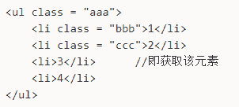

# 百度 2021 校招 Web 前端研发工程师笔试卷（第一批）

## 1

某主机的 IP 地址为 212.212.77.55，子网掩码为 255.255.252.0。若该主机向其所在子网发送广播分组，则目的地址可以是？

正确答案: D   你的答案: 空 (错误)

```cpp
212.212.76.255
```

```cpp
212.212.77.255
```

```cpp
212.212.78.255
```

```cpp
212.212.79.255
```

```cpp
212.212.80.255
```

本题知识点

C++工程师 PHP 工程师 百度 2021 Java 工程师 前端工程师

讨论

[⊱r=a（1-sinx）♒](https://www.nowcoder.com/profile/646955188)

子网掩码 252，即 11111100，而后两位和第四部分是子网，而广播地址是子网号全为 1，主网号不变。因此 212.212.77.55，即 212.212.（100011-01）.55                广播号：212.212.    100011-11.255 即 212.212.79.255

发表于 2021-09-07 15:21:44

* * *

[oceanao](https://www.nowcoder.com/profile/3461356)

正确答案：D 题目解析：
由子网掩码可知前 22 位为子网号、后 10 位为主机号。IP 地址的第 3 个字节为 010011 01 ，后面 2 位是主机号，将主机号全置为 1，可得广播地址为 180.80.79.255

发表于 2021-09-07 19:00:25

* * *

[vaakian](https://www.nowcoder.com/profile/309934583)

主机号为后 10 为，该 ip 后 10 为广播地址全置 0 即 11.11111111，即得到答案。

发表于 2021-09-12 23:57:16

* * *

## 2

小牛在学习了二叉树三种遍历方式后，自己发明了一直与中序遍历相反的遍历方式，称为"反中序遍历"，中序遍历的遍历方式为左孩子->根节点->右孩子，他发明的"反中序遍历"遍历方式为右孩子->根节点->左孩子，那么使用他发明的"反中序遍历"遍历如下图的二叉树，输出的节点应为? 

正确答案: A   你的答案: 空 (错误)

```cpp
3，1，7，5，6，2，4
```

```cpp
3，1，5，7，2，6，4
```

```cpp
3，1，2，7，5，6，4
```

```cpp
3，1，7，5，2，6，4
```

```cpp
3，1，4，2，6，5，7
```

本题知识点

C++工程师 PHP 工程师 百度 2021 Java 工程师 前端工程师

## 3

下列程序的运行结果是什么？function getPersonInfo (one, two, three) {console.log(one)console.log(two)console.log(three)}const person = 'Lydia'const age = 21getPersonInfo `${person} is ${age} years old`

正确答案: B   你的答案: 空 (错误)

```cpp
“Lydia” 21 [“”,  “ is ”,  “ years old”]
```

```cpp
[“”, “ is ”, “ years old”] “Lydia” 21
```

```cpp
“Lydia” [“”, “ is ”, “ years old”] 21
```

```cpp
Reference Error
```

本题知识点

前端工程师 百度 2021

讨论

[uesugieriislf](https://www.nowcoder.com/profile/34068835)

[`es6.ruanyifeng.com/#docs/string#%E6%A0%87%E7%AD%BE%E6%A8%A1%E6%9D%BF`](https://es6.ruanyifeng.com/#docs/string#%E6%A0%87%E7%AD%BE%E6%A8%A1%E6%9D%BF)又是 es6，标签模板，又忘记了

标签模板其实不是模板，而是函数调用的一种特殊形式。“标签”指的就是函数，紧跟在后面的模板字符串就是它的参数。

但是，如果模板字符里面有变量，就不是简单的调用了，而是会将模板字符串先处理成多个参数，再调用函数。

```cpp
let a = 5; let b = 10; tag`Hello ${ a + b } world ${ a * b }`; // 等同于 tag(['Hello ', ' world ', ''], 15, 50); 
```

上面代码中，模板字符串前面有一个标识名 tag，它是一个函数。整个表达式的返回值，就是 tag 函数处理模板字符串后的返回值。

函数 tag 依次会接收到多个参数。

```cpp
function tag(stringArr, value1, value2){ // ... }  // 等同于  function tag(stringArr, ...values){ // ... } 
```

tag 函数的第一个参数是一个数组，该数组的成员是模板字符串中那些没有变量替换的部分，也就是说，变量替换只发生在数组的第一个成员与第二个成员之间、第二个成员与第三个成员之间，以此类推。

tag 函数的其他参数，都是模板字符串各个变量被替换后的值。由于本例中，模板字符串含有两个变量，因此 tag 会接受到 value1 和 value2 两个参数。

tag 函数所有参数的实际值如下。

*   第一个参数：['Hello ', ' world ', '']
*   第二个参数: 15
*   第三个参数：50

也就是说，tag 函数实际上以下面的形式调用。

```cpp
tag(['Hello ', ' world ', ''], 15, 50) 
```

发表于 2021-06-23 16:44:25

* * *

## 4

若数据元素序列 9，10，11，5，6，7，12，3，4 是采用下列排序方法之一得到的 第二趟升序排序后的结果，则该排序算法只能是? 正确答案: B   你的答案: 空 (错误)

```cpp
冒泡排序
```

```cpp
插入排序
```

```cpp
选择排序
```

```cpp
二路归并排序
```

本题知识点

C++工程师 PHP 工程师 百度 2021 前端工程师

讨论

[牛客 906400277 号](https://www.nowcoder.com/profile/906400277)

咋这个题没大佬分析思路了，哈哈哈

发表于 2021-09-28 15:52:25

* * *

## 5

下列程序的运行结果是什么？function addToList(item, list) {return list.push(item)}const result = addToList("nowcoder", ["hello"])console.log(result)

正确答案: B   你的答案: 空 (错误)

```cpp
[‘hello’, ‘nowcoder’]
```

```cpp
2
```

```cpp
true
```

```cpp
undefined
```

本题知识点

前端工程师 百度 2021

讨论

[uesugieriislf](https://www.nowcoder.com/profile/34068835)

fruits.push(...)返回新数组的长度

发表于 2021-06-23 16:55:30

* * *

## 6

关于将 Promise.all 和 Promise.race 传入空数组的两段代码的输出结果说法正确的是：

```cpp
Promise.all([]).then((res) => {
    console.log('all');
});
Promise.race([]).then((res) => {
    console.log('race');
});
```

正确答案: C   你的答案: 空 (错误)

```cpp
all 和 race 都会被输出
```

```cpp
all 和 race 都不会被输出
```

```cpp
all 会被输出，而 race 不会被输出
```

```cpp
all 不会被输出，race 会被输出
```

本题知识点

前端工程师 百度 2021

讨论

[河马哥冲大厂](https://www.nowcoder.com/profile/807174690)

```cpp
Promise.all([ ])中，数组为空数组，则立即决议为成功执行 resolve( )；
Promise.race([ ])中数组为空数组，就不会执行，永远挂起
```

发表于 2022-01-24 18:38:39

* * *

[uesugieriislf](https://www.nowcoder.com/profile/34068835)

Promise.all(iterable) 允许在 iterable 中使用 non-promise 的“常规”值

通常，Promise.all(...) 接受含有 promise 项的可迭代对象（大多数情况下是数组）作为参数。但是，如果这些对象中的任何一个不是 promise，那么它将被“按原样”传递给结果数组。

例如，这里的结果是 [1, 2, 3]：

```cpp
 Promise.all([   new Promise((resolve, reject) => {     setTimeout(() => resolve(1), 1000)  }),   2,   3 ]).then(alert); // 1, 2, 3
```

所以我们可以在方便的地方将准备好的值传递给 Promise.all。

race 则是让最先 settle 的 promise 执行。

发表于 2021-06-23 17:04:54

* * *

## 7

对于一个数字组成的数组 nums，现在需要执行在不改动 nums 的基础上去重操作，返回一个新的无重复元素的数组，以下几段代码能完成这一操作的是（）

```cpp
（1）
const newNums = Array.from(new Set(nums))
(2)
const newNums = nums.filter((n, i) => {
    return nums.indexOf(n) === i
})
(3)
const newNums = nums.forEach((n, i) => {
    return nums.indexOf(n) === i
})
(4)
const newNums = nums.reduce((acc, n, i) => {
    return [].concat(acc, nums.indexOf(n) === i ? n : []
)
})
```

正确答案: C   你的答案: 空 (错误)

```cpp
(1)、（2）、（3）、（4）
```

```cpp
(1)、（3）、（4）
```

```cpp
(1)、（2）、（4）
```

```cpp
(1)、（4）
```

本题知识点

前端工程师 百度 2021

讨论

[uesugieriislf](https://www.nowcoder.com/profile/34068835)

filter 返回一个新的、由通过测试的元素组成的数组，如果没有任何数组元素通过测试，则返回空数组。 forEach 对每个元素进行操作，对原数组造成影响，无返回值。

发表于 2021-06-23 17:16:15

* * *

## 8

以下使用 typeof 操作符的代码的输出结果为（）var x = typeof xvar res = typeof typeof x;console.log(res)

正确答案: C   你的答案: 空 (错误)

```cpp
"undefined"
```

```cpp
"object"
```

```cpp
"string"
```

```cpp
"number"
```

本题知识点

前端工程师 百度 2021

讨论

[尽自己本能~](https://www.nowcoder.com/profile/6629924)

1、var 变量提升 2 、typeof *  返回的是字符串形式  typeof undefined =>  "undefined"

发表于 2021-06-19 19:43:04

* * *

## 9

内存泄漏是 javascript 代码中必须尽量避免的，以下几段代码可能会引起内存泄漏的有（）(1)

```cpp
function getName() {
    name = 'javascript'
}
getName()

```

(2)

```cpp
const elements = {
    button: document.getElementById('button')
};
function removeButton() {
    document.body.removeChild(elements.button);
}
removeButton()

```

(3)

```cpp
let timer = setInterval(() => {
    const node = document.querySelector('#node')  
    if(node) {
        clearInterval(timer)
    }
}, 1000);

```

正确答案: D   你的答案: 空 (错误)

```cpp
(1)、（2）、（3）
```

```cpp
(2)、（3）
```

```cpp
(1)、（3）
```

```cpp
(1)、（2）
```

本题知识点

前端工程师 百度 2021

讨论

[uesugieriislf](https://www.nowcoder.com/profile/34068835)

[`blog.csdn.net/qappleh/article/details/80337630`](https://blog.csdn.net/qappleh/article/details/80337630)（1）是**意外的全局变量**（2）**脱离 DOM 的引用**
这里的（3）已经清除了计数器，所以不会造成泄漏。

发表于 2021-06-23 17:35:25

* * *

## 10

利用 sourcemap 定位线上 js 问题是必须掌握的技能，以下关于 sourcemap 文件说法不正确的是（）

正确答案: C   你的答案: 空 (错误)

```cpp
利用 sourcemap 可以定位到具体的出错代码文件的行、列信息
```

```cpp
sourcemap 文件通过记录列号的相对位置来提高性能
```

```cpp
在 chrome 渲染过程中，请求完 js 文件后会立即尝试请求对应的 sourcemap 文件并解析
```

```cpp
sourcemap 文件使用了 VLQ 编码做映射表
```

本题知识点

前端工程师 百度 2021

讨论

[FuMo_Diana](https://www.nowcoder.com/profile/688495133)

[`ruanyifeng.com/blog/2013/01/javascript_source_map.html`](https://ruanyifeng.com/blog/2013/01/javascript_source_map.html)

发表于 2022-02-24 11:08:16

* * *

## 11

身在乙方的小明去甲方对一网站做渗透测试，甲方客户告诉小明，目标站点由 wordpress 搭建，请问下面操作最为合适的是

正确答案: B   你的答案: 空 (错误)

```cpp
访问 robots.txt，查看站点结构及敏感目录
```

```cpp
使用 wpscan 对网站进行扫描
```

```cpp
使用 appscan 或 awvs 对网站进行漏洞扫描
```

```cpp
寻找网站后台，进行暴力破解登录账号密码
```

本题知识点

Java 工程师 百度 2021 前端工程师

讨论

[全废工程师](https://www.nowcoder.com/profile/304463687)

指纹，wordpress 首先那就找通用漏洞喽，对症下药

发表于 2021-05-22 08:26:28

* * *

## 12

如何仅获得下述值为 3 的 DOM 节点引用(不包含其他元素)

正确答案: D   你的答案: 空 (错误)

```cpp
.aaa > li
```

```cpp
.bbb ~ li
```

```cpp
.ccc ~ li
```

```cpp
.ccc + li
```

本题知识点

前端工程师 百度 2021

讨论

[沃尔玛买内马尔](https://www.nowcoder.com/profile/860792900)

相邻兄弟选择器+和~的区别：+会选取符合条件的一个元素进行获取（即 3）                                               ~会选取符合条条件的所有元素（即 3 和 4）

编辑于 2021-09-03 15:06:05

* * *

## 13

下面哪个选项**不能实现**除第一个<li>标签外的<li>标签字体都为红色，即如下注释效果

```cpp
<ul class="word">
    <li class="text">1</li>       //字体为黑色
    <li class="text">2</li>       //字体为红色
    <li class="text">3</li>       //字体为红色
</ul>
```

正确答案: C   你的答案: 空 (错误)

```cpp
.text ~ .text {
    color: red;
}
```

```cpp
.word:not(:first-child) {
    color: red;
}
```

```cpp
.text:nth-last-child(2){
    color: red;
}
```

```cpp
.text + .text {
    color: red;
}
```

本题知识点

前端工程师 百度 2021

讨论

[牛客 906400277 号](https://www.nowcoder.com/profile/906400277)

.text 会一顺匹配，而~和+都是往后的兄弟结点，所以第一个就不会受影响！~是匹配所有符合的兄弟节点，+是匹配第一个

编辑于 2021-09-28 17:09:45

* * *

## 14

关于 html 的 canvas 的绘制、缩放，下列说法正确的是？

正确答案: D   你的答案: 空 (错误)

```cpp

图像绘制在 canvas 元素之外也可见

```

```cpp
使用 drawImage 方法绘制的图片可以用 css3 的 tramsform:scale 的属性实现缩放
```

```cpp
默认情况下，canvas 是一个可以获取焦点的元素
```

```cpp
其他 3 个选项都不正确
```

本题知识点

前端工程师 百度 2021

## 15

下面这段代码在浏览器中渲染出来的 div 高度是多少

```cpp
<!DOCTYPE html>
<html lang="en">

<head>
<meta charset="UTF-8">
<meta name="viewport" content="width=device-width, initial-scale=1.0">
<meta http-equiv="X-UA-Compatible" content="ie=edge">
<title>Document</title>
<style>
.heightTest {
height: 1000px;
min-height: 500px;
max-height: 300px;
}
</style>
</head>

<body>
<div class="heightTest"></div>
</body>

</html>

```

正确答案: B   你的答案: 空 (错误)

```cpp
1000px
```

```cpp
500px
```

```cpp
300px
```

```cpp
浏览器报错，异常
```

本题知识点

前端工程师 百度 2021

讨论

[响亮亮的名字 1](https://www.nowcoder.com/profile/505661295)

发生冲突的情况下，max-height 会覆盖掉 height, min-height 又会覆盖掉 max-height

发表于 2021-08-17 14:23:10

* * *

[uesugieriislf](https://www.nowcoder.com/profile/34068835)

1、min-height 和 height 同时使用，谁大听谁的

2、max-height 和 height 同时使用，虽小听谁的

3、height、min-heigth 和 max-height 同时使用，分为以下情况

*   height > max-height > min-height 元素高度：max-height

*   height > min-height > max-height 元素高度：min-height

*   min-height > height > max-height 元素高度：min-height

*   min-height > max-height > height 元素高度：min-height

*   max-height > height > min-height 元素高度：height

*   max-height > min-height > height 元素高度：min-height

发表于 2021-06-23 17:49:24

* * *

[Mr.KLeo](https://www.nowcoder.com/profile/109395575)

max-height 和 max-height 同时使用，用 min-height

发表于 2022-03-17 23:38:26

* * *

## 16

关于网络请求延迟增大的问题，以下哪些描述是正确的()

正确答案: B C D   你的答案: 空 (错误)

```cpp
使用 ping 来测试 TCP 端口是不是可以正常连接
```

```cpp
使用 tcpdump 抓包分析网络请求
```

```cpp
使用 strace 观察进程的网络系统调用
```

```cpp
使用 Wireshark 分析网络报文的收发情况
```

本题知识点

C++工程师 PHP 工程师 百度 2021 Java 工程师 前端工程师

讨论

[响亮亮的名字 1](https://www.nowcoder.com/profile/505661295)

ping 是网络层的，tcp 是传输层的

发表于 2021-08-17 14:25:20

* * *

[va 转行](https://www.nowcoder.com/profile/362513317)

使用 TCP

发表于 2021-07-18 06:03:31

* * *

## 17

对于以下代码分析

```cpp
int test(int N)
{
    int i = 0;
    int cnt = 0;
    while (cnt<N)
    {
        i = i + 2;
        cnt = cnt + i;
    }
    return i;
}

```

以下选项最接近上面程序的时间复杂度是？

正确答案: A   你的答案: 空 (错误)

本题知识点

C++工程师 PHP 工程师 百度 2021 前端工程师

## 18

假设 tempStr 字符串长度为 N(N 足够大)，试分析以下算法平均时间复杂度和额外空间复杂度(传进来的 tempStr 不算额外的空间)最接近为多少?

```cpp
private boolean isPalindrome(String tempStr){
        int len=tempStr.length();
        if (len==1) return true;
        for (int i=0,j=len-1;i<tempStr.length()/2;i++,j--){
            if (tempStr.charAt(i)!=tempStr.charAt(j)){
                return false;
            }
        }
        return true;
}

```

正确答案: B   你的答案: 空 (错误)

```cpp
O(N)，O(N)
```

```cpp
O(N)，O(1)
```

```cpp
O(log2N)，O(N)
```

```cpp
O(log2N)，O(1)
```

本题知识点

Java 工程师 百度 2021 前端工程师

## 19

下面可以按照从小到大顺序排列显示磁盘中各个分区利用率的命令是

正确答案: C   你的答案: 空 (错误)

```cpp
du | grep -o "\<[0-9]*%.*" -o | sort -n
```

```cpp
df | grep -o "\<[0-9]*%.*" -o | sort -r
```

```cpp
df | grep -o "\<[0-9]*%.*" -o | sort -n
```

```cpp
du | grep -o "\<[0-9]*%.*" -o | sort -m
```

本题知识点

C++工程师 PHP 工程师 百度 2021 Java 工程师 前端工程师

讨论

[扶摇可接 999](https://www.nowcoder.com/profile/423269138)

没什么好解释的，df（disk free）查看文件系统磁盘使用情况，多背多用

发表于 2021-12-11 11:55:27

* * *

## 20

生产者与消费者模型是一个非常经典的同步与互斥问题，如下伪码实现了简单的消费者的功能(生产者的功能是往队列里面添加元素，消费者的功能是从队列里面取元素)

```cpp
void consumption() {
    while(____){
         ____;
    }
    P(mutex);
    往队列里面取一个元素;
    V(mutex);
    ————————;
}
```

里面的 P,V 就是指 PV 操作，mutex 是互斥信号量；现有如下方法：isFull() : 表示队列元素满了 isEmpty(): 表示队列元素为空 m_notFull.wait(): 阻塞当前进程，直到队列元素不满 m_notFull.notify(): 队列元素不满了，唤醒某个进程 m_notEmpty.wait()：阻塞当前进程，直到队列元素不为空 m_notEmpty.notify():队列元素不为空了，唤醒某个进程
请你按选好方法，填到上面空行，完成消费者的功能

正确答案: E   你的答案: 空 (错误)

```cpp
isFull()， m_notFull.wait()，  m_notFull.notify()
```

```cpp
isFull()， m_notFull.wait()，  m_notEmpty.notify()
```

```cpp
isFull()， m_notFull.notify()，  m_notEmpty.wait()
```

```cpp
isEmpty()， m_notEmpty.wait()， m_notEmpty.notify()
```

```cpp
isEmpty()， m_notEmpty.wait()， m_notFull.notify()
```

```cpp
isEmpty()， m_notEmpty.notify()，  m_notFull.wait()
```

本题知识点

C++工程师 PHP 工程师 百度 2021 Java 工程师 前端工程师

## 21

牛牛管理这一片牧场，在这片牧场中，一共有  头奶牛，为方便统计，它们排成了一排，编号为  ~ 。

现在质检员牛妹在检测这些奶牛的质量，她列出了  条特性，只有满足所有特性的奶牛才可称之为优质奶牛。

但是，牛牛现在只知道对于某条特性，某几段连续区间内的奶牛是满足条件的，如果这样依次排查，会浪费很多时间。由于牛妹时间很急，马上要赶往下一个牧场，所以，牛牛请你帮助他筛选优质奶牛。

本题知识点

Java 工程师 百度 2021 前端工程师

讨论

[Axton](https://www.nowcoder.com/profile/100985170)

JS 代码

```cpp
let t  = parseInt(readline());
while (t) {
  const arr = [];
  let n, m;
  const line1 = readline();
  n = parseInt(line1.split(' ')[0]);
  m = parseInt(line1.split(' ')[1]);
  let cur = m;
  while (cur) {
    let k = parseInt(readline());
    let tempArr = (new Array(n+1)).fill(0);
    while (k) {
      const line2 = readline();
      const left = parseInt(line2.split(' ')[0]);
      const right = parseInt(line2.split(' ')[1]);
      for (let i = left; i <= right; i++) {
        tempArr[i] = 1;
      }
      k--;
    }
    arr.push(tempArr);
    cur--;
  }
  const res = [];
  for (let i = 1; i <= n; i++) {
    let flag = 1;
    for (let j = 0; j < m; j++) {
      if (arr[j][i] == 0) {
        flag = 0;
      }
    }
    if (flag) {
      res.push(i);
    }
  }
  print(res.length);
  print(res.join(' '));
  t--;
}
```

编辑于 2021-08-29 21:13:55

* * *

[JCoder](https://www.nowcoder.com/profile/1405380)

这种数据范围对 java 和 python 太不友好了吧

发表于 2021-08-30 13:26:39

* * *

## 22

本题展示了一个分页组件，界面中存在 id=jsContainer 的节点 A，系统会随机实例化各种 Pagination 实例，请按照如下要求补充完成 Pagination 函数。
1、最多连续显示 5 页，居中高亮显示 current 页（如 demo1 所示)
2、total <= 1 时，隐藏该组件（如 demo2 所示）
3、如果 total<=5，则显示全部页数，隐藏“首页”和“末页”元素（如 demo3 所示）
4、当 current 居中不足 5 页，向后(前)补足 5 页，隐藏“首页”(“末页”)元素(如 demo4 和 demo5 所示)
5、total、current 均为正整数，1 <= current <= total
6、当前界面中，节点 A 为系统执行 new Pagination(节点 A，20, 10) 后的展示效果
7、请不要手动修改 html 和 css
8、不要使用第三方插件

本题知识点

前端工程师 百度 2021

讨论

[牛客 678652507 号](https://www.nowcoder.com/profile/678652507)

```cpp
function Pagination(container, total, current) {
    this.total = total;
    this.current = current;
    this.html = html;
    this.val = val;
    this.el = document.querySelector('.pagination'); //TODO: 创建分页组件根节点
    if (!this.el) return;

    this.el.innerHTML = this.html();
    container.appendChild(this.el);
    //返回高亮的结果
    this.val();
    if (this.total <= 1) {
        this.el.className = 'hide'; //TODO: 判断是否需要隐藏当前元素
    }

    function html() {
        //1.如果总页数小于等于 1，不需要填充字符串
        if (this.total <= 1) return '';

        //TODO: 生成组件的内部 html 字符串
        var inHtml = '';
        //2.如果总页数在 2-5 页，只需显示页数，不用显示首页和末页
        if (this.total <= 5) {
            //范围会在 1 ~ this.total
            for (var i = 1; i <= this.total; i++) {
                if (i == this.current) {
                    inHtml += '<li class="current">' + i + '</li>'
                } else {
                    inHtml += '<li>' + i + '</li>'
                }
            }
        } else {
            //3.如果总页数在 6 页以上
            /*** 3.1 高亮页小于等于 5 ***/
            if (this.current <= 5) {
                /*** 3.1.1 高亮页+2 <= 5,不需要换页 ***/
                //此种情况不会出现首页
                if (this.current + 2 <= 5) {
                    //范围会在 1 ~ 5
                    for (var i = 1; i <= 5; i++) {
                        if (i == this.current) {
                            inHtml += '<li class="current">' + i + '</li>'
                        } else {
                            inHtml += '<li>' + i + '</li>'
                        }
                    }

                } else {
                    /*** 3.1.2 高亮页+2 > 5,需要换页 ***/
                    //此种情况需要首页
                    inHtml += '<li>首页</li>'
                    //保持高亮页前后各有 2 页
                    for (var i = this.current - 2; i <= this.current + 2; i++) {
                        if (i == this.current) {
                            inHtml += '<li class="current">' + i + '</li>'
                        } else {
                            inHtml += '<li>' + i + '</li>'
                        }
                    }
                }
                //最后加上末页
                inHtml += '<li>末页</li>'
            } else {
                /** 3.2 高亮页大于 5 ***/
                /*** 3.2.1 高亮页满足前后都各有两页 ***/
                //此种情况肯定会有首页
                inHtml += '<li>首页</li>'
                //保持高亮页前后各有 2 页
                if (this.current + 2 <= this.total) {
                    for (var i = this.current - 2; i <= this.current + 2; i++) {
                        if (i == this.current) {
                            inHtml += '<li class="current">' + i + '</li>'
                        } else {
                            inHtml += '<li>' + i + '</li>'
                        }
                    }
                } else {
                    /*** 3.2.2 高亮页不满足前后都各有两页 ***/
                    //范围在 (this.total - 4) ~ this.total
                    // 因为 this.current + 2 > this.total,要么高亮页是末页，要么高亮页后一页是末页，而首页与末页相差 4
                    for (var i = this.total - 4; i <= this.total; i++) {
                        if (i == this.current) {
                            inHtml += '<li class="current">' + i + '</li>'
                        } else {
                            inHtml += '<li>' + i + '</li>'
                        }
                    }
                }
                //判断是否需要加上末页
                if (this.current+2 < this.total) {
                    inHtml += '<li>末页</li>'
                }

            }

        }
        return inHtml;
    }

    function val(current) {
        if (arguments.length === 0) return this.current;
        if (current < 1 || current > this.total || current === this.current) return;
        this.current = current;
        this.el.innerHTML = this.html();
    };
}
```

转

发表于 2021-09-09 09:39:29

* * *

[16 级老腊肉](https://www.nowcoder.com/profile/955823416)

其余代码都大同小异，这里就贴 html 函数啦~function html() {        var tempHTML = '';
        if (this.total <= 1) return '';
        if (this.total <= 5) { // 总数小于五，1,...,total 个，遍历生成即可
            for(var i=1;i<=this.total;i++){
                if(i === this.current){
                    tempHTML += '<li class="current">'+i+'</li>';
                } else {
                    tempHTML += '<li>'+i+'</li>';
                }
            }
        } else { // 总数大于 5，肯定就要翻页了，重新起算起始坐标
            var start; // 页码开始位置
            var end; // 页码结束位置
            if(this.current<=5){ 
                if(this.current<=3){ // 居中位置小于 3，总数却又大于 5，那只能展示 1-5 页了
                    start = 1;
                    end = 5;
                } else { // 居中位置处于 3-5，那么起始位置就从居中位置往前推两位，如果居中位置离总数距离小于 2，结束位置即为总数，如果大于 2，那么结束位置就由居中位置往后推两位
                    start = this.current-2;
                    end = this.total-this.current>2 ? this.current+2 : this.total;
                }
            } else { 
                end = this.total-this.current>2 ? this.current+2 : this.total; // 如果居中位置离总数距离小于 2，结束位置即为总数，如果大于 2，那么结束位置就由居中位置往后推两位
                start = end - 4; // 总数和居中位置皆大于五，只需要根据结束位置-4 即可得到开始位置
            }
            for(var i=start;i<=end;i++){ // 遍历生成页码
                if(i === this.current){
                    tempHTML += '<li class="current">'+i+'</li>';
                } else {
                    tempHTML += '<li>'+i+'</li>';
                }
            }
            if(this.current>3){ // 如果居中位置大于 3 并且总数又大于 5，那起始位置肯定大于 1，前面一定有首页
                tempHTML = '<li>首页</li>' + tempHTML;
            } 
            if(this.total!==end){ // 如果结束位置不为总数且总数又大于 5，那肯定有末页
                tempHTML += '<li>末页</li>';
            }
        }
        //TODO: 生成组件的内部 html 字符串
        return tempHTML;
    }

发表于 2022-02-23 16:01:38

* * *

[huaxifn](https://www.nowcoder.com/profile/686784303)

```cpp
function Pagination(container, total, current) {
    this.total = total;
    this.current = current;
    this.html = html;
    this.val = val;
    this.el = document.createElement('ul'); //TODO: 创建分页组件根节点
    if (!this.el) return;
    console.log(this.el);

    this.el.innerHTML = this.html();
    container.appendChild(this.el);
    if (this.total <= 1){
        this.el.className = 'pagination hide'; //TODO: 判断是否需要隐藏当前元素
    } else{
        this.el.className = 'pagination';
    }

    function html() {
        // 2、total <= 1 时，隐藏该组件
        if (this.total <= 1) return '';
        var htmlstr = '';
        // 3、如果 total<=5，则显示全部页数，隐藏“首页”和“末页”元素
        if (this.total <= 5 && this.total>1){
            for(var i=1;i<=this.total;i++){
                this.current==i?htmlstr += `<li class="current">${i}</li>` : htmlstr += `<li>${i}</li>`;   
            }
        }else{
            // 最多连续显示 5 页，居中高亮显示 current 页
            if(this.current-2<=1){ 
                for(var i=1;i<=5;i++){
                    this.current==i?htmlstr += `<li class="current">${i}</li>` : htmlstr += `<li>${i}</li>`;   
                }
                htmlstr = htmlstr + '<li>末页</li>';
            }else if(this.current+2>=this.total){
                for(var i=this.total-4;i<=this.total;i++){
                    this.current==i?htmlstr += `<li class="current">${i}</li>` : htmlstr += `<li>${i}</li>`;   
                }
                htmlstr = '<li>首页</li>' + htmlstr;
            }else{
                for(var i=this.current-2;i<=this.current+2;i++){
                    this.current==i?htmlstr += `<li class="current">${i}</li>` : htmlstr += `<li>${i}</li>`;   
                }
                htmlstr = '<li>首页</li>' + htmlstr + '<li>末页</li>';
            }
        }
        //TODO: 生成组件的内部 html 字符串
        return htmlstr;
    }

    function val(current) {
        if (arguments.length === 0) return this.current;
        if (current < 1 || current > this.total || current === this.current) return;
        this.current = current;
        this.el.innerHTML = this.html();
    };
}

```

发表于 2022-02-18 14:21:54

* * *