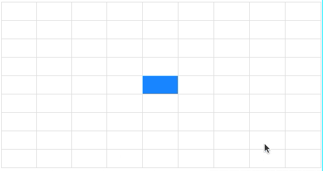

# 百度 2021 校招 Web 前端研发工程师笔试卷（第二批）

## 1

Vue 是目前最流行的 mvvm 框架之一，关于其组件化的描述，正确的有哪些？

正确答案: B C D   你的答案: 空 (错误)

```cpp
在 created 函数里面可以获取到父组件的 dom 实例
```

```cpp
使用 props 可以实现父子组件通讯，通过事件可实现子父组件通讯
```

```cpp
组件注册可以全局注册和局部注册
```

```cpp
组合 props 和 input 事件可实现 v-model 的双向绑定
```

本题知识点

前端工程师 百度 2021

## 2

随着 web 应用程序规模的增长，一个 React 应用的状态模型会逐渐变得复杂，这时候通常我们会引入一些状态管理工具（如 redux）来解决这个问题，关于状态管理工具描述正确的有哪些？

正确答案: A B C   你的答案: 空 (错误)

```cpp
解决了 React 应用组件之间的状态共享问题
```

```cpp
时间旅行让应用状态的变化可追溯
```

```cpp
Redux 中所有的状态都是只读的，每一个 action 只会产生新的状态
```

```cpp
事件总线（EventBus）能代替 Redux 的所有功能
```

本题知识点

前端工程师 百度 2021

## 3

给定一个整数数组 array 和一个目标值 T，如果要你在该数组中找出和为 T 的那 2 个整数(一定存在这 2 个整数)，并返回他们的数组下标。那么至少要遍历几次数组才能找出来?

正确答案: A   你的答案: 空 (错误)

```cpp
1
```

```cpp
2
```

```cpp
4
```

```cpp
3
```

本题知识点

C++工程师 PHP 工程师 百度 2021 前端工程师

讨论

[牛客 941853565 号](https://www.nowcoder.com/profile/941853565)

leetcode 第一题 多记录一个下标

发表于 2021-06-13 00:00:49

* * *

## 4

若栈 S1 中保存整数，栈 S2 中保存运算符，函数 F()依次执行下述各步操作： （1）从 S1 中依次弹出两个操作数 a 和 b； （2）从 S2 中弹出一个运算符 op； （3）执行相应的运算 b op a； （4）将运算结果压人 S1 中。 假定 S1 中的操作数依次是 3, 9, 3, 2（2 在栈顶），S2 中的运算符依次是*, - , +（+在栈顶）。调 用 3 次 F()后，S1 栈顶保存的值是?

正确答案: A   你的答案: 空 (错误)

```cpp
12
```

```cpp
-12
```

```cpp
9
```

```cpp
-9
```

```cpp
-15
```

本题知识点

C++工程师 PHP 工程师 百度 2021 Java 工程师 前端工程师

## 5

已知一棵二叉树的树形如下图所示，其后序序列为 e,a,c,b,d,g,f，树中与结点 a 同层的结点是

正确答案: B   你的答案: 空 (错误)

```cpp
c
```

```cpp
d
```

```cpp
f
```

```cpp
g
```

本题知识点

Java 工程师 2017 C++工程师 PHP 工程师 百度 2021 前端工程师

讨论

[牛客 675683313 号](https://www.nowcoder.com/profile/675683313)

后序序列是先左再右后中间，所以对号入座可知选 d

发表于 2020-10-20 20:37:34

* * *

[Hayle](https://www.nowcoder.com/profile/416498138)

后跟序列：每次都是先遍历树的左子树，然后再遍历树的右子树，最后再遍历根节点，以此类推，直至遍历完整个树。

发表于 2021-05-25 21:15:44

* * *

## 6

将 IP 地址空间 211.211.1.0/24 划分为 2 个子网，每个子网需分配的 IP 地址数不少于 120 个，请问以下哪 2 个子网划分结果可能是对的?

正确答案: A   你的答案: 空 (错误)

```cpp
子网 1：211.211.1.0/25，子网 2：211.211.1.128/25
```

```cpp
子网 1：211.211.1.0/26，子网 2：211.211.1.128/26
```

```cpp
子网 1：211.211.1.0/25，子网 2：211.211.1.64/25
```

```cpp
子网 1：211.211.1.0/26，子网 2：211.211.1.64/26
```

```cpp
子网 1：211.211.1.0/25，子网 2：211.211.1.128/26
```

本题知识点

C++工程师 PHP 工程师 百度 2021 Java 工程师 前端工程师

讨论

[牛客 178885107 号](https://www.nowcoder.com/profile/178885107)

1、先算前面的子网掩码：属于 C 类网络，对这个网络来说范围是：211.211.1.0-211.211.1.255 通俗理解就是最后是 0-255，也就是 256，那么分为两个子网的话，简单计算就是:256/2=128 所以两个个子网的范围分别是 0-127，128-255 所以两子网掩码为：211.211.1.0211.211.1.1282、算主机地址：
2⁶<120<2⁷,所以取 2⁷，那么主机位地址部门只需要 7 位，前缀就是 32-7=25 这里的 32 是 C 类网络中默认的，用就行所以前缀就是/25

发表于 2021-09-06 09:20:14

* * *

[Nk_Idea_0](https://www.nowcoder.com/profile/642499823)

A 选项：11010011.11010011.00000001.0|xxxxxxx
11010011.11010011.00000001.1|xxxxxxx
C 选项：
11010011.11010011.00000001.1|xxxxxxx
11010011.11010011.00000001.0|001xxxx

发表于 2022-01-26 18:26:17

* * *

[sunlightjl](https://www.nowcoder.com/profile/895731249)

2⁷=128>120，所以主机地址部门只需要 7 位 32-7=25 所以前缀是/25

发表于 2021-08-20 10:15:54

* * *

## 7

某操作系统中，页面大小为 4k，分配给每个进程的物理页面数为 1。在一个进程中，定义了如下二位数组 int A[512][512]，该数组按行存放在内存中，每个元素占 8 个字节。有如下编程方法：编程方法：

```cpp
for (int j = 0; j < 512; j++)
{
    for (int i = 0; i < 512; i++)
    {
        A[i][j] = 0;
    }
}
```

那么以上程序运行会产生多少次缺页?

正确答案: C   你的答案: 空 (错误)

```cpp
0
```

```cpp
512
```

```cpp
512*512
```

```cpp
(512*512)/2
```

```cpp
512*1024
```

本题知识点

C++工程师 PHP 工程师 百度 2021 Java 工程师 前端工程师

## 8

下列程序的运行结果是什么？var array = []for(var i = 0; i < 3; i++) {array.push(() => i)}var newArray = array.map(el => el())console.log(newArray)

正确答案: A   你的答案: 空 (错误)

```cpp
[3, 3, 3]
```

```cpp
[0, 1, 2]
```

```cpp
[function (), function (), function ()]
```

```cpp
[1, NaN, NaN]
```

本题知识点

前端工程师 百度 2021

## 9

考虑在以下代码中，文案 TEXT 的颜色是？

```cpp
  <style>
    span.inner-text { color: yellow }
    .text span { color: red }
    span { color: blue }
    p { color: green }
  </style>
  <p>
    <span class="text">
       <span class="inner-text">TEXT</span>
    </span>
  </p>
```

正确答案: B   你的答案: 空 (错误)

```cpp
yellow
```

```cpp
red
```

```cpp
blue
```

```cpp
green
```

本题知识点

前端工程师 百度 2021

## 10

执行以下代码的输出是

```cpp
var Foo = (function() {
    var x = 0;
    function Foo() {}
        Foo.prototype.increment = function() {
        ++x;
        console.log(x);
    };
    return Foo;
})();

var a = new Foo();
a.increment();
a.increment();
var b = new Foo();
a.increment();

```

正确答案: D   你的答案: 空 (错误)

```cpp
1, 2, 1
```

```cpp
0, 1, 0
```

```cpp
0, 1, 2
```

```cpp
1, 2, 3
```

本题知识点

前端工程师 百度 2021

## 11

下面分别使用 JSON.stringify 方法，返回值 res 分别是（）const fn = function(){}const res = JSON.stringify(fn)const num = 123const res = JSON.stringify(num)const res = JSON.stringify(NaN)const b = trueconst res = JSON.stringify(b)

正确答案: C   你的答案: 空 (错误)

```cpp
'function'、'123'、'NaN'、'true'
```

```cpp
undefined、'123'、undefined、'true'
```

```cpp
undefined、'123'、'null'、'true'
```

```cpp
undefined、'123'、'null'、undefined
```

本题知识点

前端工程师 百度 2021

讨论

[Janet.Yang](https://www.nowcoder.com/profile/1173882)

JSON.stringify()将值转换为相应的 JSON 格式：- 转换值如果有 toJSON() 方法，该方法定义什么值将被序列化。- 非数组对象的属性不能保证以特定的顺序出现在序列化后的字符串中。- 布尔值、数字、字符串的包装对象在序列化过程中会自动转换成对应的原始值。- undefined、任意的函数以及 symbol 值，在序列化过程中会被忽略（出现在非数组对象的属性值中时）或者被转换成 null（出现在数组中时）。-函数、undefined 被单独转换时，会返回 undefined，如 JSON.stringify(function(){}) or JSON.stringify(undefined). -对包含循环引用的对象（对象之间相互引用，形成无限循环）执行此方***抛出错误。- 所有以 symbol 为属性键的属性都会被完全忽略掉，即便 replacer 参数中强制指定包含了它们。 -Date 日期调用了 toJSON() 将其转换为了 string 字符串（同 Date.toISOString()），因此会被当做字符串处理。 -NaN 和 Infinity 格式的数值及 null 都会被当做 null。
-其他类型的对象，包括 Map/Set/WeakMap/WeakSet，仅会序列化可枚举的属性。

编辑于 2021-10-12 22:57:36

* * *

## 12

关于 CSS 变量的特性和用法，下列说法错误的有哪些？

正确答案: B   你的答案: 空 (错误)

```cpp
通过--property:value 的方式来声明一个 CSS 变量
```

```cpp
CSS 变量只在当前元素块中生效
```

```cpp
在内联样式和 CSS 选择器都可以定义 CSS 变量，且内联样式的优先级更高
```

```cpp
可以通过 calc() 方法对数值类 CSS 变量进行相关的计算
```

本题知识点

前端工程师 百度 2021

讨论

[山城郴王](https://www.nowcoder.com/profile/462634888)

变量的定义：    --开头，值必须是 css 存在的值使用           ：    var(--name)作用域        ：   可以继承，再父的样式中定义变量，可以再子的样式中使用

发表于 2021-12-07 11:02:23

* * *

## 13

下列关于使用 JS 修改元素样式的代码，正确的有哪些？

正确答案: B C D   你的答案: 空 (错误)

```cpp
document.body.style.['background-color'] = '#fff'
```

```cpp
document.body.style.setProperty('background-color', '#fff')
```

```cpp
document.body.style = 'background-color': #fff'
```

```cpp
document.body.style.fontSize = '14px'
```

本题知识点

前端工程师 百度 2021

讨论

[牛客 103181667 号](https://www.nowcoder.com/profile/103181667)

C 必不可能对

发表于 2021-07-28 15:29:34

* * *

[Hayle](https://www.nowcoder.com/profile/416498138)

C 选项，‘都不对称，怎么就对了。。。

发表于 2021-05-25 21:24:46

* * *

[前端成长中](https://www.nowcoder.com/profile/211603825)

第三个选项，连分号都没有拼接对，为什么还是正确选项的

发表于 2021-05-21 15:50:59

* * *

## 14

关于元素的隐藏，下列说法正确的是？

正确答案: C   你的答案: 空 (错误)

```cpp
给元素设置样式 dispaly: none，该元素将从 DOM 树中被移除
```

```cpp
给元素设置样式 visibility: hidden，该元素在父容器中不占用空间位置
```

```cpp
给元素设置样式 opacity: 0 并绑定 click 事件，点击元素时事件触发
```

```cpp
给元素设置样式 visibility: hidden 并绑定 click 事件，点击元素时事件触发
```

本题知识点

前端工程师 百度 2021

## 15

关于 CSS 选择器的使用，以下说法错误的是？

正确答案: A   你的答案: 空 (错误)

```cpp
使用相邻兄弟选择器 h1 + p {margin-top:50px;}，既可以修改前邻兄弟节点的样式，也可以修改后邻兄弟节点的样式
```

```cpp
使用:nth-child(0n+1)/:first-child/:nth-child(1)三个选择器的效果是一样的，都是选中第一个子元素
```

```cpp
a:hover 必须被置于 a:link 和 a:visited 之后才能生效
```

```cpp
a:active 必须被置于 a:hover 之后才能生效
```

本题知识点

前端工程师 百度 2021

讨论

[山城郴王](https://www.nowcoder.com/profile/462634888)

关于 a 标签的四种状态：   link   visited  hover active  【顺序：lv ha】我这样记忆：Lv 哈哈 link: a 未被访问时候              注意 herf 属性不为空且 a 没被点击才可以 visited：访问过的状态          当属性为空一开始加载页面，a 标签也会表示为 visited 状态 hover： 鼠标悬浮                  许多标签都有此状态 active：鼠标点击-鼠标松开期间的状态       码字不易，有用的话请点个赞

发表于 2021-12-07 11:20:11

* * *

[Hayle](https://www.nowcoder.com/profile/416498138)

+选择相邻兄弟元素选择器，其后的相邻兄弟节点元素会发生改变

发表于 2021-05-25 21:26:45

* * *

## 16

关于 CSS 预处理器，以下说法错误的是？

正确答案: C   你的答案: 空 (错误)

```cpp
SASS/SCSS 依赖 Ruby 或 Node.js 编译环境，因此需要编译后才能在浏览器使用；而 less 本身由 JavaScript 实现，可以在浏览器中完成编译并可直接使用
```

```cpp
CSS 预处理器提供了模块化的代码组织方式，可以让复杂度高的 CSS 代码更易于管理
```

```cpp
CSS 预处理器可以解决 CSS 属性在不同浏览器的兼容性问题
```

```cpp
通过扩展变量、嵌套、混入、继承等方式，可以更好地对 CSS 进行抽象和复用
```

本题知识点

前端工程师 百度 2021

讨论

[Hayle](https://www.nowcoder.com/profile/416498138)

CSS 预处理器是一种专门的编译语言，用于 web 页面样式设计，在编译为 css 文件给项目使用

发表于 2021-05-25 21:29:50

* * *

## 17

下列关于 linux 命令说法不正确的是()：

正确答案: A   你的答案: 空 (错误)

```cpp

top 可查看 CPU 状态，并且可细分进程的用户态 CPU 和内核态 CPU

```

```cpp

pidstat 可查看用户态 CPU 使用率、内核态 CPU 使用率、运行虚拟机 CPU 使用率、等待 CPU 使用率和总的 CPU 使用率

```

```cpp

iostat 可查看 CPU、网卡、磁盘等设备的活动情况, 负载信息

```

```cpp

vmstat 命令可以报告关于进程、内存、I/O 等系统整体运行状态

```

本题知识点

C++工程师 PHP 工程师 百度 2021 Java 工程师 前端工程师

讨论

[牛客 178885107 号](https://www.nowcoder.com/profile/178885107)

*top* 并没有*细分进程的用户态 CPU 和内核态 CPU*

发表于 2021-09-06 10:18:41

* * *

## 18

有关，说法不正确的是

正确答案: A D   你的答案: 空 (错误)

```cpp
该代码为 php 一句话木马，密码为 cmd
```

```cpp
如若 php 配置不当，该代码可导致直接 getshell
```

```cpp
如果存在该代码的网站具有图片上传功能，也会被 getshell
```

```cpp
该代码可以读取文件，但读取不了 php 文件，会被直接执行
```

本题知识点

Java 工程师 百度 2021 前端工程师

## 19

下面 java 代码求一个比较大的正整数是不是回文数，比如 212 是回文数，返回 true，-212 不是回文数，返回 false，正整数的长度为 N，那么如下代码的时间复杂度以及空间复杂度是多少?

```cpp
public boolean isPalindrome(long x) {
    if (x < 0 || (x % 10 == 0 && x != 0)) {
        return false;
    }

    long tempNum = 0;
    while (x > tempNum) {
        tempNum = tempNum * 10 + x % 10;
        x /= 10;
    }

    return x == tempNum || x == tempNum / 10;
}

```

正确答案: A   你的答案: 空 (错误)

```cpp
O(logN)，O(1)
```

```cpp
O(logN)，O(logN)
```

```cpp
O(N)，O(1)
```

```cpp
O(N)，O(logN)
```

本题知识点

C++工程师 PHP 工程师 百度 2021 Java 工程师 前端工程师

讨论

[山城郴王](https://www.nowcoder.com/profile/462634888)

百度对一个前端工程师要求好高啊：大学必修课的内容都有，三大框架都有一点，还一些算法时空，java 一点点，linux 命令。。。

发表于 2021-12-07 11:22:16

* * *

## 20

下边那个命令可以找到连接到 127.0.0.1:8080 服务上最多 ip

正确答案: A D   你的答案: 空 (错误)

```cpp
netstat -nat | grep "127.0.0.1:8080" |awk '{print $5}'|awk -F: '{print $1}'|sort|uniq -c
```

```cpp
netstat -nat | grep "127.0.0.1:8080" |awk '{print $5}'|awk -F: '{print $1}'|sort -c|sort -nr
```

```cpp
netstat -nat | grep "127.0.0.1:8080" |awk '{print $5}'|sort|uniq -c
```

```cpp
netstat -nat | grep "127.0.0.1:8080" |awk '{print $5}'|awk -F: '{print $1}'|sort|uniq -c|sort -nr
```

本题知识点

Java 工程师 百度 2021 前端工程师

## 21

牛牛有一个长度为的数组，牛妹给出个询问，询问有种类型：
:询问区间内有多少子序列的乘积为奇数
:询问区间内有多少子序列的乘积为偶数某个序列的子序列是从最初序列通过去除某些元素但不破坏余下元素的相对位置（在前或在后）而形成的新序列。

本题知识点

C++工程师 PHP 工程师 百度 2021 前端工程师

讨论

[JCoder](https://www.nowcoder.com/profile/1405380)

乘积为奇数的子序列一定是全都是奇数，所以是 2^(奇数数量) - 1 求 [l,r] 内有多少个奇数可以将所有数字模 2，然后求前缀和如果就是求奇数，直接输出求偶数就再求一个全部子序列的数量：2^(r - l + 1) - 1，再减去乘积为奇数的子序列数量至于求 2 的多少次幂可以 O(n)预处理，也可以快速幂

发表于 2021-08-12 19:28:42

* * *

## 22

牛牛是这个赛季的牛王挑战赛的负责人，本赛季一共有  名参赛选手，编号为  ~ ，**初始状态下，每个人都在自己对应编号的候场区域，刚刚开始 1 个候场区域只有 1 个人**，即： 号选手在  号候场区域， 号选手在  号候场区域，以此类推。挑战赛即将开始，每位选手在自己编号相对应的区域候场，每个候场区域都可以看成是一个队列，如果后续还有人进入，则只能排在队伍末尾。由于设备出现了些许问题，所以部分候场区域电压不稳，为了选手能够得到更好的休息，牛牛准备发布若干条指令：关闭某候场区域，同时，该候场区域参赛人员按照顺序依次进入另一个仍然开放的候场区域。
中途，牛牛还希望知道部分参赛选手的候场情况，所以在发布指令的同时，还会进行若干个询问：某两名参赛选手是否在同一个候场区域？如果在同一个候场区域，那么他们之间间隔了几名参赛选手？

本题知识点

Java 工程师 百度 2021 前端工程师

讨论

[JCoder](https://www.nowcoder.com/profile/1405380)

改装并查集，对于每个窗口都维护一个队尾，合并的时候直接追加到队尾，在 find 的时候利用类似于差分的思想，一边路径压缩，一边求深度，注意深度的差值不等于 0 的时候要减一，因为求的是隔着几个人。

```cpp
#include <bits/stdc++.h>
using namespace std;

int fa[100005];
int la[100005];
int w[100005];
int n, m;

int uf_find(int x) {
    if (fa[x] != x) {
        int _fa = fa[x];
        fa[x] = uf_find(fa[x]);
        w[x] += w[_fa];
    }

    return fa[x];
}

int main() {
    scanf("%d%d", &n, &m);
    for (int i = 1; i <= n; i++) {
        fa[i] = la[i] = i;
        w[i] = 0;
    }

    while (m--) {
        int a, b;
        char c;
        getchar();
        scanf("%c %d %d", &c, &a, &b);
        if (c == 'C') {
            fa[a] = la[b];
            la[uf_find(b)] = la[a];
            w[a] = 1;
        }
        else {
            if (uf_find(a) == uf_find(b)) {
                printf("%d\n", max(0, abs(w[a] - w[b]) - 1));
            }
            else {
                printf("-1\n");
            }
        }
    }

    return 0;
}
```

编辑于 2021-08-17 18:26:58

* * *

## 23

界面中存在 id=jsContainer 的节点 A，系统会随机生成 id 为 jsLayout 的 m 行 x n 列 表格(m >= 1, n >= 1)，并随机选中一个 td 节点，请按照如下需求实现 bind 函数
1、bind 函数为 document 绑定 keydown 事件，当系统触发上(键值 38)下(键值 40)左(键值 37)右(键值 39)按键时，请找到当前选中的 td 节点，并根据当前指令切换高亮节点，具体效果参考以下图片
2、在第一列往左移动则到达最后一列；在最后一列往右移动则到达第一列；在第一行往上移动则到达最后一行；在最后一行往下移动则到达第一行；
3、请不要手动调用 bind 函数
4、当前界面为系统在节点 A 中生成 9 * 9 表格并随机选中一个 td 节点后的效果
5、请不要手动修改 html 和 css，请不要修改 js 中的事件绑定方式
6、不要使用第三方插件


本题知识点

前端工程师 百度 2021

讨论

[♈FourBrother✅已认证♉](https://www.nowcoder.com/profile/603005090)

这又是为啥跑不过呢 要求都实现了

```cpp
function bind() {

    document.onkeydown = event => {
        if (!event) return;
        var code = event.keyCode || '';
        if (!{'37': 1, '38': 1, '39': 1, '40': 1}[code]) return;
        event.preventDefault && event.preventDefault();
        //TODO: 请实现按键控制
        const currentDom = document.querySelector("#jsContainer > .game .current")
        const tableDom = document.querySelector("#jsContainer > .game")
        const rowDoms = tableDom.rows
        const rowLen = rowDoms.length
        const colLen = rowDoms[0].children.length
        const currentRow = [...rowDoms].indexOf(currentDom.parentNode)
        const currentCol = [...rowDoms[currentRow].children].indexOf(currentDom)
        let newCurrentRow = currentRow
        let newCurrentCol = currentCol
        if (code === 37) {
            if (currentCol === 0) newCurrentCol = colLen - 1
            else newCurrentCol -= 1
        } else if (code === 38) {
            if (currentRow === 0) newCurrentRow = rowLen - 1
            else newCurrentRow -= 1
        } else if (code === 39) {
            if (currentCol === colLen - 1) newCurrentCol = 0
            else newCurrentCol += 1
        } else if (code === 40) {
            if (currentRow === rowLen - 1) newCurrentRow = 0
            else newCurrentRow += 1
        }
        if (newCurrentRow !== currentRow || newCurrentCol !== currentCol) {
            currentDom.classList.remove('current')
            rowDoms[newCurrentRow].children[newCurrentCol].classList.add('current')
        }
    };
}
```

发表于 2021-11-30 15:11:52

* * *

[牛客 6076287 号](https://www.nowcoder.com/profile/6076287)

```cpp
function bind() {
    document.onkeydown = event => {
        if (!event) return;
        var code = event.keyCode || '';
        if (!{ '37': 1, '38': 1, '39': 1, '40': 1 }[code]) {
            return;
        } else {
            let tdList = document.getElementsByTagName("td");
            let target = undefined;
            for (let i = 0, len = tdList.length; i < len; i++) {
                if (tdList[i].classList.contains("current")) {
                    target = tdList[i];
                    tdList[i].classList.remove("current");
                    break;
                }
            }
            let parent = target.parentNode;
            let len = parent.children.length;
            let findIndex = (target, parent) => {
                for (let i = 0; i < len; i++) {
                    if (parent.children[i] === target) {
                        return i;
                    }
                }
            }
            let targetIndex = findIndex(target, parent);
            if (code === 37) {
                parent.children[targetIndex > 0 ? targetIndex - 1 : len - 1].classList.add("current");
            }
            if (code === 38) {
                let targetRow = findIndex(parent, parent.parentNode);
                parent.parentNode.children[targetRow > 0 ? targetRow - 1 : parent.parentNode.children.length - 1].children[targetIndex].classList.add("current");
            }
            if (code === 39) {
                parent.children[targetIndex < len - 1 ? targetIndex + 1 : 0].classList.add("current");
            }
            if (code === 40) {
                let targetRow = findIndex(parent, parent.parentNode);
                parent.parentNode.children[targetRow < parent.parentNode.children.length - 1 ? targetRow + 1 : 0].children[targetIndex].classList.add("current");
            }
        };
        event.preventDefault && event.preventDefault();
    };
}
```

编辑于 2021-06-22 16:18:41

* * *

[Banker](https://www.nowcoder.com/profile/529415403)

```cpp
function bind() {

    document.onkeydown = event => {
        if (!event) return;
        var code = event.keyCode || '';
        if (!{'37': 1, '38': 1, '39': 1, '40': 1}[code]) return;
        event.preventDefault && event.preventDefault();
        //TODO: 请实现按键控制
        var currentTd = document.getElementsByClassName('current')[0];
        currentTd.classList.remove('current');
        var tds = document.getElementsByTagName('td');
        var cols = parseInt(Math.sqrt(tds.length));
        var index;

        for(var i = 0; i < tds.length; i++) {
            if(tds[i] === currentTd) {
                index = i;
                console.log('index: ' + index)
            }
        }

        if(code == '37') { //left
            index % cols == 0? index = index + cols - 1 : index--;
        } else if(code == '39') { // right
            index % cols == cols - 1 ? index = index - cols + 1 : index++;
        } else if(code == '38') { //up
            index - cols < 0 ? index = tds.length - cols + index : index = index - cols;
        } else if (code == '40') { // down
            index + cols >  tds.length - 1 ? index = index % cols : index = index + cols;
        }

        tds[index].classList.add('current');
    };
}
```

发表于 2022-03-01 17:56:44

* * *