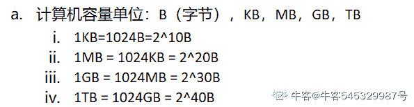
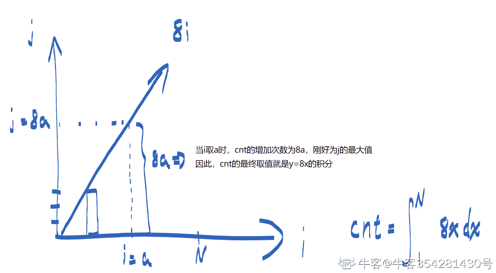
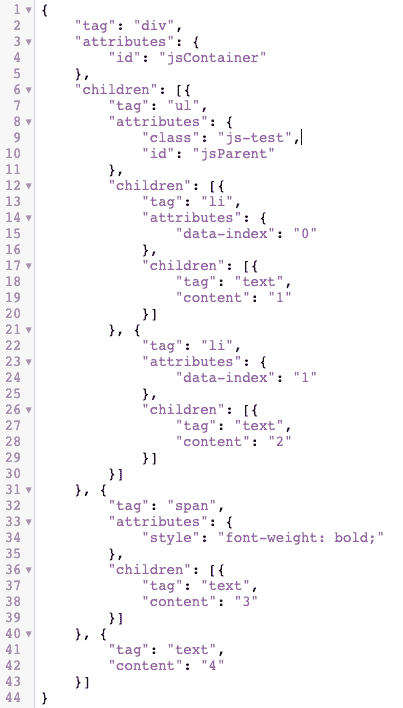

# 百度 2021 校招 Web 前端研发工程师笔试卷（第三批）

## 1

给定 n 个权值作为 n 个叶子节点，构造一棵二叉树，若该树的带权路径长度达到最小，这样的二叉树为最优二叉树，也称为哈夫曼树(Huffman Tree)，哈夫曼树是带权路径长度最短的树，权值较大的结点离根较近，若一个哈夫曼树有 N 个叶子节点，则其节点总数为（  ）

正确答案: B   你的答案: 空 (错误)

```cpp
不确定
```

```cpp
2N-1
```

```cpp
2N+1
```

```cpp
2N
```

本题知识点

C++工程师 PHP 工程师 百度 2021 Java 工程师 前端工程师

讨论

[徐凤年 201809042100959](https://www.nowcoder.com/profile/782656048)

哈夫曼新增节点，就是在两两之间新增，也就是新增 N-1 个节点，加起来 2N-1

发表于 2021-08-21 01:11:05

* * *

[不偏.](https://www.nowcoder.com/profile/86463628)

比如一开始，只有两个节点来，构建哈夫曼树，那么选择量小造新树 h 就会产生一个三个节点的数。也就是 2N-1

发表于 2021-08-12 19:10:20

* * *

## 2

分页存储管理将进程的逻辑地址空间分成若干个页，并为各页加以编号，从 0 开始，若某一计算机主存按字节编址，逻辑地址和物理地址都是 32 位，页表项大小为 4 字节，若使用一级页表的分页存储管理方式，逻辑地址结构为页号（20 位），页内偏移量（12 位），则页的大小是（  ）？页表最大占用（  ）？

正确答案: A   你的答案: 空 (错误)

```cpp
4KB，4MB
```

```cpp
5KB，5MB
```

```cpp
6KB，6MB
```

```cpp
7KB，7MB
```

本题知识点

C++工程师 PHP 工程师 百度 2021 Java 工程师 前端工程师

讨论

[敲了个锤子](https://www.nowcoder.com/profile/80190292)

地址长度为 32 位，其中 0~11 位为页内地址（即页内偏移量），2¹² 即每页大小为 4KB；同样地，12~31 位为页号，地址空间最多允许有 2²⁰ = 1M 页，又页表项 4 字节， 所以页表最大占用 1M * 4 = 4MB 发表于 2021-09-24 12:08:34

* * *

[机智的路易](https://www.nowcoder.com/profile/747109063)

页内偏移量（12 位）= 页大小 2¹² = 4KB

发表于 2022-03-21 15:13:44

* * *

[牛客 545329987 号](https://www.nowcoder.com/profile/545329987)



发表于 2022-03-19 20:31:34

* * *

## 3

后序遍历为二叉树遍历方式中的一种，假设将{ 3, 8, 9, 1, 2, 6 }依次插入初始为空的二叉排序树。则该树的后序遍历结果是多少（    ）？

正确答案: B   你的答案: 空 (错误)

```cpp
1, 2, 8, 6, 9, 3
```

```cpp
2, 1, 6, 9, 8, 3
```

```cpp
1, 2, 3, 6, 9, 8
```

```cpp
2, 1, 3, 6, 9, 8
```

本题知识点

C++工程师 PHP 工程师 百度 2021 Java 工程师 前端工程师

讨论

[洒下句点](https://www.nowcoder.com/profile/56029131)

A

发表于 2021-09-16 10:24:12

* * *

[linc_c](https://www.nowcoder.com/profile/819544946)

二叉排序树要么是空[二叉树](http://c.biancheng.net/view/3384.html)，要么具有如下特点：

*   二叉排序树中，如果其根结点有左子树，那么左子树上所有结点的值都小于根结点的值；
*   二叉排序树中，如果其根结点有右子树，那么右子树上所有结点的值都大小根结点的值；
*   二叉排序树的左右子树也要求都是二叉排序树；

发表于 2021-09-08 12:45:14

* * *

[牛客 360871401 号](https://www.nowcoder.com/profile/360871401)

（1）先(根)序遍历（根左右）

（2）中(根)序遍历（左根右）

（3）后(根)序遍历（左右根）

发表于 2021-07-15 15:54:58

* * *

## 4

props 在 vue 中的作用是

正确答案: A   你的答案: 空 (错误)

```cpp
父组件向子组件传递参数
```

```cpp
子组件向父组件传递参数
```

```cpp
可替换 data 声明参数
```

```cpp
没有实际作用
```

本题知识点

前端工程师 百度 2021

讨论

[牛客 624189085 号](https://www.nowcoder.com/profile/624189085)

A

发表于 2022-02-08 16:15:21

* * *

[~百变小樱桃](https://www.nowcoder.com/profile/440000798)

A 父组件里定义一个参数。子组件通过 props 来接收父组件定义的参数

发表于 2021-09-02 16:19:25

* * *

[牛客 785942896 号](https://www.nowcoder.com/profile/785942896)

A

发表于 2021-08-25 22:21:56

* * *

## 5

下列程序的运行结果是什么？// module.jsexport default () => "Hello world"export const name = "nowcoder"// index.jsimport * as data from "./module"console.log(data)

正确答案: A   你的答案: 空 (错误)

```cpp
{default: function default(), name: ‘nowcoder’}
```

```cpp
{default: function default()}
```

```cpp
{default: ‘hello world’, name: ‘nowcoder’}
```

```cpp
Global object of module.js
```

本题知识点

前端工程师 百度 2021

讨论

[【社会人】](https://www.nowcoder.com/profile/630854493)

用户通过 data.name 和 data.default()来调用属性

发表于 2022-03-06 08:54:21

* * *

## 6

下列程序的运行结果是什么？function nums(a, b) {
  if
  (a > b)
  console.log('a is bigger')
  else 
  console.log('b is bigger')
  return 
  a + b
}

console.log(nums(4, 2))
console.log(nums(1, 2))

正确答案: B   你的答案: 空 (错误)

```cpp
a is bigger, 6, b is bigger, 3
```

```cpp
a is bigger, undefined, b is bigger, undefined
```

```cpp
undefined, undefined
```

```cpp
SyntaxError
```

本题知识点

前端工程师 百度 2021

讨论

[无敌的小荔枝](https://www.nowcoder.com/profile/509757735)

在  return  处换行了，因此是  return（ return 后面的语句 a+b 被忽略了），而不是  return a+b。

发表于 2021-05-25 13:17:24

* * *

## 7

有一个输出函数定义如下：

```cpp
function log(msg, time) {
  return new Promise((resolve) => {
    setTimeout(() => {
      console.log(msg);
      resolve();
    }, time);
  });
}
```

则下面三段代码输出的结果是：
第一段代码：

```cpp
(async () => {
  for (let i = 0; i < 5; i++) {
    await log(i, 1000);
  }
})();
```

第二段代码：

```cpp
(async () => {
  [ 1, 2, 3, 4 ].forEach(async (i) => {
    await log(i, 1000);
  });
})();
```

第三段代码：

```cpp
(async () => {
  for (const i of [ 1, 2, 3, 4 ]) {
    await log(i, 1000);
  }
})();
```

正确答案: C   你的答案: 空 (错误)

```cpp
三段代码结果相同，都是每隔一秒输出 1，2，3，4，耗时 4 秒
```

```cpp
三段代码结果相同，都是一秒之后立即输出 1，2，3，4，耗时 1 秒
```

```cpp
第一段代码：每隔一秒输出 1，2，3，4，耗时 4 秒第二段代码：一秒之后立即输出 1，2，3，4，耗时 1 秒第三段代码：每隔一秒输出 1，2，3，4，耗时 4 秒
```

```cpp
第一段代码：每隔一秒输出 1，2，3，4，耗时 4 秒第二段代码：每隔一秒输出 1，2，3，4，耗时 4 秒第三段代码：一秒之后立即输出 1，2，3，4，耗时 1 秒
```

本题知识点

前端工程师 百度 2021

讨论

[牛客 545329987 号](https://www.nowcoder.com/profile/545329987)

// 封装一个函数，返回值是一个成功的 Promise 对象，Promise 里回调函数是一个定时器    function log(msg, time) {      return new Promise((resolve) => {        setTimeout(() => {          console.log(msg);          resolve();//成功的 Promise        }, time)      });    }
    /*  console.log('for 遍历数组');     // async 和 await 和数组遍历结合     (async () => {       for (let i = 0; i < 5; i++) {         await log(i, 1000);//每个一秒打印出一个 i       }     })(); */
    console.log('forEach 遍历');    (async () => {      [0, 1, 2, 3].forEach(async (i) => {        await log(i, 1000);//1s 后一次性打印出 0，1，2，3      })    })();

    /* console.log('for i 遍历');    (async () => {      for (const i of [0, 1, 2, 3]) {        await log(i, 1000);//每个一秒打印出 0 1 2 3      }    })(); */

发表于 2022-03-20 11:13:43

* * *

[牛客 360871401 号](https://www.nowcoder.com/profile/360871401)

第一段代码的输出 0 去哪里了

发表于 2021-07-15 16:26:32

* * *

## 8

关于以下代码的输出说法正确的是：

```cpp
console.log(a);
var a = 'a';
console.log(b);
let b = 'b';
```

正确答案: B   你的答案: 空 (错误)

```cpp
输出 undefined、undefined
```

```cpp
输出 undefined、ReferenceError
```

```cpp
输出 a、b
```

```cpp
输出 ReferenceError、ReferenceError
```

本题知识点

前端工程师 百度 2021

讨论

[牛客 506002722 号](https://www.nowcoder.com/profile/506002722)

var 有变量提升会将 var a 提升到顶部，所以是 undefined .let 没有产量提升所以是参数错误

发表于 2021-05-30 21:04:24

* * *

## 9

以下属于操作符 typeof 的返回值的是：(1)function(2) object(3) null(4) array(5) NaN(6) bigint(7) regexp(8) undefined

正确答案: D   你的答案: 空 (错误)

```cpp
(1)、(2)、(3)、(4)、(5)、(6)、(7)、(8)
```

```cpp
(1)、(2)、(3)、(8)
```

```cpp
(1)、(2)、(8)
```

```cpp
(1)、(2)、(6)、(8)
```

本题知识点

前端工程师 百度 2021

讨论

[丘丘 _Chen](https://www.nowcoder.com/profile/459505578)

bigint 是 js 中新增数据类型指路[`blog.csdn.net/m0_50914413/article/details/112706493`](https://blog.csdn.net/m0_50914413/article/details/112706493)

发表于 2021-10-14 19:08:57

* * *

## 10

关于以下代码输出结果顺序说法正确的是：

```cpp
(async () => {
    console.log(1);
    setTimeout(() => {
        console.log(2);
}, 0);
await new Promise((resolve, reject) => {
    console.log(3);
}).then(() => {
    console.log(4);
});
    console.log(5);
})();
```

正确答案: C   你的答案: 空 (错误)

```cpp
1、2、3、4、5
```

```cpp
1、5、3、4、2
```

```cpp
1、3、2
```

```cpp
1、3、5、2
```

本题知识点

前端工程师 百度 2021

讨论

[czHeal](https://www.nowcoder.com/profile/550285132)

1、首先输出 1（同步任务）2、输出 new promise 中的 33、因为没有 resolve 或 reject，promise 一直处于 padding 状态，导致.then 永远不会执行 4、因为是 await，需要等待 await 执行完成才会执行下面的 console.lot(5)，可是没有 resolve 或 reject，永远不会执行完成，所以不输出 5、输出 2

发表于 2021-09-28 14:12:31

* * *

## 11

DOM 元素的以下属性改变会导致重排(reflows)的是

正确答案: C   你的答案: 空 (错误)

```cpp
outline
```

```cpp
visiblity
```

```cpp
font-size
```

```cpp
background-color
```

本题知识点

前端工程师 百度 2021

讨论

[牛客 545329987 号](https://www.nowcoder.com/profile/545329987)

A outline 不占有空间 B visiblity：hidden 只会 repaint； display：none 就会 reflowC 改变了字号，改变了几何 会回流 D 背景颜色会重绘

发表于 2022-03-20 17:02:33

* * *

## 12

下列关于 PostCSS 的介绍，正确的有哪些？

正确答案: A C   你的答案: 空 (错误)

```cpp
PostCSS 的定位是一款功能齐备的 CSS 预处理器
```

```cpp
PostCSS 通过 JS 插件来完成 CSS 样式的编码转换，如支持 autoprefixer
```

```cpp
CSS 编码转换是通过解析 CSS AST 树，完成语法转换，再序列化成 CSS 实现的
```

```cpp
假定在项目使用 less 完成 CSS 的预编译，PostCSS 进行 CSS 代码转换的时间先于 less
```

本题知识点

前端工程师 百度 2021

## 13

下列关于 CSS 边框 (border) 和阴影 (box-shadow) 的解释，正确的都有哪些？

正确答案: A C D   你的答案: 空 (错误)

```cpp
两种方式都可以实现给元素加外边框的效果
```

```cpp
在盒模型中， border 和 box-shadow 都会占用空间
```

```cpp
border 支持图片格式，box-shadow 不支持
```

```cpp
box-shadow 支持内阴影和模糊，因此可以实现毛玻璃效果
```

本题知识点

前端工程师 百度 2021

## 14

关于 HTML 的编码风格，以下说法正确的是？

正确答案: A C D   你的答案: 空 (错误)

```cpp
使用 HTML5 提供的语义化标签编写 HTML 代码，不仅可以提高代码的可读性，还能让搜索引擎可以更好地”理解“网页，达到 SEO 优化的目的
```

```cpp
在 head 中编写的 script 标签，一定会阻塞页面渲染，因此要将 script 标签写在 body 标签结束之前
```

```cpp
使用 class 给元素添加样式，不推荐使用 id 或者内联样式
```

```cpp
尽可能通过相对协议的方式引入资源，避免出现混合内容的导致资源无法加载的问题
```

本题知识点

前端工程师 百度 2021

## 15

下列关于 linux 命令说法正确的是（）：

正确答案: B C D   你的答案: 空 (错误)

```cpp
uptime 可查看过去一分钟、五分钟、十分钟的平均负载情况
```

```cpp
grep 'model name' /proc/cpuinfo | wc -l 可查看 CPU 逻辑核数
```

```cpp
pidstat 可查看进程的 CPU、内存、I/O 以及上下文切换等性能指标
```

```cpp
stress 可作为 linux 系统压力测试工具
```

本题知识点

Java 工程师 百度 2021 前端工程师

讨论

[lh-jiezhou](https://www.nowcoder.com/profile/3848158)

uptime:它依次显示下列信息：当前时间、系统已经运行了多长时间、有多少登陆用户、系统在过去的 1 分钟、5 分钟和 15 分钟内的平均负载。20:21:23 up 14 days,  3:16,  2 users,  load average: 0.08, 0.06, 0.01 

发表于 2021-08-17 20:23:12

* * *

## 16

CSRF 漏洞全称为 Cross-site request forgery（跨站请求伪造）攻击者诱导受害者进入第三方网站，在第三方网站中，向被攻击网站发送跨站请求。现有 A 网站、B 网站和 C 网站，其中 A 网站和 C 网站存在 CSRF 漏洞但并没有其他漏洞，B 网站存在一些高危漏洞，如果想利用 CSRF 漏洞攻击 A 网站，攻击链可能是一下哪种方式？

正确答案: B   你的答案: 空 (错误)

```cpp
利用 CSRF 漏洞直接攻击 A 网站
```

```cpp
先攻击 B 网站，再通过 B 网站向 A 网站发起 CSRF 攻击
```

```cpp
先攻击 C 网站，再通过 C 网站向 A 网站发起 CSRF 攻击
```

```cpp
先攻击 B 网站，再通过 B 网站攻击 C 网站，最后通过 C 网站向 A 网站发起 CSRF 攻击
```

本题知识点

Java 工程师 百度 2021 前端工程师

## 17

以下哪种方法可以用来清理僵尸进程()

正确答案: C   你的答案: 空 (错误)

```cpp
向僵尸进程发送 SIGKILL 信号
```

```cpp
向 init 进程发送 SIGKILL 信号
```

```cpp
向僵尸进程的父进程发送 SIGKILL 信号
```

```cpp
向僵尸进程发送 SIGCHILD 信号
```

本题知识点

C++工程师 PHP 工程师 百度 2021 Java 工程师 前端工程师

讨论

[zvorebri](https://www.nowcoder.com/profile/6689254)

清理僵尸线程：把父进程杀掉，父进程死后，僵尸进程称为“孤儿进程”，过继给 1 号进程 init，init 始终负责清理僵尸进程，它产生的所有僵尸进程跟着消失

发表于 2021-08-16 15:54:11

* * *

## 18

已知 B 类地址的子网掩码为 255.255.0.0，假设某 B 类地址为 127.24.36.55，那么它的网络号为:

正确答案: A   你的答案: 空 (错误)

```cpp
127.24.0.0
```

```cpp
0.0.36.55
```

```cpp
255.255.36.55
```

```cpp
127.24.36.55
```

本题知识点

C++工程师 PHP 工程师 百度 2021 Java 工程师 前端工程师

讨论

[TateTang](https://www.nowcoder.com/profile/1862380)

步骤一：首先将网络的 IP 地址和子网掩码都转换成 32 位二进制字符。
步骤二：将转换后的二进制的 IP 地址和子网掩码进行“逻辑与”运算，得到新的 32 位二进制字符。
步骤三：把得到的新的 32 位二进制字符转换成十进制，就是主机的网络号了。本机 IP 为 127.24.36.55，子网掩码为 255.255.0.0
转换成二进制：
本机 IP 为 01111111.00011000.00100100.00110111
子网掩码 11111111.11111111.00000000.00000000
进行“与运算“ 01111111.00011000.00000000.00000000
转换成十进制：127.24.0.0
即 127.24.0.0 为主机的网络号。 

发表于 2021-11-29 17:05:25

* * *

[牛客 855150961 号](https://www.nowcoder.com/profile/855150961)

B 类子网掩码是 255.255.0.0 网络号不就是指前面的 255.255 吗。

发表于 2021-11-17 12:16:18

* * *

## 19

小牛刚刚学习算法，想用动态规划来实现爬楼梯问题：n 阶楼梯每次可以爬 1 或 2 个台阶，让你实现如下代码，来判断总共有多少种方法呢:()int climbStairs(int n) {vector<int>dp(n+3,0);dp[1] = 1;dp[2] = 2;for(int i = 3; i<=n; i++){_____________________}return dp[n];}

正确答案: B   你的答案: 空 (错误)

```cpp
dp[i]=dp[i]+dp[i-2];
```

```cpp
dp[i]=dp[i-1]+dp[i-2];
```

```cpp
dp[i]=max(dp[i],dp[i-1]);
```

```cpp
dp[i]=max(dp[i-1],dp[i-2]);
```

本题知识点

C++工程师 PHP 工程师 百度 2021 Java 工程师 前端工程师

## 20

以下代码中，N 足够大，试分析“cnt++”执行的次数最接近于 ___ 次

```cpp
int test(int N)
{
    int cnt = 0;
    for (int i = 1; i <= N; i++)
    {
        for (int j = 1; j <= 8 * i; j++)
        {
            cnt++;
        }
    }
    return cnt;
}

```

正确答案: D   你的答案: 空 (错误)

```cpp
N2
```

```cpp
2N2
```

```cpp
3N2
```

```cpp
4N2
```

```cpp
8N2
```

本题知识点

C++工程师 PHP 工程师 百度 2021 Java 工程师 前端工程师

讨论

[牛客 354281430 号](https://www.nowcoder.com/profile/354281430)

直观点，这就是一个微积分问题——求阴影空间的面积问题。直观看过去，将 i 理解为 x，j 理解为 y，于是可得知，j 的最大取值随 i 的变化公式为 y=8x，即 max（j）=8i 在第二层循环中，cnt 的增加次数相当于从 1 到 max（j）的次数。于是，当横坐标取 i=N，纵坐标=max（j）=8N，i 取 1~N，所以 cnt 增加次数为 8~8N，三角形面积=4N²

发表于 2021-09-06 13:47:12

* * *

[想要找到好工作](https://www.nowcoder.com/profile/67219244)

i=1：第二层循环执行 8*1 次 i=2：第二层循环执行 8*2 次……i=N：第二层循环执行 8*N 次总共需执行 8*1+8*2+...8*N=8*(1+2+...+N)=8*(N+N*(N-1)/2)=4N²+4N 次

发表于 2021-07-26 17:52:09

* * *

[缄默斯](https://www.nowcoder.com/profile/998590184)

(8+8n)*n/2 约等于 4n² 等差数列

发表于 2022-03-14 10:38:19

* * *

## 21

牛牛有一个特殊的硬币，它有百分之 p 的概率正面朝上，否则反面朝上。牛牛现在有 2*n 个数字 a[1]~a[2*n]， 要把这 2*n 个数字分成 n 组，每组 2 个数字。然后对于每一组，牛牛会投掷他这个特殊的硬币，如果硬币正面朝上，牛牛会将答案加上这组两个数中较大的那个数，否则牛牛会将答案加上这组两个数中较小的那个数。现在问你怎么分组，能使牛牛最后的得到的答案的期望最大。请输出这个最大期望。

本题知识点

C++工程师 PHP 工程师 百度 2021 前端工程师

讨论

[牛客 960295533 号](https://www.nowcoder.com/profile/960295533)

```cpp
#python 版
n,p = map(int,input().split())
mylist = list(map(int,input().split(" ")))
mylist.sort()
sum = 0
i,j=0 , 2*n-1
if p >= 50:
    while True:
        if i >= j:
            break
        sum += mylist[i]*(100-p)+mylist[j]*p
        i += 1
        j -= 1
else:
    while True:
        if i > 2*n-2:
            break
        sum += mylist[i]*(100-p)+mylist[i+1]*p
        i += 2
if sum % 100 == 0:
    print(sum//100)
else:
    print(str(sum)+'%')

```

编辑于 2021-09-13 16:58:03

* * *

[JCoder](https://www.nowcoder.com/profile/1405380)

要用 unsigned long long 或者写高精度就行了 p >= 50 就排序后 0 和 n-1，1 和 n-2 分组 p < 50 就排序后 i 和 i + 1 分组

编辑于 2021-08-12 16:34:20

* * *

## 22

页面上存在 id=jsContainer 的节点 A，系统会随机在节点 A 中生成文档片段，请按照如下需求实现 dom2json 函数
1、dom2json 需要分析整个节点 A 的 dom 结构，并将其结构转换为对应的 json 对象
2、需要获取 dom 结构的标签名称(tag)，所有属性(attributes)，子节点(children)
3、文档片段中的属性形式均为 name="value"，解析之后的格式为{name: value}, 属性值为 String 类型，不需要做解析
4、随机生成的文档片段中，只包含 nodeType 为 1(element)和 3(text)的节点，不需要考虑其他节点类型
5、纯文本也视为一个节点, json 格式为 {tag: 'text', content: '文本内容'}，content 为文本内容执行 trim 后的结果，如果该结果为空，则忽略当前节点
6、返回结果中的标签名称不区分大小写
7、如果节点不包含属性值或者子节点，其对应的结果中需要保留 attributes 以及 children 字段，例如 {tag: 'div', attributes: {}, children: []}
8、当前界面执行 dom2json 之后的结果为如下图所示
9、请不要手动修改 html 和 css
10、不要使用第三方插件


本题知识点

前端工程师 百度 2021

讨论

[像一颗滚石](https://www.nowcoder.com/profile/932207386)

为啥发出来后没有语法高亮了

```cpp
function dom2json() {
    function createObj(node) {
        const obj = {};
        const tag = node.nodeName.toLocaleLowerCase();
        // 过滤子节点列表
        const childList = Array.from(node.childNodes).filter((item) => {
            const name = item.nodeName;
            return (name === '#text' && item.data.trim() !== '') || name !== '#text';
        });

        // 生成 tag
        if (tag === '#text') {
            obj.tag = 'text';
            obj.content = node.data.trim();
        } else {
            obj.tag = tag;
        }

        // 生成 attributes
        if (node.attributes) {
            obj.attributes = {};
            for (let i = 0; i < node.attributes.length; i++) {
                const { name, value } = node.attributes[i];
                obj.attributes[name] = value;
            }
        }

        // 生成 children
        if (childList.length !== 0) {
            obj.children = [];
            for (let i = 0; i < childList.length; i++) {
                obj.children.push(createObj(childList[i]));        
            }
        }

        return obj;
    }

    const jsContainer = document.getElementById('jsContainer');
    return createObj(jsContainer);
}
```

发表于 2021-08-19 14:10:01

* * *

[*Jin*](https://www.nowcoder.com/profile/4192056)

说好的 tagName 不区分大小写，测试必须小写。。

发表于 2021-07-21 10:48:41

* * *

[努力进步 ing](https://www.nowcoder.com/profile/313513489)

function dom2json() {        var div = document.getElementById('jsContainer');        function splitDom(element) {          var obj = {            tag: '',            attributes: {},            children: []          };          // 设置 tag          if (element.nodeName) {            obj.tag = element.nodeName.toLowerCase();          }          if (element.nodeName == '#text') {            obj.tag = 'text';            delete obj.attributes;            delete obj.children;            obj.content = element.nodeValue.trim();            return obj;          }          // 设置 attributes          var attrs = element.attributes;          for (let i = 0; i < attrs.length; i++) {            obj.attributes[attrs.item(i).name] = attrs.item(i).value;          }          // 设置 children          if (element.childNodes) {            for (let i = 0; i < element.childNodes.length; i++) {              var child = element.childNodes.item(i);              if (child.nodeName == '#text' && child.nodeValue.trim() == '') {                continue;              } else {                obj.children.push(splitDom(element.childNodes[i]));              }            }          }          return obj;        }        return splitDom(div);      }

发表于 2022-02-17 11:40:51

* * *