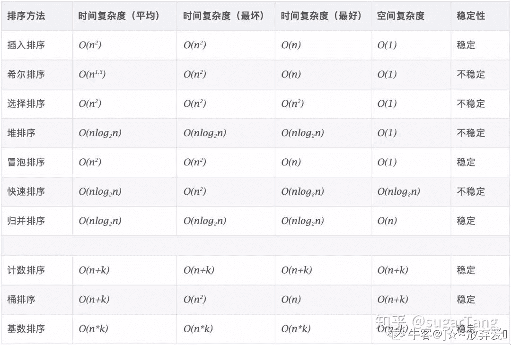

# 百度 2020 校招 Web 前端工程师笔试卷（第一批）

## 1

下列关于 React 的生命周期的描述，正确的有哪些？

正确答案: A C D   你的答案: 空 (错误)

```cpp
组件的生命周期包括实例化、运行态和销毁期；
```

```cpp
允许在 render 函数中执行 this.setState；
```

```cpp
componentDidMount 函数中可以获取到该组件的 dom 节点；
```

```cpp
React 16 提供的 componentDidCatch 方法，可以捕获构造函数、渲染和生命周期函数的异常；
```

本题知识点

前端工程师 百度 2020

## 2

分页存储管理将进程的逻辑地址空间分成若干个页，并为各页加以编号，从 0 开始，若某一计算机主存按字节编址，逻辑地址和物理地址都是 32 位，页表项大小为 4 字节，若使用一级页表的分页存储管理方式，逻辑地址结构为页号（20 位），页内偏移量（12 位），则页的大小是（  ）字节？页表最大占用（  ）字节？

正确答案: A   你的答案: 空 (错误)

```cpp
4KB，4MB
```

```cpp
5KB，5MB
```

```cpp
6KB，6MB
```

```cpp
7KB，7MB
```

本题知识点

前端工程师 百度 2020 C++工程师 PHP 工程师 Java 工程师

讨论

[luckingmei](https://www.nowcoder.com/profile/815224596)

一级页表由页号 + 页内偏移量（也就是页大小）页大小： 页内偏移量占 12 位，可以表示大小为 2¹²B = 4kb  ,所以最后页的大小为 4kb 页表的计算：总的页数 * 页表项大小总的页数 =  页号有 20 位，能表示 2²⁰ 个页 = 1MB 个页页表的大小 = 1MB * 4 字节 = 4MB

发表于 2021-09-07 14:37:06

* * *

[牛客 85762678 号](https://www.nowcoder.com/profile/85762678)

[`blog.csdn.net/syh666233/article/details/109295815`](https://blog.csdn.net/syh666233/article/details/109295815)

发表于 2021-08-31 23:10:13

* * *

## 3

关于以下代码，说法正确的有哪些？function Person() { }var person = new Person();

正确答案: A C D   你的答案: 空 (错误)

```cpp
每一个原型都有一个 constructor 属性指向关联的构造函数。
```

```cpp
每一个对象都有一个 prototype 属性。
```

```cpp
Object.getPrototypeOf(person) === Person.prototype
```

```cpp
person.constructor === Person
```

本题知识点

前端工程师 百度 2020

讨论

[chaojixiaosong](https://www.nowcoder.com/profile/729633950)

所有的引用类型（数组，对象，函数）都有一个隐式原型属性（_proto_）；所有的函数，都有一个显示原型属性（prototype）；所有的引用类型，_proto_ 属性值指向它的构造函数的 prototype 属性值；当试图得到一个对象的某个属性时，如果这个对象本身没有这个属性，那么会去 _proto_（即它的构造函数的 prototype 中）寻找。在自定义构造函数时，原型对象默认只会获得 constructor 属性，其他的所有方法都会继承自 Object。

发表于 2021-07-19 21:51:20

* * *

## 4

关于同源策略和跨域的问题，以下说法正确的有？

正确答案: B C D   你的答案: 空 (错误)

```cpp
http://store.company.com/dir/page.html 和 http://store.company.com/dir/other.html 不同源。
```

```cpp
node 设置 res.header("Access-Control-Allow-Origin", "*") 去解决跨域问题，会有安全问题。
```

```cpp
JSONP 的原理是利用引入 script 不限制源的特点，把处理函数名作为参数传入，然后返回执行语句。
```

```cpp
document.domain 的原理是将两个页面的 document.domain 设置成一致，只能解决主域相同的跨域问题。
```

本题知识点

前端工程师 百度 2020

讨论

[山城郴王](https://www.nowcoder.com/profile/462634888)

红包书上：docuemnt.domain 可以设置；但是出于安全考虑：domain 设置有限制：         本来的 url 中域是 a，设置成的 b；b 必须是 a 的子集：                    比如[`www.nowcoder.com/login.html`](https://www.nowcoder.com/login.html)：域是[www.nowcoder.com](http://www.nowcoder.com);你可以设置为 nowcoder.com;因为这个字符串在原来的域中包含         不可以设置为[www.zhl.com](http://www.zhl.com)

发表于 2021-10-24 12:01:41

* * *

## 5

以下关于 CSS 盒模型，说法正确的是：

正确答案: B C   你的答案: 空 (错误)

```cpp
盒模型相关 CSS 属性包含：宽高、内边距、边框和外边距。
```

```cpp
如果<p>的纵向 margin 是 12px，那么两个<p>之间纵向的距离是 12px。
```

```cpp
在 CSS 中，增加内边距、边框和外边距不会影响内容区域的尺寸，但是会增加元素框的总尺寸。
```

```cpp
盒子的实际宽度=宽度+左填充+右填充+左边框+右边框+左边界+右边界。
```

本题知识点

前端工程师 百度 2020

讨论

[X_W_W_](https://www.nowcoder.com/profile/395282347)

A:还包括 outline？B:纵向会合并 C:content 值由 width 和 height 控制，增加 padding，border，margin 不影响 content，只叠加 D:盒子宽度 = width + padding 左右 + border 左右盒子高度 = height + padding 上下 + border 上下

发表于 2021-06-28 02:39:30

* * *

[山城郴王](https://www.nowcoder.com/profile/462634888)

感觉又是题目的问题，它 A 的意思可能是盒子模型的所有属性只用这几种，因为没说 background 啥的判断是×；D 就是边框盒子和文本盒子没说的原因

发表于 2021-10-24 11:52:38

* * *

## 6

下列程序的运行结果是什么？

```cpp
setTimeout(function(){
    console.log(1);
}, 0)
new Promise(function(resolve){
    console.log(2);
    resolve();
    console.log(3);
}).then(function(){
    console.log(4);
})
console.log(5);
```

正确答案: A   你的答案: 空 (错误)

```cpp
2 3 5 4 1
```

```cpp
1 2 3 5 4
```

```cpp
2 5 4 3 1
```

```cpp
2 4 3 5 1
```

本题知识点

前端工程师 百度 2020

## 7

下列布局在页面上的宽度比是多少？

```cpp
// css
.flex {
    display: flex;
    width: 200px;
    height: 100px;
}
.left {
    flex: 3 2 50px;
    background: red;
}
.right {
    flex: 2 1 200px;
    background: blue;
}
// html
<div class="flex">
    <div class="left"></div>
    <div class="right"></div>
 </div>
```

正确答案: B   你的答案: 空 (错误)

```cpp
2:3
```

```cpp
1:5
```

```cpp
1:3
```

```cpp
3:2
```

本题知识点

前端工程师 百度 2020

讨论

[River_coder](https://www.nowcoder.com/profile/872594)

有 2 种情况：
1、当多个子盒子的总宽度 flex-basis<=父盒子时，使用的是 flex-grow 属性，按比例分配剩余空间；
2、当多个子盒子的总宽度 flex-basis>父盒子时，使用的是 flex-shrink 属性，规则是
        .box{
            display:flex;
            width:200px;
            height:50px;
        }
        .left{
            flex:3 2 50px
        }
        .right{
            flex: 2 1 200px
        }

        计算规则：
            (1)计算超出父盒子的宽度：200+50-200 = 50;
            (2).left 需要减少：(50*2)/(50*2+200*1) * 50 = 50/3
                .right 需要减少：(200*1)/(50*2+200*1) * 50 = 100/3
            (3)最终 left 宽度：50-50/3 = 100/3
                right 宽度：200-100/3 = 500/3
            (4)left 和 right 比例：  1:5

发表于 2021-05-30 17:41:27

* * *

## 8

下列在 JS 时间循环机制中属于微任务（microTask）的是？

正确答案: A B   你的答案: 空 (错误)

```cpp
process.nextTick
```

```cpp
promise
```

```cpp
setTimeout
```

```cpp
setInterval
```

本题知识点

前端工程师 百度 2020

讨论

[X_W_W_](https://www.nowcoder.com/profile/395282347)

nextTick 可以是微任务也可以是宏任务，**vue 环境支持 Promis 的话，使用 Promise。否则 microTimerFunc 被定义为宏任务 macroTimerFunc******优先使用 setImmediate（只有 ie 浏览器 10 以上支持），其次是 MessageChannel，最后是 setTimeout**。以上三个都属于宏任务。** [`www.cnblogs.com/mengfangui/p/9936695.html`](https://www.cnblogs.com/mengfangui/p/9936695.html)

发表于 2021-06-28 02:42:21

* * *

[一世长安 _ 学](https://www.nowcoder.com/profile/142508207)

nextTick 在 vue 源码实现是 new Permoise.reslove(callback),如果不能支持 es6 语法用 setTimout(()=>{},0)实现异步操作,第二种不常见。promise 第一个回调函数是同步任务，它的方法是异步任务，如果这题考查的宏任务和微任务的区别，选 a.如果题意是可以放入到微任务队列中选 ab

编辑于 2021-11-29 09:22:56

* * *

[山城郴王](https://www.nowcoder.com/profile/462634888)

b 的意思应该是 promise 不是微任务，因为 promise 和 promise 中的 resolve 函数都是同步执行的；Promise.prototype.then/.catch/.finally 函数中的内容才是异步执行的，会放入到微线程中

发表于 2021-10-24 11:55:36

* * *

## 9

下列代码的执行结果
function sayHello() {
console.log(name);
  console.log(age);
  var name = "Tom";
  let age = 18;
} 
sayHello();

正确答案: D   你的答案: 空 (错误)

```cpp
Tom, undefined
```

```cpp
Tom, ReferenceError
```

```cpp
ReferenceError, 18
```

```cpp
undefined, ReferenceError
```

本题知识点

前端工程师 百度 2020

讨论

[牛客 535655847 号](https://www.nowcoder.com/profile/535655847)

1\. 代码从上到下执行，由于 var 存在函数提升，当执行到 console.log(name)时，函数的作作用域已经存在声明的变量 var,所以打印 undefined,2\. let 声明的变量不存在变量提升，且存在暂时性死区，即不允许在声明变量之前使用，不然会报错

发表于 2021-07-01 09:49:14

* * *

## 10

下列代码的执行结果
for (var i = 0; i < 3; i++) {
setTimeout(_ => {
    console.log(i)
  })
}

for (let i = 0; i < 3; i++) {
  setTimeout(_ => {
    console.log(i)
  })
}

正确答案: C   你的答案: 空 (错误)

```cpp
0 1 2, 0 1 2
```

```cpp
0 1 2, 3 3 3
```

```cpp
3 3 3, 0 1 2
```

```cpp
3 3 3, 3 3 3
```

本题知识点

前端工程师 百度 2020

## 11

假如图片的地址为 imgUrl,下面哪行代码在网页中打开可以直接看到的是文字“hello”

正确答案: B C   你的答案: 空 (错误)

```cpp

```

```cpp

```

```cpp

```

```cpp

```

本题知识点

前端工程师 百度 2020

讨论

[南城巷陌](https://www.nowcoder.com/profile/195735343)

本来 title 应该是在图片显示的情况下，鼠标放在图片上面后会显示的内容，当 src 为空是，就会直接显示 title，估计是 img 的样式隐藏导致的

发表于 2021-09-05 17:05:45

* * *

[山城郴王](https://www.nowcoder.com/profile/462634888)

img 私有属性：alt  表示替换图片的文本内容，当 url 地址出错时，将会显示 alt 的内容突然口一个全局属性 title  表示错手不及；谁没事测测这个啊.....

发表于 2021-10-24 12:11:07

* * *

[OooO0oOOo](https://www.nowcoder.com/profile/398348398)

alt 属性为在无法显示图片时，显示的文字内容

发表于 2021-09-04 16:14:04

* * *

## 12

下列选项中，关于 HTTP 与 HTTPS 的区别的描述中，正确的是（   ）：

正确答案: A B C   你的答案: 空 (错误)

```cpp
http 是超文本传输协议，信息是明文传输。https 则是具有安全性的 ssl 加密传输协议。
```

```cpp
http 和 https 使用的是完全不同的连接方式，用的端口也不一样。
```

```cpp
http 的连接很简单，是无状态的。HTTPS 协议是由 SSL+HTTP 协议构建的可进行加密传输、身份认证的网络协议，比 http 协议安全。
```

```cpp
http 默认使用 80 端口，https 默认使用 403 端口。
```

本题知识点

前端工程师 百度 2020 C++工程师 PHP 工程师 Java 工程师

讨论

[艾佛森的泪](https://www.nowcoder.com/profile/949330719)

**1、HTTP 是超文本传输协议，信息是明文传输，HTTPS 是具有安全性的 SSL 加密传输协议。**

**2、HTTP 和 HTTPS 使用的是完全不同的连接方式，用的端口也不一样。前者是 80，后者是 443。**

**3、HTTP 和 HTTPS 的工作原理**

**HTTP 的工作原理：一次 HTTP 操作称为一个事物，其工作过程可分为四步**

**1、Client 与 Server 建立连接，单击某个超链接，HTTP 的工作开始。**

**2、连接建立后，Client 发送一个请求给 Server，请求方式的格式为：统一资源标识符（URL）、协议版本号，后边是 MIME 信息包括请求修饰符，Client 信息和可能的内容。**

**3、Server 接到请求后，给予相应的响应信息，其格式为一个状态行，包括信息的协议版本号、一个成功或错误的代码，后边是 MIME 信息包括 Server 信息、实体信息和可能的内容。**

**4、Client 接收 Server 返回的信息通过浏览器显示在用户的显示屏上，然后 Client 和 Server 断开连接。**

**HTTPS 的工作原理：**

**1、Client 使用 HTTPS 的 URL 访问 Web 服务器，要求与 Web 服务器建立 SSL 连接。**

**2、Web 服务器收到客户端请求后，会将网站的证书信息（证书中包含公钥）传送一份给客户端。**

**3、客户端的浏览器与 Web 服务器开始协商 SSL 连接的安全等级，也就是信息加密的等级。**

**4、客户端的浏览器根据双方同意的安全等级，建立会话密钥，然后利用网站的公钥将会话密钥加密，并传送给网站。**

**5、Web 服务器利用自己的私钥解密出会话密钥。**

**6、Web 服务器利用会话密钥加密与客户端之间的通信。**

**5、HTTPS 的优缺点：HTTP 协议。**

**端口**
**https 端口：443**

**服务项目：Https**

**网页浏览端口，能提供加密和通过安全端口传输的另一种 HTTP，简单来说，就是 HTTP 安全版，打开的网页中，如果网址前缀为 https，则说明该网站开启了 https 安全访问。**

**说明：443 端口用于网页浏览，关闭电脑 443 端口，将会导致 https 网页无法正常打开。**

**HTTP：80 端口**

**服务：HTTP**

**说明：用于网页浏览，关闭电脑 80 端口，将会导致无法打开网页。**

**HTTPS 安全超文本传输协议，它是一个安全通信通道，它基于 HTTP 开发，用于在客户计算机和服务器之间交换信息。https 和 http 最大区别在于前者通过安全加密，更安全。**

发表于 2022-03-20 21:24:33

* * *

[初心 58](https://www.nowcoder.com/profile/3503411)

http:80；https:443

发表于 2021-07-02 15:46:44

* * *

[X_W_W_](https://www.nowcoder.com/profile/395282347)

https:443

发表于 2021-06-28 02:43:14

* * *

## 13

关于 html 语义化，以下说法错误的是？

正确答案: D   你的答案: 空 (错误)

```cpp
对生僻字标注拼音需要使用 `ruby` 标签包裹
```

```cpp
对引用文献需要使用 `cite` 标签包裹
```

```cpp
`fieldset` 标签用来对表单进行分组
```

```cpp
对表单分组的标题需要使用 `label` 标签包裹
```

本题知识点

前端工程师 百度 2020

讨论

[一世长安 _ 学](https://www.nowcoder.com/profile/142508207)

<label> 标签为 input 元素定义标注（标记）

发表于 2021-11-29 09:26:51

* * *

## 14

小牛开发文件上传功能时，遇到了一些安全问题，那么对于文件上传漏洞，有效防御手段有哪些？

正确答案: B C   你的答案: 空 (错误)

```cpp
浏览器端限制文件扩展名
```

```cpp
服务器端限制文件扩展名
```

```cpp
将上传的文件存储在静态文件服务器中
```

```cpp
验证 Content-Type
```

本题知识点

前端工程师 百度 2020 Java 工程师

讨论

[党小板](https://www.nowcoder.com/profile/7503019)

A：浏览器端验证没有用

D：验证 Content-Type 解决 CSRF 漏洞

发表于 2021-07-06 17:10:41

* * *

## 15

将一个整数序列整理为降序，两趟处理后序列变为{36, 31, 29, 14, 18, 19, 32}则采用的排序算法可能是 ________。

正确答案: B   你的答案: 空 (错误)

```cpp
选择排序
```

```cpp
插入排序
```

```cpp
快速排序
```

```cpp
堆排序
```

本题知识点

前端工程师 百度 2020 C++工程师 PHP 工程师 Java 工程师

## 16

数据结构中，二分法的查找主要应用于数据量较大情况下的查找，但是数据需要先排好顺序，在顺序表(2，5，7，10，14，15，18，23，35，41，52)中，用二分法查找 12，所需的关键码比较的次数为多少（     ）？

正确答案: C   你的答案: 空 (错误)

```cpp
2
```

```cpp
3
```

```cpp
4
```

```cpp
5
```

本题知识点

前端工程师 百度 2020 C++工程师 PHP 工程师 Java 工程师

## 17

设 a 数组的长度为 N,那么下面程序循环内交换数组元素的代码执行的时间复杂度最坏为?

```cpp
for (int i = N - 1; i > 1; i--)
{
    for (int j = 1; j < i; j++)
    {
        if (a[j] > a[j + 1])
        {
            temp = a[j + 1];
            a[j + 1] = a[j];
            a[j] = temp;
        }
    }
}
```

正确答案: B   你的答案: 空 (错误)

```cpp
O(N)
```

```cpp
O(N 平方)
```

```cpp
O(N 立方)
```

```cpp
O(Nlog2N)
```

```cpp
O(N 平方 log2N)
```

本题知识点

前端工程师 百度 2020 C++工程师 PHP 工程师 Java 工程师

讨论

[]☆~放弃爱❤](https://www.nowcoder.com/profile/6957431)

这段程序很明显是选择排序，所以只要记得选择排序最坏时间复杂度即 o(n²)

编辑于 2021-06-26 16:50:43

* * *

## 18

如果存储结构由数组变为链表，那么下列哪些算法的时间复杂度量级会升高

正确答案: B C   你的答案: 空 (错误)

```cpp
选择排序
```

```cpp
希尔排序
```

```cpp
堆排序
```

```cpp
插入排序
```

本题知识点

前端工程师 百度 2020 C++工程师 PHP 工程师 Java 工程师

讨论

[初心 58](https://www.nowcoder.com/profile/3503411)

希尔排序、堆排序使用数组存储的话，方便获取指定位置的数据。这两个排序都需取指定位置的数据，而使用链表增加了获取指定位置的时间。

发表于 2021-07-02 17:57:00

* * *

## 19

小度最近学了位运算，一直有着深入思考习惯的小度想到：怎么求从 l 到 r 中所有数字的异或和呢？
小度把这个问题交给了你, 希望你能帮帮他。

异或指的是按位异或:
遵循二进制位相同取 0，相异取 1，例如


则 x 和 y 的按位异或结果为

本题知识点

前端工程师 百度 2020

讨论

[魔道沙](https://www.nowcoder.com/profile/822159037)

{  let newArr = readline().split(' ')  let l = newArr[0]-0  let r = newArr[1]-0  let res = 0  if(r != l){    if(l % 2 == 1){      res ^= l++    }    if(r % 2 == 0){      res ^= r--    }    if(r > l){      if(((r-l+1)/2) % 2 == 1){        res ^= 1      }    }  }  console.log(res)}求问：我这个哪里错了，连第一个例子都过不了。。

发表于 2022-03-13 16:36:21

* * *

[山城郴王](https://www.nowcoder.com/profile/462634888)

js 怎么写啊，l 和 r 一定要键盘输入吗，js 貌似没有这个玩意呀 我的代码，没有管结果为 0 的异或，内存高点 ^_^ 望指教

```cpp
let testBegin=2,testEnd=4;
function xor(begin,end) {
    let result = begin;
    if(begin>end) {
        new Error('开始大于结束，你在干神魔？')
    }else if(begin==end) {
        return result;
    }else {
        for(let i=begin+1;i<=end;i++) {
            result=i^result;
        }
        return result;
    }
}
console.log(xor(testBegin,testEnd));
```

编辑于 2021-10-22 17:58:26

* * *

[黑莓婆婆](https://www.nowcoder.com/profile/3333483)

```cpp
#include<bits/stdc++.h>
using namespace std;

long xorSum(long l, long r) {
    if (l == r) return l;
    long res = l % 2 ? l++ : 0;  // 第一个为奇数则取出计算
    res ^= r % 2 ? 0 : r--;      // 最后一个为偶数则取出计算
    res ^= (r - l + 1) / 2 % 2;
    return res;
}

int main() {
    long l, r;
    cin >> l >> r;
    cout << xorSum(l, r) << endl;
    return 0;
}
```

发表于 2021-07-17 10:31:28

* * *

## 20

小度的特种部队一共有 n 名士兵, 一天小度派所有士兵去探索野区。士兵们出发时沿着一条道路行进, 直到遇到三岔路口。
小度在出发前就给部队部署了部队划分规则: 当遇到三岔路口的时候, 部队若可以分为两个部分，并且两个部分的人数差恰好为 k, 那么就完成部队划分, 划分的两个部分分别沿着两条路行进下去，否则该部队的所有士兵就在此位置停下扎营。
野区内有不计其数的三岔路口, 所以整个部队的每一个部分最终都会停下扎营，小度想知道最终扎营的总数为多少？

本题知识点

前端工程师 百度 2020 Java 工程师

讨论

[牛客 438821193 号](https://www.nowcoder.com/profile/438821193)

```cpp
var lines = readline().split(" ")
var n = parseInt(lines[0])
var k = parseInt(lines[1])
var count = 0
function result(n,k){
if(n<=k||(n-k)%2){ //不能划分的话记录 count 次数+1
    return count+=1
}else{
    var a = result((n+k)/2,k)
    var b = result((n-k)/2,k)
}
}
result(n,k)
console.log(count)
```

JS 代码简单明了

发表于 2021-08-25 20:55:03

* * *

[牛客 435663740 号](https://www.nowcoder.com/profile/435663740)

import java.util.Scanner;

public class Main{
    static int count=0;
    public static void main(String[] args) {
        Scanner Array=new Scanner(System.in);
        int n=Array.nextInt();
        int k=Array.nextInt();
        sprit(n,k);
        System.out.println(count);
    }    
    private  static void sprit(int n,int k) {
        if(n<=k||(n-k)%2!=0) {
            count++;        
            return;
        }else {            
            sprit((n+k)/2 ,k);
            sprit((n-k)/2, k);     
            return;        
        }
    }        
}

发表于 2021-09-19 19:57:28

* * *

[牛客 468857724 号](https://www.nowcoder.com/profile/468857724)

```cpp
n, k = [int(v) for v in input().split()]

def separate(n, k):
    tmp = n-k
    if tmp > 0 and tmp%2 == 0:
        tmp_2 = tmp//2
        return separate(tmp_2+k, k) + separate(tmp_2, k)
    else:
        return 1

print(separate(n, k))
```

递归 发表于 2021-09-06 22:34:48

* * *

## 21

linux 下可以查看网卡流量情况的是

正确答案: D   你的答案: 空 (错误)

```cpp
ps
```

```cpp
flow
```

```cpp
network
```

```cpp
nload
```

本题知识点

前端工程师 百度 2020 C++工程师 PHP 工程师

## 22

有一个日志文件 Test.txt，其中每行的内容是服务器的 mac 地址，下面哪个命令可以找到次数最多的前 5 个 mac 和出现的次数

正确答案: B C   你的答案: 空 (错误)

```cpp
cat Test.txt | count -n | sort -rn | head -n 5
```

```cpp
sort Test.txt | uniq -c | sort -rn | head -n 5
```

```cpp
cat Test.txt | sort | uniq -c | sort -rn | head -n 5
```

```cpp
uniq -c Test.txt | sort -nr | top -n 5
```

本题知识点

前端工程师 百度 2020 C++工程师 PHP 工程师 Java 工程师

## 23


本题展示了一个简化版的标签输入框，功能如下：
1、当用户输入内容并敲回车键时，将输入框的内容在输入框前显示成标签，并清空输入框内容
2、当用户敲删除键时，如果输入框当前没有内容，则删除前一个标签
3、标签需要去掉字符串两端的多余的空格
4、标签不能为空字符串
5、标签不能重复，如果输入已存在的内容相同的标签，则不添加，并清空输入框
6、请补充完成 tagInput.init、tagInput.bindEvent、tagInput.addTag、tagInput.removeTag 函数，实现上面的需求
7、相关键码值，回车键=13，删除键=8
8、请不要手动修改 html 和 css
9、不要使用第三方插件
10、请使用 ES5 语法

本题知识点

前端工程师 百度 2020

讨论

[牛客 429127824 号](https://www.nowcoder.com/profile/429127824)

需要注意的是 input 有值的时候应该删除值而不是删除标签注释掉的是原来写的，后来参考讨论区大佬修改为新的

```cpp
var tagInput = {
  isInited: false,
  init: init,
  bindEvent: bindEvent,
  addTag: addTag,
  removeTag: removeTag,
};
tagInput.init();

function init() {
  var that = this;
  if (that.isInited) return;
  that.isInited = true;
  // 请修改这一行代码，保存 class 为 js-input 的输入框的 dom 元素引用
  that.input = document.querySelector('.js-input');
  that.bindEvent();
}

function bindEvent() {
  var that = this;
  var input = that.input;
  if (!input) return;
  input.addEventListener('keydown', function (event) {
    // 请修改这一行代码，判断用户是否按了回车键 （测试用例不知次使用 key，不许是 keyCode）
    var isEnter = event.keyCode === 13;
    // 请修改这一行代码，判断用户是否按了删除键
    var isDelete = event.keyCode === 8 && !that.input.value.trim();

    (isEnter || isDelete) && event.preventDefault();
    isEnter && that.addTag();
    isDelete && that.removeTag();
  });
  input.parentNode.addEventListener('click', function () {
    input.focus();
  });
}

function addTag() {
  var that = this;
  var value = that.input.value.trim();
  if (!value) return;
  that.input.value = '';
  // 判断是否已经存在
  if (that.input.parentNode.innerText.includes(value)) return;
  var tag = document.createElement('span');
  tag.className = 'tag';
  tag.innerText = value;
  that.input.parentNode.insertBefore(tag, that.input);
}

// function removeTag() {
//   var that = this;
//   var value = that.input.value.trim();
//   // 如果输入框中有值，则删除值
//   if (value) {
//     that.input.value = value.slice(0, -1);
//     return;
//   }
//   var preTag = that.input.previousElementSibling;
//   preTag && preTag.remove();
// }

// 必须在 isDelete 加上 value 为空的判断
function removeTag() {
  var that = this;
  var preTag = that.input.previousElementSibling;
  preTag && preTag.remove();
}

```

发表于 2021-11-11 19:44:38

* * *

[牛客 6076287 号](https://www.nowcoder.com/profile/6076287)

```cpp
var tagInput = {
    isInited: false,
    init: init,
    bindEvent: bindEvent,
    addTag: addTag,
    removeTag: removeTag
};
tagInput.init();

function init() {
    var that = this;
    if (that.isInited) return;
    that.isInited = true;
    // 请修改这一行代码，保存 class 为 js-input 的输入框的 dom 元素引用
    that.input = document.getElementsByClassName("js-input")[0];
    that.bindEvent();
}

function bindEvent() {
    var that = this;
    var input = that.input;
    if (!input) return;
    input.addEventListener('keydown', function (event) {
        // 请修改这一行代码，判断用户是否按了回车键
        var isEnter = event.keyCode === 13 ? true : false;
        // 请修改这一行代码，判断用户是否按了删除键
        var isDelete = event.keyCode === 8 && !that.input.value ? true : false;

        (isEnter || isDelete) && event.preventDefault();
        isEnter && that.addTag();
        isDelete && that.removeTag();
    });
    input.parentNode.addEventListener('click', function () {
        input.focus();
    });
}

function addTag() {
    var input = this.input;
    let value = input.value.trim();
    if (!value) return;
    let tagList = document.getElementsByClassName("tag");
    tagList = [...tagList].map(tag => tag.innerHTML);
    if (!tagList.includes(value)) {
        let tag = document.createElement("span");
        tag.classList.add("tag");
        tag.innerHTML = value;
        input.parentNode.insertBefore(tag, input)
    }
    input.value = "";
}

function removeTag() {
    let tagList = document.getElementsByClassName("tag");
    if (tagList.length === 0) return;
    let lastTag = tagList[tagList.length - 1];
    this.input.parentNode.removeChild(lastTag);
}
```

发表于 2021-06-22 17:38:57

* * *

[牛客 678652507 号](https://www.nowcoder.com/profile/678652507)

```cpp
var tagInput = {
    isInited: false,
    init: init,
    bindEvent: bindEvent,
    addTag: addTag,
    removeTag: removeTag
};
tagInput.init();

function init() {
    var that = this;
    if (that.isInited) return;
    that.isInited = true;
    // 请修改这一行代码，保存 class 为 js-input 的输入框的 dom 元素引用
    that.input = document.querySelector('.js-input');
    that.bindEvent();
}

function bindEvent() {
    var that = this;
    var input = that.input;
    if (!input) return;
    input.addEventListener('keydown', function (event) {
        // 请修改这一行代码，判断用户是否按了回车键
        var isEnter = event.keyCode === 13;
        // 请修改这一行代码，判断用户是否按了删除键
        var isDelete = event.keyCode === 8;

        (isEnter || isDelete) && event.preventDefault();
        isEnter && that.addTag();
        isDelete && that.removeTag();
    });
    input.parentNode.addEventListener('click', function () {
        input.focus();
    });
}

function addTag() {
    const text = this.input.value.trim()
    if(text === ''){
         this.input.value = ''
         return
    }
    const spans = this.input.parentNode.querySelectorAll('.tag')
    const found =  Array.from(spans).find(ele => ele.textContent === text)
    if(found) {
        this.input.value = ''
        return 
    }
    const span = document.createElement('span')
    span.classList.add('tag')
    span.innerHTML = text
    this.input.parentNode.insertBefore(span, this.input)
    this.input.value = ''
}

function removeTag() {
    const text = this.input.value
    if(text.length === 0 ){
        const spans = this.input.parentNode.querySelectorAll('.tag')
        if(spans.length > 0){
            this.input.parentNode.removeChild(spans[spans.length - 1])
        }
    }
}

```

转

发表于 2021-09-09 09:42:03

* * *