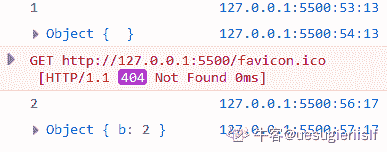

# 百度 2020 校招 Web 前端工程师笔试卷（第二批）

## 1

FIFO 为先进先出的顺序来完成页面的访问，而如果在采用先进先出页面淘汰算法的系统中，一进程在内存占 3 块（开始为空），页面访问序列为 1、2、3、4、1、2、5、1、2、3、4、5、6。运行时会产生（   ）次缺页中断？

正确答案: D   你的答案: 空 (错误)

```cpp
7
```

```cpp
8
```

```cpp
9
```

```cpp
10
```

本题知识点

前端工程师 百度 2020 C++工程师 PHP 工程师 Java 工程师

讨论

[hua9527](https://www.nowcoder.com/profile/669823037)

缺页中断，看清题目，刚开始的三个页应该也需要算进去。如果是页面置换的次数就不用算前面三个页。注意到后面 3 进来的时候，将 1 换出去而不是 5。

发表于 2021-06-16 16:52:44

* * *

[AAA 甲壳虫](https://www.nowcoder.com/profile/414912900)

访问页号序列号： 1、2、3、4、1、2、5、1、2、3、4、5、6
第一次（1）：1
第二次（2）：1 2
第三次（3）：1 2 3
第四次（4）：2 3 4
第五次（1）：3 4 1
第六次（2）：4 1 2
第七次（5）：1 2 5
未改变（1）：1 2 5
未改变（2）：1 2 5
第八次（3）：2 5 3
第九次（4）：5 3 4
未改变（5）：5 3 4
第十次（6）：3 4 6
总共 10 次，选 D

发表于 2021-10-06 16:29:45

* * *

[zhoukzlzu](https://www.nowcoder.com/profile/291027423)

先来先服务利用队列来进行页面读取。队列大小为 3，刚开始队列为空：

*   访问 1，队列中没 1，缺页一次，读入页面 1
*   访问 2，队列中没 2，缺页两次，读入页面 2，队列为 1,2
*   访问 3，队列中没 3，缺页三次，读入页面 3，队列为 1,2,3
*   访问 4，没 4，缺页 4 次，读入页面 4，队列为 2,3,4
*   访问 1，没 1，缺页 5 次，读入页面 1，队列为 3,4,1
*   访问 2，没 2，缺页 6 次，读入页面 2，队列为 4,1,2
*   访问 5，没 5，缺页 7 次，读入页面 5，队列为 1,2,5
*   访问 1，不存在缺页，队列中为 1,2,5
*   访问 2，不缺页，队列中为 1,2,5
*   访问 3，缺页 8 次……

总的次数为 10 次

发表于 2021-09-07 14:58:12

* * *

## 2

下列代码的执行结果
function sum(a, b) {
  return a + b;
}
sum(1, "2");

正确答案: C   你的答案: 空 (错误)

```cpp
NaN
```

```cpp
TypeError
```

```cpp
"12"
```

```cpp
3
```

本题知识点

前端工程师 百度 2020

讨论

[德志](https://www.nowcoder.com/profile/974371261)

+两边有一边是字符串，那这个+就是字符串连接符，它会把其他数据类型调用 String()方法转成字符串然后拼接；

发表于 2022-03-07 21:43:36

* * *

## 3

下列代码的执行结果
let number = 0;
console.log(number++);
console.log(++number);
console.log(number);

正确答案: C   你的答案: 空 (错误)

```cpp
1 1 2
```

```cpp
1 2 2
```

```cpp
0 2 2
```

```cpp
0 1 2
```

本题知识点

前端工程师 百度 2020

## 4

下列代码的执行结果
function fn(...args) {
  console.log(typeof args);
}
fn(21);

正确答案: C   你的答案: 空 (错误)

```cpp
"number"
```

```cpp
"array"
```

```cpp
"object"
```

```cpp
“NaN"
```

本题知识点

前端工程师 百度 2020

讨论

[uesugieriislf](https://www.nowcoder.com/profile/34068835)

Rest 参数可以通过使用三个点...并在后面跟着包含剩余参数的数组名称，来将它们包含在函数定义中。这些点的字面意思是“将剩余参数收集到一个数组中”。所以 args 是一个数组。用 Array.isArray(args)返回 true

发表于 2021-06-23 13:53:04

* * *

[德志](https://www.nowcoder.com/profile/974371261)

注意使用的是 typeof，注意呀，注意

发表于 2022-03-07 21:45:13

* * *

[HLR 超](https://www.nowcoder.com/profile/827346946)

有一段时间没复习基础知识了，居然忘了`typeof`的返回值中没有`array`，数组会被一并识别为`object`。

发表于 2021-09-07 10:42:18

* * *

## 5

下列代码的执行结果
function Fn1(name) {
 if(name){
  this.name = name;
 }
}
Fn1.prototype.name="jack"
let a = new Fn1();
console.log('a:', a.name);

function Fn2(name) {
 this.name = name;
}
Fn2.prototype.name="jack"
let b = new Fn2();
console.log('b:', b.name);

正确答案: C   你的答案: 空 (错误)

```cpp
undefined jack
```

```cpp
jack jack
```

```cpp
jack undefined
```

```cpp
undefined undefined
```

本题知识点

前端工程师 百度 2020

讨论

[uesugieriislf](https://www.nowcoder.com/profile/34068835)

*   在 JavaScript 中，所有的对象都有一个隐藏的 [[Prototype]] 属性，它要么是另一个对象，要么就是 null。

*   我们可以使用 obj.__proto__ 访问它（历史遗留下来的 getter/setter，这儿还有其他方法，很快我们就会讲到）。

*   通过 [[Prototype]] 引用的对象被称为“原型”。

*   如果我们想要读取 obj 的一个属性或者调用一个方法，并且它不存在，那么 JavaScript 就会尝试在原型中查找它。

*   写/删除操作直接在对象上进行，它们不使用原型（假设它是数据属性，不是 setter）。

*   如果我们调用 obj.method()，而且 method 是从原型中获取的，this 仍然会引用 obj。因此，方法始终与当前对象一起使用，即使方法是继承的。

*   for..in 循环在其自身和继承的属性上进行迭代。所有其他的键/值获取方法仅对对象本身起作用。

这里的 a 实际上没有 name 属性，因为条件为 false，所以使用的是原型上的属性。

发表于 2021-06-23 14:08:15

* * *

[牛客 9931803 号](https://www.nowcoder.com/profile/9931803)

let a = new Fn1(); 传的参数为空，在函数 Fn1 中，由于条件 if undefined)为 false，所以函数不赋值，

发表于 2021-05-31 16:28:01

* * *

## 6

下面代码大输出顺序是
setTimeout(() => {
console.log(1)
}, 0)

const P = new Promise((resolve, reject) => {
console.log(2)
setTimeout(() => {
resolve()
console.log(3)
}, 0)
})

P.then(() => {
console.log(4)
})
console.log(5)

正确答案: D   你的答案: 空 (错误)

```cpp
2 1 3 4 5
```

```cpp
5 2 1 3 4
```

```cpp
5 1 2 3 4
```

```cpp
2 5 1 3 4
```

本题知识点

前端工程师 百度 2020

讨论

[uesugieriislf](https://www.nowcoder.com/profile/34068835)

考查事件循环：宏任务->微任务->宏任务一开始的同步代码就是第一个宏任务。这里的注意点在于 promise 中的 then 只有在 state=resolved 的情况下才执行。所以第一个宏任务结束后还没有 resolved，微任务不执行，等到第二轮宏任务执行结束后才执行 then。所以是 2 5 1 3 4

发表于 2021-06-23 14:29:36

* * *

## 7

有 a.js 和 b.js 两个文件，请选择 b 文件中代码的输出
// a.js
let a = 1
let b = {}
setTimeout(() => {    
a = 2    
b.b = 2
}, 100)
module.exports = { a, b }

// b.js
const a = require('./a')
console.log(a.a)
console.log(a.b)
setTimeout(() => {    
console.log(a.a)    
console.log(a.b)
}, 500)

正确答案: C   你的答案: 空 (错误)

```cpp
1 {} 1 {}
```

```cpp
1 {} 2 {b:2}
```

```cpp
1 {} 1 {b:2}
```

```cpp
1 {} 2 {}
```

本题知识点

前端工程师 百度 2020

讨论

[牛客 828262686 号](https://www.nowcoder.com/profile/828262686)

commonjs 导出的是值的拷贝 ，a 所以 a 一直是 1;b 是浅拷贝，拷贝的是对象的引用,所以 a.js 的 b 改变时,b.js 的 a.b 也改变

发表于 2021-11-08 20:15:17

* * *

[uesugieriislf](https://www.nowcoder.com/profile/34068835)

这题答案是不是有问题啊？为啥我的运行结果是 1 {} 2 {b:2}?

发表于 2021-06-23 14:51:02

* * *

[Mr.KLeo](https://www.nowcoder.com/profile/109395575)

这里就是一个深浅拷贝的问题，这里 a.js 中的 b 变量存的是一个对象的地址，由于在 100ms 后改变了堆中的对象属性，所以在 500ms 时，对于 b.js 中的 a.b 来说会引用在 100ms 时改变的那个对象（浅拷贝）

发表于 2021-05-13 23:02:59

* * *

## 8

请选择下面代码输出 1 的次数
var vm = new Vue({  
el: '#example',  
data: {    
message: 'Hello'  
},  
computed: {    
test: function () {      
console.log(1)      
return this.message    
}  
},  
created: function (){    
this.message = 'World'    
for (var i = 0; i < 5; i++) {        
console.log(this.test)    
}  
}
})

正确答案: A   你的答案: 空 (错误)

```cpp
1 次
```

```cpp
2 次
```

```cpp
5 次
```

```cpp
6 次
```

本题知识点

前端工程师 百度 2020

讨论

[初挔](https://www.nowcoder.com/profile/147374963)

因为 vue 的 computed 具有缓存功能。message 只更新了一次，所以 test 只触发一次，执行一次 console.log(1)。具体来说，computed 内的 test 函数会被加入到 message 这个响应式数据的依赖视图中，当修改了 message（触发了 message 的 set）之后，test 这个 computed 的 dirty 属性会被设置为 true，当视图渲染的时候，发现 dirty 为 true 了，就会执行 1 次 test 函数以获取最新的值。 发表于 2021-07-08 15:48:06

* * *

## 9

以下哪行代码添加之后不会造成父容器高度塌陷

正确答案: A   你的答案: 空 (错误)

```cpp
display: flex;
```

```cpp
display:inline;
```

```cpp
float:left;
```

```cpp
position:fixed;
```

本题知识点

前端工程师 百度 2020

## 10

以下这种写法不规范，但是不会报错，其在浏览器中的表现形式是
<p>1<p>2</p></p>

正确答案: D   你的答案: 空 (错误)

```cpp
<p>1<p>2</p></p>
```

```cpp
<p>1</p><p>2</p>
```

```cpp
<p>12</p>
```

```cpp
<p>1</p><p>2</p><p></p>
```

本题知识点

前端工程师 百度 2020

讨论

[牛客 74428207 号](https://www.nowcoder.com/profile/74428207)

p 标签不能嵌套，因为浏览器会自动认为你的代码不规范，自动帮你补充

或者

发表于 2022-03-07 17:51:25

* * *

## 11

下面样式在网页中打开大致是什么形状
.arrow {
  border-top: 10px solid #000;
  border-right: 10px solid transparent;
  display: inline-block;
}
<span class="arrow"></span>

正确答案: C   你的答案: 空 (错误)

本题知识点

前端工程师 百度 2020

讨论

[uesugieriislf](https://www.nowcoder.com/profile/34068835)

border 不是矩形而是三角形。[`www.jianshu.com/p/9a463d50e441`](https://www.jianshu.com/p/9a463d50e441)

这时再把颜色变透明就剩下一个直角三角形了。

要点：

1.  1.  bottom/top,left/right,两组任选其一就可以组成一个正方形

    2.  颜色透明

    3.  inline-block，可以省略宽高

    这样子就是最简写法了。

这样子就是最简写法了。

[CSS 的 inline、block 与 inline-block](https://segmentfault.com/a/1190000015202771)

编辑于 2021-06-23 16:05:06

* * *

## 12

数字 `1` 和 `2` 被浏览器渲染出来的颜色分别是是？

```cpp
<html>
  <head>
    <style>
      .classA { color: blue; }
      .classB { color: red; }
    </style>
  </head>
  <body>
    <p class='classB classA'>1</p>
    <p class='classA classB'>2</p>
  </body>
</html>
```

正确答案: D   你的答案: 空 (错误)

```cpp
blue blue
```

```cpp
blue red
```

```cpp
red blue
```

```cpp
red red
```

本题知识点

前端工程师 百度 2020

讨论

[uesugieriislf](https://www.nowcoder.com/profile/34068835)

标签中使用多个 class，不看这些 class 添加的顺序，而是看 style 中定义的顺序。

发表于 2021-06-23 16:12:17

* * *

## 13

关于 HTTP2 描述正确的是

正确答案: A B C   你的答案: 空 (错误)

```cpp
采用文本格式创术数据
```

```cpp
新增了多路复用
```

```cpp
采用 Header 压缩
```

```cpp
新增了连接的 keep-alive 功能
```

本题知识点

前端工程师 百度 2020 C++工程师 PHP 工程师 Java 工程师

讨论

[戒骄戒躁四大皆空](https://www.nowcoder.com/profile/119884350)

http2 不是二进制传输的吗？A 选项是啥意思？

发表于 2021-06-23 16:46:52

* * *

## 14

当网站对