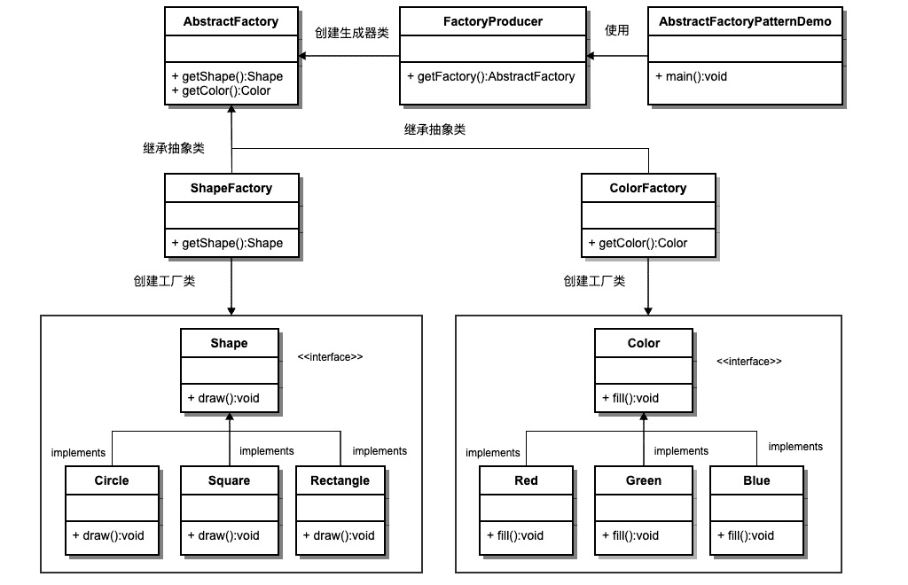
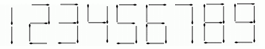

# 百度 2020 校招 C++/PHP 研发工程师笔试卷（第一批）

## 1

关于内存管理，下面说法不正确的是？

正确答案: A C   你的答案: 空 (错误)

```cpp
编译后，每个目标模块都从 0 单元开始编址，称为该模块的物理地址
```

```cpp
物理地址空间是指内存中物理单元的集合，他是地址转换的最终地址，进程在运行时执行指令和访问数据最后都要通过物理地址来存取主存
```

```cpp
分页的思想是：把主存空间划分为大小相等且固定的块，每个线程以块为单位进行划分
```

```cpp
段式管理方式按照用户进程中的自然段划分逻辑空间
```

本题知识点

C++工程师 PHP 工程师 百度 2020 Java 工程师

讨论

[党小板](https://www.nowcoder.com/profile/7503019)

**A：编译后，每个目标模块都从 0 单元开始编址，称为该模块的物理地址**

解析：**编译后，每个目标模块都从 0 单元开始编址，称为该模块的逻辑地址**

**C：分页的思想是：把主存空间划分为大小相等且固定的块，每个线程以块为单位进行划分**

**解析：分页：把主存空间划分为大小相等且固定的块，块相对较小，作为主存的基本单位，每个进程也以块为基本单位划分，进程在执行时，以块为单位逐个申请主存中的块空间。**

发表于 2021-07-06 16:50:59

* * *

[孙糊涂](https://www.nowcoder.com/profile/376886910)

编译后，每个目标模块都从 0 单元开始编址，称为该模块的逻辑地址。用户程序和程序员只需知道逻辑地址，不同进程可以有相同的逻辑地址，因为这些相同的逻辑地址可以映射到主存的不同位置。物理地址空间是指内存中物理单元的集合，它是地址转换的最终地址，进程在运行时执行指令和访问数据最后都要通过物理地址从主存中存取。

发表于 2022-02-17 15:36:26

* * *

## 2

下列关于图的说法正确的是（）

正确答案: B   你的答案: 空 (错误)

```cpp
线性表可以是空表，树可以是空树，图可以是空图；
```

```cpp
某有向完全图含有含有 20 条边，则该有向完全图具有 5 个顶点；
```

```cpp
极大联通子图要求保持图的联通性，还要求子图的边数最少；
```

```cpp
强连通分量仅针对无向图而言，对于有向图仅讨论图的连通性；
```

本题知识点

C++工程师 PHP 工程师 百度 2020 Java 工程师

讨论

[党小板](https://www.nowcoder.com/profile/7503019)

A：*线性表可以是空表**,**树可以是空树**,*但图不*可以是空图*。

B：有向图：n（n-1） 无向图：n(n-1)/2

C：极小联通子图要求子图的边数最少；

D：强连通分量仅针对有向图而言，对于有向图仅讨论图的连通性

发表于 2021-07-06 17:05:01

* * *

## 3

下列关于某无向图的说法中，错误的是（）

正确答案: C   你的答案: 空 (错误)

```cpp
若该图具有 1024 条边，且每个顶点的度数均为 2，则其必有 1024 个顶点；
```

```cpp
若该图具有 1024 条边，且该图具有 1024 个顶点，则该图中必定存在环；
```

```cpp
若该图具有 1024 个顶点，且该图是一个环，则该图有 1023 棵生成树；
```

```cpp
若该图具有 1024 个顶点，且该图是一个环，则该图有 1024 条边；
```

本题知识点

C++工程师 PHP 工程师 百度 2020

讨论

[菜鸟成长-记](https://www.nowcoder.com/profile/367398980)

利用破圈法，每次去掉环中一条边即可得到一个生成树，总共应有 1024 个生成树

发表于 2022-03-20 15:36:05

* * *

## 4

设无向图 G=(V,E),顶点集 V={a,b,c,d,e,f,g,h},边集 E={(a,b),(a,h),(a,e),(b,c),(b,d),(c,d),(c,h),(e,f),(e,g)},则下列选项中，不属于 BFS 序列的是（）

正确答案: B   你的答案: 空 (错误)

```cpp
eafgbhcd
```

```cpp
abcdhefg
```

```cpp
hcabdegf
```

```cpp
dbcahefg
```

本题知识点

C++工程师 PHP 工程师 百度 2020 Java 工程师

讨论

[党小板](https://www.nowcoder.com/profile/7503019)

BFS 遍历没的说，像光圈一样一层一层向外遍历

发表于 2021-07-06 17:05:48

* * *

[炸炸鱼](https://www.nowcoder.com/profile/360412733)

判断触发点的领接节点是否符合要求。很显然，从 a 出发只能到 bhe  因此 B 不符合从 a  bhe 从 e   afg
从 h   ac
从 d  cb

发表于 2021-09-07 14:09:43

* * *

## 5

C++代码如下：struct A{int xmin;int xmax;int ymin;int ymax;};struct B: public A{double classid;};那么 A，B 的对象分别可以使用几个成员变量

正确答案: B C   你的答案: 空 (错误)

```cpp
1
```

```cpp
4
```

```cpp
5
```

```cpp
不确定
```

本题知识点

C++工程师 PHP 工程师 百度 2020

## 6

下面关于 c++线程安全说法正确的有?

正确答案: B C D   你的答案: 空 (错误)

```cpp
std::string 是保证线程安全的
```

```cpp
若每个线程中对全局变量，只有读操作，而无写操作，那么这个全局变量是线程安全的
```

```cpp
使用局部变量是线程安全的
```

```cpp
函数里静态变量多线程读写是不安全的
```

本题知识点

C++工程师 PHP 工程师 百度 2020

讨论

[OFFER/OFFER](https://www.nowcoder.com/profile/203895943)

局部变量存放在栈帧中，它和函数是同生共死的。要想跨越函数调用修改变量，该变量就是在堆中申请的。

发表于 2022-03-21 10:37:46

* * *

## 7

关于下面 C++11 的 std::shared_ptr 说法正确的有?struct Test{};std::shared_ptr<test> p1 = std::make_shared<test>();//1</test></test>std::shared_ptr<test> p2 (new Test);//2</test>

正确答案: A C D   你的答案: 空 (错误)

```cpp
上面的代码 1 语句只会进行 1 次内存申请，2 语句则会 2 次内存申请
```

```cpp
使用 new 申请内存方式不会造成内存泄漏
```

```cpp
构造函数是保护或私有时,无法直接使用 make_shared
```

```cpp
使用 make_shared，对象的内存可能无法及时回收
```

```cpp
如果可以，最好把一个原生指针给多个 shared_ptr 管理，节省内存分配的资源
```

本题知识点

C++工程师 PHP 工程师 百度 2020

讨论

[OFFER/OFFER](https://www.nowcoder.com/profile/203895943)

new Test 会申请两次，一次引用技术，一次 new 对象，但是用 make_shared 只会申请一次空间，引用计数和对象内存都给申请出来。

发表于 2022-03-21 11:26:56

* * *

## 8

有以下 C++代码，那么横线可以填什么可以让 printMax 输出最大值？

```cpp
#include <iostream>
int max(int a, int b)
{
    if (a>b)
    {
        return a;
    }
    return b;
}
void printMax(_____, int a, int b)
{
    std::cout << (*p)(a, b) << std::endl;
}
int main() {
    printMax(p,1,2);
    return 0;
}
```

正确答案: A   你的答案: 空 (错误)

```cpp
填什么都会编译报错
```

```cpp
int (*p)(int,int)
```

```cpp
int p(int,int)
```

```cpp
int max(int,int)
```

```cpp
int *p(int,int)
```

本题知识点

C++工程师 PHP 工程师 百度 2020

讨论

[高你一截](https://www.nowcoder.com/profile/603788935)

我觉得如果填函数指针 int(*p)(int,int)   那么在 main 函数中得写成 printMax(max,1,2); 发表于 2021-11-18 21:55:22

* * *

## 9

分页存储管理将进程的逻辑地址空间分成若干个页，并为各页加以编号，从 0 开始，若某一计算机主存按字节编址，逻辑地址和物理地址都是 32 位，页表项大小为 4 字节，若使用一级页表的分页存储管理方式，逻辑地址结构为页号（20 位），页内偏移量（12 位），则页的大小是（  ）字节？页表最大占用（  ）字节？

正确答案: A   你的答案: 空 (错误)

```cpp
4KB，4MB
```

```cpp
5KB，5MB
```

```cpp
6KB，6MB
```

```cpp
7KB，7MB
```

本题知识点

前端工程师 百度 2020 C++工程师 PHP 工程师 Java 工程师

讨论

[luckingmei](https://www.nowcoder.com/profile/815224596)

一级页表由页号 + 页内偏移量（也就是页大小）页大小： 页内偏移量占 12 位，可以表示大小为 2¹²B = 4kb  ,所以最后页的大小为 4kb 页表的计算：总的页数 * 页表项大小总的页数 =  页号有 20 位，能表示 2²⁰ 个页 = 1MB 个页页表的大小 = 1MB * 4 字节 = 4MB

发表于 2021-09-07 14:37:06

* * *

[牛客 85762678 号](https://www.nowcoder.com/profile/85762678)

[`blog.csdn.net/syh666233/article/details/109295815`](https://blog.csdn.net/syh666233/article/details/109295815)

发表于 2021-08-31 23:10:13

* * *

## 10

对称矩阵是指元素以主对角线为对称轴对应相等的矩阵,对称矩阵是一个方形矩阵，其转置矩阵和自身相等,设矩阵 A 是一个对称矩阵，为了节省存储空间，将其下三角部分按照行优先存放在一维数组 B[0,...n(n+1)/2-1]中，对于下三角部分中的任一元素 ai,j(i 大于等于 j，i 和 j 从 1 开始取值)，在一维数组 B 中的下标 K 的值是（   ）。

正确答案: A   你的答案: 空 (错误)

```cpp
i(i-1)/2+j-1
```

```cpp
i(i+1)/2+j
```

```cpp
i(i+1)/2+j-1
```

```cpp
i(i-1)/2+j
```

本题知识点

C++工程师 PHP 工程师 百度 2020

## 11

下列选项中，关于 HTTP 与 HTTPS 的区别的描述中，正确的是（   ）：

正确答案: A B C   你的答案: 空 (错误)

```cpp
http 是超文本传输协议，信息是明文传输。https 则是具有安全性的 ssl 加密传输协议。
```

```cpp
http 和 https 使用的是完全不同的连接方式，用的端口也不一样。
```

```cpp
http 的连接很简单，是无状态的。HTTPS 协议是由 SSL+HTTP 协议构建的可进行加密传输、身份认证的网络协议，比 http 协议安全。
```

```cpp
http 默认使用 80 端口，https 默认使用 403 端口。
```

本题知识点

前端工程师 百度 2020 C++工程师 PHP 工程师 Java 工程师

讨论

[艾佛森的泪](https://www.nowcoder.com/profile/949330719)

**1、HTTP 是超文本传输协议，信息是明文传输，HTTPS 是具有安全性的 SSL 加密传输协议。**

**2、HTTP 和 HTTPS 使用的是完全不同的连接方式，用的端口也不一样。前者是 80，后者是 443。**

**3、HTTP 和 HTTPS 的工作原理**

**HTTP 的工作原理：一次 HTTP 操作称为一个事物，其工作过程可分为四步**

**1、Client 与 Server 建立连接，单击某个超链接，HTTP 的工作开始。**

**2、连接建立后，Client 发送一个请求给 Server，请求方式的格式为：统一资源标识符（URL）、协议版本号，后边是 MIME 信息包括请求修饰符，Client 信息和可能的内容。**

**3、Server 接到请求后，给予相应的响应信息，其格式为一个状态行，包括信息的协议版本号、一个成功或错误的代码，后边是 MIME 信息包括 Server 信息、实体信息和可能的内容。**

**4、Client 接收 Server 返回的信息通过浏览器显示在用户的显示屏上，然后 Client 和 Server 断开连接。**

**HTTPS 的工作原理：**

**1、Client 使用 HTTPS 的 URL 访问 Web 服务器，要求与 Web 服务器建立 SSL 连接。**

**2、Web 服务器收到客户端请求后，会将网站的证书信息（证书中包含公钥）传送一份给客户端。**

**3、客户端的浏览器与 Web 服务器开始协商 SSL 连接的安全等级，也就是信息加密的等级。**

**4、客户端的浏览器根据双方同意的安全等级，建立会话密钥，然后利用网站的公钥将会话密钥加密，并传送给网站。**

**5、Web 服务器利用自己的私钥解密出会话密钥。**

**6、Web 服务器利用会话密钥加密与客户端之间的通信。**

**5、HTTPS 的优缺点：HTTP 协议。**

**端口**
**https 端口：443**

**服务项目：Https**

**网页浏览端口，能提供加密和通过安全端口传输的另一种 HTTP，简单来说，就是 HTTP 安全版，打开的网页中，如果网址前缀为 https，则说明该网站开启了 https 安全访问。**

**说明：443 端口用于网页浏览，关闭电脑 443 端口，将会导致 https 网页无法正常打开。**

**HTTP：80 端口**

**服务：HTTP**

**说明：用于网页浏览，关闭电脑 80 端口，将会导致无法打开网页。**

**HTTPS 安全超文本传输协议，它是一个安全通信通道，它基于 HTTP 开发，用于在客户计算机和服务器之间交换信息。https 和 http 最大区别在于前者通过安全加密，更安全。**

发表于 2022-03-20 21:24:33

* * *

[初心 58](https://www.nowcoder.com/profile/3503411)

http:80；https:443

发表于 2021-07-02 15:46:44

* * *

[X_W_W_](https://www.nowcoder.com/profile/395282347)

https:443

发表于 2021-06-28 02:43:14

* * *

## 12

用下面哪些 SQL 语句可以从 table 中得到每门课都大于 80 分的学生姓名，下面说法正确的的？name   course   fenshu 小张     语文       81 小张     数学       75 小李     语文       76 小李     数学       90 小王     语文       81 小王     数学       100 小王     英语       90

正确答案: A D   你的答案: 空 (错误)

```cpp
select distinct a.name from table a left join (select distinct name from table where fenshu <= 80) b on a.name=b.name where b.name is null;
```

```cpp
select name from table where fenshu > 80 group by name having cnt > 0;
```

```cpp
select distinct name from table where name in (select distinct name from table  where fenshu > 80)
```

```cpp
select name,sum(case when fenshu<=80 then 1 else 0 end) scr from table group by name having scr=0;
```

本题知识点

C++工程师 PHP 工程师 百度 2020 Java 工程师

讨论

[OFFER/OFFER](https://www.nowcoder.com/profile/203895943)

B。select name from table where fenshu > 80 group by name having cnt > 2 是对的 发表于 2022-03-21 15:22:46

* * *

[斯沃福德](https://www.nowcoder.com/profile/265831332)

居然还能多选？ 大意了。。。。

发表于 2021-12-29 10:51:28

* * *

[offer 快来 1234567890](https://www.nowcoder.com/profile/339176941)

C 为什么不对呀

发表于 2021-08-31 16:50:46

* * *

## 13

关于抽象工厂模式的说法正确的有（）

正确答案: A C D   你的答案: 空 (错误)

```cpp
抽象工厂模式隔离了具体类的生成，使得客户不需要知道什么被创建
```

```cpp
抽象工厂是结构型模式
```

```cpp
增加新的具体工厂和产品族很方便，无须修改已有系统，符合开闭原则
```

```cpp
添加新的产品类时，难于扩展抽象工厂来生产新种类的产品
```

本题知识点

C++工程师 PHP 工程师 百度 2020

讨论

[艾佛森的泪](https://www.nowcoder.com/profile/949330719)



发表于 2022-03-20 21:26:14

* * *

## 14

将一个整数序列整理为降序，两趟处理后序列变为{36, 31, 29, 14, 18, 19, 32}则采用的排序算法可能是 ________。

正确答案: B   你的答案: 空 (错误)

```cpp
选择排序
```

```cpp
插入排序
```

```cpp
快速排序
```

```cpp
堆排序
```

本题知识点

前端工程师 百度 2020 C++工程师 PHP 工程师 Java 工程师

## 15

数据结构中，二分法的查找主要应用于数据量较大情况下的查找，但是数据需要先排好顺序，在顺序表(2，5，7，10，14，15，18，23，35，41，52)中，用二分法查找 12，所需的关键码比较的次数为多少（     ）？

正确答案: C   你的答案: 空 (错误)

```cpp
2
```

```cpp
3
```

```cpp
4
```

```cpp
5
```

本题知识点

前端工程师 百度 2020 C++工程师 PHP 工程师 Java 工程师

## 16

设 a 数组的长度为 N,那么下面程序循环内交换数组元素的代码执行的时间复杂度最坏为?

```cpp
for (int i = N - 1; i > 1; i--)
{
    for (int j = 1; j < i; j++)
    {
        if (a[j] > a[j + 1])
        {
            temp = a[j + 1];
            a[j + 1] = a[j];
            a[j] = temp;
        }
    }
}
```

正确答案: B   你的答案: 空 (错误)

```cpp
O(N)
```

```cpp
O(N 平方)
```

```cpp
O(N 立方)
```

```cpp
O(Nlog2N)
```

```cpp
O(N 平方 log2N)
```

本题知识点

前端工程师 百度 2020 C++工程师 PHP 工程师 Java 工程师

讨论

[]☆~放弃爱❤](https://www.nowcoder.com/profile/6957431)

这段程序很明显是选择排序，所以只要记得选择排序最坏时间复杂度即 o(n²)

编辑于 2021-06-26 16:50:43

* * *

## 17

如果存储结构由数组变为链表，那么下列哪些算法的时间复杂度量级会升高

正确答案: B C   你的答案: 空 (错误)

```cpp
选择排序
```

```cpp
希尔排序
```

```cpp
堆排序
```

```cpp
插入排序
```

本题知识点

前端工程师 百度 2020 C++工程师 PHP 工程师 Java 工程师

讨论

[初心 58](https://www.nowcoder.com/profile/3503411)

希尔排序、堆排序使用数组存储的话，方便获取指定位置的数据。这两个排序都需取指定位置的数据，而使用链表增加了获取指定位置的时间。

发表于 2021-07-02 17:57:00

* * *

## 18

小度和同事们一起去春游，天气炎热，小度自告奋勇去给大家买果汁。
员工一共有 n 名（包括小度）, 果汁一共有 k 种，第 i 位员工每个人都有自己最喜欢的一种果汁。小度到达果汁商店的时候，被告知商店正在举行促销活动，全场果汁买一送一（购买一瓶 i 型果汁，再赠送一瓶 i 型果汁）。小度想让所有人（包括小度）都拿到他们最喜欢的果汁，需要购买多少瓶呢？

本题知识点

C++工程师 PHP 工程师 百度 2020

讨论

[牛客 929818509 号](https://www.nowcoder.com/profile/929818509)

```cpp
#include <bits/stdc++.h>

using namespace std;

int main()
{
    int m, n, x;
    cin >> m >> n;
    unordered_map<int, int> umap;
    for (int i = 0; i < m; ++i) {
        cin >> x;
        umap[x]++;
    }
    int res = 0;
    for (auto [i, num]:umap) {
        res += (num >> 1) + num % 2;
    }
    cout << res << endl;
    return 0;
}
```

发表于 2022-02-01 16:50:39

* * *

[Bilou](https://www.nowcoder.com/profile/708947103)

#include <iostream>#include<map>
using namespace std;

int main(){
    int people,juice;
    int key;
    int ans=0;
    cin>>people>>juice;
    map<int,int> like;
    map<int,int>::iterator it;
    while(cin>>key){
        it=like.find(key);
        if(it!=like.end()){
            it->second++;
        }
        else{
            like.insert(make_pair(key, 1));
        }
    }
    for(it=like.begin();it!=like.end();it++){
        if(it->second%2==0){
            ans=ans+it->second/2;
        }
        else{
            ans=ans+it->second/2+1;
        }
    }
    cout<<ans;

}

发表于 2021-09-28 15:04:47

* * *

[NetMann](https://www.nowcoder.com/profile/460002877)

#include <iostream>#include <vector>usingnamespacestd;int main(){    int workers, juices;    cin>>workers>>juices;    vector<int> likeJuice(workers);    for(int i=0; i<workers; i++){        cin>>likeJuice[i];    }    vector<int> juiceNums(juices, 0); //vector 统计各个种类饮料所需数量    for(int likeNum:likeJuice){        juiceNums[likeNum-1]++;    }    int cups = 0;    for(int num:juiceNums){ //偶数杯/2，奇数杯/2+1        cups+=(num+1)/2;    }    cout << cups << endl;    return 0;}

发表于 2021-09-06 21:09:13

* * *

## 19

小度新聘请了一名员工牛牛, 每个月小度需要给牛牛至少发放 m 元工资(给牛牛发放的工资可以等于 m 元或者大于 m 元, 不能低于 m)。
小度有一些钞票资金, 一共有 n 种不同的面额, 对于面额为的钞票, 小度有张, 并且每一个钞票面额都能整除所有比它大的面额, 并且每一张钞票不能找零。
小度想知道这部分资金最多能牛牛发放多少个月的工资?

本题知识点

C++工程师 PHP 工程师 百度 2020 Java 工程师

讨论

[CharmsGraker](https://www.nowcoder.com/profile/671970057)

卧槽！我 A 了

```cpp
#include <bits/stdc++.h>

typedef std::pair<int, int> PAII;
using namespace std;

struct Money {
    long long x;
    int y;

    bool operator<(Money m2) const {
        return x < m2.x;
    }
};

istream &operator>>(istream &is, Money &money) {
    is >> money.x >> money.y;
    return is;
}

int main() {
    int n;
    long long m;
    cin >> n >> m;
    long long totalSum = 0L;
    vector<Money> moneyGroup(n);
    unordered_map<int,int> modMoney;

    for (int i = 0; i < n; ++i) {
        cin >> moneyGroup[i];
        totalSum += moneyGroup[i].x * moneyGroup[i].y;
    }
    if (totalSum < m) {
        cout << 0 << endl;
    } else {

        sort(moneyGroup.begin(), moneyGroup.end());

        long long ans = 0;
        while (1) {
            long long rest = m;
            for (int i = n - 1; i >= 0 && rest > 0; --i) {
                if (moneyGroup[i].y == 0)
                    continue;
                // 有个整除关系感觉没用到。
                // 先用大钱的思路没错，但是用小钱补的时候，小钱能提供更多的容错率

                auto need = rest / moneyGroup[i].x;
                if (need > moneyGroup[i].y) {
                    need = moneyGroup[i].y - 1;
                }
                rest -= need * moneyGroup[i].x;
                moneyGroup[i].y -= need;
            }

            for (int i = 0; i < n && rest > 0; ++i) {
                if (moneyGroup[i].y == 0)
                    continue;
                auto need = max((int)(rest / moneyGroup[i].x),1);
                if (need > moneyGroup[i].y) {
                    need = moneyGroup[i].y;
                }

                rest -= need * moneyGroup[i].x;
                moneyGroup[i].y -= need;
            }
            if (rest > 0)
                break;
            ++ans;
        }
        cout << ans;
    }
}
```

发表于 2022-03-20 21:17:01

* * *

## 20

牛牛给了小度 n 根火柴和 m 种数字(m 只能是 1 到 9)，小度只能摆这 m 种数字，小度想知道能摆出来最大的数的多少。

如图所示: 摆数字 1,2,3,4,5,6,7,8,9 分别需要花费 2,5,5,4,5,6,3,7,6 根火柴。

本题知识点

C++工程师 PHP 工程师 百度 2020

讨论

[牛客 766902794 号](https://www.nowcoder.com/profile/766902794)

贪心+dp#include <iostream>
#include <string>
#include <algorithm>
#include <math.h>

using namespace std;

int main()
{
    string res = "";

    int num[10] = {0,2,5,5,4,5,6,3,7,6};
    int n,m;
    cin>>n>>m;
    int da[m+10];
    for(int i=0;i<m;i++) cin>>da[i];

    int f = 100;
    int id = -1;
    for(int i=0;i<m;i++) {
        if(num[da[i]] < f) f = num[da[i]];
    }
    for(int i=0;i<m;i++) if(f == num[da[i]]) id = max(id,da[i]);

    while(n >=30)
    {
        res += to_string(id);
        n-=num[id];
    }
    //cout<<n<<endl;

    long long dp[n+1];
    for(int i=0;i<=n;i++) dp[i] = -1;
    for(int i=0;i<m;i++)
    {
        if(num[da[i]] <= n && dp[num[da[i]]] < da[i]) dp[num[da[i]] ] = da[i];
        //cout<<da[i]<<" "<<num[da[i]]<<" "<<dp[num[da[i]]]<<endl;
    }
    dp[0] = 0;

    for(int i=1;i<=n;i++)
    {
        for(int j=0;j<m;j++)
        {
            if(i - num[da[j]] >= 0 && dp[i - num[da[j]]] >0)
            {
                long long newval = dp[i - num[da[j]] ] *10 + da[j];
                dp[i] = max(dp[i],newval);
            }
        }
    }
   // cout<<dp[n]<<endl;
       if(res.length() == 0) 
       {
           cout<<to_string(dp[n])<<endl;
           return 0;    
    }
       string newstr =  to_string(dp[n]);
    for(int i=0;i<newstr.length();i++)
    {
        if(res[0] >= newstr[i]) 
        {
            res =  newstr.substr(0,i) + res + newstr.substr(i,newstr.length() - i); 
            break;
        }
    }
    cout<<res<<endl;

    return 0;
}

 发表于 2022-03-22 17:57:13

* * *

[OFFER/OFFER](https://www.nowcoder.com/profile/203895943)

```cpp
#include <bits/stdc++.h>
using namespace std;
static int weight[10] = {0,2,5,5,4,5,6,3,7,6};
string max_str(const string& str1, const string& str2)
{
    int n1 = str1.size();
    int n2 = str2.size();
    if(n1 > n2) return str1;
    else if(n1 < n2) return str2;
    if(str1.compare(str2) < 0) return str2;
    return str1;
}
unordered_map<int,string> dp;
int main()
{
    int capacity, m;
    cin >> capacity >> m;
    vector<int> nums(m , 0);
    for(int i = 0;i < m;i++)
        cin >> nums[i];
    for(int i = 1;i <= capacity;i++)
        dp[i] = "";
    for(int j = 1;j <= capacity;j++)
        for(int i = 0;i < m;i++)
            if(j-weight[nums[i]] >= 0)
                // j == weight[nums[i]] 进行初始化
                if(dp[j-weight[nums[i]]] != "" || j == weight[nums[i]])
                    dp[j] = max_str(dp[j], to_string(nums[i]) + dp[j - weight[nums[i]]]);
    cout << dp[capacity] << endl;
    return 0;
}
```

发表于 2022-03-20 23:01:34

* * *

[CharmsGraker](https://www.nowcoder.com/profile/671970057)

```cpp
#include<bits/stdc++.h>

int dig_weight[] = {2, 5, 5, 4, 5, 6, 3, 7, 6};

using namespace std;

int main() {
    int capacity, n_item;
    cin >> capacity >> n_item;
    vector<int> weight(9, 0x3ffffff);
    for (int i = 0; i < n_item; ++i) {
        int dig;
        cin >> dig;
        weight[dig - 1] = dig_weight[dig - 1];
    }
    vector<int> dp(capacity + 1,-0x3ffffff);
    dp[0] = 0;
    for (int i = 1; i <= 9; ++i) {
        for (int j = weight[i - 1]; j <= capacity; ++j) {
            dp[j] = max(dp[j], dp[j - weight[i - 1]] + 1);
        }
    }
    string ans;
    for (int i = 9, j = capacity; i >= 1; --i) {
        for (int cost = weight[i - 1]; j >= cost && dp[j] == dp[j - cost] + 1; j -= cost) {
            ans += (i + '0');
        }
    }
    cout << ans;
}
```

发表于 2022-03-20 19:32:35

* * *

## 21

linux 下可以查看网卡流量情况的是

正确答案: D   你的答案: 空 (错误)

```cpp
ps
```

```cpp
flow
```

```cpp
network
```

```cpp
nload
```

本题知识点

前端工程师 百度 2020 C++工程师 PHP 工程师

## 22

有一个日志文件 Test.txt，其中每行的内容是服务器的 mac 地址，下面哪个命令可以找到次数最多的前 5 个 mac 和出现的次数

正确答案: B C   你的答案: 空 (错误)

```cpp
cat Test.txt | count -n | sort -rn | head -n 5
```

```cpp
sort Test.txt | uniq -c | sort -rn | head -n 5
```

```cpp
cat Test.txt | sort | uniq -c | sort -rn | head -n 5
```

```cpp
uniq -c Test.txt | sort -nr | top -n 5
```

本题知识点

前端工程师 百度 2020 C++工程师 PHP 工程师 Java 工程师

## 23

php 中如果想查看某个表达式的值和类型，可以用 ___?

正确答案: D   你的答案: 空 (错误)

```cpp
echo()
```

```cpp
print_r()
```

```cpp
var_export()
```

```cpp
var_dump()
```

本题知识点

Java 工程师 C++工程师 iOS 工程师 安卓工程师 运维工程师 前端工程师 算法工程师 PHP 工程师 京东 2018 百度 2020

讨论

[mark_php](https://www.nowcoder.com/profile/38262677)

D 几种打印方式效果如下：

```cpp
$demoArr = ['key'=>'value'];
echo $demoArr;
print $demoArr;
print_r($demoArr);
var_export($demoArr);
var_dump($demoArr);

ArrayArrayArray ( [key] => value ) array ( 'key' => 'value', )
/Applications/MAMP/htdocs/leaning/php/index.php:16:
array (size=1)
  'key' => string 'value' (length=5)
```

echo 和 print 的区别在于 echo 可以同时打印多个，print 只能打印单个但是有返回值

编辑于 2021-04-15 10:18:16

* * *</iostream>