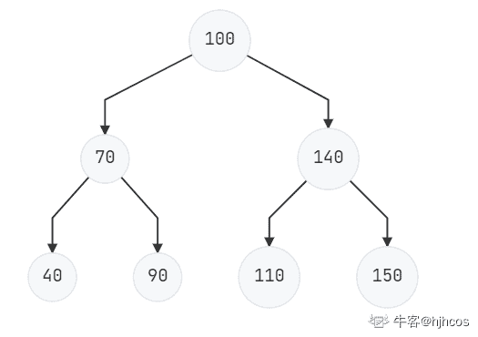
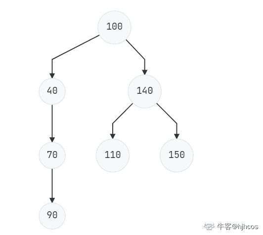

# 百度 2020 校招 C++/PHP 研发工程师笔试卷（第二批）

## 1

下列关于图的应用说法错误的是（）

正确答案: C   你的答案: 空 (错误)

```cpp
任何一个图的连通图的最小生成树有一棵或多棵；
```

```cpp
某无向连通图中没有权值相同的边，该图的最小生成树唯一；
```

```cpp
某无向图中有权值相同的边，则该图最小生成树一定不唯一；
```

```cpp
可利用 Prim 算法和 Kruskal 两种算法来构造图的最小生成树；
```

本题知识点

C++工程师 PHP 工程师 百度 2020

## 2

下面关于 c++静态成员在类里面说法正确的有

正确答案: B D E   你的答案: 空 (错误)

```cpp
创建静态成员是为了方便对象能直接调用
```

```cpp
静态成员函数里面不能使用该类的 this 指针
```

```cpp
静态数据成员不受 private 控制符作用
```

```cpp
静态成员函数的参数不能带有该类的 this 指针
```

```cpp
静态成员函数不能被声明为 virtual 函数
```

本题知识点

C++工程师 PHP 工程师 百度 2020

讨论

[OFFER/OFFER](https://www.nowcoder.com/profile/203895943)

A.C++提供了静态成员，用以解决同一个类的不同对象之间数据成员和函数的共享问题。C.静态数据成员是要受 private 控制符影响的

发表于 2022-03-22 10:11:09

* * *

## 3

看下面代码，关于运算符重载说法正确的有？class Time{private:int minutes;public:Time operator+(const Time & t);friend Time operator*(double clock,const Time &time);};

正确答案: B C E   你的答案: 空 (错误)

```cpp
若 Time operator+(const Time & t)重载正确，那么 Time t1; auto time= 22+t1;是一个正确的使用。
```

```cpp
friend Time operator*(double clock,const Time &time)，这个函数可以访问 Time 类的 minutes 变量
```

```cpp
friend Time operator*(double clock,const Time &time)，这个函数是一个非成员函数
```

```cpp
friend Time operator*(double clock,const Time &time)，这个函数传入的参数可以是 3 个
```

```cpp
"->"只能重载为类成员函数
```

本题知识点

C++工程师 PHP 工程师 百度 2020

讨论

[牛客 842669148 号](https://www.nowcoder.com/profile/842669148)

->只能重载为成员函数。

发表于 2021-09-25 17:01:33

* * *

## 4

下面关于 STL 容器的 capacity()和 size()属性说法正确的是：

正确答案: A B D   你的答案: 空 (错误)

```cpp
size 是当前 vector 容器真实占用的大小，capacity 是指预分配的内存空间
```

```cpp
使用 reserve()可以修改 capacity 的值
```

```cpp
vector、string 和 set 都拥有 capacity()和 size()属性
```

```cpp
容器的 size 一旦超过 capacity 的大小，vector 会重新配置内部的存储器
```

本题知识点

C++工程师 PHP 工程师 百度 2020

讨论

[大厂算法岗必拿下](https://www.nowcoder.com/profile/226331560)

```cpp
vector、string 都拥有 capacity()和 size()属性
```

发表于 2021-09-21 05:20:02

* * *

## 5

以下 C++代码，那些语句会导致编译错误?

```cpp
#include <iostream>
class Foo {
public:
    explicit Foo(int a)
    {
        std::cout << "explicit Foo(int a)" << std::endl;
    }
    void func()
    {
        std::cout << "void func()" << std::endl;
    }
private:
    Foo(const Foo& foo)
    {
        std::cout << "Foo(const Foo& foo)" << std::endl;
    }
};
int main()
{
    Foo a;//1
    Foo b();//2
    Foo c(1);//3
    Foo d = c;//4
    return 0;
}
```

正确答案: A D   你的答案: 空 (错误)

```cpp
1
```

```cpp
2
```

```cpp
3
```

```cpp
4
```

本题知识点

C++工程师 PHP 工程师 百度 2020

讨论

[清晨🇨🇳](https://www.nowcoder.com/profile/248060526)

语句 2 是警告，是将 Foo b(); 看成了函数的声明，不是编译错误。

发表于 2022-03-22 14:31:54

* * *

[OFFER/OFFER](https://www.nowcoder.com/profile/203895943)

“Foo b(void)”: 未调用原型函数(是否是有意用变量定义的?)

发表于 2022-03-22 10:19:09

* * *

[laytl](https://www.nowcoder.com/profile/43998848)

b 也错了吧

发表于 2022-01-01 12:17:47

* * *

## 6

计算机系统中并发是对有限的物理资源强制行使多用户共享，消除计算机部件之间的互等现象，以提高系统资源利用率，现假设某单 CPU 系统中有输入和输出设备各 1 台，现有 3 个并发执行的作业，每个作业的输入、 计算和输出时间均分别为 2ms、3ms 和 4ms,且都按输入、计算和愉出的顺序执行，则执行完 3 个作业需要的时间最少是（  ）

正确答案: B   你的答案: 空 (错误)

```cpp
18ms
```

```cpp
17ms
```

```cpp
22ms
```

```cpp
23ms
```

本题知识点

C++工程师 PHP 工程师 百度 2020 Java 工程师

讨论

[zhoukzlzu](https://www.nowcoder.com/profile/291027423)


发表于 2021-09-07 14:52:27

* * *

[牛客小玮](https://www.nowcoder.com/profile/200045406)

计算的时候可以输入，输出的时候可以计算，所以最后应该是 2+3+4+4+4=17

发表于 2021-06-01 12:14:29

* * *

## 7

FIFO 为先进先出的顺序来完成页面的访问，而如果在采用先进先出页面淘汰算法的系统中，一进程在内存占 3 块（开始为空），页面访问序列为 1、2、3、4、1、2、5、1、2、3、4、5、6。运行时会产生（   ）次缺页中断？

正确答案: D   你的答案: 空 (错误)

```cpp
7
```

```cpp
8
```

```cpp
9
```

```cpp
10
```

本题知识点

前端工程师 百度 2020 C++工程师 PHP 工程师 Java 工程师

讨论

[hua9527](https://www.nowcoder.com/profile/669823037)

缺页中断，看清题目，刚开始的三个页应该也需要算进去。如果是页面置换的次数就不用算前面三个页。注意到后面 3 进来的时候，将 1 换出去而不是 5。

发表于 2021-06-16 16:52:44

* * *

[AAA 甲壳虫](https://www.nowcoder.com/profile/414912900)

访问页号序列号： 1、2、3、4、1、2、5、1、2、3、4、5、6
第一次（1）：1
第二次（2）：1 2
第三次（3）：1 2 3
第四次（4）：2 3 4
第五次（1）：3 4 1
第六次（2）：4 1 2
第七次（5）：1 2 5
未改变（1）：1 2 5
未改变（2）：1 2 5
第八次（3）：2 5 3
第九次（4）：5 3 4
未改变（5）：5 3 4
第十次（6）：3 4 6
总共 10 次，选 D

发表于 2021-10-06 16:29:45

* * *

[zhoukzlzu](https://www.nowcoder.com/profile/291027423)

先来先服务利用队列来进行页面读取。队列大小为 3，刚开始队列为空：

*   访问 1，队列中没 1，缺页一次，读入页面 1
*   访问 2，队列中没 2，缺页两次，读入页面 2，队列为 1,2
*   访问 3，队列中没 3，缺页三次，读入页面 3，队列为 1,2,3
*   访问 4，没 4，缺页 4 次，读入页面 4，队列为 2,3,4
*   访问 1，没 1，缺页 5 次，读入页面 1，队列为 3,4,1
*   访问 2，没 2，缺页 6 次，读入页面 2，队列为 4,1,2
*   访问 5，没 5，缺页 7 次，读入页面 5，队列为 1,2,5
*   访问 1，不存在缺页，队列中为 1,2,5
*   访问 2，不缺页，队列中为 1,2,5
*   访问 3，缺页 8 次……

总的次数为 10 次

发表于 2021-09-07 14:58:12

* * *

## 8

二叉排序树又称为二叉查找树，在二叉排序树进行插入操作时,每次插入的结点都是二叉排序树上新的叶子结点，现假设分别用下列序列构造二叉排序树，与用其他三个序列所构造的结果不同的是（    ）？

正确答案: D   你的答案: 空 (错误)

```cpp
{100，70，40，90，140，150，110}
```

```cpp
{100，70，90，40，140，110，150}
```

```cpp
{100，140，110，150，70，40，90}
```

```cpp
{100，40，70，90，140，110，150}
```

本题知识点

C++工程师 PHP 工程师 百度 2020 Java 工程师

讨论

[hjhcos](https://www.nowcoder.com/profile/63979706)

**{100，70，40，90，140，150，110}{100，70，90，40，140，110，150}{100，140，110，150，70，40，90}
的树图为** ******{100，40，70，90，140，110，150}****的树图为****** 

编辑于 2022-03-22 16:15:09

* * *

[大厂算法岗必拿下](https://www.nowcoder.com/profile/226331560)

从头到尾，进行比较，如果比根节点大，插入到右边，否则插入到左边，下面的子节点也满足同样的插入方法

发表于 2021-09-21 05:48:51

* * *

## 9

平常在设计数据结构的时候，经常会用到堆，以下哪个是最大堆

正确答案: A   你的答案: 空 (错误)

本题知识点

C++工程师 PHP 工程师 百度 2020

讨论

[咳 ke](https://www.nowcoder.com/profile/943539800)

最大堆的根节点肯定是所有元素中最大的，d 不是完全二叉树，所以选 a

发表于 2021-05-18 20:58:31

* * *

## 10

关于 HTTP2 描述正确的是

正确答案: A B C   你的答案: 空 (错误)

```cpp
采用文本格式创术数据
```

```cpp
新增了多路复用
```

```cpp
采用 Header 压缩
```

```cpp
新增了连接的 keep-alive 功能
```

本题知识点

前端工程师 百度 2020 C++工程师 PHP 工程师 Java 工程师

讨论

[戒骄戒躁四大皆空](https://www.nowcoder.com/profile/119884350)

http2 不是二进制传输的吗？A 选项是啥意思？

发表于 2021-06-23 16:46:52

* * *

## 11

初始序列为 1 2 3 4 5 6 的完全二叉树，1 为根节点，2，3 分别为 1 的左右孩子，4，5 分别为 2 的左右孩子，6 为 3 的左孩子，采用大根堆调整后，堆所对应的中序遍历序列应为：

正确答案: A   你的答案: 空 (错误)

```cpp
4 5 2 6 1 3
```

```cpp
6 5 4 3 2 1
```

```cpp
6 5 4 2 3 1
```

```cpp
4 2 5 1 3 6
```

本题知识点

C++工程师 PHP 工程师 百度 2020 Java 工程师

## 12

有这样一个业务场景：一个请求需要一系列的处理工作,那么我们选择以下哪一种设计模式比较合适

正确答案: D   你的答案: 空 (错误)

```cpp
观察者模式
```

```cpp
桥接模式
```

```cpp
工厂模式
```

```cpp
责任链模式
```

本题知识点

C++工程师 PHP 工程师 百度 2020

## 13

假设销售团队拥有一张账目表 account,表中每行记录记录着销售员 2016 年到 2018 年每个月的销售额,如果销售员当月没有销售额,则不录入到表中,目前管理员想查看下 2018 年每个月都有销售额的销售人员的总销售额,那么 sql 语句是:

> create table `account`(    `id` int(11) not null auto_increment,    `year` int(11) not null comment '年份',    `name` char(30) not null comment '销售员',    `month` int(11) not null comment '月份',    `sales` int(11) not null comment '销售额',    primary key(`id`))engine = innodb;

正确答案: C   你的答案: 空 (错误)

```cpp
select name, sum(sales) from account where month = 12 and year = 2018 group by name having count(sales)=12 order by name asc
```

```cpp
select name, sum(sales) from account where month = 12 group by name having year=2018 order by name asc
```

```cpp
select name, sum(sales) from account where year = 2018 group by name having count(sales)=12 order by name asc
```

```cpp
select name, sum(sales) from account group by name having year=2018 and count(sales)=12 order by name asc
```

本题知识点

C++工程师 PHP 工程师 百度 2020 Java 工程师

## 14

在数据结构中，不同的排序方法决定了排序的时间效率，现在假设对关键字序列 22、86、19、49、12、30、65、35、18 做一趟排序后，得到的结果如下：18、12、19、22、49、30、65、35、86。因此，根据上述结果可以得到采用的排序方法是（     ）？

正确答案: C   你的答案: 空 (错误)

```cpp
冒泡排序
```

```cpp
快速排序
```

```cpp
直接插入排序
```

```cpp
堆排序
```

本题知识点

前端工程师 百度 2020 C++工程师 PHP 工程师 Java 工程师

讨论

[HLR 超](https://www.nowcoder.com/profile/827346946)

选第一个数 22 作为化分数，快拍刚好得到目标结果，直接插入排序一趟怎么能达到这个效果？

发表于 2021-09-07 11:55:20

* * *

[夏川未来](https://www.nowcoder.com/profile/740834334)

明显快排

发表于 2022-03-04 18:18:20

* * *

[hjhcos](https://www.nowcoder.com/profile/63979706)

直接插入排序第一趟变量 以 22 为基准 后续小于 22 的值插到 22 的左边，大于的值插到 22 的右边 22、86、19、49、12、30、65、35、18 第一趟：22、19、49、12、30、65、35、18、86    count = 0  i = 119、22、49、12、30、65、35、18、86    count = 1  i = 119、22、12、30、65、35、18、86、49    count = 2  i = 212、19、22、30、65、35、18、86、49    count = 3  i = 212、19、22、65、35、18、86、49、30    count = 4  i = 312、19、22、35、18、86、49、30、65    count = 5  i = 312、19、22、18、86、49、30、65、35    count = 6  i = 318、12、19、22、86、49、30、65、35    count = 7  i = 318、12、19、22、49、30、65、35、86    count = 8  i = 4 

发表于 2022-03-22 15:23:33

* * *

## 15

一个小根堆的序列为:{5, 12, 7, 18, 31, 13, 9}，删除根节点 5 之后，小根堆会自动调整重新变为小根堆，小根堆的最后的叶子节点为?

正确答案: B   你的答案: 空 (错误)

```cpp
31
```

```cpp
13
```

```cpp
9
```

```cpp
12
```

```cpp
18
```

本题知识点

前端工程师 百度 2020 C++工程师 PHP 工程师 Java 工程师

讨论

[Decade_](https://www.nowcoder.com/profile/534829948)

这题我怎么推，得到的结果都是 31，求解惑

发表于 2021-08-25 18:25:44

* * *

## 16

先序遍历指按照根左右的顺序沿一定路径经过路径上所有的结点，现假设一颗二叉树的后序遍历为 69, 67, 71, 70, 72, 68, 66, 中序遍历为 69, 67, 66, 71, 70, 68, 72,则先序遍历为（ ）？

正确答案: D   你的答案: 空 (错误)

```cpp
66, 67, 68, 69, 70, 71, 72
```

```cpp
66, 67, 69, 68, 70, 71, 72
```

```cpp
66, 69, 67, 70, 71, 72, 68
```

```cpp
66, 67, 69, 68, 71, 70, 72
```

本题知识点

前端工程师 百度 2020 C++工程师 PHP 工程师 Java 工程师

讨论

[戒骄戒躁四大皆空](https://www.nowcoder.com/profile/119884350)

选 B 的这边集合

发表于 2021-06-23 16:53:20

* * *

[不搭 201812091851305](https://www.nowcoder.com/profile/678939833)

选 B 啊

发表于 2021-06-19 09:24:56

* * *

[hua9527](https://www.nowcoder.com/profile/669823037)

🤔应该选 B

发表于 2021-06-16 17:28:37

* * *

## 17

对于以下代码分析

```cpp
void test(int N)
{
    int i=1;
    while(i<N)
    {
        i=i*4;
    }
}
```

下面选项哪个最符合上面代码中循环执行的次数

正确答案: C   你的答案: 空 (错误)

```cpp
0.5N
```

```cpp
log2N
```

```cpp
0.5log2N
```

```cpp
0.2log2N
```

```cpp
0.4log2N
```

本题知识点

前端工程师 百度 2020 C++工程师 PHP 工程师 Java 工程师

讨论

[求↑岸](https://www.nowcoder.com/profile/616851188)

O(N) = log(4)N = 0.5log(2)N 括号里面是 log 函数的底数，log(a²)N=1/2log(a)N

发表于 2021-08-11 10:25:17

* * *

## 18

修改/home 下 test 目录以及目录下所有文件，可以支持所有人可读可写的，以下能实现的有?

正确答案: A B   你的答案: 空 (错误)

```cpp
chmod 777 /home/test -R
```

```cpp
chmod 666 /home/test -R
```

```cpp
chmod 766 /home/test
```

```cpp
chmod 765 /home/test -R
```

本题知识点

前端工程师 百度 2020 C++工程师 PHP 工程师 Java 工程师

讨论

[夜寻极光。](https://www.nowcoder.com/profile/868966489)

Linux 的每个文件一般都有三个权限 r--读，w--写，x--执行，其分别对应的数值为 4，2，1。

发表于 2021-08-31 20:12:50

* * *

[hua9527](https://www.nowcoder.com/profile/669823037)

读写权限，r w 分别对应的数字是 4,2,所以拥有读写权限那么应该大于等于 6,又是对目录下所有文件包括目录进行的，-R 表示递归的对子目录下文件也这样操作

发表于 2021-06-16 17:28:02

* * *

## 19

下列选项中，可能导致当前 linux 进程阻塞?

正确答案: A C   你的答案: 空 (错误)

```cpp
进程申请临界资源
```

```cpp
该进程使用时间过长，进程调度程序让其他进程使用 CPU
```

```cpp
进程 从磁盘读数据
```

```cpp
时间片用完了
```

本题知识点

前端工程师 百度 2020 C++工程师 PHP 工程师 Java 工程师

讨论

[清香的茉莉](https://www.nowcoder.com/profile/934893715)

这里应该指的是进入阻塞态，而不是主观意义上的阻塞

发表于 2021-07-20 09:05:34

* * *

## 20

以下程序存在何种安全漏洞？<tr><td class="font_content" align="right">交易状态：</td><td class="font_content" align="left"><?php echo $_GET['trade_status'];?></td></tr>

正确答案: A   你的答案: 空 (错误)

```cpp
XSS
```

```cpp
sql 注入
```

```cpp
命令执行
```

```cpp
代码执行
```

本题知识点

C++工程师 PHP 工程师 百度 2020

## 21

牛牛给度度熊出了一个数学题，牛牛给定数字，希望度度熊能找到一组**非负整数**满足且尽量小。度度熊把这个问题交给了你，希望你能帮他解决。

本题知识点

前端工程师 百度 2020 C++工程师 PHP 工程师 Java 工程师

讨论

[牛客-新蜗牛](https://www.nowcoder.com/profile/583491770)

思路:    在满足题目的条件下，由 m,n 中较小的那个独自显小时,a+b 最小
    证明:        (n−a)(m−b)        =nm−am−bn+ab        =nm−am−bm+bm−bn+ab        =(n−a−b)m+b(m−n+a)        ≥(n−a−b)m=[n−(a+b)]m 代码:    #include <cstdio>
    int main(){
        long long n,m,k;
        scanf("%lld %lld %lld",&n,&m,&k);
        if(n>m){
           long long temp = n;
            n = m;
            m = temp;
        }
        long long sum =0;
        while ((n-sum)*m>k){
            sum++;
        }
        printf("%lld",sum);
    }

发表于 2021-06-15 14:28:32

* * *

[仰望夜空](https://www.nowcoder.com/profile/739688788)

已知（n-a)(m-b)<=k, n>0, m>0,k>0 a>=0, b>=0;求 a+b 的最小值。首先，由于 n 和 m 的大小关系不会影响结果，所以我们假设 **n<=m**k>=(n-a)(m-b)=nm-ma-nb+ab=m(n-a)+b(a-n)=m(n-a-b)+b(a-n+m)=m(n-(a+b)) + b ((m-n) + a) >= m(n - (a+b))所以：a+b >= n - k / m 因此：a+b 的最小值是 n - k/m。#include <iostream>using namespace std;

#define llong long long

int main() {
    llong n,m,k, tmp;
    cin>>n>>m>>k;
    if(n > m) { tmp = n; n = m; m = tmp; }
    cout<<n - k/m<<endl;
}

发表于 2021-12-29 22:08:58

* * *

[皮卡丘乒乓](https://www.nowcoder.com/profile/414031440)

```cpp
#include <iostream>
using namespace std;
int main()
{
    double n,m,k;
    while(cin>>n>>m>>k)
    {
        int count = 0;
        if(n*m <=k)
            cout<<0<<endl;
        if(n>m)
            swap(n,m);
        while(n--)
        {
            count++;
            if(n*m<=k)
            {
                break;
            }
        }

    cout<<count<<endl;
    }
    return 0;
}
```

发表于 2021-08-07 02:18:52

* * *

## 22

老板给度度熊分配了个工作，第个工作需要耗费单位时间，每个工作必须老板给定的限制时间前完成。
度度熊从时刻开始工作，在同一时间度度熊手上只能做一件工作，度度熊想知道他是否能把所有工作都完成呢？

本题知识点

前端工程师 百度 2020 C++工程师 PHP 工程师

讨论

[香菜君](https://www.nowcoder.com/profile/307145266)

```cpp
// JavaScript - V8
let circle = parseInt(readline())
while(circle--) {
  let flag = true
  let nums = parseInt(readline())
  while(nums--) {
  let arr = (readline()).split(' ')
    if(parseInt(arr[0]) > parseInt(arr[1])) {
      flag = false
    }
  }
  if (flag) {
  console.log('Yes')
  } else {
  console.log('No')}
  }
```

编辑于 2021-09-07 17:02:18

* * *

[小浣熊 zzZZ](https://www.nowcoder.com/profile/404523244)

```cpp
#include<iostream>
#include<vector>
#include<algorithm>

using namespace std;

int main(){
    int k=0;
    cin>>k;
    for(int i=0;i<k;i++){
        int n=0;
        cin>>n;
        vector<pair<int,int>> a;
        for(int j=0;j<n;j++){
            int x=0,y=0;
            cin>>x>>y;
            a.push_back({x,y});
        }
        sort(a.begin(),a.end(),[](pair<int,int> x1,pair<int,int> x2){
            if(x1.second==x2.second) return x1.first<x2.first;
            return x1.second<x2.second;
        });
        int time=0;
        int j=0;
        for(;j<n;j++){
            time+=a[j].first;
            if(time>a[j].second) break;
        }
        if(j==n) cout<<"Yes"<<endl;
        else cout<<"No"<<endl;
    }
    return 0;
}
```

发表于 2021-08-17 22:46:19

* * *

[夏川未来](https://www.nowcoder.com/profile/740834334)

银行家算法

发表于 2022-03-04 18:34:51

* * *

## 23

牛牛和牛妹在做游戏，在他们面前的桌子上有一棵树，初始号点是黑点，号点是白点，其他都是空点，两人轮流操作，牛牛可以选择一个黑点并把该黑点周围的某个空点染成黑色，牛妹可以选择一个白点并把该白点周围的某个空点染成白色，直到有一方不能涂了，另一方获胜。

本题知识点

C++工程师 PHP 工程师 百度 2020

讨论

[wwwwwizkd](https://www.nowcoder.com/profile/582749707)

先记录无向图，再从 1 出发，把无向图变成有向图。n 的后续节点只能被 mei 标记 niu 和 mei 需要竞争的就是 1 到 n 之间的路径中的节点，节点数记为 m，那么 mei 能标记 m/2,niu 能标记 m-m/2 得到 mei 能标记的节点总数后，niu 能标记的节点数就是 n-2-mei 最后比较两者能标记的数量

发表于 2021-09-14 12:14:22

* * *

[牛客 171666951 号](https://www.nowcoder.com/profile/171666951)

通过 bfs 找到 1 号点与 n 号点的路径，判断路径上哪一些节点属于牛牛，哪一些属于牛妹，记录下边界（代码中的 bound），因为最佳策略就是牛牛向下扩张，牛妹向上拓张这样才能抢占到更多的空白点。然后再通过 bfs 计算牛牛拥有的节点数，牛妹拥有的节点数，判断哪一个多就是哪一个赢，相等的话是牛妹赢。

```cpp
#include<iostream>
#include<vector>
#include<queue>
#include<unordered_map>
#include<unordered_set>
using namespace std;
struct node {
    int cur_node;
    int pre_node;
    int deep;
    node(int a, int b, int c) :cur_node(a), pre_node(b), deep(c) {}
    node():cur_node(0),pre_node(0),deep(0){}
};
pair<int, int> find_way(vector<vector<int>>& map, int n)    // 寻找边界节点
{
    queue<node> queue;
    node tmp(0, -1, 0);
    queue.push(tmp);
    unordered_map<int, node> visited;
    visited[0] = tmp;
    while (!queue.empty())
    {
        tmp = queue.front();
        queue.pop();
        if (tmp.cur_node == n - 1)        // 到达节点 n 终止 bfs
            break;
        for (int i = 0; i < map[tmp.cur_node].size(); i++)
        {
            int t = map[tmp.cur_node][i];
            if (t == 0)
                continue;
            if (visited.find(i) != visited.end())
                continue;
            node next(i, tmp.cur_node, tmp.deep + 1);
            visited[i] = next;
            queue.push(next);
        }
    }
    node fin_node = visited[n - 1];    // 倒推回去找途径的节点
    int op_num = (fin_node.deep - 1) / 2;    //计算牛妹拥有的节点数
    int cnt = 0;
    node cur = fin_node;
    while (cnt != op_num)
    {
        int pre_num = cur.pre_node;
        cnt++;
        cur = visited[pre_num];
    }
    return pair<int, int>(cur.cur_node, cur.pre_node);    // 返回牛牛和牛妹的边界节点
}
int bfs(vector<vector<int>>& map, int start, int bound, int n)    //计算两人各拥有的空白节点数
{
    unordered_set<int> visited;
    queue<int> queue;
    int cnt = 0;
    queue.push(start);
    visited.insert(start);
    while (!queue.empty())
    {
        int cur_node = queue.front();
        queue.pop();
        for (int i = 0; i < map[cur_node].size(); i++)
        {
            int t = map[cur_node][i];
            if (t == 0 || i == bound)
                continue;
            if (visited.find(i) != visited.end())
                continue;
            cnt++;
            visited.insert(i);
            queue.push(i);
        }
    }
    return cnt;
}
int main()
{
    int T;
    cin >> T;
    for (int tt = 0; tt < T; tt++)
    {
        int n;
        cin >> n;
        vector<vector<int>> map(n);
        int x, y;
        for (int i = 0; i < n - 1; i++)    // 建无向图
        {
            cin >> x >> y;
            map[x - 1].emplace_back(y - 1);
            map[y - 1].emplace_back(x - 1);
        }
        auto bound_node = find_way(map, n);
        int niuniu = bfs(map, 0, bound_node.first, n);
        int niumei = bfs(map, n - 1, bound_node.second, n);
        if (niuniu > niumei)
            cout << "niuniu" << endl;
        else cout << "niumei" << endl;
    }
}
```

发表于 2022-03-22 16:52:36

* * *

[C.C.K.](https://www.nowcoder.com/profile/522736177)

白棋取胜的策略就是不断向上占领根节点，黑棋取胜的策略就是阻止白棋向上扩展

发表于 2021-08-10 03:09:34

* * *