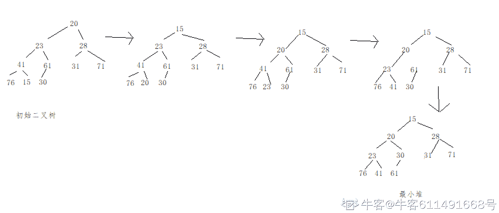

# 百度 2020 校招 C++/PHP 研发工程师笔试卷（第三批）

## 1

下列关于关键路径的叙述中错误的是（）

正确答案: D   你的答案: 空 (错误)

```cpp
关键路径是指在带权有向图中从源点到汇点的所有路径中具有最大路径长度的路径；
```

```cpp
关键路径上的所有活动都是关键活动，可通过加快关键活动来缩短整个工程的工期；
```

```cpp
AOE 网中，关键路径上活动的时间延长多少，整个工程的时间也就随之延长多少；
```

```cpp
AOE 网中的关键路径并不唯一，可通过加快某一条关键路径中关键活动速度来缩短整个工程工期；
```

本题知识点

C++工程师 PHP 工程师 百度 2020

讨论

[OFFER/OFFER](https://www.nowcoder.com/profile/203895943)

其中一条关键路径上的关键活动时间缩短，只能导致本条关键路径变成非关键路径，而无法缩短整个工期

发表于 2022-03-21 20:45:25

* * *

## 2

在 C++中，"std::cout"中的"std"和"cout"分别是什么？

正确答案: B E   你的答案: 空 (错误)

```cpp
类
```

```cpp
命名空间
```

```cpp
运算符
```

```cpp
函数
```

```cpp
对象
```

```cpp
模板
```

本题知识点

C++工程师 PHP 工程师 百度 2020

讨论

[rubbishdog](https://www.nowcoder.com/profile/943466437)

cout 是一个 ostream 类的对象，它有一个成员运算符函数 operator<<。

发表于 2021-09-20 21:19:20

* * *

## 3

对于数列 4、5、6、7、9、12、18、23，如果采用折半查找元素 9，请问需要查找几次？（）

正确答案: B   你的答案: 空 (错误)

```cpp
2
```

```cpp
3
```

```cpp
4
```

```cpp
5
```

本题知识点

C++工程师 PHP 工程师 百度 2020 Java 工程师

讨论

[CodeParty](https://www.nowcoder.com/profile/513726540)

注: n 代表数组长度 4、5、6、7、9、12、18、231)   Array[(0 + n - 1) / 2]  小于 9, (0 + n - 1) / 2 = 32)   Array[(3 + 1 + n - 1) / 2] 大于 9, (3 + 1 + n - 1) / 2 = 53)   Array[(3 + 1 + 5 - 1) / 2] 等于 9 所以, 一共 3 次

发表于 2021-09-05 18:00:14

* * *

[头文字 F](https://www.nowcoder.com/profile/756981)

每次查找的位置：(start + end)/2，这里的 start 从 0 开始取值每次查找的过程：先判断是否相等，若相等则结束；若不相等，则根据其大小决定向前或向后查找

发表于 2021-08-02 17:01:13

* * *

[牛客 982931248 号](https://www.nowcoder.com/profile/982931248)

B

发表于 2021-06-03 21:14:54

* * *

## 4

一棵二叉树的前序遍历结果为 ABCDEFG，则其中序遍历结果不可能为？（）

正确答案: D   你的答案: 空 (错误)

```cpp
CBDAFEG
```

```cpp
CBAEDGF
```

```cpp
CBAEDFG
```

```cpp
CBFADEG
```

本题知识点

C++工程师 PHP 工程师 百度 2020

讨论

[头文字 F](https://www.nowcoder.com/profile/756981)

以前序遍历的序列依次将中序遍历的序列分为两部分，则其分别对应于当前节点的左右两个子树。并且两部分各自各自在前序和中序中必然是连续的，不会出现交叉的现象。

发表于 2021-08-02 17:12:42

* * *

## 5

现有一字符串"hello world"，使用哈夫曼编码最少使用多少 bit 内存：（）

正确答案: B   你的答案: 空 (错误)

```cpp
4
```

```cpp
32
```

```cpp
64
```

```cpp
88
```

本题知识点

C++工程师 PHP 工程师 百度 2020 Java 工程师

讨论

[头文字 F](https://www.nowcoder.com/profile/756981)


发表于 2021-08-02 17:55:50

* * *

[键盘盘盘盘](https://www.nowcoder.com/profile/187724209)

哈夫曼编码:每个字符出现的次数排序,然后找出现次数最少两个的相加,然后把相加结果再放入出现出现次数中,再找最小的两个相加....依次类推

发表于 2021-10-15 21:12:06

* * *

[赌怪](https://www.nowcoder.com/profile/465601689)

别忘了把空白字符算进去

发表于 2021-05-12 15:15:49

* * *

## 6

已知现有一个大小为 4 初始状态为空的栈，现在有一组数据经过这个栈后，最终的数据顺序是:2 5 4 1 3,问原始的进栈数据不可能是以下的哪组

正确答案: D   你的答案: 空 (错误)

```cpp
1 4 5 2 3
```

```cpp
5 2 3 1 4
```

```cpp
3 4 5 2 1
```

```cpp
4 1 3 5 2
```

本题知识点

前端工程师 百度 2020 C++工程师 PHP 工程师 Java 工程师

讨论

[你的微笑 Haru](https://www.nowcoder.com/profile/215763971)

天王老子来了也是 D

发表于 2021-08-15 22:25:32

* * *

[羽落无声](https://www.nowcoder.com/profile/376263997)

我也选的 D

发表于 2021-08-03 16:10:32

* * *

[NTR](https://www.nowcoder.com/profile/895333961)

为什么是 C？3,4,5,2 依次入栈，2,5,4 依次出栈，1 入栈出栈，3 出栈没问题吧，答案应该是 D 吧

发表于 2021-05-20 10:13:52

* * *

## 7

浏览器的事件模型使用了下面哪种设计模式的概念?

正确答案: A   你的答案: 空 (错误)

```cpp
发布者/订阅者模式
```

```cpp
原型模式
```

```cpp
中介者模式
```

```cpp
代理模式
```

本题知识点

C++工程师 PHP 工程师 百度 2020

## 8

假设有必修课成绩表 course,每位学生的期末考试成绩以及补考成绩都录入到 course 表中,学号为 20190001 的同学想查询一下自己未通过的课程的课程编号与课程名称,那么下面正确的 sql 语句是

> create table `course`(    `id` int(11) not null auto_increment,    `sid` int(11) not null comment '学号',    `cid` int(11) not null comment '课程编号',    `cname` char(50) not null comment '课程名称',    `score` int(11) not null comment '分数',    primary key(`id`) )engine = innodb;

正确答案: C   你的答案: 空 (错误)

```cpp
select distinct cid,cname from course where cid not in (select cid from course where score > 60 and sid=20190001)
```

```cpp
select distinct cid,cname from course where cid in (select cid from course where score < 60) and sid=20190001
```

```cpp
select distinct cid,cname from course where cid not in (select cid from course where score > 60) and sid=20190001
```

```cpp
select distinct cid,cname from course where cid in (select cid from course where score < 60 and sid=20190001)
```

本题知识点

C++工程师 PHP 工程师 百度 2020 Java 工程师

讨论

[牛客 587048214 号](https://www.nowcoder.com/profile/587048214)

D 为什么错?

发表于 2021-08-19 05:06:16

* * *

[杨彦东](https://www.nowcoder.com/profile/682399744)

考试成绩跟补考成绩都录入表中是重点，如果补考大于 60  那也是通过了，所以查新条件为 not>60

发表于 2021-05-12 19:50:22

* * *

[XMASTER](https://www.nowcoder.com/profile/541988014)

60 分算不及格？

发表于 2021-09-07 15:28:53

* * *

## 9

序列{20, 23, 28, 41, 61, 31, 71, 76, 15, 30}构造为完全二叉树，完全二叉树再变为最小堆后，堆所对应的的中序遍历序列可能为（）

正确答案: B   你的答案: 空 (错误)

```cpp
76, 23, 41, 61, 20, 30, 31, 15, 28, 71
```

```cpp
76, 23, 41, 20, 61, 30, 15, 31, 28, 71
```

```cpp
76, 20, 41, 23, 30, 61, 15, 31, 28, 71
```

```cpp
76, 23, 20, 41, 61, 15, 31, 20, 28, 71
```

本题知识点

前端工程师 百度 2020 C++工程师 PHP 工程师 Java 工程师

讨论

[牛客 611491668 号](https://www.nowcoder.com/profile/611491668)



发表于 2021-08-13 20:13:34

* * *

[zyddst](https://www.nowcoder.com/profile/344835972)

小顶堆是指每个结点的值都小于或等于其左右孩子结点的值

发表于 2021-05-08 23:00:08

* * *

## 10

```cpp
#include <iostream>
class Parent {
    public:
        Parent() { std::cout << "1"; }
        Parent(const Parent &p) { std::cout << "2"; }
            const Parent &operator=(const Parent &p) {
            std::cout << "3";
        return *this;
    }
};
int main() {
    Parent p;
    Parent p1(p);
    Parent p2 = p;
    p2 = p1;
}
```

以上代码的输出为：

正确答案: B   你的答案: 空 (错误)

```cpp
1123
```

```cpp
1223
```

```cpp
1233
```

```cpp
1322
```

```cpp
1332
```

本题知识点

C++工程师 PHP 工程师 百度 2020

讨论

[Yanshsf](https://www.nowcoder.com/profile/36399629)

Parent p2 = p;是初始化语句，不是赋值语句

发表于 2021-06-26 17:57:49

* * *

[OFFER/OFFER](https://www.nowcoder.com/profile/203895943)

Parent p2 = p;调用的是拷贝构造函数，不是赋值构造函数

发表于 2022-03-21 21:00:54

* * *

[牛客 676339300 号](https://www.nowcoder.com/profile/676339300)

赋值构造函数不会产生新的对象，这里第三步属于拷贝构造函数（初始化一个新的对象），我是这么理解的。 Parent p2=p；//拷贝构造

发表于 2021-08-18 08:56:31

* * *

## 11

有如下递归函数 test(n)，其时间复杂度为多少？

```cpp
int  test(int n) {
    if (n <= 1) return 1;
    return (2 *  test(n - 1) + 3 *  test(n - 2));
}
```

正确答案: E   你的答案: 空 (错误)

```cpp
O(logn)
```

```cpp
O(nlogn)
```

```cpp
O(n²)
```

```cpp
O(n³)
```

```cpp
O(2^n)
```

本题知识点

前端工程师 百度 2020 C++工程师 PHP 工程师 Java 工程师

讨论

[Yanshsf](https://www.nowcoder.com/profile/36399629)

每一层递归调用两次递归，所以是 2^n

发表于 2021-06-26 17:39:59

* * *

[牛客 40814152 号](https://www.nowcoder.com/profile/40814152)

画一个递归树，每个节点代表一次递归操作，每次递归内计算复杂度 O(1),所以复杂度 O(2^n-某个参数),因为不是满二叉树，最终是 O(2^n)。个人理解，不对请评论交流

发表于 2021-07-29 15:05:45

* * *

## 12

关于以下代码说法正确的有?

```cpp
#include <iostream>
using namespace std;
class A {
public:
    virtual void testA() = 0;
    virtual void print() = 0;
};
class B :public A
{
public:
    virtual void testA() = 0;
    virtual void print() override
    {
        std::cout << "B::print" << std::endl;
    }
    virtual void testB()
    {
        std::cout << "testB" << std::endl;
    }
};
class C :public B
{
public:
    virtual void testA(){}
    virtual void print() override
    {
        std::cout << "C::print" << std::endl;
    }
};
int main() {
    C c;
    c.print();
    c.testB();
    return 0;
}
```

正确答案: B   你的答案: 空 (错误)

```cpp
会出现编译出错
```

```cpp
会成功输出 C::print 以及 testB
```

```cpp
main 函数里可以生成 B 的对象，代码不会报错
```

```cpp
main 函数里可以生成 A 的对象，代码不会报错
```

本题知识点

C++工程师 PHP 工程师 百度 2020

讨论

[牛客 298301954 号](https://www.nowcoder.com/profile/298301954)

在派生类重定义虚函数不需要关键字 virtual 为什么上述程序不报错

发表于 2021-07-26 17:10:55

* * *

## 13

假设一个数组采用快速排序，则下面的选项中，不可能是第 3 趟排序结果的是

正确答案: A C D   你的答案: 空 (错误)

```cpp
4, 8, 6, 10, 12, 16, 14
```

```cpp
10, 4, 6, 8, 12, 14, 16
```

```cpp
8, 4, 6, 12, 10, 14, 16
```

```cpp
4, 8, 6, 12, 10, 16, 14
```

本题知识点

前端工程师 百度 2020 C++工程师 PHP 工程师 Java 工程师

讨论

[键盘盘盘盘](https://www.nowcoder.com/profile/187724209)

正确答案 ACD 我选了 B😀

发表于 2021-10-15 21:17:09

* * *

[Yanshsf](https://www.nowcoder.com/profile/36399629)

a 应该也是错的因为按照快排，最后结束条件是 left==right,所以每一趟排序一定会有一个正确的数字占正确的坑位，3 趟应该至少有 3 个数字在正确位置本题排序后结果为 4,6,8,10,12,14,16A 选项，  4, 8, 6, 10, 12, 16, 14 有 3 个数字在正确位置，错误 B 选项，  10, 4, 6, 8, 12, 14, 16 有 3 个数字在正确位置，错误 C 选项， 8, 4, 6, 12, 10, 14, 16 有 2 个数字在正确位置，正确 D 选项，  4, 8, 6, 12, 10, 16, 14 有 1 个数字在正确位置，正确    

发表于 2021-06-26 17:53:28

* * *

[牛客 494072386 号](https://www.nowcoder.com/profile/494072386)

快速排序一次排完，pivot 左边的元素不应该都比 pivot 小，右边的元素都比 pivot 大吗？b 为什么对啊？

发表于 2021-08-10 14:53:38

* * *

## 14

c++以下哪些情况会调用拷贝构造函数?

正确答案: B C D   你的答案: 空 (错误)

```cpp
初始化构造一个函数
```

```cpp
当类的一个对象去初始化该类的另一个对象
```

```cpp
函数的形参是类的对象
```

```cpp
函数的返回值是类对象
```

```cpp
类的一个对象加上该类的另一个对象
```

本题知识点

C++工程师 PHP 工程师 百度 2020

讨论

[牛客 676339300 号](https://www.nowcoder.com/profile/676339300)

B 就是最常见的拷贝构造函数使用场景。 C,D 中的形参如果是引用就不会产生新的对象，但如果不是引用则会通过拷贝构造函数产生一个临时对象。

发表于 2021-08-18 09:01:18

* * *

## 15

假设磁头当前位于 116 道，正在向磁道序号增加的方向移动。现有一个磁道访问请求序列为 48, 59, 37, 81, 125, 195, 185, 205 采用电梯调度 SCAN 算法得到的磁道访问序列是：

正确答案: A   你的答案: 空 (错误)

```cpp
125, 185, 195, 205, 81, 59, 48, 37
```

```cpp
125, 185, 195, 205, 37, 48, 59, 81
```

```cpp
37, 48, 59, 81, 125, 185, 195, 205
```

```cpp
125, 195, 185, 205, 48, 59, 37, 81
```

本题知识点

C++工程师 PHP 工程师 百度 2020 Java 工程师

讨论

[Decade_](https://www.nowcoder.com/profile/534829948)

这题我把电梯调度与循环扫描算法给记混了。。。
其实很简单，电梯算法的核心就是尽可能的不让磁头的方向发生翻转。当前处于 116 道且磁头朝增加的方向，那么根据电梯扫描算法，磁头会一直朝着增加方向走，直到到达磁盘的一端。在到达磁盘的一端后，磁头掉头，再朝着磁盘另一端去扫描。这个过程就跟电梯一样所以叫电梯扫描算法。因此，磁道访问序列为：116->125->185->195->205->81->59->48->37

发表于 2021-08-20 12:02:45

* * *

[羽落无声](https://www.nowcoder.com/profile/376263997)

我理解的是就像跑马拉松，116 的首先慢慢的追上最大值，然后最后停下被后面的依次追上，更逻辑清晰的我就不清楚了，欢迎大佬解答

发表于 2021-08-03 16:01:58

* * *

## 16

属于同一进程的两个线程 T1 和 T2 并发执行，共享初值为 0 的全局变量 X。T1 和 T2 实现对全局变量 x 加 1 的伪代码分别如下:T1：temp1=X;temp1=temp1+1;X=temp1;T2：temp2=X;temp2=temp2+1;X=temp2;2 个线程进行到任意一步都能被对方打断，执行另外一个线程的代码，请问在所有可能的执行序列中，使 x 的值为 2 的序列个数有几种？

正确答案: B   你的答案: 空 (错误)

```cpp
1
```

```cpp
2
```

```cpp
3
```

```cpp
4
```

```cpp
5
```

本题知识点

前端工程师 百度 2020 C++工程师 PHP 工程师 Java 工程师

讨论

[不会 gaygay 的画航](https://www.nowcoder.com/profile/611060826)

1 和 2 两种结果，T1 或 T2 在 T2 或 T1 拿到 X 的值之后但是未赋值之前拿到了 X 的值，此时 T1 或者 T2 先执行完赋值 X=1，T2 或 T1 的 tmp 记录的 X 的值是 0，所以+1 后是 1 并进行赋值；

发表于 2022-01-31 18:40:09

* * *

[Hayle](https://www.nowcoder.com/profile/416498138)

T1 优先，T2 优先

发表于 2021-06-16 21:10:22

* * *

[小新要继续加油鸭！！！](https://www.nowcoder.com/profile/337093032)

由于 X 的值是通过赋值给 temp 来改变的，所以只要 x 赋值给 temp 后面即使有线程干预也对此线程的执行没影响按照这个逻辑，要么 T1 先 2 后；或者 T2 先 T1 后，只有两种方式

发表于 2021-05-31 18:48:50

* * *

## 17

某进程创建的若干个线程，这些线程不能共享的是

正确答案: A B   你的答案: 空 (错误)

```cpp
程序计数器
```

```cpp
某线程的栈指针
```

```cpp
进程打开的文件
```

```cpp
全局变量
```

```cpp
进程的堆空间
```

本题知识点

前端工程师 百度 2020 C++工程师 PHP 工程师 Java 工程师

讨论

[牛客 676339300 号](https://www.nowcoder.com/profile/676339300)

线程独享栈，共享进程堆

发表于 2021-08-18 09:02:43

* * *

## 18

tcp 发送报文数据时，可能将多个数据包合并成一个大的数据包发送，就有可能发生粘包问题。以下可以用来解决这个问题的是？

正确答案: A B D   你的答案: 空 (错误)

```cpp
发送固定长度的消息
```

```cpp
包结尾增加分隔符
```

```cpp
慢开始算法
```

```cpp
把消息分成消息头和消息体，其中消息头上包含长度
```

```cpp
利用滑动窗口实现控制
```

本题知识点

前端工程师 百度 2020 C++工程师 PHP 工程师 Java 工程师

讨论

[牛客 201075139 号](https://www.nowcoder.com/profile/201075139)

出现粘包，主要是 tcp 为了提高效率，每次都要等足够长的数据才进行发送，接收方要等到足够长的数据才从缓冲区提取。解决的办法就是只要能把包分开就不影响传输。A:固定长度，肯定可以；B：分隔符 D:添加长度信息。

发表于 2022-03-19 19:17:12

* * *

[OFFER/OFFER](https://www.nowcoder.com/profile/203895943)

```cpp
慢开始算法和利用滑动窗口实现控制都是网络数据传输时的流量控制，以避免拥塞的发生的算法
```

发表于 2022-03-21 21:16:38

* * *

[牛客 676339300 号](https://www.nowcoder.com/profile/676339300)

为提高每次发送数据的效率，引入了连续发送多段数据的机制，这就是“粘包”。包括以下情况： 要发送的数据很小，将多次数据写入发送缓冲区，一次性发送出去； 接收端应用层没有及时读取接收缓冲区的数据，一次性读取多段数据；

发表于 2021-08-18 09:05:13

* * *

## 19

下列 PHP 变量中命名合法是（）

正确答案: B C D   你的答案: 空 (错误)

```cpp
$1abc
```

```cpp
$_1abc
```

```cpp
$哈哈 abc
```

```cpp
$abc1
```

本题知识点

C++工程师 PHP 工程师 百度 2020

## 20

shell 脚本中，需求如下：如果 ls /tmp 执行成功输出 True，否则输出 Fail，下列哪项正确

正确答案: D   你的答案: 空 (错误)

```cpp
ls /tmp; [[ $# -eq 0 ]] &amp;&amp; echo True || echo Fail
```

```cpp
ls /tmp; [[ $* -eq 0 ]] &amp;&amp; echo True || echo Fail
```

```cpp
ls /tmp; [[ $0 -eq 0 ]] &amp;&amp; echo True || echo Fail
```

```cpp
ls /tmp; [[ $? -eq 0 ]] &amp;&amp; echo True || echo Fail
```

本题知识点

前端工程师 百度 2020 C++工程师 PHP 工程师 Java 工程师

讨论

[Walkman314](https://www.nowcoder.com/profile/217791916)

shell 中使用符号“$?”来显示上一条命令执行的返回值，如果为 0 则代表执行成功，其他表示失败。 结合 if-else 语句实现判断上一个命令是否执行成功。 | -eq  | 等于 |
| -ne | 不等于 |
| -gt  | 大于 |
| -lt | 小于 |
| ge | 大于等于 |
| le | 小于等于 | 

发表于 2021-09-14 18:30:28

* * *

## 21

度度熊请你找出两个数，满足且尽量大。输出最大的.
其中表示和的最小公倍数，表示和的最大公约数。

本题知识点

前端工程师 百度 2020 C++工程师 PHP 工程师 Java 工程师

讨论

[牛客 133616132 号](https://www.nowcoder.com/profile/133616132)

这道题能把我笑死，小学生都知道相邻的自然数（大于 1）的最大公因数是 1，最小公倍数是两者之积因此给定 n 输出为 n*（n-1）-1

发表于 2021-09-08 21:24:51

* * *

[星星醒醒](https://www.nowcoder.com/profile/388248357)

```cpp
public class Main {
    public static void main(String[] args) {
        Scanner sc = new Scanner(System.in);
        String next = sc.next();
        int a = Integer.parseInt(next);
        int b = a-1;
        String a1 = a+"";
        String b1 = b+"";
        BigInteger a2 = new BigInteger(a1);
        BigInteger b2 = new BigInteger(b1);
        BigInteger one = new BigInteger("1");
        BigInteger result = (a2.multiply(b2).subtract(one));
        System.out.println(result);
    }
```

发表于 2021-06-07 17:44:56

* * *

[牛客 754407944 号](https://www.nowcoder.com/profile/754407944)

```cpp

	#include <iostream>
using namespace std;
int main(){
    long long n;
    cin>>n;
    cout<<n*(n-1)-1;
}

```

编辑于 2021-08-27 21:26:53

* * *

## 22

今天，度度熊和牛妹在玩取石子的游戏，开始的时候有堆石头，第堆有个石头，两个人轮流动作，度度熊先走，在每个回合，玩家选择一个非空堆，并从堆中移除一块石头。如果一个玩家在轮到他之前所有的石碓都是空的，或者如果在移动石头之后，存在两个堆包含相同数量的石头（可能为都为），那么他就会输。假设两人都在游戏时选择最佳方式，度度熊和牛妹谁会赢？如果度度熊获胜，输出“man”，如果牛妹获胜，输出“woman”（输出不包含双引号）。

本题知识点

C++工程师 PHP 工程师 百度 2020

讨论

[tomjobs](https://www.nowcoder.com/profile/233833561)

```cpp

```
#include <cstdio>
#include <cstring>
#include <algorithm>
#include <vector>
#include <cmath>
#include <map>
#include <unordered_map>
#include <iostream>

using namespace std;

typedef long long ll;

int main() {
    int T;scanf("%d", &T);
    while(T--) {
        int n;scanf("%d",&n);
        vector<int>vec(n);
        unordered_map<int,int>mp;
        int cnt = 0, zero = 0;
        ll sum = 0;
        for(int i = 0;i < n;i++) {
            cin >> vec[i];
            if(vec[i] == 0) zero++;
            if(mp[vec[i]]) cnt++;
            mp[vec[i]] = 1;
            sum += vec[i];
        }
        sort(vec.begin(), vec.end());
        if(n == 3 && vec[0] == vec[1] + 1 && vec[1] == vec[2]) {
            printf("woman\n");
            continue;
        }
        if(cnt > 1 || sum == 0 || zero >= 2) {
            printf("woman\n");
            continue;
        }
        sum = 0;
        for(int i = 0;i < n;i++) {
            sum += vec[i] - i;
        }
        if(sum % 2 == 0) {
            printf("woman\n");
        } else {
            printf("man\n");
        }
    }
    return 0;
}
```cpp

楼上的题解没看太懂，而且有些情况也没有考虑到，这里是自己的解法（用例太弱，可能也不完全对）。首先把先手必败的情况给判掉：0 的数目大于等于 2 时，相同数字对数大于 1，出现了 x,x+1,x+1 这种情况，总和为 0，这几种情况先手必败。其他情况，可以想到游戏结束的上一个状态一定是 0, 1, 2, 3...n - 1 这种，谁到了这个状态谁必败，而且因为判掉了先手必败的几个情况（保证了相同数字不大于 2 且总和不为 0），所以一定能出现这种状态。那么只要将数目总和减去最后形成的这个等差数列，就可以知道谁可以领到这个等差数列状态，就可以知道谁必胜了
```

发表于 2021-09-24 20:44:12

* * *

[牛客 754407944 号](https://www.nowcoder.com/profile/754407944)

```cpp
string solve(vector<int> &stones){
    unordered_map<int,int> counts;
    int two=0;
    bool x=stones.size()/2&1;
    for(int i:stones){
        counts[i]++;
        if(counts[i]==2) two++;
        if(two==2||counts[i]==3) return "woman";
        if(i&1) x=!x;
    }
    return x?"man":"woman";
}
```

发表于 2021-08-27 21:27:41

* * *

[不要牧师](https://www.nowcoder.com/profile/385152116)

```cpp
#include <bits/stdc++.h>
using namespace std;

string solve(vector<int> &stones){
    unordered_map<int,int> cnt;
    int two=0;

    // 默认石堆中，石子数目为偶数
    // 最后石子的序列为+1 等差序列 0，1，2，3，...
    // 所以每堆取石子的个数都为奇数（除了第一个）
    // 那么每两次奇数之和为一次偶数，每次奇数的赢家为先手
    // 因此奇数次后序列变为+1 等差序列，因此下一次为后手取，取完后必有相等堆，后手输
    // 为了让第一个堆变成 0，第一个堆取偶数次，不参加计数，从第二次开始
    // 即堆数为 2、3 时，先手赢；4、5 时，后手赢；6、7 时，先手赢...观察得到规律
    // 默认石堆中石子都为偶数时的赢家为 x，可得：
    bool x = stones.size()/2 & 1;

    for(int i:stones){
        cnt[i]++;    // 石子数目为 i 的石堆数量 cnt
        if(cnt[i]==2) two++;    // 相同石子数==2(>=2)的石堆

        // two==2(>=2), 先手无论如何取，第一次取完最少仍有一组石子数相同的石堆
        // cnt[i]==3 同理，因此先手输，woman 赢
        if(two==2||cnt[i]==3) return "woman";

        // 如果这一堆中的石子数为奇数，则反转当前赢家
        if(i&1) x=!x;
    }
    return x?"man":"woman";
}

int main(){
    int t;
    cin >> t;
    while(t--){
        int n;
        cin >> n;
        vector<int> stones(n);
        bool allzero=true;
        for(int i=0; i<n; i++){
            cin >> stones[i];
            if(stones[i]) allzero=false;
        }
        if(allzero){
            cout << "women" << endl;
        }else{
            cout << solve(stones) << endl;
        }
    }
    return 0;
}
```

发表于 2021-09-06 23:11:54

* * *

## 23

在浩瀚深邃的星空中，有若干个可以被视为质点的星球，以及坐着飞船想要探索宇宙奥秘的度度熊。我们假定银河是一个的区域，顶点在和，度度熊从最左边任意一点进入，打算穿越这片区域并从右边任意一点离开。在银河中分布着个星球，每个星球以及银河的上下两个边缘都有引力，处于安全考虑，度度熊要离他们越远越好。
试求度度熊穿越银河的路径上，距离所有星球以及上下边界的最小距离的最大值可以为多少？

本题知识点

C++工程师 PHP 工程师 百度 2020

讨论

[CcCeLian](https://www.nowcoder.com/profile/91645832)

```cpp
#include <bits/stdc++.h>
using namespace std;
const int MAX = 6e3 + 10;
const double e = 1e-6;
struct ind {
    int x, y;
}point[MAX];
int fa[3 * MAX] = { 0 }, ran[3 * MAX] = { 0 }, xvalue[MAX] = { 0 };
int n, m, k, flag;
double dis[MAX][MAX] = { 0 };
double ans = 0;
map<int, int>mapp;
double getDis(ind a, ind b) {
    double dx = a.x - b.x;
    double dy = a.y - b.y;
    return pow(dx * dx + dy * dy, 0.5);
}
int find(int x) {
    return x == fa[x] ? x : (fa[x] = find(fa[x]));
}
void merge(int i, int j) {
    int x = find(i), y = find(j);
    if (ran[x] <= ran[y]) fa[x] = y;
    else fa[y] = x;
    if (ran[x] == ran[y] && x != y)
        ran[y]++;
}
int check() {
    /*for (int i = 1; i <= k; i++) {
        for (int j = 1; j <= k; j++) {
            if (find(i + k) == find(j + 2 * k)) return 0;
        }
    }*/
    return flag;
}
void buildDSU(double distance) {
    for (int i = 1; i <= k; i++) {
        for (int j = i + 1; j <= k; j++) {
            if (dis[i][j] / 2 < distance) merge(i, j);
        }
    }
    for (int i = 1; i <= k; i++) {
        if ((m - point[i].y) * 1.0 / 2 < distance) {
            merge(i, k + i);
            mapp[find(i)] = 1;
        }
    }
    for (int i = 1; i <= k; i++) {
        if (point[i].y * 1.0 / 2 < distance) {
            merge(i, 2 * k + i);
            if (mapp[find(i)] == 1) {
                flag = 0;
                break;
            }
        }
    }
}
void init() {
    mapp.clear();
    flag = 1;
    for (int i = 1; i <= 3 * k; i++) {
        fa[i] = i;
        ran[i] = 1;
    }
}

bool cmp(ind a, ind b) {
    if (a.x < b.x) return true;
    else return false;
}

void solve() {
    for (int i = 1; i <= k; i++) {
        for (int j = i + 1; j <= k; j++) {
            dis[i][j] = getDis(point[i], point[j]);
        }
    }
    double left = 0, right = m * 1.0 / 2, mid;
    while (fabs(left - right) > e) {
        mid = (left + right) / 2;
        init();
        buildDSU(mid);
        if (check()) {
            ans = mid;
            left = mid;
        }
        else right = mid;
    }
}

int main()
{
    cin >> n >> m >> k;
    for (int i = 1; i <= k; i++)
        scanf_s("%d %d", &point[i].x, &point[i].y);
    sort(point, point + k, cmp);
    for (int i = 1; i <= k; i++)
        xvalue[i] = point[i].x;
    solve();
    printf("%.4f\n", ans);
    return 0;
}
```

二分+并查集

发表于 2021-09-13 01:03:07

* * *

[tomjobs](https://www.nowcoder.com/profile/233833561)

```cpp
#include <cstdio>
#include <cstring>
#include <algorithm>
#include <vector>
#include <cmath>
#include <map>
using namespace std;

const int maxn = 6005 + 7;

struct Point {
    int x, y;
}p[maxn];
int n, m, k;
int fa[maxn];
double dis[maxn][maxn], ans;

double get_dis(Point a, Point b) {
    return sqrt(1.0 * (a.x - b.x) * (a.x - b.x) + 1.0 * (a.y - b.y) * (a.y - b.y));
}

int findset(int x) {
    if(fa[x] == x) return x;
    return fa[x] = findset(fa[x]);
}

void merge(int x, int y) {
    int fx = findset(x), fy = findset(y);
    if(fx != fy) {
        fa[fx] = fy;
    }
}

void init() {
    for(int i = 1;i <= k;i++) {
        fa[i] = i;
    }
}

bool check(double distance) {
    init();
    map<int,int>mp;
    for(int i = 1;i <= k;i++) {
        for(int j = i + 1;j <= k;j++) {
            if(dis[i][j] / 2.0 < distance) {
                merge(i, j);
            }
        }
    }
    for(int i = 1;i <= k;i++) {
        if(p[i].y / 2.0 < distance) {
            mp[findset(i)] = 1;
        }
    }
    for(int i = 1;i <= k;i++) {
        if((m - p[i].y) * 1.0 / 2.0 < distance) {
            if(mp.count(findset(i))) {
                return false;
            }
        }
    }
    return true;
}

void solve() {
    double l = 0, r = m / 2.0;
    while(r - l > 1e-7) {
        double mid = (l + r) / 2;
        if(check(mid)) {
            l = mid;
        } else {
            r = mid;
        }
    }
    ans = (l + r) / 2.0;
}

int main() {
    scanf("%d%d%d", &n, &m, &k);
    for(int i = 1; i <= k;i++) {
        scanf("%d%d", &p[i].x, &p[i].y);
    }
    for(int i = 1;i <= k;i++) {
        for(int j = i + 1;j <= k;j++) {
            dis[i][j] = get_dis(p[i], p[j]);
        }
    }
    solve();
    printf("%.4f\n", ans);
    return 0;
}
```

楼上是对的，但是有一些地方冗余了，不需要排序，也不需要扩展域并查集。首先看到最小值最大，就可以想到二分这个最小值，看能否成立。先看点之间能否满足这个最小值，也就是点间距离一般大于等于这个最小值，如果不满足，那么不能从这两点之间穿过，所以用并查集合在一起。被并查集合在一起的点，只能从这些点上面走或者下面走。再看从点下面和上面走是否可行，如果点集不能从上面和下面走，那么这个最小值不成立。

发表于 2021-09-24 17:00:23

* * *