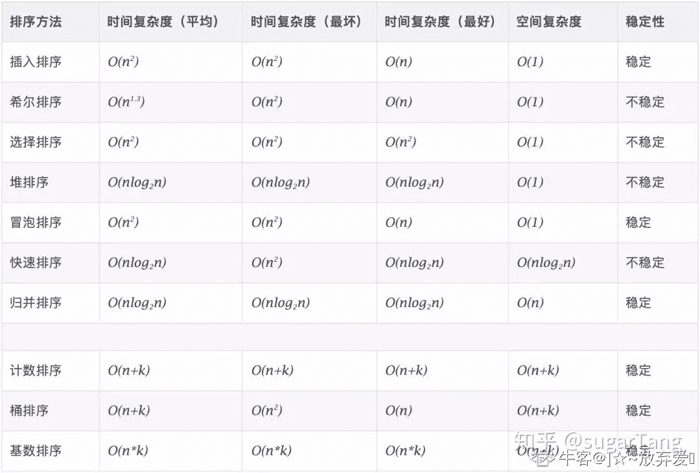

# 百度 2020 校招 Java 研发工程师笔试卷（第一批）

## 1

关于内存管理，下面说法不正确的是？

正确答案: A C   你的答案: 空 (错误)

```cpp
编译后，每个目标模块都从 0 单元开始编址，称为该模块的物理地址
```

```cpp
物理地址空间是指内存中物理单元的集合，他是地址转换的最终地址，进程在运行时执行指令和访问数据最后都要通过物理地址来存取主存
```

```cpp
分页的思想是：把主存空间划分为大小相等且固定的块，每个线程以块为单位进行划分
```

```cpp
段式管理方式按照用户进程中的自然段划分逻辑空间
```

本题知识点

C++工程师 PHP 工程师 百度 2020 Java 工程师

讨论

[党小板](https://www.nowcoder.com/profile/7503019)

**A：编译后，每个目标模块都从 0 单元开始编址，称为该模块的物理地址**

解析：**编译后，每个目标模块都从 0 单元开始编址，称为该模块的逻辑地址**

**C：分页的思想是：把主存空间划分为大小相等且固定的块，每个线程以块为单位进行划分**

**解析：分页：把主存空间划分为大小相等且固定的块，块相对较小，作为主存的基本单位，每个进程也以块为基本单位划分，进程在执行时，以块为单位逐个申请主存中的块空间。**

发表于 2021-07-06 16:50:59

* * *

[孙糊涂](https://www.nowcoder.com/profile/376886910)

编译后，每个目标模块都从 0 单元开始编址，称为该模块的逻辑地址。用户程序和程序员只需知道逻辑地址，不同进程可以有相同的逻辑地址，因为这些相同的逻辑地址可以映射到主存的不同位置。物理地址空间是指内存中物理单元的集合，它是地址转换的最终地址，进程在运行时执行指令和访问数据最后都要通过物理地址从主存中存取。

发表于 2022-02-17 15:36:26

* * *

## 2

下列关于图的说法正确的是（）

正确答案: B   你的答案: 空 (错误)

```cpp
线性表可以是空表，树可以是空树，图可以是空图；
```

```cpp
某有向完全图含有含有 20 条边，则该有向完全图具有 5 个顶点；
```

```cpp
极大联通子图要求保持图的联通性，还要求子图的边数最少；
```

```cpp
强连通分量仅针对无向图而言，对于有向图仅讨论图的连通性；
```

本题知识点

C++工程师 PHP 工程师 百度 2020 Java 工程师

讨论

[党小板](https://www.nowcoder.com/profile/7503019)

A：*线性表可以是空表**,**树可以是空树**,*但图不*可以是空图*。

B：有向图：n（n-1） 无向图：n(n-1)/2

C：极小联通子图要求子图的边数最少；

D：强连通分量仅针对有向图而言，对于有向图仅讨论图的连通性

发表于 2021-07-06 17:05:01

* * *

## 3

设无向图 G=(V,E),顶点集 V={a,b,c,d,e,f,g,h},边集 E={(a,b),(a,h),(a,e),(b,c),(b,d),(c,d),(c,h),(e,f),(e,g)},则下列选项中，不属于 BFS 序列的是（）

正确答案: B   你的答案: 空 (错误)

```cpp
eafgbhcd
```

```cpp
abcdhefg
```

```cpp
hcabdegf
```

```cpp
dbcahefg
```

本题知识点

C++工程师 PHP 工程师 百度 2020 Java 工程师

讨论

[党小板](https://www.nowcoder.com/profile/7503019)

BFS 遍历没的说，像光圈一样一层一层向外遍历

发表于 2021-07-06 17:05:48

* * *

[炸炸鱼](https://www.nowcoder.com/profile/360412733)

判断触发点的领接节点是否符合要求。很显然，从 a 出发只能到 bhe  因此 B 不符合从 a  bhe 从 e   afg
从 h   ac
从 d  cb

发表于 2021-09-07 14:09:43

* * *

## 4

分页存储管理将进程的逻辑地址空间分成若干个页，并为各页加以编号，从 0 开始，若某一计算机主存按字节编址，逻辑地址和物理地址都是 32 位，页表项大小为 4 字节，若使用一级页表的分页存储管理方式，逻辑地址结构为页号（20 位），页内偏移量（12 位），则页的大小是（  ）字节？页表最大占用（  ）字节？

正确答案: A   你的答案: 空 (错误)

```cpp
4KB，4MB
```

```cpp
5KB，5MB
```

```cpp
6KB，6MB
```

```cpp
7KB，7MB
```

本题知识点

前端工程师 百度 2020 C++工程师 PHP 工程师 Java 工程师

讨论

[luckingmei](https://www.nowcoder.com/profile/815224596)

一级页表由页号 + 页内偏移量（也就是页大小）页大小： 页内偏移量占 12 位，可以表示大小为 2¹²B = 4kb  ,所以最后页的大小为 4kb 页表的计算：总的页数 * 页表项大小总的页数 =  页号有 20 位，能表示 2²⁰ 个页 = 1MB 个页页表的大小 = 1MB * 4 字节 = 4MB

发表于 2021-09-07 14:37:06

* * *

[牛客 85762678 号](https://www.nowcoder.com/profile/85762678)

[`blog.csdn.net/syh666233/article/details/109295815`](https://blog.csdn.net/syh666233/article/details/109295815)

发表于 2021-08-31 23:10:13

* * *

## 5

有以下程序段，下面正确的选项是

```cpp
public static void main(String[] args) {
    System.out.print(test1());
}
public static int test1() {
    int a = 20;
    try {
        return a + 25;
    } catch (Exception e) {
        System.out.println("test catch exception");
    } finally {
        System.out.print(a + " ");
        a = a + 10;
     }
     return a;
 }
```

正确答案: D   你的答案: 空 (错误)

```cpp
20 55
```

```cpp
45 45
```

```cpp
55 55
```

```cpp
20 45
```

本题知识点

Java 工程师 百度 2020

讨论

[斯沃福德](https://www.nowcoder.com/profile/265831332)

debug 了一下，程序最先进入 try，但 try 中只有 return 便未执行。 然后到 finally 代码块中执行 ，输出“20 ”；最后进入 return，执行 a=45。为什么最后是 45 而不是 55 ？可以由两个原则解释：**①方法体中的代码看上去必须遵循自上而下的顺序依次逐行执行**

**②return 语句一旦执行，整个方法必须结束！即 return 最后执行！**

要满足原则①，那么 return 在 a=20 的后面，输出的就必须是 20+25=45。
而同时又要满足 return 最后执行的原则②，那么 finally 先执行，输出"20 "，然后执行 a=a+10，这里会有一个 a=30，但由于要满足原则①，所以这里会有两个 a，一个 a=20,一个 a=30。finally 执行完后，进入 return 的 a 是 20 这个。

发表于 2021-12-29 10:47:36

* * *

[Decade_](https://www.nowcoder.com/profile/534829948)

这个题我误选了 A 20 55，琢磨了半天，突然意识到当程序执行到第 7 行 return a+25 时，实际上已经无法再进一步更改了，结果为 45；但是又由于有 final，所以方法在退出之前还执行了 final 中的代码，即输出了 20，final 中 a=a+10 是没什么意义的

发表于 2021-08-27 16:52:29

* * *

[初心 58](https://www.nowcoder.com/profile/3503411)

在 try 中 return 后 finally 还是会执行。

发表于 2021-07-02 15:45:11

* * *

## 6

下列选项中，关于 HTTP 与 HTTPS 的区别的描述中，正确的是（   ）：

正确答案: A B C   你的答案: 空 (错误)

```cpp
http 是超文本传输协议，信息是明文传输。https 则是具有安全性的 ssl 加密传输协议。
```

```cpp
http 和 https 使用的是完全不同的连接方式，用的端口也不一样。
```

```cpp
http 的连接很简单，是无状态的。HTTPS 协议是由 SSL+HTTP 协议构建的可进行加密传输、身份认证的网络协议，比 http 协议安全。
```

```cpp
http 默认使用 80 端口，https 默认使用 403 端口。
```

本题知识点

前端工程师 百度 2020 C++工程师 PHP 工程师 Java 工程师

讨论

[艾佛森的泪](https://www.nowcoder.com/profile/949330719)

**1、HTTP 是超文本传输协议，信息是明文传输，HTTPS 是具有安全性的 SSL 加密传输协议。**

**2、HTTP 和 HTTPS 使用的是完全不同的连接方式，用的端口也不一样。前者是 80，后者是 443。**

**3、HTTP 和 HTTPS 的工作原理**

**HTTP 的工作原理：一次 HTTP 操作称为一个事物，其工作过程可分为四步**

**1、Client 与 Server 建立连接，单击某个超链接，HTTP 的工作开始。**

**2、连接建立后，Client 发送一个请求给 Server，请求方式的格式为：统一资源标识符（URL）、协议版本号，后边是 MIME 信息包括请求修饰符，Client 信息和可能的内容。**

**3、Server 接到请求后，给予相应的响应信息，其格式为一个状态行，包括信息的协议版本号、一个成功或错误的代码，后边是 MIME 信息包括 Server 信息、实体信息和可能的内容。**

**4、Client 接收 Server 返回的信息通过浏览器显示在用户的显示屏上，然后 Client 和 Server 断开连接。**

**HTTPS 的工作原理：**

**1、Client 使用 HTTPS 的 URL 访问 Web 服务器，要求与 Web 服务器建立 SSL 连接。**

**2、Web 服务器收到客户端请求后，会将网站的证书信息（证书中包含公钥）传送一份给客户端。**

**3、客户端的浏览器与 Web 服务器开始协商 SSL 连接的安全等级，也就是信息加密的等级。**

**4、客户端的浏览器根据双方同意的安全等级，建立会话密钥，然后利用网站的公钥将会话密钥加密，并传送给网站。**

**5、Web 服务器利用自己的私钥解密出会话密钥。**

**6、Web 服务器利用会话密钥加密与客户端之间的通信。**

**5、HTTPS 的优缺点：HTTP 协议。**

**端口**
**https 端口：443**

**服务项目：Https**

**网页浏览端口，能提供加密和通过安全端口传输的另一种 HTTP，简单来说，就是 HTTP 安全版，打开的网页中，如果网址前缀为 https，则说明该网站开启了 https 安全访问。**

**说明：443 端口用于网页浏览，关闭电脑 443 端口，将会导致 https 网页无法正常打开。**

**HTTP：80 端口**

**服务：HTTP**

**说明：用于网页浏览，关闭电脑 80 端口，将会导致无法打开网页。**

**HTTPS 安全超文本传输协议，它是一个安全通信通道，它基于 HTTP 开发，用于在客户计算机和服务器之间交换信息。https 和 http 最大区别在于前者通过安全加密，更安全。**

发表于 2022-03-20 21:24:33

* * *

[初心 58](https://www.nowcoder.com/profile/3503411)

http:80；https:443

发表于 2021-07-02 15:46:44

* * *

[X_W_W_](https://www.nowcoder.com/profile/395282347)

https:443

发表于 2021-06-28 02:43:14

* * *

## 7

线程池在我们的项目中经常会被用到，线程池的选择基于我们的应用场景，那么现在有这样一个应用场景：需要周期性的执行任务，那么我们应该选择哪一个线程池（）

正确答案: D   你的答案: 空 (错误)

```cpp
newSingleThreadExecutor
```

```cpp
newFixedThreadPool
```

```cpp
newCachedThreadPool
```

```cpp
newScheduledThreadPool
```

本题知识点

Java 工程师 百度 2020

讨论

[文院街的信](https://www.nowcoder.com/profile/279307848)

newCachedThreadPool 创建一个可缓存线程池，如果线程池长度超过处理需要，可灵活回收空闲线程，若无可回收，则新建线程。
newFixedThreadPool 创建一个定长线程池，可控制线程最大并发数，超出的线程会在队列中等待。
newScheduledThreadPool 创建一个定长线程池，支持定时及周期性任务执行。
newSingleThreadExecutor 创建一个单线程化的线程池，它只会用唯一的工作线程来执行任务，保证所有任务按照指定顺序(FIFO, LIFO, 优先级)执行。

发表于 2021-10-11 19:45:43

* * *

## 8

小牛开发文件上传功能时，遇到了一些安全问题，那么对于文件上传漏洞，有效防御手段有哪些？

正确答案: B C   你的答案: 空 (错误)

```cpp
浏览器端限制文件扩展名
```

```cpp
服务器端限制文件扩展名
```

```cpp
将上传的文件存储在静态文件服务器中
```

```cpp
验证 Content-Type
```

本题知识点

前端工程师 百度 2020 Java 工程师

讨论

[党小板](https://www.nowcoder.com/profile/7503019)

A：浏览器端验证没有用

D：验证 Content-Type 解决 CSRF 漏洞

发表于 2021-07-06 17:10:41

* * *

## 9

用下面哪些 SQL 语句可以从 table 中得到每门课都大于 80 分的学生姓名，下面说法正确的的？name   course   fenshu 小张     语文       81 小张     数学       75 小李     语文       76 小李     数学       90 小王     语文       81 小王     数学       100 小王     英语       90

正确答案: A D   你的答案: 空 (错误)

```cpp
select distinct a.name from table a left join (select distinct name from table where fenshu <= 80) b on a.name=b.name where b.name is null;
```

```cpp
select name from table where fenshu > 80 group by name having cnt > 0;
```

```cpp
select distinct name from table where name in (select distinct name from table  where fenshu > 80)
```

```cpp
select name,sum(case when fenshu<=80 then 1 else 0 end) scr from table group by name having scr=0;
```

本题知识点

C++工程师 PHP 工程师 百度 2020 Java 工程师

讨论

[OFFER/OFFER](https://www.nowcoder.com/profile/203895943)

B。select name from table where fenshu > 80 group by name having cnt > 2 是对的 发表于 2022-03-21 15:22:46

* * *

[斯沃福德](https://www.nowcoder.com/profile/265831332)

居然还能多选？ 大意了。。。。

发表于 2021-12-29 10:51:28

* * *

[offer 快来 1234567890](https://www.nowcoder.com/profile/339176941)

C 为什么不对呀

发表于 2021-08-31 16:50:46

* * *

## 10

以下代码运行的结果是什么

```cpp
public class TestGC {
    private static TestGC TEST_GC = null;
    private void isAlive() {
        System.out.print("Yes,I'm Alive!" + "、");
    }
    @Override
    protected void finalize() throws Throwable {
        super.finalize();
        System.out.print("finalize mehtod executed!" + "、");
        TestGC.TEST_GC = this;
    }
    public static void main(String[] args) throws Throwable {
        TEST_GC = new TestGC();
        TEST_GC = null;
        System.gc();
        Thread.sleep(500);
        if (TEST_GC != null) {
            TEST_GC.isAlive();
        } else {
            System.out.print("NO,I'm dead!" + "、");
        }
        TEST_GC = null;
        System.gc();
        Thread.sleep(500);
        if (TEST_GC != null) {
            TEST_GC.isAlive();
        } else {
            System.out.print("NO,I'm dead!");
        }
    }
}
```

正确答案: A   你的答案: 空 (错误)

```cpp
finalize mehtod executed!、Yes,I'm Alive!、NO,I'm dead!
```

```cpp
NO,I'm dead!、NO,I'm dead!
```

```cpp
finalize mehtod executed!、Yes,I'm Alive!、finalize mehtod executed!、Yes,I'm Alive!
```

```cpp
finalize mehtod executed!、Yes,I'm Alive!、finalize mehtod executed!、NO,I'm dead!
```

本题知识点

Java 工程师 百度 2020

讨论

[暴躁牛牛不怕困难](https://www.nowcoder.com/profile/879122170)

对象只会自救一次

发表于 2021-08-02 00:31:36

* * *

## 11

对于 java 集合 HashMap 中的 containsKey()方法，最好情况和最坏情况下的时间复杂度是

正确答案: A   你的答案: 空 (错误)

```cpp
O(1), O(n)
```

```cpp
O(logn), O(n)
```

```cpp
O(n), O(1)
```

```cpp
O(1), O(logn)
```

本题知识点

Java 工程师 百度 2020

讨论

[王瑞环](https://www.nowcoder.com/profile/559483943)

这题不严谨,jdk8 及之后,若没有直接命中,节点后不是链表,而是红黑树,最坏是 O(logN)

发表于 2021-05-28 14:13:10

* * *

## 12

以下代码运行后会打印哪些内容

```cpp
public class Test implements Runnable {
    @Override
    public void run() {
        while (!Thread.currentThread().isInterrupted()) {
            synchronized (this) {
            try {
                wait();
            } catch (InterruptedException e) {
                System.out.println("InterruptedException");
            }
        }
    }
    System.out.println("Final");
}
public static void main(String[] args) throws InterruptedException {
    Thread thread = new Thread(new Test());
    thread.start();
    new Thread(() -> {
        try {
            Thread.sleep(1000);
        } catch (InterruptedException e) {
        }
        thread.interrupt();
        System.out.println("interrupt");
    }).start();
    thread.join();
    System.out.println("exit");
    }
}
```

正确答案: A   你的答案: 空 (错误)

```cpp
interrupt、InterruptedException
```

```cpp
exit、interrupt、InterruptedException
```

```cpp
exit、interrupt、InterruptedException、final
```

```cpp
interrupt、InterruptedException、final
```

本题知识点

Java 工程师 百度 2020

讨论

[牛客 85762678 号](https://www.nowcoder.com/profile/85762678)

interrupt()使 thread 直接进入异常，而且 interrupt 标志位置为 false。

发表于 2021-09-01 09:06:24

* * *

## 13

假设存在学生信息表 student,选修课表 course,如果想查询所有学生的选修课以及成绩,下面正确的 sql 语句是:

```cpp
create table `student`(
    `id` int(11) not null auto_increment,
    `name` char(50) not null comment '学生姓名',
    `sid` int(11) not null comment '学号',
    primary key(`id`),
    unique key `sid`(`sid`)
)engine = innodb;
create table `course`(
    `id` int(11) not null auto_increment,
    `name` char(50) not null comment '课程名称',
    `score` int(11) not null comment '成绩',
    `sid` int(11) not null comment '学号',
    primary key(`id`)
)engine = innodb;
```

正确答案: C D   你的答案: 空 (错误)

```cpp
select student.name, course.name, course.score from student left join course on student.sid = course.sid
```

```cpp
select student.name, course.name, course.score from student right join course on student.sid = course.sid
```

```cpp
select student.name, course.name, course.score from student inner join course on student.sid = course.sid
```

```cpp
select student.name, course.name, course.score from student cross join course where student.sid = course.sid
```

本题知识点

Java 工程师 百度 2020

讨论

[牛客 518958848 号](https://www.nowcoder.com/profile/518958848)

B 选项为啥不对呀

发表于 2021-09-07 15:51:52

* * *

[牛客 85762678 号](https://www.nowcoder.com/profile/85762678)

[`blog.csdn.net/qq43599939/article/details/48007201`](https://blog.csdn.net/qq43599939/article/details/48007201)

发表于 2021-09-01 09:28:26

* * *

[机智的路易](https://www.nowcoder.com/profile/747109063)

```cpp
inner join 与 cross join 中不含 null 值
```

发表于 2022-03-20 21:25:09

* * *

## 14

假如公司机房现在有 n 个服务器，为了方便用户会在服务器上缓存数据，因此用户每次访问的时候最好能保持同一台服务器，现有的做法是根据服务器的 ip%n 计算得到请求的服务器，如果现在一台服务器挂掉了，采用以下哪种做法()，能够保证不会造成大面积的访问错误；原有的访问基本还是停留在同一台服务器上；尽量考虑负载均衡。

正确答案: A   你的答案: 空 (错误)

```cpp
一致性哈希算法
```

```cpp
源地址哈希法
```

```cpp
加权轮询法
```

```cpp
最小连接数法
```

本题知识点

Java 工程师 百度 2020

讨论

[AnYoT](https://www.nowcoder.com/profile/9151593)

A 一致性哈希算法可以满足题目的要求，其余选项的算法仅考虑了负载均衡，并没有考虑保证原有的访问基本停留在同一台服务器上

发表于 2021-10-11 11:20:39

* * *

## 15

将一个整数序列整理为降序，两趟处理后序列变为{36, 31, 29, 14, 18, 19, 32}则采用的排序算法可能是 ________。

正确答案: B   你的答案: 空 (错误)

```cpp
选择排序
```

```cpp
插入排序
```

```cpp
快速排序
```

```cpp
堆排序
```

本题知识点

前端工程师 百度 2020 C++工程师 PHP 工程师 Java 工程师

## 16

数据结构中，二分法的查找主要应用于数据量较大情况下的查找，但是数据需要先排好顺序，在顺序表(2，5，7，10，14，15，18，23，35，41，52)中，用二分法查找 12，所需的关键码比较的次数为多少（     ）？

正确答案: C   你的答案: 空 (错误)

```cpp
2
```

```cpp
3
```

```cpp
4
```

```cpp
5
```

本题知识点

前端工程师 百度 2020 C++工程师 PHP 工程师 Java 工程师

## 17

设 a 数组的长度为 N,那么下面程序循环内交换数组元素的代码执行的时间复杂度最坏为?

```cpp
for (int i = N - 1; i > 1; i--)
{
    for (int j = 1; j < i; j++)
    {
        if (a[j] > a[j + 1])
        {
            temp = a[j + 1];
            a[j + 1] = a[j];
            a[j] = temp;
        }
    }
}
```

正确答案: B   你的答案: 空 (错误)

```cpp
O(N)
```

```cpp
O(N 平方)
```

```cpp
O(N 立方)
```

```cpp
O(Nlog2N)
```

```cpp
O(N 平方 log2N)
```

本题知识点

前端工程师 百度 2020 C++工程师 PHP 工程师 Java 工程师

讨论

[]☆~放弃爱❤](https://www.nowcoder.com/profile/6957431)

这段程序很明显是选择排序，所以只要记得选择排序最坏时间复杂度即 o(n²)

编辑于 2021-06-26 16:50:43

* * *

## 18

如果存储结构由数组变为链表，那么下列哪些算法的时间复杂度量级会升高

正确答案: B C   你的答案: 空 (错误)

```cpp
选择排序
```

```cpp
希尔排序
```

```cpp
堆排序
```

```cpp
插入排序
```

本题知识点

前端工程师 百度 2020 C++工程师 PHP 工程师 Java 工程师

讨论

[初心 58](https://www.nowcoder.com/profile/3503411)

希尔排序、堆排序使用数组存储的话，方便获取指定位置的数据。这两个排序都需取指定位置的数据，而使用链表增加了获取指定位置的时间。

发表于 2021-07-02 17:57:00

* * *

## 19

小度新聘请了一名员工牛牛, 每个月小度需要给牛牛至少发放 m 元工资(给牛牛发放的工资可以等于 m 元或者大于 m 元, 不能低于 m)。
小度有一些钞票资金, 一共有 n 种不同的面额, 对于面额为的钞票, 小度有张, 并且每一个钞票面额都能整除所有比它大的面额, 并且每一张钞票不能找零。
小度想知道这部分资金最多能牛牛发放多少个月的工资?

本题知识点

C++工程师 PHP 工程师 百度 2020 Java 工程师

讨论

[CharmsGraker](https://www.nowcoder.com/profile/671970057)

卧槽！我 A 了

```cpp
#include <bits/stdc++.h>

typedef std::pair<int, int> PAII;
using namespace std;

struct Money {
    long long x;
    int y;

    bool operator<(Money m2) const {
        return x < m2.x;
    }
};

istream &operator>>(istream &is, Money &money) {
    is >> money.x >> money.y;
    return is;
}

int main() {
    int n;
    long long m;
    cin >> n >> m;
    long long totalSum = 0L;
    vector<Money> moneyGroup(n);
    unordered_map<int,int> modMoney;

    for (int i = 0; i < n; ++i) {
        cin >> moneyGroup[i];
        totalSum += moneyGroup[i].x * moneyGroup[i].y;
    }
    if (totalSum < m) {
        cout << 0 << endl;
    } else {

        sort(moneyGroup.begin(), moneyGroup.end());

        long long ans = 0;
        while (1) {
            long long rest = m;
            for (int i = n - 1; i >= 0 && rest > 0; --i) {
                if (moneyGroup[i].y == 0)
                    continue;
                // 有个整除关系感觉没用到。
                // 先用大钱的思路没错，但是用小钱补的时候，小钱能提供更多的容错率

                auto need = rest / moneyGroup[i].x;
                if (need > moneyGroup[i].y) {
                    need = moneyGroup[i].y - 1;
                }
                rest -= need * moneyGroup[i].x;
                moneyGroup[i].y -= need;
            }

            for (int i = 0; i < n && rest > 0; ++i) {
                if (moneyGroup[i].y == 0)
                    continue;
                auto need = max((int)(rest / moneyGroup[i].x),1);
                if (need > moneyGroup[i].y) {
                    need = moneyGroup[i].y;
                }

                rest -= need * moneyGroup[i].x;
                moneyGroup[i].y -= need;
            }
            if (rest > 0)
                break;
            ++ans;
        }
        cout << ans;
    }
}
```

发表于 2022-03-20 21:17:01

* * *

## 20

小度的特种部队一共有 n 名士兵, 一天小度派所有士兵去探索野区。士兵们出发时沿着一条道路行进, 直到遇到三岔路口。
小度在出发前就给部队部署了部队划分规则: 当遇到三岔路口的时候, 部队若可以分为两个部分，并且两个部分的人数差恰好为 k, 那么就完成部队划分, 划分的两个部分分别沿着两条路行进下去，否则该部队的所有士兵就在此位置停下扎营。
野区内有不计其数的三岔路口, 所以整个部队的每一个部分最终都会停下扎营，小度想知道最终扎营的总数为多少？

本题知识点

前端工程师 百度 2020 Java 工程师

讨论

[牛客 438821193 号](https://www.nowcoder.com/profile/438821193)

```cpp
var lines = readline().split(" ")
var n = parseInt(lines[0])
var k = parseInt(lines[1])
var count = 0
function result(n,k){
if(n<=k||(n-k)%2){ //不能划分的话记录 count 次数+1
    return count+=1
}else{
    var a = result((n+k)/2,k)
    var b = result((n-k)/2,k)
}
}
result(n,k)
console.log(count)
```

JS 代码简单明了

发表于 2021-08-25 20:55:03

* * *

[牛客 435663740 号](https://www.nowcoder.com/profile/435663740)

import java.util.Scanner;

public class Main{
    static int count=0;
    public static void main(String[] args) {
        Scanner Array=new Scanner(System.in);
        int n=Array.nextInt();
        int k=Array.nextInt();
        sprit(n,k);
        System.out.println(count);
    }    
    private  static void sprit(int n,int k) {
        if(n<=k||(n-k)%2!=0) {
            count++;        
            return;
        }else {            
            sprit((n+k)/2 ,k);
            sprit((n-k)/2, k);     
            return;        
        }
    }        
}

发表于 2021-09-19 19:57:28

* * *

[牛客 468857724 号](https://www.nowcoder.com/profile/468857724)

```cpp
n, k = [int(v) for v in input().split()]

def separate(n, k):
    tmp = n-k
    if tmp > 0 and tmp%2 == 0:
        tmp_2 = tmp//2
        return separate(tmp_2+k, k) + separate(tmp_2, k)
    else:
        return 1

print(separate(n, k))
```

递归 发表于 2021-09-06 22:34:48

* * *

## 21

小度给定你一棵拥有 n 个点的树，每次删去当前所有的叶子节点（即度数小于等于 1 的节点）和叶子节点所连接的边，直到所有的点都被删除了为止。你需要对于每个点，求出它是第几次操作中被删除的。

本题知识点

Java 工程师 百度 2020

讨论

[半醉 77](https://www.nowcoder.com/profile/848755634)

```cpp
import java.util.*;
public class Main{
public static class Node{   //静态内部类
        public List<Node> list= new ArrayList<>(); //树除根节点就一个父啊，是图的话就可以多个，用 Node 类型的 list 存  
        public int num = 0;                              //存节点的度，用 List.size()方法更新很麻烦,remove 后 size 和索引也变了
        boolean flag = false;                                //节点是否删除
    }
public static void main(String[] args) {
        Scanner sc = new Scanner(System.in);
        int n = sc.nextInt();
        int count = n;
        int time = 1;
        int[] res = new int[n+1];
        Node[] nodes = new Node[n+1];
        for(int i = 0; i < n+1; ++i){   //Node[]初始化必要
            Node node = new Node();
            nodes[i] = node;
        }
        while(sc.hasNext()){   //相当于 for(int i = 0; i < n-1; i++) 
            int a = sc.nextInt();
            int b = sc.nextInt();
            nodes[a].list.add(nodes[b]); 
            nodes[b].list.add(nodes[a]);  //数组下标即是节点号，不用属性 value 了
            nodes[a].num++;
            nodes[b].num++;
        }
        while(count > 0){
            List<Node> levelNode = new ArrayList<>();       //存这次删除的节点
            for( int i = 1; i < n+1; ++i){   //不能从 0 开始
  			 //定义：树入度<=1(根节点是 0，其他都是 1),叶子节点出度=0。故叶子节点的度<=1 且没有删除就该删除
                if(nodes[i].num <= 1 && !nodes[i].flag){
                    res[i] = time;
                    nodes[i].flag = true;
                    levelNode.add(nodes[i]);        //将被删除的节点加入链表，在后面的遍历里更新
                    count--;                       
                }
            }
            //将这次删除的节点的关联节点的数据更新
            for(Node node : levelNode){
                for(Node i : node.list)
                    i.num--;       
            }
            time++;       
        }
        for( int i = 1; i < n; ++i){
            System.out.print(res[i]+" ");   //输出示例有空格要求
        }
        System.out.print(res[n]);
    }
}
```

 发表于 2021-09-25 15:21:55

* * *

[Lason0104](https://www.nowcoder.com/profile/756961747)

```cpp
import java.util.*;

/**
 * @author hit-eason
 * @version 1.0
 * @date 2021/9/6 21:39
 */
public class Main{
    public static class Node{
        public List<Node> parents = new ArrayList<>();      //未通过的测试用例发现一个节点可以有多个父亲，故用链表存节点的父亲
        public List<Node> kids = new ArrayList<>();         //尽管按照测试用例貌似一个节点只有一个儿子，但是用链表存不会错
        public int outNum = 0;                              //另开个整型存节点出度，如果用 List.size()之类方法更新很麻烦
        public int inNum = 0;                               //节点入度
        boolean flag = true;                                //节点是否已被删除
    }
    public static void main(String[] args) {
        Scanner sc = new Scanner(System.in);
        int n = sc.nextInt();
        int count = n;
        int storey = 1;
        int[] res = new int[n];
        Node[] nodes = new Node[n];
        //开数组存 n 个节点
        for(int i = 0; i < n; ++i){
            Node node = new Node();
            nodes[i] = node;
        }
        //根据后续读入行更新节点入度出度、父节点子节点
        while(sc.hasNext()){
            int from = sc.nextInt();
            int to = sc.nextInt();
            nodes[from-1].outNum++;
            nodes[to-1].inNum++;
            nodes[from-1].kids.add(nodes[to-1]);
            nodes[to-1].parents.add(nodes[from-1]);
        }
        //count 控制是否已删除所有节点
        while(count > 0){
            List<Node> levelNode = new ArrayList<>();       //存这层删除的节点，必须在 for 循环遍历后再去 50 行的 levelNode 遍历里更新，否则一边删一边更新会删除后面层的节点
            for( int i = 0; i < n; ++i){
                //入度+出度不大于 1 就该删除，并且用 flag 判断是否已删除过，防止重复给结果赋值
                if((nodes[i].outNum + nodes[i].inNum) <= 1 && nodes[i].flag){
                    res[i] = storey;
                    nodes[i].flag = false;
                    levelNode.add(nodes[i]);        //将被删除的节点加入链表，在后面的遍历里更新
                    count--;                        //循环结束条件更新，即剩余未删除的节点数
                }
            }
            //将这层删除的节点的关联节点的数据更新
            for(Node node : levelNode){
                for(Node parent : node.parents)
                    parent.outNum--;
                for(Node kid : node.kids)
                    kid.inNum--;
            }
            storey++;       //层数加一
        }
        for( int i = 0; i < n-1; ++i){
            System.out.print(res[i]+" ");
        }
        System.out.print(res[n-1]);
    }
}

```

发表于 2021-09-07 09:04:58

* * *

[牛客 468857724 号](https://www.nowcoder.com/profile/468857724)

```cpp
n = int(input())

# 初始化邻接表
edge_table = dict()
for k in range(n):
    edge_table[k] = set()

# 输入边的信息
for _ in range(n-1):
    u, v = [int(i)-1 for i in input().split()]
    edge_table[u].add(v)
    edge_table[v].add(u)

# 找到可删除的节点
rmv_lst = set()
for i, elm in edge_table.items():
    if len(elm) < 2:
        rmv_lst.add(i)

res = [0]*n
next_candidate = set()
for cnt in range(1, 100000):                                    # 使用 cnt 记录这是第几次迭代
    if len(rmv_lst) == 0:                                    # 如果没有可删除节点，就结束循环
        break

    next_candidate.clear()                   # 清空下一次可删除的节点的候选列表
    for rmv in rmv_lst:
        for other in edge_table[rmv]:
            edge_table[other].remove(rmv)                # 移除与被删除节点相连的边
            next_candidate.add(other)                    # 将候选节点加入到候选列表中
        res[rmv] = cnt                                     # 记录此节点是第几次删除的

    # 清空可删除节点列表，找出候选列表中可删除的节点放入可删除节点列表中
    rmv_lst.clear()
    for cddt in next_candidate:
        # 还没有被删除，且边的个数小于 2 的节点为可删除节点
        if res[cddt] == 0 and len(edge_table[cddt]) < 2:
            rmv_lst.add(cddt)

print(" ".join(map(str, res)))
```

发表于 2021-09-06 23:47:05

* * *

## 22

有一个日志文件 Test.txt，其中每行的内容是服务器的 mac 地址，下面哪个命令可以找到次数最多的前 5 个 mac 和出现的次数

正确答案: B C   你的答案: 空 (错误)

```cpp
cat Test.txt | count -n | sort -rn | head -n 5
```

```cpp
sort Test.txt | uniq -c | sort -rn | head -n 5
```

```cpp
cat Test.txt | sort | uniq -c | sort -rn | head -n 5
```

```cpp
uniq -c Test.txt | sort -nr | top -n 5
```

本题知识点

前端工程师 百度 2020 C++工程师 PHP 工程师 Java 工程师

## 23

linux 下以下哪个不是多进程和多线程的区别

正确答案: B   你的答案: 空 (错误)

```cpp
进程是资源分配的最小单位，线程是程序执行的最小单位
```

```cpp
多进程程序间共享全局变量、静态变量等数据，多线程不能共享
```

```cpp
创建进程开销大，创建线程开销小
```

```cpp
每个线程有自己的堆栈空间和局部变量。
```

本题知识点

Java 工程师 百度 2020