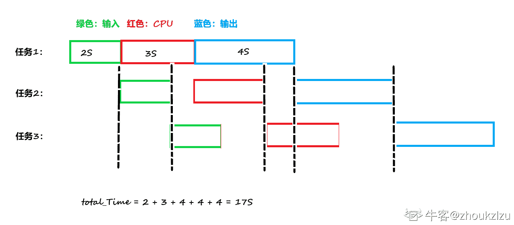
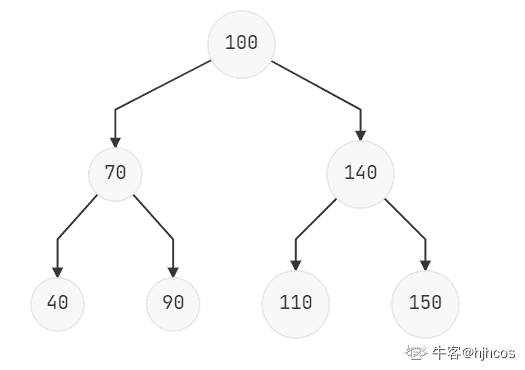
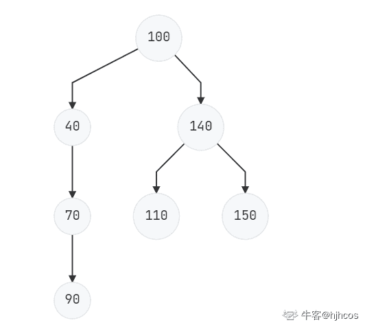
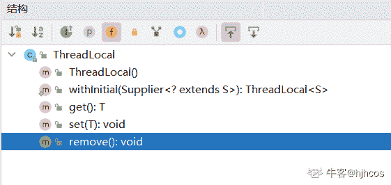

# 百度 2020 校招 Java 研发工程师笔试卷（第二批）

## 1

计算机系统中并发是对有限的物理资源强制行使多用户共享，消除计算机部件之间的互等现象，以提高系统资源利用率，现假设某单 CPU 系统中有输入和输出设备各 1 台，现有 3 个并发执行的作业，每个作业的输入、 计算和输出时间均分别为 2ms、3ms 和 4ms,且都按输入、计算和愉出的顺序执行，则执行完 3 个作业需要的时间最少是（  ）

正确答案: B   你的答案: 空 (错误)

```cpp
18ms
```

```cpp
17ms
```

```cpp
22ms
```

```cpp
23ms
```

本题知识点

C++工程师 PHP 工程师 百度 2020 Java 工程师

讨论

[zhoukzlzu](https://www.nowcoder.com/profile/291027423)



发表于 2021-09-07 14:52:27

* * *

[牛客小玮](https://www.nowcoder.com/profile/200045406)

计算的时候可以输入，输出的时候可以计算，所以最后应该是 2+3+4+4+4=17

发表于 2021-06-01 12:14:29

* * *

## 2

FIFO 为先进先出的顺序来完成页面的访问，而如果在采用先进先出页面淘汰算法的系统中，一进程在内存占 3 块（开始为空），页面访问序列为 1、2、3、4、1、2、5、1、2、3、4、5、6。运行时会产生（   ）次缺页中断？

正确答案: D   你的答案: 空 (错误)

```cpp
7
```

```cpp
8
```

```cpp
9
```

```cpp
10
```

本题知识点

前端工程师 百度 2020 C++工程师 PHP 工程师 Java 工程师

讨论

[hua9527](https://www.nowcoder.com/profile/669823037)

缺页中断，看清题目，刚开始的三个页应该也需要算进去。如果是页面置换的次数就不用算前面三个页。注意到后面 3 进来的时候，将 1 换出去而不是 5。

发表于 2021-06-16 16:52:44

* * *

[AAA 甲壳虫](https://www.nowcoder.com/profile/414912900)

访问页号序列号： 1、2、3、4、1、2、5、1、2、3、4、5、6
第一次（1）：1
第二次（2）：1 2
第三次（3）：1 2 3
第四次（4）：2 3 4
第五次（1）：3 4 1
第六次（2）：4 1 2
第七次（5）：1 2 5
未改变（1）：1 2 5
未改变（2）：1 2 5
第八次（3）：2 5 3
第九次（4）：5 3 4
未改变（5）：5 3 4
第十次（6）：3 4 6
总共 10 次，选 D

发表于 2021-10-06 16:29:45

* * *

[zhoukzlzu](https://www.nowcoder.com/profile/291027423)

先来先服务利用队列来进行页面读取。队列大小为 3，刚开始队列为空：

*   访问 1，队列中没 1，缺页一次，读入页面 1
*   访问 2，队列中没 2，缺页两次，读入页面 2，队列为 1,2
*   访问 3，队列中没 3，缺页三次，读入页面 3，队列为 1,2,3
*   访问 4，没 4，缺页 4 次，读入页面 4，队列为 2,3,4
*   访问 1，没 1，缺页 5 次，读入页面 1，队列为 3,4,1
*   访问 2，没 2，缺页 6 次，读入页面 2，队列为 4,1,2
*   访问 5，没 5，缺页 7 次，读入页面 5，队列为 1,2,5
*   访问 1，不存在缺页，队列中为 1,2,5
*   访问 2，不缺页，队列中为 1,2,5
*   访问 3，缺页 8 次……

总的次数为 10 次

发表于 2021-09-07 14:58:12

* * *

## 3

二叉排序树又称为二叉查找树，在二叉排序树进行插入操作时,每次插入的结点都是二叉排序树上新的叶子结点，现假设分别用下列序列构造二叉排序树，与用其他三个序列所构造的结果不同的是（    ）？

正确答案: D   你的答案: 空 (错误)

```cpp
{100，70，40，90，140，150，110}
```

```cpp
{100，70，90，40，140，110，150}
```

```cpp
{100，140，110，150，70，40，90}
```

```cpp
{100，40，70，90，140，110，150}
```

本题知识点

C++工程师 PHP 工程师 百度 2020 Java 工程师

讨论

[hjhcos](https://www.nowcoder.com/profile/63979706)

**{100，70，40，90，140，150，110}{100，70，90，40，140，110，150}{100，140，110，150，70，40，90}
的树图为** ******{100，40，70，90，140，110，150}****的树图为****** 

编辑于 2022-03-22 16:15:09

* * *

[大厂算法岗必拿下](https://www.nowcoder.com/profile/226331560)

从头到尾，进行比较，如果比根节点大，插入到右边，否则插入到左边，下面的子节点也满足同样的插入方法

发表于 2021-09-21 05:48:51

* * *

## 4

指出下列程序运行的结果

```cpp
public class Example {
    String str = new String("good");
    char[] ch = { 'a', 'b', 'c' };
    public static void main(String args[]) {
        Example ex = new Example();
        ex.change(ex.str, ex.ch);
        System.out.print(ex.str + " and ");
        System.out.print(ex.ch);
    }
    public void change(String str, char ch[]) {
        str = "test ok";
        ch[0] = 'g';
    }
}
```

正确答案: B   你的答案: 空 (错误)

```cpp
good and abc
```

```cpp
good and gbc
```

```cpp
test ok and abc
```

```cpp
test ok and gbc
```

本题知识点

Java 工程师 百度 2020

讨论

[hua9527](https://www.nowcoder.com/profile/669823037)

需要注意的就是，虽然 string 是引用类型数据，但是要注意 string 的不可变性，在 change 方法中操作的其实是 string 变量的一个复制值，不影响原值，而通过数组直接修改索引位置上的数据就相当于直接修改引用指向的地址。随意会导致数组数据发生变化。（个人愚见，欢迎指教）

发表于 2021-06-16 17:06:34

* * *

## 5

下列关于垃圾回收算法的描述中，错误的是（  ）：

正确答案: D   你的答案: 空 (错误)

```cpp
标记清除算法，采用从根集合进行扫描的方式，对存活的对象进行标记。标记完毕后，再扫描整个空间中未被标记的对象，进行回收。这种方式不需要进行对象的移动，只需要对不存活的对象进行处理，在存活对象比较多的情况下极为高效，但由于它直接回收不存活的对象，因此会造成内存碎片。
```

```cpp
复制算法，在开始时把堆分成一个对象面和多个空闲面，程序从对象面为对象分配空间。当对象满了，基于复制算法的垃圾收集器就从根集合中扫描活动对象，并将每个活动对象复制到空闲面，这样空闲面就变成了对象面，原来的对象面变成了空闲面，jvm 会在新的对象面中分配内存。
```

```cpp
标记整理算法，采用与标记清除算法一样的方式进行对象的标记，但在清除时不同，在回收不存活对象占用的空间后，会将所有的存活对象往左端空闲空间移动，并更新对应的指针。由于此种算法进行了对象的移动，因此成本更高，但是却解决了内存碎片的问题。
```

```cpp
分代回收算法，这是目前大部分 JVM 垃圾回收器采用的算法。它的核心思想是根据对象存活的生命周期将内存划分为若干不同的区域。一般情况下，将堆划分为老年代和新生代，在堆之外再划分一个永久代。老年代的特点是每次垃圾回收时都有大量的对象需要被回收，而新生代的特点是每次垃圾回收时只有少量对象需要被回收，这样就可以根据不同代的特点采取最合适的回收算法了。
```

本题知识点

Java 工程师 百度 2020

讨论

[牛客小玮](https://www.nowcoder.com/profile/200045406)

老年代的特点是每次清除少量对象，采用标记清除算法。而新生代采用复制算法，因为新生代存活的对象少。

发表于 2021-06-01 12:17:36

* * *

## 6

下列关于 ThreadLocal 的描述中，错误的是（   ）：

正确答案: D   你的答案: 空 (错误)

```cpp
ThreadLocal 采用线程隔离的方式存放数据，可以避免多线程之间出现数据访问冲突。
```

```cpp
ThreadLocal 提供了 set 方法，能够以当前线程为 key 来存放数据。
```

```cpp
ThreadLocal 提供了 get 方法，能够以当前线程为 key 来获取数据。
```

```cpp
ThreadLocal 提供了 delete 方法，能够以当前线程为 key 删除数据。
```

本题知识点

Java 工程师 百度 2020

讨论

[hua9527](https://www.nowcoder.com/profile/669823037)

threadlocal 移除内部 map 中 entry 的方法叫 remove

发表于 2021-06-16 17:07:04

* * *

[牛客 915513786 号](https://www.nowcoder.com/profile/915513786)

这道题怎么感觉说法有问题，key 貌似是本 threadlocal 对象吧

发表于 2021-06-30 13:28:07

* * *

[hjhcos](https://www.nowcoder.com/profile/63979706)

ThreadLocal 没有 delete 方法  

发表于 2022-03-22 14:52:25

* * *

## 7

java 语言中，关于元注解，下列说法中错误的是（   ）：

正确答案: D   你的答案: 空 (错误)

```cpp
@Target 用于描述该注解可以作用的目标类型。
```

```cpp
@Retention 用于描述该注解被保留的时间。
```

```cpp
@Document 用于描述该注解是否可以生成到文档里。
```

```cpp
@Inherited 用于描述该注解是否可以被其他注解继承。
```

本题知识点

Java 工程师 百度 2020

讨论

[hua9527](https://www.nowcoder.com/profile/669823037)

@inherited 指的是被该注解修饰的类，如果有子类，那么子类可以继承该类的注解信息（个人愚见，欢迎指教）

发表于 2021-06-16 17:08:53

* * *

[努力刷题 _java](https://www.nowcoder.com/profile/517692437)

在注解上使用@Inherited 表示该注解会被子类继承，注意，仅针对类，成员属性、方法并不受此注释的影响。

对于类来说，子类要继承父类的注解需要该注解被 @Inherited 标识。
对于成员属性和方法来说，非重写的都会保持和父类一样的注解，而被实现的抽象方法，被重写的方法都不会有父类的注解。
JDK7 官方解释：

```cpp
公共@interface 继承
```

表示自动继承注解类型。如果在注解类型声明中存在继承的元注解，并且用户在类声明上查询注解类型，而类声明没有针对该类型的注解，则将自动查询该类的超类以获取该注解类型。将重复此过程，直到找到此类型的注释，或到达类层次结构（对象）的顶部。如果没有超类具有此类型的注释，则查询将指示所讨论的类没有此类注释。

请注意，如果注释类型用于注释除类以外的任何内容，则此元注释类型无效。还要注意，这个元注释只会导致从超类继承注释；已实现接口上的注释无效。

发表于 2021-12-21 20:51:06

* * *

## 8

以下代码的输出内容是什么 public class Parent {private static final String PARENT = "parent";private static final String CHILD = "child";public Parent() {System.out.print(PARENT + "A ");}static {System.out.print(PARENT + "B ");}{System.out.print(PARENT + "C ");}static class Child extends Parent {public Child() {System.out.print(CHILD + "A ");}static {System.out.print(CHILD + "B ");}{System.out.print(CHILD + "C ");}}public static void main(String[] args) {Child child = new Child();}}

正确答案: A   你的答案: 空 (错误)

```cpp
parentB childB parentC parentA childC childA
```

```cpp
parentA parentB parentC childA childB childC
```

```cpp
parentB childB parentA parentC childA childC
```

```cpp
parentA childA parentB childB parentC childC
```

本题知识点

Java 工程师 百度 2020

讨论

[hua9527](https://www.nowcoder.com/profile/669823037)

静态代码块伴随类加载执行，没名字的代码块（其实应该叫初始化代码块）伴随构造方法的执行，子类的构造方法中会首先执行父类的构造方法

发表于 2021-06-16 17:31:07

* * *

[牛客 9931803 号](https://www.nowcoder.com/profile/9931803)

执行顺序： 1.静态代码块 2.非静态代码块 3.构造方法

发表于 2021-05-27 07:53:08

* * *

[zcxnn](https://www.nowcoder.com/profile/458875674)

```cpp
public class Parent {
    private static final String PARENT = "parent";
    private static final String CHILD = "child";

    public Parent() {
        System.out.print("parentC ");
        System.out.print("parentA ");
    }

    public static void main(String[] var0) {
        new Parent.Child();
    }

    static {
        System.out.print("parentB ");
    }

    static class Child extends Parent {
        public Child() {
            System.out.print("childC ");
            System.out.print("childA ");
        }

        static {
            System.out.print("childB ");
        }
    }
}

```

对 Parent 类编译之后会看到非静态代码块中的代码被加入了构造方法。再根据父类静态代码块 -> 子类静态代码块 -> 父类构造方法 -> 子类构造方法的顺序，可知答案。如果问

```cpp
public static void main(String[] args) {
    Child child1 = new Child();
    Child child2 = new Child();
}
```

的结果，则是

```cpp
parentB childB parentC parentA childC childA 
parentC parentA childC childA 
```

以为静态方法指挥执行一次 

发表于 2021-10-16 21:39:32

* * *

## 9

关于 HTTP2 描述正确的是

正确答案: A B C   你的答案: 空 (错误)

```cpp
采用文本格式创术数据
```

```cpp
新增了多路复用
```

```cpp
采用 Header 压缩
```

```cpp
新增了连接的 keep-alive 功能
```

本题知识点

前端工程师 百度 2020 C++工程师 PHP 工程师 Java 工程师

讨论

[戒骄戒躁四大皆空](https://www.nowcoder.com/profile/119884350)

http2 不是二进制传输的吗？A 选项是啥意思？

发表于 2021-06-23 16:46:52

* * *

## 10

当网站对