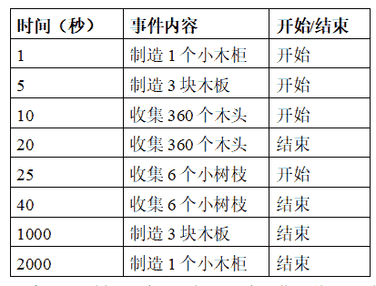

# 网易互娱 2021 校园招聘在线笔试－游戏研发工程师（第一批）

## 1

一位冒险者进入了一个迷宫中寻宝。他手上已经拥有了一份这个迷宫的地图，其中标注了迷宫的完整结构以及迷宫中每个宝箱所在的位置。

迷宫的地图是一个由 m*n 个格子组成的平面图，纵向的上下方向上每列有 m 个格子，横向的左右方向上每行有 n 个格子，其中每个格子为不能进入的障碍格或可以进入的通行格。如果有两个上下相邻或左右相邻的通行格，则可以从其中一个通行格走到另一个通行格。每个宝箱放置在不同的通行格中。

他的目标是收集到这个迷宫里的所有宝箱，因此他给自己在这个迷宫中寻宝制定了如下策略：

1. 计算出离他当前位置曼哈顿距离最小的未收集宝箱，如果有多个就选定最小编号那个，记为 k 号宝箱；

2\. 如果他当前位置无法到达 k 号宝箱，则收集失败，流程结束；否则，计算出他当前位置到 k 号宝箱的最短路径长度，并且按上下左右的次序依次计算出如果向这个方向走一格通行格之后，到 k 号宝箱的最短路径长度是否有缩短，如果有缩短则往这个方向走一格；

3. 如果他当前所在位置有未收集宝箱，就收集这个宝箱。如果所有宝箱已经被收集，则收集完成。否则回到第 1 步并重复执行。

其中迷宫中两个位置的曼哈顿距离，是指这两个位置在上下方向的行差，加上左右方向的列差。如果用公式表示，如果两个位置分别为(x, y)和(u, v)，则这两个位置的曼哈顿距离为|x-u|+|y-v|。

两个位置间的一条路径，是指从其中一个位置开始，通过若干个相邻通行格，走到另一个位置，其中经过的通行格顺序。两个位置的最短路径，是指这两个位置的所有路径中，通过的通行格数量最少的路径。两个位置的最短路径长度，是指沿这两个位置的最短路径走的格数。

问在这种策略下收集所有宝箱，他需要走多少格？数据范围：，，进阶：时间复杂度，空间复杂度

本题知识点

游戏研发工程师 网易互娱 2021

讨论

[牛客 665590250 号](https://www.nowcoder.com/profile/665590250)

```cpp
import java.util.*;

public class Main {
    static int[][] dirs = {{-1,0},{1,0},{0,-1},{0,1}};  //上下左右
    static int[][][] dis;
    public static void main(String[] args) {
        Scanner sc = new Scanner(System.in);
        int t = sc.nextInt();
        while (t-- > 0){
            int m = sc.nextInt();
            int n = sc.nextInt();
            char[][] a = new char[m][n];
            int sx = 0 , sy = 0;
            Map<Integer,int[]> box = new HashMap<>();
            for(int i = 0 ; i < m ; i++){
                a[i] = sc.next().toCharArray();
                for(int j = 0 ; j < n ; j++){
                    if(a[i][j] == '*'){
                        sx = i;
                        sy = j;
                    }
                    if(a[i][j] - '0' >= 0 && a[i][j] - '0' < 10){
                        box.put(a[i][j] - '0' , new int[]{i , j});
                    }
                }
            }
            dis = new int[box.size()][m][n];    //记忆化，记录各点到各箱子的最短路径长度
            System.out.println(cntLen(a , box , sx , sy));
        }
    }

    /**
     *  模拟题目的行走方式进行移动
     *
     */
    static int cntLen(char[][] a , Map<Integer,int[]> map , int x , int y){
        int ans = 0;
        Set<String> vis = new HashSet<>();
        vis.add(x + " " + y);   //这个 Set 是用来记录去找一个箱子时，走过的路径的
        //如果在走到箱子之前发生路径重复，那么这里必定会形成一个循环，导致永远无法走出去
        while (map.size() > 0){
            int idx = nextBox(map , x , y); //按照题意，每次移动之后都需要根据曼哈顿距离决定下一步怎么走
            int len = dis[idx][x][y];
            int[] now = map.get(idx);
            if(len == 0){
                len = bfs(a , x , y , now[0] , now[1]); //求最短路径
                dis[idx][x][y] = len;   //记忆化
            }
            if(len == -1){  //走不过去，直接返回
                return -1;
            }
            if(len == 0){       //当前已经移动到了箱子上，移除该箱子
                vis.clear();    //整体的找箱子方式已经变化，先前路径清除
                map.remove(idx);
                continue;
            }
            for(int i = 0 ; i < 4 ; i++){
                int nx = x + dirs[i][0];
                int ny = y + dirs[i][1];
                if(nx >= 0 && nx < a.length && ny >= 0 && ny < a[0].length && a[nx][ny] != '#'){
                    if(dis[idx][nx][ny] == 0){
                        dis[idx][nx][ny] = bfs(a , nx , ny , now[0] , now[1]);
                    }
                    if(dis[idx][nx][ny] < len){ //根据题意，必须找到一个能够缩短路径的方向，并且按上下左右的顺序寻找
                        x = nx;
                        y = ny;
                        break;
                    }
                }
            }
            String now1 = x + " " + y;
            if(vis.contains(now1)){     //找到箱子前形成循环，永远无法走出去
                return -1;
            }else{
                vis.add(now1);      //记录路径
            }
            ans++;      //步数计数
        }
        return ans;
    }

    /**
     *  根据题意，每次移动都需要根据曼哈顿距离进行移动，箱子不多，直接遍历得到最近的箱子即可
     */
    static int nextBox(Map<Integer,int[]> map , int x , int y){
        int len = 10000000;
        int ans = 0;
        for(Integer num : map.keySet()){
            int[] now = map.get(num);
            int cur = Math.abs(now[0] - x) + Math.abs(now[1] - y);
            if(cur < len){
                ans = num;
                len = cur;
            }
            if(cur == len){
                ans = Math.min(ans , num);
            }
        }
        return ans;
    }

    /**
     *  简单的广度优先搜索，确定两点之间的最短路径
     */
    static int bfs(char[][] a , int sx , int sy , int tx , int ty){
        if(sx == tx && sy == ty){
            return 0;
        }
        Queue<int[]> queue = new LinkedList<>();
        queue.offer(new int[]{sx , sy});
        int cnt = 0;
        Set<String> vis = new HashSet<>();
        vis.add(sx + " " + sy);
        while(!queue.isEmpty()){
            cnt++;
            int len = queue.size();
            for(int i = 0 ; i < len ; i++){
                int[] now = queue.poll();
                for(int j = 0 ; j < 4 ; j++){
                    int x = now[0] + dirs[j][0];
                    int y = now[1] + dirs[j][1];
                    if(x == tx && y == ty){
                        return cnt;
                    }
                    if(x >= 0 && x < a.length && y >= 0 && y < a[0].length && a[x][y] != '#' && !vis.contains(x + " " + y)){
                        queue.offer(new int[]{x , y});
                        vis.add(x + " " + y);
                    }
                }
            }
        }
        return -1;
    }
}
```

发表于 2021-08-20 21:35:55

* * *

[时光的尽头会是什么](https://www.nowcoder.com/profile/530943981)

先计算每个宝箱到所有点的最短距离，然后从起点开始搜索每次搜索前先遍历所有宝箱的位置，选定一个符合要求的宝箱后开始搜索，如果搜索完所有宝箱，返回步数，否则返回-1 ```cpp
#include<bits/stdc++.h>
using namespace std;

struct node
{
	int x,y,t;
}A[10];

char mp[55][55];
bool book[55][55];
int dp[55][55][10];//记录宝箱到每个点的最短距离 
int m,n;
int tx[4] = {0,1,0,-1};
int ty[4] = {1,0,-1,0};
int cnt;
void bfs(int x, int y, int id)//计算宝箱到每个点的最短距离 
{
	memset(book,0,sizeof(book));
	int cnt = 0;
	queue<node> q;
	node a;
	a.x = x;
	a.y = y;
	a.t = 0;
	book[x][y] = true;
	q.push(a);
	while(!q.empty())
	{
		node w = q.front();
		q.pop();
		for(int i = 0; i < 4; i++)
		{
			int xx = w.x + tx[i];
			int yy = w.y + ty[i];
			int temp = w.t+1;
			if(xx >= 1 && xx <= m && yy >= 1 && yy <= n && !book[xx][yy] && mp[xx][yy] != '#')
			{
				book[xx][yy] = true;
				dp[xx][yy][id] = temp;
				q.push(node{xx,yy,temp});
			}
		}
	}
}

int Bfs(int x, int y, int t) 
{
	node a;
	a.x = x;
	a.y = y;
	a.t = t;
	memset(book,0,sizeof(book));
	book[x][y] = 1;
	queue<node> q;
	q.push(a);
	int p = 0;
	while(!q.empty())
	{
		node w = q.front();
		q.pop();
		if(mp[w.x][w.y] >= '0' && mp[w.x][w.y] <= '9' && A[mp[w.x][w.y] - '0'].t == 0)
		{
			memset(book,0,sizeof(book));
			book[w.x][w.y] = 1;
			A[mp[w.x][w.y] - '0'].t = 1;
			p++;
		}
		if(p == cnt)
		{
			return w.t;
		}
		int maxn = 100005;
		int id;
		for(int i = 0; i < cnt; i++)
		{
			if(abs(A[i].x - w.x) + abs(A[i].y - w.y) < maxn && A[i].t == 0)
			{
				maxn = abs(A[i].x - w.x) + abs(A[i].y - w.y);
				id = i;
			}
		}
		for(int i = 0; i < 4; i++)
		{
			int xx = w.x + tx[i];
			int yy = w.y + ty[i];
			int temp = w.t+1;
			if(xx >= 1 && xx <= m && yy >= 1 && yy <= n && !book[xx][yy] && mp[xx][yy] != '#' && dp[xx][yy][id] < dp[w.x][w.y][id])
			{
				book[xx][yy] = 1;
				q.push(node{xx,yy,temp});
			}
		}
	}
	return -1;
}
int main()
{
	int t,x,y;
	cin >> t;
	while(t--)
	{
		memset(dp,0,sizeof(dp));
		cnt = 0;
		cin >> m >> n;
		cnt = 0;
		for(int i = 1; i <= m; i++)
		{
			for(int j = 1; j <= n; j++)
			{
				cin >> mp[i][j];
				if(mp[i][j] == '*')
				{
					x = i;
					y = j;
				}
				else if(mp[i][j] >= '0' && mp[i][j] <= '9')
				{
					A[mp[i][j] - '0'].x = i;
					A[mp[i][j] - '0'].y = j;
					cnt++;
				}
			}
		}
		for(int i = 0; i < cnt; i++)
		{
			bfs(A[i].x, A[i].y, i);
		}
		int ans = Bfs(x,y,0);
		cout << ans << "\n";
		for(int i = 0; i < cnt; i++)
		{
			A[i].t = 0;
			A[i].x = 0;
			A[i].y = 0;
		}
	}
} 

/*
链接：https://www.nowcoder.com/questionTerminal/1923918bf2b647deab161fd8d5d2ddfb
来源：牛客网

3
5 5
0...1
.#.#.
..*..
.#.#.
2...3
5 5
0...1
.#.#.
..*.#
.#.#.
2.#.3
5 5
....1
.####
..*..
####.
0....
*/
``` 

发表于 2021-08-07 10:58:45

* * *

[请问去哪里](https://www.nowcoder.com/profile/110962522)

```cpp
using System;
using System.Collections;
using System.Collections.Generic;
class Program
{
   static void Main()
   {
         int T = int.Parse(Console.ReadLine());
            int[] dirX = { -1, 1, 0, 0 };
            int[] dirY = { 0, 0, -1, 1 };
            while (T-- > 0)
            {
                int[] rowcolCount = Array.ConvertAll(Console.ReadLine().Split(), Convert.ToInt32);
                int m = rowcolCount[0], n = rowcolCount[1];
                int[] nowPos = new int[2];
                string[] map = new string[m];
                int steps = 0;
                for (int i = 0; i < m; i++)
                {
                    map[i] = Console.ReadLine();
                }
                Dictionary<int, int[]> targets = new Dictionary<int, int[]>();
                for (int i = 0; i < m; i++)
                {
                    for (int j = 0; j < n; j++)
                    {
                        int number = map[i][j] - '0';
                        if (number >= 0 && number <= 9)
                        {
                            targets.Add(number, new int[2] { i, j });
                        }
                        if (map[i][j] == '*')
                        {
                            nowPos[0] = i;
                            nowPos[1] = j;
                        }
                    }
                }
                bool[,] visited = new bool[m, n];//纪录步数
                while (true)
                {
                    //获得当前目标
                    if (visited[nowPos[0], nowPos[1]])
                    {
                        Console.WriteLine(-1);
                        break;
                    }
                    visited[nowPos[0], nowPos[1]] = true;
                    int curTar = Program.GetRecent(nowPos[0], nowPos[1], targets);

                    if (curTar == -1)//这个时候宝藏已经找完了
                    {
                        Console.WriteLine(steps);
                        break;
                    }
                    int minDis = Program.GetMinDis(curTar, nowPos, targets, map);
                    if (minDis == 0)//到达宝藏
                    {
                        targets.Remove(curTar);
                        visited = new bool[m, n];
                        continue;
                    }
                    if (minDis == -1)//这个时候宝藏无法到达
                    {
                        Console.WriteLine(-1);
                        break;
                    }
                    for (int i = 0; i < 4; i++)
                    {
                        int x = nowPos[0] + dirX[i];
                        int y = nowPos[1] + dirY[i];
                        if (x >= 0 && x < m && y >= 0 && y < n
                            && map[x][y] != '#'
                            && GetMinDis(curTar, new int[2] { x, y }, targets, map) < minDis)
                        {
                            nowPos[0] = x;
                            nowPos[1] = y;
                            steps++;
                            break;
                        }
                    }
                }
            }
   }

       public static int GetMinDis(int target, int[] nowPos, Dictionary<int, int[]> targets, string[] map)
        {
           Queue<int[]> queue = new Queue<int[]>();
            queue.Enqueue(nowPos);
            int res = 0;
            int m = map.Length, n = map[0].Length;
            bool[,] visited = new bool[m, n];
            int[] dirX = { -1, 1, 0, 0 };
            int[] dirY = { 0, 0, -1, 1 };
            while (queue.Count > 0)
            {
                int count = queue.Count;
                for (int i = 0; i < count; i++)
                {
                    int[] cur = queue.Dequeue();
                    visited[cur[0], cur[1]] = true;
                    if (cur[0] == targets[target][0] && cur[1] == targets[target][1])
                    {
                        return res;
                    }
                    for (int j = 0; j < 4; j++)
                    {
                        int x = cur[0] + dirX[j];
                        int y = cur[1] + dirY[j];
                        if (x >= 0 && x < m && y >= 0 && y < n
                            && map[x][y] != '#'
                            && !visited[x, y]) 
                        {
                            queue.Enqueue(new int[2] { x, y });
                            visited[x, y] = true;
                        }
                    }
                }
                res++;
            }
            return -1;
        }
        //得到最近的宝藏的编号
        public static int GetRecent(int x, int y, Dictionary<int, int[]> targets)
        {
            int min = int.MaxValue;
            int res = -1;
            foreach (var item in targets)
            {
                int M = GetM(x, y, item.Value[0], item.Value[1]);
                if (M < min)
                {
                    min = M;
                    res = item.Key;
                }
                else if (M == min)
                {
                    res = Math.Min(res, item.Key);
                }
            }
            return res;
        }
        /// 得到两点间曼哈顿距离
        static int GetM(int x1, int y1, int x2, int y2)
        {
            return Math.Abs(x1 - x2) + Math.Abs(y1 - y2);
        }
}
```

编辑于 2022-03-19 22:03:57

* * *

## 2

游戏工程师小明购买了 VR 设备之后爱上了体感游戏，而最近他把他的业余时间花在了一款叫十字斩的游戏里。当你戴上 VR 眼镜启动游戏后，先选择一首音乐，然后会发现有一个 N*N 的方阵呈现在你的眼前，方阵的每个格子上都有一个数字。然后伴随着音乐节拍，你需要按照时机对方阵进行一次十字斩击（同时斩掉一行和一列，而且选好了行列后不能斩到选定行列之外的格子）。斩击完了之后，矩阵会收缩成一个（N-1）*（N-1）的方阵。

特别的，若该次十字斩斩到的格子数字和是本次所有十字可能里最大的，则会获得一个 Perfect，如果 N 次十字斩都是 Perfect，则可以获得 FullCombo 的成就。但小明的心算能力不行，至今还未能获得 FullCombo 的成就。所幸初始数字方阵与音乐是一一对应的，所以小明可以通过预先计算十字斩的位置然后背下来，游玩的时候根据记忆去进行十字斩位置的选择即可。

小明上了一天班已经不想写代码了，所以他拜托你来写一个程序为他计算出十字斩的方案。

本题知识点

游戏研发工程师 网易互娱 2021

讨论

[牛客小浩](https://www.nowcoder.com/profile/430301100)

更改之后的 需要将每行每列的值提前求出来代码：

```cpp
#include<iostream>
#include<bits/stdc++.h>
#include<algorithm>
using namespace std;
/* int getsum(int x,int y,deque<deque<int>> box){
    int x_size = box[x].size();
    int x_sum=0,y_sum=0;
    for(int k = 0;k<x_size;k++){
        x_sum  += box[x][k];
        y_sum  += box[k][y];
    }
    return x_sum+y_sum - box[x][y];
} */

int main(){
    int n; cin>>n;
    //数据存入
    deque<deque<int>> box(n,deque<int>(n,0));//初始化矩阵
    for(int i=0;i<n;i++){
       for(int j=0;j<n;j++){
           int temp;
           cin>>temp;
           box[i][j] = temp;
       }
    }
    //处理数据
    while(n>0){
        int x=0,y=0;
        //求第 i 行 第 j 列的值
        int max_sum = 0;
        //数组行和列的值 应该在前面就进行得到
        int x_sum=0,y_sum = 0;
        vector<int> p_x(n,0);
        vector<int> p_y(n,0);
        for(int k = 0;k<n;k++){
           for(int p=0;p<n;p++){
               p_x[k] += box[k][p];
               p_y[p] += box[k][p];
           }
        }
        for(int l=0;l<n;l++){
            for(int h=0;h<n;h++){
                int temp_max = p_x[l]+ p_y[h]- box[l][h];
                if(temp_max>max_sum){
                    //第一大于的数据
                    x=l;
                    y=h;
                    max_sum = temp_max;
                };
            }
        }
        //需要删除 x 和 y 行的数据
        cout<<(x+1)<<" "<<(y+1)<<endl;
        n--;
        //对于 deque 进行删除
        //删除一行
        box.erase(box.begin()+x);
        //删除列
        int b_size = box.size();
        for(int i=0;i<b_size;i++){
            box[i].erase(box[i].begin()+y);
        }
    }

    return 0;
}
```

以下的复杂度太高吗超时了

```cpp
#include<iostream>
#include<bits/stdc++.h>
#include<algorithm>
using namespace std;
int getsum(int x,int y,deque<deque<int>> box){
    int x_size = box[x].size();
    int x_sum=0,y_sum=0;
    for(int k = 0;k<x_size;k++){
        x_sum  += box[x][k];
        y_sum  += box[k][y];
    }
    return x_sum+y_sum - box[x][y];
}

int main(){
    int n; cin>>n;
    //数据存入
    deque<deque<int>> box(n,deque<int>(n,0));//初始化矩阵
    for(int i=0;i<n;i++){
       for(int j=0;j<n;j++){
           int temp;
           cin>>temp;
           box[i][j] = temp;
       }
    }
    //处理数据
    while(n>0){
        int x=0,y=0;
        //求第 i 行 第 j 列的值
        int max_sum = 0;
        for(int l=0;l<n;l++){
            for(int h=0;h<n;h++){
                int temp_max = getsum(l, h, box);
                if(temp_max>max_sum){
                    //第一大于的数据
                    x=l;
                    y=h;
                    max_sum = temp_max;
                };
            }
        }
        //需要删除 x 和 y 行的数据
        cout<<(x+1)<<" "<<(y+1)<<endl;
        n--;
        //对于 deque 进行删除
        //删除一行
        box.erase(box.begin()+x);
        //删除列
        int b_size = box.size();
        for(int i=0;i<b_size;i++){
            box[i].erase(box[i].begin()+y);
        }
    }

    return 0;
}
```

编辑于 2021-08-06 16:49:35

* * *

[升小帆](https://www.nowcoder.com/profile/555716518)

```cpp
#include <iostream>
#include <vector>
#include <algorithm>

using namespace std;
void tencut(vector<vector<int>>& vec, int size) {
	pair<int, int>cut{ 0,0 };
	int m = size;
	if (m == 1)cout << 1 << " " << 1 << endl; //如果只有 1 的大小，输出 1,1
	else if (m > 0) {
		int row = 0, colum = 0, maxNum = 0;
		vector<vector<int>>sum(m, vector<int>(2));// 记录每行每列的总和，m*2 个数，一列是行和，一列是列合，可以将 m 个求和转换为常数的减法
		for (int i = 0; i < m; i++) {
			int colsum = 0, rowsum = 0;
			for (int j = 0; j < m; j++) {
				rowsum += vec[i][j];
				colsum += vec[j][i];
			}
			sum[i][0] = rowsum;
			sum[i][1] = colsum;
		}
		for (int i = 0; i < m; i++) { //用每处的行和＋列和－自身得到十字合
			for (int j = 0; j < m; j++) {
				int alsum = sum[i][0] + sum[j][1] - vec[i][j];
				if (alsum > maxNum) {  //寻找最小十字合输出结果
					maxNum = alsum;
					row = i; colum = j;
				}
			}
		}
		cout << row + 1 << " " << colum + 1 << endl;
		int rr = 0, cc = 0;//在原数组上进行修改，减少空间复杂度
		for (int i = 0; i < m; i++) {
			if (i == row)continue;
			cc = 0;
			for (int j = 0; j < m; j++)
			{
				if (j == colum)continue;
				vec[rr][cc] = vec[i][j];
				cc++;
			}
			rr++;
		}
		tencut(vec, m - 1);//进行递归
	}
}
int main() {
	int size = 0;
	while (cin >> size) {
		vector<vector<int>>vec(size, vector<int>(size, 0));
		for (int i = 0; i < size; i++) {
			for (int j = 0; j < size; j++) {
				cin >> vec[i][j];
			}
		}
		tencut(vec, size);% 每次十字斩的大小
	}
	return 0;
}
```

发表于 2021-08-06 13:53:15

* * *

[牛客 826508150 号](https://www.nowcoder.com/profile/826508150)

```cpp
## Python 不配？？？直接就超时？
n = int(input())
string_list = []
for i in range(n):
    string = list(map(int,input().split(' '))) # list(map(int, results))
    string_list.append(string)
list_hang =[i for i in range(0,1+n)]
list_lie =[i for i in range(0,n+1)]
hang = [ sum(string_list[i]) for i in range(n)]
lie = [0 for i in range(n)]
for i in range(n):
    for j in range(n):
        lie[i] += string_list[j][i]

for p in range(n):
    max_key = -float('inf')
    key_xy= [0,0]
    for i in range(n):
        for j in range(n):
            if hang[i]+lie[j]-string_list[i][j]>max_key:
                key_xy = [i,j]
                max_key = hang[i]+lie[j]-string_list[i][j]

    for i in range(n):
        hang[i]-=string_list[i][key_xy[1]]
        lie[i] -= string_list[key_xy[0]][i]

    for i in range(n):
        string_list[i][key_xy[1]]=0
        string_list[key_xy[0]][i]=0
    hang[key_xy[0]] = 0
    lie[key_xy[1]] = 0
    for i in range(key_xy[0]+1,n+1):
        list_hang[i]-=1
    for i in range(key_xy[1]+1,n+1):
        list_lie[i]-=1
    print(list_hang[key_xy[0]]+1 , list_lie[key_xy[1]]+1)
```

发表于 2022-03-17 13:39:11

* * *

## 3

七星不靠是[中国麻将竞赛规则](https://baike.baidu.com/item/%E4%B8%AD%E5%9B%BD%E9%BA%BB%E5%B0%86%E7%AB%9E%E8%B5%9B%E8%A7%84%E5%88%99/7175577)的[番种](https://baike.baidu.com/item/%E7%95%AA%E7%A7%8D/193698)，胡牌时由东南西北中发白 7 张，外加其他花色的 147、258、369 不相连的牌型，且没有将牌而组成。

--百度百科

七星不靠中的七星是指：东西南北中发白，也就是牌中必须有这七张。而其它牌按下述的来拼全：

东西南北中发白+147 万+258 饼+369 条

东西南北中发白+147 万+258 条+369 饼

东西南北中发白+147 条+258 万+369 饼

东西南北中发白+147 条+258 饼+369 万

东西南北中发白+147 饼+258 条+369 万

东西南北中发白+147 饼+258 万+369 条

由于胡牌时只需要 14 张牌，而上述组合均有 16 张，那么除了东西南北中发白必须有外，其它三色可以随便去掉两张，都可以组成七星不靠。

我们的任务是，假设我们的 14 张牌中已经包含了东西南北中发白这 7 张牌，另外的牌都是万饼条的序数牌，给出另外的这 7 张牌，判断是否能组成七星不靠。数据范围： 数据组数 
进阶：每组数据的空间复杂度  ，时间复杂度 

本题知识点

游戏研发工程师 网易互娱 2021

讨论

[牛客 536106853 号](https://www.nowcoder.com/profile/536106853)

```cpp
def fun():
    temp = set(input().split())
    if len(temp) < 7:
        return 'NO'
    test = [{'1','4','7'}, {'2','5','8'}, {'3','6','9'}]
    a = [set() for _ in range(3)]
    for te in temp:
        if te[1] == 'T':
            a[0].add(te[0])
        elif te[1] == 'W':
            a[1].add(te[0])
        else:
            a[2].add(te[0])
    for b in a:
        for te in test:
            if b | te == te:
                test.remove(te)
                break
        else:
            return 'NO'
    return 'YES'
if __name__ == '__main__':
    T = int(input())
    for _ in range(T):
        print(fun())
```

发表于 2021-08-24 19:43:28

* * *

[Chaoz3](https://www.nowcoder.com/profile/984298207)

不跟你整那些花里胡哨的，直接暴力统计。

```cpp
#include <iostream>
#include <set>
using namespace std;

int main() {
    int N;
    while(cin >> N){
        while(N--){
            int n = 7;
            set<string> st1;
            set<string> st2;
            set<string> st3;
            set<string> st4;
            set<string> st5;
            set<string> st6;
            while(n--){
                string str;
                cin >> str;
                if(str == "1W" || str == "4W" || str == "7W" || str == "2T" || str == "5T" || str == "8T" || str == "3B" || str == "6B" || str == "9B"){
                    st1.insert(str);
                }
                if(str == "1W" || str == "4W" || str == "7W" || str == "2B" || str == "5B" || str == "8B" || str == "3T" || str == "6T" || str == "9T"){
                    st2.insert(str);
                }
                if(str == "1T" || str == "4T" || str == "7T" || str == "2W" || str == "5W" || str == "8W" || str == "3B" || str == "6B" || str == "9B"){
                    st3.insert(str);
                }
                if(str == "1T" || str == "4T" || str == "7T" || str == "2B" || str == "5B" || str == "8B" || str == "3W" || str == "6W" || str == "9W"){
                    st4.insert(str);
                }
                if(str == "1B" || str == "4B" || str == "7B" || str == "2W" || str == "5W" || str == "8W" || str == "3T" || str == "6T" || str == "9T"){
                    st5.insert(str);
                }
                if(str == "1B" || str == "4B" || str == "7B" || str == "2T" || str == "5T" || str == "8T" || str == "3W" || str == "6W" || str == "9W"){
                    st6.insert(str);
                }
            }
            if(st1.size() < 7 && st2.size() < 7 && st3.size() < 7 && st4.size() < 7 && st5.size() < 7 && st6.size() < 7) cout << "NO" << endl;
            else cout << "YES" << endl;
        }
    }
    return 0;
}
```

发表于 2021-07-18 16:26:36

* * *

[maoxiaomao](https://www.nowcoder.com/profile/230303195)

1.提取独立的数字以及字母存储到列表当中 2.判断独立数字个数是否大于等于 7 以及 独立字母个数是否大于等于 3

```cpp
T=int(input().strip())
for j in range(T):
    A=input().strip().split()
    unum=[]
    ualpha=[]
    for i in range(7):
        for j in range(2):
            if A[i][j]>='1' and A[i][j]<='9':
                if A[i][j] not in unum:
                    unum.append(A[i][j])
            else:
                if A[i][j] not in ualpha:
                    ualpha.append(A[i][j])
    if len(unum)>=7 and len(ualpha)>=3:
        print('YES')
    else:
        print('NO')
```

发表于 2021-05-21 09:10:22

* * *

## 4

明明最近迷上了《明日之后》这款游戏。在这款游戏中有一个配方制造系统，玩家可以利用手中的资源和材料，来制造武器和道具。例如，玩家如果需要制造一个小木柜，需要 3 块木板，而制造一块木板，又需要 120 个木头和 2 个小树枝，并且需要走到建筑加工台前制作。而采集木头和小树枝又需要一定的时间。

玩了一段时间之后，明明开始好奇在游戏中做什么最花时间。虽然游戏中已经有标明每个物品的制造时间，但是明明更想通过自己的游戏经历来统计实际需要的时间。明明根据自己的操作，记录下了自己游戏中每个操作事件的开始和结束时间，按时间顺序汇总成了一张表，如下所示：



从上表可以看出，“制造 1 个小木柜”这个操作，总共用时 2000-1=1999 秒时间，其中包含两部分：制造 3 块木板的耗时（1000-5=995 秒）和自身的耗时（1999-995=1004 秒）。同样的，制造 3 块木板的 995 秒耗时中，也包括 3 部分：收集 360 个木头的耗时（20-10=10 秒）、收集 6 个小树枝的耗时（40-25=15 秒）以及自身耗时（995-10-15=970 秒）。在这些操作当中，“制造 1 个小木柜”自身耗时 1004 秒，是所有操作中自身耗时最多的一个操作。

明明想知道自己做的这些操作中，哪个操作自身所花的时间是最多的。给出这张事件记录表，你可以帮明明计算一下吗？

数据范围：输入数据组数满足  ，每组数组中操作数满足  ，操作中的数都满足  、 时间结束和开始信息满足 
进阶：空间复杂度  ，时间复杂度 

本题知识点

游戏研发工程师 网易互娱 2021

讨论

[牛客 719032233 号](https://www.nowcoder.com/profile/719032233)

```cpp
#include<iostream>
#include<vector>
#include<stack>
#include<algorithm>
using namespace std;
struct event
{
  int t;
  int e;
  int s;
  int extraTime=0;
};
int test()
{
  int N=0;
  cin>>N;
  //vector<event> eventVec(N);
  stack<event> eventStack;
  int id=0;
  int maxTime=0;
  for(int i=0;i<N;i++)
  {
    int t,e,s;
    cin>>t>>e>>s;
    event inputEvent;
    inputEvent.t=t;inputEvent.e=e;inputEvent.s=s;inputEvent.extraTime=0;
    if(inputEvent.s==0)
      eventStack.push(inputEvent);
    else{
      event tempEvent=eventStack.top();
      int time=inputEvent.t-tempEvent.t;
      //更新最大 id
      if(time-tempEvent.extraTime>maxTime)
      {
        id=inputEvent.e;
        maxTime=time-tempEvent.extraTime;
      }
      //相等的情况输出较小的 ID,之前少了这两行一个测试用例都没过！！！，加上就全过了......
      else if(time-tempEvent.extraTime==maxTime)
        id=min(id,inputEvent.e);
      eventStack.pop();
      //修改 extraTime
      if(!eventStack.empty())
      {
        tempEvent=eventStack.top();
        tempEvent.extraTime+=time;
        eventStack.pop();
        eventStack.push(tempEvent);
      }
    }
  }
  return id;
}
int main()
{
  int T=0;
  cin>>T;
  for(int i=0;i<T;i++)
  {
    cout<<test()<<endl;
  }
  return 0;
}
```

一个栈搞定，结构体中加了个 extraTime 用以记录所有子事件花费的时间。PS:刚开始少加了两行代码，没有判断最大时间相等时取较小的 ID 这个条件，导致一个用例都没通过。自我怀疑了半天......

发表于 2021-08-06 22:13:39

* * *

[哈哈 201811051524714](https://www.nowcoder.com/profile/596340300)

C# 通过全部用例，详细注释

```cpp
using System;
using System.Collections.Generic;

class Program{
    public static void Main(string[] args){
        int groNum = int.Parse(Console.ReadLine());
        while(groNum>0){
            groNum--;

            int N = int.Parse(Console.ReadLine());
            int id = -1, time = -1;

            Stack<int[]> stack = new Stack<int[]>();
            Stack<int> timeStack = new Stack<int>();
            //处理一组数据
            while(N>0){
                --N;
                //储存一行数据
                string[] temp = Console.ReadLine().Split(" ");
                int[] curr = new int[3];
                for(int i=0; i<3; ++i) curr[i] = int.Parse(temp[i]);

                //事件“开始”则入栈
                if(curr[2]==0) {
                    stack.Push(new int[]{curr[0], curr[1]});
                }
                else{
                    //当前事件“结束”的时刻
                    int timeNow = curr[0];
                    //事件的栈顶不是当前事件
                    //说明当前事件包含子事件
                    while(stack.Peek()[1]!=curr[1]){
                        stack.Pop();
                        //减去子事件的耗时
                        timeNow -= timeStack.Pop();
                    }
                    //减去当前事件“开始”的时刻，得到“自身耗时”
                    timeNow -= stack.Peek()[0];
                    //当前事件全部耗时入栈（与“自身耗时”不同）
                    timeStack.Push(curr[0]-stack.Peek()[0]);
                    //记录最长的“自身耗时”
                    if(time<timeNow){
                        time = timeNow;
                        id = curr[1];
                    }
                    //有多个满足条件的事件，则输出事件 id 最小的
                    else if(time==timeNow) id = Math.Min(id, curr[1]);
                }
            }
            Console.WriteLine(id);
        }
    }
}
```

发表于 2022-03-18 11:08:05

* * *

[牛客 36112786 号](https://www.nowcoder.com/profile/36112786)

```cpp
#include <iostream>
#include <stack>
#include <vector>
#include <algorithm>
using namespace std;

int main() {
	int T;
	cin >> T;
	while (T--) {
		int N;
		cin >> N;
		stack<vector<int>> si;//0 为入栈，1 为出栈
		int level = 0;
		vector<vector<int>> vv;
		while (N--) {
			vector<int> beg(4);//某事件开始
			vector<int> end(4);//某事件结束
			cin >> beg[0] >> beg[1] >> beg[2];
			beg[3] = level;//划分深度，0123
			if (beg[2] == 0) {    //入栈
				si.push(beg);
				level++;
			}
			else {                    //出栈
				vector<int> tmp;    //存储事件
				end = si.top();
				si.pop();
				level--;
				tmp.push_back(beg[0] - end[0]);//总时间
				tmp.push_back(beg[1]);           //id
				tmp.push_back(level);            //深度
				vv.push_back(tmp);
			}
		}
		stack<vector<int>>  s;
		int time = vv[0][0];
		int id = vv[0][1];
		int pre = vv[0][2];
		s.push(vv[0]);
		for (int i = 1; i < vv.size(); i++) {
			if (!s.empty() && vv[i][2] < s.top()[2]) {
				vector<int> temp;
				int t = vv[i][0];
				while (!s.empty() && vv[i][2] < s.top()[2]) {
					t -= s.top()[0];
					s.pop();
				}
				s.push(vv[i]);
				if (t > time) {
					time = t;
					id = vv[i][1];
				}
				else if (t == time) {
					id = min(id, vv[i][1]);
				}
			}
			else {
				s.push(vv[i]);
				if (vv[i][0] > time) {
					time = vv[i][0];
					id = vv[i][1];
				}
				else if (vv[i][0] == time) {
					id = min(id, vv[i][1]);
				}
			}
		}
		cout << id << endl;
	}

	return 0;
}

```

全部通过，栈加栈

编辑于 2021-06-30 13:10:12

* * *