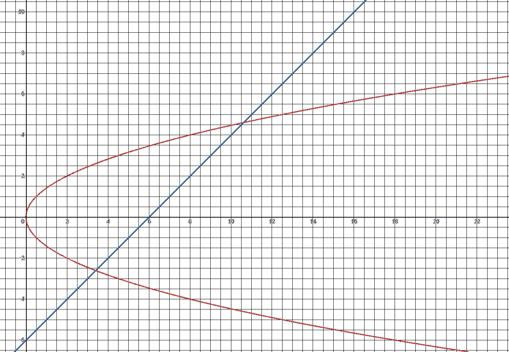
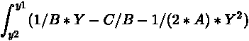

# 腾讯 2021 校园招聘技术类编程题汇总

## 1

现在有 10⁵个用户，编号为 1- 10⁵，现在已知有 m 对关系，每一对关系给你两个数 x 和 y ，代表编号为 x 的用户和编号为 y 的用户是在一个圈子中，例如： A 和 B 在一个圈子中， B 和 C 在一个圈子中，那么 A , B , C 就在一个圈子中。现在想知道最多的一个圈子内有多少个用户。数据范围： 
进阶：空间复杂度  ，时间复杂度 

本题知识点

C++工程师 golang 工程师 iOS 工程师 安卓工程师 运维工程师 前端工程师 算法工程师 测试工程师 PHP 工程师 安全工程师 游戏研发工程师 数据库工程师 信息技术岗 区块链 测试开发工程师 大数据开发工程师 数据分析师 Java 工程师 腾讯 2021

讨论

[bngel](https://www.nowcoder.com/profile/457844998)

```cpp
//  邻接表 + dfs
#include<iostream>
#include<vector>
using namespace std;
int cnt,ans;
int v[100001];
vector<int>a[100001];
void dfs(int x)
{
    int i,num;
    v[x]=1; cnt++;
    for(i=0;i<a[x].size();i++)
    {
        num=a[x][i];
        if(v[num]==0)dfs(num);
    }
}
int main()
{
    int i,k,n,x,y,T;
    scanf("%d",&T);
    for(i=0;i<T;i++)
    {
        scanf("%d",&n);
        for(k=1;k<=1e5;k++)
        {
            v[k]=0;
            a[k].clear();
        }
        for(k=1;k<=n;k++)
        {
            scanf("%d %d",&x,&y);
            a[x].push_back(y);
            a[y].push_back(x);
        }
        ans=0;
        for(k=1;k<=1e5;k++)
        {
            cnt=0;
            dfs(k);
            ans=max(ans,cnt);
        }
        printf("%d\n",ans);
    }
    return 0;
}

```

发表于 2022-02-10 12:46:12

* * *

[零葬](https://www.nowcoder.com/profile/75718849)

一看到这种求连通关系的就要想到使用并查集，为了进一步优化时间复杂度，记得在 find 方法中添加路径压缩。

```cpp
import java.io.BufferedReader;
import java.io.InputStreamReader;
import java.io.IOException;

class UnionFind {
    public static int[] parent = new int[10000001];
    public static int[] personNums = new int[10000001];
    public UnionFind(){
        for(int i = 1; i <= 10000000; i++){
            parent[i] = i;
            personNums[i] = 1;
        }
    }

    public int find(int x) {
        while(x != parent[x]){
            parent[x] = parent[parent[x]];    // 路径压缩
            x = parent[x];
        }
        return x;
    }

    public void union(int x, int y){
        int rootX = find(x);
        int rootY = find(y);
        if(rootX == rootY) return;
        parent[rootY] = rootX;
        personNums[rootX] += personNums[rootY];
    }
}

public class Main {
    public static void main(String[] args) throws IOException {
        BufferedReader br = new BufferedReader(new InputStreamReader(System.in));
        int T = Integer.parseInt(br.readLine());
        while(T -- > 0){
            int n = Integer.parseInt(br.readLine());
            UnionFind uf = new UnionFind();
            for(int i = 0; i < n; i++){
                String[] params = br.readLine().trim().split(" ");
                int x = Integer.parseInt(params[0]);
                int y = Integer.parseInt(params[1]);
                uf.union(x, y);
            }
            int max = 0;
            for(int i = 1; i < uf.personNums.length; i++)
                max = Math.max(max, uf.personNums[i]);
            System.out.println(max);
        }
    }
}
```

编辑于 2021-07-22 16:11:31

* * *

[Peillion](https://www.nowcoder.com/profile/669434838)

一开始碰到这题没思路，看了一下各位前辈的回答了解到这是一个典型的并查集问题，详情可参考[算法学习笔记(1) : 并查集 - 知乎 (zhihu.com)](https://zhuanlan.zhihu.com/p/93647900/)

```cpp
#include <iostream>
#include <unordered_map>

using namespace std;

unordered_map<int, int> fa;  //用 fa 来存储父节点
unordered_map<int, int> cnt;  //用 cnt 来存储节点的子节点数量

int find(int x)  //寻找父节点
{
    if (fa.find(x) == fa.end()) {  //fa[x]尚未存在表中时
        fa[x] = x;  //将 fa[x]的父节点设置为自己
        cnt[x] = 0;
    }
    if (x == fa[x]) {
        return x;
    }
    return fa[x] = find(fa[x]);  //将 x 的根节点设置为父节点(路径压缩),并返回根节点
}

void Union(int x, int y)  //合并
{
    int fx = find(x);  //fx 为 x 的父节点
    int fy = find(y);  //fy 为 y 的父节点
    fa[fx] = fy;  //将 fx 的父节点设为 fy
}

int main()
{
    int T;
    cin >> T;
    while (T--)
    {
        int n;
        cin >> n;
        while (n--)
        {
            int x, y;
            cin >> x >> y;
            Union(x, y);
        }
        int ans = 0;  //每个节点子节点数至少为 1（其自身），故将初始 ans 设置为 0 用于后续比较
        for (unordered_map<int,int>::iterator it=fa.begin();it!=fa.end(); it++)
        {
            int fi = find(it->second);
            cnt[fi]++;  //每到节点 i 就往其根节点 cnt[]+1
            if (cnt[fi] > ans)
                ans = cnt[fi];
        }
        cout << ans << endl;
        fa.clear();
        cnt.clear();
    }
    return 0;
}

```

编辑于 2021-08-06 10:55:29

* * *

## 2

输入一个字符串 s，s 由小写英文字母组成，保证 s 长度小于等于 5000 并且大于等于 1。在 s 的所有不同的子串中，输出字典序第 k 小的字符串。字符串中任意个连续的字符组成的子序列称为该字符串的子串。
字母序表示英文单词在字典中的先后顺序，即先比较第一个字母，若第一个字母相同，则比较第二个字母的字典序，依次类推，则可比较出该字符串的字典序大小。数据范围：  ， 
进阶：空间复杂度  ， 时间复杂度 

本题知识点

C++工程师 golang 工程师 iOS 工程师 安卓工程师 运维工程师 前端工程师 算法工程师 测试工程师 PHP 工程师 安全工程师 游戏研发工程师 数据库工程师 信息技术岗 区块链 测试开发工程师 大数据开发工程师 数据分析师 Java 工程师 腾讯 2021

讨论

[零葬](https://www.nowcoder.com/profile/75718849)

首先我们需要一个有序的容器来存放子串，由于需要保证子串各不相同，因此还需要一个集合来对子串进行去重。由于子串的数量可能非常庞大，我们做一些优化，考虑到字典序第 k 小的子串长度一定不会超过 k，因此在对长度进行遍历时，没有必要将候选的长度尝试到 k 以上。同时，我们还希望这个有序的容器能够以 O(1)的复杂度获取到字典序第 k 小的子串，这里采用大根堆作为此有序容器，并将堆的大小控制为 k，当堆中元素数量小于 k 时，直接往堆中插入元素；当堆中元素数量达到了 k 时，为了保证堆中是字典序最小的 k 个子串，我们仅在待入队子串的字典序小于堆顶子串时将堆顶子串出队，然后将待入队子串插入。如此一来，遍历完所有的子串后，直接取出堆顶元素即为字典序第 k 小的子串。

```cpp
import java.io.BufferedReader;
import java.io.InputStreamReader;
import java.io.IOException;
import java.util.HashSet;
import java.util.PriorityQueue;

public class Main {
    public static void main(String[] args) throws IOException {
        BufferedReader br = new BufferedReader(new InputStreamReader(System.in));
        String str = br.readLine();
        int k = Integer.parseInt(br.readLine());
        HashSet<String> set = new HashSet<>();
        PriorityQueue<String> queue = new PriorityQueue<>((s1, s2) -> s2.compareTo(s1));
        for(int len = 1; len <= k; len ++){
            for(int i = 0; i < str.length() - len + 1; i++){
                String substr = str.substring(i, i + len);
                if(!set.contains(substr)){
                    if(queue.size() < k){
                        queue.offer(substr);
                    }else{
                        if(substr.compareTo(queue.peek()) < 0){
                            queue.poll();
                            queue.offer(substr);
                        }
                    }
                    set.add(substr);
                }
            }
        }
        System.out.println(queue.peek());
    }
}
```

发表于 2021-07-22 15:41:04

* * *

[maoxiaomao](https://www.nowcoder.com/profile/230303195)

继续投机取巧...

```cpp
s=input().strip()
k=int(input())
A=[]
for i in range(len(s)-k):
    A.append(s[i:i+k])
if k==1:
    A=sorted(A,key=lambda x:(x[0]))
elif k==2:
    A=sorted(A,key=lambda x:(x[0],x[1]))
elif k==3:
    A=sorted(A,key=lambda x:(x[0],x[1],x[2]))
elif k==4:
    A=sorted(A,key=lambda x:(x[0],x[1],x[2],x[3]))
else:
    A=sorted(A,key=lambda x:(x[0],x[1],x[2],x[3],x[4]))
print(A[0])
```

发表于 2021-06-02 21:08:22

* * *

[JCoder](https://www.nowcoder.com/profile/1405380)

来一个不一样的 K 路归并思路的解法。其实还算比较好想，同一个起点的字串的字典序一定是递增的，所以可以看成是 多个有序的数组合并成一个有序数组，也就是 k 路归并。例如 输入是 abcd：那么可以得到：a -> ab -> abc -> abcdb -> bc -> bcdc -> cdd 然后用这四个有序链表去合并就好了。
用 Data 代表链表的节点。

```cpp
#include <bits/stdc++.h>
using namespace std;

struct Data {
    string s;
    int next;
    Data(string s, int next) : s(s), next(next) {}
};
struct Cmp {
    bool operator()(Data &a, Data &b) {
        return a.s > b.s;
    }
};

int main() {
    char str[5005];
    int k;
    scanf("%s", str);
    scanf("%d", &k);
    priority_queue<Data, vector<Data>, Cmp> heap;
    for (int i = 0; i < strlen(str); i++) {
        string tmp = string("") + str[i];
        heap.push(Data(tmp, i + 1));
    }
    int cnt = 0;
    set<string> vis;
    string ans;
    while (cnt < k) {
        Data t = heap.top();
        heap.pop();
        if (!vis.count(t.s)) {
            vis.insert(t.s);
            ans = t.s;
            cnt++;
        }
        if (t.next < strlen(str)) {
            string tmp = t.s + str[t.next];
            heap.push(Data(tmp, t.next + 1));
        }
    }
    printf("%s\n", ans.c_str());

    return 0;
}

```

发表于 2021-09-16 16:24:01

* * *

## 3

**求抛物线** **=**  **与直线**  **=**  **+**  **所围成的封****闭图形面积.若图形不存在,则输出**

 

本题知识点

C++工程师 golang 工程师 iOS 工程师 安卓工程师 运维工程师 前端工程师 算法工程师 测试工程师 PHP 工程师 安全工程师 游戏研发工程师 数据库工程师 信息技术岗 区块链 测试开发工程师 大数据开发工程师 数据分析师 Java 工程师 腾讯 2021

讨论

[零葬](https://www.nowcoder.com/profile/75718849)

先根据求根公式求出抛物线和直线的纵坐标交点，y[lb]=(A-sqrt(A²-2ABC))/B，y[ub]=(A+sqrt(A²-2ABC))/B1.当 A²-2ABC<0 时，面积不存在 2.当 A²-2ABC>=0 时根据牛顿莱布尼兹公式，面积为-y[ub]³/6A+y[ub]²/2B - Cy[ub]/B - (-y[l][b]³/6A+y[l][b]²/2B - Cy[l][b]/B)

```cpp
import java.io.BufferedReader;
import java.io.InputStreamReader;
import java.io.IOException;

public class Main {
    private static double A = 0;
    private static double B = 0;
    private static double C = 0;

    public static void main(String[] args) throws IOException {
        BufferedReader br = new BufferedReader(new InputStreamReader(System.in));
        int T = Integer.parseInt(br.readLine());
        while(T -- > 0){
            String[] params = br.readLine().split(" ");
            A = Double.parseDouble(params[0]);
            B = Double.parseDouble(params[1]);
            C = Double.parseDouble(params[2]);
            if(A*A - 2*A*B*C < 0){
                System.out.println(0);
            }else{
                double lb = (A - Math.sqrt(A*A - 2*A*B*C)) / B;
                double ub = (A + Math.sqrt(A*A - 2*A*B*C)) / B;
                System.out.println(f(ub) - f(lb));
            }
        }
    }

    private static double f(double y) {
        return -y*y*y / (6*A) + y*y /(2*B) - C*y/B;
    }
}
```

编辑于 2021-07-22 14:58:18

* * *

[牛客 431960039 号](https://www.nowcoder.com/profile/431960039)

首先解二次方程求出两个图形的交点，若交点数小于 2 则面积为 0 假设我们求得的两个交点的 y 坐标分别为 y1，y2.(y1>y2)那么相交图形的面积就是两个函数在区间[y2,y1]上的积分之差，即解这个积分方程即可

```cpp
#include<bits/stdc++.h>
using namespace std;
const int nn =5100;
const int inff = 0x3fffffff;
const double eps = 1e-8;
typedef long long LL;
const double pi = acos(-1.0);
const LL mod = 1000000007;
int compare(double x)
{
    if(abs(x)<eps)
        return 0;
    if(x>0)
        return 1;
    return -1;
}
int main()
{
    int t;
    cin>>t;
    while(t--)
    {
        int A,B,C;
        cin>>A>>B>>C;
        double a,b,c;
        a=B*B;
        b=2*B*C-2*A;
        c=C*C;
        double dt=b*b-4*a*c;
        if(compare(dt)<=0)
            cout<<0<<endl;
        else {
            double x1=(-b+sqrt(dt))/(2*a);
            double x2=(-b-sqrt(dt))/(2*a);
            double y1=B*x1+C;
            double y2=B*x2+C;
            if(y1<y2)
                swap(y1,y2);
            double ans=((y1*y1)/(2*B)-(y2*y2)/(2*B))-(C*y1/B-C*y2/B)-((y1*y1*y1)/(6*A)-(y2*y2*y2)/(6*A));
            printf("%.6lf\n",ans);
        }
    }
    return 0;
}

```

发表于 2021-06-22 11:33:36

* * *

[牛客 438821193 号](https://www.nowcoder.com/profile/438821193)

```cpp
var T = parseInt(readline())
for(var i =0;i<T;i++){
    var lines = readline().split(" ")
    var A = parseInt(lines[0])
    var B = parseInt(lines[1])
    var C = parseInt(lines[2])
    var a = B*B
    var b = 2*B*C-2*A
    var c = C*C
    var dt = b*b-4*a*c
    if(dt<=0){
        var zero = 0
        console.log(zero.toFixed(10))
    }else{
        var x1 = (-b+Math.sqrt(dt))/(2*a)
        var x2 = (-b-Math.sqrt(dt))/(2*a)
        var y1 = B*x1+C
        var y2 = B*x2+C
        if(y1<y2){
            var temp = y2
            y2=y1
            y1=temp
        }
        var result = ((y1*y1)/(2*B)-(y2*y2)/(2*B))-(C*y1/B-C*y2/B)-((y1*y1*y1)/(6*A)-(y2*y2*y2)/(6*A))
        console.log(result.toFixed(10))
    }
}
```

发表于 2021-08-23 20:56:16

* * *

## 4

数据结构基础之一——队列
队列有五种基本操作，插入队尾、取出队首、删除队首、队列大小、清空队列。

现在让你模拟一个队列的操作，具体格式参考输入。注意本题有多组输入。数据范围： 操作数满足  ，读入的数都满足 
进阶：空间复杂度  ，所有操作的时间复杂度都满足 

本题知识点

C++工程师 golang 工程师 iOS 工程师 安卓工程师 运维工程师 前端工程师 算法工程师 测试工程师 PHP 工程师 安全工程师 游戏研发工程师 数据库工程师 信息技术岗 区块链 测试开发工程师 大数据开发工程师 数据分析师 Java 工程师 腾讯 2021

讨论

[亚索学 Java](https://www.nowcoder.com/profile/565098547)

```cpp
运用基础的数组模拟队列，将队列以及对队列的操作均放在一个类里面，代码略显得多，但是并不复杂，也有很多值得优化的地方。
仅就解题来说，要注意的是，队列要设置成环形队列，防止出现 push 很多次以后再 pop 很多次以后，不能再操作队列了，环形队列可以避免这一点。注意环形队列的几个要点;
1、环形“有尾巴”：设置 rear 指向最后一个元素的下一个位置，front 指向第一个元素，初始值均为 0，队列长度为：(rear-front+maxsize)%maxsize;
2、队列满的条件是：（rear+1）%maxsize=front;3、队列为空的条件是：rear==front；

```
import java.util.*;

public class Main {
    public static void main(String[] args) {
        //输入数组和 n
        Scanner sc = new Scanner(System.in);
        String line = sc.nextLine();
        int T = Integer.parseInt(line);
        int Max = 1000;//？
        ArrayList<Integer> res = new ArrayList<>();
        for (int i = 0; i < T; i++) {//T 组测试数据
            Queue queue = new Queue(Max);//一个队列反复操作 则需要环形队列
            String line1 = sc.nextLine();
            int Q = Integer.parseInt(line1);//Q 次操作
            for (int j = 0; j < Q; j++) {//Q 次操作   把需要打印的操作的结果存放到一个数组 res 中 最后轮流换行打印输出
                String s = sc.nextLine();
                String[] s1 = s.split(" ");
                switch (s1[0]) {
                    case "PUSH": //插入队尾元素无返回
                        queue.push(s1[1]);
                        break;
                }
                switch (s1[0]) {
                    case "SIZE": //队列大小
                        res.add(queue.size());
                        break;
                }
                switch (s1[0]) {
                    case "TOP": //队列首元素查询
                        res.add(queue.top());
                        break;
                }
                switch (s1[0]) {
                    case "POP": //删除队首元素
                        if(queue.pop()!=null){
                            res.add(queue.pop());
                        }
                        break;
                }
                switch (s1[0]) {
                    case "CLEAR":
                        queue.clear();//清空队列 无返回
                        break;
                }
            }

        }
        for (int i = 0; i < res.size(); i++) {
            System.out.println(res.get(i));
        }
    }

}

class Queue {
    private int Maxsize;
    private int front;//指向队首
    private int rear;//指向队尾元素的后一个位置 初值为 0
    private int[] arr;//存放数据

    public Queue(int maxsize) {
        Maxsize = maxsize;
        arr =new int[Maxsize];//数组不初始化，就是 null 也无索引也无 0
        front = 0;
        rear = 0;
    }

    public void push(String s) {
        int x = Integer.parseInt(s);
        arr[rear] = x;
        rear = (rear + 1) % Maxsize;
    }

    public Integer size() {
        return (rear - front + Maxsize) % Maxsize;
    }

    public Integer top() {
        if (rear == front) {//为空无法取出
            return -1;
        }
        return arr[front];
    }

    public Integer pop() {
        if (rear == front) { //为空无法删除
            return -1;
        }
        front = (front + 1) % Maxsize;//注意是加 1 取模  不改变 arr 这就算删除队列一个元素了
        return null;
    }

    public void clear() {
        rear=front;//清空队列？？
    }

}

```cpp

```

发表于 2021-07-06 13:38:39

* * *

[一直吃一直胖](https://www.nowcoder.com/profile/751768993)

使用数组模拟队列，用两个 int 值代表队首和队尾，就可以很好的实现这些方法。head=en 就代表队列中无元素 head 代表队首元素下标 en 代表队尾元素下标

```cpp
#include <bits/stdc++.h>
#define INF 0x3f3f3f3f
//#define mod 998244353
#define mod 1000000007
#define ll long long
using namespace std;
const int N=1e6+5;
const double ex=1e-8;
int n,m,k;
int a[N];
void solve(){
    int head=0,en=0;
    string s;
    cin>>n;
    while(n--){
        cin>>s;
        if(s=="PUSH"){
            cin>>m;
            a[en++]=m;
        }
        else if(s=="TOP"){
            if(head==en)cout<<-1<<'\n';
            else cout<<a[head]<<'\n';
        }
        else if(s=="POP"){
            if(head==en)cout<<-1<<'\n';
            else head++;
        }
        else if(s=="SIZE"){
            cout<<en-head<<'\n';
        }
        else{
            en=head;
        }
    }
}
int main()
{
    ios_base::sync_with_stdio(false);
    cin.tie(0);cout.tie(0);
    //cout<<fixed<<setprecision(10);
    int t;
    cin>>t;
    while(t--){
        solve();
    }
    return 0;
}

```

编辑于 2022-01-07 19:46:20

* * *

[零葬](https://www.nowcoder.com/profile/75718849)

java 直接调用队列实现类的 API

```cpp
import java.io.BufferedReader;
import java.io.InputStreamReader;
import java.io.IOException;
import java.util.Queue;
import java.util.LinkedList;

public class Main {
    public static void main(String[] args) throws IOException {
        BufferedReader br = new BufferedReader(new InputStreamReader(System.in));
        int T = Integer.parseInt(br.readLine().trim());
        while(T -- > 0){
            int n = Integer.parseInt(br.readLine().trim());
            Queue<Integer> queue = new LinkedList<>();
            for(int i = 0; i < n; i++){
                String command = br.readLine();
                if(command.startsWith("PUSH")){
                    String[] params = command.split(" ");
                    int elem = Integer.parseInt(params[1]);
                    queue.offer(elem);
                }else if(command.equals("TOP")){
                    if(queue.isEmpty())
                        System.out.println(-1);
                    else
                        System.out.println(queue.peek());
                }else if(command.equals("POP")){
                    if(queue.isEmpty())
                        System.out.println(-1);
                    else
                        queue.poll();
                }else if(command.equals("SIZE")){
                    System.out.println(queue.size());
                }else if(command.equals("CLEAR"))
                    queue.clear();
            }
        }
    }
}
```

发表于 2021-07-22 14:34:05

* * *

## 5

界面中存在 id=jsContainer 的节点 A，系统会随机生成 id 为 jsLayout 的 m 行 x n 列 表格(m >= 3, n >= 3)，并随机选中一个 td 节点，请按照如下需求实现 bind 函数
1、bind 函数为每个 td 节点绑定 click 事件，当某个 td 节点被点击时 class 变为 current，同时以该 td 为中心的同一行和同一列 td 节点 class 变为 wrap，具体效果参考以下图片
2、每次 click 后，请清空所有不需要变动的 td 节点的 class
3、请不要手动调用 bind 函数
4、当前界面为系统生成 9 * 9 表格，执行 bind 函数，并点击其中 td 后的效果
5、请不要手动修改 html 和 css
6、不要使用第三方插件


本题知识点

C++工程师 golang 工程师 iOS 工程师 安卓工程师 运维工程师 前端工程师 算法工程师 测试工程师 PHP 工程师 安全工程师 游戏研发工程师 数据库工程师 信息技术岗 区块链 测试开发工程师 大数据开发工程师 数据分析师 Java 工程师 腾讯 2021

讨论

[牛客 438821193 号](https://www.nowcoder.com/profile/438821193)

```cpp
function bind() {
    var tr = document.querySelectorAll('tr')
        var td =document.querySelectorAll('td') 
        for(var i=0;i<td.length;i++){
            td[i].addEventListener('click',function(){
                for(var i =0;i<td.length;i++){
                    td[i].className =""
                }
                var trC = this.parentNode.children
                for(var i =0;i<trC.length;i++){
                    trC[i].className="wrap"
                }
                for(var i = 0;i<tr.length;i++){
                    tr[i].children[this.cellIndex].className="wrap"
                }
                this.className="current"
            })

        }
}

```

一开始居然不知道有 cellIndex 这个属性。。。

发表于 2021-08-24 14:21:11

* * *

[牛客 922412103 号](https://www.nowcoder.com/profile/922412103)

  谁能想到不小心 ctrl+S 直接给我交卷了，少做一题，感觉思路也很简单。

```cpp
    function bind() {
        let table = document.getElementsByTagName('tbody')[0];
        let m = table.children.length, n = table.children[0].children.length;
        let curY, curX;
        for(let i = 0; i < m; i ++) {
            for(let j = 0; j < n; j ++) {
                let curComp = table.children[i].children[j];
                if(curComp == event.target) {
                    curY = i;
                    curX = j;
                }
                // 复原
                curComp.className = "";
            }
        }

        for(let i = 0; i < n; i ++) {
            // 周边
            table.children[curY].children[i].className = "wrap";
        }
        for(let i = 0; i < m; i ++) {
            // 周边
            table.children[i].children[curX].className = "wrap";
        }
        table.children[curY].children[curX].className = "current"
    }
```

发表于 2022-02-26 19:27:20

* * *

[cc111111111](https://www.nowcoder.com/profile/753785642)

```cpp
主要考的是闭包思想，此时 i 作为函数参数传入立即执行函数，不会随外部 i 的变化而变化 
function bind() {
    var td = document.getElementsByTagName("td");
    var tr = document.getElementsByTagName("tr");

    var m = tr.length;
    var n = Math.floor(td.length/m);

    for (var i=0;i<td.length;i++){
      (function(i){
        td[i].onclick = function(){
          console.log(i);
          for (var k=0;k<td.length;k++){
            td[k].className="";
            if (k ==i)
              td[k].className="current";
            else if (Math.floor(k/n)==Math.floor(i/n)||k%n ==i%n){
              td[k].className="wrap";
            }
          }
        };
      })(i);

    }

  }
```

发表于 2022-01-17 12:04:22

* * *