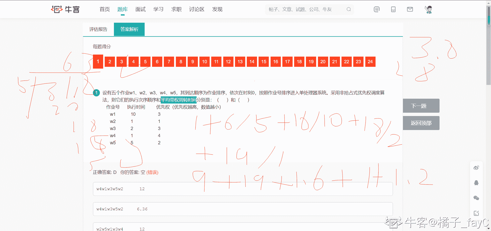

# 【2021】360 校招技术岗-客观题（Android）

## 1

设有五个作业 w1、w2、w3、w4、w5，其到达顺序为作业排序，依次在时刻 0，按照作业号排序进入单处理器系统。采用非抢占式优先权调度算法，则它们的执行次序顺序和平均带权周转时间分别是：（      ）和（      ）
   作业号      执行时间         优先权（优先权越高，数值越小）
      w1            10                  3
      w2            1                    1
      w3            2                    3
      w4            1                    4
      w5            5                    2

正确答案: D   你的答案: 空 (错误)

```cpp
w4w1w3w5w2      12
```

```cpp
w4w1w3w5w2     6.36
```

```cpp
w2w5w1w3w4      12
```

```cpp
w2w5w1w3w4     6.36
```

本题知识点

安卓工程师 360 公司 2021

讨论

[橘子 _fayC](https://www.nowcoder.com/profile/911254703)



发表于 2022-03-17 17:35:15

* * *

## 2

某系统有 4 个作业 T1、T2、T3 和 T4，当作业全部到达后，单道批处理系统开始采用响应比高者优先算法进行调度。4 个作业的作业号，到达时间和运行时间如下：
   作业号      到达时间         运行时间
       T1            8:50               1.5 小时
       T2            9:00                0.4 小时
       T3            9:30                1 小时
       T4            9:50               0.5 小时
则系统首先调度的作业是：（      ）。

正确答案: B   你的答案: 空 (错误)

```cpp
T1
```

```cpp
T2
```

```cpp
T3
```

```cpp
T4
```

本题知识点

安卓工程师 360 公司 2021

## 3

在一个多任务系统中多个进程并发执行时，各个进程应互斥进入其临界区，所谓临界区是指：（      ）。

正确答案: A   你的答案: 空 (错误)

```cpp
一段程序
```

```cpp
一段数据区
```

```cpp
一个缓冲区
```

```cpp
一种同步机制
```

本题知识点

安卓工程师 360 公司 2021

## 4

下列哪一种场景问题只包含进程互斥问题的是：（      ）。

正确答案: B   你的答案: 空 (错误)

```cpp
田径场的四百米接力比赛
```

```cpp
一个进程读文件，一个进程写文件
```

```cpp
两个进程通过一个缓冲区传递数据
```

```cpp
公共汽车上司机和售票员的工作配合
```

本题知识点

安卓工程师 360 公司 2021

## 5

在计算机系统拥有的各种软硬件资源中，内存是属于：（      ）。

正确答案: A   你的答案: 空 (错误)

```cpp
可重用资源
```

```cpp
不可重用资源
```

```cpp
临界资源
```

```cpp
独占资源
```

本题知识点

安卓工程师 360 公司 2021

## 6

下列描述的各种现象中，属于活锁现象的是：（      ）。

正确答案: D   你的答案: 空 (错误)

```cpp
相关进程进入阻塞状态，且无法唤醒
```

```cpp
相关进程进入阻塞状态，且可以唤醒
```

```cpp
相关进程没有阻塞，但是调度时刻被延迟推后
```

```cpp
相关进程没有被阻塞，可被调度，但是执行没有进展
```

本题知识点

安卓工程师 360 公司 2021

## 7

在下面的系统调用中，不会导致进程阻塞的是：（　）。

正确答案: B   你的答案: 空 (错误)

```cpp
读／写文件
```

```cpp
获得进程 PIDC
```

```cpp
申请内存
```

```cpp
发送消息
```

本题知识点

安卓工程师 360 公司 2021

## 8

下面关于临界区的叙述中正确的是：（　）。

正确答案: C   你的答案: 空 (错误)

```cpp
临界区可以允许规定数目的多个进程同时执行
```

```cpp
临界区只包含一个程序段
```

```cpp
临界区是必须互斥地执行的程序段
```

```cpp
临界区的执行不能被中断
```

本题知识点

安卓工程师 360 公司 2021

## 9

系统有 3 个并发进程共享变量 S，则与变量 S 相关的临界区有（      ）个。

正确答案: B   你的答案: 空 (错误)

```cpp
4
```

```cpp
3
```

```cpp
2
```

```cpp
1
```

本题知识点

安卓工程师 360 公司 2021

## 10

信号量 S 初值为 5，当前 S 值为-2 时，则当前阻塞进程数为（      ）。

正确答案: C   你的答案: 空 (错误)

```cpp
0
```

```cpp
1
```

```cpp
2
```

```cpp
3
```

本题知识点

安卓工程师 360 公司 2021

## 11

信号量可执行的操作是（      ）。

正确答案: A B C   你的答案: 空 (错误)

```cpp
P 操作
```

```cpp
V 操作
```

```cpp
初始化
```

```cpp
原子操作
```

本题知识点

安卓工程师 360 公司 2021

## 12

下列哪项是 V 原语操作的定义（      ）。

正确答案: C   你的答案: 空 (错误)

```cpp
当 S<0 时进程继续执行
```

```cpp
当 S<0 时唤醒一个就绪进程
```

```cpp
当 S≤0 时唤醒一个等待进程
```

```cpp
当 S≤0 时唤醒一个就绪进程
```

本题知识点

安卓工程师 360 公司 2021

## 13

在下面关于 Android 模拟器常见命令使用的描述正确的是（）？

正确答案: B   你的答案: 空 (错误)

```cpp
adb install tom.apk
是在模拟器卸载应用命令

```

```cpp
android list target
查询列出当前可用的 SDK 版本

```

```cpp
android list avd
查询 android 系统中已经安装的应用

```

```cpp
adb devices 用来删除模拟器
```

本题知识点

安卓工程师 360 公司 2021

## 14

下列（）与其他三项不属于同一分类？

正确答案: D   你的答案: 空 (错误)

```cpp
Frame Animation
```

```cpp
Tweened Animation
```

```cpp
Property Animation
```

```cpp
CA Animation
```

本题知识点

安卓工程师 360 公司 2021

## 15

对于 Android 项目结构，下列（）不包含在 res 文件夹下？

正确答案: D   你的答案: 空 (错误)

```cpp
menu
```

```cpp
raw
```

```cpp
layout
```

```cpp
assets
```

本题知识点

安卓工程师 360 公司 2021

## 16

开发时，使用（）文件夹存放布局文件？

正确答案: C   你的答案: 空 (错误)

```cpp
menu
```

```cpp
raw
```

```cpp
layout
```

```cpp
assets
```

本题知识点

安卓工程师 360 公司 2021

## 17

创建程序时，填写的 Application Name 是（）？

正确答案: A   你的答案: 空 (错误)

```cpp
类的名称
```

```cpp
项目名称
```

```cpp
应用名称
```

```cpp
项目的包
```

本题知识点

安卓工程师 360 公司 2021

## 18

adb 是在 Android 开发中经常使用的工具，其中从模拟器上拉取文件到本地电脑上使用的命令是（）

正确答案: C   你的答案: 空 (错误)

```cpp
adb get
```

```cpp
adb push
```

```cpp
adb pull
```

```cpp
adb down
```

本题知识点

安卓工程师 360 公司 2021

## 19

哪种布局允许子元素遮挡（      ）？

正确答案: D   你的答案: 空 (错误)

```cpp
LinearLayout
```

```cpp
AbsoluteLayout
```

```cpp
RelativeLayout
```

```cpp
FrameLayout
```

本题知识点

安卓工程师 360 公司 2021

## 20

构建拨号器界面时采用哪种布局方式最佳（      ）？

正确答案: B   你的答案: 空 (错误)

```cpp
LinearLayout
```

```cpp
TableLayout
```

```cpp
RelativeLayout
```

```cpp
FrameLayout
```

本题知识点

安卓工程师 360 公司 2021

## 21

下面使用 XML 文件访问图片资源正确的是（      ）？

正确答案: B   你的答案: 空 (错误)

```cpp
<ImageView
    android:layout_width="wrap_content"
    android:layout_height="wrap_content"
    android:id="id/image_view"
    android:src="@drawable/android"
    />

```

```cpp
<ImageView
    android:layout_width="wrap_content"
    android:layout_height="wrap_content"
    android:id="@+id/image_view"
    android:src="@drawable/android"
    />

```

```cpp
<ImageView
    android:layout_width="wrap_content"
    android:layout_height="wrap_content"
    android:id="@+id/image_view"
    android:background="@drawable/android"
    />

```

```cpp
<ImageView
    android:layout_width="wrap_content"
    android:layout_height="wrap_content"
    android:id="@+id/image_view"
    android:background="drawable/android"
    />

```

本题知识点

安卓工程师 360 公司 2021

## 22

从 SD 卡加载图片时，可以用 BitmapFactory 的（      ）方法？

正确答案: B   你的答案: 空 (错误)

```cpp
decodeResource()
```

```cpp
decodeFile()
```

```cpp
decodeStream()
```

```cpp
decodeByteArray()
```

本题知识点

安卓工程师 360 公司 2021

## 23

一次"发邮件"动作的标题、正文等保存在 Intent 的（      ）部分？

正确答案: D   你的答案: 空 (错误)

```cpp
action
```

```cpp
category
```

```cpp
data
```

```cpp
extra
```

本题知识点

安卓工程师 360 公司 2021

## 24

ContentProvider 类提供的方法不包括？

正确答案: A   你的答案: 空 (错误)

```cpp
clear()
```

```cpp
getType()
```

```cpp
insert()
```

```cpp
query()
```

本题知识点

安卓工程师 360 公司 2021