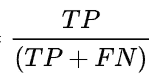

# 【2021】360 校招技术岗-客观题（算法岗）

## 1

下面关于 KNN 算法说法正确是（      ）。

正确答案: C   你的答案: 空 (错误)

```cpp
KNN 算法的时间复杂度是 O(n*k*t)，其中 k 为类别数，t 为迭代次数
```

```cpp
KNN 算法是一种非监督学习算法
```

```cpp
使用 KNN 算法进行训练时，训练数据集中含有标签
```

```cpp
K 值确定后，使用 KNN 算法进行样本训练时，每次所形成的结果可能不同
```

本题知识点

算法工程师 360 公司 2021

讨论

[被学习耽误的厨 shen](https://www.nowcoder.com/profile/936520334)

这个题目是说法不正确的吧

发表于 2021-09-25 10:56:53

* * *

[hideinbrush](https://www.nowcoder.com/profile/850340843)

KNN 是监督学习，K-means 是无监督学习，前者有 label，后者无，KNN 是 non- parameters model，举个例子，比如分类问题，KNN 会找出离预测点距离最近的 K 个点，（距离通常位欧氏距离，也有用曼哈顿距离的）对这 K 个点的 label 分类的进行统计，取占比最多的 label 作为分类预测值

发表于 2021-11-22 16:56:14

* * *

## 2

对于 K 类线性分类问题，下列哪种 SVM 分类策略可以避免“投票机制”（      ）。

正确答案: C   你的答案: 空 (错误)

```cpp
一对其余
```

```cpp
一对一
```

```cpp
逐步二分类
```

```cpp
直接多类 SVM 分类
```

本题知识点

算法工程师 360 公司 2021

## 3

下列哪种算法是将一组可能存在相关性变量的观测值转换为一组线性不相关的变量值（）。

正确答案: C   你的答案: 空 (错误)

```cpp
奇异值分解
```

```cpp
独立成分分析
```

```cpp
主成分分析
```

```cpp
朴素贝叶斯
```

本题知识点

算法工程师 360 公司 2021

讨论

[hideinbrush](https://www.nowcoder.com/profile/850340843)

在多元统计分析中，**主成分分析**（英语：**Principal components analysis**，**PCA**）是一种统计分析、简化数据集的方法。它利用[正交变换](https://zh.wikipedia.org/wiki/%E6%AD%A3%E4%BA%A4%E5%8F%98%E6%8D%A2)来对一系列可能相关的变量的观测值进行线性变换，从而投影为一系列线性不相关变量的值，这些不相关变量称为主成分（Principal Components）。具体地，主成分可以看做一个线性方程，其包含一系列线性系数来指示投影方向。PCA 对原始数据的正则化或预处理敏感（相对缩放）。from wikipedia

发表于 2021-11-22 16:58:43

* * *

## 4

下列哪种情况不能用朴素贝叶斯分类器（）。

正确答案: D   你的答案: 空 (错误)

```cpp
训练数据集较大
```

```cpp
实例具有几个属性
```

```cpp
给定分类参数，描述实例的属性应该是条件独立的
```

```cpp
要求有较高的分类精度
```

本题知识点

算法工程师 360 公司 2021

讨论

[正蜀黍](https://www.nowcoder.com/profile/128429115)

理论上，朴素贝叶斯模型与其他分类方法相比具有最小的误差率。但是实际上并非总是如此，这是因为朴素贝叶斯模型假设属性之间相互独立，这个假设在实际应用中往往是不成立的，在属性个数比较多或者属性之间相关性较大时，分类效果不好。而在属性相关性较小时，朴素贝叶斯性能最为良好。对于这一点，有半朴素贝叶斯之类的算法通过考虑部分关联性适度改进。

发表于 2021-06-08 20:20:57

* * *

## 5

下列哪种算法不属于判别式模型的范畴（）。

正确答案: D   你的答案: 空 (错误)

```cpp
决策树
```

```cpp
BP 神经网络
```

```cpp
支持向量机
```

```cpp
随机森林
```

本题知识点

算法工程师 360 公司 2021

讨论

[正蜀黍](https://www.nowcoder.com/profile/128429115)


发表于 2021-06-08 20:22:25

* * *

[254834](https://www.nowcoder.com/profile/8044149)

题目是不是错了啊，随机森林不也是判别式的吗

发表于 2021-09-22 15:49:54

* * *

## 6

朴素贝叶斯分类器的训练过程是基于训练集 D 来估计（）。

正确答案: A   你的答案: 空 (错误)

```cpp
先验概率
```

```cpp
后验概率
```

```cpp
概率分布函数
```

```cpp
概率密度函数
```

本题知识点

算法工程师 360 公司 2021

讨论

[正蜀黍](https://www.nowcoder.com/profile/128429115)

朴素贝叶斯分类器的目标是通过训练数据集学习联合概率分布用来预测先验概率。具体是先学习到先验概率分布以及条件概率分布。 先验概率是指根据以往经验和分析得到的概率,如全概率公式,它往往作为"由因求果"问题中的"因"出现.

后验概率是指依据得到"结果"信息所计算出的最有可能是那种事件发生,如贝叶斯公式中的,是"执果寻因"问题中的"因". 

发表于 2021-06-08 20:26:24

* * *

## 7

下列算法中哪种不包括降维的思想（）。

正确答案: D   你的答案: 空 (错误)

```cpp
主成分分析法
```

```cpp
线性判别分析
```

```cpp
拉普拉斯特征映射
```

```cpp
极大似然估计法
```

本题知识点

算法工程师 360 公司 2021

讨论

[正蜀黍](https://www.nowcoder.com/profile/128429115)

常见的降维算法包括：主成分分析（PCA）、奇异值分解（SVD）和线性判别分析（LDA）。拉普拉斯特征映射属于流形降维方法的一种。极大似然估计提供了一种给定观察数据来评估模型参数的方法，即：“模型已定，参数未知”。不属于降维方法 

发表于 2021-06-08 20:29:59

* * *

## 8

在数据降维的方法中哪一项是线性的（）。

正确答案: C   你的答案: 空 (错误)

```cpp
LLE
```

```cpp
KPCA
```

```cpp
LDA
```

```cpp
ISOMAP
```

本题知识点

算法工程师 360 公司 2021

讨论

[正蜀黍](https://www.nowcoder.com/profile/128429115)

KPCA：kernel PCA 核主成分分析 LLE：流形学习 LDA：线性判别分析 ISOMAP：等度量映射

发表于 2021-06-08 20:33:44

* * *

## 9

C4.5 是在 ID3 算法的基础上进行的改进，C4.5 在改进方面的说法错误的是（）。

正确答案: A   你的答案: 空 (错误)

```cpp
用信息增益来选择属性
```

```cpp
在决策树构造过程中进行剪枝
```

```cpp
能够完成对连续属性的离散化处理
```

```cpp
能够对不完整数据进行处理
```

本题知识点

算法工程师 360 公司 2021

讨论

[正蜀黍](https://www.nowcoder.com/profile/128429115)

C4.5 的改进之处：

1.  通过信息增益率选择属性
2.  处理连续型数据的属性
3.  能够进行剪枝操作
4.  能够对空缺值进行处理

注意 1 中说的是信息**增益率**

发表于 2021-06-08 20:38:20

* * *

## 10

CART 算法由决策树生成和决策树剪枝两部分组成，下列关于 CART 和 ID3 算法的区别说法错误的是（）。

正确答案: C   你的答案: 空 (错误)

```cpp
选择变量的度量不同
```

```cpp
对于连续的目标变量的处理方式不同
```

```cpp
对不完整数据的处理方式不同
```

```cpp
对两个以上类别的标称目标变量不同
```

本题知识点

算法工程师 360 公司 2021

讨论

[正蜀黍](https://www.nowcoder.com/profile/128429115)

ID3，C4.5 和 CART 的区别：1.ID3 算法：
以信息增益为准则选择信息增益最大的属性。
缺点：1）信息增益对可取值数目较多的属性有所偏好，比如通过 ID 号可将每个样本分成一类，但是没有意义。2）ID3 只能对离散属性的数据集构造决策树。
鉴于以上缺点，后来出现了 C4.5 算法。2\. C4.5 算法：
以信息增益率为准则选择属性；在信息增益的基础上对属性有一个惩罚，抑制可取值较多的属性，增强泛化性能。
其他优点：1）在树的构造过程中可以进行剪枝，缓解过拟合；2）能够对连续属性进行离散化处理（二分法）；3）能够对缺失值进行处理；
缺点：构造树的过程需要对数据集进行多次顺序扫描和排序，导致算法低效；
刚才我们提到 信息增益对可取值数目较多的属性有所偏好；而信息增益率对可取值数目较少的属性有所偏好！OK，两者结合一下就好了！3.CART 算法（Classification and Regression Tree）：
顾名思义，可以进行分类和回归，可以处理离散属性，也可以处理连续的。
分类树使用 GINI 指数来选择划分属性：在所有候选属性中，选择划分后 GINI 指数最小的属性作为优先划分属性。回归树就用最小平方差。

发表于 2021-06-08 20:41:15

* * *

## 11

现有如下四个句子：S1 我回到家；S2 他站起身来；S3 南京市长江大桥；S4 他起身去北京。以上句子中，有以下哪些歧义现象（       ）。

正确答案: A C   你的答案: 空 (错误)

```cpp
交集型歧义
```

```cpp
模糊歧义
```

```cpp
组合歧义
```

```cpp
匹配歧义
```

本题知识点

算法工程师 360 公司 2021

## 12

大多数机器学习算法不能识别类别数据，要求数据必须是数值型的。以性别特征为例，性别特征具有两个选项：男或女，机器学习模型搞不懂何为“男 、女”，但清楚何为“1、0”。因此在数据预处理时，需要将“男、女”对“1、0”进行映射，即 sex∈(0,1)。请问该种数据预处理方法的名称是 （       ）。

正确答案: B   你的答案: 空 (错误)

```cpp
变量代换
```

```cpp
离散化
```

```cpp
聚集
```

```cpp
估计遗漏值
```

本题知识点

算法工程师 360 公司 2021

## 13

现拥有 N 篇不同领域的英文文献，需要利用自然语言处理的方法分析文献内容，以确定其是否为计算机领域的文献，请问该问题可转化为以下哪种分类问题（       ）。

正确答案: B   你的答案: 空 (错误)

```cpp
多类分类
```

```cpp
二类分类
```

```cpp
三类分类
```

```cpp
多标签分类
```

本题知识点

算法工程师 360 公司 2021

## 14

文本分类中，从含有兼类可分为（       ）。

正确答案: A C   你的答案: 空 (错误)

```cpp
多标签分类方法
```

```cpp
多类分类
```

```cpp
单标签分类
```

```cpp
二类分类
```

本题知识点

算法工程师 360 公司 2021

讨论

[零葬](https://www.nowcoder.com/profile/75718849)

无论是多分类还是二分类，其实都是单标签分类，即一个样本只能被归为一类，如果含有兼类则说明是个多标签分类问题（如一个电影可以属于动作片也可以属于惊悚片），根据有无兼类可以将分类问题分为多标签分类和单标签分类。

发表于 2021-07-13 20:14:20

* * *

## 15

存在两种文本分类算法——A 和 B，对于同一组样本数据，A 和 B 识别出了同样数量的正类数据，但 A 比 B 识别出了更多的正确的正类数据，则针对两种算法的查准率 P 和查全率 R，以下说法正确（       ）。

正确答案: A B   你的答案: 空 (错误)

```cpp
P(A)>P(B)
```

```cpp
R(A)>R(B)
```

```cpp
P(A)<P(B)
```

```cpp
R(A)<R(B)
```

本题知识点

算法工程师 360 公司 2021

讨论

[零葬](https://www.nowcoder.com/profile/75718849)

A 抓出来的正确正例数更多，显然 recall 更高。同时，在两种方法都预测出了相同数量正样本的情况下，A 的正确正例数仍然更多，根据混淆矩阵可知 A 的 precision 也是更高的。

发表于 2021-07-13 13:20:49

* * *

[正蜀黍](https://www.nowcoder.com/profile/128429115)


查准率                                                                                  
查全率：                                                                                  一般来说，查全查准不可兼得，除非在一些简单任务中。
很好理解，做出正预测多，查全率必然上升，但查准率就要下降。
反之，尽量少预测，查准率必然高，但是查全率要低很多。

发表于 2021-06-08 20:45:11

* * *

## 16

现有如下三个句子：S1 我喜欢看电视，不喜欢看电影；S2 我不喜欢看电视，也不喜欢看电影；S3 我喜欢看电视，也喜欢看电影。分词词典中有如下词组：我，喜欢，看，电视，电影，不，也。采用 TF-IDF 算法计算词权值，利用 Manhattan distance 分别计算 S1 与 S2 的相似度 C1，S1 与 S3 的相似度 C2，S2 与 S3 的相似度 C3。关于 C1，C2，C3，以下哪种说法是正确的（       ）。

正确答案: A   你的答案: 空 (错误)

```cpp
C1=C2=C3
```

```cpp
C2<C1<C3
```

```cpp
C3<C2<C1
```

```cpp
C3<C1<C2
```

本题知识点

算法工程师 360 公司 2021

## 17

下列对 k-means 聚类算法解释不正确的是。

正确答案: C   你的答案: 空 (错误)

```cpp
K-Means 作为无监督的聚类算法
```

```cpp
曼哈顿距离常用其中心距离的度量
```

```cpp
能自动识别类的个数,随即挑选初始点为中心点计算
```

```cpp
不能自动识别类的个数,不是随即挑选初始点为中心点计算
```

本题知识点

算法工程师 360 公司 2021

讨论

[正蜀黍](https://www.nowcoder.com/profile/128429115)

K-means 算法的基本思想是：以空间中 k 个点为中心进行聚类，对最靠近他们的对象归类。通过迭代的方法，逐次更新各聚类中心的值，直至得到最好的聚类结果。

假设要把样本集分为 k 个类别，算法描述如下：

（1）适当选择 k 个类的初始中心，最初一般为**随机选取；**

（2）在每次迭代中，对任意一个样本，分别求其到 k 个中心的欧式距离，将该样本归到距离最短的中心所在的类；

（3）利用均值方法更新该 k 个类的中心的值；

（4）对于所有的 k 个聚类中心，重复（2）（3），类的中心值的移动距离满足一定条件时，则迭代结束，完成分类。

Kmeans 聚类算法原理简单，效果也依赖于 k 值和类中初始点的选择。

发表于 2021-06-08 20:48:15

* * *

## 18

自然语言处理中的情感分析技术在社交内容分析和电商评论反馈中都占有很高的应用价值，常用于情感分析的方法有。

正确答案: D   你的答案: 空 (错误)

```cpp
基于情感词典的方法
```

```cpp
基于机器学习的方法
```

```cpp
基于深度学习的方法
```

```cpp
A、B、C 以上都是
```

本题知识点

算法工程师 360 公司 2021

讨论

[晓瑜](https://www.nowcoder.com/profile/89300739)

D

发表于 2021-05-17 15:03:15

* * *

## 19

音字转换技术是指由计算机自动地将拼音串转换为汉字串，常用的音字转换技术是。 正确答案: D   你的答案: 空 (错误)

```cpp
基于统计知识的方法
```

```cpp
基于模板匹配的方法
```

```cpp
基于上下文关联的方法
```

```cpp
A、B、C 以上都是
```

本题知识点

算法工程师 360 公司 2021

## 20

在深度学习的手写汉字识别方面，能对单字符识别且含序列信息的手写文本行识别，解决诸如包含时序先后顺序信息的文字行识别问题的识别方法是。

正确答案: D   你的答案: 空 (错误)

```cpp
基于 CNN 的端到端的识别方法
```

```cpp
结合领域知识的 CNN 识别方法
```

```cpp
基于 R-CNN 识别方法
```

```cpp
基于 RNN/LSTM 的文本行识别方法
```

本题知识点

算法工程师 360 公司 2021

## 21

下列常用梯度算子模板，哪个算子为 2×2 模板（      ）。

正确答案: C   你的答案: 空 (错误)

```cpp
拉普拉斯算子
```

```cpp
索贝尔算子
```

```cpp
罗伯特交叉算子
```

```cpp
LoG 算子
```

本题知识点

算法工程师 360 公司 2021

讨论

[正蜀黍](https://www.nowcoder.com/profile/128429115)


发表于 2021-06-08 20:50:40

* * *

## 22

下列说法中红，哪些是 LoG 算子的特点（      ）。

正确答案: A B   你的答案: 空 (错误)

```cpp
对图像灰度变化敏感
```

```cpp
边缘定位精度较差
```

```cpp
在边缘检测时仅考虑具有局部梯度最小值的点为边缘点
```

```cpp
对噪声具有平滑作用
```

本题知识点

算法工程师 360 公司 2021

## 23

下列关于图像噪声的说法错误的是（）。

正确答案: D   你的答案: 空 (错误)

```cpp
图像的噪声是在获取、存储、处理、传输的过程中产生的
```

```cpp
噪声在图像中的分布具有随机性
```

```cpp
噪声具有叠加性
```

```cpp
噪声的产生与图像无关
```

本题知识点

算法工程师 360 公司 2021

## 24

去除图像中的噪声能够达到增强图像的效果，下列方法中哪项不是图像平滑方法（）。

正确答案: D   你的答案: 空 (错误)

```cpp
模板卷积
```

```cpp
领域平均法
```

```cpp
中值滤波
```

```cpp
灰度变换法
```

本题知识点

算法工程师 360 公司 2021

## 25

在图像处理中，距离是描述图像的重要特征，衡量对点之间在不同维度上的最大距离用下列哪种测量方法（）。

正确答案: D   你的答案: 空 (错误)

```cpp
Euclidean
```

```cpp
Manhattan
```

```cpp
 Canberra
```

```cpp
 Chebychev
```

本题知识点

算法工程师 360 公司 2021

讨论

[正蜀黍](https://www.nowcoder.com/profile/128429115)

Euclidean：欧拉距离 Manhattan：曼哈顿距离 Canberra：堪培拉距离 Chebychev：切比雪夫距离 1.欧拉距离欧式距离可解释为连接两个点的线段的长度2.曼哈顿距离曼哈顿距离通常称为出租车距离或城市街区距离，用来计算实值向量之间的距离3.堪培拉距离被认为是曼哈顿距离的加权版本 4.切比雪夫距离切比雪夫距离定义为**两个向量在任意坐标维度上的最大差值**。

发表于 2021-06-08 21:00:47

* * *

## 26

在图像处理中，面积是描述图像的重要特征，下列测量面积的方法中错误的是（）。

正确答案: B   你的答案: 空 (错误)

```cpp
利用像素计算面积
```

```cpp
利用周长计算面积
```

```cpp
利用边界行程码计算面积
```

```cpp
利用边界坐标计算面积
```

本题知识点

算法工程师 360 公司 2021

## 27

下列彩色模型中属于面向硬件设备的是 _______。

正确答案: B C   你的答案: 空 (错误)

```cpp
HSI
```

```cpp
CMYK
```

```cpp
RGB
```

```cpp
HSV
```

本题知识点

算法工程师 360 公司 2021

讨论

[正蜀黍](https://www.nowcoder.com/profile/128429115)

一、面向硬件设备的彩色模型 RGB、CMYK、YCrCb 二、面向视觉感知的彩色模型 HSI、HSV、HSB

发表于 2021-06-08 21:03:30

* * *

## 28

数字图像化过程包括哪些步骤 ______。

正确答案: A B D   你的答案: 空 (错误)

```cpp
采样
```

```cpp
扫描
```

```cpp
变换
```

```cpp
量化
```

本题知识点

算法工程师 360 公司 2021

## 29

线性规划中有三个约束添加，若再增加两个约束条件，可行域的 范围将会（  ）。

正确答案: D   你的答案: 空 (错误)

```cpp
缩小
```

```cpp
变大
```

```cpp
不变
```

```cpp
缩小或不变
```

本题知识点

算法工程师 360 公司 2021

## 30

为了加强 A 村与 B 村的联系，需要修建一条公路，为了从 A 村尽快到达 B 村，应建立（  ）模型。

正确答案: B   你的答案: 空 (错误)

```cpp
树的逐步生成法
```

```cpp
求最短路线法
```

```cpp
求最大流量法
```

```cpp
求最小技校树法
```

本题知识点

算法工程师 360 公司 2021

## 31

若线性规划问题没有可行解，可行解集是空集，则此问题（ ）。

正确答案: A   你的答案: 空 (错误)

```cpp
没有最优解
```

```cpp
没有无穷多最优解 
```

```cpp
有无界解
```

```cpp
没有无界解
```

本题知识点

算法工程师 360 公司 2021

讨论

[正蜀黍](https://www.nowcoder.com/profile/128429115)

可行域为空集则此问题不存在可行解，当然也就没有最优解。

发表于 2021-06-08 21:05:20

* * *

## 32

运输问题是线性规划问题，其初始方案中没有分配运量的格所对应的变量为（）。

正确答案: D   你的答案: 空 (错误)

```cpp
松弛变量
```

```cpp
剩余变量
```

```cpp
基变量
```

```cpp
非基变量
```

本题知识点

算法工程师 360 公司 2021

## 33

关于原问题和对偶问题，下列说法正确的是（） 。

正确答案: D   你的答案: 空 (错误)

```cpp
若原问题有可行解，则对偶问题有可行解
```

```cpp
若原问题无可行解，则对偶问题也一定无可行解
```

```cpp
若原问题有最优解，则对偶问题不一定有最优解
```

```cpp
若原问题与对偶问题均存在可行解，则两者均存在最优解
```

本题知识点

算法工程师 360 公司 2021

## 34

关于运筹学中数学模型的缺点下列说法错误的是（）。

正确答案: A   你的答案: 空 (错误)

```cpp
通过模型可以为所要考虑的问题直接计算出结果。
```

```cpp
模型可能过分简化,因而不能正确反映实际情况
```

```cpp
模型受设计人员的水平的限制,模型无法超越设计人员对问题的理解。
```

```cpp
构建模型有时需要付出较高的代价
```

本题知识点

算法工程师 360 公司 2021

## 35

在运输问题中，计算检验数的方法有（）。

正确答案: A D   你的答案: 空 (错误)

```cpp
闭回路法
```

```cpp
海斯算法
```

```cpp
福德算法
```

```cpp
位势法
```

本题知识点

算法工程师 360 公司 2021

## 36

在单纯形法中，初始基由（）构成 。

正确答案: B C D   你的答案: 空 (错误)

```cpp
自变量
```

```cpp
决策变量
```

```cpp
松弛变量
```

```cpp
人工变量
```

本题知识点

算法工程师 360 公司 2021

## 37

已知 P(A)=3/4,P(AB)=1/4,则 P(B|A)=（      ）。

正确答案: B   你的答案: 空 (错误)

```cpp
1/2
```

```cpp
1/3
```

```cpp
2/5
```

```cpp
3/5
```

本题知识点

算法工程师 360 公司 2021

讨论

[正蜀黍](https://www.nowcoder.com/profile/128429115)

P(B|A) = P(AB)/P（A）

发表于 2021-06-08 21:07:59

* * *

## 38

袋子中有 7 个白球，3 个红球，从中不放回地取出 2 个球，则第二次取到红球的概率为（      ）。

正确答案: C   你的答案: 空 (错误)

```cpp
7/10
```

```cpp
3/10
```

```cpp
26/90
```

```cpp
 64/90
```

本题知识点

算法工程师 360 公司 2021

讨论

[牛客 756295169 号](https://www.nowcoder.com/profile/756295169)

这题答案没问题？

发表于 2021-06-01 10:37:41

* * *

[MJ_92377](https://www.nowcoder.com/profile/839241768)

这题不是 B 吗

发表于 2021-10-09 05:03:18

* * *

[浪小白](https://www.nowcoder.com/profile/627725994)

分子是 27 吧

发表于 2021-07-17 15:33:48

* * *

## 39

关于析构函数，下列说法正确的是（           ）？

正确答案: A B   你的答案: 空 (错误)

```cpp
析构函数的名字为 __del__
```

```cpp
在对象被销毁时，析构函数自动调用
```

```cpp
析构函数需要手动调用
```

```cpp
析构函数的格式是固定的，不能够修改代码
```

本题知识点

算法工程师 360 公司 2021