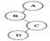
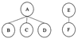

# 【2021】360 校招技术岗-客观题（Windows）

## 1

下列关于链栈的说法，正确的一项是（）。

正确答案: B   你的答案: 空 (错误)

```cpp
与顺序栈相比，链栈的优点是不会出现栈空的情况
```

```cpp
与顺序栈相比，链栈的优点是不会出现栈满的情况
```

```cpp
链栈的插入操作与删除操作只能在栈底进行
```

```cpp
链栈的插入操作与删除操作可以在栈的任意位置进行
```

本题知识点

iOS 工程师 360 公司 2021 Java 工程师 C++工程师 PHP 工程师 golang 工程师 前端工程师 安卓工程师 算法工程师 大数据开发工程师 信息技术岗 运维工程师 安全工程师 数据分析师 数据库工程师 游戏研发工程师 区块链 测试开发工程师 测试工程师

讨论

[猿途](https://www.nowcoder.com/profile/4670762)

关于链栈、链队

链栈由不带头节点的单链表实现，插入删除都在栈顶（或表头）进行；

链队由带队首、队尾指针的非循环单链表实现；

在内存无限大的情况下，二者均无满溢出的问题，所以进栈、入队时不必判断溢出问题；但是顺序存储时，进栈、入队都要先判断是否栈满、队满。

发表于 2021-06-23 09:51:01

* * *

## 2

若用长度为 N 的一位数组 array 来实现双端栈，两个栈的栈顶位置 （）。

正确答案: D   你的答案: 空 (错误)

```cpp
固定不变，均在 array[0]处
```

```cpp
固定不变，均在 array[N-1]处
```

```cpp
固定不变，一个在 array[0]处，另一个在 array[N-1]处
```

```cpp
随着数据元素的入栈、出栈而变化
```

本题知识点

iOS 工程师 360 公司 2021 Java 工程师 C++工程师 PHP 工程师 golang 工程师 前端工程师 安卓工程师 算法工程师 大数据开发工程师 信息技术岗 运维工程师 安全工程师 数据分析师 数据库工程师 游戏研发工程师 区块链 测试开发工程师 测试工程师

讨论

[Jiang 锋](https://www.nowcoder.com/profile/961788916)

数组的两端是栈底元素, 向栈中添加元素时栈顶元素会相互靠近. 当栈顶元素的坐标差为 1 时, 表示栈满

发表于 2021-06-03 13:55:04

* * *

[猿途](https://www.nowcoder.com/profile/4670762)

一点扩展知识：双端队列（1）输出受限：两端输入、仅一端能输出；（2）输入受限：两端输出、仅一端能输入；

发表于 2021-06-23 10:13:10

* * *

## 3

下列关于顺序存储的循环队列的说法，正确的一项是（）。

正确答案: D   你的答案: 空 (错误)

```cpp
在直接使用顺序存储的循环队列时，仍存在类似于使用顺序队列时存在的“假溢出”问题
```

```cpp
在直接使用顺序存储的循环队列时，若有队头指针与队尾指针指向同一单元，则此时队列为空
```

```cpp
在直接使用顺序存储的循环队列时，若有队头指针与队尾指针指向同一单元，则此时队列为满
```

```cpp
在直接使用顺序存储的循环队列时，队头指针与队尾指针的逻辑循环均可使用取模运算来实现
```

本题知识点

iOS 工程师 360 公司 2021 Java 工程师 C++工程师 PHP 工程师 golang 工程师 前端工程师 安卓工程师 算法工程师 大数据开发工程师 信息技术岗 运维工程师 安全工程师 数据分析师 数据库工程师 游戏研发工程师 区块链 测试开发工程师 测试工程师

讨论

[己烷](https://www.nowcoder.com/profile/47198062)

 在顺序队列操作中，假溢出的现象为：当元素被插入到数组中下标最大的位置上之后，队列的空间就用尽了，尽管此时数组的低端还有空闲空间。

解决：将存储队列的数组头尾相接，形成循环队列。队头、队尾指针加 1 时用语言的取模(余数)运算实现。

所以 A 错。在这种循环队列中，队列满时，front 与 tail 也是相等的。所以 BC 错。

发表于 2022-03-19 12:09:17

* * *

## 4

设有一个大小为 6 的顺序循环队列，采用少用一个存储单元的策略来区分队满与队空。若当前 front=2，rear=5，则最多还可入队的元素个数是（）。

正确答案: B   你的答案: 空 (错误)

```cpp
0
```

```cpp
2
```

```cpp
4
```

```cpp
5
```

本题知识点

iOS 工程师 360 公司 2021 Java 工程师 C++工程师 PHP 工程师 golang 工程师 前端工程师 安卓工程师 算法工程师 大数据开发工程师 信息技术岗 运维工程师 安全工程师 数据分析师 数据库工程师 游戏研发工程师 区块链 测试开发工程师 测试工程师

## 5

将上图所示的二叉树转换为树，正确的一项是（）。

正确答案: B   你的答案: 空 (错误)

本题知识点

iOS 工程师 360 公司 2021 Java 工程师 C++工程师 PHP 工程师 golang 工程师 前端工程师 安卓工程师 算法工程师 大数据开发工程师 信息技术岗 运维工程师 安全工程师 数据分析师 数据库工程师 游戏研发工程师 区块链 测试开发工程师 测试工程师

讨论

[牛客 148459582 号](https://www.nowcoder.com/profile/148459582)

我喜欢这样看，左孩子都是上下关系，右孩子都是平行关系。这样就好变换二叉树和树了

发表于 2021-08-26 09:17:30

* * *

## 6

将上图所示的森林转换为二叉树，正确的一项是（）。

正确答案: C   你的答案: 空 (错误)

本题知识点

iOS 工程师 360 公司 2021 Java 工程师 C++工程师 PHP 工程师 golang 工程师 前端工程师 安卓工程师 算法工程师 大数据开发工程师 信息技术岗 运维工程师 安全工程师 数据分析师 数据库工程师 游戏研发工程师 区块链 测试开发工程师 测试工程师

## 7

下列各种排序算法中，具有稳定性且空间复杂度为 O(1)的是（）。

正确答案: A   你的答案: 空 (错误)

```cpp
直接插入排序法
```

```cpp
希尔排序法
```

```cpp
选择排序法
```

```cpp
 归并排序法
```

本题知识点

iOS 工程师 360 公司 2021 Java 工程师 C++工程师 PHP 工程师 golang 工程师 前端工程师 安卓工程师 算法工程师 大数据开发工程师 信息技术岗 运维工程师 安全工程师 数据分析师 数据库工程师 游戏研发工程师 区块链 测试开发工程师 测试工程师

讨论

[猿途](https://www.nowcoder.com/profile/4670762)

记得当年天勤有两句总结：第一句关于稳定性：情绪不稳定，快些选一堆好友聊天吧。其中“快”--快排；“些”--谐音希，希尔排序；“选”--简单选择排序；“堆”--堆排序，这四种不稳定，其他都稳定。第二句时间复杂度：快些以 nlogn 的速度归队。“快”--快排；“些”--谐音希，希尔排序；“归”--二路归并排序；“队”--谐音堆，堆排序，这 4 种平均复杂度为 O(nlogn)，其它都是 O(n²)。关于空间复杂度：有两个比较特殊：快排（O(logn)），归并排序（O(n)），其他都是 O(1)。

发表于 2021-06-23 10:30:55

* * *

## 8

下列各种排序算法中，空间复杂度最差的是（）。

正确答案: D   你的答案: 空 (错误)

```cpp
直接插入排序法
```

```cpp
希尔排序法
```

```cpp
选择排序法
```

```cpp
归并排序法
```

本题知识点

iOS 工程师 360 公司 2021 Java 工程师 C++工程师 PHP 工程师 golang 工程师 前端工程师 安卓工程师 算法工程师 大数据开发工程师 信息技术岗 运维工程师 安全工程师 数据分析师 数据库工程师 游戏研发工程师 区块链 测试开发工程师 测试工程师

## 9

在一个具有 n 个顶点的有向图中，若所有顶点的出度之和为 s，则所有顶点的入度之和为（      ）。

正确答案: B   你的答案: 空 (错误)

```cpp
s-1
```

```cpp
s
```

```cpp
s+1
```

```cpp
n
```

本题知识点

iOS 工程师 360 公司 2021 Java 工程师 C++工程师 PHP 工程师 golang 工程师 前端工程师 安卓工程师 算法工程师 大数据开发工程师 信息技术岗 运维工程师 安全工程师 数据分析师 数据库工程师 游戏研发工程师 区块链 测试开发工程师 测试工程师

## 10

在下列有关图的说法中正确的是（      ）。

正确答案: B   你的答案: 空 (错误)

```cpp
在图结构中，顶点可以没有任何前趋和后继
```

```cpp
在有向图中，各顶点的入度之和等于各顶点的出度之和
```

```cpp
具有 n 个顶点的无向图最多有 n(n-1)条边，最少有(n-1)条边
```

```cpp
在无向图中，边的条数是结点度数之和
```

本题知识点

iOS 工程师 360 公司 2021 Java 工程师 C++工程师 PHP 工程师 golang 工程师 前端工程师 安卓工程师 算法工程师 大数据开发工程师 信息技术岗 运维工程师 安全工程师 数据分析师 数据库工程师 游戏研发工程师 区块链 测试开发工程师 测试工程师

## 11

下列关于 DFA 叙述错误的是（      ）。

正确答案: D   你的答案: 空 (错误)

```cpp
DFA 仅有一个起始状态
```

```cpp
DFA 一个输入符号只能得到唯一一个可能的状态
```

```cpp
DFA 没有输入空串之上的转换动作
```

```cpp
DFA 映射会产生一个状态集合
```

本题知识点

iOS 工程师 360 公司 2021 Java 工程师 C++工程师 PHP 工程师 golang 工程师 前端工程师 安卓工程师 算法工程师 大数据开发工程师 信息技术岗 运维工程师 安全工程师 数据分析师 数据库工程师 游戏研发工程师 区块链 测试开发工程师 测试工程师

## 12

下列有关文法说法错误的是（      ）。

正确答案: C   你的答案: 空 (错误)

```cpp
从一个句型到另一个句型的推导过程是唯一的
```

```cpp
若文法 G 的一个句子对应于多个推导，则 G 是二义的
```

```cpp
一个正规语言可能对应多个正规文法
```

```cpp
二义文法不是上下文无关文法
```

本题知识点

iOS 工程师 360 公司 2021 Java 工程师 C++工程师 PHP 工程师 golang 工程师 前端工程师 安卓工程师 算法工程师 大数据开发工程师 信息技术岗 运维工程师 安全工程师 数据分析师 数据库工程师 游戏研发工程师 区块链 测试开发工程师 测试工程师

## 13

自上而下的语法分析方法具有哪些特点（      ）。

正确答案: A D   你的答案: 空 (错误)

```cpp
从文法起始符号开始语法分析
```

```cpp
反向使用文法规则
```

```cpp
分析过程的主要操作是归约
```

```cpp
 分析过程的主要操作是推导
```

本题知识点

iOS 工程师 360 公司 2021 Java 工程师 C++工程师 PHP 工程师 golang 工程师 前端工程师 安卓工程师 算法工程师 大数据开发工程师 信息技术岗 运维工程师 安全工程师 数据分析师 数据库工程师 游戏研发工程师 区块链 测试开发工程师 测试工程师

## 14

适用于静态存储分配的语言应满足下列哪些条件（      ）。

正确答案: A B C   你的答案: 空 (错误)

```cpp
数组上下界必须为常数
```

```cpp
过程调用不允许递归
```

```cpp
不允许采用动态数据结构
```

```cpp
过程定义不允许嵌套，但允许过程的递归调用
```

本题知识点

iOS 工程师 360 公司 2021 Java 工程师 C++工程师 PHP 工程师 golang 工程师 前端工程师 安卓工程师 算法工程师 大数据开发工程师 信息技术岗 运维工程师 安全工程师 数据分析师 数据库工程师 游戏研发工程师 区块链 测试开发工程师 测试工程师

## 15

张华为辉灿连锁便利设计了后台数据库系统，随着店面增多、经营规模扩大、聘用员工增多，系统的访问频率增高，用户访问时常出现拥堵现象。如何提高系统的响应性能?以下说法正确的是：（      ）。

正确答案: B D   你的答案: 空 (错误)

```cpp
找出因拥堵而受影响的进程并调整其事务隔离级别。
```

```cpp
访问拥堵很有可能是系统资源未合理分配而造成的进程相互等待资源的死锁状态。借助系统存储过程查找到相关信息。
```

```cpp
首要任务是确定哪些资源是竞争资源，由哪些进程申请调用而产生的访问拥堵现象。
```

```cpp
用 sp_lock 和 sp_who 系统存储过程找出锁的资源和占用锁的进程。用这些信息来识别和重设引起锁的事务
```

本题知识点

iOS 工程师 360 公司 2021 Java 工程师 C++工程师 PHP 工程师 golang 工程师 前端工程师 安卓工程师 算法工程师 大数据开发工程师 信息技术岗 运维工程师 安全工程师 数据分析师 数据库工程师 游戏研发工程师 区块链 测试开发工程师 测试工程师

## 16

随着 4G 网络的普及，智能手机的推广，手机使用者的数量越来越高。作为大型运营商的后台数据库开发团队的一员，当数据库内容被频繁更新时，首要解决的问题就是存储空间的问题。数据库创立时初始大小为 2G,现在 D 盘下有 10G 的空闲区。以下脚本语言，可以用来创建新数据库的代码是：（      ）。

正确答案: B C   你的答案: 空 (错误)

```cpp
"CREATE DATABASE CC ON (NAME = CC_dat,FILENAME = ‘D:\CC_dat.mdf’,MAXSIZE = 2GB)"
```

```cpp
"CREATE DATABASE CC ON (NAME = CC_dat,FILENAME = ‘D:\CC_dat.mdf’,SIZE = 2GB)"
```

```cpp
"CREATE DATABASE CC ON (NAME = CC_dat,FILENAME = ‘D:\CC_dat.mdf’,SIZE = 2GB，MAXSIZE=10G)"
```

```cpp
 "CREATE DATABASE CC ON (NAME = CC_dat,FILENAME = ‘D:\CC_dat.ldf’,SIZE = 2GB，MAXSIZE=10G)"
```

本题知识点

iOS 工程师 360 公司 2021 Java 工程师 C++工程师 PHP 工程师 golang 工程师 前端工程师 安卓工程师 算法工程师 大数据开发工程师 信息技术岗 运维工程师 安全工程师 数据分析师 数据库工程师 游戏研发工程师 区块链 测试开发工程师 测试工程师

## 17

四海经贸有限公司的后台营业数据库进行更新改造，以适应网络交易的大吞吐量批量处理。为了提高数据库的查询速度。以下可行的处理是：（      ）。

正确答案: A   你的答案: 空 (错误)

```cpp
调用系统存储过程 SP_UPDATESTATS 来实现
```

```cpp
启用同步创建列上统计信息的选项 AUTO_CREATE_STATIDTICS
```

```cpp
执行语句：UPDATE STATISTICS database WITH FULLSCAN ALL
```

```cpp
以上说法均不可取。
```

本题知识点

iOS 工程师 360 公司 2021 Java 工程师 C++工程师 PHP 工程师 golang 工程师 前端工程师 安卓工程师 算法工程师 大数据开发工程师 信息技术岗 运维工程师 安全工程师 数据分析师 数据库工程师 游戏研发工程师 区块链 测试开发工程师 测试工程师

## 18

在线交易的数据安全关系重大，为此数据库设计者都会写很多存储程序来生成制式标准化的报表，为了能够更快速更准确的访问到数据库内容，通常会先行进行多方面的测试，应该怎么做？（      ）。

正确答案: C   你的答案: 空 (错误)

```cpp
为包含在存储过程中的每个分析创建一个覆盖索引
```

```cpp
为存储过程的每个查询创建一个包含 WHERE 项的每个列的索引
```

```cpp
从 索引运行向导中用输出去确认索引是否应该被添加
```

```cpp
在 SELECT and WHERE 项的每个分析在所有列中创建一个统计表
```

本题知识点

iOS 工程师 360 公司 2021 Java 工程师 C++工程师 PHP 工程师 golang 工程师 前端工程师 安卓工程师 算法工程师 大数据开发工程师 信息技术岗 运维工程师 安全工程师 数据分析师 数据库工程师 游戏研发工程师 区块链 测试开发工程师 测试工程师