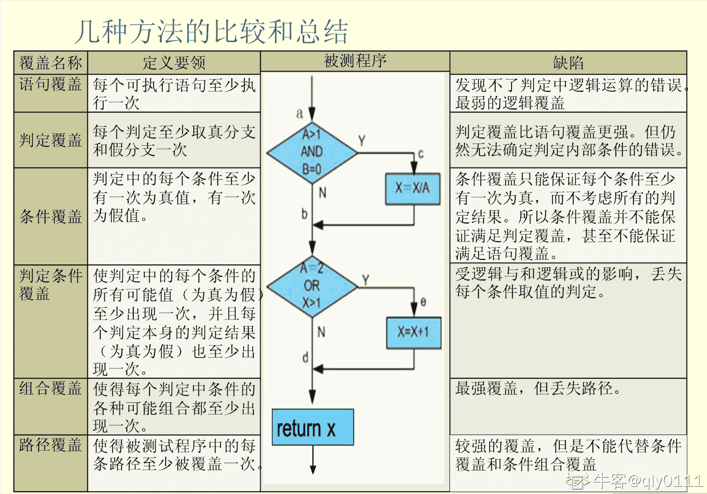

# 【2021】360 校招技术岗-客观题（测试工程）

## 1

在进行黑盒测试的过程中，可以借鉴同类的测试经验，下列测试用例设计描述正确的是(    ) 。

正确答案: A C   你的答案: 空 (错误)

```cpp
若某个输入条件对取值范围进行了规定，则可划分一个有效等价类和两个无效等价类
```

```cpp
若规定输入数据必须遵守的规则，则可以确定一个有效等价类和一个无效等价类
```

```cpp
等价类中的一个数据能捕获缺陷，则该等价类中的其他数据也能捕获缺陷
```

```cpp
如果输入条件是一个布尔数据，则不能确定等价类
```

本题知识点

测试开发工程师 测试工程师 360 公司 2021

讨论

[黑森林兔头](https://www.nowcoder.com/profile/417265451)

*   在输入条件规定了取值范围或值的个数的情况下，可以确立一个有效等价类和两个无效等价类*   在输入条件规定了输入值的集合或者规定了“必须如何”的条件的情况下，可以确立一个有效等价类和一个无效等价类*   在输入条件是一个布尔量的情况下，可确定一个有效等价类和一个无效等价类*   在规定了输入数据的一组值(假定 n 个)，并且程序要对每一个输入值分别处理的情况下，可确立 n 个有效等价类和一个无效等价类*   在规定了输入数据必须遵守的规则的情况下，可确立一个有效等价类(符合规则)和若干个无效等价类(从不同角度违反规则)*   在确知己划分的等价类中，各元素在程序处理中的方式不同的情况下，则应再将该等价类进一步地划分为更小的等价类。

发表于 2021-05-10 19:59:12

* * *

## 2

白盒测试是对源代码的测试，其中逻辑覆盖是最常用的测试用例方法，逻辑覆盖中覆盖率最低的是(   )  。

正确答案: C   你的答案: 空 (错误)

```cpp
判定覆盖
```

```cpp
条件覆盖
```

```cpp
语句覆盖
```

```cpp
基本路径覆盖
```

本题知识点

测试开发工程师 测试工程师 360 公司 2021

讨论

[qly0111](https://www.nowcoder.com/profile/9314475)



发表于 2021-06-08 16:49:51

* * *

[牛客 818859345 号](https://www.nowcoder.com/profile/818859345)

C

发表于 2021-11-28 12:09:39

* * *

[好想要 offer](https://www.nowcoder.com/profile/43478365)

B 语句覆盖。白盒测试常用方法覆盖准则强弱：语句覆盖<判定覆盖<条件覆盖<判定/条件覆盖<条件组合覆盖<路径覆盖

发表于 2021-09-18 11:13:29

* * *

## 3

黑盒测试和白盒测试是互补的关系，它们都是从不同方向提高的软件质量，以下是衡量代码质量的有(   )。

正确答案: A B C   你的答案: 空 (错误)

```cpp
缺陷密度
```

```cpp
代码可靠性
```

```cpp
顾客满意度
```

```cpp
测试人员工作质量
```

本题知识点

测试开发工程师 测试工程师 360 公司 2021

讨论

[黑森林兔头](https://www.nowcoder.com/profile/417265451)

**软件质量=外部质量+内部质量**

发表于 2021-05-10 20:22:49

* * *

## 4

为了达到测试效果的最佳，以及高效测试隐藏的 Bug，我们需要设计测试用例，测试用例至少包括的内容有（）。

正确答案: C   你的答案: 空 (错误)

```cpp
测试目标，自动化测试工具
```

```cpp
 linux 测试环境
```

```cpp
测试输入，执行条件以及期望结果
```

```cpp
测试用例设计方法
```

本题知识点

测试开发工程师 测试工程师 360 公司 2021

讨论

[牛客 650627695 号](https://www.nowcoder.com/profile/650627695)

测试用例的编写包括：测试编号，测试目的（用例标题，测试点），前置条件，测试步骤，预期结果，实际结果

发表于 2021-06-11 22:28:15

* * *

[牛客 675586133 号](https://www.nowcoder.com/profile/675586133)

c

发表于 2021-06-29 15:22:02

* * *

## 5

在当前流程的性能测试工具中，LoadRunner 和 Jmeter 都应用很广，下列关于以上两个工具描述正确的是()。

正确答案: D   你的答案: 空 (错误)

```cpp
LoadRunner 可以进行负载测试和压力测试，而 jmeter 只能进行负载测试
```

```cpp
LoadRunner 和 Jmeter 使用的脚本语言是一样的
```

```cpp
LoadRunner 测试脚本可以参数化，而 Jmeter 测试脚本不能参数化
```

```cpp
Load Runner 和 Jmeter 都可以实现多机联合测试
```

本题知识点

测试开发工程师 测试工程师 360 公司 2021

讨论

[牛客 51016684 号](https://www.nowcoder.com/profile/51016684)

jmeter 可以进行联机测试，Loadrunner 不支持

发表于 2021-06-06 22:14:58

* * *

## 6

使用 LoadRunner 进行性能测试时，为了模拟用户真正的数据，可以对测试脚本进行相应的参数化，则下列属于性能测试参数类型的是()。

正确答案: A   你的答案: 空 (错误)

```cpp
dat 文件
```

```cpp
Excel 类型
```

```cpp
word 类型
```

```cpp
txt 文件
```

本题知识点

测试开发工程师 测试工程师 360 公司 2021

讨论

[牛客 46634432 号](https://www.nowcoder.com/profile/46634432)

A

发表于 2021-09-24 16:40:07

* * *

[牛客 596690849 号](https://www.nowcoder.com/profile/596690849)

D  loadrunner 的配置参数化，不就是通过 txt 文档导入的么😥

发表于 2021-07-30 18:56:59

* * *

## 7

软件测试阶段中，集成测试阶段常用的方法是( ) 。

正确答案: D   你的答案: 空 (错误)

```cpp
使用黑盒测试方法即可
```

```cpp
使用白盒测试方法即可
```

```cpp
以黑盒测试为主，白盒测试为辅
```

```cpp
以白盒测试为主，黑盒测试为辅
```

本题知识点

测试开发工程师 测试工程师 360 公司 2021

讨论

[本王走路带风](https://www.nowcoder.com/profile/853947157)

应该选 c 黑盒为主

发表于 2022-02-07 11:58:02

* * *

[牛客 123171874 号](https://www.nowcoder.com/profile/123171874)

黑盒为主

发表于 2021-12-14 03:48:09

* * *

[牛客 386320625 号](https://www.nowcoder.com/profile/386320625)

C 黑盒测试为主

发表于 2021-09-03 23:58:28

* * *

## 8

下列关于集成测试阶段的增式集成，描述正确的是( ) 。

正确答案: C   你的答案: 空 (错误)

```cpp
自底向上增式集成，测试先设计桩模块
```

```cpp
自顶向下增式集成，测试先设计驱动模块
```

```cpp
自底向上增式集成，父单元用测试过的子单元测试
```

```cpp
自底向上增式集成，最上面的模块最先测试
```

本题知识点

测试开发工程师 测试工程师 360 公司 2021

讨论

[kongvely](https://www.nowcoder.com/profile/150999271)

因为模块是自底向上进行组装的，对于一个给定层次的模块，它的子模块（包括子模块的所有下属模块）事前已经完成组装并经过测试，所以不再需要编制桩模块（一种能模拟真实模块，给待测模块提供调用接口或数据的测试用软件模块）。

发表于 2021-12-12 14:51:54

* * *

C

发表于 2021-07-12 23:13:03

* * *

## 9

linux 系统执行指令时需要了解路径变量，以下查看路径变量的指令是 (      )？

正确答案: D   你的答案: 空 (错误)

```cpp
echo  PATH
```

```cpp
echo path
```

```cpp
cat PATH
```

```cpp
echo $PATH
```

本题知识点

测试开发工程师 测试工程师 360 公司 2021

## 10

系统管理员编写一个 shell 程序,定义保存平均成绩的变量,以下符合规范的是(      )？

正确答案: A   你的答案: 空 (错误)

```cpp
ave=0
```

```cpp
AVE=0
```

```cpp
int ave=0
```

```cpp
static ave=0
```

本题知识点

测试开发工程师 测试工程师 360 公司 2021

讨论

[迈济](https://www.nowcoder.com/profile/84438476)

大写字母 一般是系统变量名

发表于 2022-03-06 08:23:32

* * *

## 11

在 linux 系统中使用 ls 指令查看目录/home 的属性，以下正确的是(      )？

正确答案: B   你的答案: 空 (错误)

```cpp
ls -l  /home
```

```cpp
ls -ld  /home
```

```cpp
ls /home
```

```cpp
dir /home
```

本题知识点

测试开发工程师 测试工程师 360 公司 2021

讨论

[迈济](https://www.nowcoder.com/profile/84438476)

-l:详细信息显示（常用）-a:全部的文件，连同隐藏文件（开头.的文件）一起列出来（常用）-d:仅列出目录本身，不是列出目录内的文件数据（常用）

发表于 2022-03-06 08:28:22

* * *

## 12

系统管理员在 linux 系统中使用 vi 创建 test.sh SHELL 程序,该文件默认的访问权限是(      )？

正确答案: B   你的答案: 空 (错误)

```cpp
755
```

```cpp
644
```

```cpp
700
```

```cpp
600
```

本题知识点

测试开发工程师 测试工程师 360 公司 2021

讨论

[牛客 204061855 号](https://www.nowcoder.com/profile/204061855)

读取权限：等于 4 用 r 表示写入权限：等于 2 用 w 表示执行权限：等于 1 用 x 表示

从左至右，1-3 位数字代表文件所有者的权限，4-6 位数字代表同组用户的权限，7-9 数字代表其他用户的权限。

发表于 2021-06-25 21:26:55

* * *

## 13

设置 linux 系统卷标需要修改引导程序 grub 的配置文件,grub 的配置文件是(      )

正确答案: C   你的答案: 空 (错误)

```cpp
/etc/grub.conf
```

```cpp
/etc/grub/grub.conf
```

```cpp
/boot/grub/grub.conf
```

```cpp
/boot/grub.conf
```

本题知识点

测试开发工程师 测试工程师 360 公司 2021

讨论

[黑森林兔头](https://www.nowcoder.com/profile/417265451)

/bin：存放最常用命令；
/boot：启动 Linux 的核心文件；
/dev：设备文件；
/etc：存放各种配置文件；
/home：用户主目录；
/lib：系统最基本的动态链接共享库；
/mnt：一般是空的，用来临时挂载别的文件系统；
/proc：虚拟目录，是内存的映射；
/sbin：系统管理员命令存放目录；
/usr：最大的目录，存许应用程序和文件；
/usr/X11R6：X-Window 目录；
/usr/src：Linux 源代码；
/usr/include：系统头文件；
/usr/lib：存放常用动态链接共享库、静态档案库；
/usr/bin、/usr/sbin：这是对/bin、/sbin 的一个补充；

发表于 2021-05-10 20:33:33

* * *

[牛客 650627695 号](https://www.nowcoder.com/profile/650627695)

grub(统一引导装入器）是基本的 linux 基本的引导装入器，配置文件是/boot/grub/grub.conf

发表于 2021-06-20 16:30:42

* * *

## 14

在一台计算机安装了双系统 linux 与 windows,在 grub 引导程序中设置默认启动系统的参数是(      )？

正确答案: C   你的答案: 空 (错误)

```cpp
init
```

```cpp
system
```

```cpp
'default
```

```cpp
boot
```

本题知识点

测试开发工程师 测试工程师 360 公司 2021

## 15

软件工程师在 linux 系统中调用动态链接库时需要指定路径,动态链接库的默认位置是(      )？

正确答案: D   你的答案: 空 (错误)

```cpp
/etc
```

```cpp
/sbin
```

```cpp
/boot
```

```cpp
/lib
```

本题知识点

测试开发工程师 测试工程师 360 公司 2021

## 16

linux 系统中安装 rpm 软件包时,如果依赖的动态链接库文件不存在，强制安装该软件包的参数是(      )？

正确答案: C   你的答案: 空 (错误)

```cpp
'-f
```

```cpp
'-- install
```

```cpp
' --nodeps
```

```cpp
'-- deps
```

本题知识点

测试开发工程师 测试工程师 360 公司 2021

讨论

[offer 就是道，offer 就是理](https://www.nowcoder.com/profile/602450024)

.--nodeps 就是安装时不检查依赖关系，比如你某个 rpm 需要 A，但是没装 A，这样包就装不上，用了--nodeps 就能装上了。

发表于 2021-07-15 09:41:15

* * *

## 17

系统管理员在 linux 系统中安装并启用 mysql 数据库,mysql 默认开启的端口是(      )

正确答案: D   你的答案: 空 (错误)

```cpp
80
```

```cpp
8080
```

```cpp
25
```

```cpp
3306
```

本题知识点

测试开发工程师 测试工程师 360 公司 2021

讨论

[🌝🌝659](https://www.nowcoder.com/profile/1815087)

mysql 的默认端口是 3306，SQLserver 的默认端口是 1433，与 linux，Windows 无关

发表于 2021-09-11 18:04:20

* * *

[五叨](https://www.nowcoder.com/profile/476670053)

和 windows 的一样，额！难道有什么不一样吗？我靠

发表于 2021-08-13 23:31:03

* * *

[牛客 456687293 号](https://www.nowcoder.com/profile/456687293)

D

发表于 2022-01-03 17:37:13

* * *

## 18

网络管理员在企业网中配置 LAMP 集成系统, L 代表的是(      )？

正确答案: C   你的答案: 空 (错误)

```cpp
windows
```

```cpp
unix
```

```cpp
linux
```

```cpp
路由器
```

本题知识点

测试开发工程师 测试工程师 360 公司 2021

讨论

[牛客-003 号](https://www.nowcoder.com/profile/664842020)

L 代表 Linux。

A 代表 Apache。

M 代表 MySQL。

P 代表 PHP。

发表于 2021-09-10 10:35:32

* * *

## 19

linux 系统中通过 vim 编辑程序时,如果无法正常退出,网络管理员切换终端后,结束 vim 进程的指令是(      )？

正确答案: B   你的答案: 空 (错误)

```cpp
kill  vim
```

```cpp
killall  vim
```

```cpp
ps  vim
```

```cpp
kill  -9  vim
```

本题知识点

测试开发工程师 测试工程师 360 公司 2021

讨论

[黑森林兔头](https://www.nowcoder.com/profile/417265451)

**kill -9 + PID  加上-9 是强制终止的信号**

**killall 是直接加进程名**

发表于 2021-05-10 20:43:16

* * *

## 20

linux 系统新建一个用户 admin,如果需要把该用户设置为管理员，需要修改用户的 ID 为(      )？

正确答案: A   你的答案: 空 (错误)

```cpp
0
```

```cpp
1
```

```cpp
2
```

```cpp
100
```

本题知识点

测试开发工程师 测试工程师 360 公司 2021