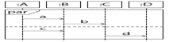
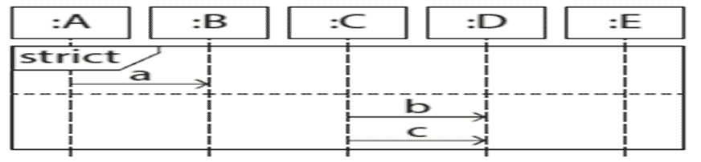

# 【2021】360 校招技术岗-客观题（服务端开发）

## 1

以下序列图。哪些轨迹是可能的？

正确答案: A C D   你的答案: 空 (错误)

```cpp
d → a → b → c
```

```cpp
b → a → c → d
```

```cpp
a → b → c → d
```

```cpp
c → a → d → b
```

本题知识点

Java 工程师 C++工程师 PHP 工程师 golang 工程师 前端工程师 安卓工程师 iOS 工程师 算法工程师 大数据开发工程师 信息技术岗 运维工程师 安全工程师 数据分析师 数据库工程师 游戏研发工程师 区块链 测试开发工程师 测试工程师 360 公司 2021

讨论

[南-烟雨](https://www.nowcoder.com/profile/323549175)

图中坐上角为 par，图中虚线上下两部分并行执行，两个片段之间的数据可以交错，但是单个片段中的事件必须串行执行，也就是只要满足 a 先于 b 执行，c 先于 d 执行都可能发生

发表于 2021-06-23 11:20:52

* * *

## 2

以下序列图。哪些轨迹是可能的？

正确答案: D   你的答案: 空 (错误)

```cpp
b → a → c
```

```cpp
c → a → b
```

```cpp
b → c → a
```

```cpp
a → b → c
```

本题知识点

Java 工程师 C++工程师 PHP 工程师 golang 工程师 前端工程师 安卓工程师 iOS 工程师 算法工程师 大数据开发工程师 信息技术岗 运维工程师 安全工程师 数据分析师 数据库工程师 游戏研发工程师 区块链 测试开发工程师 测试工程师 360 公司 2021

## 3

下列关于用例图说法正确的是（      ）。

正确答案: B   你的答案: 空 (错误)

```cpp
用例图常用在系统概要设计阶段
```

```cpp
参与者与用例之间的联系用实线箭头连接
```

```cpp
用例图是用于描述系统功能的动态视图
```

```cpp
用例图用来说明行为的状态和响应
```

本题知识点

Java 工程师 C++工程师 PHP 工程师 golang 工程师 前端工程师 安卓工程师 iOS 工程师 算法工程师 大数据开发工程师 信息技术岗 运维工程师 安全工程师 数据分析师 数据库工程师 游戏研发工程师 区块链 测试开发工程师 测试工程师 360 公司 2021

讨论

[Decade_](https://www.nowcoder.com/profile/534829948)

这答案 B 是错的吧。。。。参与者和用例之间应该是用实线但是没有箭头来表示的吧

发表于 2021-08-21 16:26:52

* * *

[OFFER/OFFER](https://www.nowcoder.com/profile/203895943)

```cpp
参与者与用例之间的联系可以用实线箭头或者实线连接
```

发表于 2022-03-19 10:28:01

* * *

## 4

活动图可以视为一种特殊的（      ）。

正确答案: B   你的答案: 空 (错误)

```cpp
顺序图
```

```cpp
状态图
```

```cpp
协作图
```

```cpp
对象图
```

本题知识点

Java 工程师 C++工程师 PHP 工程师 golang 工程师 前端工程师 安卓工程师 iOS 工程师 算法工程师 大数据开发工程师 信息技术岗 运维工程师 安全工程师 数据分析师 数据库工程师 游戏研发工程师 区块链 测试开发工程师 测试工程师 360 公司 2021

讨论

[Decade_](https://www.nowcoder.com/profile/534829948)

UML 2.0 而言，去除了“活动图是状态图的一种特例”这一规定。这题太老了

发表于 2021-08-21 16:29:10

* * *

## 5

原始数据类型 ____。

正确答案: D   你的答案: 空 (错误)

```cpp
无法进行操作
```

```cpp
是类的同义词
```

```cpp
是严格定义的，不能由用户定义
```

```cpp
没有内部结构
```

本题知识点

Java 工程师 C++工程师 PHP 工程师 golang 工程师 前端工程师 安卓工程师 iOS 工程师 算法工程师 大数据开发工程师 信息技术岗 运维工程师 安全工程师 数据分析师 数据库工程师 游戏研发工程师 区块链 测试开发工程师 测试工程师 360 公司 2021

## 6

以下哪个语句描述了用例。

正确答案: B C   你的答案: 空 (错误)

```cpp
用例适用于对两个系统之间的接口进行建模
```

```cpp
用例指定了正在开发的系统应具有的功能和行为
```

```cpp
用例来自客户的请求
```

```cpp
用例指定系统内的过程过程
```

本题知识点

Java 工程师 C++工程师 PHP 工程师 golang 工程师 前端工程师 安卓工程师 iOS 工程师 算法工程师 大数据开发工程师 信息技术岗 运维工程师 安全工程师 数据分析师 数据库工程师 游戏研发工程师 区块链 测试开发工程师 测试工程师 360 公司 2021

## 7

"关于使用游标的 5 个步骤，排列正确的一项是？
①读取  ②关闭  ③声明  ④删除  ⑤打开" 
 正确答案: D   你的答案: 空 (错误)

```cpp
①②③④⑤
```

```cpp
③④①⑤②
```

```cpp
④③①⑤②
```

```cpp
③⑤①②④
```

本题知识点

Java 工程师 C++工程师 PHP 工程师 golang 工程师 前端工程师 安卓工程师 iOS 工程师 算法工程师 大数据开发工程师 信息技术岗 运维工程师 安全工程师 数据分析师 数据库工程师 游戏研发工程师 区块链 测试开发工程师 测试工程师 360 公司 2021

## 8

"不用游标的 SQL 语句有().
①查询结果为单条记录的 select 语句
②查询结果为多条记录的 select 语句
③说明性语句
④数据定义语句
⑤数据控制语句" 

正确答案: B   你的答案: 空 (错误)

```cpp
①②③④
```

```cpp
①③④⑤
```

```cpp
②③④⑤
```

```cpp
①②④⑤
```

本题知识点

Java 工程师 C++工程师 PHP 工程师 golang 工程师 前端工程师 安卓工程师 iOS 工程师 算法工程师 大数据开发工程师 信息技术岗 运维工程师 安全工程师 数据分析师 数据库工程师 游戏研发工程师 区块链 测试开发工程师 测试工程师 360 公司 2021

## 9

E-R 图中实体之间（      ）联系是通过建立新的关系来实现向关系模型的转换。

正确答案: B   你的答案: 空 (错误)

```cpp
一对多
```

```cpp
多对多
```

```cpp
一对一
```

```cpp
其他几项都不对
```

本题知识点

Java 工程师 C++工程师 PHP 工程师 golang 工程师 前端工程师 安卓工程师 iOS 工程师 算法工程师 大数据开发工程师 信息技术岗 运维工程师 安全工程师 数据分析师 数据库工程师 游戏研发工程师 区块链 测试开发工程师 测试工程师 360 公司 2021

## 10

E-R 图中一般使用（      ）表示属性。

正确答案: B   你的答案: 空 (错误)

```cpp
矩形
```

```cpp
椭圆 
```

```cpp
菱形
```

```cpp
其他几项都不对
```

本题知识点

Java 工程师 C++工程师 PHP 工程师 golang 工程师 前端工程师 安卓工程师 iOS 工程师 算法工程师 大数据开发工程师 信息技术岗 运维工程师 安全工程师 数据分析师 数据库工程师 游戏研发工程师 区块链 测试开发工程师 测试工程师 360 公司 2021

## 11

关系可以有哪三种类型（）。

正确答案: A B C   你的答案: 空 (错误)

```cpp
基本关系
```

```cpp
查询表
```

```cpp
视图表
```

```cpp
随机表
```

本题知识点

Java 工程师 C++工程师 PHP 工程师 golang 工程师 前端工程师 安卓工程师 iOS 工程师 算法工程师 大数据开发工程师 信息技术岗 运维工程师 安全工程师 数据分析师 数据库工程师 游戏研发工程师 区块链 测试开发工程师 测试工程师 360 公司 2021

## 12

自然连接是一种特殊的（）。

正确答案: B   你的答案: 空 (错误)

```cpp
不等值连接
```

```cpp
等值连接
```

```cpp
随机连接
```

```cpp
无法确定
```

本题知识点

Java 工程师 C++工程师 PHP 工程师 golang 工程师 前端工程师 安卓工程师 iOS 工程师 算法工程师 大数据开发工程师 信息技术岗 运维工程师 安全工程师 数据分析师 数据库工程师 游戏研发工程师 区块链 测试开发工程师 测试工程师 360 公司 2021

## 13

采用分治法能够解决的问题有 （）。

正确答案: A B D   你的答案: 空 (错误)

```cpp
汉诺塔问题
```

```cpp
快速排序
```

```cpp
背包问题
```

```cpp
二分搜索
```

本题知识点

Java 工程师 C++工程师 PHP 工程师 golang 工程师 前端工程师 安卓工程师 iOS 工程师 算法工程师 大数据开发工程师 信息技术岗 运维工程师 安全工程师 数据分析师 数据库工程师 游戏研发工程师 区块链 测试开发工程师 测试工程师 360 公司 2021

讨论

[学习永远在路上](https://www.nowcoder.com/profile/169263790)

背包问题应用的是贪心算法

发表于 2021-10-25 20:48:57

* * *

## 14

求解递归方程的采用的方法有（）。

正确答案: A B C   你的答案: 空 (错误)

```cpp
替换法
```

```cpp
递归树方法
```

```cpp
主方法
```

```cpp
表格记忆法
```

本题知识点

Java 工程师 C++工程师 PHP 工程师 golang 工程师 前端工程师 安卓工程师 iOS 工程师 算法工程师 大数据开发工程师 信息技术岗 运维工程师 安全工程师 数据分析师 数据库工程师 游戏研发工程师 区块链 测试开发工程师 测试工程师 360 公司 2021

讨论

[]☆~放弃爱❤](https://www.nowcoder.com/profile/6957431)

求解递归式的三种方法： 1.主方法求解递归式

2.递归树求解

3.代入法（替换法） 

发表于 2021-07-14 17:36:06

* * *

## 15

对于举证 A1(20*25)、A2(25*5)、A3(5*15)、A4(15*10)、A5(10*20)、A6(20*25)，下列计算开销最小的是（     ）。

正确答案: A   你的答案: 空 (错误)

```cpp
(A1A2)(((A3A4)A5)A6)
```

```cpp
(A1A2A3)((A4A5)A6)
```

```cpp
(((A1((A2A3)A4))A5)A6)
```

```cpp
(A1A2)((A3(A4A5))A6)
```

本题知识点

Java 工程师 C++工程师 PHP 工程师 golang 工程师 前端工程师 安卓工程师 iOS 工程师 算法工程师 大数据开发工程师 信息技术岗 运维工程师 安全工程师 数据分析师 数据库工程师 游戏研发工程师 区块链 测试开发工程师 测试工程师 360 公司 2021

讨论

[]☆~放弃爱❤](https://www.nowcoder.com/profile/6957431)

利用动态规划计算以下矩阵连乘

举例 B 的计算次数：

(A1A2A3)：25*20*5+20*5*15=4000

((A4A5)A6)：15*10*20+15*20*25=10500

(A1A2A3)((A4A5)A6)：25*20*5+20*5*15+15*10*20+15*20*25+20*15*25=22000 把其他选项按上面的方法求解，得到最小的值就是开销最小

发表于 2021-07-14 17:38:25

* * *

[南-烟雨](https://www.nowcoder.com/profile/323549175)

对于矩阵？

发表于 2021-06-23 11:27:10

* * *

## 16

设有 8 件物品，其重量分别为{79，58，86，11，28，62，15，68}，价值分别为{83，14，54，79，72，52，48，62}，背包的容量为 200，求使得背包的价值最大的装入情况（      ）。

正确答案: D   你的答案: 空 (错误)

```cpp
11010110
```

```cpp
10111010
```

```cpp
10100110
```

```cpp
10011110
```

本题知识点

Java 工程师 C++工程师 PHP 工程师 golang 工程师 前端工程师 安卓工程师 iOS 工程师 算法工程师 大数据开发工程师 信息技术岗 运维工程师 安全工程师 数据分析师 数据库工程师 游戏研发工程师 区块链 测试开发工程师 测试工程师 360 公司 2021

讨论

[Decade_](https://www.nowcoder.com/profile/534829948)

01 背包问题，而且还是个选择题，是有奇技淫巧的。如下，直接从四个选项中，找位数是 1 的那个物品对应的价值，计算出来总价值：比如 A 就是，83+14+79+52+48。根据判断得出 D 是最大的，然后看一下 D 的策略能否满足总重量小于 200，即：79+11+28+62+15 = 195 < 200，说明四个选项中 D 是价值最高且满足题意的，直接选它就好

发表于 2021-08-21 16:53:00

* * *

## 17

下面问题（      ）不能用贪心算法解决。

正确答案: B   你的答案: 空 (错误)

```cpp
单源最短路径问题
```

```cpp
N 皇后问题
```

```cpp
最小花费生成树问题
```

```cpp
背包问题
```

本题知识点

Java 工程师 C++工程师 PHP 工程师 golang 工程师 前端工程师 安卓工程师 iOS 工程师 算法工程师 大数据开发工程师 信息技术岗 运维工程师 安全工程师 数据分析师 数据库工程师 游戏研发工程师 区块链 测试开发工程师 测试工程师 360 公司 2021

## 18

下列算法中，没有使用贪心策略的是（     ）。

正确答案: D   你的答案: 空 (错误)

```cpp
Prim 算法
```

```cpp
Kruskal 算法
```

```cpp
Dijkstra 算法
```

```cpp
KMP 算法
```

本题知识点

Java 工程师 C++工程师 PHP 工程师 golang 工程师 前端工程师 安卓工程师 iOS 工程师 算法工程师 大数据开发工程师 信息技术岗 运维工程师 安全工程师 数据分析师 数据库工程师 游戏研发工程师 区块链 测试开发工程师 测试工程师 360 公司 2021

## 19

用 DFS 遍历一个无环有向图，并在 DFS 算法退栈返回时打印相应的顶点，则输出的顶点序列是(     ）。

正确答案: A   你的答案: 空 (错误)

```cpp
逆拓扑有序
```

```cpp
拓扑有序
```

```cpp
无序的
```

```cpp
无法确定
```

本题知识点

Java 工程师 C++工程师 PHP 工程师 golang 工程师 前端工程师 安卓工程师 iOS 工程师 算法工程师 大数据开发工程师 信息技术岗 运维工程师 安全工程师 数据分析师 数据库工程师 游戏研发工程师 区块链 测试开发工程师 测试工程师 360 公司 2021

## 20

求最短路径的 FLOYD 算法的时间复杂度为（     ）。

正确答案: D   你的答案: 空 (错误)

```cpp
O(n)
```

```cpp
O(n+e)
```

```cpp
O(n²)
```

```cpp
O(n³)
```

本题知识点

Java 工程师 C++工程师 PHP 工程师 golang 工程师 前端工程师 安卓工程师 iOS 工程师 算法工程师 大数据开发工程师 信息技术岗 运维工程师 安全工程师 数据分析师 数据库工程师 游戏研发工程师 区块链 测试开发工程师 测试工程师 360 公司 2021

## 21

有关 LP 问题，（     ）是错误的 。

正确答案: A   你的答案: 空 (错误)

```cpp
当最优解多余一个时，最优解必有无穷多个
```

```cpp
当有可行解时，必有最优解
```

```cpp
当有最优解时，必有在可行集顶点达到的最优解 
```

```cpp
当有可行解时，必有可行基解
```

本题知识点

Java 工程师 C++工程师 PHP 工程师 golang 工程师 前端工程师 安卓工程师 iOS 工程师 算法工程师 大数据开发工程师 信息技术岗 运维工程师 安全工程师 数据分析师 数据库工程师 游戏研发工程师 区块链 测试开发工程师 测试工程师 360 公司 2021

## 22

某产品重量为 150 千克，用 A、B 两种原料制成。每单位 A 原料成本为 2 元，每单位 B 原料成本为 8 元。该产品至少需要含 14 单位 B 原料，最多含 20 千克 A 原料。每单位 A、B 原料分别中 5 千克、10 千克，成本最小为（     ）。

正确答案: B   你的答案: 空 (错误)

```cpp
80
```

```cpp
116
```

```cpp
120
```

```cpp
40
```

本题知识点

Java 工程师 C++工程师 PHP 工程师 golang 工程师 前端工程师 安卓工程师 iOS 工程师 算法工程师 大数据开发工程师 信息技术岗 运维工程师 安全工程师 数据分析师 数据库工程师 游戏研发工程师 区块链 测试开发工程师 测试工程师 360 公司 2021

讨论

[Beata_ 星辰大海](https://www.nowcoder.com/profile/936287501)

设：x 单位的 A，y 单位的 B，z 是成本 5x+10y=150  => x+2y =30z = 2x+8y = 2(x+4y) = 60+4y = 60+4*14 = 116

发表于 2021-08-29 10:56:21

* * *

## 23

已知串 S=“babab"，其 Next 数值序列为（     ）。
 正确答案: C   你的答案: 空 (错误)

```cpp
01112
```

```cpp
01233
```

```cpp
01123
```

```cpp
01223
```

本题知识点

Java 工程师 C++工程师 PHP 工程师 golang 工程师 前端工程师 安卓工程师 iOS 工程师 算法工程师 大数据开发工程师 信息技术岗 运维工程师 安全工程师 数据分析师 数据库工程师 游戏研发工程师 区块链 测试开发工程师 测试工程师 360 公司 2021

讨论

[]☆~放弃爱❤](https://www.nowcoder.com/profile/6957431)

首先介绍 2 个概念，字符串的前缀和后缀（这里的前缀是不包括最后一个字符的子串，后缀是不包含第一个字符的子串）。拿题目中的字符串 a=''babab''举例，首先第一位 0，第二位 1。这个是固定的。第三位，字符串是“bab”，这时候“bab”的前缀有 b，ba；后缀有 ab，b，可以看出前后缀相等的最长的字符串只有 b，因为 b 的长度是 1，所以这里第三位的 next 值就是 1。到了第四位，字符串是“baba”，前缀是 b,ba,bab；后缀是 aba,ba,a。这里可以看出前后缀相等的最长的字符串是 ba，长度是 2，因此第四位的 next 值是 2。到了第五位，字符串是“babab”，前缀是 b,ba,bab,baba；后缀是 abab,bab,ab,b。这里可以看出前后缀相等的最长的字符串是 bab，长度是 3，因此第五位的 next 值是 3\.因此综合起来 next 值就是 0 1 1 2 3，也就是答案 C。

发表于 2021-07-14 17:45:34

* * *

## 24

关于标准形线性规划表述不正确的是（      ）。

正确答案: B   你的答案: 空 (错误)

```cpp
约束条件都为不等式
```

```cpp
若存在最优解，则最优解必在可行域顶点上
```

```cpp
若存在可行域，则可行域一定是凸集
```

```cpp
可行域可以是无界
```

本题知识点

Java 工程师 C++工程师 PHP 工程师 golang 工程师 前端工程师 安卓工程师 iOS 工程师 算法工程师 大数据开发工程师 信息技术岗 运维工程师 安全工程师 数据分析师 数据库工程师 游戏研发工程师 区块链 测试开发工程师 测试工程师 360 公司 2021

讨论

[Decade_](https://www.nowcoder.com/profile/534829948)

B 错在了没有强调存在唯一最优解。D 不太清楚求解惑

发表于 2021-08-21 17:18:03

* * *

## 25

关于线性规划描述不正确的是（      ）。

正确答案: C   你的答案: 空 (错误)

```cpp
图解法只能用于求解两个变量的线性规划问题
```

```cpp
线性规划的最优解一定是可行解
```

```cpp
线性规划标准形的决策变量不为零
```

```cpp
线性规划可行域有界，则一定有最优解
```

本题知识点

Java 工程师 C++工程师 PHP 工程师 golang 工程师 前端工程师 安卓工程师 iOS 工程师 算法工程师 大数据开发工程师 信息技术岗 运维工程师 安全工程师 数据分析师 数据库工程师 游戏研发工程师 区块链 测试开发工程师 测试工程师 360 公司 2021

## 26

下列不属于 NP 问题的是（      ）。

正确答案: D   你的答案: 空 (错误)

```cpp
精确覆盖问题
```

```cpp
背包问题
```

```cpp
0-1 整数规划问题
```

```cpp
最大连续子序列乘积
```

本题知识点

Java 工程师 C++工程师 PHP 工程师 golang 工程师 前端工程师 安卓工程师 iOS 工程师 算法工程师 大数据开发工程师 信息技术岗 运维工程师 安全工程师 数据分析师 数据库工程师 游戏研发工程师 区块链 测试开发工程师 测试工程师 360 公司 2021

## 27

下列描述不正确的是（      ）。

正确答案: C   你的答案: 空 (错误)

```cpp
所有 NP 问题都可以归约为 NPC 问题
```

```cpp
NPC 问题在多项式时间内找不到解
```

```cpp
NPH 问题在多项式时间内找不到解
```

```cpp
P 问题也是 NP 问题
```

本题知识点

Java 工程师 C++工程师 PHP 工程师 golang 工程师 前端工程师 安卓工程师 iOS 工程师 算法工程师 大数据开发工程师 信息技术岗 运维工程师 安全工程师 数据分析师 数据库工程师 游戏研发工程师 区块链 测试开发工程师 测试工程师 360 公司 2021

## 28

设串长为 n，模式串长为 m，则 KMP 算法所需的附加空间为（     ）。

正确答案: D   你的答案: 空 (错误)

```cpp
O(m)
```

```cpp
O(n)
```

```cpp
O(m*n)
```

```cpp
O(nlog2m)
```

本题知识点

Java 工程师 C++工程师 PHP 工程师 golang 工程师 前端工程师 安卓工程师 iOS 工程师 算法工程师 大数据开发工程师 信息技术岗 运维工程师 安全工程师 数据分析师 数据库工程师 游戏研发工程师 区块链 测试开发工程师 测试工程师 360 公司 2021

## 29

在 c++中，一个函数的返回值类型是由()决定的？

正确答案: D   你的答案: 空 (错误)

```cpp
return 语句中的表达式类型
```

```cpp
调用该函数时系统随机产生的类型
```

```cpp
调用该函数时的主调用函数类型
```

```cpp
在定义该函数时所指定的数据类型
```

本题知识点

Java 工程师 C++工程师 PHP 工程师 golang 工程师 前端工程师 安卓工程师 iOS 工程师 算法工程师 大数据开发工程师 信息技术岗 运维工程师 安全工程师 数据分析师 数据库工程师 游戏研发工程师 区块链 测试开发工程师 测试工程师 360 公司 2021

## 30

在 c++中，cout<<endl>正确答案: D   你的答案: 空 (错误)

```cpp
'\r\b'
```

```cpp
'\r'
```

```cpp
'\t'
```

```cpp
'\n'
```

本题知识点

Java 工程师 C++工程师 PHP 工程师 golang 工程师 前端工程师 安卓工程师 iOS 工程师 算法工程师 大数据开发工程师 信息技术岗 运维工程师 安全工程师 数据分析师 数据库工程师 游戏研发工程师 区块链 测试开发工程师 测试工程师 360 公司 2021

## 31

下面代码执行后的输出结果为（      ）？
#include <iostream>
using namespace std;

class A{
protected:
    int num;

public:
    A(int i){num=i;}    
    A& operator=(const A &a){
        num=a.num;
        return *this;
    }
};

class B:public A{
    double dig;
public:
    B(double d):A(int(d)+1){dig=d;}
    B& operator=(const B&);
        void show(){
        cout << num << "," << dig << endl;
    }
};

B& B::operator =(const B &b){ 
    A::operator=(b);
    dig=b.dig;

    return *this;
}

int main(){
    B obj(1.5);
    obj.show();
    return 0;
}

正确答案: B   你的答案: 空 (错误)

```cpp
1,1.5
```

```cpp
2,1.5
```

```cpp
2,1
```

```cpp
编译时报错
```

本题知识点

Java 工程师 C++工程师 PHP 工程师 golang 工程师 前端工程师 安卓工程师 iOS 工程师 算法工程师 大数据开发工程师 信息技术岗 运维工程师 安全工程师 数据分析师 数据库工程师 游戏研发工程师 区块链 测试开发工程师 测试工程师 360 公司 2021

## 32

在 32 位系统中执行如下代码输出结果为（      ）？
#include <iostream>
using namespace std;

class A{
    char a;
public:
    static char b;
};

class B:public A{
public:
    char a;
    static char b;
};

class C:public B{
public:
    virtual void func1();
    virtual void func2();
};

int main(){
    cout << sizeof(C) << endl;
}

正确答案: A   你的答案: 空 (错误)

```cpp
8
```

```cpp
12
```

```cpp
24
```

```cpp
其他几项都不对
```

本题知识点

Java 工程师 C++工程师 PHP 工程师 golang 工程师 前端工程师 安卓工程师 iOS 工程师 算法工程师 大数据开发工程师 信息技术岗 运维工程师 安全工程师 数据分析师 数据库工程师 游戏研发工程师 区块链 测试开发工程师 测试工程师 360 公司 2021

## 33

下列哪种继承方式的特点是基类公有成员和保护成员只能被派生类访问，而不能被派生类的子类访问（      ）？

正确答案: B   你的答案: 空 (错误)

```cpp
公有继承
```

```cpp
私有继承
```

```cpp
保护继承
```

```cpp
虚拟继承
```

本题知识点

Java 工程师 C++工程师 PHP 工程师 golang 工程师 前端工程师 安卓工程师 iOS 工程师 算法工程师 大数据开发工程师 信息技术岗 运维工程师 安全工程师 数据分析师 数据库工程师 游戏研发工程师 区块链 测试开发工程师 测试工程师 360 公司 2021

## 34

派生类可以从基类继承的函数是（      ）？

正确答案: D   你的答案: 空 (错误)

```cpp
构造函数
```

```cpp
析构函数
```

```cpp
赋值操作函数
```

```cpp
重载函数
```

本题知识点

Java 工程师 C++工程师 PHP 工程师 golang 工程师 前端工程师 安卓工程师 iOS 工程师 算法工程师 大数据开发工程师 信息技术岗 运维工程师 安全工程师 数据分析师 数据库工程师 游戏研发工程师 区块链 测试开发工程师 测试工程师 360 公司 2021

## 35

下面代码执行后的输出结果为（      ）？
#include <iostream>
using namespace std;

int *p;
void SetValue();
void Clear();

int main(){
    SetValue();
    Clear();
    cout << *p << endl;
    return 0;
} 

void SetValue()
{
    int i;
    i = 25;     
    p = &i;
}

void Clear()
{
    int arr[100]={1};
}

正确答案: A   你的答案: 空 (错误)

```cpp
0
```

```cpp
1
```

```cpp
25
```

```cpp
其他几项都不对
```

本题知识点

Java 工程师 C++工程师 PHP 工程师 golang 工程师 前端工程师 安卓工程师 iOS 工程师 算法工程师 大数据开发工程师 信息技术岗 运维工程师 安全工程师 数据分析师 数据库工程师 游戏研发工程师 区块链 测试开发工程师 测试工程师 360 公司 2021

## 36

下面代码存在编译错误的是（      ）？
#include<iostream>
using namespace std;

int main()
{
    int i=10;
    int j=1;
    const int *p1;
    int const *p2=&i;   //(1)
    int *const p3=&i;   //(2)

    p2=&j;              //(3)
    *p3=20;             //(4)
    *p2=30;             //(5)
    p3=&j;              //(6)
    return 0;
}

正确答案: B   你的答案: 空 (错误)

```cpp
1，3，5，6
```

```cpp
5，6
```

```cpp
2，4
```

```cpp
1，2，4，5
```

本题知识点

Java 工程师 C++工程师 PHP 工程师 golang 工程师 前端工程师 安卓工程师 iOS 工程师 算法工程师 大数据开发工程师 信息技术岗 运维工程师 安全工程师 数据分析师 数据库工程师 游戏研发工程师 区块链 测试开发工程师 测试工程师 360 公司 2021

## 37

下面程序的输出结果为（      ）？
#include <iostream>
using namespace std;

int main ( )
{
    char str[] = {"hello"}, *p;

    p = (char*)new char(10);
    *p = str; 
    cout<<*p<<endl;

    return 0;
}

正确答案: C   你的答案: 空 (错误)

```cpp
hello
```

```cpp
h
```

```cpp
编译错误
```

```cpp
其他几项都不对
```

本题知识点

Java 工程师 C++工程师 PHP 工程师 golang 工程师 前端工程师 安卓工程师 iOS 工程师 算法工程师 大数据开发工程师 信息技术岗 运维工程师 安全工程师 数据分析师 数据库工程师 游戏研发工程师 区块链 测试开发工程师 测试工程师 360 公司 2021

## 38

常量区存放的是（      ）？

正确答案: A   你的答案: 空 (错误)

```cpp
字符串常量
```

```cpp
文字常量
```

```cpp
常变量
```

```cpp
静态变量
```

本题知识点

Java 工程师 C++工程师 PHP 工程师 golang 工程师 前端工程师 安卓工程师 iOS 工程师 算法工程师 大数据开发工程师 信息技术岗 运维工程师 安全工程师 数据分析师 数据库工程师 游戏研发工程师 区块链 测试开发工程师 测试工程师 360 公司 2021

讨论

[牛客 844834058 号](https://www.nowcoder.com/profile/844834058)

A

发表于 2021-07-15 22:05:39

* * *

## 39

使用（      ）可以将 short 类型变量强制转换成 char 类型？

正确答案: A   你的答案: 空 (错误)

```cpp
static_cast
```

```cpp
const_cast
```

```cpp
reinterpret_cast
```

```cpp
dynamic_cast
```

本题知识点

Java 工程师 C++工程师 PHP 工程师 golang 工程师 前端工程师 安卓工程师 iOS 工程师 算法工程师 大数据开发工程师 信息技术岗 运维工程师 安全工程师 数据分析师 数据库工程师 游戏研发工程师 区块链 测试开发工程师 测试工程师 360 公司 2021

## 40

将 int 类型变量转换为 char*指针使用（      ）转换？

正确答案: C   你的答案: 空 (错误)

```cpp
static_cast
```

```cpp
const_cast
```

```cpp
reinterpret_cast
```

```cpp
dynamic_cast
```

本题知识点

Java 工程师 C++工程师 PHP 工程师 golang 工程师 前端工程师 安卓工程师 iOS 工程师 算法工程师 大数据开发工程师 信息技术岗 运维工程师 安全工程师 数据分析师 数据库工程师 游戏研发工程师 区块链 测试开发工程师 测试工程师 360 公司 2021

## 41

在 Java 中，ObjectOutputStream 用来完成对类的实例进行序列化操作，如果序列化时，个别属性不需要序列化，则可以（）？

正确答案: C   你的答案: 空 (错误)

```cpp
让不需要序列化的属性不实现 Serializable 接口即可
```

```cpp
给属性 native 关键字修饰
```

```cpp
可以实现 Externalizable 接口重写 writeExternal(ObjectOutput out)方法
```

```cpp
可以实现 Externalizable 接口重写 readExternal(ObjectInput in)方法
```

本题知识点

Java 工程师 C++工程师 PHP 工程师 golang 工程师 前端工程师 安卓工程师 iOS 工程师 算法工程师 大数据开发工程师 信息技术岗 运维工程师 安全工程师 数据分析师 数据库工程师 游戏研发工程师 区块链 测试开发工程师 测试工程师 360 公司 2021

## 42

在 Java 中，使用 BufferedWriter 写入文件时，需要使用（）方法

正确答案: C   你的答案: 空 (错误)

```cpp
writeLine()
```

```cpp
readLine
```

```cpp
write
```

```cpp
writeString()
```

本题知识点

Java 工程师 C++工程师 PHP 工程师 golang 工程师 前端工程师 安卓工程师 iOS 工程师 算法工程师 大数据开发工程师 信息技术岗 运维工程师 安全工程师 数据分析师 数据库工程师 游戏研发工程师 区块链 测试开发工程师 测试工程师 360 公司 2021

## 43

下面关于类、对象和实例的叙述，正确的是（）？

正确答案: B   你的答案: 空 (错误)

```cpp
其他说法都不正确
```

```cpp
类也是一种数据类型，可以用它声明对象引用变量
```

```cpp
类是对象的抽象，对象是类的具体化，实例是类的另一个名称
```

```cpp
对象引用变量和对象是等价的
```

本题知识点

Java 工程师 C++工程师 PHP 工程师 golang 工程师 前端工程师 安卓工程师 iOS 工程师 算法工程师 大数据开发工程师 信息技术岗 运维工程师 安全工程师 数据分析师 数据库工程师 游戏研发工程师 区块链 测试开发工程师 测试工程师 360 公司 2021

## 44

下列方法的定义中，（）表述不正确？

正确答案: A   你的答案: 空 (错误)

```cpp
public static t(int x) {... }
```

```cpp
void t(int x){... }
```

```cpp
static int t(int x ){... }
```

```cpp
privata static int t(){... }
```

本题知识点

Java 工程师 C++工程师 PHP 工程师 golang 工程师 前端工程师 安卓工程师 iOS 工程师 算法工程师 大数据开发工程师 信息技术岗 运维工程师 安全工程师 数据分析师 数据库工程师 游戏研发工程师 区块链 测试开发工程师 测试工程师 360 公司 2021

## 45

有以下代码段
pulbic class Something {
    public synchronized void syncA(){}
    public synchronized void syncB(){}
    public static synchronized void sSyncA(){}
    public static synchronized void sSyncB(){}
}
假设类 test 有两个对象分别为 x 和 y，下面 4 组表达式可以同时获取锁的是（）？

正确答案: B D   你的答案: 空 (错误)

```cpp
x.syncA()与 x.syncB()
```

```cpp
x.syncA()与 y.syncB()
```

```cpp
x.sSyncA()与 y.sSyncB()
```

```cpp
x.sSyncA()与 test.sSyncA()
```

本题知识点

Java 工程师 C++工程师 PHP 工程师 golang 工程师 前端工程师 安卓工程师 iOS 工程师 算法工程师 大数据开发工程师 信息技术岗 运维工程师 安全工程师 数据分析师 数据库工程师 游戏研发工程师 区块链 测试开发工程师 测试工程师 360 公司 2021

讨论

[Keosc](https://www.nowcoder.com/profile/123273867)

synchronized 关键字

*   修饰实例方法，对当前实例对象 this 加锁
*   修饰静态方法，对当前类的 Class 对象加锁

*   修饰代码块，指定一个加锁的对象，给对象加锁

根据上面三条可以去掉 AC，D 的话我觉得是可重入锁。故选 B、D

编辑于 2021-06-28 22:14:34

* * *

[]☆~放弃爱❤](https://www.nowcoder.com/profile/6957431)

x.isSyncA()与 x.isSyncB()

不能同时访问，因为都是访问对象 x 的同步锁

x.isSyncA()与 y.isSyncA()

可以同时访问，因为是访问不同对象(x 和 y)的同步锁

x.sSyncA()与 y.sSyncB()

不能同时访问，因为两个方法是静态的，相当于用 Something.cSyncA()和 Something.cSyncB()访问,是相同的对象

x.sSyncA()与 Something.sSyncA()

可以同时访问，因为访问的对象不同

编辑于 2021-07-14 17:52:21

* * *

## 46

在 java 并发中，下面哪个修饰词修饰的变量其他线程可见？

正确答案: A B C   你的答案: 空 (错误)

```cpp
volatile
```

```cpp
synchronized
```

```cpp
final
```

```cpp
const
```

本题知识点

Java 工程师 C++工程师 PHP 工程师 golang 工程师 前端工程师 安卓工程师 iOS 工程师 算法工程师 大数据开发工程师 信息技术岗 运维工程师 安全工程师 数据分析师 数据库工程师 游戏研发工程师 区块链 测试开发工程师 测试工程师 360 公司 2021

讨论

[被科研耽误的大咖](https://www.nowcoder.com/profile/76387798)

volatile：内存可见 synchronized：执行控制 volatile 和 synchronized 都是关于多线程锁的 保护线程安全，保护线程安全就保证其他线程可见 final 是访问修饰符 const 是 java 中的预留关键字

发表于 2021-05-21 15:06:29

* * *

[扎瓦编程思想](https://www.nowcoder.com/profile/734892250)

synchronized 可以修饰变量？？？？？？final 变量不可变，一定具有可见性。可见性指，一个线程的操作对其他线程可见，即满足一个线程对一个变量的写发生于其他所有线程对这个变量的读就可以保证可见性。

发表于 2022-03-18 22:54:36

* * *

[牛客 417943135 号](https://www.nowcoder.com/profile/417943135)

final 保证的可见性和并发中说的可见性不是一回事吧

发表于 2022-03-05 22:57:15

* * *

## 47

以下关于 Java 中 GUI 菜单的描述，错误的是（）？

正确答案: A   你的答案: 空 (错误)

```cpp
不能在菜单中加入菜单
```

```cpp
JMenu 中加入 Jmenu 和 LMenuItem 方法相同
```

```cpp
菜单项直接指向一个具体的操作
```

```cpp
在菜单栏加入菜单
```

本题知识点

Java 工程师 C++工程师 PHP 工程师 golang 工程师 前端工程师 安卓工程师 iOS 工程师 算法工程师 大数据开发工程师 信息技术岗 运维工程师 安全工程师 数据分析师 数据库工程师 游戏研发工程师 区块链 测试开发工程师 测试工程师 360 公司 2021

## 48

以下关于 Java 中 GUI 说法错误的是（）？

正确答案: B   你的答案: 空 (错误)

```cpp
Swing 容器组件从功能上分为：底层容器、普通容器和特殊容器
```

```cpp
JPanel 容器的默认布局 BorderLayout
```

```cpp
JButton 可以显示图片
```

```cpp
布局管理器是确定容器中组件大小和位置的工具
```

本题知识点

Java 工程师 C++工程师 PHP 工程师 golang 工程师 前端工程师 安卓工程师 iOS 工程师 算法工程师 大数据开发工程师 信息技术岗 运维工程师 安全工程师 数据分析师 数据库工程师 游戏研发工程师 区块链 测试开发工程师 测试工程师 360 公司 2021

讨论

[杨彦东](https://www.nowcoder.com/profile/682399744)

JPanel 的默认布局管理器是:FlowLayout 

发表于 2021-05-26 22:07:07

* * *

## 49

现有两个类 A 和 B，B 继承 A：
class A{
   public void m(){ }
}
class B extends A{
 public void n(){ }
}
根据上面代码，选出下面语句有错误的写法的是（）

正确答案: B D   你的答案: 空 (错误)

```cpp
a = new B( );
```

```cpp
b = new A( );
```

```cpp
 b = new B( );
b.m( );

```

```cpp
 b = new B( );
b.n( );

```

本题知识点

Java 工程师 C++工程师 PHP 工程师 golang 工程师 前端工程师 安卓工程师 iOS 工程师 算法工程师 大数据开发工程师 信息技术岗 运维工程师 安全工程师 数据分析师 数据库工程师 游戏研发工程师 区块链 测试开发工程师 测试工程师 360 公司 2021

讨论

[Beata_ 星辰大海](https://www.nowcoder.com/profile/936287501)

这道题出的有问题

发表于 2021-08-29 11:28:43

* * *

[Decade_](https://www.nowcoder.com/profile/534829948)

这题 A 是多态，没啥好说的。B 是向下转型，在一定情况下需要强转可以通过编译。C 和 D 全是可以编译通过的，什么破答案.....

发表于 2021-08-21 18:10:46

* * *

## 50

在同一个源文件中定义了两个类，在子类横线处填入重写方法，下面选项错误的是（）：
class Father{
 void run() {}
}
class Child extends Father{
 @Override
——————————;

正确答案: D   你的答案: 空 (错误)

```cpp
public void run() {}
```

```cpp
void run() {}
```

```cpp
protected void run() {}
```

```cpp
private run() {}
```

本题知识点

Java 工程师 C++工程师 PHP 工程师 golang 工程师 前端工程师 安卓工程师 iOS 工程师 算法工程师 大数据开发工程师 信息技术岗 运维工程师 安全工程师 数据分析师 数据库工程师 游戏研发工程师 区块链 测试开发工程师 测试工程师 360 公司 2021

讨论

[]☆~放弃爱❤](https://www.nowcoder.com/profile/6957431)

方法的重写规则

*   参数列表与被重写方法的参数列表必须完全相同。

*   返回类型与被重写方法的返回类型可以不相同，但是必须是父类返回值的派生类（java5 及更早版本返回类型要一样，java7 及更高版本可以不同）。

*   访问权限不能比父类中被重写的方法的访问权限更低。例如：如果父类的一个方法被声明为 public，那么在子类中重写该方法就不能声明为 protected。

*   父类的成员方法只能被它的子类重写。

*   声明为 final 的方法不能被重写。

*   声明为 static 的方法不能被重写，但是能够被再次声明。

*   子类和父类在同一个包中，那么子类可以重写父类所有方法，除了声明为 private 和 final 的方法。

*   子类和父类不在同一个包中，那么子类只能够重写父类的声明为 public 和 protected 的非 final 方法。

*   重写的方法能够抛出任何非强制异常，无论被重写的方法是否抛出异常。但是，重写的方法不能抛出新的强制性异常，或者比被重写方法声明的更广泛的强制性异常，反之则可以。

*   构造方法不能被重写。

*   如果不能继承一个类，则不能重写该类的方法

发表于 2021-07-14 17:59:47

* * *

## 51

分析下面代码输出结果为（）？
public class B{
 public static void main(String[] args) {
  User u = new User("关羽");
  u.show();
 }
}
class User {
 private String name= "张飞";
 User(String name){
  name = name;
 }
 public void show() {
  System.out.println(name);
 }
}

正确答案: B   你的答案: 空 (错误)

```cpp
关羽
```

```cpp
张飞
```

```cpp
输出空白字符
```

```cpp
null
```

本题知识点

Java 工程师 C++工程师 PHP 工程师 golang 工程师 前端工程师 安卓工程师 iOS 工程师 算法工程师 大数据开发工程师 信息技术岗 运维工程师 安全工程师 数据分析师 数据库工程师 游戏研发工程师 区块链 测试开发工程师 测试工程师 360 公司 2021

讨论

[牛客 417943135 号](https://www.nowcoder.com/profile/417943135)

未加 this

发表于 2022-03-05 22:44:21

* * *

[牛客 415603154 号](https://www.nowcoder.com/profile/415603154)

构造方法中 name = name 没有加 this，说明前面的 name 是一个局部变量而不是成员变量。而 show 方法输出的是成员变量 name，成员变量 name 没有被改变值，所以最终输出为张飞

发表于 2022-03-05 14:52:55

* * *

## 52

在 java 类中有如下代码片段，选出有错误的代码行（）？
 final int age;     //1
 public void m() {
  final int age;  //2
  age = 12;  //3
  age = 10;  //4
 }

正确答案: A D   你的答案: 空 (错误)

```cpp
1
```

```cpp
2
```

```cpp
3
```

```cpp
4
```

本题知识点

Java 工程师 C++工程师 PHP 工程师 golang 工程师 前端工程师 安卓工程师 iOS 工程师 算法工程师 大数据开发工程师 信息技术岗 运维工程师 安全工程师 数据分析师 数据库工程师 游戏研发工程师 区块链 测试开发工程师 测试工程师 360 公司 2021

讨论

[牛客 417943135 号](https://www.nowcoder.com/profile/417943135)

final 修饰基本数据类型时：三种赋值方式

1.  在定义时直接赋值。
2.  声明时不赋值，在 constructor 中赋值（最常用的方式）
3.  声明时不赋值，在构造代码块中赋值

编辑于 2022-03-05 22:53:35

* * *

[ZainZhao](https://www.nowcoder.com/profile/218384377)

第一行和第四行都是错的

发表于 2022-02-05 21:56:23

* * *

[程-三](https://www.nowcoder.com/profile/342610614)

finall  关键字 是最终得  修饰类类不可以被继承修饰方法 方法不可重写

```cpp
 class A{
    final public void a(String a){
        System.out.println("dfgjhkl");
    }
}
class B extends A{
      public void a(String a) {  //报错
        System.out.println("------");
    }
}
```

修饰引用   为基本数据类型时候   为常量 只允许一次赋值  在定义的时候必须赋值成员变量与局部变量同名时 this  区别 使用

发表于 2021-05-19 09:40:54

* * *</endl>