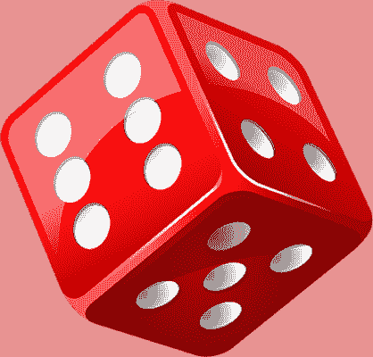

# 拼多多 2021 笔试真题集

## 1

多多君最近在研究某种数字组合：
定义为：每个数字的十进制表示中(0~9)，每个数位**各不相同**且各个数位之和等于 N。
满足条件的数字可能很多，找到其中的最小值即可。
多多君还有很多研究课题，于是多多君找到了你--未来的计算机科学家寻求帮助。数据范围： 
进阶：空间复杂度  ，时间复杂度 

本题知识点

Java 工程师 C++工程师 PHP 工程师 golang 工程师 前端工程师 安卓工程师 iOS 工程师 算法工程师 大数据开发工程师 信息技术岗 运维工程师 安全工程师 数据分析师 数据库工程师 游戏研发工程师 区块链 测试开发工程师 测试工程师 拼多多 2021

讨论

[deb2020](https://www.nowcoder.com/profile/869765990)

暴力法求得前 45 个值，存入数组中，时间复杂度 O（1）

```cpp
import java.util.*;

public class Main {
    public static void main(String[] args) {
        Scanner sc = new Scanner(System.in);
        int n = sc.nextInt();
        if (n < 10) {
            System.out.println(n);
            return;
        }
        if (n > 45) {
            System.out.println(-1);
            return;
        }
        String s = "1, 2, 3, 4, 5, 6, 7, 8, 9, 19, 29, 39, 49, 59, 69, 79, 89, 189, 289, 389, 489, 589, 689, 789, 1789, 2789, 3789, 4789, 5789, 6789, 16789, 26789, 36789, 46789, 56789, 156789, 256789, 356789, 456789, 1456789, 2456789, 3456789, 13456789, 23456789, 123456789";
        String[] strings = s.split(",\\s");
        System.out.println(strings[n - 1]);
    }
}
```

发表于 2021-05-26 21:44:20

* * *

[wwq+whu](https://www.nowcoder.com/profile/855662334)

```cpp
import java.util.*;

public class Main{
    public static void main(String[] args){
        Scanner scanner = new Scanner(System.in);
        int N = scanner.nextInt();
        //每个数位各不相同且各个数位之和等于 N——1+2+3+4+5+6+7+8+9 = 45，如果大于 45 一定会重复
        if(N > 45){
            System.out.println(-1);
            return;
        }
        //如果 N<10，可以直接返回数字本身
        if(N < 10){
            System.out.println(N);
            return;
        }
        //右侧数位越大，越能保证左侧数位越小，越能保证整个数最小
        int nums = 0;
        int digit = 0;
        for(int i = 9; i>0; i--){
            if(N != 0 && i <= N){
                N -= i;
                nums += (int)Math.pow(10,digit)*i;
                digit++;
            }
        }
        System.out.println(nums);
    }
}
```

发表于 2021-05-21 15:35:05

* * *

[电子柯基犬](https://www.nowcoder.com/profile/795468701)

```cpp
import java.util.Scanner;

/**
 * @author xq
 * @create 2021-05-20-15:13
 */
public class Main {
    public static void main(String[] args) {
        Scanner scanner = new Scanner(System.in);
        int N = scanner.nextInt();
        if (N > 45){
            System.out.println(-1);
            System.exit(0);
        }
        StringBuilder stringBuilder = new StringBuilder();
        for (int i = 9; i > 0; i--) {
            if (N>=i){
                N-=i;
                stringBuilder.insert(0,i);
            }
        }
        System.out.println(stringBuilder.toString());
    }
}

```

发表于 2021-06-06 21:31:24

* * *

## 2

多多君最近在研究字符串之间的变换，可以对字符串进行若干次变换操作:

1.  交换任意两个相邻的字符，代价为 0。
2.  将任意一个字符 a 修改成字符 b，代价为 |a - b|（绝对值）。

现在有两个长度相同的字符串 X 和 Y，多多君想知道，如果要将 X 和 Y 变成两个一样的字符串，需要的最少的代价之和是多少。

本题知识点

Java 工程师 C++工程师 PHP 工程师 golang 工程师 前端工程师 安卓工程师 iOS 工程师 算法工程师 大数据开发工程师 信息技术岗 运维工程师 安全工程师 数据分析师 数据库工程师 游戏研发工程师 区块链 测试开发工程师 测试工程师 拼多多 2021

讨论

[fbwwbf](https://www.nowcoder.com/profile/794037232)

因为交换字符没有代价，所以将两个字符串分别排序然后逐位比较计算代价即可

```cpp
#include <bits/stdc++.h>

using namespace std;

int main() {
    int n;
    cin >> n;
    string a, b;
    cin >> a >> b;
    sort(a.begin(), a.end());
    sort(b.begin(), b.end());
    int res = 0;
    for(int i = 0 ; i < n ; ++ i) {
        if(a[i] != b[i]) {
            int mu = abs(b[i] - a[i]);
            res += mu;
        }
    }

    cout<<res<<endl;
    return 0;
}
```

发表于 2021-05-10 19:52:56

* * *

[零葬](https://www.nowcoder.com/profile/75718849)

交换字符是不存在代价的，所以先将两个字符串的字符都修改为相同，然后再调整字符排列顺序就可以了，这个调整顺序的过程并不需要付出额外的代价。而字符串 x 中某个字符要修改为字符串 y 中的字符，代价最小的方式就是修改为排名相同的字符，即字符串 x 中字典序排名第 k 的字符修改为字符串 y 中字典序排名第 k 的字符，这样的修改才能使得整体代价最小，否则即使是这次修改为代价更小的字符，势必会造成另一个字符要付出更大的修改代价。

```cpp
import java.io.BufferedReader;
import java.io.InputStreamReader;
import java.io.IOException;
import java.util.Arrays;

public class Main {
    public static void main(String[] args) throws IOException {
        BufferedReader br = new BufferedReader(new InputStreamReader(System.in));
        int n = Integer.parseInt(br.readLine());
        char[] x = br.readLine().trim().toCharArray();
        char[] y = br.readLine().trim().toCharArray();
        Arrays.sort(x);
        Arrays.sort(y);
        int cost = 0;
        for(int i = 0; i < n; i++)
            cost += Math.abs(x[i] - y[i]);
        System.out.println(cost);
    }
}
```

scala 版，scala 运行得是真慢

```cpp
import scala.io.StdIn

object Main {
    def main(args: Array[String]): Unit = {
        val n = StdIn.readInt
        val x = StdIn.readLine.trim.toCharArray.sorted
        val y = StdIn.readLine.trim.toCharArray.sorted
        var cost = 0
        for(i <- x.indices) cost += math.abs(x(i).toInt - y(i).toInt)
        println(cost)
    }
}
```

编辑于 2021-08-27 12:35:08

* * *

[牛客 941408990 号](https://www.nowcoder.com/profile/941408990)

l = int(input())
a = sorted(list(input()))
b = sorted(list(input()))
c = 0
for i in range(len(a)):
    c += abs(ord(a[i])-ord(b[i]))
print(c)

编辑于 2021-09-24 22:40:21

* * *

## 3

多多路上从左到右有 N 棵树（编号 1～N），其中第 i 个颗树有和谐值 Ai。多多鸡认为，如果一段连续的树，它们的和谐值之和可以被 M 整除，那么这个区间整体看起来就是和谐的。
现在多多鸡想请你帮忙计算一下，满足和谐条件的区间的数量。

本题知识点

Java 工程师 C++工程师 PHP 工程师 golang 工程师 前端工程师 安卓工程师 iOS 工程师 算法工程师 大数据开发工程师 信息技术岗 运维工程师 安全工程师 数据分析师 数据库工程师 游戏研发工程师 区块链 测试开发工程师 测试工程师 拼多多 2021

讨论

[肥肥的哈哈](https://www.nowcoder.com/profile/60080625)

```cpp
#include <iostream>
#include <cstring>
using namespace std;
int main(){
    int n, m;
    cin>>n>>m;
    int arr[n];
    for (int i = 0; i < n; ++i){
        cin>>arr[i];
    }
    int map[m];//下标表示前缀和 % m 后的值，map[i]表示取余后值为 i 的个数；
    memset(map, 0, sizeof(map));
    map[0] = 1;//需要设置这个初始值，看下面代码就懂了
    long sum = 0;
    long ans = 0;
    for (int i = 0; i < n; ++i){
        sum += arr[i];
        int index = sum % m;
        ans += map[index]++;
    }
    cout<<ans<<endl;
    return 0;
}
```

 发表于 2021-05-12 16:38:57

* * *

[零葬](https://www.nowcoder.com/profile/75718849)

计算数组的前缀和，并以前缀和与 m 的余数 remain 为 key，余数为 remain 的前缀和个数为 value 构建 hash 表。由于相同余数的前缀区间任选两个所构成的中间区间一定和谐（因为大的那个前缀区间求和减去小的前缀区间求和，刚好把那个多出来的余数减掉了，因此中间区间求和一定能被 m 整除），所以对所有 key 的 value 求取 2 的组合数，把它们都加起来就能够得到所有和谐区间的总数。而 C²[n]=(n-1)*n/2 恰好就是 0~n-1 的高斯求和公式，因此在计算 value 值的时候我们就可以顺便通过累加把总数给求了，从而省掉之后遍历 hash 表所有 key 计算组合数的时间。

```cpp
import java.io.BufferedReader;
import java.io.InputStreamReader;
import java.io.IOException;

public class Main {
    public static void main(String[] args) throws IOException {
        BufferedReader br = new BufferedReader(new InputStreamReader(System.in));
        String[] params = br.readLine().split(" ");
        int n = Integer.parseInt(params[0]);
        int m = Integer.parseInt(params[1]);
        int[] map = new int[m];       // 除以 m 的余数为 0~m-1
        params = br.readLine().split(" ");
        int[] A = new int[n];
        map[0] = 1;
        long culSum = 0L;
        long count = 0L;
        for(int i = 0; i < n; i++) {
            A[i] = Integer.parseInt(params[i]);
            culSum += A[i];
            int remain = (int)(culSum % m);
            count += map[remain];
            map[remain] ++;
        }
        System.out.println(count);
    }
}
```

编辑于 2021-08-29 19:26:27

* * *

[寒冰-侠客](https://www.nowcoder.com/profile/442275737)

```cpp
#include <bits/stdc++.h>
typedef long long ll;
using namespace std;
ll n,m,a,sum=0,v[1005],ans;
int main()
{
    ios::sync_with_stdio(0),cin.tie(0);
    int i,j;
    cin>>n>>m;
    v[0]=1;/**< 用 v 数组统计每个位置前缀和余数的个数，相同余数的区间必然能被 m 整除 */
    for(i=1;i<=n;i++)
    {
        cin>>a;
        sum=(sum+a)%m;
        v[sum]++;
    }
    for(i=0;i<m;i++)/**< 相同余数任选 2 个都可以和谐区间 */
        ans+=v[i]*(v[i]-1)/2;
    cout<<ans;
    return 0;
}
```

发表于 2021-06-27 10:18:50

* * *

## 4

多多君拼团购买了 N 个骰子，为了方便后面进行活动，多多君需要将这些骰子进行分类。
两个骰子为同类的定义是：

```cpp
将其中一个骰子通过若干次上下、左右或前后翻转后，其与另一个骰子对应的 6 面数字均相等。
```

现在多多君想知道不同种类的骰子的数量分别有多少。

本题知识点

Java 工程师 C++工程师 PHP 工程师 golang 工程师 前端工程师 安卓工程师 iOS 工程师 算法工程师 大数据开发工程师 信息技术岗 运维工程师 安全工程师 数据分析师 数据库工程师 游戏研发工程师 区块链 测试开发工程师 测试工程师 拼多多 2021

讨论

[Yejf](https://www.nowcoder.com/profile/852469710)

我们取每个骰子：以 1 作为上面，然后得到侧边四面的 4 个数字的顺序。如果任意两个骰子的这个侧面 4 个数字顺序是一样的，那么这两个骰子就是同类。比如示例 2：骰子 1：123456，侧边的四面数字为 3546（或 5463、..）骰子 2：126534，侧边的四面数字为 6354（或 3546、..）骰子 3：123465，侧边的四面数字为 3645（或 6453、..）调整骰子 2 的侧边的四面数字顺序 3546，这就和骰子 1 一样了。（这里为了实现匹配是通过将四位数字转为 int 型整数，然后取不同顺序中最小的值）此外结合如下规律：1\. 骰子 6 面可以分为 3 对，每对两面，比如 12 、34 、562\. 骰子按对顺序调换不改变骰子顺序，比如 123456 与 561234 是同一类 3\. 举例：骰子为 123456， 1 位上面侧边四面为 35644. 举例：骰子为 345612， 1 位上面侧边四面为 35645\. 举例：骰子为 213456， 1 位上面侧边四面为 64536\. ...

```cpp
#include<bits/stdc++.h>
using namespace std;

int main() {
	int N; 
	cin >> N;
	unordered_map<int, int> um;
	for(int n=1; n<=N; ++n){
		int a[6];
		for(int i=0; i<6; ++i) cin >> a[i];
		int val = 0;
		for(int i=0; i<6; ++i) {
			if(a[i]==1) {
				if(i%2==0) 
					val = a[(i+2)%6]*1000 + a[(i+4)%6]*100 + a[(i+3)%6]*10 + a[(i+5)%6];
				else  
					val = a[(i+4)%6]*1000 + a[(i+2)%6]*100 + a[(i+3)%6]*10 + a[(i+1)%6];
				break;
			}
		}

		for(int i=0, tmp = val; i<3; ++i) {
			tmp = tmp/10 + (tmp%10*1000);
			val = min(val, tmp);
		}
		um[val]++;
	}

	vector<int> res;
	for(auto iter : um) res.push_back(iter.second);
	sort(res.begin(), res.end());

	cout << res.size() << endl;
	for(int i=res.size()-1; i>=0; --i) cout << res[i] << " ";
	return 0;	
}
```

编辑于 2021-05-18 21:32:42

* * *

[牛客 692333551 号](https://www.nowcoder.com/profile/692333551)

将每一个骰子按一定规律旋转，以 “前后左右上下” 的顺序来看一个骰子 12 34 56 前后固定旋转，可得到 12 34 56 12 56 4312 43 6512 65 34 同理，固定左右 56 34 2121 34 6565 34 1212 34 56 固定上下 43 12 5621 43 5643 12 5612 34 56 观察 “12 34 56” 变成 “12 56 43”，”12 65 34“也就是说每一次旋转固定一个面，剩余四个面交换位置，其中“一对”再交换或者 “12 34 56” 变成 “12 43 65” 其中“两对” 各自交换那么我们把骰子旋转到“最小”的样子 p1 代表前后，p2 代表左右, p3 代表上下让 p1 最小值 < p2 最小值 < p3 最小值让 p1[0]<p1[1] , p2[0]<p2[1]

```cpp
import collections
n = int(input())
counter = collections.Counter()
finger={}
res = []
for i in range(n):
    l=list(map(int,input().strip().split()))
    p1 = l[:2]
    p2 = l[2:4]
    p3 = l[4:]
    if min(p1)>min(p2):
        p1,p2=p2,p1[::-1]
    if min(p1)>min(p3):
        p1,p3=p3,p1[::-1]
    if min(p2)>min(p3):
        p2,p3=p3,p2[::-1]
    if p1[0]>p1[1]:
        p1,p3=p1[::-1],p3[::-1]
    if p2[0]>p2[1]:
        p2,p3=p2[::-1],p3[::-1]
    s = (p1[0],p1[1],p2[0],p2[1],p3[0],p3[1])
    if s not in finger:
        finger[s]=len(res)
        res.append(1)
    else:
        res[finger[s]]+=1
print(len(res))
res=map(str,sorted(res,reverse=True))
print(' '.join(res))
```

编辑于 2021-05-22 11:26:53

* * *

[冰.夏](https://www.nowcoder.com/profile/361424671)

对于每个筛子都搜索一趟搞到对应的那个字典序最小的作为 key，开 map<KeyType, int> cnt 计数即可（此处 KeyType 为 vector<int>）本地跑了下 6 的全排列，每个排列通过搜索都能得到 24 中不同的排列，即每 24 种排列视为 1 种，总共 6！24 = 30 总不同的筛子（具体见注释掉的那段代码）

```cpp
#include <bits/stdc++.h>
using namespace std;

const string dirs[] = {"上","下","左","右","前","后"}; // 默认的顺序
map<string, int> s_idx; // 维护字符串在 dirs 中的位置

/* 3 种不同的旋转方式：
**   例如第一种为
**   [上 -> 右 ], [右 -> 下], [下 -> 左], [左 -> 上]  
**   即        上 -> 右 -> 下 -> 左 -> ...
*/
const string turn[3][4] = {
	{"上","右","下","左"}, /*前后不动*/
	{"上","前","下","后"}, /*左右不动*/
	{"前","右","后","左"}  /*上下不动*/
};

vector<vector<int> > get_nexts(vector<int> vv) {
	/**
	 * 获取 vv 的 3 个下一种状态
	 */
	vector<vector<int> > ret;
	for (int i = 0; i < 3; ++i){
		auto v = vv;
		/* 完成“旋转”操作*/
		int t = v[s_idx[turn[i][0]]];
		for (int j = 1; j < 4; ++j){
			v[s_idx[turn[i][j-1]]] = v[s_idx[turn[i][j]]];
		}
		v[s_idx[turn[i][3]]] = t;
		ret.push_back(v);
	}

	return ret;
}

ostream & operator << (ostream &cout, vector<int> v) {
	cout << "[";
	for ( auto i : v ) {
		cout << i << " ";
	}
	cout << "]";

}

vector<int> get_min(vector<int> v) {
	/**
	 * 搜索一趟，获取 v 通过旋转可达的最小的
	 */
	map<vector<int>, bool> vis;
	queue<vector<int> > q;
	vis[v] = 1;
	q.push(v);
	vector<int> ret = v;
	while (q.size()) {
		vector<int> curr = q.front(); q.pop();
		if ( curr < ret ) {
			ret = curr;
		}
		auto nexts = get_nexts(curr);
		for ( auto next : nexts ) {
			if ( vis.find(next)==vis.end() ) {
				vis[next] = 1;
				q.push(next);
			}
		}
	}
	return ret;
}

int main(int argc, char const *argv[]){

	for (int i = 0; i < 6; ++i){
		s_idx[dirs[i]] = i;
	}

/*
	vector<int> v = {1,2,3,4,5,6};
	set<vector<int>> s;
	do{
		s.insert(get_min(v));
	}while(next_permutation(v.begin(), v.end()));
	for ( auto& item : s ) {
		for(auto i : item ) {
			cout << i << " ";
		}
		cout << "" << endl;
	}
	clog << "s.size() = " << s.size() << endl; //log
	return 0;
//	*/
	int n;
	cin>>n;
	map<vector<int>, int> mp;
	for ( int i = 0; i < n; ++i ) {
		vector<int> v;
		for ( int i = 0; i < 6; ++i ) {
			int x;
			cin>>x;
			v.push_back(x);
		}
		mp[get_min(v)]++;
	}
	vector<int> ans;
	for ( auto &item : mp ) {
		ans.push_back(item.second);
	}
	sort(ans.begin(), ans.end(), 
		[](int a, int b) -> bool {return a>b;}); // 降序
	cout << ans.size() << endl;
	for ( auto i : ans ) {
		cout << i << " ";
	}

	return 0;
}
```

发表于 2021-05-26 20:25:20

* * *