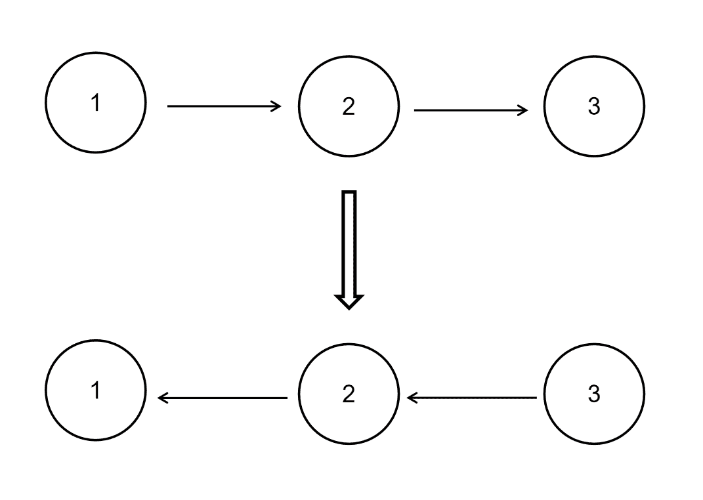

# 【2021】小米秋招 IOS 方向第一场笔试

## 1

MVVM 优点有哪些?

正确答案: A B C D   你的答案: 空 (错误)

```cpp
低耦合
```

```cpp
可重用性
```

```cpp
独立开发
```

```cpp
可测试
```

本题知识点

iOS 工程师 小米 2021

讨论

[陈超 201910180648642](https://www.nowcoder.com/profile/611417946)

独立开啊和测试指的是啥？

发表于 2021-06-20 20:08:34

* * *

## 2

Array, Dictionary 集合类型，以下说法正确的：

正确答案: A B C   你的答案: 空 (错误)

```cpp
filter 函数就是选择集合中符合条件的元素，过滤掉不符合条件的元素
```

```cpp
reduce 将一个集合中的所有元素组合起来，生成一个新的值并返回该值
```

```cpp
 map 遍历一个集合对象，并可以将相同的操作应用于该对象的每一个元素
```

本题知识点

iOS 工程师 小米 2021

讨论

[陈超 201910180648642](https://www.nowcoder.com/profile/611417946)

IT 老人表示 swift 还没用过，filter 和 reduce 是啥东东?

发表于 2021-06-20 20:09:22

* * *

## 3

以下描述正确的：

正确答案: A B C   你的答案: 空 (错误)

```cpp
guard 关键字必须使用在函数中
```

```cpp
guard 关键字必须和 else 同时出现
```

```cpp
guard 关键字只有条件为 false 的时候才能走 else 语句 相反执行后边语句
```

本题知识点

iOS 工程师 小米 2021

讨论

[陈超 201910180648642](https://www.nowcoder.com/profile/611417946)

涨知识了~

发表于 2021-06-20 20:09:43

* * *

## 4

#import 跟 #include 有什么区别

正确答案: A C   你的答案: 空 (错误)

```cpp
使用#import 头文件会自动只导入一次，不会重复导入
```

```cpp
使用#import 头文件会自动只导入一次，会重复导入
```

```cpp
使用#include 头文件可能会重复导入
```

```cpp
使用#include 头文件不会重复导入
```

本题知识点

iOS 工程师 小米 2021

## 5

Swift 比 Objective-C 有什么优势

正确答案: A B C D   你的答案: 空 (错误)

```cpp
 Swift 容易阅读，语法和文件结构简易化
```

```cpp
Swift 更易于维护，文件分离后结构更清晰
```

```cpp
Swift 更加安全，它是类型安全的语言
```

```cpp
Swift 代码更少，简洁的语法，可以省去大量冗余代码
```

本题知识点

iOS 工程师 小米 2021

讨论

[陈超 201910180648642](https://www.nowcoder.com/profile/611417946)

swifit 啥都好，难道 oc 就类型不安全了？

发表于 2021-06-20 20:11:39

* * *

## 6

下面四种内部排序算法中哪一种在最差情况下时间复杂度最高?

正确答案: B   你的答案: 空 (错误)

```cpp
快速排序
```

```cpp
冒泡排序
```

```cpp
堆排序
```

```cpp
归并排序
```

本题知识点

iOS 工程师 小米 2021

## 7

以下代码是否会 print
let flavor = "apple and mango" 
if let taste = flavor as? String {
       print("We added \(taste).") 
}

正确答案: B   你的答案: 空 (错误)

```cpp
不能
```

```cpp
能
```

本题知识点

iOS 工程师 小米 2021

## 8

下面关于线程管理错误的是

正确答案: A   你的答案: 空 (错误)

```cpp
可以在子线程中修改 UI 元素
```

```cpp
NSOperationQueue 是比 NSthread 更高层的封装
```

```cpp
GCD 可以根据不同优先级分配线程
```

本题知识点

iOS 工程师 小米 2021

讨论

[陈超 201910180648642](https://www.nowcoder.com/profile/611417946)

NSOperationQueue 是对 GCD 的封装，做的时候就很怀疑了。

发表于 2021-06-20 20:14:24

* * *

## 9

以下代码是否正确 

let names = ["Taylor", "Paul", "Adele"]
let lengthOfLast = names.last?.count?  

正确答案: B   你的答案: 空 (错误)

```cpp
正确
```

```cpp
错误
```

本题知识点

iOS 工程师 小米 2021

讨论

[wah7410](https://www.nowcoder.com/profile/360965731)

数组最后一个 String 的数量，哪里错误了？？

发表于 2021-07-21 14:20:01

* * *

## 10

断点续传需要在请求头中添加的控制续传最重要的关键字

正确答案: A   你的答案: 空 (错误)

```cpp
range
```

```cpp
length
```

```cpp
type
```

```cpp
size
```

本题知识点

iOS 工程师 小米 2021

## 11

以下代码是 swift 的有效代码吗？     
         let learnSwift = { 
                    print("Closures are like functions")   
         }
         learnSwift()

正确答案: A   你的答案: 空 (错误)

```cpp
 正确
```

```cpp
错误
```

本题知识点

iOS 工程师 小米 2021

讨论

[陈超 201910180648642](https://www.nowcoder.com/profile/611417946)

swift 还能这样玩，长知识了

发表于 2021-06-20 20:15:02

* * *

## 12

单例类 NSNotificationCenter 提供信息广播通知，它采用的是观察者模式的通知机制

正确答案: A   你的答案: 空 (错误)

```cpp
对
```

```cpp
错
```

本题知识点

iOS 工程师 小米 2021

## 13

关于元组描述正确选项

正确答案: A   你的答案: 空 (错误)

```cpp
无法更改元组数据的类型
```

```cpp
元组只能容纳字符串
```

本题知识点

iOS 工程师 小米 2021

## 14

@property 中哪些属性关键字以及作用的描述是正确的？

正确答案: D   你的答案: 空 (错误)

```cpp
nonatomic :原子操作，线程安全，效率高。
```

```cpp
 strong:强持有特性，会对引用计数+1，可修饰基本类型。
```

```cpp
assign:一般用于基本数据类型，也可修饰 NSObject 类型，并不会有问题。
```

```cpp
 copy:拷贝特性，可修饰 NSObject 类型以及 block。
```

本题知识点

iOS 工程师 小米 2021

讨论

[陈超 201910180648642](https://www.nowcoder.com/profile/611417946)

copy 不是只能修饰有 mutable 形式的对象吗？恕我孤陋寡闻了~

发表于 2021-06-20 20:16:36

* * *

## 15

关于 lazy 的描述正确的选项是

正确答案: A   你的答案: 空 (错误)

```cpp
 lazy 是一种性能优化
```

```cpp
 lazy 可以使用闭包语法
```

本题知识点

iOS 工程师 小米 2021

## 16

解释深拷贝与浅拷贝

你的答案

本题知识点

iOS 工程师 小米 2021

## 17

 什么情况使用 weak 关键字，相比 assign 有什么不同？

你的答案

本题知识点

iOS iOS 工程师 小米 2021

讨论

[hahani](https://www.nowcoder.com/profile/873404)

什么情况使用 weak 关键字？1.在 ARC 中,在有可能出现循环引用的时候,往往要通过让其中一端使用 weak 来解决,比如:delegate***属性 2.自身已经对它进行一次强引用,没有必要再强引用一次,此时也会使用 weak,自定义 IBOutlet 控件属性一般也使用 weak；当然，也可以使用 strong。在下文也有论述：《IBOutlet 连出来的视图属性为什么可以被设置成 weak?不同点：1\. weak  此特质表明该属性定义了一种“非拥有关系” (nonowning relationship)。为这种属性设置新值时，设置方法既不保留新值，也不释放旧值。此特质同 assign 类似， 然而在属性所指的对象遭到摧毁时，属性值也会清空(nil out)。 而  assign  的“设置方法”只会执行针对“纯量类型” (scalar type，例如 CGFloat 或 NSlnteger 等)的简单赋值操作。2.assigin 可以用非 OC 对象,而 weak 必须用于 OC 对象

发表于 2017-04-30 14:46:49

* * *

## 18

通知和代理有什么区别

你的答案

本题知识点

iOS 工程师 小米 2021

## 19

Bounds 和 Frame 有哪些区别

你的答案

本题知识点

iOS 工程师 小米 2021

## 20

UIView 和 CALayer 是什么关系？

你的答案

本题知识点

iOS 工程师 小米 2021

## 21

给定一个单链表的头结点 pHead(该头节点是有值的，比如在下图，它的 val 是 1)，长度为 n，反转该链表后，返回新链表的表头。数据范围： 要求：空间复杂度  ，时间复杂度  。如当输入链表{1,2,3}时，经反转后，原链表变为{3,2,1}，所以对应的输出为{3,2,1}。以上转换过程如下图所示：

本题知识点

链表 *讨论

[writezen](https://www.nowcoder.com/profile/919978)

```cpp
public class So
```

  查看全部)

编辑于 2015-06-19 16:46:40

* * *

[我就用这个名字了](https://www.nowcoder.com/profile/548657)

Java   循环操作   详细思路

```cpp
public class Solution {
    public ListNode ReverseList(ListNode head) {

        if(head==null)
            return null;
        //head 为当前节点，如果当前节点为空的话，那就什么也不做，直接返回 null；
    	ListNode pre = null;
        ListNode next = null;
        //当前节点是 head，pre 为当前节点的前一节点，next 为当前节点的下一节点
        //需要 pre 和 next 的目的是让当前节点从 pre->head->next1->next2 变成 pre<-head next1->next2
        //即 pre 让节点可以反转所指方向，但反转之后如果不用 next 节点保存 next1 节点的话，此单链表就此断开了
        //所以需要用到 pre 和 next 两个节点
        //1->2->3->4->5
        //1<-2<-3 4->5
        while(head!=null){
            //做循环，如果当前节点不为空的话，始终执行此循环，此循环的目的就是让当前节点从指向 next 到指向 pre
            //如此就可以做到反转链表的效果
            //先用 next 保存 head 的下一个节点的信息，保证单链表不会因为失去 head 节点的原 next 节点而就此断裂
            next = head.next;
            //保存完 next，就可以让 head 从指向 next 变成指向 pre 了，代码如下
            head.next = pre;
            //head 指向 pre 后，就继续依次反转下一个节点
            //让 pre，head，next 依次向后移动一个节点，继续下一次的指针反转
            pre = head;
            head = next;
        }
        //如果 head 为 null 的时候，pre 就为最后一个节点了，但是链表已经反转完毕，pre 就是反转后链表的第一个节点
        //直接输出 pre 就是我们想要得到的反转后的链表
        return pre;
    }
}
```

编辑于 2021-01-20 17:13:50

* * *

[搁浅的鱼儿](https://www.nowcoder.com/profile/961875)

```cpp
//第一种方法是：非递归方法
/*
struct ListNode {
	int val;
	struct ListNode *next;
	ListNode(int x) :
			val(x), next(NULL) {
	}
};*/
class Solution {
public:
    ListNode* ReverseList(ListNode* pHead) {

        if(pHead==NULL) return NULL;//注意程序鲁棒性

        ListNode* pNode=pHead;//当前指针
        ListNode* pReverseHead=NULL;//新链表的头指针
        ListNode* pPrev=NULL;//当前指针的前一个结点

        while(pNode!=NULL){//当前结点不为空时才执行
            ListNode* pNext=pNode->next;//链断开之前一定要保存断开位置后边的结点

            if(pNext==NULL)//当 pNext 为空时，说明当前结点为尾节点
                pReverseHead=pNode;

            pNode->next=pPrev;//指针反转
            pPrev=pNode;
            pNode=pNext;
        }
        return pReverseHead;
    }
}

//第二种方法是：递归方法 /*
struct ListNode {
	int val;
	struct ListNode *next;
	ListNode(int x) :
			val(x), next(NULL) {
	}
};*/
class Solution {
public:
    ListNode* ReverseList(ListNode* pHead) {
		//如果链表为空或者链表中只有一个元素	
        if(pHead==NULL||pHead->next==NULL) return pHead;

		//先反转后面的链表，走到链表的末端结点
        ListNode* pReverseNode=ReverseList(pHead->next);

        //再将当前节点设置为后面节点的后续节点
        pHead->next->next=pHead;
        pHead->next=NULL;

        return pReverseNode;

    }
};
```

递归的方法其实是非常巧的，它利用递归走到链表的末端，然后再更新每一个 node 的 next 值 ，实现链表的反转。而 newhead 的值没有发生改变，为该链表的最后一个结点，所以，反转后，我们可以得到新链表的 head。

注意关于链表问题的常见注意点的思考：

1、如果输入的头结点是 NULL，或者整个链表只有一个结点的时候

2、链表断裂的考虑

编辑于 2016-06-27 15:52:55

* * *

## 22

编写一个程序，将谁的字符串按逆序存放后输出。

你的答案

本题知识点

C++ iOS 工程师 小米 2021

讨论

[赞花婆](https://www.nowcoder.com/profile/5994168)

设计函数 fun 将字符串的所有  查看全部)

发表于 2018-05-07 10:52:54

* * *

[hzy1721](https://www.nowcoder.com/profile/5376314)

```cpp
string reverseString(string s) {
    reverse(s.begin(), s.end());
    return s;
}
```

发表于 2022-01-15 16:17:50

* * *

[牛客 829065062 号](https://www.nowcoder.com/profile/829065062)

#define char elementType#define MAXSIZE 1000typedef struct Stack{    elementType data[MAXSIZE];
    int top;
}typedef struct Strack *pStack;pStack readAndPrint(pStack s, int length){    char a;
    while(length){
        scarf(%c,&a);        s.data[++s.top] = a;        length--;
    }
    while(s.top>= 0){
        print("%c",s.data[s.top--]);
    }}

发表于 2021-09-26 22:37:13

* * **