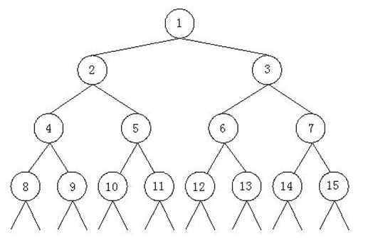
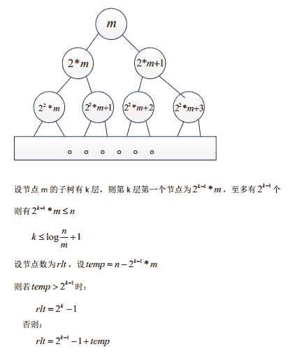

# 【2021】小米秋招测试开发方向第一场笔试

## 1

mysql 数据库有选课表 learn(student_id int, course_id int)，字段分别表示学号和课程编号，现在想获取每个学生所选课程的个数信息，请问如下的 sql 语句正确的是

正确答案: C   你的答案: 空 (错误)

```cpp
select student_id, sum(course_id) from learn
```

```cpp
select student_id, count(course_id) from learn
```

```cpp
select student_id, count(course_id) from learn group by student_id
```

```cpp
 select student_id, sum(course_id) from learn group by student_id
```

本题知识点

测试开发工程师 小米 2021

讨论

[牛客 142244323 号](https://www.nowcoder.com/profile/142244323)

Count 为数组函数中统计个数的函数，要求每个学生所选的课程数，所以要按照学生分组

发表于 2021-08-24 21:43:00

* * *

[Zauriel](https://www.nowcoder.com/profile/739991190)

C

发表于 2021-07-16 23:40:51

* * *

## 2

给定下列程序，那么执行 printf("%d\n", foo(12, 20));的输出结果是 ________。
int foo(int x, int y){
   if (x <= 0 || y <= 0)
       return 1;
   return 3 * foo( x-6, y/2 );
}

正确答案: A   你的答案: 空 (错误)

```cpp
9
```

```cpp
13
```

```cpp
5
```

```cpp
18
```

本题知识点

测试开发工程师 小米 2021

讨论

[牛客 923613240 号](https://www.nowcoder.com/profile/923613240)

3*3=9

发表于 2021-08-31 09:34:23

* * *

## 3

假设下列字符码中有奇偶校验位，但没有数据错误，采用偶校验的字符码是

正确答案: C   你的答案: 空 (错误)

```cpp
11010110
```

```cpp
 11000001
```

```cpp
11001001
```

```cpp
11001011
```

本题知识点

测试开发工程师 小米 2021

讨论

[bingstarstar](https://www.nowcoder.com/profile/50292178)

根据被传输的一组[二进制代码](https://baike.baidu.com/item/%E4%BA%8C%E8%BF%9B%E5%88%B6%E4%BB%A3%E7%A0%81/4879654)的数位中“1”的个数是奇数或偶数来进行校验，采用奇数的称为[奇校验](https://baike.baidu.com/item/%E5%A5%87%E6%A0%A1%E9%AA%8C/1684279)，反之，称为偶校验

发表于 2021-07-06 15:51:03

* * *

## 4

（）是调用者发出消息后，必须等待消息处理结束返回后，才能进行后续操作。

正确答案: A   你的答案: 空 (错误)

```cpp
同步消息
```

```cpp
返回消息
```

```cpp
异步消息
```

```cpp
简单消息
```

本题知识点

算法工程师 金山 WPS 运维工程师 2020 测试开发工程师 小米 2021

## 5

给定一个 m 行 n 列的整数矩阵（如下面矩阵），每行从左到右和每列从上到下都是有序的。判断一个整数 k 是否在矩阵中出现的最优算法，在最坏情况下的时间复杂度是 ________。
1   5   7   9
4   6   10  15
8   11  12  19
14  16  18  21

正确答案: D   你的答案: 空 (错误)

```cpp
O(log(m*n))
```

```cpp
O(log(m+n))
```

```cpp
  O(m*n)
```

```cpp
O(m+n)
```

本题知识点

测试开发工程师 小米 2021

## 6

在数组 A 中 a[0]到 a[5]中分别存放一列数{5，4，0，3，1，2}，使用简单选择排序法对其按照升序进行排序，第 0 趟比较后，进行交换的是

正确答案: B   你的答案: 空 (错误)

```cpp
a[3]与 a[2]
```

```cpp
a[0]与 a[2]
```

```cpp
a[0]与 a[1]
```

```cpp
a[0]与 a[3]
```

本题知识点

测试开发工程师 小米 2021

## 7

一组记录排序码为(5 11 7 2 3 17),则利用堆排序方法建立的初始堆为

正确答案: B   你的答案: 空 (错误)

```cpp
(17 11 7 5 3 2)
```

```cpp
(17 11 7 2 3 5)
```

```cpp
(17 7 11 3 5 2)
```

```cpp
(17 7 11 3 2 5)
```

本题知识点

测试开发工程师 小米 2021

讨论

[Spectre_](https://www.nowcoder.com/profile/492439051)

每个位置的数跟自己的左右两个孩子比，选其中最大的跟自己交换，从最后一个数开始（1）17,3,2 没有左右孩子，不换（2）7 的左孩子 17 比 7 大，交换。[5,11,17,2,3,7]（3）11 的左右孩子都不比自己大，不换（4）5 的左右孩子都比自己大，与最大的右孩子 17 交换，[17,11,5,2,3,7]（5）来到新位置的 5 继续跟自己的左右孩子比较，左孩子 7 比 5 大，交换[17,11,7,2,3,5]（6）所有数都已经比较完毕，最后答案[17,11,7,2,3,5]，选 B

发表于 2021-09-10 23:52:36

* * *

## 8

一个黑色袋子中装有 5 个红球，5 个蓝球，5 个黄球，从中抽取三次，每次抽一个球，取完不放回，则每种颜色球各得一个的概率是（）

正确答案: D   你的答案: 空 (错误)

```cpp
1/3
```

```cpp
1/5
```

```cpp
12/91
```

```cpp
25/91
```

本题知识点

测试开发工程师 小米 2021

讨论

[牛客 49494733 号](https://www.nowcoder.com/profile/49494733)

共 15 个球，第一次可以任意取。第二次从剩下的 14 个里面抽剩下的两种颜色，概率为 10/14。第三次从剩下的 13 个里面抽剩下的一种颜色，概率为 5/13。答案为 10/14 * 5/13=25/91

发表于 2021-09-01 13:09:28

* * *

[牛客 880227755 号](https://www.nowcoder.com/profile/880227755)

先讨论分子，拿 3 次这三个颜色的排序方法有 3*2*1=6 种，每次取对应颜色的球有 5 个选择，所以分子是 3*2*1*5*5*5，分母就是 15*14*13，答案是 25/91

发表于 2021-07-31 15:46:20

* * *

## 9

从下面的符号中选择计算优先级最高的

正确答案: B   你的答案: 空 (错误)

```cpp
等价类划分法
```

```cpp
基本路径覆盖法
```

```cpp
边界值分析法
```

```cpp
因果图法
```

本题知识点

测试开发工程师 小米 2021

## 10

在 linux 环境下，查看日志文件(比如 t.log)的最后 100 行数据的正确方式是

正确答案: C   你的答案: 空 (错误)

```cpp
cat -100 a.log
```

```cpp
mv -100 t.log
```

```cpp
tail -100 t.log
```

```cpp
grep -100 a.log
```

本题知识点

测试开发工程师 小米 2021

## 11

下面这个程序执行后会有什么错误或效果：
   #define MAX 255
   int main()
   {
     unsigned char A[MAX], i;
     for(i= 0; i<=MAX; i++)
       A[i] = i;
   }

正确答案: C D   你的答案: 空 (错误)

```cpp
栈溢出
```

```cpp
 内存泄漏
```

```cpp
 数组越界
```

```cpp
死循环
```

本题知识点

测试开发工程师 小米 2021

讨论

[╱╱过路人](https://www.nowcoder.com/profile/9822319)

变量 i 为无符号字符型，取值范围 0-255

发表于 2021-07-26 09:44:04

* * *

[不知北山向阳](https://www.nowcoder.com/profile/3549519)

A[255]不越界了吗？不会抛异常？为啥会死循环？

发表于 2021-08-25 23:08:35

* * *

## 12

下面是折半查找的实现，data 是按升序排列的数据，x 是查找下标，y 是查找上标，v 是查找的数值，返回 v 在 data 的索引，若没找到返回-1。代码不正确的是
public int bsearch(int [] data, int x, int y, int v){
        int m;
        while(x<y){  //1
        m = x + (y - x)/2;   //2
        if(data[m] > v)  y = m;   //3
}
        return -1;    //4
}

正确答案: A C   你的答案: 空 (错误)

```cpp
1
```

```cpp
2
```

```cpp
3
```

```cpp
4
```

本题知识点

测试开发工程师 小米 2021

讨论

[aoutom](https://www.nowcoder.com/profile/396012519)

这根本没法折半啊，这不是哪行错了的问题吧，这逻辑都不全

发表于 2021-08-20 10:00:28

* * *

## 13

声明语句为 int a[3][4];下列表达式中与数组元素 a[2][1]等价的是

正确答案: A D   你的答案: 空 (错误)

```cpp
 *(a[2]+1)
```

```cpp
 *(a[1]+2)
```

```cpp
a[9]
```

```cpp
 *(*(a+2)+1)
```

本题知识点

测试开发工程师 小米 2021

讨论

[思无涯-伊奥勒姆](https://www.nowcoder.com/profile/291888045)

求解

发表于 2022-02-22 14:19:24

* * *

[月亮 z](https://www.nowcoder.com/profile/235075514)

求解

发表于 2021-10-20 00:11:11

* * *

## 14

Java 语音中下面属于 Runtime Exception 的异常是

正确答案: A B C D   你的答案: 空 (错误)

```cpp
 ILLegalArgumentException
```

```cpp
NullPointerException
```

```cpp
BufferUnderflowException
```

```cpp
ArithmeticException
```

本题知识点

测试开发工程师 小米 2021

## 15

算法的基本要素包括

正确答案: B C   你的答案: 空 (错误)

```cpp
**对硬件的基本要求**
```

```cpp
对数据对象的运算和操作
```

```cpp
算法的控制结构
```

```cpp
算法的数据机构
```

本题知识点

测试开发工程师 小米 2021

## 16

以下对索引的描述正确的是

正确答案: B C D   你的答案: 空 (错误)

```cpp
每个表都必须具有一个主键索引
```

```cpp
索引对数据库插入的效率有一定影响
```

```cpp
可以在多个列上建立联合索引
```

```cpp
对于数据重复度高，值范围有限的列如果建索引建议使用位图索引
```

本题知识点

测试开发工程师 小米 2021

## 17

关于 HTTP 状态码说法正确的是

正确答案: B C D   你的答案: 空 (错误)

```cpp
302 表示永久性重定向
```

```cpp
 403 表示禁止访问
```

```cpp
200 表示正常返回信息
```

```cpp
404 表示未找到资源
```

本题知识点

测试开发工程师 小米 2021

讨论

[Eip3C](https://www.nowcoder.com/profile/857148093)

302 临时移动。与 301 类似。但资源只是临时被移动。客户端应继续使用原有 URI

发表于 2021-08-27 17:02:46

* * *

## 18

TCP/IP 包含哪些层

正确答案: A B D   你的答案: 空 (错误)

```cpp
网络接口层
```

```cpp
网络层
```

```cpp
物理层
```

```cpp
应用层
```

本题知识点

测试开发工程师 小米 2021

## 19

关于虚拟内存说法正确的是

正确答案: B C   你的答案: 空 (错误)

```cpp
虚拟内存就是 swap 空间
```

```cpp
虚拟内存隔离了各个进程内存空间
```

```cpp
虚拟内存可以防止应用程序直接访问物理地址
```

```cpp
虚拟内存就是物理内存
```

本题知识点

测试开发工程师 小米 2021

## 20

Unix 系统中，哪些可以用于进程间的通信

正确答案: A B C D   你的答案: 空 (错误)

```cpp
Socket
```

```cpp
共享内存
```

```cpp
消息队列
```

```cpp
信号量
```

本题知识点

测试开发工程师 小米 2021

讨论

[月亮 z](https://www.nowcoder.com/profile/235075514)

摘抄: unix 进程间的通信方式 （1）管道（Pipe）：管道可用于具有亲缘关系进程间的通信，允许一个进程和另一个与它有共同祖先的进程之间进行通信。 （2）命名管道（named pipe）：命名管道克服了管道没有名字的限制，因此，除具有管道所具有的功能外，它还允许无亲缘关系进程间的通信。命名管道在文件系统中有对应的文件名。命名管道通过命令 mkfifo 或系统调用 mkfifo 来创建。 （3）信号（Signal）：信号是比较复杂的通信方式，用于通知接受进程有某种事件发生，除了用于进程间通信外，进程还可以发送信号给进程本身；linux 除了支持 Unix 早期信号语义函数 sigal 外，还支持语义符合 Posix.1 标准的信号函数 sigaction（实际上，该函数是基于 BSD 的，BSD 为了实现可靠信号机制，又能够统一对外接口，用 sigaction 函数重新实现了 signal 函数）。 （4）消息（Message）队列：消息队列是消息的链接表，包括 Posix 消息队列 system V 消息队列。有足够权限的进程可以向队列中添加消息，被赋予读权限的进程则可以读走队列中的消息。消息队列克服了信号承载信息量少，管道只能承载无格式字节流以及缓冲区大小受限等缺 （5）共享内存：使得多个进程可以访问同一块内存空间，是最快的可用 IPC 形式。是针对其他通信机制运行效率较低而设计的。往往与其它通信机制，如信号量结合使用，来达到进程间的同步及互斥。 （6）内存映射（mapped memory）：内存映射允许任何多个进程间通信，每一个使用该机制的进程通过把一个共享的文件映射到自己的进程地址空间来实现它。 （7）信号量（semaphore）：主要作为进程间以及同一进程不同线程之间的同步手段。 （8）套接口（Socket）：更为一般的进程间通信机制，可用于不同机器之间的进程间通信。起初是由 Unix 系统的 BSD 分支开发出来的，但现在一般可以移植到其它类 Unix 系统上：Linux 和 System V 的变种都支持套接字。

发表于 2021-10-20 00:09:10

* * *

## 21

    如上所示，由正整数 1，2，3……组成了一颗特殊二叉树。我们已知这个二叉树的最后一个结点是 n。现在的问题是，结点 m 所在的子树中一共包括多少个结点。     比如，n = 12，m = 3 那么上图中的结点 13，14，15 以及后面的结点都是不存在的，结点 m 所在子树中包括的结点有 3，6，7，12，因此结点 m 的所在子树中共有 4 个结点。

本题知识点

基础数学 树 思维 测试开发工程师 小米 2021

讨论

[|讨厌鬼|](https://www.nowcoder.com/profile/2737780)

```cpp
#include<stdio.h>
int countNode(int m,int n){
    if(m>n) return 0;
    return countNode(2*m,n)+countNode(2*m+1,n)+1;
} 
int main(){
    int m,n;
    while(scanf("%d%d",&m,&n)!=EOF){
        if(m==0&&n==0) break;
        printf("%d\n",countNode(m,n));
    }
    return 0;
}

```

编辑于 2019-03-08 12:27:05

* * *

[啥](https://www.nowcoder.com/profile/811262)



```cpp
#include <iostream>
#include <math.h>

using namespace std;

int getRlt(int n, int m)
{
    int rlt;
    int k = int(log(n*1.0/m)/log(2.0)) + 1;
    int temp = n - m*pow(2, k-1) + 1;
    if(temp > pow(2, k-1)) {
        rlt = pow(2, k) - 1;
    } else {
        rlt = pow(2, k-1) -1 + temp;
    }
    return rlt;
}

int main()
{
    int m, n;
    while(cin >> m >> n) {
        if(m==0 && n==0) break;
        cout << getRlt(n, m) << endl;
    }
    return 0;
}  
```

发表于 2016-05-02 11:13:57

* * *

[Benson666](https://www.nowcoder.com/profile/435448)

```cpp
#include <iostream>
using namespace std;
int res=0;
void add(int x, int last){
    if(x>last) return;
    res++;
    add(2*x, last);
    add(2*x+1, last);
}
int main(){
    int m,n;
    while(cin>>m>>n){
        add(m,n);
        cout<<res<<endl;
    }
}

```

发表于 2018-03-20 14:19:14

* * *

## 22

扑克牌游戏大家应该都比较熟悉了，一副牌由 54 张组成，含 3~A，2 各 4 张，小王 1 张，大王 1 张。牌面从小到大用如下字符和字符串表示（其中，小写 joker 表示小王，大写 JOKER 表示大王）:)
3 4 5 6 7 8 9 10 J Q K A 2 joker JOKER
输入两手牌，两手牌之间用“-”连接，每手牌的每张牌以空格分隔，“-”两边没有空格，如：4 4 4 4-joker JOKER
请比较两手牌大小，输出较大的牌，如果不存在比较关系则输出 ERROR

基本规则：
（1）输入每手牌可能是个子，对子，顺子（连续 5 张），三个，炸弹（四个）和对王中的一种，不存在其他情况，由输入保证两手牌都是合法的，顺子已经从小到大排列；
（2）除了炸弹和对王可以和所有牌比较之外，其他类型的牌只能跟相同类型的存在比较关系（如，对子跟对子比较，三个跟三个比较），不考虑拆牌情况（如：将对子拆分成个子）
（3）大小规则跟大家平时了解的常见规则相同，个子，对子，三个比较牌面大小；顺子比较最小牌大小；炸弹大于前面所有的牌，炸弹之间比较牌面大小；对王是最大的牌；
（4）输入的两手牌不会出现相等的情况。

答案提示：
（1）除了炸弹和对王之外，其他必须同类型比较。
（2）输入已经保证合法性，不用检查输入是否是合法的牌。
（3）输入的顺子已经经过从小到大排序，因此不用再排序了.数据范围：保证输入合法

本题知识点

字符串 *查找 *模拟 测试开发工程师 小米 2021** **讨论

[Caleb](https://www.nowcoder.com/profile/142696)

```cpp
//“输入每手牌可能是个子，对子，顺子（连续 5 张），三个，炸弹（四个）和对王中的一种，
//不存在其他情况，由输入保证两手牌都是合法的，顺子已经从小到大排列“
//这句规则让牌面类型的确定和大小的比较直接可以转换为牌个数的比较了，这是解决测试问题的捷径！
//所以一定要善于利用题目已知条件！！！
#include <iostream>
#include <string>
#include <algorithm>
using namespace std;
int main(){
	string line;
	while(getline(cin,line)){
		if(line.find("joker JOKER")!=-1)
			cout<<"joker JOKER"<<endl;
		else{
			int dash=line.find('-');
			string car1=line.substr(0,dash);
			string car2=line.substr(dash+1);
			int c1=count(car1.begin(),car1.end(),' ');
			int c2=count(car2.begin(),car2.end(),' ');
			string first1=car1.substr(0,car1.find(' '));
			string first2=car2.substr(0,car2.find(' '));
			string str="345678910JQKA2jokerJOKER";
			if(c1==c2){
				if(str.find(first1)>str.find(first2))
					cout<<car1<<endl;
				else
					cout<<car2<<endl;
			}else 
				if(c1==3)
					cout<<car1<<endl;
				else if(c2==3)
					cout<<car2<<endl;
				else
					cout<<"ERROR"<<endl;
		}
	}
}

```

编辑于 2016-08-31 11:24:00

* * *

[网管](https://www.nowcoder.com/profile/357571)

```cpp
import java.util.ArrayList;
import java.util.Scanner;

public class Main {
	public static void main(String[] args) {
		Scanner sc = new Scanner(System.in);
		String[] left,right;
		String[] line;
		String nextLine,outString;
		while(sc.hasNext()){
			nextLine = sc.nextLine();
			//有王炸就王炸最大
			if(nextLine.contains("joker JOKER")){
				outString = "joker JOKER";
			}else{
				//拆分 先拆成左右 再拆成单排
				line = nextLine.split("-");
				left = line[0].split(" ");
				right = line[1].split(" ");	

				//炸弹最大
				if(left.length == 4 && right.length != 4){
					outString = line[0];
				}else if(right.length == 4 && left.length != 4){
					outString = line[1];
				}
				// 牌数相同的情况下比较最小的牌的大小，compare 方法返回牌所对应的值
				else if(right.length == left.length){				
					if(count(left[0])>count(right[0])){
						outString = line[0];
					}
					else{
						outString = line[1];
					}		
				}else{
					outString = "ERROR";
				}
			}

			System.out.println(outString);

		}
	}

	//2-JOKER 按大小返回 2-16
	private static int count(String str) {
		return "345678910JQKA2jokerJOKER".indexOf(str);
```

```cpp
	}
}

```

编辑于 2015-09-03 12:36:30

* * *

[夜小楼 Dream](https://www.nowcoder.com/profile/752442)

```cpp
#Python 版
#一楼正解， 只能是牌中的一种。
# -*- coding:utf-8 -*-
import sys

if __name__ == '__main__':
    while True:
        tp = sys.stdin.readline().strip()
        if not tp:
            break
        if 'joker JOKER' in tp:
            print 'joker JOKER'
        else:
            strs = ['3','4','5','6','7','8','9','10','J','Q','K','A','2','joker','JOKER']
            s1,s2 = tp.split('-')
            ss1 = s1.split(' ')
            ss2 = s2.split(' ')
            len1 = len(ss1)
            len2 = len(ss2)
            if len1 ==4 and len2!=4:
                print s1
            elif len2==4 and len1!=4:
                print s2
            elif len1==len2:
                ind1 = strs.index(ss1[0])
                ind2 = strs.index(ss2[0])
                if ind1>ind2:
                    print s1
                elif ind1<ind2:
                    print s2
            else:
                    print 'ERROR'

```

发表于 2017-03-12 09:38:37

* * ***