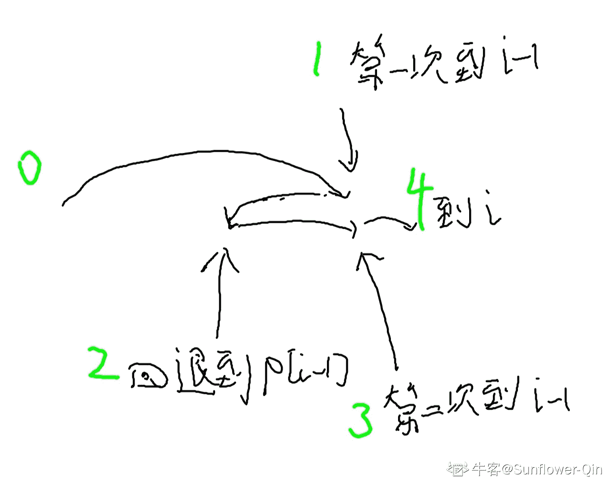

# 【2021】小米秋招前端方向第一场笔试

## 1

下面关于 Promise 说法正确的是（注意“返回结果”的意思包含成功或者失败）

正确答案: C D   你的答案: 空 (错误)

```cpp
Promise.all 在所有给定的 promise 都 fulfilled 后才返回结果
```

```cpp
Promise.race 在给定的 promise 中，某个 fulfilled 后才返回结果
```

```cpp
promise.then 的回调函数中，可以返回一个新的 promise
```

```cpp
对于一个向后台获取数据已经产生结果的 promise:p1，再次调用 p1.then，不会去重新发起请求获取数据
```

本题知识点

前端工程师 小米 2021

讨论

[Self-overcoming](https://www.nowcoder.com/profile/34698085)

1、Promise.all()

const p=new Promise([p1,p2,p3])p 的状态由 p1、p2、p3 决定，分成两种情况。（1）只有 p1、p2、p3 的状态都变成 fulfilled，p 的状态才会变成 fulfilled，此时 p1、p2、p3 的返回值组成一个数组，传递给 p 的回调函数。（2）只要 p1、p2、p3 之中有一个被 rejected，p 的状态就变成 rejected，此时第一个被 reject 的实例的返回值，会传递给 p 的回调函数。

2、Promise.race()

const p = Promise.race([p1, p2, p3]);

上面代码中，**只要 p1、p2、p3 之中有一个实例率先改变状态，p 的状态就跟着改变**。那个率先改变的 Promise 实例的返回值，就传递给 p 的回调函数。3、Promise.then()参考阮一峰 es6 对于链式调用的描述 4、Promise 对象的特点
(1)对象状态不受外界干扰，Promise 代表一个异步操作
**(2)一旦状态改变，就不会再变，任何时候都可以得到这个结果**

发表于 2021-07-11 11:00:42

* * *

[ICC201811051928354](https://www.nowcoder.com/profile/945718793)

结果可能是成功也可能是失败！

发表于 2021-06-28 08:45:22

* * *

[微笑是最美的甜](https://www.nowcoder.com/profile/98929127)

*   Promise.all()中的 Promise 序列会全部执行通过才认为是成功，否则认为是失败；
*   Promise.race()中的 Promise 序列中第一个执行完毕的是通过，则认为成功，如果第一个执行完毕的 Promise 是拒绝，则认为失败；
*   Promise.any()中的 Promise 序列只要有一个执行通过，则认为成功，如果全部拒绝，则认为失败；

发表于 2022-03-01 14:00:38

* * *

## 2

在 Linux 系统中，下列哪些操作可以把一个普通用户变为管理员？

正确答案: A D   你的答案: 空 (错误)

```cpp
su
```

```cpp
passwd
```

```cpp
 usrchmod
```

```cpp
修改/etc/passwd 文件
```

本题知识点

前端工程师 小米 2021

讨论

[牛客 203067773 号](https://www.nowcoder.com/profile/203067773)

①在系统中超级用户可以下放普通用户不能执行的操作，给普通用户下放权力配置文件:/etc/sudoers
②下放权力的方法
在超级用户中执行 visudo 命令，进入编辑/etc/sudoers，并跳转到一百行左右。

执行以下命令：

用户（username） 主机名（得到的用户身份）=(获得到的用户身份：root) 命令

③执行下放权限的命令
切换到普通用户后执行以下命令：

student   localhost=(root)     /usr/sbin/useradd（下放给 student 用户建立新用户的权力）

student   localhost=(root)     NOPASSWD: /usr/sbin/useradd（下放给 student 用户建立新用户的权力,免密）

sudo 的工作过程如下：

1，当用户执行 sudo 时，系统会主动寻找/etc/sudoers 文件，判断该用户是否有执行 sudo 的权限

2，确认用户具有可执行 sudo 的权限后，让用户输入用户自己的密码确认

3，若密码输入成功，则开始执行 sudo 后续的命令

4，root 执行 sudo 时不需要输入密码(eudoers 文件中有配置 root ALL=(ALL) ALL 这样一条规则)

5，若欲切换的身份与执行者的身份相同，也不需要输入密码

发表于 2021-06-22 11:03:39

* * *

[牛客 545329987 号](https://www.nowcoder.com/profile/545329987)

*   su（英文全拼：switch user）命令用于变更为其他使用者的身份，除 root 外，需要键入该使用者的密码。
*   passwd 命令用来更改使用者的密码
*   chmod（英文全拼：change mode）命令是控制用户对文件的权限的命令

发表于 2022-03-18 20:58:37

* * *

[Hayle](https://www.nowcoder.com/profile/416498138)

A：使用 sudo 命令来赋予普通用户 root 权限

发表于 2021-06-20 09:34:27

* * *

## 3

下面对于 Vue 与 React 的描述正确的是

正确答案: C D   你的答案: 空 (错误)

```cpp
Vue 采用双向数据流，React 采用单向数据流
```

```cpp
 JSX 是由 React 推出的，所以在 Vue 中不能使用
```

```cpp
 Vue 和 React 不需要配合 NPM 也能使用
```

```cpp
在 Vue 中可以自定义指令
```

本题知识点

前端工程师 小米 2021

讨论

[盛夏的清凉](https://www.nowcoder.com/profile/627737612)

*   数据绑定：指 View 层和 Model 层之间的映射关系。
*   数据流：指的是父子组件之间的数据流动。
*   vue 是单向数据流，单向/双向数据绑定
*   react 是单向数据流，单向数据绑定

参考：[`www.cnblogs.com/forcheng/p/13380794.html`](https://www.cnblogs.com/forcheng/p/13380794.html)

发表于 2021-06-30 09:56:15

* * *

[Self-overcoming](https://www.nowcoder.com/profile/34698085)

A、Vue 和 React 都是单向数据流，即只支持父组件向子组件传参但不支持子组件修改 propsB、在 Vue 中使用 JSX 语法可具体参考 Vue 文档-可复用性&组合-渲染函数&JSX 一章 C、显然 D、显然

发表于 2021-07-11 11:19:55

* * *

[牛客 382324100 号](https://www.nowcoder.com/profile/382324100)

vue 不是可以使用 jsx 么？  vue 怎么不能自定义指令了？乱扯啥呢？

发表于 2022-03-11 17:28:28

* * *

## 4

关于 HTTPS 协议，描述正确的是？

正确答案: A B C   你的答案: 空 (错误)

```cpp
HTTPS 协议同时用到了对称加密和非对称加密
```

```cpp
 HTTPS 实现内容完整性的手段主要是摘要算法
```

```cpp
数字签名是私钥对内容摘要的加密
```

```cpp
建立 HTTPS 连接的过程，不会有明文传输
```

本题知识点

前端工程师 小米 2021

讨论

[杨洋洋吃千张](https://www.nowcoder.com/profile/717469988)

A、HTTPS 采用共享密钥加密（对称加密）和公开密钥加密（非对称加密）两者并用的混合加密机制。B、TLS 的基本格式就是 密钥交换算法 - 签名算法 - 对称加密算法 - 摘要算法 组成的一个密码串。摘要算法保护数据的完整性，哪怕文件中改变一个标点符号，增加一个空格，生成的文件摘要也会完全不同。C、“数字签名：结合使用公钥与散列算法”：发件人将一种散列算法应用于数据，并生成一个散列值(数据摘要）。 发件人使用私钥将散列值(数据摘要）转换为数字签名（即对摘要进行加密和签名）。 然后，发件人将数据、签名及发件人的证书发给收件人。D、**HTTPS 加密请求(一次握手)过程：**客户端发起握手请求，以明文传输请求信息，包含版本信息，加密-套件候选列表，压缩算法候选列表，随机数，扩展字段等信息。

发表于 2021-07-15 18:30:35

* * *

## 5

下面可以声明数字的 js 代码是

正确答案: A B D   你的答案: 空 (错误)

```cpp
 const a = 0xa1
```

```cpp
const a = 076
```

```cpp
 const a = 0b21
```

```cpp
const a = 7e2
```

本题知识点

前端工程师 小米 2021

讨论

[盛夏的清凉](https://www.nowcoder.com/profile/627737612)

0x 十六进制 0 八进制 0b 二进制：二进制不该出现 2e 指数

发表于 2021-06-30 10:02:10

* * *

[夜寻极光。](https://www.nowcoder.com/profile/868966489)

0x 16 进制 0 8 进制 0b 2 进制 e 指数，10 的几次方

发表于 2021-08-23 12:36:57

* * *

## 6

下面哪些数组方法会改变原数组

正确答案: A C   你的答案: 空 (错误)

```cpp
push
```

```cpp
concat
```

```cpp
splice
```

```cpp
map
```

本题知识点

前端工程师 小米 2021

讨论

[杨洋洋吃千张](https://www.nowcoder.com/profile/717469988)

会改变数组的方法：

> push()
> pop()
> shift()
> unshift()
> splice()
> reverse()
> forEach
> sort()

不会改变数组的方法：

> filter()concat()slice()map()

发表于 2021-07-15 18:41:50

* * *

[Changes1](https://www.nowcoder.com/profile/927250602)

准确的说：map 和 forEach---当数组为基本类型时，是不会改变原数组，但为引用数据类型时，是可以改变的

发表于 2021-08-05 10:04:14

* * *

## 7

关于闭包，下列说法正确的是？

正确答案: C D   你的答案: 空 (错误)

```cpp
在闭包对应的函数销毁后，闭包依然在内存中，不会被回收
```

```cpp
C 语言中也有闭包的概念
```

```cpp
闭包是一种语言特性，很多函数是一等公民的语言在设计时都会选择
```

```cpp
函数和对其周围状态（lexical environment，词法环境）的引用捆绑在一起构成闭包（closure）
```

本题知识点

前端工程师 小米 2021

讨论

[果冻我要喜之郎](https://www.nowcoder.com/profile/582821983)

代码回收规则如下：

1.全局变量不会被回收。

2.局部变量会被回收，也就是函数一旦运行完以后，函数内部的东西都会被销毁。

3.只要被另外一个作用域所引用就不会被回收

发表于 2022-03-17 21:23:53

* * *

[焉知胭脂](https://www.nowcoder.com/profile/398213297)

闭包的参数和变量不会被回收

发表于 2021-10-05 17:09:39

* * *

## 8

关于 cookie 和 session 描述错误的是

正确答案: A C D   你的答案: 空 (错误)

```cpp
通常下 cookie 比 session 安全
```

```cpp
cookie 数据存放在客户的浏览器上，session 数据放在服务器
```

```cpp
 session 是有有效期的，而 cookie 则没有有效期
```

```cpp
session 可以在多个服务器之间共享
```

本题知识点

前端工程师 小米 2021

讨论

[霄宝的蓝朋友](https://www.nowcoder.com/profile/6746679)

session 指的是服务器上的 session 并不是 sessionStorage😂

发表于 2021-07-29 00:22:31

* * *

[伞仙](https://www.nowcoder.com/profile/591248016)

cookie 可以被盗用，所以不安全 cookie 可以设置过期时间 cookie 可以多个服务器共享  

发表于 2021-08-10 10:36:16

* * *

## 9

下列哪些 HTTP 响应码表示发生了错误？

正确答案: C D   你的答案: 空 (错误)

```cpp
202
```

```cpp
 304
```

```cpp
401
```

```cpp
500
```

本题知识点

前端工程师 小米 2021

讨论

[ikunbiss](https://www.nowcoder.com/profile/336496995)

1xx（临时响应）
表示临时响应并需要请求者继续执行操作的状态代码。

代码 说明
100 （继续） 请求者应当继续提出请求。 服务器返回此代码表示已收到请求的第一部分，正在等待其余部分。
101 （切换协议） 请求者已要求服务器切换协议，服务器已确认并准备切换。

2xx （成功）
表示成功处理了请求的状态代码。
代码 说明
200 （成功） 服务器已成功处理了请求。 通常，这表示服务器提供了请求的网页。
201 （已创建） 请求成功并且服务器创建了新的资源。
202 （已接受） 服务器已接受请求，但尚未处理。
203 （非授权信息） 服务器已成功处理了请求，但返回的信息可能来自另一来源。
204 （无内容） 服务器成功处理了请求，但没有返回任何内容。
205 （重置内容） 服务器成功处理了请求，但没有返回任何内容。
206 （部分内容） 服务器成功处理了部分 GET 请求。

3xx （重定向）
表示要完成请求，需要进一步操作。 通常，这些状态代码用来重定向。

代码 说明
300 （多种选择） 针对请求，服务器可执行多种操作。 服务器可根据请求者 (user agent) 选择一项操作，或提供操作列表供请求者选择。
301 （永久移动） 请求的网页已永久移动到新位置。 服务器返回此响应（对 GET 或 HEAD 请求的响应）时，会自动将请求者转到新位置。
302 （临时移动） 服务器目前从不同位置的网页响应请求，但请求者应继续使用原有位置来进行以后的请求。
303 （查看其他位置） 请求者应当对不同的位置使用单独的 GET 请求来检索响应时，服务器返回此代码。
304 （未修改） 自从上次请求后，请求的网页未修改过。 服务器返回此响应时，不会返回网页内容。
305 （使用代理） 请求者只能使用代理访问请求的网页。 如果服务器返回此响应，还表示请求者应使用代理。
307 （临时重定向） 服务器目前从不同位置的网页响应请求，但请求者应继续使用原有位置来进行以后的请求。

4xx（请求错误）
这些状态代码表示请求可能出错，妨碍了服务器的处理。

代码 说明
400 （错误请求） 服务器不理解请求的语法。
401 （未授权） 请求要求身份验证。 对于需要登录的网页，服务器可能返回此响应。
403 （禁止） 服务器拒绝请求。
404 （未找到） 服务器找不到请求的网页。
405 （方法禁用） 禁用请求中指定的方法。
406 （不接受） 无法使用请求的内容特性响应请求的网页。
407 （需要代理授权） 此状态代码与 401（未授权）类似，但指定请求者应当授权使用代理。
408 （请求超时） 服务器等候请求时发生超时。
409 （冲突） 服务器在完成请求时发生冲突。 服务器必须在响应中包含有关冲突的信息。
410 （已删除） 如果请求的资源已永久删除，服务器就会返回此响应。
411 （需要有效长度） 服务器不接受不含有效内容长度标头字段的请求。
412 （未满足前提条件） 服务器未满足请求者在请求中设置的其中一个前提条件。
413 （请求实体过大） 服务器无法处理请求，因为请求实体过大，超出服务器的处理能力。
414 （请求的 URI 过长） 请求的 URI（通常为网址）过长，服务器无法处理。
415 （不支持的媒体类型） 请求的格式不受请求页面的支持。
416 （请求范围不符合要求） 如果页面无法提供请求的范围，则服务器会返回此状态代码。
417 （未满足期望值） 服务器未满足"期望"请求标头字段的要求。

5xx（服务器错误）
这些状态代码表示服务器在尝试处理请求时发生内部错误。 这些错误可能是服务器本身的错误，而不是请求出错。

代码 说明
500 （服务器内部错误） 服务器遇到错误，无法完成请求。
501 （尚未实施） 服务器不具备完成请求的功能。 例如，服务器无法识别请求方法时可能会返回此代码。
502 （错误网关） 服务器作为网关或代理，从上游服务器收到无效响应。
503 （服务不可用） 服务器目前无法使用（由于超载或停机维护）。 通常，这只是暂时状态。
504 （网关超时） 服务器作为网关或代理，但是没有及时从上游服务器收到请求。
505 （HTTP 版本不受支持） 服务器不支持请求中所用的 HTTP 协议版本。

发表于 2021-07-24 16:31:47

* * *

[牛客 579328676 号](https://www.nowcoder.com/profile/579328676)

304：表示服务端的资源未发生改变，不需要发送请求获取资源 401 未授权，禁止进入 500：服务端错误

发表于 2022-03-14 17:14:47

* * *

## 10

以下属于 CPU 内部结构的是哪些？

正确答案: B C D   你的答案: 空 (错误)

```cpp
存储器
```

```cpp
寄存器
```

```cpp
运算器
```

```cpp
控制器
```

本题知识点

前端工程师 小米 2021

讨论

[牛客 360871401 号](https://www.nowcoder.com/profile/360871401)

cpu :寄存器 控制器 运算器 时钟

发表于 2021-06-25 17:53:13

* * *

## 11

修改下列哪个 CSS 属性会可能触发回流？

正确答案: C   你的答案: 空 (错误)

```cpp
background-color
```

```cpp
outline-width
```

```cpp
border-width
```

```cpp
transform
```

本题知识点

前端工程师 小米 2021

讨论

[swallowblank](https://www.nowcoder.com/profile/8147847)

轮廓线不会占据空间

发表于 2021-06-20 11:10:38

* * *

[微笑是最美的甜](https://www.nowcoder.com/profile/98929127)

引起回流（重排 reflow）的原因：

*   元素几何尺寸的读写
*   元素位置的改变

引起重绘（repaint）的原因：

*   元素样式的改变

注意：重绘不一定回流，但回流一定重绘

发表于 2022-03-01 14:26:49

* * *

[伞仙](https://www.nowcoder.com/profile/591248016)

一个 DOM 元素的几何变化，常见的几何属性 width、height、padding、margin、left、top、border 等等

使 DOM 节点发生 增减 或 移动。

读写 offset ，scroll  和 client 属性的时候，浏览器为了获取这些值，需要进行回流操作。

调用 window.getComputedStyle 方法。

回流过程：由于 DOM 的结构发生了改变，所以需要从生成 DOM 这一步开始，重新经过 样式计算、生成布局树、建立图层树、再到 生成绘制列表 以及之后的显示器显示这一整个渲染过程走一遍，开销是非常大的。

发表于 2021-08-10 10:40:30

* * *

## 12

var a = []; typeof a 的结果是？

正确答案: B   你的答案: 空 (错误)

```cpp
array
```

```cpp
 object  
```

```cpp
null
```

```cpp
 function
```

本题知识点

前端工程师 小米 2021

讨论

[LQ0918](https://www.nowcoder.com/profile/591066924)

 对于对象、数组、null 返回的值是 object，比如 typeof(window),typeof(document),typeof(null)

发表于 2021-09-02 21:09:16

* * *

[OooO0oOOo](https://www.nowcoder.com/profile/398348398)

typeof 返回值

Undefined => "undefined"

Null => "object"    // js 默认规则

Boolean => "boolean"

Number => "number"

String => "string"

Symbol => "symbol" // ES5 新增

Function => "function"

其他任何对象 => "object"

除 Function 外的所有构造函数的类型都是 'object'

例：var str = new String('String');

        typeof str; // 返回 'object'

正则表达式：某些浏览器不符合标准

        typeof /s/ === 'function'; // Chrome 1-12,不符合 ECMAScript 5.1

        typeof /s/ === 'object'; // Firefox 5+,符合 ECMAScript 5.1

例外：所有浏览器都暴露了一个类型为 undefined 的非标准宿主对象 document.all

        typeof document.all === 'undefined';

发表于 2021-08-31 16:47:53

* * *

[盛夏的清凉](https://www.nowcoder.com/profile/627737612)

typeof 判断原始类型

1.  Boolean 布尔型
2.  Number 数字：包括 NaN
3.  String 字符串：不可变
4.  Null 空
5.  Undefined 未定义
6.  Symbol（ES6 新定义）
7.  BigInt（ES2019 新增）

发表于 2021-06-30 10:30:33

* * *

## 13

下列关于 HTTP 协议的描述错误的是？

正确答案: B   你的答案: 空 (错误)

```cpp
HTTP 是无状态的
```

```cpp
 HTTP 是传输层协议
```

```cpp
HTTP 的可扩展性强
```

```cpp
HTTP 是文本协议
```

本题知识点

前端工程师 小米 2021

讨论

[HardReset](https://www.nowcoder.com/profile/5162703)

搜了一下：HTTP 1.x 是文本协议 HTTP 2.0 是二进制协议

发表于 2021-07-21 20:42:50

* * *

[夜寻极光。](https://www.nowcoder.com/profile/868966489)

**    超文本传输协议（英文：**H**yper**T**ext **T**ransfer **P**rotocol，缩写：HTTP）是一种用于分布式、协作式和超媒体信息系统的应用层协议。**

发表于 2021-08-16 15:48:33

* * *

[牛客 325535384 号](https://www.nowcoder.com/profile/325535384)

就挺**的

发表于 2021-09-17 18:20:31

* * *

## 14

关于 HTML 的语义，下列描述正确的是？

正确答案: A   你的答案: 空 (错误)

```cpp
在 HTML 中，元素、元素的属性和属性的值都是有语义的
```

```cpp
HTML 语义是供搜索引擎爬虫理解页面用的，除此之外，并无其他作用
```

```cpp
title 元素的语义是段落的标题
```

```cpp
head 元素不显示，所以没有语义
```

本题知识点

前端工程师 小米 2021

讨论

[小美人鱼](https://www.nowcoder.com/profile/748053391)

title 定义文档的标题 显示在浏览器的标题栏或者标签页上

发表于 2021-08-18 10:47:05

* * *

[微笑是最美的甜](https://www.nowcoder.com/profile/98929127)

```cpp

		HTML 语义是供搜索引擎爬虫理解页面用的， 也可体现页面的结构、便于开发

```

```cpp

		title 元素的语义是文档的标题  h(1-6) 元素的语义是段落的标题

```

发表于 2022-03-01 14:32:27

* * *

[9527176](https://www.nowcoder.com/profile/737763266)

A,HTML 里面的标签语义化

发表于 2021-06-27 21:48:28

* * *

## 15

当你刚刚提交完成代码，发现提交信息中有错误，应该如何改正呢？

正确答案: D   你的答案: 空 (错误)

```cpp
git stash -P
```

```cpp
git revert HEAD -e
```

```cpp
git rebase
```

```cpp
git commit --amend
```

本题知识点

前端工程师 小米 2021

讨论

[香菜君](https://www.nowcoder.com/profile/307145266)

******git commit --amend** ：**如果提交仅存在于您的本地仓库中，尚未推送到 GitHub.com，您可以使用 **git commit --amend** 命令修改提交消息**

发表于 2022-02-28 23:07:10

* * *

[盛夏的清凉](https://www.nowcoder.com/profile/627737612)

git stash -p：每个文件单独决定如何操作，可起到 stash 部分文件的作用，参考：[`www.jianshu.com/p/fe4d54cb6244`](https://www.jianshu.com/p/fe4d54cb6244)git revert HEAD -e：-e 编辑 commit 信息，默认。参考：[`git-scm.com/docs/git-revert.html`](https://git-scm.com/docs/git-revert.html)

发表于 2021-06-30 10:45:54

* * *

## 16

下面关于 flex 描述错误的是

正确答案: D   你的答案: 空 (错误)

```cpp
 flex 可以单行布局
```

```cpp
 flex 可以单列布局
```

```cpp
flex 可以多行布局，但是多行布局时候，会遇到 space-around 属性值导致多行元素对不齐的情况
```

```cpp
flex-grow 属性定义项目的放大比例，默认为 0，即如果存在剩余空间就放大
```

本题知识点

前端工程师 小米 2021

讨论

[小伙在努力](https://www.nowcoder.com/profile/802513377)

1、flex-grow 属性定义项目的放大比例，默认为 0，即如果存在剩余空间，也不放大。如果所有项目的 flex-grow 属性都为 1，则它们将等分剩余空间（如果有的话）。如果一个项目的 flex-grow 属性为 2，其他项目都为 1，则前者占据的剩余空间将比其他项多一倍。2、flex-shrink 属性定义了项目的缩小比例，默认为 1，即如果空间不足，该项目将缩小。如果所有项目的 flex-shrink 属性都为 1，当空间不足时，都将等比例缩小。如果一个项目的 flex-shrink 属性为 0，其他项目都为 1，则空间不足时，前者不缩小。负值对该属性无效 3、flex-basis 属性定义了在分配多余空间之前，项目占据的主轴空间（main size）。浏览器根据这个属性，计算主轴是否有多余空间。它的默认值为 auto，即项目的本来大小。它可以设为跟 width 或 height 属性一样的值（比如 350px），则项目将占据固定空间。

编辑于 2022-01-16 11:59:10

* * *

[LQ0918](https://www.nowcoder.com/profile/591066924)

space-around 所有的空间都是自动分配的 左右空间是一样的

发表于 2021-09-02 21:14:39

* * *

[轻风 123](https://www.nowcoder.com/profile/158237750)

flex-grow 属性定义项目的放大比例，默认为 0，即如果存在剩余空间，也不放大。

发表于 2021-06-29 22:06:46

* * *

## 17

下面哪项不可以判断 arr 是空数组？

正确答案: B   你的答案: 空 (错误)

```cpp
 Array.isArray(arr) && arr.length === 0
```

```cpp
arr === []
```

```cpp
JSON.stringify(arr) === '[]'
```

```cpp
arr instanceof Array && arr.length === 0
```

本题知识点

前端工程师 小米 2021

讨论

[HardReset](https://www.nowcoder.com/profile/5162703)

若数组的成员是`undefined`、函数或 XML 对象，则这些值被`JSON.stringify`转成`null`

发表于 2021-07-21 20:47:22

* * *

[宇第一 i 帅](https://www.nowcoder.com/profile/470583707)

如果是字符串   ' [ ] '  呢？

编辑于 2021-09-08 18:14:44

* * *

[牛客 238721257 号](https://www.nowcoder.com/profile/238721257)

instanceof 也不能判断 arr 是一个数组啊

发表于 2021-07-15 16:09:06

* * *

## 18

下列哪个不是浏览器支持的锚（anchor）伪类？

正确答案: C   你的答案: 空 (错误)

```cpp
a:visited
```

```cpp
a:hover
```

```cpp
a:disabled
```

```cpp
a:active
```

本题知识点

前端工程师 小米 2021

讨论

[杨洋洋吃千张](https://www.nowcoder.com/profile/717469988)

**锚伪类：**

*   未访问状态（a:link）
*   鼠标悬停状态（a:hover）
*   活动状态（a:active）
*   已访问状态（a:visited）

发表于 2021-07-15 21:18:17

* * *

[HardReset](https://www.nowcoder.com/profile/5162703)

使用顺序：a:link -> a:visited -> a:hover -> a:active 光标：未访问 -> 已访问 -> 移动到链接上 -> 点击选中链接

发表于 2021-07-22 08:45:03

* * *

## 19

下列文件中，包含了主机名到 IP 地址的映射关系的文件是

正确答案: A   你的答案: 空 (错误)

```cpp
 /etc/hosts
```

```cpp
/etc/iptable
```

```cpp
 /etc/networks
```

```cpp
/etc/ips
```

本题知识点

前端工程师 小米 2021

讨论

[remake_as_dish_dog](https://www.nowcoder.com/profile/757333566)

`/etc/networks`存路由表, 没有主机名

发表于 2022-03-01 00:18:29

* * *

## 20

在使用 mkdir 命令创建新的目录时，在其父目录不存在时先创建父目录的选项是 ？

正确答案: D   你的答案: 空 (错误)

```cpp
 -m
```

```cpp
-d
```

```cpp
 -f
```

```cpp
-p
```

本题知识点

前端工程师 小米 2021

讨论

[CNHSY](https://www.nowcoder.com/profile/158522824)

mkdir [选项] 文件夹名选项：-m：设置权限。-p：如果路径中不存在相关目录，自动创建文件夹。-v：每创建一个目录就打印一次消息。-Z：将 SELinux 安全上下文 设置为所创建文件夹的默认类型。

发表于 2021-08-12 22:53:26

* * *

## 21

存在 n+1 个房间，每个房间依次为房间 1 2 3...i，每个房间都存在一个传送门，i 房间的传送门可以把人传送到房间 pi(1<=pi<=i),现在路人甲从房间 1 开始出发(当前房间 1 即第一次访问)，每次移动他有两种移动策略：
    A. 如果访问过当前房间 i 偶数次，那么下一次移动到房间 i+1；
    B. 如果访问过当前房间 i 奇数次，那么移动到房间 pi；
现在路人甲想知道移动到房间 n+1 一共需要多少次移动；

本题知识点

动态规划 数组 C++工程师 Java 工程师 字节跳动 2018 前端工程师 小米 2021

讨论

[皮皮浔](https://www.nowcoder.com/profile/4031474)

*   仔细分析 1<=pi<=i 知道用动态规划做。
*   记录第一次到达 i 为 dp[i]，此时前面的所有门肯定是已经到达偶数次了
    *   因为传送只会后退，前进的唯一方式是偶数次到达并+1，不能跳跃
    *   所以到达 i 门前面所有门都走过并且经过偶数次（反正法也可以证明）
*   dp[i]=dp[i-1]+第二次到达 i-1 + 1
*   第一次到达 i-1 门后再走一步会回到 p[i-1]，此时 p[i-1]门到达奇数次，其他所有门到达偶数次
*   这和第一次到达 p[i-1]门的情况完全相同，所以从 p[i-1]门回到 i-1 门，需要 dp[i-1]-dp[p[i-1]]
*   所以 dp[i] = dp[i-1] + dp[i-1] - dp[p[i-1]] + 1 + 1
*   dp[i] = 2 * dp[i-1] - dp[p[i-1]] + 2

```cpp
#include <iostream>
using namespace std;

long long p[1001], dp[1001], n;
const long long mod = 1e9 + 7;

int main (){
    cin >> n;
    for (int i = 1; i<= n; ++i) cin >> p[i];
    for (int i = 2; i<= n+1; ++i) 
        dp[i] = (2 * dp[i-1] - dp[p[i-1]] + 2) % mod;
    cout << (dp[n + 1] < 0 ? dp[n + 1] + mod : dp[n + 1]);
}

```

*   感谢[Abtt](https://www.nowcoder.com/profile/148026308)指正，已经修改过来

编辑于 2019-04-23 16:13:24

* * *

[izeal](https://www.nowcoder.com/profile/214316342)

```cpp
let n = parseInt(readline().trim());
let roomArr = readline().trim().split(" ");
let mod = 1000000007
let dp = new Array(n+2);
dp[1] = 0
for(let i = 2;i<=n+1;i++){
    dp[i]=2*dp[i-1]+2-dp[roomArr[i-2]]
    if(dp[i]<0){
        dp[i] += mod;
    }else if (dp[i] >= mod){
        dp[i] %= mod;
    }
}
console.log(dp[n+1])
```

发表于 2021-07-15 12:57:07

* * *

[myorange](https://www.nowcoder.com/profile/381116)

皮皮浔已经解释该题可以用动态规划做，记录第一次到达 i 的步数为 dp[i]。下面是我对状态转移方程的分段理解：dp[i] = (dp[i-1]) + (1) + (dp[i-1] - dp[p[i-1]]) + (1)。

```cpp
import java.util.Scanner;

public class Main {
    public static void main(String[] args) {
        Scanner sc = new Scanner(System.in);
        int n = sc.nextInt();
        final int mod = 1000000007;
        int[] p = new int[n+1];
        int[] dp = new int[n+2];
        for (int i = 1; i <= n; ++i) {
            p[i] = sc.nextInt();
        }        
        for (int i = 2; i <= n+1; ++i) {
            dp[i] = (dp[i-1] << 1) - dp[p[i-1]] + 2;
            if (dp[i] < 0) dp[i] += mod;
            else if (dp[i] >= mod) dp[i] %= mod;
        }
        System.out.println(dp[n+1]);
    }
} 
```

编辑于 2020-03-14 13:30:38

* * *

## 22

求 a 和 b 相乘的值，a 和 b 可能是小数，需要注意结果的精度问题

本题知识点

前端工程师 小米 2021

讨论

[冷冰冰](https://www.nowcoder.com/profile/149974)

```cpp
先将小数用 10 的 n 次方转化成整数，乘完的结果在除以之前乘了多少个 10
function multiply(a, b) {
    a = a.toString();
    b = b.toString();
    var aLen = a.substring(a.indexOf(".")+1).length;
    var bLen = a.substring(a.indexOf(".")+1).length;
    return (a * Math.pow(10,aLen)) * (b * Math.pow(10,bLen)) / Math.pow(10,aLen+bLen);
}

```

发表于 2015-11-24 17:59:49

* * *

[马月月](https://www.nowcoder.com/profile/8024187)

//根据两个书中精度较高的一个来确定，先将其转换成字符串，然后根据小数点的位置确定小数位数，//字符串长度减去‘.'的位置后还要再减去 1 得到正确的小数位数，两个取其大，然后用 toFixed()函数确定 //结果的小数位数 function multiply(a, b) {   //求两个数中精度大的一个    var stra=a.toString();    var strb=b.toString();    var len=Math.max(stra.length-stra.indexOf('.')-1,strb.length-strb.indexOf('.')-1);    //    return parseFloat(a*b).toFixed(len);}

发表于 2016-07-15 09:22:35

* * *

[silver_bullet](https://www.nowcoder.com/profile/9671151)

计算两小数的小数点位数，然后相加得到保留的小数点位数，用 tofixed 函数即可

```cpp
function multiply(a, b) {
```

    var re = /\./;    var aDec = a.toString().split('.')[1] || '';    var bDec = b.toString().split('.')[1] || '';    var fix = aDec.length  + bDec.length;    return (a * b).toFixed(fix);

```cpp
}
```

发表于 2017-03-16 21:10:49

* * *