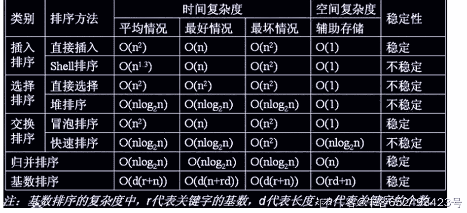
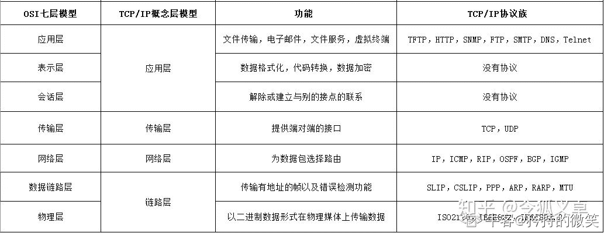
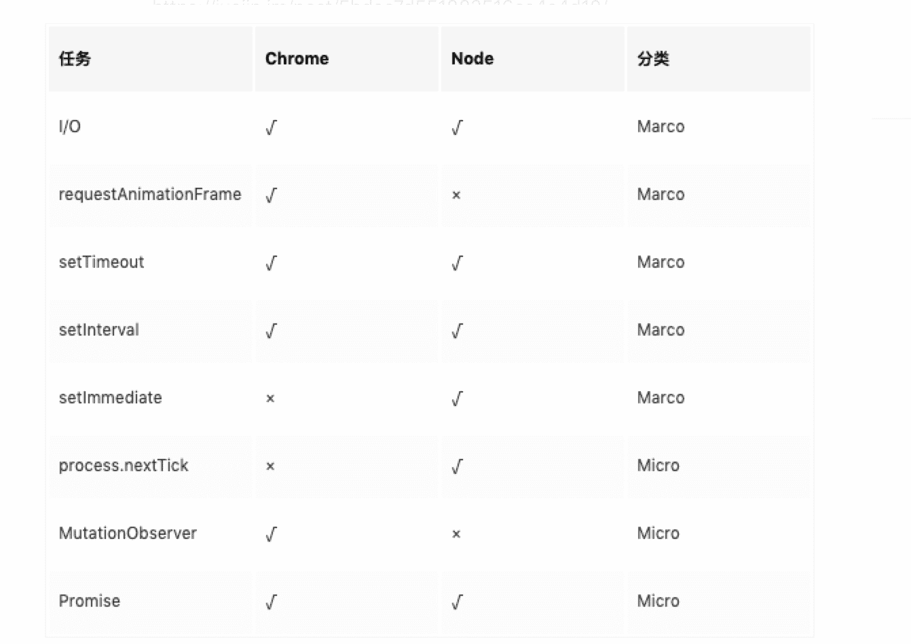

# 【2021】小米秋招前端方向第二场笔试

## 1

使用浏览器访问 http://miui.com/时，以下哪些过程发生在浏览器端？

正确答案: A D   你的答案: 空 (错误)

```cpp
构建 HTTP 请求
```

```cpp
解析 HTTP 请求
```

```cpp
 发送 HTTP 响应
```

```cpp
渲染页面
```

本题知识点

前端工程师 小米 2021

讨论

[无敌的小荔枝](https://www.nowcoder.com/profile/509757735)

浏览器端构建 HTTP 请求，并发送 -> 服务器端接收到 HTTP 请求，并进行解析 -> 服务器端发送 HTTP 响应 -> 浏览器端接收到响应，并进行页面渲染。

发表于 2021-07-12 18:40:19

* * *

[太吾村领头人](https://www.nowcoder.com/profile/770600365)

没好好读题，发送 http 请求，解析 http 响应。。。

发表于 2022-03-21 17:39:37

* * *

[牛客 3384905 号](https://www.nowcoder.com/profile/3384905)

请求回来的 response 难道不是在浏览器端解析的？

发表于 2021-12-10 22:45:41

* * *

## 2

下列哪些关于 HTTP/2 的描述是正确的？

正确答案: B C D   你的答案: 空 (错误)

```cpp
  解决了 TCP 队头阻塞的问题
```

```cpp
解决了浏览器线头阻塞的问题
```

```cpp
使用了头部压缩
```

```cpp
使用二进制分帧封装 HTTP 消息
```

本题知识点

前端工程师 小米 2021

讨论

[A、半 k 代码走天下](https://www.nowcoder.com/profile/503636333)

HTTP/0.9：功能捡漏，只支持 GET 方法，只能发送 HTML 格式字符串。

HTTP/1.0：支持多种数据格式，增加 POST、HEAD 等方法，增加头信息，每次只能发送一个请求（无持久连接）

HTTP/1.1：默认持久连接、请求管道化、增加缓存处理、增加 Host 字段、支持断点传输分块传输等。

HTTP/2.0：二进制分帧、多路复用、头部压缩、服务器推送

作者：隐逸王
链接：[`www.jianshu.com/p/28a35094dc5d`](https://www.jianshu.com/p/28a35094dc5d)
来源：简书
著作权归作者所有。商业转载请联系作者获得授权，非商业转载请注明出处。

发表于 2021-08-25 19:50:08

* * *

[X_W_W_](https://www.nowcoder.com/profile/395282347)

HTTP/2 并没有解决这个问题
采用 HTTP/2 时，浏览器一般会在单个 TCP 连接中创建并行的几十个乃至上百个传输。如果 HTTP/2 连接双方的网络中有一个数据包丢失，或者任何一方的网络出现中断，整个 TCP 连接就会暂停，丢失的数据包需要被重新传输。因为 TCP 是一个按序传输的链条，因此如果其中一个点丢失了，链路上之后的内容就都需要等待。[`www.kancloud.cn/kancloud/http3-explained/1395005`](https://www.kancloud.cn/kancloud/http3-explained/1395005)

发表于 2021-06-28 01:50:51

* * *

## 3

下面对于服务端渲染和客户端渲染描述正确的是

正确答案: C D   你的答案: 空 (错误)

```cpp
通过 vue-cli，create-react-app 等工具创建的项目是服务端渲染的
```

```cpp
服务端渲染的用户体验一定优于客户端渲染
```

```cpp
服务端渲染对 SEO 更加友好，而且首屏渲染通常更快一些
```

```cpp
 SPA 是客户端渲染的
```

本题知识点

前端工程师 小米 2021

讨论

[uesugieriislf](https://www.nowcoder.com/profile/34068835)

[`ssr.vuejs.org/zh/`](https://ssr.vuejs.org/zh/)

server-side-render

就是让服务器来渲染页面。

[`zhuanlan.zhihu.com/p/171579801`](https://zhuanlan.zhihu.com/p/171579801)

**优点**

与传统 SPA (单页应用程序 (Single-Page Application)) 相比，服务器端渲染 (SSR) 的优势主要在于：

*   更好的 SEO，由于搜索引擎爬虫抓取工具可以直接查看完全渲染的页面。

*   更快的内容到达时间 (time-to-content)，特别是对于缓慢的网络情况或运行缓慢的设备。首屏响应时间变短

**缺点**

*   开发条件所限。浏览器特定的代码，只能在某些生命周期钩子函数 (lifecycle hook) 中使用；一些外部扩展库 (external library) 可能需要特殊处理，才能在服务器渲染应用程序中运行。

*   涉及构建设置和部署的更多要求。与可以部署在任何静态文件服务器上的完全静态单页面应用程序 (SPA) 不同，服务器渲染应用程序，需要处于 Node.js server 运行环境。

*   更多的服务器端负载。在 Node.js 中渲染完整的应用程序，显然会比仅仅提供静态文件的 server 更加大量占用 CPU 资源 (CPU-intensive - CPU 密集)，因此如果你预料在高流量环境 (high traffic) 下使用，请准备相应的服务器负载，并明智地采用缓存策略。

发表于 2021-06-25 13:47:49

* * *

[无敌的小荔枝](https://www.nowcoder.com/profile/509757735)

客户端渲染：浏览器中输出 Vue 组件，进行生成 DOM 和操作 DOM。服务器端渲染： 将组件渲染为服务器端的 HTML 字符串，将它们直接发送到浏览器，最后将这些静态标记"激活"为客户端上完全可交互的应用程序。
服务器端渲染优点：1.更好的 SEO，由于搜索引擎爬虫抓取工具可以直接查看完全渲染的页面。
2.更快的内容到达时间，特别是对于缓慢的网络情况或运行缓慢的设备。无需等待所有的 JavaScript 都完成下载并执行，才显示服务器渲染的标记，所以你的用户将会更快速地看到完整渲染的页面。
缺点：
1.开发条件所限。浏览器特定的代码，只能在某些生命周期钩子函数中使用；一些外部扩展库可能需要特殊处理，才能在服务器渲染应用程序中运行。
2.涉及构建设置和部署的更多要求。与可以部署在任何静态文件服务器上的完全静态单页面应用程序 (SPA) 不同，服务器渲染应用程序，需要处于 Node.js server 运行环境。
3.更多的服务器端负载。在 Node.js 中渲染完整的应用程序，显然会比仅仅提供静态文件的 server 更加大量占用 CPU 资源，因此如果你预料在高流量环境下使用，请准备相应的服务器负载，并明智地采用缓存策略。 

发表于 2021-07-12 19:11:00

* * *

## 4

有效防止 XSS 的手段有哪些？

正确答案: A B C   你的答案: 空 (错误)

```cpp
过滤用户请求中的非法字符
```

```cpp
对请求中的特殊字符进行转译
```

```cpp
配置 CSP（Content Security Policy）
```

```cpp
通过预编译来防止
```

本题知识点

前端工程师 小米 2021

讨论

[gaussyuan](https://www.nowcoder.com/profile/404913726)

参考链接：[`tech.meituan.com/2018/09/27/fe-security.html`](https://tech.meituan.com/2018/09/27/fe-security.html)关于预编译可参考: [`zhuanlan.zhihu.com/p/50236805`](https://zhuanlan.zhihu.com/p/50236805)

发表于 2021-10-07 20:03:19

* * *

## 5

下列排序算法中，哪些时间复杂度不会超过 nlogn？

正确答案: B C   你的答案: 空 (错误)

```cpp
快速排序
```

```cpp
堆排序
```

```cpp
 归并排序
```

```cpp
冒泡排序
```

本题知识点

前端工程师 小米 2021

讨论

[牛客 652493423 号](https://www.nowcoder.com/profile/652493423)



发表于 2021-07-02 17:39:20

* * *

[Caster201905161207882](https://www.nowcoder.com/profile/410920005)

题目又错了吧，快速排序时间复杂度不是 nlogn 吗😅

发表于 2022-03-02 18:09:13

* * *

## 6

下面关于 transform 说法正确的是

正确答案: A D   你的答案: 空 (错误)

```cpp
只对受控于盒模型的元素生效
```

```cpp
变形的原点默认是元素的左上角
```

```cpp
变形后元素在页面上的占位也随之变化
```

```cpp
可以通过 matrix 函数整合多种变形效果
```

本题知识点

前端工程师 小米 2021

讨论

[gaussyuan](https://www.nowcoder.com/profile/404913726)

a 选择可参考[`www.bbsmax.com/A/x9J2b7agJ6/`](https://www.bbsmax.com/A/x9J2b7agJ6/) transform 对行内元素不生效

发表于 2021-10-07 20:28:30

* * *

[夜寻极光。](https://www.nowcoder.com/profile/868966489)

transform 变形默认圆点为中心。transform 变形后占位不会变化，它会创建一个新的图层来显示。

发表于 2021-09-13 18:20:27

* * *

[迷途小学生](https://www.nowcoder.com/profile/246775)

transform 变形的几点可通过 transform-origin 设置，默认系中心点。所以 B 不对。

发表于 2021-07-09 15:00:55

* * *

## 7

下面对于 Webpack 描述正确的是

正确答案: A D   你的答案: 空 (错误)

```cpp
 Webpack 是一个模块打包工具
```

```cpp
Webpack 可以运行在服务端和浏览器中
```

```cpp
Webpack 适合复杂的大型项目，小型项目可以使用 vue-cli 等简单的打包工具进行开发
```

```cpp
Webpack 可以实现热更新，开发更加高效
```

本题知识点

前端工程师 小米 2021

讨论

[牛客 188036224 号](https://www.nowcoder.com/profile/188036224)

C 不对的原因，作者应该是觉得，小的项目用 webpack 即可，大的项目应该用 vue-cli，create-react-app 这样的官方脚手架。

发表于 2021-08-21 11:30:12

* * *

## 8

下面哪些方法会中断 js 执行

正确答案: A B   你的答案: 空 (错误)

```cpp
alert
```

```cpp
sync ajax 请求
```

```cpp
setTimeout
```

```cpp
 fetch
```

本题知识点

前端工程师 小米 2021

讨论

[小买同学](https://www.nowcoder.com/profile/118880076)

眼神不好，b 选项看成了 async😶

发表于 2021-06-28 10:55:02

* * *

[gaussyuan](https://www.nowcoder.com/profile/404913726)

*   异步，不会阻碍代码的执行，它会等待所有的同步代码执行完毕后，再执行输出自己的同步结果。（原生 js 中，只有定时器，DOM，ajax 三个东西是异步的。）setTimeout fetch async (参考链接[`www.ruanyifeng.com/blog/2020/12/fetch-tutorial.html`](https://www.ruanyifeng.com/blog/2020/12/fetch-tutorial.html)) 

*   同步，代码只会从上到下依次执行，只要一步出错，接下来的代码就会无法执行**。**alert sync 

发表于 2021-10-07 21:19:43

* * *

[牛客 74428207 号](https://www.nowcoder.com/profile/74428207)

同步代码出错会中断 js 执行。

发表于 2022-03-06 17:55:05

* * *

## 9

在 ES6 规范中，以下哪些类型属于基本数据类型？

正确答案: A C D   你的答案: 空 (错误)

```cpp
string 
```

```cpp
 function
```

```cpp
number
```

```cpp
boolean
```

本题知识点

前端工程师 小米 2021

讨论

[搬砖的小黄](https://www.nowcoder.com/profile/319294559)

*   基本数据类型（原始数据类型）：Number,String, Null, Undefined,  Boolean，Symbol（es6 新增）
*   引用数据类型：Object，Function,Array

发表于 2021-06-30 16:18:48

* * *

## 10

下列哪些协议是应用层协议？

正确答案: A D E   你的答案: 空 (错误)

```cpp
HTTP
```

```cpp
 SSL/TLS
```

```cpp
 TCP
```

```cpp
SSH
```

```cpp
 FTP
```

```cpp
IP
```

本题知识点

前端工程师 小米 2021

讨论

[X_W_W_](https://www.nowcoder.com/profile/395282347)

SSL/TLS 协议工作在应用层和传输层之间

发表于 2021-06-28 02:09:21

* * *

[矜持的微笑](https://www.nowcoder.com/profile/788113274)



发表于 2022-03-08 09:27:45

* * *

[无敌的小荔枝](https://www.nowcoder.com/profile/509757735)

SSH（安全外壳协议）为建立在应用层基础上的安全协议。

发表于 2021-07-12 19:54:25

* * *

## 11

关于进程，下列说法错误的是？

正确答案: C   你的答案: 空 (错误)

```cpp
进程有独立的地址空间
```

```cpp
进程间可以通过网络通信
```

```cpp
内存不能在不同进程间共享
```

```cpp
进程是系统进行资源分配和调度的基本单位
```

本题知识点

前端工程师 小米 2021

讨论

[科憨想上科软](https://www.nowcoder.com/profile/721119910)

额，线程才是调度的基本单位啊？

发表于 2022-03-04 19:18:36

* * *

[gaussyuan](https://www.nowcoder.com/profile/404913726)

进程（Process）是系统进行资源分配和调度的基本单位。

进程是操作系统资源分配的基本单位，而线程是任务调度和执行的基本单位。

发表于 2021-10-07 21:43:57

* * *

[CHANG 杰](https://www.nowcoder.com/profile/8848577)

本地进程间通信：1.消息互传（管到，FIFO，消息队列）2.同步（互斥量，条件变量，读写锁，文件和写记录锁，信号量）3.共享内存 4.远程过程调用

发表于 2021-09-16 10:49:06

* * *

## 12

下面哪个关于 TCP 与 UDP 的描述是错误的？

正确答案: D   你的答案: 空 (错误)

```cpp
 TCP 提供可靠度的字节流服务
```

```cpp
建立 TCP 连接需要三次握手
```

```cpp
使用 UDP 传输数据，源端和终端不建立连接
```

```cpp
HTTP 建立在 UDP 之上
```

本题知识点

前端工程师 小米 2021

讨论

[牛客 74428207 号](https://www.nowcoder.com/profile/74428207)

HTTP2.0 建立在 TCP 协议之上。 HTTP3.0 建立在 UDP 协议之上。

发表于 2022-03-06 17:57:18

* * *

[yslaoyi](https://www.nowcoder.com/profile/100854318)

为啥 U D P 也需要建立链接呀？

发表于 2022-03-18 08:34:39

* * *

## 13

关于浏览器缓存，下列说法正确的是？

正确答案: D   你的答案: 空 (错误)

```cpp
Service Worker cache 的优先级没有 disk cache 高
```

```cpp
服务端没法控制浏览器缓存的过期时间
```

```cpp
浏览器不会将缓存存在内存中
```

```cpp
浏览器会先在浏览器缓存中查询是否有要请求的文件满足需求，再决定是否发送请求
```

本题知识点

前端工程师 小米 2021

讨论

[栗丸](https://www.nowcoder.com/profile/3995494)

浏览器缓存是性能优化中简单高效的一种方式，按照缓存位置划分为以下几种类型：. service Worker. Memory Cache. Disk Cache. Push Cache. 浏览器请求时，会按照如上的优先级顺序，进行查找缓存，都没有命中时，才会去请求网络

发表于 2021-06-25 13:24:59

* * *

## 14

下面哪个不能解决跨域问题

正确答案: C   你的答案: 空 (错误)

```cpp
CORS
```

```cpp
 代理
```

```cpp
 iframe
```

```cpp
JSONP
```

本题知识点

前端工程师 小米 2021

讨论

[swallowblank](https://www.nowcoder.com/profile/8147847)

我记得 iframe 的 src 不是可以做跨域吗？

发表于 2021-06-21 15:06:02

* * *

[牛客 705634953 号](https://www.nowcoder.com/profile/705634953)

iframe 的 src 是通过标签请求资源，而不是跨域手段。

发表于 2022-03-03 21:19:53

* * *

[刷题+努力=面试+offer](https://www.nowcoder.com/profile/218031113)

百度百科：CORS 是一种允许当前域（domain）的资源（比如 html/js/web service）被其他域（domain）的脚本请求访问的机制，通常由于同域安全策略（the same-origin security policy）浏览器会禁止这种跨域请求。 有大佬解释一下吗？

发表于 2021-09-10 09:46:23

* * *

## 15

以下哪个排序算法不是稳定的？

正确答案: A   你的答案: 空 (错误)

```cpp
快速排序
```

```cpp
插入排序
```

```cpp
归并排序
```

```cpp
选择排序
```

本题知识点

前端工程师 小米 2021

讨论

[swallowblank](https://www.nowcoder.com/profile/8147847)

选择、快排都是不稳定的

发表于 2021-06-22 20:15:36

* * *

[clean99](https://www.nowcoder.com/profile/869613677)

选择怎么能稳定，http3.0 就是在 udp 之上的，这些题出的就离谱

发表于 2021-06-24 11:43:17

* * *

[Gaozhengw](https://www.nowcoder.com/profile/545138884)

直接选择排序不稳定例如:(7) 2 5  3 4 [7] 1...当我们利用直接选择排序算法进行排序时候,(7)和 1 调换,(7)就跑到了[7]的后面了,原来的次序改变了,这样就不稳定了.

发表于 2021-09-16 16:03:59

* * *

## 16

下列关于 GBK 和 UTF8 编码描述错误的是？

正确答案: B   你的答案: 空 (错误)

```cpp
 GBK 编码汉字占用 2 个字节
```

```cpp
UTF8 编码占用 3 个字节
```

```cpp
GBK 编码有包含中文简体和繁体字符
```

```cpp
UTF8 编码有包含中文和繁体字符
```

本题知识点

前端工程师 小米 2021

讨论

[夜寻极光。](https://www.nowcoder.com/profile/868966489)

GBK：

中文、英文、数字均使用双字节来表示

UTF-8：

汉字占 3 个字节、数字占 1 个字节、英文字母占 1 个字节

发表于 2021-09-13 18:31:02

* * *

[gaussyuan](https://www.nowcoder.com/profile/404913726)

b 选项 utf-8 的长度是可变的 汉字大多数是 3 个字节也有 4 字节的 所有 b 是错的参考 [`www.cnblogs.com/zxz1987/articles/6544593.html`](https://www.cnblogs.com/zxz1987/articles/6544593.html)

发表于 2021-10-08 00:19:47

* * *

[盛夏的清凉](https://www.nowcoder.com/profile/627737612)

UTF8 中文 3 个字节，英文 1 个字节

发表于 2021-06-30 20:35:49

* * *

## 17

下列哪个选项不是 JavaScript 的模块规范？

正确答案: D   你的答案: 空 (错误)

```cpp
CJS
```

```cpp
UMD
```

```cpp
ESM
```

```cpp
AOD
```

本题知识点

前端工程师 小米 2021

讨论

[牛客 188036224 号](https://www.nowcoder.com/profile/188036224)

不知道 CJS 全称竟然是 CommonJS，这种题目应该给全称好一点，严谨一点

发表于 2021-08-21 12:47:03

* * *

[盛夏的清凉](https://www.nowcoder.com/profile/627737612)

[](https://www.baidu.com/link?url=a4pqJomFArul26fg0YHfprOvmgN8AoTL7uKYpPMOo0lemDoqa2-_j92kdW2rG5KITO5MARJdfo6wQK_V53jFxq&wd=&eqid=b125892800022f870000000660dc66c4)[AMD、CMD、CommonJS、UMD、ESM（ JS 模块化规范）](https://www.cnblogs.com/mingweiyard/p/13891510.html) 

发表于 2021-06-30 20:54:30

* * *

[门头沟大师兄](https://www.nowcoder.com/profile/613270274)

原来 CJS 是 Common JS 缩写。还以为是其他的规范。。

发表于 2021-09-01 16:12:02

* * *

## 18

下列哪个 CSS 属性可能会触发 GPU 硬件加速？

正确答案: B   你的答案: 空 (错误)

```cpp
 visibility
```

```cpp
transform
```

```cpp
color
```

```cpp
 box-sizing
```

本题知识点

前端工程师 小米 2021

讨论

[栗丸](https://www.nowcoder.com/profile/3995494)

CSS 中的以下几个属性能触发硬件加速：

1.  transform
2.  opacity
3.  filter
4.  will-change

发表于 2021-06-25 13:31:39

* * *

## 19

下列哪个算法是可逆的？

正确答案: C   你的答案: 空 (错误)

```cpp
 MD5
```

```cpp
SHA1
```

```cpp
Base64
```

```cpp
DSA
```

本题知识点

前端工程师 小米 2021

讨论

[cst805927](https://www.nowcoder.com/profile/395718385)

[`zhuanlan.zhihu.com/p/302454066`](https://zhuanlan.zhihu.com/p/302454066)[`zhuanlan.zhihu.com/p/347025157`](https://zhuanlan.zhihu.com/p/347025157)

编辑于 2021-11-14 18:52:33

* * *

[Jiliang1997](https://www.nowcoder.com/profile/187498483)

DSA 不可逆吗？？

发表于 2021-07-01 11:46:51

* * *

## 20

下列哪种语法会创建宏任务

正确答案: B   你的答案: 空 (错误)

```cpp
console.log
```

```cpp
 setTimeout
```

```cpp
Promise
```

```cpp
 async/await
```

本题知识点

前端工程师 小米 2021

讨论

[杨洋洋吃千张](https://www.nowcoder.com/profile/717469988)



发表于 2021-07-23 18:02:06

* * *

## 21

写一个程序，输出从 1 到 n 数字的字符串表示。

1.如果 n 是 3 的倍数，输出“Fizz”；

2.如果 n 是 5 的倍数，输出“Buzz”；

3.如果 n 同时是 3 和 5 的倍数，输出“FizzBuzz”。

本题知识点

C++工程师 浩鲸云 2019 前端工程师 小米 2021

讨论

[xzy600](https://www.nowcoder.com/profile/8416443)

```cpp
//读取输入
let line=readline();
for(let i=1;i<=line;i++){
    if(i%3==0&&i%5==0){
        console.log('FizzBuzz');
    }else if(i%3==0){
        console.log('Fizz');
    }else if(i%5==0){
        console.log('Buzz');
    }else{
        console.log(i);
    }
}
```

发表于 2021-06-21 11:24:04

* * *

[王志晗](https://www.nowcoder.com/profile/938754076)

```cpp
let a = parseInt(readline());
let res = '';
for(let i = 1; i < a + 1; i++){
    res = i % 15 === 0 ? 'FizzBuzz' : i % 3 === 0 ? 'Fizz' : i % 5 === 0 ? 'Buzz' : '' + i;
    console.log(res);
}
```

发表于 2021-08-31 17:34:05

* * *

[只猫](https://www.nowcoder.com/profile/548611918)

```cpp
let num = readline();
for (let i = 1; i < +num + 1; i++) {
    let result = i % 15 === 0 ? "FizzBuzz" : i % 3 === 0 ? "Fizz" : i % 5 === 0 ? "Buzz" : i
    console.log(result);
}
```

发表于 2021-07-09 11:09:09

* * *

## 22

一行中有张多米诺骨牌，我们将每张多米诺骨牌垂直竖立。
在开始时，我们同时把一些多米诺骨牌向左或向右推。

每过一秒，倒向左边的多米诺骨牌会推动其左侧相邻的多米诺骨牌。
同样地，倒向右边的多米诺骨牌也会推动竖立在其右侧的相邻多米诺骨牌。
如果同时有多米诺骨牌落在一张垂直竖立的多米诺骨牌的两边，由于受力平衡，该骨牌仍然保持不变。
就这个问题而言，我们会认为正在下降的多米诺骨牌不会对其它正在下降或已经下降的多米诺骨牌施加额外的力。
给定表示初始状态的字符串"S" 。如果第 i 张多米诺骨牌被推向左边，则 S[i] = 'L'；如果第 i 张多米诺骨牌被推向右边，则 S[i] = 'R'；如果第 i 张多米诺骨牌没有被推动，则 S[i] = '.'。
返回表示最终状态的字符串。

本题知识点

前端工程师 小米 2021

讨论

[伞仙](https://www.nowcoder.com/profile/591248016)

```cpp
// 字符串替换法

function solve( s ) {
    // write code here
    return s.replace(/R\.+L/g, str => {
        let len = str.length
        let halfLen = parseInt(len / 2)
        let middle = len % 2 !== 0 ? '#' : ''
        // 如果长度为奇数 中间那位用 # 表示，最后再替换回来
        return 'R'.repeat(halfLen) + middle + 'L'.repeat(halfLen)
    })
    .replace(/R\.+/g, str => 'R'.repeat(str.length))
    .replace(/\.+L/g, str => 'L'.repeat(str.length))
    .replace(/#/g, '.')
}
```

发表于 2021-08-10 12:59:58

* * *

[wustudent](https://www.nowcoder.com/profile/943124168)

```cpp
class Solution:
    def fill(self, arr, x, y, mode='RL'):
        if x<y:
            if mode=='RL':
                mid=(x+y)//2
                if (y-x)%2==0:
                    arr[x:mid]=['R']*(mid-x)
                    arr[mid+1:y+1]=['L']*(mid-x)
                else:
                    arr[x:mid+1]=['R']*(mid-x+1)
                    arr[mid+1:y+1]=['L']*(mid-x+1)
            elif mode=='LL':
                arr[x:y]=['L']*(y-x)
            elif mode=='RR':
                arr[x:y]=['R']*(y-x)
        return arr
    def solve(self, s ):
        # write code here
        arr=list(s)
        count=0
        last_c=''
        last_i=0
        for i, c in enumerate(arr):
            if c!='.':
                if count==0:
                    count+=1
                    if c=='L':
                        arr=self.fill(arr, 0, i, 'LL')
                else:
                    arr=self.fill(arr, last_i, i, last_c+c)
                last_i, last_c=i, c
        if last_c=='R':
            arr=self.fill(arr, last_i, len(s), 'RR')
        return ''.join(arr) 
```

最前面和最后面要特殊处理，其他的按照不同模式来填充

发表于 2021-09-24 23:34:24

* * *

[ccdesue](https://www.nowcoder.com/profile/383484059)

//模拟题 class Solution {public:     
void replace (string& s,int start,int len,char c){
    for (int i=0;i<len;++i){
        s[i+start]=c;
    }
}

    string solve(string s) {
       char state='.';
    int start=0 ;
    for (int i=0;i<s.length();++i){
        if (s[i]=='L' && state=='.')
        {
            replace(s,start,i-start,'L');

            start = i+1;
            state='.';
        }
        else if (s[i]=='R' && state=='.'){
            state='R',start=i;
        }
        else if (s[i]=='R' && state=='R'){
            replace(s,start,i-start,'R');
            start=i;
        }
        else if (s[i]=='L' && state=='R'){
            replace(s,start+1,(i-start-1)/2,'R');
//            if (start+)
            replace(s,i-(i-start-1)/2,(i-start-1)/2,'L');
            start = i+1;state='.';
        }
//        else continue;

    }
//    cout<<state;
    if (state=='R'){
        replace (s,start,s.length()-start,'R');
    }
    return s;
    }
};

发表于 2022-02-10 20:23:10

* * *