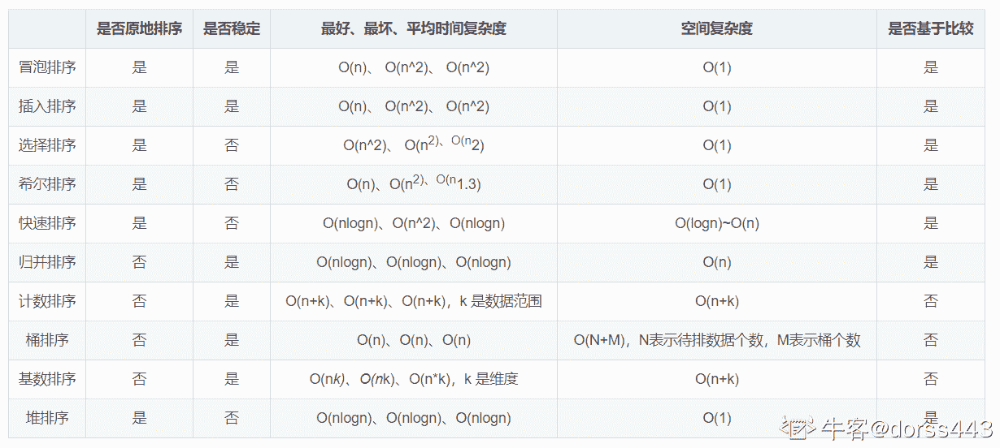
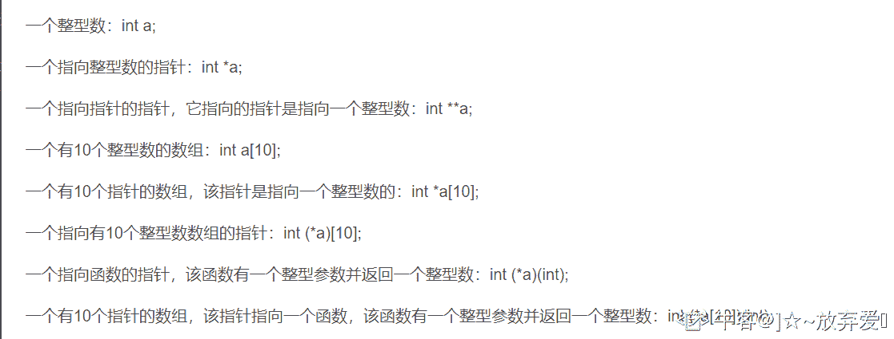

# 【2021】小米秋招软件开发方向第二场笔试

## 1

某二叉树的中序遍历序列为 32145, 后序遍历序列为 32145, 则前序遍历序列为

正确答案: A   你的答案: 空 (错误)

```cpp
54123
```

```cpp
32541
```

```cpp
32154
```

```cpp
54321
```

本题知识点

Java 工程师 C++工程师 PHP 工程师 小米 2021 golang 工程师

讨论

[牛客 735274186 号](https://www.nowcoder.com/profile/735274186)

本题可用 leetcode 中 105 题的思想解决。中序遍历为左、中、右，后序遍历为左、右、中，那么根据后序遍历结果 5 肯定为根节点，然后根据中序遍历可知 5 只有左子树，再依据同样的思想可将二叉树画出，即可进行前序遍历

发表于 2021-06-30 21:55:04

* * *

## 2

下面协议中属于应用层协议的是(   )

正确答案: A B D   你的答案: 空 (错误)

```cpp
 SMTP、POP3
```

```cpp
 FTP、TELNET
```

```cpp
ICMP、ARP
```

```cpp
 HTTP、SNMP
```

本题知识点

Java 工程师 C++工程师 PHP 工程师 小米 2021 golang 工程师

讨论

[想进大厂的 clown.white](https://www.nowcoder.com/profile/361973514)

多选题 多选题

发表于 2021-06-22 20:15:34

* * *

## 3

已经获得除 CPU 以外的所有所需资源的进程处于(  )状态。

正确答案: B   你的答案: 空 (错误)

```cpp
运行状态
```

```cpp
就绪状态
```

```cpp
活动状态
```

```cpp
阻塞状态
```

本题知识点

Java 工程师 C++工程师 PHP 工程师 小米 2021 golang 工程师

讨论

[LiamGio](https://www.nowcoder.com/profile/5474257)

阻塞状态没有获取到 IO 资源

发表于 2021-08-15 13:46:39

* * *

## 4

若已知一个栈的入栈顺序是 1,2,3,...,n,其输出序列为 P1,P2,P3,...,Pn,若 P1 是 n,则 Pi=(  )?

正确答案: C   你的答案: 空 (错误)

```cpp
 i
```

```cpp
n-i
```

```cpp
n-i+1
```

```cpp
不确定
```

本题知识点

Java 工程师 C++工程师 PHP 工程师 小米 2021 golang 工程师

讨论

[Zai 人间凑数的日子](https://www.nowcoder.com/profile/2959034)

没说不可以再入再出啊 看来是我想多了

发表于 2021-07-14 22:48:28

* * *

## 5

下列程序段的时间复杂度是(   )

intfact(int n) { 
       if (n <= 1) 
       { 
           return 1;
        }
       return n * fact(n - 1);
 }

正确答案: B   你的答案: 空 (错误)

```cpp
O(log2n)
```

```cpp
O(n)
```

```cpp
O(nlog2n)
```

```cpp
 O(n*n)
```

本题知识点

Java 工程师 C++工程师 PHP 工程师 小米 2021 golang 工程师

讨论

[黑白乐园](https://www.nowcoder.com/profile/8585289)

n 的阶乘，n 是多少就递归多少下，时间复杂度为 n.

发表于 2021-09-02 17:25:03

* * *

## 6

下列排序算法中,最好情况和最坏情况的时间复杂度相同的是?（）

正确答案: A   你的答案: 空 (错误)

```cpp
堆排序
```

```cpp
快速排序
```

```cpp
冒泡排序
```

```cpp
归并排序
```

本题知识点

Java 工程师 C++工程师 PHP 工程师 小米 2021 golang 工程师

讨论

[dorss443](https://www.nowcoder.com/profile/204935787)



发表于 2021-06-21 21:42:47

* * *

[鹿与折耳猫](https://www.nowcoder.com/profile/240472013)

归并排序不也相同？此题不应该是 AD 吗

发表于 2021-07-15 00:26:46

* * *

[钛极](https://www.nowcoder.com/profile/368375489)

归并是一样的，题目错了

发表于 2021-09-01 17:36:27

* * *

## 7

将两个各有 n 个元素的有序表归并成一个有序表,最少的比较次数是? (   )

正确答案: D   你的答案: 空 (错误)

```cpp
2n
```

```cpp
 2n-1
```

```cpp
n-1
```

```cpp
  n
```

本题知识点

Java 工程师 C++工程师 PHP 工程师 小米 2021 golang 工程师

讨论

[黑白乐园](https://www.nowcoder.com/profile/8585289)

归并排序主要分为两部步，1，递归拆分至最小单元；2，左右小单元排序合并一个大单元。 我猜测，这里的归并就是说的第二步。第二部步里，要循环较小单元的长度次数，比较并按序存放到另一个数组里。最好的情况就是 A 比 B 都小。比如 A[1,2,3], B[4,5,6],那就是，1 和 4 比较，把 1 存到 C[],然后 2 和 4 比较，存放 2，依次类推。 所以，最好情况就是 n 次。

发表于 2021-09-02 17:47:30

* * *

[Decade_](https://www.nowcoder.com/profile/534829948)

我有个疑问，本题问最少的比较次数，那么最佳情况肯定是有序序列 A 完全小于有序序列 B。假定 A={1，2}，B={3，4}，那我岂不是可以设计算法，直接比较 B0 与 A1 的大小？然后如果 B0<a1>发表于 2021-08-20 10:12:11

* * *

## 8

同一个进程的不同线程,以下不能被共享的是? ( ）

正确答案: C   你的答案: 空 (错误)

```cpp
全局变量
```

```cpp
堆
```

```cpp
栈
```

```cpp
文件句柄
```

本题知识点

Java 工程师 C++工程师 PHP 工程师 小米 2021 golang 工程师

讨论

[波妞 08](https://www.nowcoder.com/profile/728784933)

[`www.nowcoder.com/questionTerminal/1ecf3ca506d74384be091b1d6a6d1cb9`](https://www.nowcoder.com/questionTerminal/1ecf3ca506d74384be091b1d6a6d1cb9)

发表于 2021-09-05 23:05:20

* * *

## 9

将递归算法转换为非递归算法, 通常需要使用（ ）

正确答案: A   你的答案: 空 (错误)

```cpp
栈
```

```cpp
队列
```

```cpp
线性表 
```

```cpp
广义表
```

本题知识点

Java 工程师 C++工程师 PHP 工程师 小米 2021 golang 工程师

讨论

[钛极](https://www.nowcoder.com/profile/368375489)

递归可以看成一个栈，每次递归都是在 push，最后一次得到答案开始 pop

发表于 2021-09-01 17:37:16

* * *

## 10

在 MySql 中, productname regexp ‘[1-3]xiaomi’的含义是（）

正确答案: A   你的答案: 空 (错误)

```cpp
 productname 匹配”xiaomi 字符串前一个字符为 1 到 3”的字符串
```

```cpp
 productname 匹配”xiaomi 字符串前一个字符为 1 或 3”的字符串
```

```cpp
 productname 匹配”xiaomi 重复 1 到 3 次”的字符串
```

```cpp
productname 匹配“xiaomi 重复 1 或 5 次”的字符串
```

本题知识点

Java 工程师 C++工程师 PHP 工程师 小米 2021 golang 工程师

讨论

[妖道ԅ](https://www.nowcoder.com/profile/850617717)

A   productname 匹配”xiaomi 字符串前一个字符为 1 或 3”的字符串 B   productname 匹配”xiaomi 字符串前一个字符为 1 到 3”的字符串 

发表于 2021-06-19 10:23:47

* * *

## 11

下面 Java 函数的执行结果是什么（）

static boolean foo(charc)
{
       System.out.print(c); 
       return true; 
}
 public static void main(String[] args) { 
        int i =0;
        for(foo('B');foo('A')&&(i<2);foo('C')) 
        { 
             i++; 
             foo('D');
         } 
}

正确答案: B   你的答案: 空 (错误)

```cpp
BADCBDCB
```

```cpp
BADCADCA
```

```cpp
BACDBACD
```

```cpp
运行时抛出异常
```

本题知识点

Java 工程师 C++工程师 PHP 工程师 小米 2021 golang 工程师

讨论

[牛客 191770685 号](https://www.nowcoder.com/profile/191770685)

  int i =0;
        for(foo('B');foo('A')&&(i<2);foo('C')) 
        { 
             i++; 
             foo('D');
         } //for ( a 语句 ; b 判断语句 ; c 语句){}a 语句循环开始最先执行且只一次 b 判断语句每次循环都要执行 c 语句在判断为 true，执行完大括号方法体中内容之后执行

发表于 2021-06-24 12:18:17

* * *

[采集程序员～](https://www.nowcoder.com/profile/760745243)

1.其实 foo('B');就是初始化条件，只会执行一次，所以第一个打印的肯定是 B。

2.因为 i=0;循环条件是 i<2 （由此可知，循环 i 等于 2 的时候就会停止循环)，所以 0<2 满足条件，接着会输出 A。然后执行 i++;i 就变成 1 了，在输出 D
，在最后输出 C。一次循环后的结果是：BADC。

3.第二次循环的开始是 foo('B');是初始条件，所以不会执行。直接从 foo('A')开始，输出 A，然后 i 为 1，且小于 2，此时循环体内再次执行 i++；i 的值为 2 了，再次输出 D，最后输出 C。第二次循环输出：ADC。

4.然后循环再次执行 for(foo('B');foo('A')&&(i<2);foo('C'))，直接输出 A。i 的值在第二轮循环后的值变成了 2，2<2 不成立，终止循环，输出 A。

故输出结果是：BADCADCA。

发表于 2021-06-25 11:25:05

* * *

## 12

选项中哪一行代码可以替换//add code here 而不产生编译错误（）
public abstract class MyClass { 
       publicint testInt = 5; 
       //addcode here 
       publicvoid method() {
       } 
}

正确答案: A   你的答案: 空 (错误)

```cpp
  publicabstract void method(int a);
```

```cpp
testInt = testInt * 5
```

```cpp
public intmethod();
```

```cpp
 publicabstract void anotherMethod(){}
```

本题知识点

Java 工程师 C++工程师 PHP 工程师 小米 2021 golang 工程师

讨论

[采集程序员～](https://www.nowcoder.com/profile/760745243)

抽象类中可以用普通成员函数 但是不能有方法体

发表于 2021-06-25 11:28:30

* * *

[元气森林打气水](https://www.nowcoder.com/profile/467924585)

抽象方法不能有方法体，抽象类里的非抽象方法必须要有方法体。

发表于 2021-07-01 22:26:07

* * *

[dorss443](https://www.nowcoder.com/profile/204935787)

**抽象类没有方法体 D 错****类体中只能定义变量和方法，不能有其他语句，所以 B 项错误****选项中的方法和类中的方法重复，所以会发生编译异常，所以 C 项错误**

发表于 2021-06-21 21:58:00

* * *

## 13

下列有关软链接表述正确的是? ( ）

正确答案: C   你的答案: 空 (错误)

```cpp
和普通文件没有什么不同,inode 都指向同一个文件在硬盘中的区块
```

```cpp
不能对目录创建软链接
```

```cpp
保存了其代表的文件的绝对路径,是另一种文件,在硬盘上有独立的区块,访问时替代自身路径
```

```cpp
不可以对不存在的文件创建软链接
```

本题知识点

Java 工程师 C++工程师 PHP 工程师 小米 2021 golang 工程师

## 14

Ｃ++中,下列数据类型的转换,哪个可能会发生信息丢失?

正确答案: A C   你的答案: 空 (错误)

```cpp
 int -> char
```

```cpp
  int -> long
```

```cpp
 long -> float
```

```cpp
int -> double
```

本题知识点

Java 工程师 C++工程师 PHP 工程师 小米 2021 golang 工程师

讨论

[Error-500](https://www.nowcoder.com/profile/779471873)

类型转换时只能从小的向大的转换，就相当于大桶装得下小桶的东西，小桶装不下大桶的一样

发表于 2022-02-25 16:11:23

* * *

[牛客 474721145 号](https://www.nowcoder.com/profile/474721145)

这个跟具体机器的实现有关系吧

发表于 2021-07-15 11:56:24

* * *

[Yanshsf](https://www.nowcoder.com/profile/36399629)

大数据转小数据会丢失精度

发表于 2021-06-22 22:18:39

* * *

## 15

在 java 中,要使某个类能被同一个包中的其他类访问,但不能被这个包以外的类访问,可以（）

正确答案: A   你的答案: 空 (错误)

```cpp
让该类不使用任何关键字 
```

```cpp
使用 private 关键字
```

```cpp
使用 protected 关键字 
```

```cpp
使用 public 关键字
```

本题知识点

Java 工程师 C++工程师 PHP 工程师 小米 2021 golang 工程师

讨论

[猿途](https://www.nowcoder.com/profile/4670762)

public > protected > default > private

一、包访问权限（default）：

    默认访问权限没有任何关键字，但通常指包访问权限。这意味着**当前包**中所有类对这个成员都有访问权限，但对于这个包之外的所有类，这个成员却是 private。

二、public：公共访问权限，接口访问权限

    所修饰的类、变量、方法，在内外包均具有访问权限。

三、private：私有权限    

    只有本类的方法可以访问，其他任何类都无法访问这个成员。

四、protected：继承访问权限

    子类可以访问，同一个包的类也能访问。区分 protected 和 default：分 protected 和 default 权限：

注意区分区分 protected 和 default 权限：

*   当某个成员能被所有的子类继承，但不能被外包的非子类访问，就是用 protected；

*   当某个成员的访问权限只对同包的类开放，包括不能让外包的类继承这个成员，就用 default。

发表于 2021-06-21 16:12:54

* * *

## 16

有关 java 静态初始化块说法正确的是?（）

正确答案: A B C   你的答案: 空 (错误)

```cpp
无法直接调用静态初始化块
```

```cpp
在创建第一个实例前,将自动调用静态初始化块来初始化
```

```cpp
 静态初始化块没有访问修饰符和参数
```

```cpp
用户可以控制何时执行静态初始化块
```

本题知识点

Java 工程师 C++工程师 PHP 工程师 小米 2021 golang 工程师

讨论

[牛客 417943135 号](https://www.nowcoder.com/profile/417943135)

刚开始无法直接调用静态初始化块

发表于 2022-03-05 22:24:33

* * *

[Error-500](https://www.nowcoder.com/profile/779471873)

初始化模块用户是不能直接调用的，都是系统自动初始化

发表于 2022-02-25 16:33:07

* * *

## 17

下列叙述正确的是（）

正确答案: A B C   你的答案: 空 (错误)

```cpp
引用必须被初始化, 但是指针不必
```

```cpp
可以删除指针, 但是不能删除引用
```

```cpp
 不存在指向空值的引用, 但是存在指向空值的指针
```

```cpp
指针初始化后不能被改变, 引用可以改变所指对象
```

本题知识点

Java 工程师 C++工程师 PHP 工程师 小米 2021 golang 工程师

## 18

以下分别对变量 a 给出定义，正确的有（）

正确答案: A B D   你的答案: 空 (错误)

```cpp
 一个有 10 个指针的数组，该指针指向一个整型数：int*a[10];
```

```cpp
一个指向有 10 个整型数数组的指针：int(*a)[10];
```

```cpp
一个指向函数的指针，该函数有一个整型参数并返回一个整型数：int*a(int);
```

```cpp
 一个有 10 个指针的数组，该指针指向一个函数，该函数有一个整型参数并返回一个整型数： int(*a[10])(int);
```

本题知识点

Java 工程师 C++工程师 PHP 工程师 小米 2021 golang 工程师

讨论

[]☆~放弃爱❤](https://www.nowcoder.com/profile/6957431)



发表于 2021-06-25 21:36:36

* * *

[24K 纯学渣](https://www.nowcoder.com/profile/687880680)

C 返回的是一个 int 指针，不是 int 数据

发表于 2021-06-30 20:55:26

* * *

[dorss443](https://www.nowcoder.com/profile/204935787)

C 改为：int (*a)(int)

发表于 2021-06-21 22:16:55

* * *

## 19

list 和 vector 的区别有哪些（）

正确答案: A B   你的答案: 空 (错误)

```cpp
 vector 拥有一段连续的内存空间，因此支持随机存取，如果需要高效的随即存取，而不在乎插入和删除的效率，使用 vector。
```

```cpp
 list 拥有一段不连续的内存空间，因此支持随机存取，如果需要大量的插入和删除，而不关心随即存取，则应使用 list。
```

```cpp
已知需要存储的元素时，使用 list 较好
```

```cpp
 如果需要任意位置插入元素，使用 vector 较好。
```

本题知识点

Java 工程师 C++工程师 PHP 工程师 小米 2021 golang 工程师

讨论

[24K 纯学渣](https://www.nowcoder.com/profile/687880680)

list 支持随机访问吗？它不是一个双向链表吗？

发表于 2021-06-30 20:54:32

* * *

[虚构机器人](https://www.nowcoder.com/profile/8648687)

list 底层实现是数组，是连续的内存空间

发表于 2021-06-27 11:44:53

* * *

[不搭 201812091851305](https://www.nowcoder.com/profile/678939833)

list 支持随机存取？

发表于 2021-06-21 20:59:26

* * *

## 20

下列关于 C++容器描述错误的是?（）

正确答案: B   你的答案: 空 (错误)

```cpp
  list 类型支持双向顺序访问，在 list 中任何位置插入删除都很快
```

```cpp
 vector 类型在每次调用 pushback 函数时都在栈上开辟新内存
```

```cpp
deque 类型支持快速顺序访问，在头尾插入/删除速度很快
```

```cpp
 list 类型支持双向顺序访问，在 list 中任何位置插入删除都很快
```

本题知识点

Java 工程师 C++工程师 PHP 工程师 小米 2021 golang 工程师

讨论

[dorss443](https://www.nowcoder.com/profile/204935787)

deque：双端队列。支持快速随机访问。在头尾位置插入/删除速度很快。

发表于 2021-06-21 22:18:40

* * *

[开心七柚](https://www.nowcoder.com/profile/36863091)

1\. 如果程序要求随机访问元素，则应使用 vector 或 deque 容器。
2\. 如果程序必须在容器的中间位置插入或删除元素，则应采用 list 容器。
3\. 如果程序不是在容器的中间位置，而是在容器首部或尾部插入或删除元素，则应采用 deque 容器

发表于 2021-06-23 13:41:15

* * *

## 21

给定一个字符串 str，判断是不是整体有效的括号字符串(整体有效：即存在一种括号匹配方案，使每个括号字符均能找到对应的反向括号，且字符串中不包含非括号字符)。数据范围： 

本题知识点

字符串 *栈 *Java 工程师 C++工程师 PHP 工程师 小米 2021 golang 工程师** **讨论

[復活の検事](https://www.nowcoder.com/profile/531133767)

看了下楼上的代码，实际上没必要一个个左括号右括号匹配来看的只需要循环把"()"替换成""即可

```cpp
import java.util.Scanner;
import java.util.regex.Matcher;

public class Main{
    public static void main(String[] args){
        Scanner scanner = new Scanner(System.in);
        while(scanner.hasNext()){
            String input = scanner.next();
            while(true){
                if(input.equals("")){
                    System.out.println("YES");
                    break;
                }else if(input.equals(input.replace("()",""))){
                    System.out.println("NO");
                    break;
                }else{
                    input=input.replace("()","");
                }
            }
        }
    }

}
```

发表于 2020-05-07 13:18:31

* * *

[zhangjinlu.97](https://www.nowcoder.com/profile/738832125)

```cpp
#include <stdio.h>
#include <string.h>
#include <stdbool.h>

#define MAXLEN 100001

bool isValid(char *str);

int main(void) {
    char str[MAXLEN];
    scanf("%s", str);
    printf("%s\n", isValid(str) ? "YES" : "NO");
    return 0;
}

bool isValid(char *str) {
    int len = (int) strlen(str);
    int sum = 0;
    for (int i = 0; i < len; i++) {
        if (str[i] != '(' && str[i] != ')')
            return false;
        sum += str[i] == '(' ? 1 : -1;
        if (sum < 0) return false;
    }
    return sum == 0;
}
```

发表于 2022-02-09 15:50:48

* * *

[亮剑 _](https://www.nowcoder.com/profile/1101530)

```cpp
import java.util.Scanner;

public class Main {

    public static void main(String[] args) {
        Scanner sc = new Scanner(System.in);
        while (sc.hasNext()) {
            String s = sc.nextLine();
            System.out.println(isBracketsStr(s) ? "YES" : "NO");
        }
        sc.close();
    }

    /** 此算法真正实现了时间复杂度 O(n)、额外空间复杂度 O(1) */
    public static boolean isBracketsStr(String str) {
        if (str == null || str.length() == 0 || str.length() > 1e5) {
            return false;
        }
        char[] chars = str.toCharArray();
        // 相当于栈中有多少个'('
        int brackets = 0;
        for (int i = 0; i < chars.length; i++) {
            if (chars[i] != '(' && chars[i] != ')') {
                return false;
            }
            // 首位字符如果是右括号，不用进行后续的流程了，肯定不是有效括号串
            if (chars[0] == ')') {
                return false;
            }
            if (chars[i] == '(') {
                // 相当于将'('压栈
                brackets++;
            } else if (chars[i] == ')') {
                // 相当于将'('出栈
                brackets--;
                // 栈已为空，此时再进行出栈操作，则说明在左括号'('后面有多于其数量的右括号')'，因此直接判定不是有效括号串
                if (brackets < 0) {
                    return false;
                }
            }
        }
        return (brackets == 0);
    }

}
```

编辑于 2022-03-06 15:55:18

* * *

## 22

给定一个长度为字符串, 需要去除所有之前曾经出现过的字符，只保留第一次出现的字符

本题知识点

Java 工程师 C++工程师 PHP 工程师 小米 2021 golang 工程师

讨论

[Yanshsf](https://www.nowcoder.com/profile/36399629)

```cpp
class Solution {
public:
    string unique_string(string s) {
        string res;
        unordered_set<char>se;
        for(int i=0;i<s.size();i++){
            if(!se.count(s[i])){
            res+=s[i];
                se.insert(s[i]);
            }
        }
        return res;
    }
};
```

思路是用 set 来去重 发表于 2021-06-22 22:22:07

* * *

[PlutoYU](https://www.nowcoder.com/profile/693360607)

```cpp
import java.util.*;

public class Solution {
    /**
     * 代码中的类名、方法名、参数名已经指定，请勿修改，直接返回方法规定的值即可
     *
     * 
     * @param s string 字符串 
     * @return string 字符串
     */
    public String unique_string (String s) {
        HashSet<Character> set = new HashSet<>();
        char[] ch = s.toCharArray();
        StringBuilder sb = new StringBuilder();

        for (char c : ch) {
            if (!set.contains(c)) {
                set.add(c);
                sb.append(c);
            }
        }
        return sb.toString();
    }
}
```

发表于 2021-06-22 14:56:34

* * *

[一眼账目不见泰山](https://www.nowcoder.com/profile/999047196)

核心代码： 

```cpp
if (s.indexOf(s.charAt(i)) == i)
```

如果 s 的 i 位字符 x 不重复，s.indexOf(x)的索引值一定等于 i 但是 s 的 i 位字符 x 重复，s.indexOf(x)的索引值只会返回第一次出现 x 时的索引

```cpp
 public String unique_string (String s) {
        // write code here
        StringBuffer sb = new StringBuffer();
        for (int i = 0; i < s.length(); i++) {
            if (s.indexOf(s.charAt(i)) == i) {
                sb.append(s.charAt(i));
            }
        }
        return sb.toString();
    }
```

时间复杂度 o（n） 空间复杂度 o（H) h 为去重后字符串长度

发表于 2021-06-20 10:05:40

* * ***</a1>