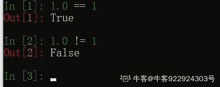

# 【2021】小米秋招运维方向第二场笔试

## 1

以下哪个 Nginx 配置不涉及磁盘读写

正确答案: B   你的答案: 空 (错误)

```cpp
client_body_temp_path
```

```cpp
 proxy_cookie_path
```

```cpp
proxy_temp_path
```

```cpp
access_log
```

本题知识点

运维工程师 小米 2021

## 2

以下 python 程序的输出结果是什么
def printNumber(num):
for i in range(num):
print(i)
return
printNumber(10)

正确答案: B   你的答案: 空 (错误)

```cpp
10
```

```cpp
1
```

```cpp
9
```

本题知识点

运维工程师 小米 2021

讨论

[牛客 912629889 号](https://www.nowcoder.com/profile/912629889)

打印 0-9 出来

发表于 2021-06-22 13:51:21

* * *

[牛客 744795069 号](https://www.nowcoder.com/profile/744795069)

range(10)，为 0-10，由于刚执行一次循环就 return 了，所以只输出 0

发表于 2021-06-21 17:21:37

* * *

[牛客 603490500 号](https://www.nowcoder.com/profile/603490500)

不应该是打印 0-9 嘛

发表于 2021-06-21 15:42:51

* * *

## 3

开发一款竞技类，对实时性要求比较高的网络游戏，下列哪个网络协议不合适

正确答案: A   你的答案: 空 (错误)

```cpp
HTTPS
```

```cpp
TCP
```

```cpp
UDP
```

```cpp
  WebSocket
```

本题知识点

运维工程师 小米 2021

## 4

rs = 0.1
count = 0
while rs != 1:
   count += 1
   rs += 0.1
print(count)
Count 的最终打印结果是什么？

正确答案: D   你的答案: 空 (错误)

```cpp
9
```

```cpp
10
```

```cpp
11
```

```cpp
其余都不对
```

本题知识点

运维工程师 小米 2021

讨论

[宇智波·秀](https://www.nowcoder.com/profile/806841337)

1.0 !=1

发表于 2021-06-19 15:48:23

* * *

[牛客 922924303 号](https://www.nowcoder.com/profile/922924303)

在 Python3 中浮点型与整形相等啊

发表于 2022-01-14 11:48:37

* * *

## 5

反码 11000011 的真值为多少？

正确答案: C   你的答案: 空 (错误)

```cpp
-59
```

```cpp
 -60
```

```cpp
-61
```

```cpp
-62
```

```cpp
-63
```

本题知识点

运维工程师 小米 2021

讨论

[牛客 744795069 号](https://www.nowcoder.com/profile/744795069)

原码就是二进制定点表示法，即最高位为符号位，“0”表示正，“1”表示负，其余位表示数值的大小。 反码：正数的反码与其原码相同；负数的反码是对其原码逐位取反，但符号位除外。补码：正数的补码与其原码相同；负数的补码是在其反码的末位加 1。源码：11000011，反码：10111100,值：2⁰X0+2¹X0+2²X1+2³X1+2⁴X1+2⁵X1+2⁶X0=-60，不知道哪里不对 

发表于 2021-06-21 17:51:10

* * *

[小白牛牛🐂](https://www.nowcoder.com/profile/843919126)

答案错了，应该是-60

发表于 2021-10-18 10:22:59

* * *

## 6

#Go 程序的输出结果是什么
package main
import (
"fmt"
)

func main() {
for i := 0; i < 8; i++ {
defer func() {
fmt.Print(i)
}()
}
}

正确答案: D   你的答案: 空 (错误)

```cpp
01234567
```

```cpp
12345678
```

```cpp
00000000
```

```cpp
88888888
```

本题知识点

运维工程师 小米 2021

讨论

[牛客 843524834 号](https://www.nowcoder.com/profile/843524834)

D. 函数运行过程 1，for 循环，defer func(): **func 及其参数(**本例中没有**)连续 8 次压入函数栈。每次压栈的过程，还没有执行 print。**2，for 循环结束，i 已经增加到 83，return 之前，defer 再将 8 个 func()出栈，每次 func 的执行过程是：     1）fmt.Print 和参数 i 入栈，此时，i 值需要确定，查看 i 值，结果为 8     2）fmt.Print 出栈     3）执行 print，打印 i4，return  因此，每次 func 都会打印一个 8，结果就是 88888888

编辑于 2021-07-22 19:49:50

* * *

## 7

执行下列代码会输出什么
import math as m
print (math.fabs(-25))

正确答案: B   你的答案: 空 (错误)

```cpp
25
```

```cpp
An error occurs
```

```cpp
5
```

本题知识点

运维工程师 小米 2021

讨论

[牛客 922924303 号](https://www.nowcoder.com/profile/922924303)

在 python3 中把模块名用 as 重新命名，那么原模块名的内存地址引用就到了重新命名

发表于 2022-01-14 11:54:42

* * *

## 8

下列代码的执行结果是什么
nums = list(range(4,64,4))
print(nums[2])

正确答案: C   你的答案: 空 (错误)

```cpp
4
```

```cpp
8
```

```cpp
12
```

```cpp
16
```

本题知识点

运维工程师 小米 2021

讨论

[lbiger](https://www.nowcoder.com/profile/356777769)

0 1 2 的顺序是第三位

发表于 2021-06-22 18:31:26

* * *

## 9

命令输出如下，反映什么问题？
[host@test ~]#netstat -na | grep ESTABLISHED | wc -l
[host@test ~]#65535

正确答案: C   你的答案: 空 (错误)

```cpp
内存不足
```

```cpp
系统打开的文件太大
```

```cpp
句柄数不足
```

```cpp
磁盘 inode 已满
```

本题知识点

运维工程师 小米 2021

## 10

已知一个文件/root/file.config，下列哪个命令可以查看该文件被哪个进程打开使用了

正确答案: B   你的答案: 空 (错误)

```cpp
ls
```

```cpp
 lsof
```

```cpp
ps
```

```cpp
top
```

本题知识点

运维工程师 小米 2021

## 11

系统下有一个依赖 jdk 的程序，可以直接正常执行。但通过脚本做计划任务运行时失败，可能的原因是

正确答案: A   你的答案: 空 (错误)

```cpp
脚本中缺少某些环境变量
```

```cpp
系统中没有 jdk
```

```cpp
缺少执行权限
```

```cpp
脚本中 java 程序异常
```

本题知识点

运维工程师 小米 2021

## 12

下列哪个选项是查找文件 file 中以.log 开始的行

正确答案: A   你的答案: 空 (错误)

```cpp
grep '^\.log' file
```

```cpp
grep '\.log' file
```

```cpp
grep '^.log' file
```

```cpp
grep '.log$' file
```

本题知识点

运维工程师 小米 2021

## 13

"已知如下命令及返回结果，请问 echo $host 的返回值是（）
[host@test ~]#cat test.sh
host=`hostname`
[host@test ~]#sh test.sh
[host@test ~]#echo $host"

正确答案: D   你的答案: 空 (错误)

```cpp
host
```

```cpp
test
```

```cpp
root
```

```cpp
空值
```

本题知识点

运维工程师 小米 2021

## 14

[host@test ~]# ping 10.0.0.1
PING 10.0.0.1 (10.0.0.1) 56(84) bytes of data.
64 bytes from 10.0.0.1: icmp_seq=1 ttl=64 time=0.023 ms
[host@test ~]# telnet 10.0.0.1 666
Trying 10.0.0.1 ...
telnet: connect to address 10.0.0.1 : Connection refused
telnet 提示 Connection refused 的可能是什么

正确答案: A B C   你的答案: 空 (错误)

```cpp
10.0.0.1 机器的 666 端口上服务不正常
```

```cpp
telnet 不能侦测 udp 协议端口
```

```cpp
 10.0.0.1 机器的防火墙限制了 666 端口的访问
```

```cpp
其余选项都不对
```

本题知识点

运维工程师 小米 2021

## 15

下列为 go 语言的关键字的有哪些？

正确答案: A B D E   你的答案: 空 (错误)

```cpp
goto
```

```cpp
range
```

```cpp
while
```

```cpp
make
```

```cpp
new
```

本题知识点

运维工程师 小米 2021

讨论

[牛客 324520252 号](https://www.nowcoder.com/profile/324520252)

ABDE

发表于 2021-10-21 03:01:25

* * *

[王 1](https://www.nowcoder.com/profile/134289858)

除了 C 都有

发表于 2021-06-25 09:18:56

* * *

## 16

以下哪些地方可以将 merge requests 关联到 git issue

正确答案: A B D   你的答案: 空 (错误)

```cpp
git commit message
```

```cpp
merge requests message
```

```cpp
tag message
```

```cpp
issue message
```

本题知识点

运维工程师 小米 2021

## 17

下列哪些选项是“索引”实现快速查找的原理

正确答案: A C D   你的答案: 空 (错误)

```cpp
平衡二叉查找树
```

```cpp
取模算法
```

```cpp
 红黑树
```

```cpp
二分查询
```

本题知识点

运维工程师 小米 2021

## 18

CDN 技术适合应用在下列哪些互联网产品中

正确答案: A B C D   你的答案: 空 (错误)

```cpp
app 应用商店
```

```cpp
视频网站
```

```cpp
在线音乐服务
```

```cpp
静态资源网站
```

本题知识点

运维工程师 小米 2021

## 19

下列代码中哪一个数字不会被打印出来
try:
print(5/0)
print(4)
print(3/0)
except ZeroDivisionError:
print(2)
finally:
print(1)

正确答案: C D   你的答案: 空 (错误)

```cpp
1
```

```cpp
2
```

```cpp
3
```

```cpp
4
```

本题知识点

运维工程师 小米 2021

讨论

[新鲜的小肥狗](https://www.nowcoder.com/profile/92323122)

try 语句块中 5/0 输出为错误，所以直接进入 except 语句块，因此只会输出 2 和 1

发表于 2021-08-23 10:42:13

* * *

## 20

 函数如下

  def chanageList(list):

    list.append(" end")

print("list",list)

#调用

strs =['1','2']

chanageList(strs)

print("strs",strs)

下面对 strs 和 list 的值输出正确的是（）

正确答案: C D   你的答案: 空 (错误)

```cpp
strs ['1','2']  
```

```cpp
list  ['1','2']
```

```cpp
list ['1','2',’end’]  
```

```cpp
strs  ['1','2',’end’] 
```

本题知识点

运维工程师 小米 2021

## 21

因疫情防控要求，A 影院制定了如下选座要求：

来自同一家庭的必须坐在一起(横向或纵向相邻)，不同家庭之间必须分开坐(横向纵向之间有间隔)。影院座位可以视为二维的网格。给定的影院座位图（座位图中 1 代表座位已被占用，0 代表未占用），求观影的家庭数量。

本题知识点

运维工程师 小米 2021

## 22

小米 SRE 团队负责 XIAOMI 所有核心业务系统的可用性、性能、容量相关的保障工作。因技术场景丰富，团队内部经常进行技术方案交流。目前有个 SRE 工程师，在会议室围成一个圈，第个 SRE 工程师准备了数量的技术方案文档，你现在需要去收集技术文档，只有一个要求，不可以同时取相邻 SRE 工程师的技术文档。给定一个非负整数数组，在不破坏要求的情况下，能够取到最多的技术文档。

本题知识点

运维工程师 小米 2021

讨论

[JCoder](https://www.nowcoder.com/profile/1405380)

这破题，话都说不明白，题面说是一个圈，然后实际是一排，这要让面试者猜吗？

发表于 2021-10-21 17:56:09

* * *

[牛客 402776921 号](https://www.nowcoder.com/profile/402776921)

请看力扣打家劫社 2

发表于 2021-06-23 10:13:46

* * *