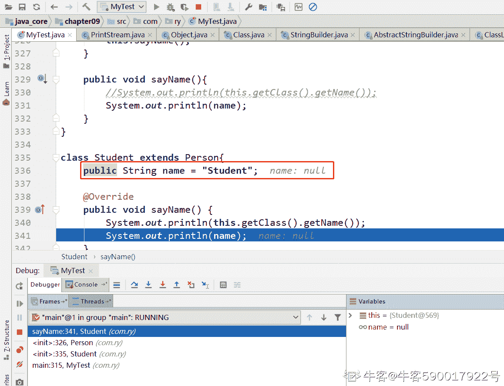

# 【2021】小米秋招 Android 方向第一场笔试

## 1

1、在 23 种经典的设计模式中，对于“解决复杂的流程控制，组织多个对象，进行对象间职责分配”的设计模式，以下哪些属于这类模式（      ）

正确答案: A E   你的答案: 空 (错误)

```cpp
中介者模式
```

```cpp
装饰模式
```

```cpp
代理模式
```

```cpp
 适配器模式
```

```cpp
责任链模式
```

本题知识点

安卓工程师 小米 2021

讨论

[牛客 688694058 号](https://www.nowcoder.com/profile/688694058)

AE 中介模式：用一个对象封装多个对象的交互，从而使得各个对象之间不需要相互作用，可以独立改变他们之间的交互责任链模式：使多个对象都有机会处理，避免了发送者和请求者之间的耦合关系。将这些对象连成一条链，并沿着这个链传递请求，直到有对象把它处理

发表于 2021-07-26 16:46:04

* * *

## 2

下列关于算法和数据结构的叙述正确的是？（     ）

正确答案: C D   你的答案: 空 (错误)

```cpp
算法和程序原则上没有区别，在讨论数据结构时，二者通用
```

```cpp
数据结构是指相互之间存在一种或多种关系的数据元素
```

```cpp
所谓数据的逻辑结构是指数据元素之间的逻辑关系
```

```cpp
从逻辑关系上看，数据结构只分为两类：线性结构和非线性结构
```

本题知识点

安卓工程师 小米 2021

讨论

[yang~~](https://www.nowcoder.com/profile/427286790)

A 选项错误，算法是为一个问题或一类问题给出的解决方法与具体步骤，是对问题求解过程的一种准确而完整的**逻辑描述**。**程序**则是为了用计算机解题或控制某一过程而编排的一系列**指令的集合**。程序不等于算法。但是，通过程序设计可以在计算机上实现算法。B 选项错误   数据结构的定义: 数据结构是相互之间存在一种或多种  特定  关系的数据元素的集合。

发表于 2021-08-01 09:46:04

* * *

## 3

从表的任意一个点出发，都能扫描整个表的是？（    ）

正确答案: A B   你的答案: 空 (错误)

```cpp
双向链表
```

```cpp
循环链表
```

```cpp
单向链表
```

```cpp
静态链表
```

本题知识点

安卓工程师 小米 2021

## 4

关于线性表，下列叙述不正确的是？（     ）

正确答案: A D   你的答案: 空 (错误)

```cpp
线性表在链式存储时，查找第 i 个元素的时间与 i 值无关
```

```cpp
线性表在链式存储时，查找第 i 个元素的时间与 i 值成正比
```

```cpp
线性表在顺序存储时，查找第 i 个元素的时间同 i 值无关
```

```cpp
线性表在顺序存储时，查找第 i 个元素的时间同 i 值成正比
```

本题知识点

安卓工程师 小米 2021

## 5

下列方法执行时，可以使线程进入阻塞状态的是？（     ）

正确答案: A B D   你的答案: 空 (错误)

```cpp
Object 的 wait 方法
```

```cpp
Thread 的 sleep 方法
```

```cpp
Thread 的 yield 方法
```

```cpp
Thread 的 join 方法
```

```cpp
Thread 的 interrupt 方法
```

本题知识点

安卓工程师 小米 2021

讨论

[yang~~](https://www.nowcoder.com/profile/427286790)

各种方法的解释:

*   Object 的 wait 方法：wait 指线程处于进入阻塞状态，不占用任何资源，不增加时间限制。

*   Thread 的 sleep 方法： sleep 指线程被调用时，占着 CPU 不工作，其他线程无法进入，会增加时间限制。

*   Thread 的 yield 方法：yield()的作用是让步。它能让当前线程由**“运行状态”**进入到**“就绪状态”**，从而让其它具有相同优先级的等待线程获取执行权；但是，并不能保证在当前线程调用 yield()之后，其它具有相同优先级的线程就一定能获得执行权；也有可能是当前线程又进入到“运行状态”继续运行！

*   Thread 的 join 方法：join()方法将挂起调用线程的执行，直到被调用的对象完成它的执行。故而是阻塞状态。比如系统目前运行线程 A，在线程 A 里面调用了线程 B.join 方法，则接下来线程 B 会抢先在线程 A 面前执行，等到线程 B 全部执行完后才继续执行线程 A。

*   Thread 的 interrupt 方法：其作用是中断此线程（此线程不一定是当前线程，而是指调用该方法的 Thread 实例所代表的线程），但实际上只是给线程设置一个中断标志，线程仍会继续运行。

发表于 2021-08-01 09:54:20

* * *

## 6

以下哪些选项是 TCP 为了保证程序间的可靠通信而使用？（      ）

正确答案: A B C   你的答案: 空 (错误)

```cpp
序列编号
```

```cpp
校验和
```

```cpp
ACK 控制位
```

```cpp
紧急指针
```

```cpp
调整窗口尺寸
```

本题知识点

安卓工程师 小米 2021

讨论

[ekikun](https://www.nowcoder.com/profile/682880391)

A,B,CD 紧急指针用于在某些紧急情况下为应用传输紧急数据，和可靠性无关 E 调整窗口大小和 TCP 的滑动窗口，缓存机制有关，而可靠性考虑的时数据发送时不出错，不乱序，不丢失

发表于 2021-12-20 20:59:21

* * *

## 7

View 是 android 开发中经常接触的，下列说法正确的是？（      ）

正确答案: B F   你的答案: 空 (错误)

```cpp
每个 Activity 的根布局都是 ViewRootImpl
```

```cpp
ViewGroup 是 View 的子类
```

```cpp
通过直接继承 View 类，可以自定义一个布局
```

```cpp
Intent 可以传递 View 对象
```

```cpp
在 View 完成大小计算后（即执行完成 onMeasure），就可以通过 View.getHeight()获取 view 的高度
```

```cpp
 View 必须完成布局后（即执行完成 onLayout），才可以通过 View.getHeight()获取 view 的高度
```

本题知识点

安卓工程师 小米 2021

讨论

[牛客 948115877 号](https://www.nowcoder.com/profile/948115877)

 *   ```cpp

    		每个 Activity 的根布局都是 ViewRootImpl

    ```

    错，根布局是一个 DecorView*   ```cpp

    		ViewGroup 是 View 的子类

    ```

    对。*   ```cpp

    		通过直接继承 View 类，可以自定义一个布局

    ```

    错。自定义一个布局，需要继承 ViewGroup，或者 ViewGroup 的子类。*   ```cpp

    		Intent 可以传递 View 对象

    ```

    错。Intent 只能传递 Serializable/Parcelable 的对象，View 不是这两者，所以不能传递。*   ```cpp

    		在 View 完成大小计算后（即执行完成 onMeasure），就可以通过 View.getHeight()获取 view 的高度

    ```

    错。onMeasure 之后只能获取到 getMeasuredHeight(),获取不到 getHeight()*   ```cpp

    		View 必须完成布局后（即执行完成 onLayout），才可以通过 View.getHeight()获取 view 的高度

    ```

    对。onLayout 之后，View.layout()方法调用后，View.mHeight 被赋值，之后才可通过 View.getHeight 获取高度 

发表于 2021-09-17 20:13:36

* * *

[牛客 634122433 号](https://www.nowcoder.com/profile/634122433)

通过直接继承 View 类，可以自定义一个布局 为什么这个是错的

发表于 2021-07-01 14:41:28

* * *

[yang~~](https://www.nowcoder.com/profile/427286790)

A: 每个 Activity 的根布局是 DecorViewC: 继承 View 可自定义控件， 继承 ViewGroup 可自定义布局

发表于 2021-08-01 10:00:55

* * *

## 8

android 跨进程调用(或访问)的方式有哪些？（      ）

正确答案: A B   你的答案: 空 (错误)

```cpp
AIDL
```

```cpp
ContentProvider
```

```cpp
Bundle
```

```cpp
ContentResolver
```

本题知识点

安卓工程师 小米 2021

讨论

[人间小苦瓜](https://www.nowcoder.com/profile/595455289)

ContentResolver 为什么不是跨进程调用？

发表于 2022-01-15 23:02:24

* * *

[sword0769](https://www.nowcoder.com/profile/337778650)

Bundle 实现了 Parcelable 所以它可以方便的在不同进程间传输，但需通过 Intent 来实现调用/访问

发表于 2021-12-14 21:49:20

* * *

## 9

一个高度为 5 的平衡二叉树，他的结点数最少为多少个？（      ）

正确答案: D   你的答案: 空 (错误)

```cpp
8
```

```cpp
10
```

```cpp
11
```

```cpp
12
```

本题知识点

安卓工程师 小米 2021

讨论

[yang~~](https://www.nowcoder.com/profile/427286790)

最小节点数:min(n) = F(n+2) - 1 其中，F 为斐波那契数列， 1 1 2 3 5 8 13 ...所以 min(5) = F(7) - 1 = 13 - 1 = 12 最多节点数:max(n) = 2^n - 1

发表于 2021-08-01 10:09:21

* * *

[榴莲桃子派](https://www.nowcoder.com/profile/685753886)

高度为 h 的平衡二叉树最小节点数 Nh=Nh-1+Nh-2+1

发表于 2022-01-07 14:13:27

* * *

## 10

数据库事务的特征，以下描述不正确的是？（     ）

正确答案: A   你的答案: 空 (错误)

```cpp
互斥性
```

```cpp
持久性
```

```cpp
原子性
```

```cpp
其余选项都不正确
```

本题知识点

安卓工程师 小米 2021

讨论

[人间小苦瓜](https://www.nowcoder.com/profile/595455289)

ACIDAtomicity 原子性 Consistency 一致性 Isolation 隔离性 Durability 持续性

发表于 2022-01-15 23:29:25

* * *

[yang~~](https://www.nowcoder.com/profile/427286790)

具体解析参考： [`www.cnblogs.com/fjdingsd/p/5273008.html`](https://www.cnblogs.com/fjdingsd/p/5273008.html)数据库的四大特性: 原子性、一致性、隔离性、持久性

发表于 2021-08-01 10:14:39

* * *

## 11

Java 语言环境下，运行以下代码，输出的结果是（      ）

int a = 0;
while (a < 10) {
   switch (a) {
       case 2:
           a += 2;
       case 0:
           a += 2;
       case 4:
           a += 4;
       default:
           a += 4;
   }
}
System.out.println(a);

正确答案: A   你的答案: 空 (错误)

```cpp
10
```

```cpp
8
```

```cpp
6
```

```cpp
12
```

本题知识点

安卓工程师 小米 2021

讨论

[0k-ok](https://www.nowcoder.com/profile/473295963)

进入循环，选择语句执行 case 0：此时 a=2，没有 break，default 满足条件，此时 a=2+4=6;此时还不满足跳出循环的条件，继续进入循环，选择语句执行 default，此时 a=6+4=10;不满足进入循环的条件，循环结束，a 的最终结果为 10

发表于 2022-03-01 17:19:23

* * *

[狼少丷](https://www.nowcoder.com/profile/45458977)

a=0+2+4+4

发表于 2021-11-03 18:19:41

* * *

[皮卡皮卡 01001！](https://www.nowcoder.com/profile/208976584)

 case 0:a=a+2=4。因为没加 break，所以 a=a+4=6;a=a+4=10.

发表于 2021-10-06 10:42:40

* * *

## 12

运行 Test 的 main 代码，关于输出的结果正确的是（      ）
class Person {
   public String name = "Person";
   public Person() {
       sayName();
   }
   public void sayName() {
       System.out.println(name);
   }
}
class Student extends Person {
   public String name = "Student";
   public void sayName() {
       System.out.println(name);
   }
}
class Test {
   public static void main(String[] args) {
       new Student();
   }
}

正确答案: D   你的答案: 空 (错误)

```cpp
Person
```

```cpp
Student
```

```cpp
Person Student
```

```cpp
null
```

本题知识点

安卓工程师 小米 2021

讨论

[jingkanhuakai](https://www.nowcoder.com/profile/193554197)

由于 sayName 是实例方法，所以其实输出的是对象的名字，而 new Student()没有赋值名字。

发表于 2021-08-20 11:39:23

* * *

[牛客 590017922 号](https://www.nowcoder.com/profile/590017922)

在 Person 类的空参构造器中调用的 sayName()方法是 Student 中重写的 sayName()方法，这个时候 Student 类中的 name 域还没有被显式初始化，所以输出的是 null。

发表于 2021-09-07 21:14:19

* * *

## 13

以下代码的时间复杂度为（     ）

int func(int n){
   if (n <= 1) {
       return n;
   }
   return n * func(n - 1);
}

正确答案: A   你的答案: 空 (错误)

```cpp
O(n)
```

```cpp
O(log2n)
```

```cpp
O(n2)
```

```cpp
O(nlog2n)
```

本题知识点

安卓工程师 小米 2021

讨论

[人间小苦瓜](https://www.nowcoder.com/profile/595455289)

递归算法的时间复杂度要看    递归的次数*每次递归的操作次数为 n，每次操作为 1，所以 n*1=n

发表于 2022-01-15 23:56:49

* * *

## 14

以下哪一个不是栈的基本运算？（     ）

正确答案: B   你的答案: 空 (错误)

```cpp
删除栈顶元素
```

```cpp
 删除栈底的元素
```

```cpp
判断栈是否为空
```

```cpp
将栈置为空栈
```

本题知识点

安卓工程师 小米 2021

## 15

在 java 语言环境下，下面关于线程同步的描述，错误的是（      ）

正确答案: A   你的答案: 空 (错误)

```cpp
Lock 比 synchronize 更加灵活，Lock 的 lock 和 unlock 方法必须成对出现，并且都在一个方法中调用
```

```cpp
 volatile 可用于修饰共享变量，保证了线程的可见性和有序性，但是不能保证原子性
```

```cpp
synchronize 修饰一个方法时，能够保证同一时刻，只有一个线程可以执行这个方法
```

```cpp
当一个类中的成员方法都被 synchronize 修饰时，同一时刻只能有一个线程能执行这些方法
```

本题知识点

安卓工程师 小米 2021

讨论

[yang~~](https://www.nowcoder.com/profile/427286790)

选项 A: 一个 Lock 对象可以把它的 lock()和 unclock()方法的调用放在不同的方法里

发表于 2021-08-01 10:21:53

* * *

## 16

下列哪个描述是正确的（      ）

正确答案: D   你的答案: 空 (错误)

```cpp
Intent 有很长的生命周期，虽然没有用户界面，但是可以保持应用在后台运行
```

```cpp
如果 service 已经启动，在次启动该服务时，会先后回调 onCreate 和 onStartCommand 方法
```

```cpp
如果 service 没有启动，调用 bindService 绑定该服务将失败
```

```cpp
OneActivity 上有一个类似弹窗样式带透明遮罩的 DialogActivity，当点击返回按钮时，会先后回调 DialogActivity 的 onPause、onStop、onDestroy，只会回调 OneActivity 的 onResume 方法
```

本题知识点

安卓工程师 小米 2021

讨论

[皮卡皮卡 01001！](https://www.nowcoder.com/profile/208976584)

单选题就不要放到多选题里迷惑人啊🤣！

发表于 2021-09-18 10:24:57

* * *

[yang~~](https://www.nowcoder.com/profile/427286790)

B 选项, 详细参考博文:  [`blog.csdn.net/weixin_36414864/article/details/117289126`](https://blog.csdn.net/weixin_36414864/article/details/117289126)对于 onCreate()：1\. 如果 service 没被创建过，调用 startService()将会执行 onCreate()回调 2\. 如果 service 已处于运行中，调用 startService()不会执行 onCreate()对于 onStartCommand():如果多次执行了 Context 的 startService() 方法，那么 Service 的 onStartCommand()方法也会相应多次调用。

发表于 2021-08-01 10:58:49

* * *

## 17

以下关于 Activity 的描述，一定正确的是（      ）

正确答案: D   你的答案: 空 (错误)

```cpp
A 应用中打开 B 应用的一个 Activity，这个 Activity 在 A 应用的回退栈里面
```

```cpp
A 应用中打开 B 应用的一个 Activity，这个 Activity 运行在 A 应用的进程里
```

```cpp
 A 应用中打开 B 应用的一个 Activity，点击返回后，回退到 A 应用
```

```cpp
A 应用中打开 B 应用的一个 Activity，这个 Activity 运行在 B 应用的进程里
```

本题知识点

安卓工程师 小米 2021

讨论

[ekikun](https://www.nowcoder.com/profile/682880391)

C 选项，返回后回到的应用是可控的。大部分 APP 的做法时，先拉起主 Activity，然后才跳转到相应的 Activity 下，这样可以使得用户在 B 页面返回时先回到 B 应用的主页面

发表于 2021-12-20 21:36:44

* * *

## 18

执行一个耗时操作，以下描述的情况下，哪一个一定不会出现 ANR？（      ）

正确答案: B   你的答案: 空 (错误)

```cpp
在 BroadcastReceiver 的 onReceive 回调中
```

```cpp
在 IntentService 的 onHandleIntent 回调中
```

```cpp
 在 Activity 的 onNewIntent 回调中
```

```cpp
在 Service 的 onStartCommand 回调中
```

本题知识点

安卓工程师 小米 2021

讨论

[听海.](https://www.nowcoder.com/profile/305512864)

看是在主线程还是子线程执行吧（为什么没人做呀）

发表于 2021-11-06 18:51:07

* * *

[人间小苦瓜](https://www.nowcoder.com/profile/595455289)

A：10s 会 ANRB：onHandleIntent()是已经在子线程中运行的了，所以不会 ANRC：应该跟生命周期回调一样，5sANRD：Service 默认也是在主线程执行，5sANR

发表于 2022-01-15 23:53:15

* * *

## 19

以下常见 android 类中，使用了对象池设计的是？（      ）

正确答案: A   你的答案: 空 (错误)

```cpp
android.os 包下的 Message
```

```cpp
android.os 包下的 Looper
```

```cpp
 android.os 包下的 HandlerThread
```

```cpp
android.app 包下 IntentService
```

本题知识点

安卓工程师 小米 2021

## 20

手动打开一个新 Activity，以下 Activity 的回调方法中，哪个不会回调（      ）

正确答案: C   你的答案: 空 (错误)

```cpp
onActivityCreated
```

```cpp
onCreate
```

```cpp
onRestart
```

```cpp
onAttach
```

本题知识点

安卓工程师 小米 2021

## 21

以下哪个不是 Android 的四大组件（      ）

正确答案: D   你的答案: 空 (错误)

```cpp
AppCompatActivity
```

```cpp
Service
```

```cpp
ContentProvider
```

```cpp
Fragment
```

本题知识点

安卓工程师 小米 2021

## 22

给定两个字符串，，将中的包含在中的字符翻转。

本题知识点

安卓工程师 小米 2021 iOS 工程师

讨论

[皮卡皮卡 01001！](https://www.nowcoder.com/profile/208976584)

```cpp
 public String reverse (String s1, String s2) {
        // write code here
        String str="";
        Stack<Character> sks1=new Stack<>();
        int start=0;
        int end=s1.length()-1;
        char[] charS1=s1.toCharArray();
        while(start<end){
            if(s2.contains(String.valueOf(charS1[start]))){
                sks1.add(charS1[start]);
            }else{
                start++;
                continue;
            }
            if(s2.contains(String.valueOf(charS1[end]))){
                if(!sks1.isEmpty()){
                    char temp=charS1[end];
                    charS1[end]=sks1.pop();
                    charS1[start]=temp;
                    start++;
                    end--;
                }
            }else{
                end--;
            }
        }
        str=new String(charS1);
    return str;
    }

代码基本上就是 4479 的那个，不过他有部分不太对，我改了一下。
```

发表于 2021-09-18 15:21:58

* * *

[ddong1031](https://www.nowcoder.com/profile/801730455)

publicString reverse (String s1, String s2) {        // write code here        char[] arr1=s1.toCharArray();        char[] arr2=s2.toCharArray();        char[] temp= newchar[arr2.length];        for(intj=0;j<arr2.length;j++){           temp[arr2.length-1-j]=arr2[j];        }        StringBuilder s =newStringBuilder();        for(inti=0;i<arr1.length;i++){            for(intj=0;j<arr2.length;j++){                if(arr1[i]==arr2[j]){                    arr1[i]=temp[j];                    break;                }            }            s.append(arr1[i]);        }        returns.toString();    }为什么不对 

发表于 2022-02-23 17:51:32

* * *

[神丶乐](https://www.nowcoder.com/profile/167032747)

```cpp
public String reverse (String s1, String s2) {
        // write code here
        char[] charS1=s1.toCharArray();
        List<Integer> index=new ArrayList();
        List<Character> str=new ArrayList();
        for(int i=0;i<s1.length();i++){
            for(int j=0;j<s2.length();j++){
                if(charS1[i]==s2.charAt(j)){
                    index.add(i);
                    str.add(charS1[i]);
                }
            }
        }
        Collections.reverse(str);
        for(int i=0;i<index.size();i++){
            charS1[index.get(i)]=str.get(i);
        }
        String a=new String(charS1);
        return a;
    }
```

 发表于 2022-01-21 13:43:18

* * *