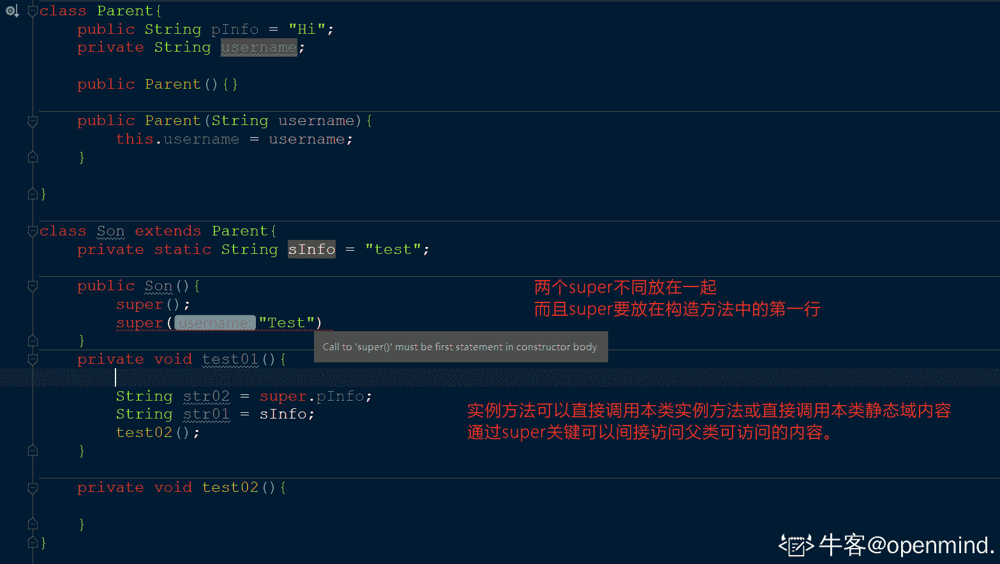
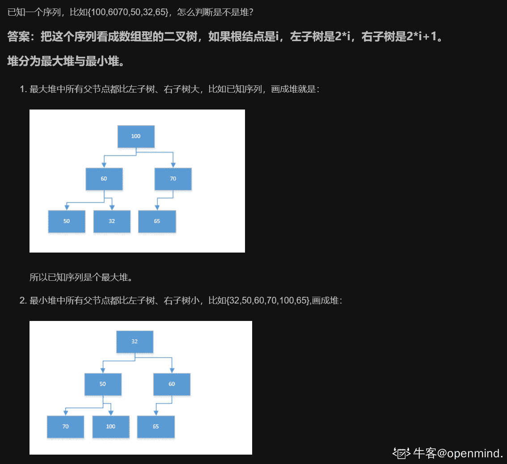

# 中国系统 2021 校园招聘-Java 笔试

## 1

输出 9*9 口诀。

本题知识点

Java 工程师 中国系统 2021

讨论

[一面试就自信的小昏昏](https://www.nowcoder.com/profile/369482639)

```cpp
public class Main{
    public static void main(String[] args){
        for(int i = 1; i < 10; i++){
            for(int j = 1; j <= i; j++){
                int v = i*j;
                if(v < 10){
                    System.out.print(j+"*"+i+"="+i*j+"     ");
                }else{
                    System.out.print(j+"*"+i+"="+i*j+"    ");
                }
            }
            System.out.println();
        }
    }
}
```

难度倒是没啥难度，倒是这空格给我恶心坏了

发表于 2021-08-17 15:36:18

* * *

[零葬](https://www.nowcoder.com/profile/75718849)

这是一个考察洞察力的题目，洞察打印几个空格

```cpp
public class Main{
    public static void main(String[] args){
        for(int i = 1; i < 10; i++){
            for(int j = 1; j <= i; j++){
                if(i * j < 10)
                    System.out.print(j + "*" + i + "=" + i * j + "     ");
                else
                    System.out.print(j + "*" + i + "=" + i * j + "    ");
            }
            System.out.println();
        }
    }
}
```

编辑于 2021-09-27 13:01:30

* * *

[CJCWB](https://www.nowcoder.com/profile/585530108)

注意格式

```cpp
public class Main{
    public static void main(String[] args){
        for(int i = 1;i<=9;i++){
            for(int j = 1;j<=i;j++){
                System.out.printf("%d*%d=%-6d",j,i,i*j);
            }
            System.out.println();
        }
    }
}
```

发表于 2022-01-29 22:46:40

* * *

## 2

```cpp
将一个数组逆序输出,输入-1 表示结束。

```

本题知识点

Java 工程师 中国系统 2021

讨论

[零葬](https://www.nowcoder.com/profile/75718849)

中国系统的两个编程题考得都不是编程，而是 debug 空格

```cpp
import java.util.Stack;
import java.util.Scanner;

public class Main {
    public static void main(String[] args) {
        Scanner sc = new Scanner(System.in);
        int num;
        Stack<Integer> stack = new Stack<>();
        while((num = sc.nextInt()) != -1)
            stack.push(num);
        while(!stack.isEmpty())
            System.out.print(stack.pop() + "   ");
    }
}
```

发表于 2021-09-27 10:47:01

* * *

[一面试就自信的小昏昏](https://www.nowcoder.com/profile/369482639)

```cpp
import java.util.*;
public class Main{
    public static void main(String[] args){
        Scanner scan = new Scanner(System.in);
        Stack<Integer> stack = new Stack<>();
        while(scan.hasNextLine()){
            int num = scan.nextInt();
            if(num == -1) break;
            stack.push(num);
        }
        while(!stack.isEmpty()){
            System.out.print(stack.pop()+"   ");
        }
    }
}

```

建议直接复制题目给的空格

发表于 2021-08-17 15:53:47

* * *

[lh-jiezhou](https://www.nowcoder.com/profile/3848158)

    public  static  void  main(String[] args) {        Scanner sc = newScanner(System.in);        Stack<Integer>  stack = new  Stack<>();        while(true){            int  num = sc.nextInt();            if(num == -1) {                break;            }            stack.push(num);        }        while(!stack.isEmpty()){            System.out.print(stack.pop() + "   ");        }    }

编辑于 2021-08-04 16:20:55

* * *

## 3

下列代码输出结果是()int index = 100;while ( index > 0 ){  index++;  if ( index = =100 ){   break;  }}

正确答案: D   你的答案: 空 (错误)

```cpp
一次循环都不会执行
```

```cpp
循环执行 100 次
```

```cpp
循环执行一次
```

```cpp
死循环
```

本题知识点

Java 工程师 中国系统 2021

讨论

[牛客 711882110 号](https://www.nowcoder.com/profile/711882110)

index++之后 index=101，之后 index 不断自增，始终无法进入 if，陷入死循环。

发表于 2021-10-17 17:21:46

* * *

[Swan996](https://www.nowcoder.com/profile/364820010)

Break 只是跳出本次循环，并不会终止整个循环

发表于 2021-10-17 16:56:08

* * *

## 4

x 为 float 类型，y 为 double 类型，a 为 int 类型，b 为 long 类型，c 为 char 类型，问 x+y*a/x+b/a+c 的值是什么类型

正确答案: A   你的答案: 空 (错误)

```cpp
double
```

```cpp
long
```

```cpp
int
```

```cpp
char
```

本题知识点

Java 工程师 中国系统 2021

讨论

[桐风 Java 开发工程师](https://www.nowcoder.com/profile/844124752)

小类型与大类型计算，结果会默认为大类型的。 就像儿子与父亲，小儿子当家作主，还是父亲当家作主？当然是大类型了《父亲》。

发表于 2021-10-20 15:37:51

* * *

## 5

下列哪种说法是正确的   

正确答案: D   你的答案: 空 (错误)

```cpp
实例方法可直接调用超类的实例方法
```

```cpp
实例方法可直接调用超类的类方法
```

```cpp
实例方法可直接调用其他类的实例方法
```

```cpp
实例方法可直接调用本类的类方法
```

本题知识点

Java 工程师 中国系统 2021

讨论

[openmind.](https://www.nowcoder.com/profile/539390139)

**static 关键字可以修饰 变量、方法、代码块以及静态内部类；****static 修饰的内容在类加载时期进行一次初始化并赋予初始值；****static 修饰的内容是类级别，属于该类的各个对象共享，不依赖于某一个具体的对象；****static 修饰的内容是编译器静态绑定，对象的创建时运行器动态绑定；****所以有静态域(static 修饰)的内容只能访问静态域的内容；****非静态域的内容既可以访问非静态的内容也可以访问静态域的内容；****在父类中 static 关键字无法被子类重写；****在本类中 static 关键字与 this、super 不能用在一起；**本题题解： **实例方法可以直接调用本类中其他实例方法和本类的中静态方法。**也可以通过 super 关键字访问父类方法其中构造器中 super()放在首位。

编辑于 2021-09-04 04:24:56

* * *

[灵魂出窍 Imperio](https://www.nowcoder.com/profile/894727200)

实例方法可以调用超类的类方法，但是不能直接调用。

发表于 2021-08-27 12:39:00

* * *

## 6

mysql 表 user 已有索引：`idx_name_age` (`name`,`age`)。查询语句 select * from user where name='jack'是否经过此索引

正确答案: A   你的答案: 空 (错误)

```cpp
是
```

```cpp
否
```

```cpp
视具体情况而定
```

本题知识点

Java 工程师 中国系统 2021

讨论

[lh-jiezhou](https://www.nowcoder.com/profile/3848158)

最左前缀匹配

发表于 2021-08-04 16:19:38

* * *

## 7

mysql 表 user 已有索引：`idx_name_age` (`name`,`age`)。查询语句 select * from user where name='jack' or age = 18 是否经过此索引

正确答案: B   你的答案: 空 (错误)

```cpp
是
```

```cpp
否
```

```cpp
视具体情况而定
```

本题知识点

Java 工程师 中国系统 2021

讨论

[汪汪汪王](https://www.nowcoder.com/profile/53217090)

联合索引（a,b,c）,只有查询 a, ab,abc 时索引才会生效，查 b 或者 c 失效，最左匹配原则

发表于 2021-08-16 15:09:33

* * *

[南橙橙北](https://www.nowcoder.com/profile/286668607)

具体可以查以下 mysql 的 sql 语句优化，这里简单理解为是 or 的问题就可以

发表于 2021-07-23 17:46:56

* * *

[openmind.](https://www.nowcoder.com/profile/539390139)

索引失效的情况： 

1\. 复合索引不要跨列或无序使用（最佳左前缀原则）；

2\. 复合索引不能使用 不等于(!= <>)、IS NUL(IS NOT NULL) 或 大于号(>) 否则会造成自身以及右侧索引全部失效；

3\. 不要在索引上进行任何操作（函数、计算以及类型转换），否则索引失效；

4\. LIKE 尽可能以"常量"开头，不要以匹配符号(eg: %、_)开头，否则索引失效；

5\. 尽量不要使用 or，否则索引左侧失效；

发表于 2021-09-04 04:29:27

* * *

## 8

private static volatile Long num; 变量 num 在内存中是否线程安全

正确答案: B   你的答案: 空 (错误)

```cpp
是
```

```cpp
否
```

```cpp
视具体情况而定
```

本题知识点

Java 工程师 中国系统 2021

讨论

[va 转行](https://www.nowcoder.com/profile/362513317)

如果没有方法对它执行修改，那么这是线程安全的

发表于 2021-07-18 14:57:07

* * *

[敌敌佳](https://www.nowcoder.com/profile/117565362)

volatile 不保证原子性线程不安全

发表于 2021-07-02 18:59:05

* * *

[篮球是圆的](https://www.nowcoder.com/profile/242960739)

volatile 关键字可以保证可见性，有序性；但是无法保证线程安全，因为 java 中的变量操作并非原子操作，原子操作，即一个操作或者多个操作，要么全部执行并且执行过程不被任何因素打断，要么就不执行；比如

```cpp
int a = b+1;    
处理器在处理时需要三个操作：
1.从内存中读取 b
2.进行 a=b+1 运算
3.将 a 写回内存
处理器不会连续执行，有可能执行了第一个操作后，处理器就去执行别的操作了。
reference：
https://blog.csdn.net/weixin_39575758/article/details/111845542?utm_medium=distribute.pc_relevant.none-task-blog-2~default~baidujs_baidulandingword~default-0.no_search_link&spm=1001.2101.3001.4242.1
```

发表于 2021-11-26 23:03:11

* * *

## 9

下面有关 jdbc statement 的说法错误的是？

正确答案: D   你的答案: 空 (错误)

```cpp
JDBC 提供了 Statement、PreparedStatement 和 CallableStatement 三种方式来执行查询语句，其中 Statement 用于通用查询， PreparedStatement 用于执行参数化查询，而 CallableStatement 则是用于存储过程
```

```cpp
PreparedStatement 可以阻止常见的 SQL 注入式攻击
```

```cpp
PreparedStatement 中，“?” 叫做占位符，有多少个占位符就需要有多少个对应的值
```

```cpp
在执行速度上，Statement 对象快于 PreparedStatement 对象
```

本题知识点

Java 工程师 中国系统 2021

## 10

下面有关 java object 默认的基本方法，说法错误的是？

正确答案: A   你的答案: 空 (错误)

```cpp
copy() 创建并返回此对象的一个副本
```

```cpp
wait() 导致当前的线程等待，直到其他线程调用此对象的 notify() 方法或 notifyAll() 方法
```

```cpp
toString() 返回该对象的字符串表示
```

```cpp
equals(Object obj) 指示某个其他对象是否与此对象“相等”
```

本题知识点

Java 工程师 中国系统 2021

讨论

[]☆~放弃爱❤](https://www.nowcoder.com/profile/6957431)

java object 默认的基本方法中没有 copy()方法，但是有 clone()

发表于 2021-07-05 16:55:36

* * *

[牛客 471783880 号](https://www.nowcoder.com/profile/471783880)

这个 b 对吗？我感觉不是“此对象掉的吧？”

发表于 2021-11-08 21:38:01

* * *

[牛客 776599576 号](https://www.nowcoder.com/profile/776599576)

感觉 A 没有错吧

发表于 2022-02-22 14:36:35

* * *

## 11

下列关键字序列为堆的是 ______。

正确答案: C   你的答案: 空 (错误)

```cpp
60，70，65，50，32，100
```

```cpp
65，100，70，32，50，60
```

```cpp
100，60，70，50，32，65
```

```cpp
32，50，100，70，65，60
```

本题知识点

Java 工程师 中国系统 2021

讨论

[openmind.](https://www.nowcoder.com/profile/539390139)

参考： [`blog.csdn.net/u011240877/article/details/47706923`](https://blog.csdn.net/u011240877/article/details/47706923)

发表于 2021-09-04 04:36:34

* * *

[牛客 185690121 号](https://www.nowcoder.com/profile/185690121)

堆有最大堆和最小堆 把序列化为二叉树 判断根结点和左右子树的大小即可

发表于 2021-07-15 10:54:06

* * *

## 12

二分查找树里查询一个关键字的最坏时间复杂度是 ______

正确答案: B   你的答案: 空 (错误)

```cpp
O(n log n)
```

```cpp
O(n)
```

```cpp
O(n³)
```

```cpp
O(logn)
```

本题知识点

Java 工程师 中国系统 2021

讨论

[lh-jiezhou](https://www.nowcoder.com/profile/3848158)

区分二叉平衡查找树

发表于 2021-08-04 16:18:47

* * *

[仿生佛能度电子鬼吗](https://www.nowcoder.com/profile/430087014)

不平衡的极端情况是二叉查找树退化为单链表

发表于 2021-09-01 22:13:23

* * *

## 13

下列哪些属于引用数据类型

正确答案: B C D   你的答案: 空 (错误)

```cpp
float
```

```cpp
String
```

```cpp
用户自定义的 User 类
```

```cpp
Float
```

本题知识点

Java 工程师 中国系统 2021

讨论

[汪汪汪王](https://www.nowcoder.com/profile/53217090)

1.class：Object, String,Date,  Integer  Long  Boolean  Byte  Character  Double  Float   Short2.接口 3.数组

发表于 2021-08-16 15:14:04

* * *

## 14

在 Java 接口中，下面哪些方法是有效的方法声明

正确答案: C D   你的答案: 空 (错误)

```cpp
protected void function1()
```

```cpp
private void function1()
```

```cpp
void function1()
```

```cpp
public void function1()
```

本题知识点

Java 工程师 中国系统 2021

讨论

[lh-jiezhou](https://www.nowcoder.com/profile/3848158)

接口中的方法前的访问权限控制符默认为 public,并且只能是 public **C 选项 无修饰符 此处默认应该为 public**

发表于 2021-08-04 16:18:02

* * *

## 15

List 有哪些实现类

正确答案: A B C   你的答案: 空 (错误)

```cpp
ArrayList
```

```cpp
LinkedList
```

```cpp
Vector
```

```cpp
Arrays
```

本题知识点

Java 工程师 中国系统 2021

讨论

[灵魂出窍 Imperio](https://www.nowcoder.com/profile/894727200)

```cpp
public class Vector<E>  extends AbstractList<E>  implements List<E>, RandomAccess, Cloneable, java.io.Serializable
```

发表于 2021-08-27 12:48:27

* * *

## 16

Java 中哪些集合是 Collection 派生出来的？

正确答案: A B C   你的答案: 空 (错误)

```cpp
List
```

```cpp
Queue
```

```cpp
Set
```

```cpp
Map
```

本题知识点

Java 工程师 中国系统 2021

讨论

[小健灬](https://www.nowcoder.com/profile/602798961)

abcd

发表于 2021-09-18 13:32:47

* * *

## 17

下列代码输出结果为 1 的是

正确答案: B C   你的答案: 空 (错误)

```cpp
  int cestcCount=0;         new Thread(         ()->{          cestcCount++;         }        ).start(); 
```

```cpp
  Integer cestcCount=0;              new Thread(              ()->{               System.out.println(cestcCount+1);              }             ).start(); 
```

```cpp
  AtomicInteger cestcCount=new AtomicInteger();         new Thread(         ()->{          System.out.println(cestcCount.addAndGet(1));         }        ).start(); 
```

本题知识点

Java 工程师 中国系统 2021

讨论

[牛客 318200376 号](https://www.nowcoder.com/profile/318200376)

没搞明白啊，三个选项，一个选项不输出啥东西，还是多选，送分？

发表于 2021-08-28 18:12:05

* * *