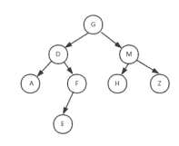

# 中国系统 2021 校园招聘-前端笔试

## 1

关于 CSS 选择器，以下说法正确的是：

正确答案: A C   你的答案: 空 (错误)

```cpp
每个选择器最多只能出现一个伪元素
```

```cpp
每格选择器最多只能出现一个伪类
```

```cpp
:nth-child(an+b) 中 n 的取值从 0 开始
```

```cpp
A+B 匹配 A 之后所有符合 B 规则的元素
```

本题知识点

运维工程师 360 公司 系统工程师 2019 CSS 前端工程师 中国系统 2021

讨论

[jacky-Liz](https://www.nowcoder.com/profile/399864817)

:nth-child(n),n 从 1 开始计数:nth-child(odd)和:nth-child(even),从 1 开始计数:nth-child(an+b),n 从 0 开始计数

发表于 2020-01-08 16:46:21

* * *

[qsleep](https://www.nowcoder.com/profile/974474817)

指路：
伪类和伪元素的区别, 总结的很好, 直接看结论. - 唐安 - 博客园
[`www.cnblogs.com/andy-lehhaxm/p/9561776.html`](https://www.cnblogs.com/andy-lehhaxm/p/9561776.html)

发表于 2020-02-25 20:54:44

* * *

[浪险](https://www.nowcoder.com/profile/683173318)

**C.:nth-child(an+b)在下标计算表达式 an+b 中：**
a,b 是系数可以是任意整数；
n 就是个字面量“n”，表示是递增变量，并且取值是从 0 开始的整数。这里不知为何而错**D.****匹配任意元素，满足条件：**B 是 A 的下一个兄弟节点（AB 有相同的父结点，并且 B 紧跟在 A 的后面）

编辑于 2019-08-16 10:53:08

* * *

## 2

 ["0x1", "0x2", "0x3"].map(parseInt) 的结果是

正确答案: B   你的答案: 空 (错误)

```cpp
全不是
```

```cpp
[1, NaN, 0]
```

```cpp
[1,NaN,NaN]
```

```cpp
[1,2,3]
```

本题知识点

前端工程师 中国系统 2021

讨论

[丶 Heart](https://www.nowcoder.com/profile/622043064)

Array#map 会给 callback 传入三个参数：(item, index, callerArray)。parseInt 接收两个参数：(str, radix)。str 为需要转换的字符串，radix 为进制转换的基数。这道题主要是考察 Array#map、 parseInt 以及传递函数引用时的参数分配规则，Array#map 相对来说比较简单，主要是 parseInt 的转换规则，可参考 MDN 的解释：[`developer.mozilla.org/zh-CN/docs/Web/JavaScript/Reference/Global_Objects/parseInt`](https://developer.mozilla.org/zh-CN/docs/Web/JavaScript/Reference/Global_Objects/parseInt)。将题目 ["0x1", "0x2", "0x3"].map(parseInt) 分解一下，即为：[parseInt("0x1", 0), parseInt("0x2", 1), parseInt("0x3", 2)]，这里用到的点是：

*   如果 radix = 0/undefined，或者 radix 未指定，则 parseInt 根据字符串前缀来判断转换进制
*   如果 radix < 2 且 radix != 0，或者 radix > 36，则 parseInt 返回 NaN

发表于 2021-07-03 07:43:58

* * *

[牛客 360871401 号](https://www.nowcoder.com/profile/360871401)

parse(021,8)   ===>15

发表于 2021-07-07 14:37:41

* * *

## 3

下面关于 sass/scss 和 less 的说法正确的是

正确答案: A B   你的答案: 空 (错误)

```cpp
Less 与 sass 都是 CSS 预编译器. 对 CSS 赋予了动态语言的特性
```

```cpp
Sass 的安装需要 Ruby 环境，是在服务端处理的，而 Less 是需要引入 less.js 来处理 Less 代码输出 css 到浏览器
```

```cpp
less 和 sass 的变量符都是$
```

```cpp
less 和 sass 都支持条件语句，可以使用 if{}else{},for{}循环等等
```

本题知识点

前端工程师 中国系统 2021

讨论

[山城郴王](https://www.nowcoder.com/profile/462634888)

一、了解它们的区别前，首先了解下什么是 sass,什么是 less
sass 与 less 都是一种动态样式语言，对 css 赋予了一些动态语言特性，例如变量、继承、运算、函数等
二、它们的区别大致有以下几种：
1.编译环境不一样：
sass 的安装需要 Ruby 环境的，是在服务端上处理的，而 Less 是需要引入 less.js 来处理 Less 代码输出 css 到浏览器，也可以在开发环节使用 Less，然后编译成 css 文件，直接放到项目中。
2.变量符不一样：
Less 是@，而 Scss 是$
3.输出设置
Sass 提供 4 中输出选项：nested, compact, compressed 和 expanded.
4.Sass 支持条件语句，可以使用 if{}else{},for{}循环等等。而 Less 不支持。
5\. 引用外部 CSS 文件
scss 引用的外部文件命名必须以*开头, 文件名如果以下划线*开头的话，Sass 会认为该文件是一个引用文件，不会将其编译为 css 文件.
6.Sass 和 Less 的工具库不同
Sass 有工具库 Compass
Less 有 UI 组件库 Bootstrap

作者：演员眼缘
链接：[`www.jianshu.com/p/d4f1f549c385`](https://www.jianshu.com/p/d4f1f549c385)
来源：简书
著作权归作者所有。商业转载请联系作者获得授权，非商业转载请注明出处。

发表于 2021-08-17 13:56:36

* * *

[swallowblank](https://www.nowcoder.com/profile/8147847)

使用 less 不一定非要引入 less.js 啊，`npm i -g less` 也可以使用 less。

使用 sass 也不一定要装 ruby，安装`node-sass`和`webpack`也可以直接用啊

发表于 2021-07-05 21:49:13

* * *

## 4

给定一个没有重复数字的序列，返回其所有可能的全排列。

本题知识点

前端工程师 中国系统 2021

讨论

[牛客 424242392 号](https://www.nowcoder.com/profile/424242392)

function permute( nums ) {
    let data = []
      if(nums && nums.length == 1) return [nums]
      for(let i = 0; i < nums.length;i++) {
        let arr = JSON.parse(JSON.stringify(nums))
        arr.splice(i,1)
        let info = this.permute(arr)
        info && info.length > 0 && info.forEach(item => {
            data.push([nums[i],...item])
        })
      }
      return data
}

发表于 2021-07-12 18:12:20

* * *

[想好好学习的小周](https://www.nowcoder.com/profile/918751874)

function permute( nums ) {
    const res=[], path=[];
    const used = new Array(nums.length).fill(false);

    const dfs = () => {
        if(path.length == nums.length) {
            res.push(path.slice())
            return;
        }

        for(let i = 0; i < nums.length; i++){
            if(used[i]) continue;
            path.push(nums[i]);
            used[i] = true;
            dfs();
            path.pop();
            used[i] = false;
        } 
    }

    dfs();
    return res;
}
module.exports = {
    permute : permute
};

编辑于 2021-09-01 17:18:20

* * *

[UUlover](https://www.nowcoder.com/profile/5707014)

```cpp
/**
 * 代码中的类名、方法名、参数名已经指定，请勿修改，直接返回方法规定的值即可
 *
 * 
 * @param nums int 整型一维数组 
 * @return int 整型二维数组
 */
function permute( nums ) {
    // write code here
    var res=[];
    var used=[];
    var arr=[];
    dfs();
    return res;

    function dfs(){
        if(arr.length===nums.length){
            res.push([...arr]);
            return;
        }
        for(let i=0;i<nums.length;i++){
            if(used[i])continue;
            arr.push(nums[i]);
            used[i]=true;
            dfs();
            arr.pop();
            used[i]=false;
        }
    }
}
module.exports = {
    permute : permute
};
```

发表于 2021-10-04 22:23:40

* * *

## 5

给定一个先序遍历与中序遍历的二叉树，要求求出该二叉树的后序遍历表示形式。对于如下二叉树：

 

其先序遍历为：GDAFEMHZ

其中序遍历为：ADEFGHMZ

当给定先序遍历与中序遍历时，该二叉树就被唯一的确定下来，这时即可求出二叉树的后序表示为：AEFDHZMG。

给定输入中，二叉树中的字符有且仅有一个，且二叉树中的所有节点互不相同

输入：

两行，第一行为二叉树的先序遍历表示，第二行为二叉树的中序遍历表示

输出：

一行，二叉树的后续遍历表示

本题知识点

前端工程师 中国系统 2021

讨论

[Hg20181211172926](https://www.nowcoder.com/profile/579479265)

```cpp
/**
 * 代码中的类名、方法名、参数名已经指定，请勿修改，直接返回方法规定的值即可
 *
 * 
 * @param preStr string 字符串 
 * @param midStr string 字符串 
 * @return string 字符串
 */
function binaryTree( preStr ,  midStr ) {
    // write code here
    if(preStr.length==0)return '';
    let rootStr = preStr[0];
    let rootIndex = midStr.indexOf(rootStr);
    let leftMidStr = midStr.slice(0,rootIndex);
    let rightMidStr = midStr.slice(rootIndex+1);
    let leftPreStr = preStr.slice(1,leftMidStr.length+1);
    let rightPreStr = preStr.slice(leftMidStr.length+1);
    return binaryTree(leftPreStr,leftMidStr)+binaryTree(rightPreStr,rightMidStr)+rootStr
}
module.exports = {
    binaryTree : binaryTree
};
```

发表于 2021-12-08 20:16:29

* * *

[小小小小🍊](https://www.nowcoder.com/profile/145962509)

```cpp
import java.util.*;

public class Solution {
    /**
     * 代码中的类名、方法名、参数名已经指定，请勿修改，直接返回方法规定的值即可
     *
     * 
     * @param preStr string 字符串 
     * @param midStr string 字符串 
     * @return string 字符串
     */
    StringBuilder str = new StringBuilder();
    public String binaryTree (String preStr, String midStr) {
        char[] pre = preStr.toCharArray();
        char[] mid = midStr.toCharArray();
        postTree(pre,mid);
        return str.toString();
    }
    public void postTree(char[] preStr , char[] midStr){
        if(preStr.length == 1) {
            str.append(preStr[0]);
            return;
        }
        int n = findNode(preStr[0],midStr);
        if(n!=1){
            char[] preleft = Arrays.copyOfRange(preStr,1,n);
            char[] midleft = Arrays.copyOfRange(midStr,0,n-1);
            postTree(preleft,midleft);
        }
        if(n != preStr.length){
            char[] preright = Arrays.copyOfRange(preStr,n,preStr.length);
            char[] midright = Arrays.copyOfRange(midStr,n,midStr.length);
            postTree(preright,midright);
        }
        str.append(preStr[0]);

    }

    public int findNode(char ch,char[] midStr){
        int n = 0;
        for(int i = 0 ; i<midStr.length ; ++i){
            if(midStr[i] == ch){
                n = i;
            }
        }
        return n+1;
    }
}
```

 发表于 2021-08-17 15:33:10

* * *

## 6

在 css 选择器当中，优先级排序正确的是

正确答案: A   你的答案: 空 (错误)

```cpp
id 选择器>类选择器>标签选择器
```

```cpp
id 选择器>标签选择器>类选择器
```

```cpp
标签选择器>类选择器>id 选择器
```

```cpp
类选择器>标签选择器>id 选择器
```

本题知识点

前端工程师 中国系统 2021

讨论

[牛客 302174831 号](https://www.nowcoder.com/profile/302174831)

!Important>行内样式>ID 选择器>类选择器>元素>通配符>继承>浏览器默认属性

发表于 2021-09-30 22:40:27

* * *

## 7

关于浮动元素，下面说法错误的是

正确答案: B   你的答案: 空 (错误)

```cpp
如果有非浮动元素和浮动元素同时存在，并且非浮动元素在前，则浮动元素不会高于非浮动元素
```

```cpp
行内元素与浮动元素发生重叠，其边框，背景和内容都会显示在浮动元素之下
```

```cpp
浮动元素会尽可能地向顶端对齐、向左或向右对齐
```

```cpp
如果有多个浮动元素，浮动元素会按顺序排下来而不会发生重叠的现象
```

本题知识点

前端工程师 中国系统 2021

讨论

[应先森 o](https://www.nowcoder.com/profile/697121429)

b.行内元素和浮动元素发生重叠，边框、背景会显示在浮动元素之下，内容会显示在浮动元素之上

发表于 2021-07-14 18:25:06

* * *

## 8

把鼠标移到按钮并点击时，会产生一串什么样的事件？

正确答案: D   你的答案: 空 (错误)

```cpp
active hover focus
```

```cpp
foucs hover active
```

```cpp
hover active foucus
```

```cpp
hover focus active
```

本题知识点

HTML 前端工程师 中国系统 2021

讨论

[Amour1018](https://www.nowcoder.com/profile/306342)

hover -> focus -> active 悬停 -> 聚焦 -> 响应

发表于 2015-08-26 16:31:30

* * *

[逗比拉格朗日](https://www.nowcoder.com/profile/4827010)

触发顺序为 link-->visited--->hover--->active 即记为 love and hate 然后单独记住 focus 在 hover 和 active 之间即可

发表于 2018-02-02 20:37:03

* * *

[字节校招内推](https://www.nowcoder.com/profile/847857)

CSS 伪类用于向某些选择器添加特殊的效果。

:active 向被激活的元素添加样式。
:focus 向拥有键盘输入焦点的元素添加样式。
:hover 当鼠标悬浮在元素上方时，向元素添加样式。
:link 向未被访问的链接添加样式。
:visited 向已被访问的链接添加样式。

发表于 2016-04-14 20:06:08

* * *

## 9

 http 状态码描述正确的是

正确答案: A   你的答案: 空 (错误)

```cpp
301  永久性重定向
```

```cpp
302  浏览器端缓存的资源依然有效
```

```cpp
304  暂时性重定向
```

```cpp
400  浏览器端缓存的资源依然有效
```

本题知识点

前端工程师 中国系统 2021

讨论

[拽娃儿](https://www.nowcoder.com/profile/545087276)

1

发表于 2021-10-23 17:41:12

* * *

[陌小成 _highmore](https://www.nowcoder.com/profile/757663662)

302 Found（已找到）临时重定向 304 Not Modified（未修改）客户的缓存资源是最新的， 要客户端使用缓存 400 Bad Request（坏请求）

发表于 2021-07-29 16:12:45

* * *

## 10

对于 Content-Security-Policy: default-src 'self'; img-src *; media-src media1.com media2.com; script-src userscripts.example.com 描述错误的是

正确答案: D   你的答案: 空 (错误)

```cpp
允许网页应用的用户在他们自己的内容中包含来自任何源的图片
```

```cpp
限制音频或视频需从信任的资源提供者 media1.com media2.com (获得)
```

```cpp
可运行脚本仅允许来自于 userscripts.example.com
```

```cpp
资源只能来自于当前域名
```

本题知识点

前端工程师 中国系统 2021

讨论

[cccchen 果粒](https://www.nowcoder.com/profile/576667301)

搬运一下~网页安全政策"（Content Security Policy，缩写 CSP) CSP 的实质就是白名单制度，开发者明确告诉客户端，哪些外部资源可以加载和执行，等同于提供白名单。它的实现和执行全部由浏览器完成，开发者只需提供配置。两种方法可以启用 CSP。一种是通过 HTTP 头信息的 Content-Security-Policy 的字段。另一种是通过网页的<meta>标签。题目涉及到的：**default-src ‘self '** :表示限制所有的外部资源，都只能从当前域名加载。**script-src :**外部脚本**media-src**：媒体文件（音频和视频）**img-src:**图像如果同时设置某个单项限制（比如 font-src）和 default-src，**前者会覆盖后者**，即字体文件会采用 font-src 的值，其他资源依然采用 default-src 的值。参考地址：[`www.ruanyifeng.com/blog/2016/09/csp.html`](http://www.ruanyifeng.com/blog/2016/09/csp.html) 

发表于 2022-03-22 10:39:02

* * *

[山城郴王](https://www.nowcoder.com/profile/462634888)

跨域脚本攻击 [XSS](http://baike.baidu.com/view/2161269.htm) 是最常见、危害最大的网页安全漏洞。为了防止它们，浏览器自动禁止外部注入恶意脚本.

**CSP 的实质就是白名单制度**，开发者明确告诉客户端，**哪些外部资源可以加载和执行，**等同于提供白名单。它的实现和执行全部由浏览器完成，开发者只需提供配置。

  我是没学过，搬运工几句话。。。

发表于 2021-08-17 14:35:08

* * *

[苏里苏里](https://www.nowcoder.com/profile/7163773)

 default-src 'self'不就是限制所有的外部资源，都只能从当前域名加载吗，D 为啥错

发表于 2021-08-19 19:53:47

* * *

## 11

下题的结果正确的是？var one   = 0.1 var two   = 0.2var six   = 0.6var eight = 0.8[two - one == one, eight - six == two] 

正确答案: C   你的答案: 空 (错误)

```cpp
[true, true]
```

```cpp
[false, false]
```

```cpp
[true, false]
```

```cpp
other
```

本题知识点

前端工程师 中国系统 2021

讨论

[牛客 203067773 号](https://www.nowcoder.com/profile/203067773)

0.2-0.1=0.1 的原因是 0.2 是 0.1 的 2 倍，二进制乘 2 或者除 2，左移或又移一位就行，所以 0.2-0.1=0.1，但是 0.8 不是 0.6 的倍数，所以 0.8-0.6！=0.2。转自[(4 条消息) 8.JS 小数精度问题 _ 萌神 7 号的博客-CSDN 博客](https://blog.csdn.net/weixin_43465339/article/details/108182482) ，侵删

发表于 2021-07-02 14:21:20

* * *

[PayneCen](https://www.nowcoder.com/profile/40519276)

JS 不能很精确地表示小数。当两个浮点数相加或者相减，将有可能会导致精度丢失问题。

JS 中的小数采用的是双精度(64 位)表示的，由三部分组成：符 + 阶码 + 尾数，在十进制中的 1/10，在十进制中可以简单写为 0.1 ，但在二进制中，他得写成：0.0001100110011001100110011001100110011001100110011001……（后面全是 1001 循环）。因为浮点数只有 52 位有效数字，从第 53 位开始，就舍入了。这样就造成了“浮点数精度损失”问题。

通过上面分析，我们知道 JS 利用二进制存储的，所有的小数都可以用 a0*(1/2)+a1*(1/4)+a2*(1/8)+…表示，这里（a0,a1,a2…只能取值 0 或者 1），根据这个表达式我们发现 0.1,0.2,0.6 和 0.8 都是无限循环小数，但是 0.2-0.1=0.1 的原因是 0.2 是 0.1 的 2 倍，二进制乘 2 或者除 2，左移或又移一位就行，所以 0.2-0.1=0.1，但是 0.8 不是 0.6 的倍数，所以 0.8-0.6！=0.2。
原文链接：[`blog.csdn.net/weixin_43465339/article/details/108182482`](https://blog.csdn.net/weixin_43465339/article/details/108182482)

发表于 2021-09-15 21:42:23

* * *

[夜寻极光。](https://www.nowcoder.com/profile/868966489)

补充：要想后者为 true  (0.8-0.6).toFixed(1)

发表于 2021-07-31 12:45:28

* * *

## 12

下题的结果正确的是？1 + - + + + - + 1 

正确答案: B   你的答案: 空 (错误)

```cpp
1
```

```cpp
2
```

```cpp
error
```

```cpp
other
```

本题知识点

前端工程师 中国系统 2021

讨论

[牛客 685282509 号](https://www.nowcoder.com/profile/685282509)

1 +/-  ( + - + - + + ... ) 1  只要计算括号内减号的个数，奇数则负 偶数为正。

发表于 2021-07-12 11:06:03

* * *

[小买同学](https://www.nowcoder.com/profile/118880076)

以上等价于：1 + 0-0 +0 +0 + 0- 0+ 1

发表于 2021-07-03 10:06:53

* * *

[难搞啊](https://www.nowcoder.com/profile/433326923)

盲猜 看- -的个数  负负得正......

发表于 2021-10-14 16:06:16

* * *

## 13

在 JavaScript 中，有 var arr = [ ];typeof arr 的结果为：

正确答案: C   你的答案: 空 (错误)

```cpp
function
```

```cpp
array
```

```cpp
object
```

```cpp
null
```

本题知识点

前端工程师 中国系统 2021

讨论

[SSS 奥利给](https://www.nowcoder.com/profile/772162740)

typeof 可以判断的类型有值类型：string、number 等、函数类型 function、引用类型 object

发表于 2021-09-06 21:09:34

* * *

[不吃苦哪有幸福](https://www.nowcoder.com/profile/257120507)

 [],{}和 null 的 typeof 都是 object。

发表于 2021-08-12 17:07:36

* * *

## 14

以下哪些标签是块级元素？

正确答案: C D   你的答案: 空 (错误)

```cpp
span
```

```cpp
i
```

```cpp
p
```

```cpp
h3
```

本题知识点

前端工程师 中国系统 2021

讨论

[牛客 763321447 号](https://www.nowcoder.com/profile/763321447)

a

发表于 2021-10-15 21:21:51

* * *

## 15

在 vue 2.x 版本中，以下哪些是生命周期函数

正确答案: A B C   你的答案: 空 (错误)

```cpp
beforeCreate
```

```cpp
create
```

```cpp
mounted
```

```cpp
beforeRouteEnter
```

本题知识点

前端工程师 中国系统 2021

讨论

[丶 Heart](https://www.nowcoder.com/profile/622043064)

是我记错了吗？为啥我记得是 created…… 我印象中的 vue 2.x 生命周期：

```cpp
beforeCreate
created

beforeMount
mounted

beforeUpdate
updated

beforeDestroy
destroyed
```

 与 keep-alive 相关的另外两个钩子：

> activateddeactivated

编辑于 2021-07-03 07:46:52

* * *

[心悦律兮](https://www.nowcoder.com/profile/65115352)

选项该改一下啊……created 才是

发表于 2021-08-05 17:52:42

* * *

[swallowblank](https://www.nowcoder.com/profile/8147847)

我的答案 ACD，create 铁不是

发表于 2021-07-04 20:44:17

* * *

## 16

关于箭头函数，下面说法错误的有哪些？

正确答案: B C   你的答案: 空 (错误)

```cpp
箭头函数没有自己的 this，而是会继承上层作用域的 this，就像其他普通的变量一样
```

```cpp
箭头函数还可以通过 .call()、.apply()、.bind() 方法来重新绑定它的 this 值
```

```cpp
箭头函数可以像普通函数一样使用 arguments 对象
```

```cpp
过度追求箭头函数的“单行代码”写法可能会降低代码可读性
```

本题知识点

前端工程师 中国系统 2021

讨论

[夜寻极光。](https://www.nowcoder.com/profile/868966489)

箭头函数没有自己的 this，而是会继承上层作用域的 this，就像其他普通的变量一样
箭头函数不支持动态改变 this 值，所以不可以通过.call()、.apply()、.bind()方法来重新绑定它的 this 值
箭头函数没有 arguments 对象
过度追求箭头函数的“单行代码”写法可能会降低代码可读性
箭头函数虽然表面上看是匿名的，但它可以根据前面的变量名和属性名自动推断出同名的 name 属性
箭头函数不可以被 new，也不会像普通函数一样自动拥有 prototype 属性

发表于 2021-08-05 08:54:20

* * *

## 17

带有 target="_blank" 的 a 标签被认为是有安全风险的，因为点击它后打开的新标签页面可以通过 window.opener.location = 来将来源页面跳转到钓鱼页面，不过给该 a 标签增加下面哪些属性就能阻止这一行为？

正确答案: B C   你的答案: 空 (错误)

```cpp
rel="nofollow"
```

```cpp
rel="noopener"
```

```cpp
rel="noreferrer"
```

```cpp
rel="opener"
```

本题知识点

前端工程师 中国系统 2021

讨论

[牛客 396250080 号](https://www.nowcoder.com/profile/396250080)

a 标签常用 rel 属性

rel=’external’

> 此属性的意思是告诉搜索引擎，这个链接不是本站链接，其实作用相当于 target=‘_blank’。
> 为什么要这样写呢？因为有些网站因为是采用严格的 DOCTYPE 声名的，如果你在网页源码中的第一行看到：在这种情况下 target=”_blank”会失效，因此采用 rel=’external’这个参数来替代。

rel=’nofllow’

> 它是告诉搜索引擎，不要将该链接计入权重。因此多数情况下，我们可以将一些不想传递权重的链接进行 nofllow 处理；例如一些非本站的链接，不想传递权重，但是又需要加在页面中的像 统计代码、备案号链接、供用户查询的链接等等。

rel=“noopener noreferrer”

> 在新打开的页面（baidu）中可以通过 window.opener 获取到源页面的部分控制权， 即使新打开的页面是跨域的也照样可以（例如 location 就不存在跨域问题）
> 在 chrome 49+，Opera 36+，打开添加了 rel=noopener 的链接， window.opener 会为 null。在老的浏览器中，可以使用 rel=noreferrer 禁用 HTTP 头部的 Referer 属性，使用下面 JavaScript 代替 target=’_blank’ 的解决此问题

发表于 2021-08-15 16:14:41

* * *