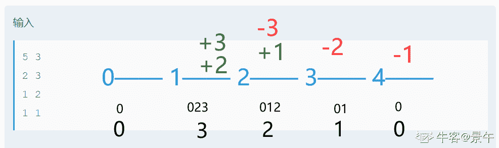
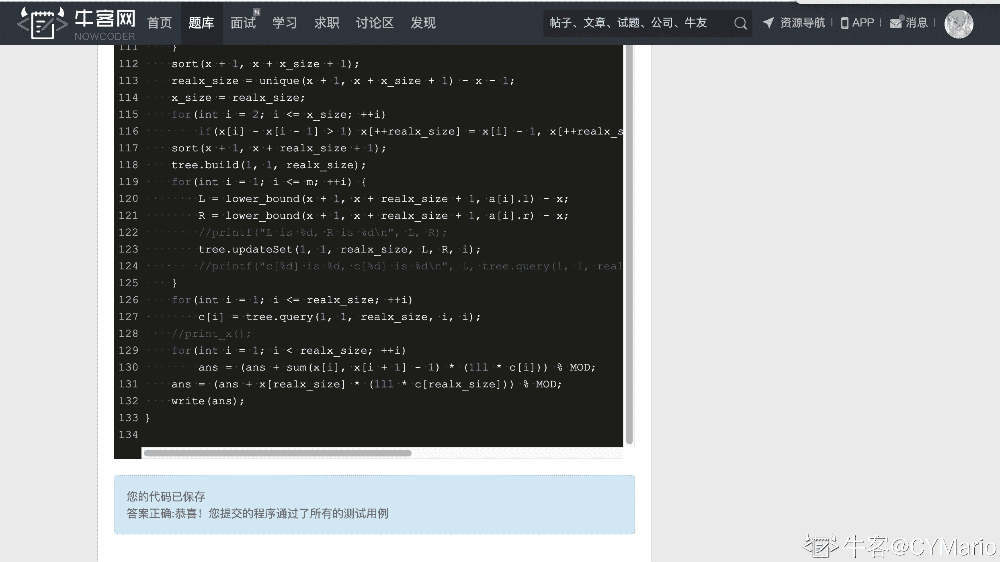

# 【2021】小米秋招软件开发方向第一场笔试

## 1

冯诺依曼结构的计算机硬件逻辑组成中，不包含以下哪个模块（）

正确答案: A   你的答案: 空 (错误)

```cpp
编译器
```

```cpp
 控制器
```

```cpp
输入设备
```

```cpp
输出设备
```

本题知识点

C++工程师 golang 工程师 PHP 工程师 Java 工程师 小米 2021

讨论

[木棉和藕夹](https://www.nowcoder.com/profile/883845275)

五个部件：输入设备 输出设备 存储器 控制器 运算器

发表于 2021-07-04 17:00:14

* * *

## 2

下述算法的时间复杂度为（）

 intfact(int n) {
       if (n <= 1) return 1; 
       return n * fact(n-1);
 }

正确答案: B   你的答案: 空 (错误)

```cpp
O(log2n)
```

```cpp
O(n)
```

```cpp
O(nlog2n)
```

```cpp
O(n²)
```

本题知识点

C++工程师 golang 工程师 PHP 工程师 Java 工程师 小米 2021

讨论

[牛客 572644938 号](https://www.nowcoder.com/profile/572644938)

这个相当于就是遍历了一遍，从 N 到 1 的值。 然后每次去乘以上次得到的值。

发表于 2021-07-18 16:53:00

* * *

[牛客 121002633 号](https://www.nowcoder.com/profile/121002633)

递归的时间复杂度就是 递归次数*每次递归操作数 或者将计算递归树的节点

发表于 2021-09-01 15:39:14

* * *

[OOky](https://www.nowcoder.com/profile/766283812)

这里的时间复杂度为线性阶,代码执行 n 次，使用 O(n)表示他的时间复杂度.

发表于 2021-12-02 10:05:56

* * *

## 3

在现代 Linux 系统和 Windows 系统中，如果希望可以在任意目录下直接通过输入文件名 运行一个程序，需要把程序所在路径添加到哪个环境变量里面？（ ）

正确答案: B   你的答案: 空 (错误)

```cpp
PWD
```

```cpp
PATH
```

```cpp
SHELL
```

```cpp
EXEC
```

本题知识点

C++工程师 golang 工程师 PHP 工程师 Java 工程师 小米 2021

讨论

[牛客 719805251 号](https://www.nowcoder.com/profile/719805251)

b

发表于 2021-08-02 16:08:53

* * *

## 4

小米有品的消费记录分别为 900，512，613，700，810，若采用选择排序算法对其进行递增排序，则第三趟排序结果为 （ ）

正确答案: C   你的答案: 空 (错误)

```cpp
900 512 613 700 810
```

```cpp
512 900 613 700 810
```

```cpp
512 613 700 900 810
```

```cpp
512 613 700 810 900
```

本题知识点

C++工程师 golang 工程师 PHP 工程师 Java 工程师 小米 2021

讨论

[牛客 465274529 号](https://www.nowcoder.com/profile/465274529)

递增选择排序：第一次从待排序的数据元素中选出最小的一个元素，存放在序列的起始位置，然后再从剩余的未排序元素中寻找到最小元素，然后放到已排序的序列的末尾，以此比较直到最后一个数第一轮： 512 900 613 700 810 第二轮： 512 613 900 700 810 第三轮： 512 613 700 900 810

发表于 2021-08-10 21:13:43

* * *

[牛客 142954669 号](https://www.nowcoder.com/profile/142954669)

选择排序第一轮将第一个数与后面的数(从第二个数开始)逐个进行比较，找出最大或最小(这里是递增，所以是找最小)的数，若小于第一个数，则将第一个数与之交换。交换完之后，第二个数与后面的数(从第三个数开始)逐个进行比较，找出最小值，若最小值小于第二个数则与之进行交换，反之，则不交换。以此类推。

发表于 2021-10-28 13:00:18

* * *

[牛客 527161027 号](https://www.nowcoder.com/profile/527161027)

感觉有点奇怪，有的选择排序往后插入，有的选择排序从前面插入，也不知道到底是哪个标准

发表于 2021-09-01 18:01:03

* * *

## 5

关于 inline 函数的使用，以下哪些选项的描述是正确的（）

正确答案: B C D   你的答案: 空 (错误)

```cpp
在一个.c 文件中定义的 inline 函数可以在另一个.c 文件中使用，且如果小于 10 行，编译器会把 inline 函数展开，发挥其性能优势。
```

```cpp
 inline 函数应该简洁，如果语句较多，不适合定义为内联函数
```

```cpp
 inline 函数中，一般不建议有循环、if 或 switch 语句，否则，函数定义时即使有 inline 关键字，编译器也可能会把该函数作为非内联函数处理。
```

```cpp
  inline 函数要在函数被调用之前声明。
```

本题知识点

C++工程师 golang 工程师 PHP 工程师 Java 工程师 小米 2021

讨论

[冲冲冲 965](https://www.nowcoder.com/profile/866842057)

Java 方向属实不知道这个

发表于 2021-07-23 18:45:56

* * *

[张达麟](https://www.nowcoder.com/profile/952512414)

这玩意是哪个科目

发表于 2021-09-24 20:42:23

* * *

[牛客 642784099 号](https://www.nowcoder.com/profile/642784099)

inline 标识只是一个建议，编译器可以不展开

发表于 2021-09-24 11:02:04

* * *

## 6

关于以下说法中，错误的有：（）

正确答案: A B C D   你的答案: 空 (错误)

```cpp
某软件有学生优惠，我借用师弟师妹的学生证购买，可以获得正版授权
```

```cpp
个人版的某软件可以免费获得授权，我可以把它拷到公司使用
```

```cpp
发现跳过某软件激活的方法，去论坛发帖，公布下教程
```

```cpp
某软件太贵了，找找开源替代方案，这样就不会侵权问题了
```

本题知识点

C++工程师 golang 工程师 PHP 工程师 Java 工程师 小米 2021

讨论

[菜狗子 haha](https://www.nowcoder.com/profile/223210403)

开源软件可以自己研究学习，不可以商业用途，会侵权

发表于 2021-08-05 19:33:39

* * *

[kiratech](https://www.nowcoder.com/profile/500540101)

这里的 D 为啥不可以？？比如 matlab 太贵了，我可以使用 octave?

发表于 2021-07-16 17:05:15

* * *

[rubbishdog](https://www.nowcoder.com/profile/943466437)

开源软件能否商用需要看其所遵循的开源协议，一般来说除了 GPL 协议的软件都可以用作商业用途。

发表于 2021-09-21 16:32:17

* * *

## 7

假设有一个栈，元素依次进栈的顺序是 A,B,C,D,E。下列不可能的出栈顺序是（ ）

正确答案: D   你的答案: 空 (错误)

```cpp
E,D,C,B,A
```

```cpp
A,B,C,D,E
```

```cpp
B,C,D,E,A
```

```cpp
 E,A,B,C,D
```

本题知识点

C++工程师 golang 工程师 PHP 工程师 Java 工程师 小米 2021

讨论

[WindTalker2019](https://www.nowcoder.com/profile/708266597)

↓代表进栈，↑代表出栈。

A 选项：A↓,B↓,C↓,D↓,E↓,E↑, D↑, C↑, B↑, A↑

B 选项：A↓, A↑,B↓, B↑,C↓, C↑,D↓, D↑,E↓, E↑

C 选项：A↓, B↓, B↑, C↓, C↑,D↓, D↑,E↓, E↑, A↑

D 选项：无法实现

发表于 2021-07-16 11:41:12

* * *

## 8

以下关于死锁，描述正确的有? （ ）

正确答案: A C   你的答案: 空 (错误)

```cpp
 有序分配锁资源可以预防死锁
```

```cpp
银行家算法是用于检测死锁的
```

```cpp
剥夺死锁进程的所有资源可以解除死锁
```

```cpp
其他描述都不对
```

本题知识点

C++工程师 golang 工程师 PHP 工程师 Java 工程师 小米 2021

讨论

[Quan_2022](https://www.nowcoder.com/profile/563750667)

银行家算法用于预防死锁

发表于 2021-07-22 01:16:17

* * *

[牛客 62805375 号](https://www.nowcoder.com/profile/62805375)

银行家算法是死锁避免的方法

发表于 2021-10-25 23:33:46

* * *

[simaduki](https://www.nowcoder.com/profile/686737054)

不应该是剥夺所有死锁进程的所有资源？

发表于 2021-09-02 09:50:20

* * *

## 9

关于主键，描述正确的是（）

正确答案: B C D   你的答案: 空 (错误)

```cpp
一个表可以有多个主键
```

```cpp
主键不可以为空
```

```cpp
 建立主键的同时也会建立一个唯一性索引
```

```cpp
主键可以包含多个属性，如联合主键
```

本题知识点

C++工程师 golang 工程师 PHP 工程师 Java 工程师 小米 2021

讨论

[双溪](https://www.nowcoder.com/profile/803764593)

一个表只能有一个主键，不能有多个主键。 主键不能为空，以确保表的数据是唯一的。 联合主键也是一个主键。

发表于 2021-08-11 15:58:21

* * *

[球给个 Offer 吧](https://www.nowcoder.com/profile/468853500)

小米这选择题好不严谨。。。

发表于 2021-09-01 11:45:51

* * *

## 10

在对信号的进样采样过程中，当采样频率至少大于（）时，才可能完整地保留原始信号中的信息。

正确答案: B   你的答案: 空 (错误)

```cpp
最高频率
```

```cpp
最高频率的 2 倍
```

```cpp
最高频率的 4 倍
```

```cpp
永远无法完整保留
```

本题知识点

C++工程师 golang 工程师 PHP 工程师 Java 工程师 小米 2021

讨论

[闪电利剑](https://www.nowcoder.com/profile/5545047)

单选题你标个多选干啥

发表于 2022-01-16 13:59:12

* * *

[陈不败](https://www.nowcoder.com/profile/624043582)

奈奎斯特定律

发表于 2021-07-27 09:12:11

* * *

[牛客 184627707 号](https://www.nowcoder.com/profile/184627707)

感觉在做软考题目

发表于 2021-11-08 21:27:25

* * *

## 11

下面对于进程和线程的叙述错误的是（）

正确答案: D   你的答案: 空 (错误)

```cpp
地址空间：进程至少有一个线程，线程共享进程的地址空间，而进程有自己独立的地址空间
```

```cpp
进程是资源分配和拥有的单位，同一进程内的线程共享进程的资源
```

```cpp
两者均可并发执行
```

```cpp
进程是处理器调度的基本单位，但线程不是
```

本题知识点

C++工程师 golang 工程师 PHP 工程师 Java 工程师 小米 2021

讨论

[借我十年](https://www.nowcoder.com/profile/451271288)

进程和线程的区别

地址空间：

线程共享本进程的地址空间，而进程之间是独立的地址空间。

资源：

线程共享本进程的资源如内存、I/O、cpu 等，不利于资源的管理和保护，而进程之间的资源是独立的，能很好的进行资源管理和保护。

健壮性：

多进程要比多线程健壮，一个进程崩溃后，在保护模式下不会对其他进程产生影响，但是一个线程崩溃整个进程都死掉。

执行过程：

每个独立的进程有一个程序运行的入口、顺序执行序列和程序入口，执行开销大。

但是线程不能独立执行，必须依存在应用程序中，由应用程序提供多个线程执行控制，执行开销小。

可并发性：两者均可并发执行。

切换时的资源消耗：

进程切换时，消耗的资源大，效率高。所以涉及到频繁的切换时，使用线程要好于进程。同样如果要求同时进行并且又要共享某些变量的并发操作，只能用线程不能用进程。

基本单位：

线程是处理器调度的基本单位，进程是系统进行资源分配和调度的基本单位。

 发表于 2021-09-06 18:14:38

* * *

[牛客 760858560 号](https://www.nowcoder.com/profile/760858560)

进程（Process）是系统进行资源分配和调度的基本单位。

处理器调度的基本单位是是线程。

发表于 2021-07-26 09:37:01

* * *

[牛客 618261066 号](https://www.nowcoder.com/profile/618261066)

A 不对吧，没引入进程之前呢

发表于 2021-08-12 10:36:19

* * *

## 12

下面哪种方法可以避免编译器对结构体进行对齐优化？（）

正确答案: C D   你的答案: 空 (错误)

```cpp
struct {
       unsigned char head;
       unsigned char sector;
       unsigned char cylinder;
};
```

```cpp
struct {
       unsigned char head;
       unsigned char sector;
       unsigned char cylinder;
}__attribute__((pack));
```

```cpp
 struct {
       unsigned char head;
       unsigned char sector;
       unsigned char cylinder;
}__attribute__((packed));
```

```cpp
struct {
       unsigned char head;
       unsigned char sector;
       unsigned char cylinder;
}__attribute__((aligned(0)));
```

本题知识点

C++工程师 golang 工程师 PHP 工程师 Java 工程师 小米 2021

讨论

[Esonttin](https://www.nowcoder.com/profile/83156824)

加上 __attribute__((packed))，可以防止编译器对结构进行字节对齐优化。
使用 __attribute__((aligned(0)))(0 为对齐字节数)，强制编译器按照 0 字节对齐。

编辑于 2021-07-23 17:18:34

* * *

[清梦扰人](https://www.nowcoder.com/profile/184124544)

伞兵 单选题

发表于 2021-07-13 15:11:53

* * *

## 13

下面关于构造函数和析构函数说法正确的是（  ）

正确答案: A B C   你的答案: 空 (错误)

```cpp
delete 只会调用一次析构函数，而 delete[]会调用每一个成员的析构函数
```

```cpp
析构函数的调用次序：先派生类的析构后基类的析构
```

```cpp
构造函数的调用次序：先基类的构造后派生类的构造
```

```cpp
析构函数的调用次序：先基类的析构后派生类的析构
```

本题知识点

C++工程师 golang 工程师 PHP 工程师 Java 工程师 小米 2021

讨论

[双溪](https://www.nowcoder.com/profile/803764593)

构造函数：先有基类构造，再有派生类构造。派生类可以对基类构造函数进行重载。 析构函数：从派生类先开始析构，再析构基类。因为派生类构造函数是重载的，所以要先析构。 二者的过程是相反的。

发表于 2021-08-11 16:06:04

* * *

## 14

下列关于继承的描述正确的是?（）

正确答案: C   你的答案: 空 (错误)

```cpp
在 Java 中允许定义一个子类的引用，指向父类的对象
```

```cpp
在 Java 中一个子类可以继承多个抽象类，在 extends 关键字后依次列出用逗号隔开
```

```cpp
在 Java 中继承是通过 extends 关键字来描述的，而且只允许继承自一个直接父类
```

```cpp
在 Java 中抽象类之间不允许出现继承关系，所有的抽象类都相互独立
```

本题知识点

C++工程师 golang 工程师 PHP 工程师 Java 工程师 小米 2021

讨论

[牛客 571587189 号](https://www.nowcoder.com/profile/571587189)

子类引用为什么不可以指向父类对象？这不是向下转型吗？

发表于 2021-07-31 21:17:04

* * *

## 15

关于 Java 中的垃圾回收，下列说法错误的是：（）

正确答案: A B   你的答案: 空 (错误)

```cpp
可以使用 System.gc()来显式进行垃圾回收，但是不保证能够执行
```

```cpp
因为有垃圾回收机制，所以 java 不会存在内存泄漏问题
```

```cpp
 GC 是 JVM 内部的一个线程，回收无效对象的内存用于将来的分配
```

```cpp
创建对象时，GC 就开始监控这个对象的地址，大小及使用情况
```

本题知识点

C++工程师 golang 工程师 PHP 工程师 Java 工程师 小米 2021

讨论

[牛客 760858560 号](https://www.nowcoder.com/profile/760858560)

调用了 System.gc（）只是告诉虚拟机要回收，但究竟什么时候回收又虚拟机说了算，java 垃圾回收机制就是这样，一般等到内存快不够用了才回收。A 错误我觉得是因为题意的 “但是不保证能够执行” 是指 gc 这条命令不保证执行，但是命令是必定执行的，建议能够到 JVM，但是是否垃圾回收就不保证了

发表于 2021-07-26 09:41:50

* * *

[晨暮哥哥](https://www.nowcoder.com/profile/557383989)

A，选项叙述是对的，盲猜被标记错误的原因在于开发中是禁止使用 System.gc()来显示的进行垃圾回收，因为显示的调用会导致 full GC ，所以这道题可能是因为这里而被判断为错误

发表于 2021-12-09 11:22:05

* * *

## 16

在 Java 的 switch(expression) 语句中， expression 的数据类型不能是（  ）

正确答案: A B   你的答案: 空 (错误)

```cpp
 long
```

```cpp
boolean
```

```cpp
int
```

```cpp
String
```

本题知识点

C++工程师 golang 工程师 PHP 工程师 Java 工程师 小米 2021

讨论

[双溪](https://www.nowcoder.com/profile/803764593)

明文规定，expression 的值可以是 byte、short、int、char 类型。 关于 string 类型，之前的唯一方法是 if-else 语句，在 JDK1.7 版本以后，Switch 语句也可以接 string 类型。

发表于 2021-08-11 16:16:39

* * *

[牛客 501283037 号](https://www.nowcoder.com/profile/501283037)

byte short int char 枚举

发表于 2021-09-06 15:29:00

* * *

## 17

下面 Python3 程序输出结果是：（）

importre 
ext4fs_stats= re.compile(r'Created filesystem with ([0-9]+)/([0-9]+)blocks') 
line= 'Created filesystem with 123/456 blocks'
m= ext4fs_stats.match(line)
print(m.group(0))

正确答案: A   你的答案: 空 (错误)

```cpp
Created filesystem with 123/456 blocks
```

```cpp
 123
```

```cpp
456
```

```cpp
运行出错
```

本题知识点

C++工程师 golang 工程师 PHP 工程师 Java 工程师 小米 2021

讨论

[零葬](https://www.nowcoder.com/profile/75718849)

这阴间排版，正则表达式少个空格，根本匹配不出东西

发表于 2021-11-22 15:11:12

* * *

[牛客 572118891 号](https://www.nowcoder.com/profile/572118891)

正则表达式？

发表于 2021-09-25 17:15:45

* * *

[秃头女孩](https://www.nowcoder.com/profile/370096083)

标个多选题不一定是多选题😅

发表于 2022-03-11 08:10:17

* * *

## 18

C 语言中，static 关键字说法正确的有：（）

正确答案: A B   你的答案: 空 (错误)

```cpp
用 static 修饰的全局变量可以在运行时修改； 
```

```cpp
 用 static 修饰的函数，其内部变量可以传递给其他函数；
```

```cpp
在 a.c 文件中，有一个 static 修饰的函数，任何情况下都不可能在 b.c 中被调用；
```

```cpp
其余说法均不对；
```

本题知识点

C++工程师 golang 工程师 PHP 工程师 Java 工程师 小米 2021

讨论

[愿此去前程似锦](https://www.nowcoder.com/profile/745960644)

b 为什么对 不能理解

发表于 2021-08-31 14:02:54

* * *

[-2367](https://www.nowcoder.com/profile/9021585)

C 为啥可以

发表于 2021-07-30 00:38:31

* * *

## 19

下列运算符中，在 C++语言中不能重载的是：（）

正确答案: B   你的答案: 空 (错误)

```cpp
>=
```

```cpp
sizeof
```

```cpp
delete
```

```cpp
 ++
```

本题知识点

C++工程师 golang 工程师 PHP 工程师 Java 工程师 小米 2021

讨论

[开心七柚](https://www.nowcoder.com/profile/36863091)

不能重载的运算符只有 5 个：
1、.  (成员访问运算符)
2、.*  (成员指针访问运算符)
3、::  (域运算符)
4、sizeof
(长度运算符)
5、?:  (条件运算符）

发表于 2021-07-26 22:15:01

* * *

## 20

C++文件生成 exe 文件的正确步骤为（）

正确答案: C   你的答案: 空 (错误)

```cpp
预处理、汇编、编译和链接
```

```cpp
 编译、预处理、汇编和链接
```

```cpp
预处理、编译、汇编和链接
```

```cpp
预处理、编译、链接和汇编
```

本题知识点

C++工程师 golang 工程师 PHP 工程师 Java 工程师 小米 2021

讨论

[鲁人甲](https://www.nowcoder.com/profile/216300374)

A（预处理：宏展开等操作编译：C++代码生成汇编代码汇编：汇编代码生成二进制文件链接：链接库文件）

编辑于 2021-09-18 11:45:07

* * *

[清梦扰人](https://www.nowcoder.com/profile/184124544)

单选题

发表于 2021-07-13 15:10:56

* * *

## 21

小汪作为一个有数学天分的程序猿，设计了一套密码生成器来搞定自己的密码问题。
密码生成器由 N 个槽位组成，槽位的下标为 0~N-1 ，每个槽位存储一个数。起初每个槽位都是 0 。
密码生成器会进行 M 轮计算，每轮计算，小汪会输入两个数 L , R (L<=R),密码生成器会将这两个数作为下标，将两个下标之间（包含）的所有槽位赋值为 i（ i 为当前的轮次， i ∈ [1,M]）。
M 轮计算完成后，密码生成器会根据槽位的最终值生成一条密码，密码的生成规则为：
（0*a[0] + 1*a[1] + 2*a[2] + ... + (N-1)*a[N-1]) mod 100000009
其中 a[i]表示第 i 个槽位的最终值。
请帮助小汪把他的密码生成器实现为代码。数据范围：

```cpp
对于前 30%的测试数据，保证 N,M<=10000
对于前 50%的测试数据，保证 N,M<=200000
对于 100%的测试数据，保证 N<=1.5*10⁷,M<=200000
```

本题知识点

测试工程师 搜狗 2020 Java 工程师 C++工程师 PHP 工程师 小米 2021 golang 工程师

讨论

[牛客 58028594 号](https://www.nowcoder.com/profile/58028594)

这阴间用例上来就 10000 还不分行上哪自测去

发表于 2020-09-02 17:44:54

* * *

[景午](https://www.nowcoder.com/profile/739946566)

100 分。非暴力。用差分的思想。创建数组存操作记录，在区间左端记录＋i，区间右端记录－i。创建一个优先队列，从左往右遍历所有操作，遇到＋就 add(i)，遇到－就 remove(i)。每个位置的密码就是这时优先队列大顶端的数。
（用 PriorityQueue 会超时，这里用布尔数组实现了同样的功能） ```cpp
import java.util.Scanner;

public class Main {

    static class Node {
        int i;
        boolean set;
        Node prev;

        public Node(int i, boolean set, Node prev) {
            this.i = i;
            this.set = set;
            this.prev = prev;
        }
    }

    static class PriorityQueue {
        private final boolean[] active;
        private int max;

        public PriorityQueue(int upperBound) {
            active = new boolean[upperBound + 1];
            active[0] = true;
            max = 0;
        }

        public void add(int i) {
            active[i] = true;
            if (i > max)
                max = i;
        }

        public void remove(int i) {
            active[i] = false;
            if (max == i)
                while (!active[max]) max--;
        }

        public int peek() {
            return max;
        }
    }

    public static void main(String[] args) {
        Scanner sc = new Scanner(System.in);
        int n = sc.nextInt();
        int m = sc.nextInt();
        Node[] nodes = new Node[n + 1];
        for (int i = 1; i <= m; i++) {
            int l = sc.nextInt();
            int r = sc.nextInt();
            nodes[l] = new Node(i, true, nodes[l]);
            nodes[r + 1] = new Node(i, false, nodes[r + 1]);
        }
        long res = 0;
        PriorityQueue pq = new PriorityQueue(m);
        for (int index = 0; index < n; index++) {
            Node node = nodes[index];
            while (node != null) {
                if (node.set) {
                    pq.add(node.i);
                } else {
                    pq.remove(node.i);
                }
                node = node.prev;
            }
            int a_i = pq.peek();
            res = (res + (long) index * a_i) % 100000009L;
        }
        System.out.println(res);
    }
}
``` 

编辑于 2021-09-09 20:55:21

* * *

[GoatGirl98](https://www.nowcoder.com/profile/656777391)

C++100 分代码通过，真的太不容易了
那么本题的正解是采用离散化+线段树首先区间赋值很容易想到的是线段树，而纯线段树会爆空间，只能拿到 50 分，如果写动态开点线段树没准会过，先上一个 50 分代码...

```cpp
#include<cstdio>
#include<cstring>
#include<algorithm>
#define Lchild(x) ((x) << 1)
#define Rchild(x) (((x) << 1) + 1)
using namespace std;
typedef long long ll;
const ll MOD = 100000009;
const int maxn = 15000010;
inline void write(ll x) {
    if (x < 0)putchar('-'), x = -x;
    if (x > 9)write(x / 10);
    putchar(x % 10 + 48);
}
inline int read() {
    int k = 0, f = 1;
    char c = getchar();
    while (c < '0' || c>'9') {
        if (c == '-')f = -1;
        c = getchar();
    }
    while (c >= '0' && c <= '9') {
        k = (k << 1) + (k << 3) + c - 48;
        c = getchar();
    }
    return k * f;
}
struct op {
    int l, r, c;
}a[maxn];
//[l, r]的区间和
inline ll sum(ll l, ll r) { return (l + r) * (r - l + 1) / 2; }
int n, m;
int x[maxn << 1], x_size, realx_size, c[maxn << 1];
int L, R;
ll ans;
struct SegmentTree {
    struct Node {
        int value, tag_Set;
    }nodes[maxn << 2];
    SegmentTree() {
        memset(nodes, 0, sizeof(nodes));
    }
    inline void pushup(int root) {
        nodes[root].value = nodes[Lchild(root)].value + nodes[Rchild(root)].value;
    }
    inline void build(int root, int l, int r) {
        nodes[root].tag_Set = 0;
        if (l == r)nodes[root].value = 0;
        else {
            int m = (l + r) >> 1;
            build(Lchild(root), l, m);
            build(Rchild(root), m + 1, r);
            pushup(root);
        }
    }
    inline void pushdown(int root, int l, int r) {
        int m = (l + r) >> 1;
        if (nodes[root].tag_Set) {
            nodes[Lchild(root)].tag_Set = nodes[Rchild(root)].tag_Set = nodes[root].tag_Set;
            nodes[Lchild(root)].value = (m - l + 1) * nodes[root].tag_Set;
            nodes[Rchild(root)].value = (r - m) * nodes[root].tag_Set;
            nodes[root].tag_Set = 0;
        }
    }
    inline void updateSet(int root, int curl, int curr, int tarl, int tarr, int k) {
        if (tarr < curl || curr < tarl)return;
        if (tarl <= curl && curr <= tarr) {
            nodes[root].tag_Set = k;
            nodes[root].value = (curr - curl + 1) * k;
            return;
        }
        pushdown(root, curl, curr);
        int m = (curl + curr) >> 1;
        if (tarl <= m) updateSet(Lchild(root), curl, m, tarl, tarr, k);
        if (tarr > m) updateSet(Rchild(root), m + 1, curr, tarl, tarr, k);
        pushup(root);
    }
    inline int query(int root, int curl, int curr, int tarl, int tarr) {
        if (tarr < curl || curr < tarl)return 0;
        if (tarl <= curl && curr <= tarr) {
            return nodes[root].value;
        }
        pushdown(root, curl, curr);
        int m = (curl + curr) >> 1;
        int ret = 0;
        if (tarl <= m) ret += query(Lchild(root), curl, m, tarl, tarr);
        if (tarr > m) ret += query(Rchild(root), m + 1, curr, tarl, tarr);
        return ret;
    }

};
SegmentTree tree;

int main() {
    n = read(), m = read();
    tree.build(1, 1, n);
    for (int i = 1; i <= m; ++i) {
        L = read() + 1, R = read() + 1;
        tree.updateSet(1, 1, n, L, R, i);
    }
    for (int i = 0; i < n; ++i)
        ans = (ans + 1ll * tree.query(1, 1, n, i + 1, i + 1) * i) % MOD;

    write(ans);
}

```

那么考虑到数据范围，我们需要对区间进行离散化，把所有的端点坐标罗列下来，排序去重比如说一共 4 个坐标点 1 4 6 10000000000 我们就可以映射到 1 2 3 4 然后接下来，只需要在赋值的时候直接在离散化的点上操作就可以但是这样只能拿到 20 分，还有一个小问题就是当我们的赋值是在 1 到 4 和 6 到 10000000000 的时候，就会忽略掉 5 会怎么样所以当相邻两个点 x 和 y 的差大于 1 的时候，我们需要将 x+1 和 y-1 同时加入离散化的坐标数组，再做一次排序去重 100 分代码:

```cpp
#include<cstdio>
#include<cstring>
#include<algorithm>
#define Lchild(x) ((x) << 1)
#define Rchild(x) (((x) << 1) + 1)
using namespace std;
typedef long long ll;
const ll MOD = 100000009;
const int maxn = 1000010;
inline void write(ll x) {
    if (x < 0)putchar('-'), x = -x;
    if (x > 9)write(x / 10);
    putchar(x % 10 + 48);
}
inline int read() {
    int k = 0, f = 1;
    char c = getchar();
    while (c < '0' || c>'9') {
        if (c == '-')f = -1;
        c = getchar();
    }
    while (c >= '0' && c <= '9') {
        k = (k << 1) + (k << 3) + c - 48;
        c = getchar();
    }
    return k * f;
}
struct op {
    int l, r;
}a[maxn];
//[l, r]的区间和
inline ll sum(ll l, ll r) {return (l + r) * (r - l + 1) / 2;}
int n, m;
int x[maxn << 1], x_size, realx_size, c[maxn << 1];
int L, R;
ll ans;
struct SegmentTree {
    struct Node {
        int value, tag_Set;
    }nodes[maxn << 3];
    SegmentTree() {
        memset(nodes, 0, sizeof(nodes));
    }
    inline void pushup(int root) {
        nodes[root].value = nodes[Lchild(root)].value + nodes[Rchild(root)].value;
    }
    inline void build(int root, int l, int r) {
        nodes[root].tag_Set = 0;
        if (l == r)nodes[root].value = 0;
        else {
            int m = (l + r) >> 1;
            build(Lchild(root), l, m);
            build(Rchild(root), m + 1, r);
            pushup(root);
        }
    }
    inline void pushdown(int root, int l, int r) {
        int m = (l + r) >> 1;
        if(nodes[root].tag_Set) {
            nodes[Lchild(root)].tag_Set = nodes[Rchild(root)].tag_Set = nodes[root].tag_Set;
            nodes[Lchild(root)].value = (m - l + 1) * nodes[root].tag_Set;
            nodes[Rchild(root)].value = (r - m) * nodes[root].tag_Set;
            nodes[root].tag_Set = 0;
        }
    }
    inline void updateSet(int root, int curl, int curr, int tarl, int tarr, int k) {
        if (tarr < curl || curr < tarl)return;
        if (tarl <= curl && curr <= tarr) {
            nodes[root].tag_Set = k;
            nodes[root].value = (curr - curl + 1) * k;
            return;
        }
        pushdown(root, curl, curr);
        int m = (curl + curr) >> 1;
        if (tarl <= m) updateSet(Lchild(root), curl, m, tarl, tarr, k);
        if (tarr > m) updateSet(Rchild(root), m + 1, curr, tarl, tarr, k);
        pushup(root);
    }
    inline int query(int root, int curl, int curr, int tarl, int tarr) {
        if (tarr < curl || curr < tarl)return 0;
        if (tarl <= curl && curr <= tarr) {
            return nodes[root].value;
        }
        pushdown(root, curl, curr);
        int m = (curl + curr) >> 1;
        int ret = 0;
        if (tarl <= m) ret += query(Lchild(root), curl, m, tarl, tarr);
        if (tarr > m) ret += query(Rchild(root), m + 1, curr, tarl, tarr);
        return ret;
    }

};
SegmentTree tree;

int main() {
    n = read(), m = read();
    for(int i = 1; i <= m; ++i) {
        x[++x_size] = a[i].l = read();
        x[++x_size] = a[i].r = read();
    }
    sort(x + 1, x + x_size + 1);
    realx_size = unique(x + 1, x + x_size + 1) - x - 1;
    x_size = realx_size;
    for(int i = 2; i <= x_size; ++i)
        if(x[i] - x[i - 1] > 1) x[++realx_size] = x[i] - 1, x[++realx_size] = x[i - 1] + 1;
    x_size = realx_size;
    sort(x + 1, x + x_size + 1);
    realx_size = unique(x + 1, x + x_size + 1) - x - 1;
    tree.build(1, 1, realx_size);
    for(int i = 1; i <= m; ++i) {
        L = lower_bound(x + 1, x + realx_size + 1, a[i].l) - x;
        R = lower_bound(x + 1, x + realx_size + 1, a[i].r) - x;
        tree.updateSet(1, 1, realx_size, L, R, i);
    }
    for(int i = 1; i <= realx_size; ++i)
        c[i] = tree.query(1, 1, realx_size, i, i);
    for(int i = 1; i < realx_size; ++i)
        ans = (ans + sum(x[i], x[i + 1] - 1) * (1ll * c[i])) % MOD;
    ans = (ans + x[realx_size] * (1ll * c[realx_size])) % MOD;
    write(ans);
}

```

编辑于 2020-09-02 19:18:12

* * *

## 22

给出一个二维字符数组和一个单词，判断单词是否在数组中出现，单词由相邻单元格的字母连接而成，相邻单元指的是上下左右相邻。同一单元格的字母不能多次使用。
例如：给出的字符数组=[
  ["XYZE"],
  ["SFZS"],
  ["XDEE"]
]
单词 ="XYZZED", -> 返回 true,
单词 ="SEE", ->返回 true,
单词 ="XYZY", -> 返回 fXlse.

本题知识点

查找 *Java 工程师 C++工程师 PHP 工程师 小米 2021 golang 工程师* *讨论

[whisky_](https://www.nowcoder.com/profile/1040694)

```cpp
//C++ DFS backtracking 的算法
class Solution {
public:
    bool isOut(int r, int c, int rows, int cols){
        return c<0 || c>=cols || r<0 || r>=rows;
    }
    bool DFS(vector<vector<char>> &board, int r, int c, string &word, int start){
        if(start>=word.size())
            return true;
        if(isOut(r, c, board.size(), board[0].size())||word[start]!=board[r][c])
            return false;

        int dx[]={0, 0, 1, -1}, dy[]={1, -1, 0, 0};
        char tmp=board[r][c];
        board[r][c]='.';
        for(int i=0; i<4; ++i){
            if(DFS(board, r+dx[i], c+dy[i], word, start+1))
               return true;
        }
        board[r][c]=tmp;
        return false;
    }
    bool exist(vector<vector<char> > &board, string word) {
        int rows=board.size(), cols=board[0].size();
        for(int r=0; r<rows; ++r)
            for(int c=0; c<cols; ++c){
                if(board[r][c]==word[0])
                    if(DFS(board, r, c, word, 0))
                        return true;
            }
        return false;
    }
};
```

发表于 2017-03-27 20:27:56

* * *

[我晕毛线](https://www.nowcoder.com/profile/680368)

```cpp
public class Solution {
    public boolean exist(char[][] board, String word) {
        int m = board.length;
        int n = board[0].length;
        boolean[][] visited = new boolean[m][n];
        for(int i = 0; i < m; i++){
            for(int j = 0; j < n; j++){
                if(dfs(board, word, visited, i, j, m, n, 0))
                   return true;
            }
        }
        return false;
    }

    private boolean dfs(char[][] board, String word, boolean[][] visited, int i, int j, int m, int n, int count){
        if(count == word.length()){
            return true;
        }
        if(i < 0 || i >= m || j < 0 || j >= n || board[i][j] != word.charAt(count))
            return false;
        if(visited[i][j])
            return false;
        visited[i][j] = true;
        boolean res = dfs(board, word, visited, i - 1, j, m, n, count + 1) || 
            dfs(board, word, visited, i + 1, j, m, n, count + 1) || 
            dfs(board, word, visited, i, j - 1, m, n, count + 1)||
            dfs(board, word, visited, i, j + 1, m, n, count + 1);
        visited[i][j] = false;
        return res;
    }
}
```

发表于 2017-08-04 12:49:31

* * *

[嘟嘟嘟嘟噜](https://www.nowcoder.com/profile/3385548)

```cpp
//人生中第一个自己做出来的 DFS 算法
public class Exist {
    public static int k=0;
    public static boolean exist(char[][] board, String word) {
        int m = board.length;
        System.out.println(m);
        int n = board[0].length;
        System.out.println(n);
        boolean[][] visited = new boolean[m][n];
        for (int i = 0; i < m; i++)
            for (int j = 0; j <n ; j++) {
                if (dfs(board,i,j,word,k,visited))
                    return true;
            }
        return false;
    }

    private static boolean dfs(char[][] board, int i, int j, String word, int kth,boolean[][] visited) {
        if (kth>=word.length())
            return true;
        if (i>=0 && i<board.length && j>=0 && j<board[0].length && !visited[i][j] && word.charAt(kth)==board[i][j]){
            visited[i][j]=true;
            kth++;
            if (dfs(board,i,j+1,word,kth,visited) ||(dfs(board,i+1,j,word,kth,visited)||(dfs(board,i,j-1,word,kth,visited))||(dfs(board,i-1,j,word,kth,visited))))
                return true;
            visited[i][j] = false;//注意这里需要置为 false
        }
        return false;
    }

    public static void main(String[] args) {
        char[][] board = {{'C','A','A'},{'A','A','A'},{'B','C','D'}};
        //char[][] board = {{'A','B','C','E'},{'S','F','C','S'},{'A','D','E','E'}};
        String word = "AAB";
        System.out.println(exist(board,word));
    }
}

```

发表于 2019-06-18 18:27:34

* * **