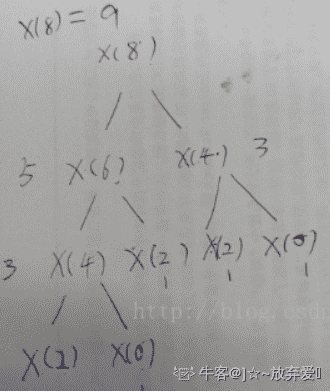
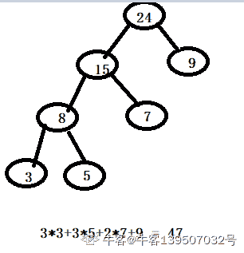

# 二千零二十一、届伴鱼秋招技术岗笔试 E 卷

## 1

在 64 位系统中，有如下类，那么 sizeof（C）的数值是（）

```cpp
class C {

	public:

	    char a;

	    static char b;

	    void *p;

	    static int *c;

	    virtual void func1();

	    virtual void func2();

	};

```

正确答案: D   你的答案: 空 (错误)

```cpp
9
```

```cpp
17
```

```cpp
32
```

```cpp
24
```

本题知识点

Java 工程师 C++工程师 PHP 工程师 golang 工程师 前端工程师 安卓工程师 iOS 工程师 算法工程师 大数据开发工程师 信息技术岗 运维工程师 安全工程师 数据分析师 数据库工程师 游戏研发工程师 区块链 测试开发工程师 测试工程师 伴鱼少儿英语 2021 Java 工程师 C++工程师 PHP 工程师 golang 工程师 前端工程师 安卓工程师 iOS 工程师 算法工程师 大数据开发工程师 信息技术岗 运维工程师 安全工程师 数据分析师 数据库工程师 游戏研发工程师 区块链 测试开发工程师 测试工程师 伴鱼少儿英语 2021

讨论

[牛客 463701925 号](https://www.nowcoder.com/profile/463701925)

答案：D  static   char  b;   void*p;    static  int*  c;  不作为类的大小计算 char a 与下面两个虚函数对齐， 64 位系统函数占 8 字节   3*8 = 24

发表于 2021-09-21 18:22:11

* * *

## 2

以下程序的执行结果是:

```cpp
#include <iostream>
using namespace std;
int i = 0;
int function(int n){
    static int a = 2;
    a++;
    return a + n;
}
void main(){
    int k = 5;    {
       int i = 2;
       k += function(i);
    }
    k += function(i);
    cout << k;
}

```

正确答案: B   你的答案: 空 (错误)

```cpp
13
```

```cpp
14
```

```cpp
15
```

```cpp
16
```

本题知识点

Java 工程师 C++工程师 PHP 工程师 golang 工程师 前端工程师 安卓工程师 iOS 工程师 算法工程师 大数据开发工程师 信息技术岗 运维工程师 安全工程师 数据分析师 数据库工程师 游戏研发工程师 区块链 测试开发工程师 测试工程师 伴鱼少儿英语 2021 Java 工程师 C++工程师 PHP 工程师 golang 工程师 前端工程师 安卓工程师 iOS 工程师 算法工程师 大数据开发工程师 信息技术岗 运维工程师 安全工程师 数据分析师 数据库工程师 游戏研发工程师 区块链 测试开发工程师 测试工程师 伴鱼少儿英语 2021

## 3

若一个类中含有纯虚函数，则该类称为（）。

正确答案: D   你的答案: 空 (错误)

```cpp
基类
```

```cpp
纯基类
```

```cpp
派生类
```

```cpp
抽象类
```

本题知识点

Java 工程师 C++工程师 PHP 工程师 golang 工程师 前端工程师 安卓工程师 iOS 工程师 算法工程师 大数据开发工程师 信息技术岗 运维工程师 安全工程师 数据分析师 数据库工程师 游戏研发工程师 区块链 测试开发工程师 测试工程师 伴鱼少儿英语 2021

## 4

以下叙述中正确的是（）

正确答案: A   你的答案: 空 (错误)

```cpp
在类的一般方法中可用 this 来调用本类的属性
```

```cpp
在类的静态方法中可以访问本类中的属性
```

```cpp
在类方法中绝对不能调用实例方法
```

```cpp
在类方法中只能调用本类中的类方法
```

本题知识点

Java 工程师 C++工程师 PHP 工程师 golang 工程师 前端工程师 安卓工程师 iOS 工程师 算法工程师 大数据开发工程师 信息技术岗 运维工程师 安全工程师 数据分析师 数据库工程师 游戏研发工程师 区块链 测试开发工程师 测试工程师 伴鱼少儿英语 2021 Java 工程师 C++工程师 PHP 工程师 golang 工程师 前端工程师 安卓工程师 iOS 工程师 算法工程师 大数据开发工程师 信息技术岗 运维工程师 安全工程师 数据分析师 数据库工程师 游戏研发工程师 区块链 测试开发工程师 测试工程师 伴鱼少儿英语 2021

## 5

以下关于构造方法的描述错误的是() 

正确答案: A   你的答案: 空 (错误)

```cpp
构造方法的返回类型只能是 void 型
```

```cpp
构造方法是类的一种特殊方法，它的方法名必须与类名相同
```

```cpp
构造方法的主要作用是完成对类的对象的初始化工作
```

```cpp
一个类可以定义多个构造方法
```

本题知识点

Java 工程师 C++工程师 PHP 工程师 golang 工程师 前端工程师 安卓工程师 iOS 工程师 算法工程师 大数据开发工程师 信息技术岗 运维工程师 安全工程师 数据分析师 数据库工程师 游戏研发工程师 区块链 测试开发工程师 测试工程师 伴鱼少儿英语 2021 Java 工程师 C++工程师 PHP 工程师 golang 工程师 前端工程师 安卓工程师 iOS 工程师 算法工程师 大数据开发工程师 信息技术岗 运维工程师 安全工程师 数据分析师 数据库工程师 游戏研发工程师 区块链 测试开发工程师 测试工程师 伴鱼少儿英语 2021

## 6

请问在 javascript 程序中, alert(undefined==null)的输出结果是（      ）

正确答案: C   你的答案: 空 (错误)

```cpp
其他几项都不对
```

```cpp
undefined
```

```cpp
true
```

```cpp
false
```

本题知识点

Java 工程师 C++工程师 PHP 工程师 golang 工程师 前端工程师 安卓工程师 iOS 工程师 算法工程师 大数据开发工程师 信息技术岗 运维工程师 安全工程师 数据分析师 数据库工程师 游戏研发工程师 区块链 测试开发工程师 测试工程师 伴鱼少儿英语 2021 Java 工程师 C++工程师 PHP 工程师 golang 工程师 前端工程师 安卓工程师 iOS 工程师 算法工程师 大数据开发工程师 信息技术岗 运维工程师 安全工程师 数据分析师 数据库工程师 游戏研发工程师 区块链 测试开发工程师 测试工程师 伴鱼少儿英语 2021

## 7

下面哪条语句可以获取元素 e 相邻的下一个元素( )

正确答案: D   你的答案: 空 (错误)

```cpp
e.next()
```

```cpp
e.nextElement()
```

```cpp
e.nextElementSibling()
```

```cpp
e.nextSibling()
```

本题知识点

Java 工程师 C++工程师 PHP 工程师 golang 工程师 前端工程师 安卓工程师 iOS 工程师 算法工程师 大数据开发工程师 信息技术岗 运维工程师 安全工程师 数据分析师 数据库工程师 游戏研发工程师 区块链 测试开发工程师 测试工程师 伴鱼少儿英语 2021 Java 工程师 C++工程师 PHP 工程师 golang 工程师 前端工程师 安卓工程师 iOS 工程师 算法工程师 大数据开发工程师 信息技术岗 运维工程师 安全工程师 数据分析师 数据库工程师 游戏研发工程师 区块链 测试开发工程师 测试工程师 伴鱼少儿英语 2021

## 8

下列函数哪些不是浏览器宿主环境下的 JavaScript 的全局对象？

正确答案: D   你的答案: 空 (错误)

```cpp
setTimeout
```

```cpp
global
```

```cpp
parseFloat
```

```cpp
process
```

本题知识点

Java 工程师 C++工程师 PHP 工程师 golang 工程师 前端工程师 安卓工程师 iOS 工程师 算法工程师 大数据开发工程师 信息技术岗 运维工程师 安全工程师 数据分析师 数据库工程师 游戏研发工程师 区块链 测试开发工程师 测试工程师 伴鱼少儿英语 2021 Java 工程师 C++工程师 PHP 工程师 golang 工程师 前端工程师 安卓工程师 iOS 工程师 算法工程师 大数据开发工程师 信息技术岗 运维工程师 安全工程师 数据分析师 数据库工程师 游戏研发工程师 区块链 测试开发工程师 测试工程师 伴鱼少儿英语 2021

## 9

以下代码执行后，array 的结果是？

```cpp

	let array = [,1,,2,,3];

	array = array.map((i) => ++i)

```

正确答案: D   你的答案: 空 (错误)

```cpp
[null,2,null,3,null,4]
```

```cpp
[1,2,1,3,1,4]
```

```cpp
[NaN,2,NaN,3,NaN,4]
```

```cpp
[,2,,3,,4]
```

本题知识点

Java 工程师 C++工程师 PHP 工程师 golang 工程师 前端工程师 安卓工程师 iOS 工程师 算法工程师 大数据开发工程师 信息技术岗 运维工程师 安全工程师 数据分析师 数据库工程师 游戏研发工程师 区块链 测试开发工程师 测试工程师 伴鱼少儿英语 2021 Java 工程师 C++工程师 PHP 工程师 golang 工程师 前端工程师 安卓工程师 iOS 工程师 算法工程师 大数据开发工程师 信息技术岗 运维工程师 安全工程师 数据分析师 数据库工程师 游戏研发工程师 区块链 测试开发工程师 测试工程师 伴鱼少儿英语 2021

## 10

以下代码执行后，array 的结果是？

```cpp

	var array=[-1,1,3,4,6,10]; 

	array.sort((a,b)=>Math.abs(a-3)-Math.abs(b-3));

```

正确答案: B   你的答案: 空 (错误)

```cpp
[-1,1,3,4,6,10]
```

```cpp
[3,4,1,6,-1,10]
```

```cpp
[10,6,4,3,1,-1]
```

```cpp
[10,-1,6,1,4,3]
```

本题知识点

Java 工程师 C++工程师 PHP 工程师 golang 工程师 前端工程师 安卓工程师 iOS 工程师 算法工程师 大数据开发工程师 信息技术岗 运维工程师 安全工程师 数据分析师 数据库工程师 游戏研发工程师 区块链 测试开发工程师 测试工程师 伴鱼少儿英语 2021 Java 工程师 C++工程师 PHP 工程师 golang 工程师 前端工程师 安卓工程师 iOS 工程师 算法工程师 大数据开发工程师 信息技术岗 运维工程师 安全工程师 数据分析师 数据库工程师 游戏研发工程师 区块链 测试开发工程师 测试工程师 伴鱼少儿英语 2021

## 11

以下代码执行后，console 的输出是？

```cpp

	function Foo(){'use strict'

	 console.log(this.location);

	}

	Foo()

```

正确答案: A   你的答案: 空 (错误)

```cpp
TypeError
```

```cpp
null
```

```cpp
undefined
```

```cpp
当前窗口的 Location 对象
```

本题知识点

Java 工程师 C++工程师 PHP 工程师 golang 工程师 前端工程师 安卓工程师 iOS 工程师 算法工程师 大数据开发工程师 信息技术岗 运维工程师 安全工程师 数据分析师 数据库工程师 游戏研发工程师 区块链 测试开发工程师 测试工程师 伴鱼少儿英语 2021

## 12

以下程序的输出是?

```cpp

	function Foo(){

	     var i=0;

	     return function(){   

	document.write(i++);

	     }

	}

	var f1=Foo(),

	f2=Foo();

	f1();

	f1();

	f2();

```

正确答案: A   你的答案: 空 (错误)

```cpp
010
```

```cpp
012
```

```cpp
000
```

```cpp
011
```

本题知识点

Java 工程师 C++工程师 PHP 工程师 golang 工程师 前端工程师 安卓工程师 iOS 工程师 算法工程师 大数据开发工程师 信息技术岗 运维工程师 安全工程师 数据分析师 数据库工程师 游戏研发工程师 区块链 测试开发工程师 测试工程师 伴鱼少儿英语 2021

## 13

以下选项描述错误的是（    ）

正确答案: D   你的答案: 空 (错误)

```cpp
onchange：用户改变域的内容
```

```cpp
onkeypress：某个键盘的键被按下或按住
```

```cpp
onmousedown：某个鼠标按键被按下
```

```cpp
onblur：元素获得焦点
```

本题知识点

Java 工程师 C++工程师 PHP 工程师 golang 工程师 前端工程师 安卓工程师 iOS 工程师 算法工程师 大数据开发工程师 信息技术岗 运维工程师 安全工程师 数据分析师 数据库工程师 游戏研发工程师 区块链 测试开发工程师 测试工程师 伴鱼少儿英语 2021

## 14

如何遍历下面的 my_data 对象？

var my_data={a:’Ape’, b:’Banana’, c:’Citronella’};

正确答案: A   你的答案: 空 (错误)

```cpp
for(var key in my_data) {}
```

```cpp
foreach(my_data as key=>value) {}
```

```cpp
for(var i=0;i<my_data.length;i++) {}
```

```cpp
全不正确
```

本题知识点

Java 工程师 C++工程师 PHP 工程师 golang 工程师 前端工程师 安卓工程师 iOS 工程师 算法工程师 大数据开发工程师 信息技术岗 运维工程师 安全工程师 数据分析师 数据库工程师 游戏研发工程师 区块链 测试开发工程师 测试工程师 伴鱼少儿英语 2021

## 15

以下运行结果:

```cpp

	for(var i = 0; i < 10; i++) {

	    setTimeout(function() {

	        console.log(i);

	    }, 1000);

	}

```

正确答案: B   你的答案: 空 (错误)

```cpp
0--9
```

```cpp
10 个 10
```

```cpp
10 个 9
```

```cpp
无限循环
```

本题知识点

Java 工程师 C++工程师 PHP 工程师 golang 工程师 前端工程师 安卓工程师 iOS 工程师 算法工程师 大数据开发工程师 信息技术岗 运维工程师 安全工程师 数据分析师 数据库工程师 游戏研发工程师 区块链 测试开发工程师 测试工程师 伴鱼少儿英语 2021

## 16

下面 js 数组的方法中，哪些方法不能改变自身数组？

正确答案: D   你的答案: 空 (错误)

```cpp
pop
```

```cpp
splice
```

```cpp
sort
```

```cpp
concat
```

本题知识点

Javascript 前端工程师 盛趣 Java 工程师 PHP 工程师 算法工程师 大数据开发工程师 信息技术岗 安全工程师 数据分析师 数据库工程师 游戏研发工程师 区块链 测试开发工程师 测试工程师 伴鱼少儿英语 2021

讨论

[Wendy-lxq](https://www.nowcoder.com/profile/802395)

答案应该是 D。因为：  查看全部)

编辑于 2017-05-23 14:29:10

* * *

[白小羊羊羊](https://www.nowcoder.com/profile/2123106)

**pop 方法：**用于删除并返回数组的最后一个元素，把数组长度减 1，并且返回它删除的元素的值。如果数组已经为空，则 pop()不改变数组，并返回 undefined 值**splice()方法：**向/从数组中添加/删除项目，然后返回被删除的项目，该方***改变原始数组**sort()方法**：用于对数组的元素进行排序。返回对数组的引用。请注意，数组在原数组上进行排序，不生成副本。**concat()方法：** 用于连接两个或多个数组。该方法不会改变现有的数组，而仅仅会返回被连接数组的一个副本。综上所述，只有 concat()方法不会改变数组，故选 D

编辑于 2017-05-23 14:29:10

* * *

[还不简单吗](https://www.nowcoder.com/profile/4222073)

Array 对象中的方法：**不改变原数组的有**concat（）：连接数组 join（）：数组=>字符串 slice（）：截取数组的一部分**改变原数组的有：**pop（）删除并返回数组最后一个元素，shift（）与其相反，删除第一个 push（）向数组末添加>=1 个元素，返回数组新长度，unshift（）与其相反，向开头添加 sort（函数）对数组元素排序 splice（）改变（删除、替换）数组内部元素，返回由被删除项目组成的新数组（如果有的话）

编辑于 2019-09-04 21:52:46

* * *

## 17

下列哪些不会返回 false？

正确答案: B   你的答案: 空 (错误)

```cpp
0
```

```cpp
'0'
```

```cpp
 undefined
```

```cpp
null
```

本题知识点

Java 工程师 C++工程师 PHP 工程师 golang 工程师 前端工程师 安卓工程师 iOS 工程师 算法工程师 大数据开发工程师 信息技术岗 运维工程师 安全工程师 数据分析师 数据库工程师 游戏研发工程师 区块链 测试开发工程师 测试工程师 伴鱼少儿英语 2021

## 18

以下代码执行后， num 的值是？

```cpp
var foo=function(x,y){

	    return x-y;

	}

	function
foo(x,y){

	    return x+y;

	}

	var num=foo(1,2);

```

正确答案: D   你的答案: 空 (错误)

```cpp
3
```

```cpp
2
```

```cpp
1
```

```cpp
-1
```

本题知识点

Java 工程师 C++工程师 PHP 工程师 golang 工程师 前端工程师 安卓工程师 iOS 工程师 算法工程师 大数据开发工程师 信息技术岗 运维工程师 安全工程师 数据分析师 数据库工程师 游戏研发工程师 区块链 测试开发工程师 测试工程师 伴鱼少儿英语 2021

## 19

下列程序段的输出结果是：（ ）

```cpp
public void complicatedexpression_r(){
    int x=20, y=30;
    boolean b;
    b = x > 50 && y > 60 || x > 50 && y < -60 || x < -50 && y > 60 || x < -50 && y < -60;
    System.out.println(b);
}
```

正确答案: B   你的答案: 空 (错误)

```cpp
true
```

```cpp
false
```

```cpp
1
```

```cpp
0
```

本题知识点

Java 工程师 C++工程师 PHP 工程师 golang 工程师 前端工程师 安卓工程师 iOS 工程师 算法工程师 大数据开发工程师 信息技术岗 运维工程师 安全工程师 数据分析师 数据库工程师 游戏研发工程师 区块链 测试开发工程师 测试工程师 伴鱼少儿英语 2021

## 20

JVM 内存不包含如下哪个部分( )？

正确答案: B   你的答案: 空 (错误)

```cpp
PC 寄存器
```

```cpp
Heap Frame
```

```cpp
Stacks
```

```cpp
Heap
```

本题知识点

Java 工程师 C++工程师 PHP 工程师 golang 工程师 前端工程师 安卓工程师 iOS 工程师 算法工程师 大数据开发工程师 信息技术岗 运维工程师 安全工程师 数据分析师 数据库工程师 游戏研发工程师 区块链 测试开发工程师 测试工程师 伴鱼少儿英语 2021

## 21

以下代码段执行后的输出结果为？

```cpp

	public class Test {

	public static void main(String args[]) { 

	        int x = -5;

	        int y = -12;

	        System.out.println(y % x);

	} 

	}

```

正确答案: D   你的答案: 空 (错误)

```cpp
-1
```

```cpp
2
```

```cpp
1
```

```cpp
-2
```

本题知识点

Java 工程师 C++工程师 PHP 工程师 golang 工程师 前端工程师 安卓工程师 iOS 工程师 算法工程师 大数据开发工程师 信息技术岗 运维工程师 安全工程师 数据分析师 数据库工程师 游戏研发工程师 区块链 测试开发工程师 测试工程师 伴鱼少儿英语 2021

## 22

以下代码执行后，输出的结果是？

String str = "";

System.out.print(str.split(",").length);

正确答案: B   你的答案: 空 (错误)

```cpp
0
```

```cpp
1
```

```cpp
出现异常
```

```cpp
其他都不对
```

本题知识点

Java 工程师 C++工程师 PHP 工程师 golang 工程师 前端工程师 安卓工程师 iOS 工程师 算法工程师 大数据开发工程师 信息技术岗 运维工程师 安全工程师 数据分析师 数据库工程师 游戏研发工程师 区块链 测试开发工程师 测试工程师 伴鱼少儿英语 2021

## 23

下面程序的运行结果是（ ）。

```cpp
String str1 = "hello";

	String str2 = "he" + new String("llo");

	System.err.println(str1 == str2);

```

正确答案: D   你的答案: 空 (错误)

```cpp
无输出
```

```cpp
exception
```

```cpp
true
```

```cpp
false
```

本题知识点

Java 工程师 C++工程师 PHP 工程师 golang 工程师 前端工程师 安卓工程师 iOS 工程师 算法工程师 大数据开发工程师 信息技术岗 运维工程师 安全工程师 数据分析师 数据库工程师 游戏研发工程师 区块链 测试开发工程师 测试工程师 伴鱼少儿英语 2021

## 24

ArrayList 和 Vector 主要区别是什么？

正确答案: A   你的答案: 空 (错误)

```cpp
Vector 与 ArrayList 一样，也是通过数组实现的，不同的是 Vector 支持线程的同步
```

```cpp
Vector 与 ArrayList 一样，也是通过数组实现的，不同的是 ArrayList 支持线程的同步
```

```cpp
Vector 是通过链表结构存储数据，ArrayList 是通过数组存储数据
```

```cpp
其他说法都不正确
```

本题知识点

Java 工程师 C++工程师 PHP 工程师 golang 工程师 前端工程师 安卓工程师 iOS 工程师 算法工程师 大数据开发工程师 信息技术岗 运维工程师 安全工程师 数据分析师 数据库工程师 游戏研发工程师 区块链 测试开发工程师 测试工程师 伴鱼少儿英语 2021

## 25

Java 中的集合类包括 ArrayList 、 LinkedList 、 HashMap 等，下列关于集合类描述不正确的是？（）

正确答案: C   你的答案: 空 (错误)

```cpp
ArrayList 和 LinkedList 均实现了 List 接口
```

```cpp
ArrayList 访问速度比 LinkedList 快
```

```cpp
随机添加和删除元素时，ArrayList 的表现更加快速
```

```cpp
HashMap 实现 Map 接口，它允许任何类型的键和值对象，并允许将 NULL 用作键或值
```

本题知识点

Java 工程师 C++工程师 PHP 工程师 golang 工程师 前端工程师 安卓工程师 iOS 工程师 算法工程师 大数据开发工程师 信息技术岗 运维工程师 安全工程师 数据分析师 数据库工程师 游戏研发工程师 区块链 测试开发工程师 测试工程师 伴鱼少儿英语 2021

讨论

[猿途](https://www.nowcoder.com/profile/4670762)

答案是 C

发表于 2021-09-21 01:36:02

* * *

[小健灬](https://www.nowcoder.com/profile/602798961)

C

发表于 2021-09-18 13:30:17

* * *

## 26

下面代码将输出什么内容：（）？

```cpp
public class SystemUtil{

	    public static boolean isAdmin(String userId){

	        return userId.toLowerCase()=="admin";

	    }

	    public static void main(String[] args){

	        System.out.println(isAdmin("Admin"));

	    }

	}

```

正确答案: B   你的答案: 空 (错误)

```cpp
true
```

```cpp
false
```

```cpp
1
```

```cpp
编译错误
```

本题知识点

Java 工程师 C++工程师 PHP 工程师 golang 工程师 前端工程师 安卓工程师 iOS 工程师 算法工程师 大数据开发工程师 信息技术岗 运维工程师 安全工程师 数据分析师 数据库工程师 游戏研发工程师 区块链 测试开发工程师 测试工程师 伴鱼少儿英语 2021

讨论

[]☆~放弃爱❤](https://www.nowcoder.com/profile/6957431)

执行 toLowerCase() 时会重新 new String（），而==是判断地址，所以会返回 false。

发表于 2021-07-09 18:27:22

* * *

## 27

查看 SQL 的执行计划，可以使用 1 命令。

你的答案 (错误)

1 参考答案 (1) explain

本题知识点

Java 工程师 C++工程师 PHP 工程师 golang 工程师 前端工程师 安卓工程师 iOS 工程师 算法工程师 大数据开发工程师 信息技术岗 运维工程师 安全工程师 数据分析师 数据库工程师 游戏研发工程师 区块链 测试开发工程师 测试工程师 伴鱼少儿英语 2021

## 28

Web 应用层协议（HTTP）所依赖的传输协议为 1 及为它保留的端口号为 2

你的答案 (错误)

12 参考答案 (1) TCP 或 tcp
(2) 80

本题知识点

Java 工程师 C++工程师 PHP 工程师 golang 工程师 前端工程师 安卓工程师 iOS 工程师 算法工程师 大数据开发工程师 信息技术岗 运维工程师 安全工程师 数据分析师 数据库工程师 游戏研发工程师 区块链 测试开发工程师 测试工程师 伴鱼少儿英语 2021

## 29

如果一个由'0' 和 '1'组成的字符串，是以一些 '0'（可能没有 '0'）后面跟着一些 '1'（也可能没有 '1'）的形式组成的，那么该字符串是单调递增的。

我们给出一个由字符 '0' 和 '1'组成的字符串 S，我们可以将任何'0' 翻转为 '1' 或者将 '1' 翻转为 '0'。

返回使 S 单调递增的最小翻转次数。

本题知识点

Java 工程师 C++工程师 PHP 工程师 golang 工程师 前端工程师 安卓工程师 iOS 工程师 算法工程师 大数据开发工程师 信息技术岗 运维工程师 安全工程师 数据分析师 数据库工程师 游戏研发工程师 区块链 测试开发工程师 测试工程师 伴鱼少儿英语 2021

## 30

在 c++语言中，STL 中的一级容器有:（）

正确答案: D   你的答案: 空 (错误)

```cpp
序列容器，关联容器，容器适配器
```

```cpp
vector, deque, list, set, multiset, map, multimap.
```

```cpp
set, multiset, map, multimap.
```

```cpp
vector, deque, list.
```

本题知识点

Java 工程师 C++工程师 PHP 工程师 golang 工程师 前端工程师 安卓工程师 iOS 工程师 算法工程师 大数据开发工程师 信息技术岗 运维工程师 安全工程师 数据分析师 数据库工程师 游戏研发工程师 区块链 测试开发工程师 测试工程师 伴鱼少儿英语 2021

## 31

在重载一个运算符为成员函数时，其参数表中没有任何参数，这说明该运算符是（）

正确答案: C   你的答案: 空 (错误)

```cpp
无操作数的运算符
```

```cpp
二元运算符
```

```cpp
前缀一元运算符
```

```cpp
后缀一元运算符
```

本题知识点

Java 工程师 C++工程师 PHP 工程师 golang 工程师 前端工程师 安卓工程师 iOS 工程师 算法工程师 大数据开发工程师 信息技术岗 运维工程师 安全工程师 数据分析师 数据库工程师 游戏研发工程师 区块链 测试开发工程师 测试工程师 伴鱼少儿英语 2021

## 32

已知 fun(int)是类 Test 的公有成员函数，p 是指向成员函数 fun()的指针，采用（）是正确的。

正确答案: D   你的答案: 空 (错误)

```cpp
p=fun
```

```cpp
p=Test::fun()
```

```cpp
p=fun()
```

```cpp
p=&Test::fun
```

本题知识点

Java 工程师 C++工程师 PHP 工程师 golang 工程师 前端工程师 安卓工程师 iOS 工程师 算法工程师 大数据开发工程师 信息技术岗 运维工程师 安全工程师 数据分析师 数据库工程师 游戏研发工程师 区块链 测试开发工程师 测试工程师 伴鱼少儿英语 2021

## 33

如果有一个类是 myClass ,关于下面代码正确描述的是()

myClass::~myClass(){

delete this;

this = NULL;

}

正确答案: C   你的答案: 空 (错误)

```cpp
正确，我们避免了内存泄漏
```

```cpp
它会导致栈溢出
```

```cpp
无法编译通过
```

```cpp
这是不正确的，它没有释放任何成员变量。
```

本题知识点

Java 工程师 C++工程师 PHP 工程师 golang 工程师 前端工程师 安卓工程师 iOS 工程师 算法工程师 大数据开发工程师 信息技术岗 运维工程师 安全工程师 数据分析师 数据库工程师 游戏研发工程师 区块链 测试开发工程师 测试工程师 伴鱼少儿英语 2021

讨论

[15764332](https://www.nowcoder.com/profile/5786535)

'this' is a const pointer which points to class

发表于 2021-10-06 22:24:07

* * *

## 34

下列关于虚函数的说明中，正确的是( )

正确答案: B   你的答案: 空 (错误)

```cpp
从虚基类继承的函数都是虚函数
```

```cpp
虚函数不得是静态成员函数
```

```cpp
只能通过指针或引用调用虚函数
```

```cpp
抽象类中的成员函数都是虚函数
```

本题知识点

Java 工程师 C++工程师 PHP 工程师 golang 工程师 前端工程师 安卓工程师 iOS 工程师 算法工程师 大数据开发工程师 信息技术岗 运维工程师 安全工程师 数据分析师 数据库工程师 游戏研发工程师 区块链 测试开发工程师 测试工程师 伴鱼少儿英语 2021

## 35

列有关继承和派生的叙述中，正确的是( )

正确答案: C   你的答案: 空 (错误)

```cpp
派生类不能访问基类的保护成员
```

```cpp
作为虚基类的类不能被实例化
```

```cpp
派生类应当向基类的构造函数传递参数
```

```cpp
虚函数必须在派生类中重新实现
```

本题知识点

Java 工程师 C++工程师 PHP 工程师 golang 工程师 前端工程师 安卓工程师 iOS 工程师 算法工程师 大数据开发工程师 信息技术岗 运维工程师 安全工程师 数据分析师 数据库工程师 游戏研发工程师 区块链 测试开发工程师 测试工程师 伴鱼少儿英语 2021

## 36

有以下语句，则能够输出 a+b+c 的值的语句是（）

int a=1, b=2, c=3; int*pary[3]={&a, &b, &c};

正确答案: B   你的答案: 空 (错误)

```cpp
cout<<(pary[0]+pary[1]+pary[2]);
```

```cpp
cout<<(*pary[0]+*pary[1]+*pary[2]);
```

```cpp
cout<<(pary[1]+pary[2]+pary[3]); 
```

```cpp
cout<<(*pary[1]+*pary[2]+*pary[3]);
```

本题知识点

Java 工程师 C++工程师 PHP 工程师 golang 工程师 前端工程师 安卓工程师 iOS 工程师 算法工程师 大数据开发工程师 信息技术岗 运维工程师 安全工程师 数据分析师 数据库工程师 游戏研发工程师 区块链 测试开发工程师 测试工程师 伴鱼少儿英语 2021

## 37

有以下说明语句，则正确的赋值语句是（）

int a[5][5];  int *p, **q;

正确答案: A   你的答案: 空 (错误)

```cpp
p=a[0]; 
```

```cpp
p=&a[0];
```

```cpp
q=a[0];
```

```cpp
q=&a[0][0];
```

本题知识点

Java 工程师 C++工程师 PHP 工程师 golang 工程师 前端工程师 安卓工程师 iOS 工程师 算法工程师 大数据开发工程师 信息技术岗 运维工程师 安全工程师 数据分析师 数据库工程师 游戏研发工程师 区块链 测试开发工程师 测试工程师 伴鱼少儿英语 2021

## 38

在 32 位系统中以下函数的返回值()

int fun(void)

{

    int *p, j, i=10;

    p = &j;

    *p = i++;

    i += sizeof(i) + sizeof(*p) + sizeof(p);

    return i;

}

正确答案: B   你的答案: 空 (错误)

```cpp
22
```

```cpp
23    
```

```cpp
25
```

```cpp
其他结果都不对
```

本题知识点

Java 工程师 C++工程师 PHP 工程师 golang 工程师 前端工程师 安卓工程师 iOS 工程师 算法工程师 大数据开发工程师 信息技术岗 运维工程师 安全工程师 数据分析师 数据库工程师 游戏研发工程师 区块链 测试开发工程师 测试工程师 伴鱼少儿英语 2021

## 39

下面程序的输出结果是（）

 #include<iosteam.h>
    void main(){
    int n[][3] = {10,20,30,40,50,60};
    int (*p)[3];
    p=n;
    cout<<p[0][0]<<","<<*(p[0]+1)<<","<<(*p)[2]<<endl;
}

正确答案: B   你的答案: 空 (错误)

```cpp
10,30,50
```

```cpp
10,20,30
```

```cpp
20,40,60
```

```cpp
10,30,60
```

本题知识点

Java 工程师 C++工程师 PHP 工程师 golang 工程师 前端工程师 安卓工程师 iOS 工程师 算法工程师 大数据开发工程师 信息技术岗 运维工程师 安全工程师 数据分析师 数据库工程师 游戏研发工程师 区块链 测试开发工程师 测试工程师 伴鱼少儿英语 2021

## 40

递归算法 x(8)需要调用( )次函数 x(int n)

class program

 {

     static void Main(string[] args)

     {

         int i;

         i = x(8);

     }

     static int x(int n)

     {

         if (n <= 3)

             return 1;

         else

             return x(n - 2) + x(n - 4) + 1;

     }

 }

正确答案: A   你的答案: 空 (错误)

```cpp
9
```

```cpp
12
```

```cpp
18
```

```cpp
24
```

本题知识点

Java 工程师 C++工程师 PHP 工程师 golang 工程师 前端工程师 安卓工程师 iOS 工程师 算法工程师 大数据开发工程师 信息技术岗 运维工程师 安全工程师 数据分析师 数据库工程师 游戏研发工程师 区块链 测试开发工程师 测试工程师 伴鱼少儿英语 2021

讨论

[]☆~放弃爱❤](https://www.nowcoder.com/profile/6957431)



发表于 2021-07-09 18:30:13

* * *

## 41

java 有 8 种基本类型，请问 byte、int、long、char、float、double、boolean 各占多少个字节？()

正确答案: B   你的答案: 空 (错误)

```cpp
1 2 8 2 4 8 1
```

```cpp
1 4 8 2 4 8 1
```

```cpp
1 4 4 2 4 4 2
```

```cpp
1 4 4 2 4 8 2
```

本题知识点

Java 工程师 C++工程师 PHP 工程师 golang 工程师 前端工程师 安卓工程师 iOS 工程师 算法工程师 大数据开发工程师 信息技术岗 运维工程师 安全工程师 数据分析师 数据库工程师 游戏研发工程师 区块链 测试开发工程师 测试工程师 伴鱼少儿英语 2021

## 42

java8 中，下面哪个类用到了解决哈希冲突的开放定址法( )

正确答案: C   你的答案: 空 (错误)

```cpp
LinkedHashSet
```

```cpp
HashMap
```

```cpp
ThreadLocal
```

```cpp
TreeMap
```

本题知识点

Java 工程师 C++工程师 PHP 工程师 golang 工程师 前端工程师 安卓工程师 iOS 工程师 算法工程师 大数据开发工程师 信息技术岗 运维工程师 安全工程师 数据分析师 数据库工程师 游戏研发工程师 区块链 测试开发工程师 测试工程师 伴鱼少儿英语 2021

讨论

[𐂂StrawberrySwingฅฅ*](https://www.nowcoder.com/profile/280850601)

B

发表于 2021-08-20 20:45:06

* * *

## 43

关于 Java 中参数传递的说法，哪个是错误的？()

正确答案: D   你的答案: 空 (错误)

```cpp
在方法中，修改一个基础类型的参数不会影响原始参数值
```

```cpp
在方法中，改变一个对象参数的引用不会影响到原始引用
```

```cpp
在方法中，修改一个对象的属性会影响原始对象参数
```

```cpp
在方法中，修改集合和 Maps 的元素不会影响原始集合参数
```

本题知识点

Java 工程师 C++工程师 PHP 工程师 golang 工程师 前端工程师 安卓工程师 iOS 工程师 算法工程师 大数据开发工程师 信息技术岗 运维工程师 安全工程师 数据分析师 数据库工程师 游戏研发工程师 区块链 测试开发工程师 测试工程师 伴鱼少儿英语 2021

讨论

[张无忌 YYDS](https://www.nowcoder.com/profile/651149428)

D 方法中中传入参数，就是讲实际变量存储的值复制到方法的局部变量中，对于基本类型，改变的是局部变量的值，对于引用类型，同样只是这里的值相当于一个地址，指向某个对象，将另外一个地址赋值给变量，改变的也只是局部变量中存储的地址，指向了另一个对象。但通过局部变量中的地址可以访问修改指向的对象。这样原本变量指向的对象就发生了变化。

发表于 2021-08-11 16:59:52

* * *

[牛客 136393648 号](https://www.nowcoder.com/profile/136393648)

C

发表于 2021-07-06 09:20:25

* * *

## 44

根据下面的程序代码，哪些选项的值返回 true？()

public class Square {  

    long width;  

    public Square(long l) {   

        width = l;  

    }  

    public static void main(String arg[]) {   

        Square a, b, c;   

        a = new Square(42L);   

        b = new Square(42L);   

        c = b;   

        long s = 42L;  

    }

}

正确答案: C   你的答案: 空 (错误)

```cpp
a == b
```

```cpp
s == a
```

```cpp
b == c
```

```cpp
a.equals(s)
```

本题知识点

Java 工程师 C++工程师 PHP 工程师 golang 工程师 前端工程师 安卓工程师 iOS 工程师 算法工程师 大数据开发工程师 信息技术岗 运维工程师 安全工程师 数据分析师 数据库工程师 游戏研发工程师 区块链 测试开发工程师 测试工程师 伴鱼少儿英语 2021

## 45

public class Main {

    public static void main(String[] args) {

        System.out.println("A");

        new Main();

        new Main();

    }

    public Main() {

        System.out.println("B");

    }

    {

        System.out.println("C");

    }

    static {

        System.out.println("D");

    }

}

以上程序输出的结果，正确的是？()

正确答案: C   你的答案: 空 (错误)

```cpp
DCABB
```

```cpp
DABCBC
```

```cpp
DACBCB
```

```cpp
DACBB
```

本题知识点

Java 工程师 C++工程师 PHP 工程师 golang 工程师 前端工程师 安卓工程师 iOS 工程师 算法工程师 大数据开发工程师 信息技术岗 运维工程师 安全工程师 数据分析师 数据库工程师 游戏研发工程师 区块链 测试开发工程师 测试工程师 伴鱼少儿英语 2021

讨论

[rowrycho](https://www.nowcoder.com/profile/7017458)

static 在类加载的时候就进行了加载（只执行一次）。

在 new 的时候，先按顺序执行代码块中的代码，然后在执行构造函数。

发表于 2021-08-20 11:39:41

* * *

## 46

执行以下程序后，输出结果正确的是？()

public class Main {

    public static void main(String[] args) {

        String s1 = "abc";

        String s2 = "abc";

        System.out.println(s1 == s2);

        String s3 = new String("abc");

        System.out.println(s1 == s3);

    }

}

正确答案: B   你的答案: 空 (错误)

```cpp
true       true
```

```cpp
true       false
```

```cpp
false       fasle
```

```cpp
false       true
```

本题知识点

Java 工程师 C++工程师 PHP 工程师 golang 工程师 前端工程师 安卓工程师 iOS 工程师 算法工程师 大数据开发工程师 信息技术岗 运维工程师 安全工程师 数据分析师 数据库工程师 游戏研发工程师 区块链 测试开发工程师 测试工程师 伴鱼少儿英语 2021

## 47

在 HTML 页面上包含如下所示的层对象，则 javascript 语句 document.getElementById(“info”).innerHTML 的值是（    ）

<div id=”info”style=”display:block”><p>请填写</p></div>

正确答案: B   你的答案: 空 (错误)

```cpp
请填写
```

```cpp
<p>请填写</p>
```

```cpp
id=”info”style=”display:block”
```

```cpp
<div id=”info”style=”display:block”><p>请填写</p>
```

本题知识点

Java 工程师 C++工程师 PHP 工程师 golang 工程师 前端工程师 安卓工程师 iOS 工程师 算法工程师 大数据开发工程师 信息技术岗 运维工程师 安全工程师 数据分析师 数据库工程师 游戏研发工程师 区块链 测试开发工程师 测试工程师 伴鱼少儿英语 2021

## 48

在 JavaScript 中，把字符串“123”转换为整型值 123 的正确方法是(   )。

正确答案: C   你的答案: 空 (错误)

```cpp
var str="123";var num=(int)str;
```

```cpp
var str="123";var num=str.parseInt(str);
```

```cpp
var str="123";var num=parseInt(str); 
```

```cpp
var str="123";var num=Integer.parseInt(str);
```

本题知识点

Java 工程师 C++工程师 PHP 工程师 golang 工程师 前端工程师 安卓工程师 iOS 工程师 算法工程师 大数据开发工程师 信息技术岗 运维工程师 安全工程师 数据分析师 数据库工程师 游戏研发工程师 区块链 测试开发工程师 测试工程师 伴鱼少儿英语 2021

## 49

关于 UDP 的说法正确的是()

正确答案: B   你的答案: 空 (错误)

```cpp
UDP 的包大小没有限制
```

```cpp
UDP 不会进行错误重传
```

```cpp
UDP 跟 TCP 一样提供可靠的数据报协议
```

```cpp
UDP 有简单的流控制
```

本题知识点

Java 工程师 C++工程师 PHP 工程师 golang 工程师 前端工程师 安卓工程师 iOS 工程师 算法工程师 大数据开发工程师 信息技术岗 运维工程师 安全工程师 数据分析师 数据库工程师 游戏研发工程师 区块链 测试开发工程师 测试工程师 伴鱼少儿英语 2021

## 50

在 tcp/ip 网络分层里里面面，icmp 和 igmp 是属于哪一层？( )

正确答案: B   你的答案: 空 (错误)

```cpp
链路层
```

```cpp
网络层
```

```cpp
传输层
```

```cpp
应用层
```

本题知识点

Java 工程师 C++工程师 PHP 工程师 golang 工程师 前端工程师 安卓工程师 iOS 工程师 算法工程师 大数据开发工程师 信息技术岗 运维工程师 安全工程师 数据分析师 数据库工程师 游戏研发工程师 区块链 测试开发工程师 测试工程师 伴鱼少儿英语 2021

## 51

如果 C 类子网的掩码为 255.255.255.240，则包含的子网位数、子网数目、每个子网中的主机数目正确的是（）

正确答案: C   你的答案: 空 (错误)

```cpp
2 2 2
```

```cpp
3 6 30
```

```cpp
4 14 14
```

```cpp
5 30 6
```

本题知识点

Java 工程师 C++工程师 PHP 工程师 golang 工程师 前端工程师 安卓工程师 iOS 工程师 算法工程师 大数据开发工程师 信息技术岗 运维工程师 安全工程师 数据分析师 数据库工程师 游戏研发工程师 区块链 测试开发工程师 测试工程师 伴鱼少儿英语 2021

## 52

以下序列(9,7,3,5)构造的 Haffman 树带权路径长度为( )

正确答案: C   你的答案: 空 (错误)

```cpp
45
```

```cpp
46
```

```cpp
47
```

```cpp
48
```

本题知识点

树

讨论

[牛客 139507032 号](https://www.nowcoder.com/profile/139507032)



发表于 2022-03-12 16:27:18

* * *

[TravelingLight732](https://www.nowcoder.com/profile/697141872)

画图计算可得

发表于 2021-12-08 17:15:26

* * *

## 53

设指针变量 p 指向双向链表中结点 A（A 不是最右边节点），指针变量 s 指向被插入的结点 X，则在结点 A 的右面插入结点 X 的操作序列为：（）

正确答案: D   你的答案: 空 (错误)

```cpp
p->right=s； s->left=p； p->right->left=s； s->right=p->right；
```

```cpp
s->left=p；s->right=p->right；p->right=s； p->right->left=s；
```

```cpp
p->right=s； p->right->left=s； s->left=p； s->right=p->right；
```

```cpp
s->left=p；s->right=p->right；p->right->left=s； p->right=s；
```

本题知识点

Java 工程师 C++工程师 PHP 工程师 golang 工程师 前端工程师 安卓工程师 iOS 工程师 算法工程师 大数据开发工程师 信息技术岗 运维工程师 安全工程师 数据分析师 数据库工程师 游戏研发工程师 区块链 测试开发工程师 测试工程师 伴鱼少儿英语 2021

## 54

设无向图 G 中的边的集合 E={(a，b)，(a，e)，(a，c)，(b，e)，(e，d)，(d，f)，(f，c)}，则从顶点 a 出发进行深度优先遍历可以得到的一种顶点序列为( )

正确答案: A   你的答案: 空 (错误)

```cpp
aedfcb
```

```cpp
acfebd
```

```cpp
aebcfd
```

```cpp
aedfbc
```

本题知识点

Java 工程师 C++工程师 PHP 工程师 golang 工程师 前端工程师 安卓工程师 iOS 工程师 算法工程师 大数据开发工程师 信息技术岗 运维工程师 安全工程师 数据分析师 数据库工程师 游戏研发工程师 区块链 测试开发工程师 测试工程师 伴鱼少儿英语 2021

## 55

文件目录 data 当前权限为 rwx --- ---，只需要增加用户组可读可执行权限，但不允许写操作，具体方法为( )

正确答案: A   你的答案: 空 (错误)

```cpp
chmod+050data
```

```cpp
chmod+040data
```

```cpp
chmod+005data
```

```cpp
chmod+004data
```

本题知识点

Java 工程师 C++工程师 PHP 工程师 golang 工程师 前端工程师 安卓工程师 iOS 工程师 算法工程师 大数据开发工程师 信息技术岗 运维工程师 安全工程师 数据分析师 数据库工程师 游戏研发工程师 区块链 测试开发工程师 测试工程师 伴鱼少儿英语 2021

## 56

变址寻址方式中，操作数的有效地址是（ ）

正确答案: C   你的答案: 空 (错误)

```cpp
基址寄存器内容加上形式地址（位移量）
```

```cpp
程序计数器内容加上形式地址
```

```cpp
变址寄存器内容加上形式地址
```

```cpp
寄存器内容加上形式地址
```

本题知识点

Java 工程师 C++工程师 PHP 工程师 golang 工程师 前端工程师 安卓工程师 iOS 工程师 算法工程师 大数据开发工程师 信息技术岗 运维工程师 安全工程师 数据分析师 数据库工程师 游戏研发工程师 区块链 测试开发工程师 测试工程师 伴鱼少儿英语 2021

## 57

浮点数的表示范围和精度取决于( )

正确答案: C   你的答案: 空 (错误)

```cpp
阶码的位数和尾数的机器数形式
```

```cpp
阶码的机器数形式和尾数的位数
```

```cpp
阶码的位数和尾数的位数
```

```cpp
阶码的机器数形式和尾数的机器数形式
```

本题知识点

Java 工程师 C++工程师 PHP 工程师 golang 工程师 前端工程师 安卓工程师 iOS 工程师 算法工程师 大数据开发工程师 信息技术岗 运维工程师 安全工程师 数据分析师 数据库工程师 游戏研发工程师 区块链 测试开发工程师 测试工程师 伴鱼少儿英语 2021

## 58

在进程状态转换时，下列(  )转换是不可能发生的。

正确答案: D   你的答案: 空 (错误)

```cpp
就绪态→运行态
```

```cpp
运行态→就绪态
```

```cpp
运行态→阻塞态
```

```cpp
阻塞态→运行态
```

本题知识点

Java 工程师 C++工程师 PHP 工程师 golang 工程师 前端工程师 安卓工程师 iOS 工程师 算法工程师 大数据开发工程师 信息技术岗 运维工程师 安全工程师 数据分析师 数据库工程师 游戏研发工程师 区块链 测试开发工程师 测试工程师 伴鱼少儿英语 2021

讨论

[]☆~放弃爱❤](https://www.nowcoder.com/profile/6957431)

处于阻塞态的进程缺乏资源，而处于运行态的进程只能给有资源的进程提供 CPU，而且 CPU 在同一刻只能处理一个进程（指的是单核 CPU)

发表于 2021-07-09 18:52:49

* * *

## 59

已知二叉树的前序遍历顺序为：GDALFEMHZ,中序遍历顺序为：LADEFGHMZ，则后序遍历顺序为 1

你的答案 (错误)

1 参考答案 (1) LAEFDHZMG

本题知识点

Java 工程师 C++工程师 PHP 工程师 golang 工程师 前端工程师 安卓工程师 iOS 工程师 算法工程师 大数据开发工程师 信息技术岗 运维工程师 安全工程师 数据分析师 数据库工程师 游戏研发工程师 区块链 测试开发工程师 测试工程师 伴鱼少儿英语 2021

讨论

[]☆~放弃爱❤](https://www.nowcoder.com/profile/6957431)

前序二叉树的头就是就是二叉树的根结点。根据中序遍历的规则，在中序顺序中前序二叉树的头对应字母的左边就是左子树，右边就是右子树。之后根据前序中序遍历规则分别试验出二叉树顺序

发表于 2021-07-09 18:58:17

* * *

## 60

冯诺依曼计算机组织结构：输入设备、运算器、1、存储器、输出设备。

 你的答案 (错误)

1 参考答案 (1) 控制器

本题知识点

Java 工程师 C++工程师 PHP 工程师 golang 工程师 前端工程师 安卓工程师 iOS 工程师 算法工程师 大数据开发工程师 信息技术岗 运维工程师 安全工程师 数据分析师 数据库工程师 游戏研发工程师 区块链 测试开发工程师 测试工程师 伴鱼少儿英语 2021

讨论

[_Ddy](https://www.nowcoder.com/profile/436508433)

控制器

发表于 2021-09-01 14:43:31

* * *

## 61

设散列表的长度为 8，散列函数 H(k)=kmod 7，初始记录关键字序列为(32,24,15,27,20,13)，计算用链地址法作为解决冲突方法的平均查找长度是（）

正确答案: A   你的答案: 空 (错误)

```cpp
1.5
```

```cpp
1.6
```

```cpp
1.4
```

```cpp
2
```

本题知识点

链表 *哈希 *Java 工程师 C++工程师 PHP 工程师 golang 工程师 前端工程师 安卓工程师 iOS 工程师 算法工程师 大数据开发工程师 信息技术岗 运维工程师 安全工程师 数据分析师 数据库工程师 游戏研发工程师 区块链 测试开发工程师 测试工程师 伴鱼少儿英语 2021** **讨论

[丨太阳与月亮丨](https://www.nowcoder.com/profile/9415270)

A 序列对应的散列值为 4,3,1,6,6,6 因此 32 查找长度 1, 24 查找长度 1，15 查找长度 1, 27 查找长度 1, 20 查找长度 2， 13 查找长度 3 平均查找长度（1+1+1+1+2+3）/6=1.5

编辑于 2021-07-03 11:09:05

* * *

[天尊墨宇](https://www.nowcoder.com/profile/667959477)

A 序列对应的散列值为 4,3,1,6,6,6 因此 32 查找长度 1, 24 查找长度 1，15 查找长度 1, 27 查找长度 1, 20 查找长度 2， 13 查找长度 3 平均查找长度（1+1+1+1+2+3）/6=1.5

发表于 2020-06-24 10:56:31

* * *

[紫君](https://www.nowcoder.com/profile/8325547)

A

发表于 2018-01-15 09:57:33

* * *

## 62

请从字符串中找出一个最长的不包含重复字符的子字符串，计算该最长子字符串的长度。

 本题知识点

Java 工程师 C++工程师 PHP 工程师 golang 工程师 前端工程师 安卓工程师 iOS 工程师 算法工程师 大数据开发工程师 信息技术岗 运维工程师 安全工程师 数据分析师 数据库工程师 游戏研发工程师 区块链 测试开发工程师 测试工程师 伴鱼少儿英语 2021

讨论

[牛客 772883394 号](https://www.nowcoder.com/profile/772883394)

哈希表+双指针滑动窗口。时间复杂度 o(n)，只遍历一次；空间复杂度 o(1)，虽然用了哈希表，但是字符 ASCII 码 0~127，也就是说哈希表最多存 128 个数据，这是个常数级别，可认为是 o(1)。

```cpp
function lengthOfLongestSubstring( s ) {
    // write code here
    //1. 用一个 map 存储子字符串信息，key-字符，value-下标。
    //2. 滑动窗口，双指针，begin，end。再用一个变量 maxLength 记录最大长度。
    //3. end 变量字符串，如果 map 中有重复字符，maxLength = max（maxLength，
    // end-begin），更新 begin = max（begin， value+1）。
    //4. 更新 map 信息。
    //5. 最后再更新一次 maxLength。
    const map = new Map();
    let begin = 0;
    let end = 0;
    let maxLength = 0;
    while (end < s.length) {
        const char = s.charAt(end);
        if (map.has(char)) {
            maxLength = Math.max(maxLength, end - begin);
            begin = Math.max(begin, map.get(char) + 1);
        }
        map.set(char, end);
        end++;
    }
    maxLength = Math.max(maxLength, end - begin);
    return maxLength;
}
```

发表于 2021-08-13 11:51:56

* * *

## 63

输入一个整数数组，判断该数组是不是某二叉搜索树的后序遍历结果。如果是则返回 true，否则返回 false。假设输入的数组的任意两个数字都互不相同。如下: ```cpp
     5
    / \
   2   6
  / \
 1   3
``` 

本题知识点

Java 工程师 C++工程师 PHP 工程师 golang 工程师 前端工程师 安卓工程师 iOS 工程师 算法工程师 大数据开发工程师 信息技术岗 运维工程师 安全工程师 数据分析师 数据库工程师 游戏研发工程师 区块链 测试开发工程师 测试工程师 伴鱼少儿英语 2021**