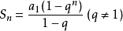

# 二千零二十一、年伴鱼春季招聘技术岗 A 卷

## 1

一个最多由 0,1,2 三种元素组成的无序整数数组[0,1,1,1,2,2,0,0…….]，要将其按从小到大排序，时间复杂度为 0(n)。

本题知识点

Java 工程师 C++工程师 PHP 工程师 golang 工程师 前端工程师 安卓工程师 iOS 工程师 算法工程师 大数据开发工程师 信息技术岗 运维工程师 安全工程师 数据分析师 数据库工程师 游戏研发工程师 区块链 测试开发工程师 测试工程师 伴鱼少儿英语 2021

## 2

字符串压缩。利用字符重复出现的次数，编写一种方法，实现基本的字符串压缩功能。比如，字符串 aabcccccaaa 会变为 a2b1c5a3。若“压缩”后的字符串没有变短，则返回原先的字符串。你可以假设字符串中只包含大小写英文字母（a 至 z）。

本题知识点

Java 工程师 C++工程师 PHP 工程师 golang 工程师 前端工程师 安卓工程师 iOS 工程师 算法工程师 大数据开发工程师 信息技术岗 运维工程师 安全工程师 数据分析师 数据库工程师 游戏研发工程师 区块链 测试开发工程师 测试工程师 伴鱼少儿英语 2021

讨论

[看不透](https://www.nowcoder.com/profile/625066021)

```cpp
import java.util.*;

public class Solution {
    /**
     * 代码中的类名、方法名、参数名已经指定，请勿修改，直接返回方法规定的值即可
     *
     * 
     * @param str string 字符串 
     * @return string 字符串
     */
    public String compressString (String str) {
        // write code here
        StringBuffer sb = new StringBuffer ();
        int len = str.length();
        int count = 0;
        char ch = str.charAt(0);
        for (int i = 0;i < len; i ++) {
            if (ch == str.charAt(i)) {
                count ++;
            }else {
                sb.append(ch);
                sb.append(count);
                ch = str.charAt(i);
                count = 1;
            }
        }
        sb.append(ch);
        sb.append(count);
        return len > sb.toString().length() ? sb.toString(): str;
    }
}
```

leetcode 上原题

发表于 2021-09-27 11:13:16

* * *

[Sushine](https://www.nowcoder.com/profile/918496688)

```cpp
public String compressString (String str) {
        if (str.length() < 2) {
            return str;
        }
        char[] arr = str.toCharArray();
        StringBuilder sb = new StringBuilder();
        int count = 1;
        for (int i = 0; i < arr.length - 1; i++) {
            if (arr[i] == arr[i + 1]) {
                count++;
            } else {
                sb.append(arr[i]).append(count);
                count = 1;
            }
            if ((i + 1) == arr.length - 1) {
                sb.append(arr[i]).append(count);
            }
        }
        return sb.length() < str.length() ? sb.toString() : str;
    }
```

发表于 2021-09-22 20:39:53

* * *

[牛客 87694269](https://www.nowcoder.com/profile/924123302)

class Solution {
public:
    /**
     * 代码中的类名、方法名、参数名已经指定，请勿修改，直接返回方法规定的值即可
     *
     * 
     * @param str string 字符串 
     * @return string 字符串
     */
    string compressString(string str) {
        // write code here
        string cS;
        char elem = str[0];
        int cnt = 1;
        string sub_string;
        for(int i = 1; i < str.size();i++){
            if(elem == str[i]){
                cnt++;
            }
            else{
                sub_string = elem;
                sub_string += to_string(cnt);
                cS += sub_string;

                elem = str[i];
                cnt = 1;
                sub_string = "";
            }
        }
        sub_string = elem;
        sub_string += to_string(cnt);
        cS += sub_string;
        if(cS.length()<str.length()){
            return cS;
        }
        else
        {
            return str;
        }
    }
};

发表于 2021-09-04 10:55:10

* * *

## 3

arr 是一个可能包含重复元素的整数数组，我们将这个数组分割成几个块（子数组），并将这些块分别进行排序。之后再连接起来，使得连接的结果和按升序排序后的原数组相同。请问我们最多能将数组分成多少块？

本题知识点

Java 工程师 C++工程师 PHP 工程师 golang 工程师 前端工程师 安卓工程师 iOS 工程师 算法工程师 大数据开发工程师 信息技术岗 运维工程师 安全工程师 数据分析师 数据库工程师 游戏研发工程师 区块链 测试开发工程师 测试工程师 伴鱼少儿英语 2021

## 4

tcp 四次挥手时 time-wait 会等待多久？（msl 为 Max Segment Lifetime）

正确答案: A   你的答案: 空 (错误)

```cpp
2msl
```

```cpp
3msl
```

```cpp
4msl
```

```cpp
5msl
```

本题知识点

Java 工程师 C++工程师 PHP 工程师 golang 工程师 前端工程师 安卓工程师 iOS 工程师 算法工程师 大数据开发工程师 信息技术岗 运维工程师 安全工程师 数据分析师 数据库工程师 游戏研发工程师 区块链 测试开发工程师 测试工程师 伴鱼少儿英语 2021

## 5

下面哪一个协议不属于网络层？

正确答案: A   你的答案: 空 (错误)

```cpp
PPP
```

```cpp
IP
```

```cpp
IPX
```

```cpp
RIP
```

本题知识点

Java 工程师 C++工程师 PHP 工程师 golang 工程师 前端工程师 安卓工程师 iOS 工程师 算法工程师 大数据开发工程师 信息技术岗 运维工程师 安全工程师 数据分析师 数据库工程师 游戏研发工程师 区块链 测试开发工程师 测试工程师 伴鱼少儿英语 2021

讨论

[rowrycho](https://www.nowcoder.com/profile/7017458)

RIP(Routing Information Protocol,路由信息协议） 属于网络层

IP、IPX 都属于网络层

PPP 点对点协议（Point to Point Protocol，PPP）属于数据链路层

网络层常见协议：ARP、IP（v4 v6）、ICMP、RIP、OSPF

发表于 2021-08-10 09:55:14

* * *

[༒࿈智止༒࿈](https://www.nowcoder.com/profile/483281688)

ppp 协议是链路层的协议，用来封装帧的协议。

发表于 2021-07-07 12:55:42

* * *

## 6

http 响应状态码位于响应体的哪个位置？

正确答案: A   你的答案: 空 (错误)

```cpp
状态行
```

```cpp
响应头
```

```cpp
响应正文
```

```cpp
状态描述
```

本题知识点

Java 工程师 C++工程师 PHP 工程师 golang 工程师 前端工程师 安卓工程师 iOS 工程师 算法工程师 大数据开发工程师 信息技术岗 运维工程师 安全工程师 数据分析师 数据库工程师 游戏研发工程师 区块链 测试开发工程师 测试工程师 伴鱼少儿英语 2021

讨论

[重湖叠巘清嘉](https://www.nowcoder.com/profile/637956038)

HTTP 响应报文由三部分组成，
响应行：由报文协议及版本、状态码及描述组成。
响应头：和请求头一样，由属性组成。
响应体：是服务器返回给客户端的文本信息。

发表于 2021-07-19 15:54:20

* * *

## 7

以下哪个命令可以用于查看服务器端口占用？

正确答案: D   你的答案: 空 (错误)

```cpp
ping
```

```cpp
top
```

```cpp
telnet
```

```cpp
netstat
```

本题知识点

Java 工程师 C++工程师 PHP 工程师 golang 工程师 前端工程师 安卓工程师 iOS 工程师 算法工程师 大数据开发工程师 信息技术岗 运维工程师 安全工程师 数据分析师 数据库工程师 游戏研发工程师 区块链 测试开发工程师 测试工程师 伴鱼少儿英语 2021

讨论

[rowrycho](https://www.nowcoder.com/profile/7017458)

ping: 测试两台机器是否网络可达

top：动态查看进程情况

telnet：远程连接服务

netstat：查看端口占用情况

发表于 2021-08-12 12:45:14

* * *

## 8

一个有序数组:[1,4,6,10,18,35,42,53,67,71,78,84,92,99]，二分查找查找值为 92 的节点，经过（）次比较后查找成功。

正确答案: A   你的答案: 空 (错误)

```cpp
4
```

```cpp
2
```

```cpp
3
```

```cpp
8
```

本题知识点

Java 工程师 C++工程师 PHP 工程师 golang 工程师 前端工程师 安卓工程师 iOS 工程师 算法工程师 大数据开发工程师 信息技术岗 运维工程师 安全工程师 数据分析师 数据库工程师 游戏研发工程师 区块链 测试开发工程师 测试工程师 伴鱼少儿英语 2021

讨论

[rowrycho](https://www.nowcoder.com/profile/7017458)

答案应该是 3 次

l=0,r=13,mid=6

l=7,r=13,mid=10

l=11,r=13,mid=12

发表于 2021-08-12 12:47:33

* * *

[秃头专业户罢了](https://www.nowcoder.com/profile/595370774)

起始位置 left=0；right=13，mid=7；（第一次）left=8，right=13，mid=10；（第二次）left=11，right=13，mid=12，找到了（第三次）答案咋整的第四次

发表于 2021-07-06 11:03:17

* * *

## 9

楼梯有 11 个阶梯，一次可以走一个、两个或三个阶梯,问有多少种上楼方式

正确答案: D   你的答案: 空 (错误)

```cpp
198
```

```cpp
274
```

```cpp
125
```

```cpp
504
```

本题知识点

Java 工程师 C++工程师 PHP 工程师 golang 工程师 前端工程师 安卓工程师 iOS 工程师 算法工程师 大数据开发工程师 信息技术岗 运维工程师 安全工程师 数据分析师 数据库工程师 游戏研发工程师 区块链 测试开发工程师 测试工程师 伴鱼少儿英语 2021

讨论

[rowrycho](https://www.nowcoder.com/profile/7017458)

f(1)=1,f(2)=2,f(3)=4,....

f(n)=f(n-1)+f(n-2)+f(n-3)

发表于 2021-08-12 12:48:31

* * *

[小小不找 offer](https://www.nowcoder.com/profile/295308061)

从第三项开始，后面一项与前面一项的差为 a[n]=a[n-1]+2^(（n-3）)

编辑于 2021-08-10 23:14:04

* * *

## 10

若一个数组为（46，79，56，38，40，84），若利用快速排序的方法，以第一个记录为基准得到的第一次划分结果( )

正确答案: C   你的答案: 空 (错误)

```cpp
38,40,46,56,79,84
```

```cpp
40,38,46,79,56,84
```

```cpp
40,38,46,56,79,84
```

```cpp
40,38,46,84,56,79
```

本题知识点

Java 工程师 C++工程师 PHP 工程师 golang 工程师 前端工程师 安卓工程师 iOS 工程师 算法工程师 大数据开发工程师 信息技术岗 运维工程师 安全工程师 数据分析师 数据库工程师 游戏研发工程师 区块链 测试开发工程师 测试工程师 伴鱼少儿英语 2021

讨论

[牛客 315721145 号](https://www.nowcoder.com/profile/315721145)

取出第一个数字 46，38、40 比它小排左边，79,56,84 比它大排右边，38 比 40 小

发表于 2021-08-30 20:31:58

* * *

## 11

设某算法的时间复杂度函数的递推方程是 T(n) = T(n - 1) + n（n 为正整数）及 T(0) = 1，则该算法的时间复杂度为

正确答案: D   你的答案: 空 (错误)

```cpp
O(log n)
```

```cpp
O(n log n)
```

```cpp
O(n)
```

```cpp
O(n2)
```

本题知识点

Java 工程师 C++工程师 PHP 工程师 golang 工程师 前端工程师 安卓工程师 iOS 工程师 算法工程师 大数据开发工程师 信息技术岗 运维工程师 安全工程师 数据分析师 数据库工程师 游戏研发工程师 区块链 测试开发工程师 测试工程师 伴鱼少儿英语 2021

讨论

[JoE201902131531317](https://www.nowcoder.com/profile/818084383)

T(n) = T(n - 1) + nT(n) = (T(n - 2) + n-1) + nT(n) = T(n - 3) + n-2 + n-1 + n ...T(n) = T(n - k) + (n-k+1) + (n-k+2) + ... + n 等差数列求和= O(n²)

发表于 2021-08-02 16:58:54

* * *

## 12

设图 G=(V，E)的顶点集为 v={a，b，c，d}，边集为 E={,,**}若从顶点 a 开始对图进行 DFS 遍历，则可能得到的不同遍历序列的个数是**

正确答案: A   你的答案: 空 (错误)

```cpp
4
```

```cpp
1
```

```cpp
5
```

```cpp
7
```  本题知识点 Java 工程师 C++工程师 PHP 工程师 golang 工程师 前端工程师 安卓工程师 iOS 工程师 算法工程师 大数据开发工程师 信息技术岗 运维工程师 安全工程师 数据分析师 数据库工程师 游戏研发工程师 区块链 测试开发工程师 测试工程师 伴鱼少儿英语 2021

讨论

[牛客 315721145 号](https://www.nowcoder.com/profile/315721145)

DFS（深度优先遍历），每次都沿着路径到不能再进时，才退回到最近的岔路口，沿着一条路径直到无法继续前进，才退回到路径上离当前顶点最近的并且还未被访问的边上，并前往那些未被访问的分支顶点。也就是说 DFS 会把所有顶点都遍历，这题一共四个顶点，那个数就是 4

发表于 2021-08-30 20:44:33

* * *

## 13

某系统 10 个进程共享打印机，每个进程要 3 台。为保证系统一定不死锁, 需要购买的打印机数量最少为()

正确答案: C   你的答案: 空 (错误)

```cpp
19
```

```cpp
20
```

```cpp
21
```

```cpp
22
```

本题知识点

Java 工程师 C++工程师 PHP 工程师 golang 工程师 前端工程师 安卓工程师 iOS 工程师 算法工程师 大数据开发工程师 信息技术岗 运维工程师 安全工程师 数据分析师 数据库工程师 游戏研发工程师 区块链 测试开发工程师 测试工程师 伴鱼少儿英语 2021

讨论

[]☆~放弃爱❤](https://www.nowcoder.com/profile/6957431)

根据题目分析可得求的是发生死锁的临界条件，也就是一个进程占用三个打印机，剩下的所有进程各站两个打印机并且都等待那个进程完成后让出打印机，这就可以得到表达式 3+（10-1）*2，最后得到 21 台打印机。

发表于 2021-07-07 17:36:41

* * *

[一个凡夫俗子](https://www.nowcoder.com/profile/169442419)

为啥和答案不一样

发表于 2021-07-22 10:03:40

* * *

## 14

以下关于经典调度算法的说法中, 错误的是()

正确答案: D   你的答案: 空 (错误)

```cpp
先来先服务算法, 有利于 CPU 密集型作业, 不利于 IO 密集型作业
```

```cpp
时间片轮转算法, 有利于 cpu 密集型作业, 不利于 io 密集型作业
```

```cpp
短任务优先算法, 可能导致一些作业一直得不到 cpu 资源
```

```cpp
优先级调度算法, 可能导致一些作业一直得不到 cpu 资源
```

本题知识点

Java 工程师 C++工程师 PHP 工程师 golang 工程师 前端工程师 安卓工程师 iOS 工程师 算法工程师 大数据开发工程师 信息技术岗 运维工程师 安全工程师 数据分析师 数据库工程师 游戏研发工程师 区块链 测试开发工程师 测试工程师 伴鱼少儿英语 2021

讨论

[天川透流](https://www.nowcoder.com/profile/895137959)

优先级调度算法和多级反馈队列调度算法不是两种不同的算法吗。。？感觉优先级调度算法也会产生饥饿现象。还有时间片轮转调度算法为什么不适合 IO 密集型作业呀，求大佬解答😥  

发表于 2021-08-03 10:51:59

* * *

[牛客 391127016 号](https://www.nowcoder.com/profile/391127016)

这道题 B 难道不会吗

发表于 2021-08-23 12:59:05

* * *

## 15

以下关于文件和文件系统的说法中，错误的是()

正确答案: D   你的答案: 空 (错误)

```cpp
文件代表了计算机系统的软件资源
```

```cpp
按文件用途来分, 编辑程序是库文件
```

```cpp
文件系统最基本的目标是按名存取
```

```cpp
文件系统追求的最重要的目标是提高存储空间利用率
```

本题知识点

Java 工程师 C++工程师 PHP 工程师 golang 工程师 前端工程师 安卓工程师 iOS 工程师 算法工程师 大数据开发工程师 信息技术岗 运维工程师 安全工程师 数据分析师 数据库工程师 游戏研发工程师 区块链 测试开发工程师 测试工程师 伴鱼少儿英语 2021

讨论

[牛客 155749596 号](https://www.nowcoder.com/profile/155749596)

文件系统最基础的目标是按名存储，主要通过目录管理功能实现文件系统追求的最重要的目标是提高对文件的存取速度

发表于 2021-07-09 15:32:19

* * *

## 16

表 person(id int,uid int,time date)涉及以下 3 条 sql：(1)select * from person where id=1 and uid=1;(2) select * from person where uid=1; (3) select * from person where uid=1 order by time desc; 只建一个索引时，如何建最优()

正确答案: D   你的答案: 空 (错误)

```cpp
idx1(id,uid)
```

```cpp
idx2(uid,id)
```

```cpp
idx3(id,uid,time)
```

```cpp
idx4(uid,time)
```

本题知识点

Java 工程师 C++工程师 PHP 工程师 golang 工程师 前端工程师 安卓工程师 iOS 工程师 算法工程师 大数据开发工程师 信息技术岗 运维工程师 安全工程师 数据分析师 数据库工程师 游戏研发工程师 区块链 测试开发工程师 测试工程师 伴鱼少儿英语 2021

讨论

[橘子 _fayC](https://www.nowcoder.com/profile/911254703)

是不是因为 id 是主键本来就有索引就可以了

发表于 2022-03-17 14:42:33

* * *

[Wu 培培](https://www.nowcoder.com/profile/485577749)

详情请看数据库的索引构成原理

发表于 2021-08-22 00:06:06

* * *

## 17

设有两个事务 T1 和 T2，他们对数据 D 的并发操作如下：(1)T1 请求 SLOCK A, 读 A=18; (2)T2 请求 SLOCK A, 读 A=18; (3)T1 操作 A=A+10, 写回 A=28，COMMIT，UNLOCK A; (4)T2 写回 A=18，COMMIT，UNLOCK A. 对于此次并发操作, 下列说法正确的是()

正确答案: D   你的答案: 空 (错误)

```cpp
该操作的第(2)步中, 事务 T2 不可能得到对 A 的锁
```

```cpp
该操作符合完整性要求
```

```cpp
该操作不能重复
```

```cpp
该操作的第(1)步中, 事务 T1 应申请 XLOCK
```

本题知识点

Java 工程师 C++工程师 PHP 工程师 golang 工程师 前端工程师 安卓工程师 iOS 工程师 算法工程师 大数据开发工程师 信息技术岗 运维工程师 安全工程师 数据分析师 数据库工程师 游戏研发工程师 区块链 测试开发工程师 测试工程师 伴鱼少儿英语 2021

讨论

[]☆~放弃爱❤](https://www.nowcoder.com/profile/6957431)

slock 就是共享锁，xlock 就是排它锁，根据这俩所得性质可得，共享锁：S 锁，也叫读锁，用于所有的只读数据操作。共享锁是非独占的，允许多个并发事务读取其锁定的资源。所以 A 错误。B 选项错误是因为，整个过程产生幻读，所以不符合完整性要求（幻读：又称幻影行，危害最小的事务完整性缺陷是幻影行。幻影行指的也是一个事务的更新结果影响到另一个事务的情况）C 选项错误是因为，T1T2 俩事务都已提交（commit）且是分开提交所以都可以回滚，也就可以重复操作。D 选项正确，是因为要想解决完整性问题，就应该从根本上解决锁的问题，使用排它锁简单粗暴直接的解决了完整性问题

发表于 2021-07-07 17:51:52

* * *

## 18

给定单链表 L，假设该单链表数据域仅保存大写字母，5 个节点数据域保存的值依次为(A、B、C、D、E)，已知指针 p 指向节点 C，指针 q 指向节点 D，下方操作可以将链表数据变为(A、B、C、E)的操作是

正确答案: C   你的答案: 空 (错误)

```cpp
p = q->next;
```

```cpp
q->next = p->next;
```

```cpp
temp = q->next; p->next = temp;
```

```cpp
temp = q->next; p->next = temp->next;
```

本题知识点

Java 工程师 C++工程师 PHP 工程师 golang 工程师 前端工程师 安卓工程师 iOS 工程师 算法工程师 大数据开发工程师 信息技术岗 运维工程师 安全工程师 数据分析师 数据库工程师 游戏研发工程师 区块链 测试开发工程师 测试工程师 伴鱼少儿英语 2021

讨论

[辣椒天堂](https://www.nowcoder.com/profile/656969405)

答案不是 C 吗？

发表于 2021-08-20 13:49:53

* * *

## 19

现有一个栈 S，给定一组数据入栈顺序(A、B、C、D、E、F)，以下给出的出栈顺序中不合法的是

正确答案: D   你的答案: 空 (错误)

```cpp
(A、B、C、D、E、F)
```

```cpp
(F、E、D、C、B、A)
```

```cpp
(D、C、B、E、F、A)
```

```cpp
(F、E、A、B、C、D)
```

本题知识点

Java 工程师 C++工程师 PHP 工程师 golang 工程师 前端工程师 安卓工程师 iOS 工程师 算法工程师 大数据开发工程师 信息技术岗 运维工程师 安全工程师 数据分析师 数据库工程师 游戏研发工程师 区块链 测试开发工程师 测试工程师 伴鱼少儿英语 2021

讨论

[SX_ 呼吸](https://www.nowcoder.com/profile/376572996)

A 选项，随进随出 C 选项，ABCD 进，DCB 出，E 进 E 出，F 进 F 出，A 出

发表于 2021-10-26 19:05:45

* * *

[你又因何所困](https://www.nowcoder.com/profile/437177049)

栈是先进后出原则，所以 FE 后不可能是 A，可以想象成栈只有一个栈顶，另一侧是墙壁

发表于 2021-08-15 22:02:57

* * *

## 20

给定一个长度为 13 的 hash 表(0-12)，其对应的 hash 函数是：H(key) = key % 13，使用拉链法解决冲突，插入(17、19、4 、1、24、30、43)，在 hash 表中最长的链表长度为

正确答案: B   你的答案: 空 (错误)

```cpp
3
```

```cpp
4
```

```cpp
5
```

```cpp
6
```

本题知识点

Java 工程师 C++工程师 PHP 工程师 golang 工程师 前端工程师 安卓工程师 iOS 工程师 算法工程师 大数据开发工程师 信息技术岗 运维工程师 安全工程师 数据分析师 数据库工程师 游戏研发工程师 区块链 测试开发工程师 测试工程师 伴鱼少儿英语 2021

## 21

有一个大顶堆构建于数组之上[9、8、7、6、5、4、3、2] 当插入一个 10 在末尾，调整后的结果应该是

正确答案: D   你的答案: 空 (错误)

```cpp
[10、7、9、8、5、4、3、2、6]
```

```cpp
[10、7、9、8、4、5、3、2、6]
```

```cpp
[10、9、7、8、5、3、4、2、6]
```

```cpp
[10、9、7、8、5、4、3、2、6]
```

本题知识点

Java 工程师 C++工程师 PHP 工程师 golang 工程师 前端工程师 安卓工程师 iOS 工程师 算法工程师 大数据开发工程师 信息技术岗 运维工程师 安全工程师 数据分析师 数据库工程师 游戏研发工程师 区块链 测试开发工程师 测试工程师 伴鱼少儿英语 2021

## 22

给定一颗深度为 h 的满 k 叉树(k > 1)，设根节点深度为 1，则该树的节点总数为

正确答案: A   你的答案: 空 (错误)

```cpp
(k^h-1)/(k-1)
```

```cpp
k^h
```

```cpp
k^(h-1)
```

```cpp
(k^(h-1))/(k-1)
```

本题知识点

Java 工程师 C++工程师 PHP 工程师 golang 工程师 前端工程师 安卓工程师 iOS 工程师 算法工程师 大数据开发工程师 信息技术岗 运维工程师 安全工程师 数据分析师 数据库工程师 游戏研发工程师 区块链 测试开发工程师 测试工程师 伴鱼少儿英语 2021

讨论

[]☆~放弃爱❤](https://www.nowcoder.com/profile/6957431)

根据题目可得当根结点深度为 1 时，第一层满 k 叉树结点是 1，简写为：第一层：1 第二层结点数是第一层的 k 倍简写为：第二层：k 第三层结点数是第二层的 k 倍简写为：第三层：k*k 根据满 k 叉树这个特点可得第 h 层的结点数是第 h-1 层的 k 倍所以第 h 层节点数简写为：第 h 层：k^(h-1)最终可以的得到 h 层满 k 叉树的结点总数是 1+k+k²+k³+……+k^(h-1),根据等比数列前 n 项和公式可得 S(h) = 1*(1-k^h)/(1-k) 整理得到 A 选项

编辑于 2021-07-07 18:14:44

* * *

[牛客 879485554 号](https://www.nowcoder.com/profile/879485554)

等比数列求和，公比为 K，项数为 h，所以选 A

发表于 2021-07-11 14:34:14

* * *

## 23

给定任意无向连通图，可找到 ___ 最小生成树

正确答案: A   你的答案: 空 (错误)

```cpp
唯一一棵
```

```cpp
可能有多棵
```

```cpp
一定有多棵
```

```cpp
0 棵
```

本题知识点

Java 工程师 C++工程师 PHP 工程师 golang 工程师 前端工程师 安卓工程师 iOS 工程师 算法工程师 大数据开发工程师 信息技术岗 运维工程师 安全工程师 数据分析师 数据库工程师 游戏研发工程师 区块链 测试开发工程师 测试工程师 伴鱼少儿英语 2021

讨论

[橘子 _fayC](https://www.nowcoder.com/profile/911254703)

怎么感觉怎么像

发表于 2021-08-15 23:37:36

* * *