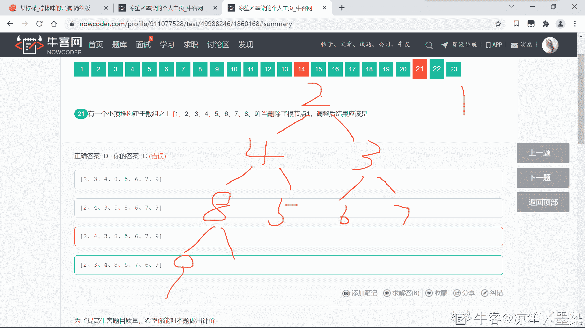
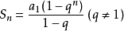

# 二千零二十一、届伴鱼春季校园招聘技术岗 B 卷

## 1

一个由有限个不同元素组成的数组的所有组合排列形式。要求排列的顺序以从小到大的顺序排列，按首列排序，首列相同，则按照第二列排序，前两列相同，则以第三列排序，以此顺序递推。

本题知识点

Java 工程师 C++工程师 PHP 工程师 golang 工程师 前端工程师 安卓工程师 iOS 工程师 算法工程师 大数据开发工程师 信息技术岗 运维工程师 安全工程师 数据分析师 数据库工程师 游戏研发工程师 区块链 测试开发工程师 测试工程师 伴鱼少儿英语 2021

讨论

[木析](https://www.nowcoder.com/profile/4198192)

做的时候一直是 7/8，差一个测试样例过不去，反过来看 WA 掉的样例：array 为[]时，返回的要是[]，不能是[[]]。修改了一下就过了：

```cpp
class Solution {
public:
    /**
     * 代码中的类名、方法名、参数名已经指定，请勿修改，直接返回方法规定的值即可
     *
     * 
     * @param array int 整型 vector 
     * @return int 整型 vector<vector<>>
     */
    void dfs(vector<int>& array, int id, set<vector<int>>& res) {
        if(id==array.size()) {
            res.insert(array);
            return ;
        }
        for(int i=id;i<array.size();++i) {
            int x=array[id];
            array[id]=array[i];
            array[i]=x;
            dfs(array,id+1,res);
            array[i]=array[id];
            array[id]=x;
        }
    }
    vector<vector<int> > exportAllOrders(vector<int>& array) {
        //sort(array.begin(),array.end());
        if(array.size()==0) {
            return vector<vector<int>>{};
        }
        set<vector<int>> s;
        vector<vector<int>> res;
        dfs(array,0,s);
        for(auto iter=s.begin(); iter!=s.end(); ++iter)
            res.push_back(*iter);
        return res;
    }
};
```

发表于 2021-07-05 11:54:14

* * *

[咸鱼哥 666](https://www.nowcoder.com/profile/392462897)

void fun(vector<int> arr, vector<int> se, int n, vector<vector<int>> &res, int num, vector<int> temp){    if (num == 0)    {        res.push_back(temp);    }    for (int i = 0; i < n; i++)    {        if (se[i] == 1) {            continue;        }        else        {            vector<int> t_se = se;            vector<int> temp1=temp;            int tem_num = num;            t_se[i] = 1;            tem_num--;            temp1.push_back(arr[i]);            fun(arr, t_se, n, res, tem_num, temp1);        }    }}vector<vector<int>> exportAllOrders(vector<int> &array){    // write code here    sort(array.begin(), array.end());    int n = array.size();    vector<vector<int>> res;    vector<int> se(n, 0);    vector<int> temp;    fun(array, se, n, res, n, temp);    return res;}//为什么 8 组通过了 7 组，一组不通过，从 leetcode 复制过来的也有一种测试用例不通过？？？？

发表于 2021-07-03 22:08:30

* * *

[tauysi](https://www.nowcoder.com/profile/331833733)

```cpp

```
class Solution {
public:
    /**
     * 代码中的类名、方法名、参数名已经指定，请勿修改，直接返回方法规定的值即可
     *
     * 
     * @param array int 整型 vector 
     * @return int 整型 vector<vector<>>
     */
    vector<vector<int> > exportAllOrders(vector<int>& array) {
        // write code here
        vector<vector<int> > res;
        if (array.size() == 0) return res;
        sort(array.begin(), array.end());
        do {
            res.push_back(array);
        } while (next_permutation(array.begin(), array.end()));
        return res;
    }
};
```cpp

```

发表于 2021-09-25 21:54:46

* * *

## 2

给定一个整数数组 arr，如果它是有效的山脉数组就返回 true，否则返回 false。

如果 A 满足下述条件，那么它是一个山脉数组：

arr.length >= 3

在 0 < i < arr.length - 1 条件下，存在 i 使得：

arr[0] < arr[1] < ... arr[i-1] < arr[i]

arr[i] > arr[i+1] > ... > arr[arr.length - 1]

本题知识点

Java 工程师 C++工程师 PHP 工程师 golang 工程师 前端工程师 安卓工程师 iOS 工程师 算法工程师 大数据开发工程师 信息技术岗 运维工程师 安全工程师 数据分析师 数据库工程师 游戏研发工程师 区块链 测试开发工程师 测试工程师 伴鱼少儿英语 2021

讨论

[SayLiHo](https://www.nowcoder.com/profile/703050916)

[力扣 941：有效的山脉数组](https://leetcode-cn.com/problems/valid-mountain-array/)

```cpp
class Solution {
    public boolean validMountainArray(int[] arr) {
        if(arr.length < 3){
            return false;
        }
        int l = 0,r = arr.length - 1;
        while(l < r - 1 && arr[l] < arr[l + 1]){
            l++;
        }
        while(r > 1 && arr[r] < arr[r - 1]){
            r--;
        }
        return l == r;
    }
}
```

发表于 2021-08-21 14:17:11

* * *

[爱吃苹果的亚当](https://www.nowcoder.com/profile/169029091)

```cpp
public boolean validMountainArray (int[] arr) {
        int maxValue = Arrays.stream(arr).max().getAsInt();
        int index = -1;
        for (int i = 0; i < arr.length; i++) {
            if (maxValue == arr[i]) {
                index = i;
                break;
            }
        }
        boolean flag = true;
        int j = index;
        while (j > 0) {
            if (arr[j] <= arr[--j]) {
                flag = false;
                break;
            }
        }
        j = index;
        while (j < arr.length -  1) {
            if (arr[j] <= arr[++j]) {
                flag = false;
                break;
            }
        }
        return flag;
    }
```

发表于 2021-07-16 10:20:53

* * *

[只想在写出一道题目而已](https://www.nowcoder.com/profile/4970885)

这道题目有点像“主元”的题目，主元就是归并排序的一个节点。左大右小。 
但是“主元”的思想去解答，发现错误好多次了，估计不能使用的点在于数目可能存在值重复问题。
所以这道题目反而很简单。就是一个 if~else 问题

发表于 2021-07-05 14:19:28

* * *

## 3

给定一个不存在重复元素的数组，输出其中所有满足 a + b = c 的三元组 <a, b, c> 个数。

本题知识点

Java 工程师 C++工程师 PHP 工程师 golang 工程师 前端工程师 安卓工程师 iOS 工程师 算法工程师 大数据开发工程师 信息技术岗 运维工程师 安全工程师 数据分析师 数据库工程师 游戏研发工程师 区块链 测试开发工程师 测试工程师 伴鱼少儿英语 2021

讨论

[牛客 142954669 号](https://www.nowcoder.com/profile/142954669)

importjava.util.*;publicclassSolution {    /**     * 代码中的类名、方法名、参数名已经指定，请勿修改，直接返回方法规定的值即可     *     *     * @param arr int 整型一维数组     * @return int 整型     */    publicintNumberOfTriplets (int[] arr) {        // write code here        HashSet<Integer> h = newHashSet<>();        for(inti =0;i<arr.length;i++){            h.add(arr[i]);        }        Arrays.sort(arr);        intcount = 0;        for(intj = 0;j<arr.length;j++){            for(intk =j+1;k<arr.length;k++){                if(arr[j]+arr[k]>arr[arr.length-1])                    break;                if(h.contains(arr[j]+arr[k]))                    count++;            }        }        returncount;    }}

发表于 2021-11-11 14:14:42

* * *

[椿二郎](https://www.nowcoder.com/profile/111164085)

```cpp
int NumberOfTriplets(vector<int>& arr){
    int num=0;
    if(arr.size()<3){
        return num;
    }else{
        for (int i=0; i<arr.size(); i++) {
            for (int j=i+1; j<arr.size(); j++) {
                for (int h=0; h<arr.size(); h++) {
                    if(arr[h]!=arr[i]&&arr[h]!=arr[j]){
                        if (arr[i]+arr[j]==arr[h]) {
                            num++;
                        }
                    }
                }
            }
        }
    }
    return num;
}
```

发表于 2021-10-04 16:23:16

* * *

[闪电利剑](https://www.nowcoder.com/profile/5545047)

```cpp
import java.util.*;

public class Solution {
    /**
     * 代码中的类名、方法名、参数名已经指定，请勿修改，直接返回方法规定的值即可
     *
     * @param arr int 整型一维数组 
     * @return int 整型
     */
    public int NumberOfTriplets (int[] arr) {
        int len = arr.length;
        if (len < 3) {
            return 0;
        }

        Set<Integer> set = new HashSet<>();
        for (int num : arr) {
            set.add(num);
        }
        int ans = 0;
        for (int i = 0; i < len - 1; i++) {
            for (int j = i + 1; j < len; j++) {
                int sum = arr[i] + arr[j];
                if (sum != arr[i] && sum != arr[j] && set.contains(sum)) {
                    ans++;
                }
            }
        }
        return ans;
    }
}
```

发表于 2021-07-11 18:19:06

* * *

## 4

下面关于 tcp/udp 的描述，哪一项是正确的的？

正确答案: B   你的答案: 空 (错误)

```cpp
UDP 是面向连接的
```

```cpp
UDP 传输数据更快
```

```cpp
TCP 不提供可靠服务
```

```cpp
UDP 需要建立连接
```

本题知识点

Java 工程师 C++工程师 PHP 工程师 golang 工程师 前端工程师 安卓工程师 iOS 工程师 算法工程师 大数据开发工程师 信息技术岗 运维工程师 安全工程师 数据分析师 数据库工程师 游戏研发工程师 区块链 测试开发工程师 测试工程师 伴鱼少儿英语 2021

讨论

[牛客 296687740 号](https://www.nowcoder.com/profile/296687740)

BUDP 是无连接的，TCP 是面向连接的，因此，TCP 更可靠。UDP 速度更快

发表于 2021-08-10 11:28:21

* * *

[rowrycho](https://www.nowcoder.com/profile/7017458)

A/D UDP 是无连接的，TCP 才是面向连接的

C TCP 提供可靠服务

发表于 2021-08-10 09:28:14

* * *

## 5

ipv6 协议的 ip 地址占用空间多大？

正确答案: D   你的答案: 空 (错误)

```cpp
8bit
```

```cpp
32bit
```

```cpp
64Bit
```

```cpp
128bit
```

本题知识点

Java 工程师 C++工程师 PHP 工程师 golang 工程师 前端工程师 安卓工程师 iOS 工程师 算法工程师 大数据开发工程师 信息技术岗 运维工程师 安全工程师 数据分析师 数据库工程师 游戏研发工程师 区块链 测试开发工程师 测试工程师 伴鱼少儿英语 2021

讨论

[rowrycho](https://www.nowcoder.com/profile/7017458)

IPv6 的地址长度为 128b，是 IPv4 地址长度的 4 倍，IPv4 的地址长度为 32b（b=bit，B=Byte）

发表于 2021-08-10 09:29:36

* * *

## 6

下面哪一个协议不属于网络层？

正确答案: A   你的答案: 空 (错误)

```cpp
PPP
```

```cpp
IP
```

```cpp
IPX
```

```cpp
RIP
```

本题知识点

Java 工程师 C++工程师 PHP 工程师 golang 工程师 前端工程师 安卓工程师 iOS 工程师 算法工程师 大数据开发工程师 信息技术岗 运维工程师 安全工程师 数据分析师 数据库工程师 游戏研发工程师 区块链 测试开发工程师 测试工程师 伴鱼少儿英语 2021

讨论

[rowrycho](https://www.nowcoder.com/profile/7017458)

RIP(Routing Information Protocol,路由信息协议） 属于网络层

IP、IPX 都属于网络层

PPP 点对点协议（Point to Point Protocol，PPP）属于数据链路层

网络层常见协议：ARP、IP（v4 v6）、ICMP、RIP、OSPF

发表于 2021-08-10 09:55:14

* * *

[༒࿈智止༒࿈](https://www.nowcoder.com/profile/483281688)

ppp 协议是链路层的协议，用来封装帧的协议。

发表于 2021-07-07 12:55:42

* * *

## 7

http 响应状态码位于响应体的哪个位置？

正确答案: A   你的答案: 空 (错误)

```cpp
状态行
```

```cpp
响应头
```

```cpp
响应正文
```

```cpp
状态描述
```

本题知识点

Java 工程师 C++工程师 PHP 工程师 golang 工程师 前端工程师 安卓工程师 iOS 工程师 算法工程师 大数据开发工程师 信息技术岗 运维工程师 安全工程师 数据分析师 数据库工程师 游戏研发工程师 区块链 测试开发工程师 测试工程师 伴鱼少儿英语 2021

讨论

[重湖叠巘清嘉](https://www.nowcoder.com/profile/637956038)

HTTP 响应报文由三部分组成，
响应行：由报文协议及版本、状态码及描述组成。
响应头：和请求头一样，由属性组成。
响应体：是服务器返回给客户端的文本信息。

发表于 2021-07-19 15:54:20

* * *

## 8

设某算法的时间复杂度函数的递推方程是 T(n) = T(n - 1) + n（n 为正整数）及 T(0) = 1，则该算法的时间复杂度为

正确答案: D   你的答案: 空 (错误)

```cpp
O(log n)
```

```cpp
O(n log n)
```

```cpp
O(n)
```

```cpp
O(n2)
```

本题知识点

Java 工程师 C++工程师 PHP 工程师 golang 工程师 前端工程师 安卓工程师 iOS 工程师 算法工程师 大数据开发工程师 信息技术岗 运维工程师 安全工程师 数据分析师 数据库工程师 游戏研发工程师 区块链 测试开发工程师 测试工程师 伴鱼少儿英语 2021

讨论

[JoE201902131531317](https://www.nowcoder.com/profile/818084383)

T(n) = T(n - 1) + nT(n) = (T(n - 2) + n-1) + nT(n) = T(n - 3) + n-2 + n-1 + n ...T(n) = T(n - k) + (n-k+1) + (n-k+2) + ... + n 等差数列求和= O(n²)

发表于 2021-08-02 16:58:54

* * *

## 9

给定一个数组 s 其长度为 l, 另有一个数组 dp dp[i]表示 以 i 元素为结尾的最长上升子数组的数组长度，则下列选项中对求得数组 dp 方法正确的是

正确答案: A   你的答案: 空 (错误)

```cpp
for (int i = 1; i < nums.length; i++) {dp[i] = 1;for (int j = 0; j < i; j++) { if (nums[i] > nums[j]) {dp[i] = Math.max(dp[i], dp[j] + 1);}}}
```

```cpp
for (int i = 1; i < nums.length; i++) {dp[i] = 0;for (int j = 0; j < i; j++) {if (nums[i] > nums[j]) {dp[i] = Math.max(dp[i], dp[j] + 1);}}}
```

```cpp
for (int i = 1; i < nums.length; i++) {dp[i] = 1;for (int j = 0; j < i; j++) {if (nums[i] > nums[j]) {dp[i] = Math.max(dp[i], dp[j])+1;}}}
```

```cpp
 for (int i = 1; i < nums.length; i++) {dp[i] = 0;for (int j = 0; j < i; j++) {if (nums[i] > nums[j]) {dp[i] = Math.max(dp[i], dp[j])+1;}}}
```

本题知识点

Java 工程师 C++工程师 PHP 工程师 golang 工程师 前端工程师 安卓工程师 iOS 工程师 算法工程师 大数据开发工程师 信息技术岗 运维工程师 安全工程师 数据分析师 数据库工程师 游戏研发工程师 区块链 测试开发工程师 测试工程师 伴鱼少儿英语 2021

## 10

设图 G=(V，E)的顶点集为 v={a，b，c，d}，边集为 E={,,**}若从顶点 a 开始对图进行 DFS 遍历，则可能得到的不同遍历序列的个数是**

正确答案: A   你的答案: 空 (错误)

```cpp
4
```

```cpp
1
```

```cpp
5
```

```cpp
7
```  本题知识点 Java 工程师 C++工程师 PHP 工程师 golang 工程师 前端工程师 安卓工程师 iOS 工程师 算法工程师 大数据开发工程师 信息技术岗 运维工程师 安全工程师 数据分析师 数据库工程师 游戏研发工程师 区块链 测试开发工程师 测试工程师 伴鱼少儿英语 2021

讨论

[牛客 315721145 号](https://www.nowcoder.com/profile/315721145)

DFS（深度优先遍历），每次都沿着路径到不能再进时，才退回到最近的岔路口，沿着一条路径直到无法继续前进，才退回到路径上离当前顶点最近的并且还未被访问的边上，并前往那些未被访问的分支顶点。也就是说 DFS 会把所有顶点都遍历，这题一共四个顶点，那个数就是 4

发表于 2021-08-30 20:44:33

* * *

## 11

某数列有 1000 个各不相同的单元，由低至高按序排列；现要对该数列进行二分法检索（binary-search），在最坏的情况下，需检视（ ）个单元

正确答案: B   你的答案: 空 (错误)

```cpp
100
```

```cpp
10
```

```cpp
1000
```

```cpp
5000
```

本题知识点

Java 工程师 C++工程师 PHP 工程师 golang 工程师 前端工程师 安卓工程师 iOS 工程师 算法工程师 大数据开发工程师 信息技术岗 运维工程师 安全工程师 数据分析师 数据库工程师 游戏研发工程师 区块链 测试开发工程师 测试工程师 伴鱼少儿英语 2021

讨论

[rowrycho](https://www.nowcoder.com/profile/7017458)

二分查找 最少比较 1 次 最多比较 (int)logn+1 次

发表于 2021-08-10 10:23:08

* * *

## 12

设有一个递归程序如下：int f(int n){if(n<=0) return 1;else return n*f(n-1);} 则计算 f(n)则需要调用该函数的次数为（ ）

正确答案: B   你的答案: 空 (错误)

```cpp
n
```

```cpp
n +1
```

```cpp
n + 2
```

```cpp
n -1
```

本题知识点

Java 工程师 C++工程师 PHP 工程师 golang 工程师 前端工程师 安卓工程师 iOS 工程师 算法工程师 大数据开发工程师 信息技术岗 运维工程师 安全工程师 数据分析师 数据库工程师 游戏研发工程师 区块链 测试开发工程师 测试工程师 伴鱼少儿英语 2021

讨论

[rowrycho](https://www.nowcoder.com/profile/7017458)

n 调用次数

0 1 直接 return

1 2 f(1) f(0)

2 3 f(2) f(1) f(0)

...

发表于 2021-08-10 10:26:46

* * *

[]☆~放弃爱❤](https://www.nowcoder.com/profile/6957431)

当参数为 n 的时候调用一次，n 在减去 1 后又被调用一次,以此类推当 n=1 时总共调用了 n 次，在 n=1 再减 1 时有调用了 f(0)又算一次，因为此刻跳出递归，最后一共调用了 n+1 次。这种情况有点像锯木头，调用次数就像是锯的段数，锯的次数就像是在 n-1，锯木头的结果也是锯 n 次获得 n+1 段木头，这里递归了 n 次调用了 n+1 次方法。

发表于 2021-07-08 17:19:29

* * *

## 13

设五个进程共享一个互斥代码段，如果最多允许两个进程同时进入互斥段，那么信号量最小值为()

正确答案: C   你的答案: 空 (错误)

```cpp
2
```

```cpp
0
```

```cpp
-3
```

```cpp
-5
```

本题知识点

Java 工程师 C++工程师 PHP 工程师 golang 工程师 前端工程师 安卓工程师 iOS 工程师 算法工程师 大数据开发工程师 信息技术岗 运维工程师 安全工程师 数据分析师 数据库工程师 游戏研发工程师 区块链 测试开发工程师 测试工程师 伴鱼少儿英语 2021

讨论

[rowrycho](https://www.nowcoder.com/profile/7017458)

当有两个进程进入互斥段之后，第 3 个进程想要进入时,再执行 P 操作如果此时 P 操作的信号量+进程数<0 时，会造成堵塞，所以信号量最小是-3

在有 n 个进程共享一个互斥段，如果最多允许 m 个进程 (m<n) 同时进入互斥段，则信号量的变化范围是 -(n-m)到 m

(其实很好理解 就是有 5 个需要资源的，现在最多只有 2 个，那么“许可证（信号量）”最多是+2，如果都借，那么最少就是-3，可以理解为打了欠条，等有空的就给欠条的)

发表于 2021-08-10 10:31:37

* * *

[]☆~放弃爱❤](https://www.nowcoder.com/profile/6957431)

当有两个进程进入互斥段之后，第 3 个进程想要进入时,再执行 P 操作如果此时 P 操作的信号量+进程数<0 时，会造成堵塞，所以信号量最小是-3

发表于 2021-07-08 17:35:49

* * *

## 14

以下关于经典调度算法的说法中, 错误的是()

正确答案: D   你的答案: 空 (错误)

```cpp
先来先服务算法, 有利于 CPU 密集型作业, 不利于 IO 密集型作业
```

```cpp
时间片轮转算法, 有利于 cpu 密集型作业, 不利于 io 密集型作业
```

```cpp
短任务优先算法, 可能导致一些作业一直得不到 cpu 资源
```

```cpp
优先级调度算法, 可能导致一些作业一直得不到 cpu 资源
```

本题知识点

Java 工程师 C++工程师 PHP 工程师 golang 工程师 前端工程师 安卓工程师 iOS 工程师 算法工程师 大数据开发工程师 信息技术岗 运维工程师 安全工程师 数据分析师 数据库工程师 游戏研发工程师 区块链 测试开发工程师 测试工程师 伴鱼少儿英语 2021

讨论

[天川透流](https://www.nowcoder.com/profile/895137959)

优先级调度算法和多级反馈队列调度算法不是两种不同的算法吗。。？感觉优先级调度算法也会产生饥饿现象。还有时间片轮转调度算法为什么不适合 IO 密集型作业呀，求大佬解答😥  

发表于 2021-08-03 10:51:59

* * *

[牛客 391127016 号](https://www.nowcoder.com/profile/391127016)

这道题 B 难道不会吗

发表于 2021-08-23 12:59:05

* * *

## 15

假定某个文件由长度为 100 个字符的 100 个逻辑记录组成，磁盘存储空间被划分成长度为 2048 个字符的块，则该文件至少占用的磁盘存储块数量为()

正确答案: C   你的答案: 空 (错误)

```cpp
3
```

```cpp
4
```

```cpp
5
```

```cpp
6
```

本题知识点

Java 工程师 C++工程师 PHP 工程师 golang 工程师 前端工程师 安卓工程师 iOS 工程师 算法工程师 大数据开发工程师 信息技术岗 运维工程师 安全工程师 数据分析师 数据库工程师 游戏研发工程师 区块链 测试开发工程师 测试工程师 伴鱼少儿英语 2021

讨论

[邢玉](https://www.nowcoder.com/profile/408499885)

文件一共 100*100=10000 字节长，10000/2018=4.8，约为 5 块

发表于 2021-09-25 13:50:03

* * *

[牛客 884272626 号](https://www.nowcoder.com/profile/884272626)

2048/ 100 = 20,100/20 = 5

发表于 2021-07-15 10:59:40

* * *

## 16

表 person(id int,uid int,time date)涉及以下 3 条 sql：(1)select * from person where id=1 and uid=1;(2) select * from person where uid=1; (3) select * from person where uid=1 order by time desc; 只建一个索引时，如何建最优()

正确答案: D   你的答案: 空 (错误)

```cpp
idx1(id,uid)
```

```cpp
idx2(uid,id)
```

```cpp
idx3(id,uid,time)
```

```cpp
idx4(uid,time)
```

本题知识点

Java 工程师 C++工程师 PHP 工程师 golang 工程师 前端工程师 安卓工程师 iOS 工程师 算法工程师 大数据开发工程师 信息技术岗 运维工程师 安全工程师 数据分析师 数据库工程师 游戏研发工程师 区块链 测试开发工程师 测试工程师 伴鱼少儿英语 2021

讨论

[橘子 _fayC](https://www.nowcoder.com/profile/911254703)

是不是因为 id 是主键本来就有索引就可以了

发表于 2022-03-17 14:42:33

* * *

[Wu 培培](https://www.nowcoder.com/profile/485577749)

详情请看数据库的索引构成原理

发表于 2021-08-22 00:06:06

* * *

## 17

关于数据库的事务, 下面描述错误的是()

正确答案: B   你的答案: 空 (错误)

```cpp
一个数据库事务可以包含多个查询 修改 删除 插入等数据库动作, 它们要么作为一个整体完全得到确认, 要么完全失败
```

```cpp
下面的数据库动作"uidegin transaction; insert into employee values(1, 'Cardinal'); commit; rolluidack;"最终插入的数据会被取消, 不会记录到数据库中
```

```cpp
一个事务只能包含对一个数据库实例的数据操作, 不允许跨多个数据库实例, 跨多个数据库实例需要分布式事务支持
```

```cpp
数据库事务会给数据库带来并发操作带来一定影响, 会降低系统的并发能力
```

本题知识点

Java 工程师 C++工程师 PHP 工程师 golang 工程师 前端工程师 安卓工程师 iOS 工程师 算法工程师 大数据开发工程师 信息技术岗 运维工程师 安全工程师 数据分析师 数据库工程师 游戏研发工程师 区块链 测试开发工程师 测试工程师 伴鱼少儿英语 2021

讨论

[牛客 884272626 号](https://www.nowcoder.com/profile/884272626)

B 事务提交后就不能回滚了

发表于 2021-07-15 10:56:06

* * *

[牛客 319156318 号](https://www.nowcoder.com/profile/319156318)

数据库回滚只能对修改、删除操作回滚

发表于 2021-11-13 21:02:01

* * *

## 18

给定一棵由数字组成的二叉树，它的前序遍历结果为：12、5、2、9、18、15、17、19 它的中序遍历结果为：2、5、9、12、15、17、18、19，它 ____ 一个二叉排序树(二叉搜索树)，它 ___ 一个完全二叉树，它 ____ 一个平衡二叉树

正确答案: C   你的答案: 空 (错误)

```cpp
是，是，是
```

```cpp
不是，是，是
```

```cpp
是，不是，是
```

```cpp
是，不是，不是
```

本题知识点

Java 工程师 C++工程师 PHP 工程师 golang 工程师 前端工程师 安卓工程师 iOS 工程师 算法工程师 大数据开发工程师 信息技术岗 运维工程师 安全工程师 数据分析师 数据库工程师 游戏研发工程师 区块链 测试开发工程师 测试工程师 伴鱼少儿英语 2021

## 19

现有一个栈 S，给定一组数据入栈顺序(A、B、C、D、E、F)，以下给出的出栈顺序中不合法的是

正确答案: D   你的答案: 空 (错误)

```cpp
(A、B、C、D、E、F)
```

```cpp
(F、E、D、C、B、A)
```

```cpp
(D、C、B、E、F、A)
```

```cpp
(F、E、A、B、C、D)
```

本题知识点

Java 工程师 C++工程师 PHP 工程师 golang 工程师 前端工程师 安卓工程师 iOS 工程师 算法工程师 大数据开发工程师 信息技术岗 运维工程师 安全工程师 数据分析师 数据库工程师 游戏研发工程师 区块链 测试开发工程师 测试工程师 伴鱼少儿英语 2021

讨论

[SX_ 呼吸](https://www.nowcoder.com/profile/376572996)

A 选项，随进随出 C 选项，ABCD 进，DCB 出，E 进 E 出，F 进 F 出，A 出

发表于 2021-10-26 19:05:45

* * *

[你又因何所困](https://www.nowcoder.com/profile/437177049)

栈是先进后出原则，所以 FE 后不可能是 A，可以想象成栈只有一个栈顶，另一侧是墙壁

发表于 2021-08-15 22:02:57

* * *

## 20

给定一个长度为 17 的 hash 表(0~16)，其对应的 hash 函数是：H(key) = key % 17，使用线性探查法(开地址法)解决冲突。已(24、42、26、59、41)顺序插入，则 41 会插入 0-16 哪个位置中

正确答案: A   你的答案: 空 (错误)

```cpp
11
```

```cpp
10
```

```cpp
9
```

```cpp
8
```

本题知识点

Java 工程师 C++工程师 PHP 工程师 golang 工程师 前端工程师 安卓工程师 iOS 工程师 算法工程师 大数据开发工程师 信息技术岗 运维工程师 安全工程师 数据分析师 数据库工程师 游戏研发工程师 区块链 测试开发工程师 测试工程师 伴鱼少儿英语 2021

讨论

[牛客 884272626 号](https://www.nowcoder.com/profile/884272626)

取余为 7 但是由于线性探查法(开地址法)解决冲突，一直到了 11 才没有冲突

发表于 2021-07-15 10:57:43

* * *

## 21

有一个小顶堆构建于数组之上 [1、2、3、4、5、6、7、8、9] 当删除了根节点 1，调整后结果应该是

正确答案: D   你的答案: 空 (错误)

```cpp
[2、3、4、8、5、6、7、9]
```

```cpp
[2、4、3、5、8、6、7、9]
```

```cpp
[2、4、3、8、5、6、7、9]
```

```cpp
[2、3、4、8、5、7、6、9]
```

本题知识点

Java 工程师 C++工程师 PHP 工程师 golang 工程师 前端工程师 安卓工程师 iOS 工程师 算法工程师 大数据开发工程师 信息技术岗 运维工程师 安全工程师 数据分析师 数据库工程师 游戏研发工程师 区块链 测试开发工程师 测试工程师 伴鱼少儿英语 2021

讨论

[当个小知青](https://www.nowcoder.com/profile/457391249)

为啥我感觉是 C

发表于 2021-07-05 10:57:34

* * *

[凉笙〆墨染](https://www.nowcoder.com/profile/911077528)

一直都是在左侧进行堆的下沉操作不可能是 D 的

发表于 2021-11-14 10:31:56

* * *

[秋风懂吗](https://www.nowcoder.com/profile/173231137)

3 自始至终都没有机会调整  不可能选 AD  应该就是 C

发表于 2021-10-16 03:19:55

* * *

## 22

给定一颗深度为 h 的满 k 叉树(k > 1)，设根节点深度为 1，则该树的节点总数为

正确答案: A   你的答案: 空 (错误)

```cpp
(k^h-1)/(k-1)
```

```cpp
k^h
```

```cpp
k^(h-1)
```

```cpp
(k^(h-1))/(k-1)
```

本题知识点

Java 工程师 C++工程师 PHP 工程师 golang 工程师 前端工程师 安卓工程师 iOS 工程师 算法工程师 大数据开发工程师 信息技术岗 运维工程师 安全工程师 数据分析师 数据库工程师 游戏研发工程师 区块链 测试开发工程师 测试工程师 伴鱼少儿英语 2021

讨论

[]☆~放弃爱❤](https://www.nowcoder.com/profile/6957431)

根据题目可得当根结点深度为 1 时，第一层满 k 叉树结点是 1，简写为：第一层：1 第二层结点数是第一层的 k 倍简写为：第二层：k 第三层结点数是第二层的 k 倍简写为：第三层：k*k 根据满 k 叉树这个特点可得第 h 层的结点数是第 h-1 层的 k 倍所以第 h 层节点数简写为：第 h 层：k^(h-1)最终可以的得到 h 层满 k 叉树的结点总数是 1+k+k²+k³+……+k^(h-1),根据等比数列前 n 项和公式可得 S(h) = 1*(1-k^h)/(1-k) 整理得到 A 选项

编辑于 2021-07-07 18:14:44

* * *

[牛客 879485554 号](https://www.nowcoder.com/profile/879485554)

等比数列求和，公比为 K，项数为 h，所以选 A

发表于 2021-07-11 14:34:14

* * *

## 23

线性表的实现方式中，链式存储比顺序存储的优势在于

正确答案: C   你的答案: 空 (错误)

```cpp
随机存取速度更快
```

```cpp
花费空间小于顺序存储所花费的空间
```

```cpp
便于进行插入删除操作
```

```cpp
物理空间与逻辑空间顺序相同
```

本题知识点

Java 工程师 C++工程师 PHP 工程师 golang 工程师 前端工程师 安卓工程师 iOS 工程师 算法工程师 大数据开发工程师 信息技术岗 运维工程师 安全工程师 数据分析师 数据库工程师 游戏研发工程师 区块链 测试开发工程师 测试工程师 伴鱼少儿英语 2021