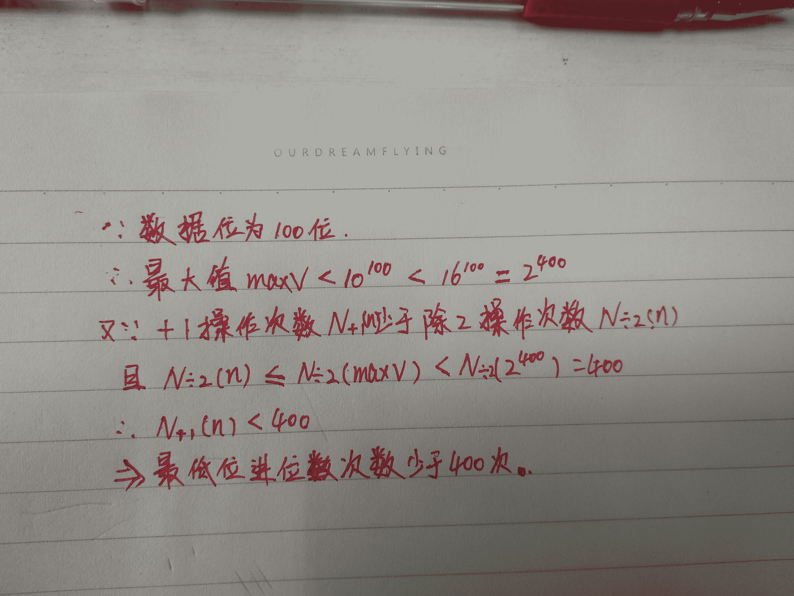

# 【2020】牛客模考（四模）编程题集合

## 1

牛牛的快递到了，他迫不及待地想去取快递，但是天气太热了，以至于牛牛不想在烈日下多走一步。他找来了你，请你帮他规划一下，他最少要走多少距离才能取回快递。

本题知识点

Java 工程师 C++工程师 PHP 工程师 golang 工程师 前端工程师 安卓工程师 iOS 工程师 算法工程师 大数据开发工程师 信息技术岗 运维工程师 安全工程师 数据分析师 数据库工程师 游戏研发工程师 区块链 测试开发工程师 测试工程师 牛客 2019 2020

讨论

[黑莓婆婆](https://www.nowcoder.com/profile/3333483)

Dijkstra 算法

```cpp
#include<bits/stdc++.h>
using namespace std;

struct E {
    int v;
    int d;
    E(int _v, int _d): v(_v), d(_d) {}
    bool operator < (const E& T) const {
        return d > T.d;
    }
};

int n;
vector<vector<E> > G;  // 存储每个结点的每条边

int calc(int s, int t) {
    // 计算从 s 到 t 的最短距离
    // Dijkstra 算法
    vector<bool> visited(n + 1);
    priority_queue<E> Q;
    Q.push(E(s, 0));
    while (!Q.empty()) {
        int u = Q.top().v;
        int d = Q.top().d;
        Q.pop();
        if (u == t) return d;
        if (visited[u]) continue;
        visited[u] = true;
        for (auto& tmp : G[u]) {
            if (visited[tmp.v]) continue;
            Q.push(E(tmp.v, d + tmp.d));
        }
    }
    return 0;
}

int main() {
    int m, s, t;
    cin >> n >> m >> s >> t;
    G.resize(n + 1);
    for (int i = 0; i < m; i++) {
        int u, v, d;
        cin >> u >> v >> d;
        G[u].push_back(E(v, d));
    }
    cout << calc(s, t) + calc(t, s) << endl;
    return 0;
}
```

发表于 2021-08-10 20:55:02

* * *

[咸鱼哥 666](https://www.nowcoder.com/profile/392462897)

```cpp
#include<bits/stdc++.h>
using namespace std;
struct Edge{
    int to;
    int distance;
};

int spfa(int src, int des,vector<vector<Edge>>&graph,int N){
    vector<bool> visited(N+1,false);
    vector<int> dis(N+1,INT_MAX);
    dis[src]=0;
    queue<int> myque;
    myque.push(src);
    visited[src]=true;// 在队列中的节点
    while(!myque.empty()){
        int temp =myque.front();
        myque.pop();
        visited[temp]=false;
        for(auto node=graph[temp].begin();node!=graph[temp].end();node++){
            int to = node->to;
            if(dis[to]>dis[temp]+node->distance){
                dis[to]=dis[temp]+node->distance;
                if(!visited[to]){
                    visited[to]=true;
                    myque.push(to);
                }
            }
        }
    }
    return dis[des];
}
int main()
{
    int N,M,S,T;
    cin>>N>>M>>S>>T;
    vector<vector<Edge>> graph(N + 1);// 看一维数组的解法有点难受，可以用 vector 解
    //为什么用一维数组
    int i=1;
    for(int i = 0; i < M; i++) {
        int from, to, distance;
        cin >> from >> to >> distance;
        graph[from].push_back({to,distance});
    }
    cout<<spfa(S,T,graph,N)+spfa(T,S,graph,N)<<endl;
    return 0;
}
```

发表于 2021-08-08 17:55:29

* * *

[123201904111607339](https://www.nowcoder.com/profile/830552638)

1

发表于 2021-07-28 11:54:45

* * *

## 2

最近天气太热了，牛牛每天都要吃雪糕。雪糕有一盒一份、一盒两份、一盒三份这三种包装，牛牛一天可以吃多盒雪糕，但是只能吃六份，吃多了就会肚子疼，吃少了就会中暑。而且贪吃的牛牛一旦打开一盒雪糕，就一定会把它吃完。请问牛牛能健康地度过这段高温期么？

本题知识点

Java 工程师 C++工程师 iOS 工程师 安卓工程师 运维工程师 前端工程师 算法工程师 PHP 工程师 模拟 穷举 数组 贪心 golang 工程师 测试工程师 2018 牛客 大数据开发工程师 信息技术岗 安全工程师 数据分析师 数据库工程师 游戏研发工程师 区块链 测试开发工程师 2019 2020

讨论

[刘东荣](https://www.nowcoder.com/profile/8648630)

> 多一个的情况下特判就可以了

```cpp
import java.util.Scanner;

public class Main {
    public static void main(String[] args) {
        Scanner scanner = new Scanner(System.in);
        int T = scanner.nextInt();
        while (T-- != 0) {
            int s = scanner.nextInt();
            int one = scanner.nextInt();
            int two = scanner.nextInt();
            int three = scanner.nextInt();
            boolean res = getResult(s, one, two, three);
            System.out.println(res ? "Yes" : "No");
        }
    }

    private static boolean getResult(int s, int one, int two, int three) {
        int sum = one + two * 2 + three * 3;
        s *= 6;
        if (sum < s) return false;
        if (sum - s == 1) {
            return one >= 1;
        }
        return true;
    }
}
```

编辑于 2019-02-21 17:56:38

* * *

[唉梅子](https://www.nowcoder.com/profile/637548027)

```cpp
#include <iostream>
#include <vector>
using namespace std;
bool fun(int n,int a,int b,int c){
    if(a + 2 * b + 3 * c < n)
        return false;
    n -= c / 2;
    n -= b / 3;
    b %= 3;
    c %= 2;
    if(n <= 0)
        return true;
    if(n * 6 - b * 2 - c * 3 > 0 && n * 6 - b * 2 - c * 3 <= a)
        return true;
    else
        return false;
}
int main(){
    int t;
    cin >> t;
    for(int i = 0;i < t;i++){
        int n,a,b,c;
        cin >> n >> a >> b >> c;
        bool flag = fun(n,a,b,c);
        if(flag)
            cout << "Yes" << endl;
        else
            cout << "No" << endl;
    }
    return 0;
}
</vector></iostream>
```

发表于 2019-07-23 22:17:24

* * *

[zevyu](https://www.nowcoder.com/profile/2361451)

```cpp

	#include <iostream>

	#include <vector>

	using namespace std;

	int main()

	{

	int T,N,A,B,C;

	cin>>T;

	for(int i=0;i<T;i++)

	{

	cin>>N>>A>>B>>C;

	N=N-B/3-C/2;

	B%=3;

	C%=2;

	if(N<=0)cout<<"Yes"<<endl;

	else if((A+B*2+3*C<6*N)||((A+B*2+3*C>=6*N)&&(A==0)))cout<<"No"<<endl;

	else cout<<"Yes"<<endl;

	}

	return 0;

	}

```

编辑于 2018-05-28 20:42:55

* * *

## 3

牛牛在地上捡到了一个手套，他带上手套发现眼前出现了很多个小人，当他打一下响指，这些小人的数量就会发生以下变化：如果小人原本的数量是偶数那么数量就会变成一半，如果小人原本的数量是奇数那么数量就会加一。现在牛牛想考考你，他要打多少次响指，才能让小人的数量变成 1。

本题知识点

Java 工程师 C++工程师 前端工程师 算法工程师 PHP 工程师 golang 工程师 iOS 工程师 安卓工程师 运维工程师 测试工程师 2018 牛客 大数据开发工程师 信息技术岗 安全工程师 数据分析师 数据库工程师 游戏研发工程师 区块链 测试开发工程师 2019 2020

讨论

[biamgo](https://www.nowcoder.com/profile/809426)

```cpp
n = input()
s = bin(n)[2:]
ans = len(s) - 1 + s.strip("0").count("0")
if s.count("1") > 1:
    ans += 2
print ans

```

编辑于 2018-08-02 20:07:54

* * *

[zevyu](https://www.nowcoder.com/profile/2361451)

#include <iostream>#include<vector>

using namespace std;
int main()
{
uint32_t N[128] = { 0 };
char temp;
int begin = 0, end = 0, res = 0;
while (scanf("%c", &temp))
{
if (temp == '\n')
break;
N[end] = temp - '0';
end++;
}
while (!(begin == end - 1 && N[end - 1] == 1))
{
if (N[end - 1] & 1)
{
N[end - 1]++;
res++;
}
int flag = 0, tempV = 0;
res++;
for (int i = begin; i < end; i++)
{
tempV = N[i] + flag * 10;
flag = tempV & 1;
N[i] = tempV >> 1;
}
if (N[begin] == 0)begin++;
}
cout << res;
return 0;
}关于+1 进位时只在最低位进位，下图大致计算了进位次数，可以保证最低位不会溢出。

编辑于 2018-06-25 09:19:03

* * *

[为啥要起名字](https://www.nowcoder.com/profile/1833472)

while True:
    try:
        num=int(raw_input().strip())
        if num==1:
            print(0)
        else:
            count=0
            while True:
                if num%2==0:
                    num=num//2
                    count+=1
                else:
                    num+=1
                    count+=1
                if num==1:
                    break
            print(count)
    except:
        break

发表于 2018-05-28 09:39:39

* * *

## 4

小牛牛为了向他的父母表现他已经长大独立了,他决定搬出去自己居住一段时间。

一个人生活增加了许多花费: 牛牛每天必须吃一个水果并且需要每天支付 x 元的房屋租金。

当前牛牛手中已经有 f 个水果和 d 元钱,牛牛也能去商店购买一些水果,商店每个水果售卖 p 元。

牛牛为了表现他独立生活的能力,希望能独立生活的时间越长越好,牛牛希望你来帮他计算一下他最多能独立生活多少天。

本题知识点

Java 工程师 C++工程师 PHP 工程师 golang 工程师 前端工程师 安卓工程师 iOS 工程师 算法工程师 大数据开发工程师 信息技术岗 运维工程师 安全工程师 数据分析师 数据库工程师 游戏研发工程师 区块链 测试开发工程师 测试工程师 牛客 2019 2020

讨论

[196514583](https://www.nowcoder.com/profile/196514583)

```cpp
import java.util.*;
public class Main{
    public static void main(String args[]){
        Scanner in = new Scanner(System.in);
        int x = in.nextInt();
        int f = in.nextInt();
        int d = in.nextInt();
        int p = in.nextInt();
        int res = d >= x*f? f+(d-x*f)/(x+p) : d/x;
        System.out.print(res);
    }
}
```

发表于 2021-09-10 16:27:31

* * *

[唉梅子](https://www.nowcoder.com/profile/637548027)

```cpp
#include <iostream>
using namespace std;
int main(){
    long long x,f,d,p;
    while(cin >> x >> f >> d >> p){
        //int t = f + (d - 3 * f) / (x + p);
        long long t;
        if(f * x > d){
            t = d / x ;

        }
        else if(d >= f * x){
            t = f + (d - x * f) / (x + p);

        }
        cout << t;
    }
    return 0;
}
```

发表于 2019-07-24 19:30:34

* * *

[真情实感想要变强](https://www.nowcoder.com/profile/1283765)

import java.util.Scanner;
public class Main {
public static void main(String[] args) {
Scanner in = new Scanner(System.in);
    while(in.hasNext()){
    int x = in.nextInt();
    int f = in.nextInt();
    int d = in.nextInt();
    int p = in.nextInt();
        //先满足房租再考虑水果，而且付得起的房租数就等于最大的天数
        int days = d/x;
        if(days<=f) {
            System.out.println(days);
        }else{
        d -= x*f;//减去现有水果天数剩余的钱
        days= f + d/(x+p);//现有水果天+钱除以每日（房租+水果）
        System.out.println(days);
        }
}
}
}

发表于 2019-03-01 18:34:45

* * *

## 5

牛牛得知了一些股票今天买入的价格和明天卖出的价格，他找犇犇老师借了一笔钱，现在他想知道他最多能赚多少钱。

本题知识点

Java 工程师 C++工程师 PHP 工程师 golang 工程师 前端工程师 安卓工程师 iOS 工程师 算法工程师 大数据开发工程师 信息技术岗 运维工程师 安全工程师 数据分析师 数据库工程师 游戏研发工程师 区块链 测试开发工程师 测试工程师 牛客 2019 2020

讨论

[黑莓婆婆](https://www.nowcoder.com/profile/3333483)

背包

```cpp
#include<bits/stdc++.h>
using namespace std;

int main() {
    int N, M;
    cin >> N >> M;
    vector<int> dp(M + 1);  // dp[i] 表示投资 i 元最多赚多少钱
    while (N--) {
        int X, Y, d;
        cin >> X >> Y;
        d = Y - X;
        if (d <= 0) continue;
        for (int i = X; i <= M; i++) {
            dp[i] = max(dp[i], dp[i - X] + d);
        }
    }
    cout << dp[M] << endl;
    return 0;
}
```

发表于 2021-08-10 20:54:09

* * *

[找个工作也太难了](https://www.nowcoder.com/profile/312726511)

这道题的测试用例是不是有问题啊，读入股票信息的时候出现了异常

编辑于 2021-08-13 16:28:20

* * *

[牛客 414045068 号](https://www.nowcoder.com/profile/414045068)

#include <stdio.h>#include <iostream>
#include <vector>
using namespace std;

int find(vector<int> num, int mm)
{
    for(int i=0;i<num.size();i++)
    {
        if(mm>num[i])
        {
            return i;
        }
    }
    return -1;
}

int main() {
    int a,b;
    int N,M;
    int n=1;
    vector<int> today;
    vector<int> nextday;
    while(scanf("%d %d",&a, &b) != EOF)
    {
        if(n==1)
        {
            N=a;
            M=b;
        }
        else{
            today.push_back(a);
            nextday.push_back(b);
        }
        n++;
    }

    int tvar;
    for (int i = 0; i<today.size()-1; i++)
        for (int j = i + 1; j<today.size(); j++)
        {
            float n1=nextday[j]/float(today[j]);
            float n2=nextday[i]/float(today[i]);
            if ( n1> n2)
            {
                tvar = today[j];
                today[j] = today[i];
                today[i] = tvar;

                tvar = nextday[j];
                nextday[j] = nextday[i];
                nextday[i] = tvar;
            }
        }
    if((nextday[0]/float(today[0]))<1)
    {
        printf("%d",0);
    }
    else
    {
    int min=today[0];
    for (int i = 0; i<today.size(); i++)
    {
        if(today[i]<min)
            min=today[i];
    }

    vector<int> xuhao;
    vector<int> gounum;

    for(int i=0;M>=min;i++)
    {
        if(M>=today[i])
        {
            int qq=M/today[i];
            M=M%today[i];
            xuhao.push_back(i);
            gounum.push_back(qq);
        }
    }
    int shouyi=0;
    for(int i=0;i<xuhao.size();i++)
    {
        int list=xuhao[i];
        shouyi+=(nextday[list]-today[list])*gounum[i];
    }
    printf("%d",shouyi);
    }
    return 0;
}

发表于 2021-07-27 20:53:34

* * *</stdio.h></iostream>