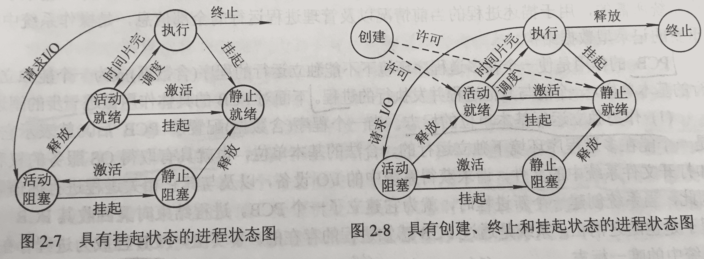
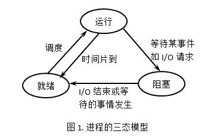
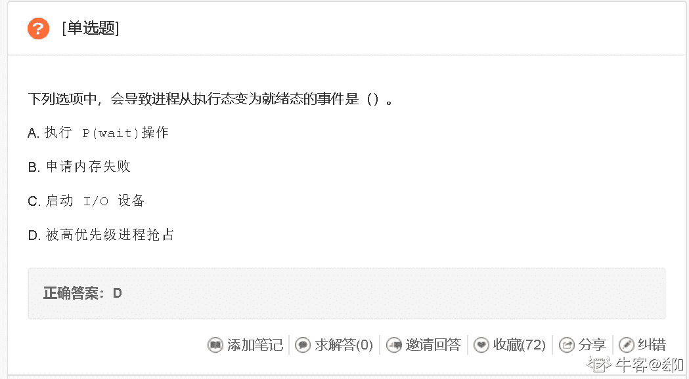
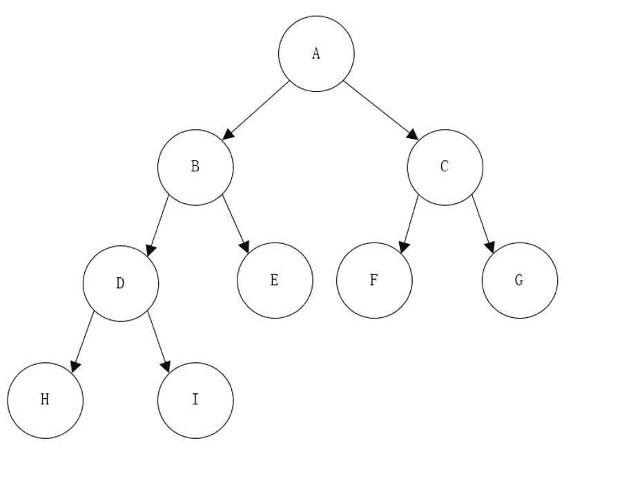
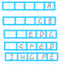
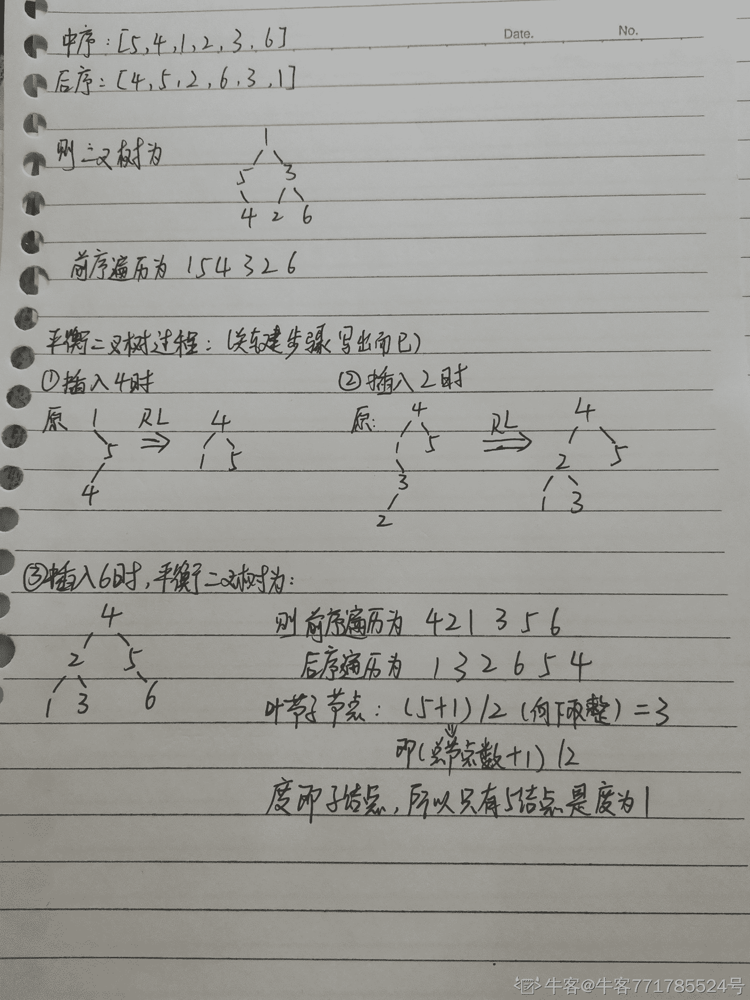
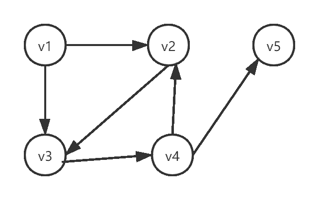
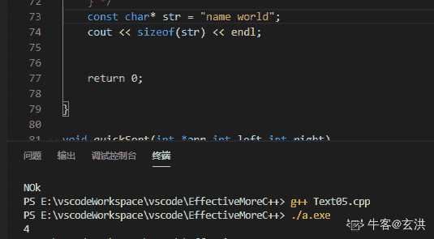

# 【2021】牛客模考（一模）C++笔试

## 1

进程从运行状态进入就绪状态的原因可能是。

正确答案: A   你的答案: 空 (错误)

```cpp
时间片用完
```

```cpp
被选中占有 CPU
```

```cpp
等待某一事件
```

```cpp
等待的事件已经发生
```

本题知识点

操作系统 C++工程师 牛客 2021 Java 工程师 安卓工程师 iOS 工程师 运维工程师 前端工程师 测试开发工程师 测试工程师 算法工程师

讨论

[天秤](https://www.nowcoder.com/profile/1085746)



发表于 2019-01-02 16:14:32

* * *

[䭔](https://www.nowcoder.com/profile/5007467)



发表于 2017-09-03 13:43:58

* * *

[郄✘](https://www.nowcoder.com/profile/108628660)

更高优先级进程抢占 CPU 的话不也应该是运行态到就绪态吗？

编辑于 2022-03-18 09:19:28

* * *

## 2

在可变式分区分配方案中，将空白区在空白区表中按地址递增次序排列是（       ）。

正确答案: C   你的答案: 空 (错误)

```cpp
最佳适应算法
```

```cpp
最差适应算法
```

```cpp
最先适应算法
```

```cpp
最迟适应算法
```

本题知识点

操作系统 C++工程师 牛客 2021 Java 工程师 安卓工程师 iOS 工程师 运维工程师 前端工程师 测试开发工程师 测试工程师 算法工程师

讨论

[泡面头和野生眉](https://www.nowcoder.com/profile/2088407)

最佳适应:空闲区按容量大小递增 最差适应:空闲区按容量大小递减 最先适应:空闲区按地址大小递增

发表于 2017-08-08 19:58:18

* * *

[欢乐的孔](https://www.nowcoder.com/profile/651251732)

无最迟适应算法

```cpp

            发表于 2021-07-19 19:14:26

            [为你扣下 F 键](https://www.nowcoder.com/profile/2098514)

                                                                    最先适应算法也叫首次适应算法（FF，First Fit）

            发表于 2018-09-25 21:16:32

        3
        在 MySQL 中 Replace 在相同的主键或者唯一键的时候相当于以下以下哪个操作？

    正确答案:
                                                 B
                                                         你的答案:

                  空
                             (错误)

```
INSERT
```cpp

```
DELETE+INSERT
```cpp

```
UPDATE
```cpp

```
其他都不是
```cpp

本题知识点

                                                            C++工程师 
                                                牛客 
                                                2021 
                                                Java 工程师 
                                                安卓工程师 
                                                iOS 工程师 
                                                运维工程师 
                                                前端工程师 
                                                测试开发工程师 
                                                测试工程师 
                                                算法工程师 

讨论

[快慢机 13](https://www.nowcoder.com/profile/722614577)

                                                                      MYSQL 中处理插入过程主键或唯一重复值的解决办法： 
   1.IGNORE:有则忽略，无则插入 
   2.REPLACE：有则删除再插入，无则插入 
   3.ON DUPLIACATE KEY UPDATE:有则更新，无则插入

发表于 2021-04-09 10:25:08

* * *

[Binet](https://www.nowcoder.com/profile/720296123)

                                                                      ON DUPLIACATE KEY UPDATE ：有则更新，只更新新增部分，其余未涉及的字段不变；无则添加； 
   REPLACE INTO：有则删除，更新新增部分，未涉及的字段变为默认值；无则添加。 

发表于 2021-10-10 15:40:51

* * *

## 4

          以下关于宏和内联函数描述错误的是（）。 

正确答案:
                                                                                   D
                       你的答案:

                  空
                             (错误)

```
宏定义不检查函数参数，返回值
```cpp

```
内联函数和宏很类似，而区别在于，宏是由预处理器对宏进行替代，而内联函数是通过编译器控制来实现的
```cpp

```
内联函数必须是和函数体申明在一起，才有效。
```cpp

```
内联函数是预编译器的输入
```cpp

本题知识点

                                                            C++工程师 
                                                牛客 
                                                2021 

讨论

[lyiopue](https://www.nowcoder.com/profile/764475745)

                                                                      编译器把内联函数展开，inline 关键字的声明要与函数定义放在一个文件才起作用。而且声明为 inline 的函数编译器也不一定 将其展开。 
   *预编译器就是预处理器，进行宏展开。*  

编辑于 2021-07-14 18:22:52

* * *

## 5

        在计算机操作系统中信号量可以用来保证两个或多个关键代码段不被并发调用，而在进入一个关键代码段之前，线程必须获取到一个信号量，现假设有 4 个进程共享同一程序段，而且每次最多允许 3 个进程进入该程序段，则信号量的变化范围是多少（    ）？

正确答案:
                                                 B
                                                         你的答案:

                  空
                             (错误)

```
0~3
```cpp

```
-1~3
```cpp

```
0~4
```cpp

```
-2~2
```cpp

本题知识点

                                                            C++工程师 
                                                牛客 
                                                2021 
                                                Java 工程师 
                                                安卓工程师 
                                                iOS 工程师 
                                                运维工程师 
                                                前端工程师 
                                                测试开发工程师 
                                                测试工程师 
                                                算法工程师 

讨论

[Teriomy](https://www.nowcoder.com/profile/905305791)

  允许 3 个进程同时进入程序段，因此信号量 S 设为 3\. 

  这里的信号量 P 操作应该是等待时，将其挂到信号量等待队列中，因此可以为负数。先对信号量执行减 1 操作，如果为负数，将进程添加到信号量等待队列，并挂起进程。 

   本题中，当 3 个线程进入程序段后，S=0；第 4 个进程再想进入时，S=-1，因此取值范围是[3,-1]（整数）。 

   来源：[`www.tilaile.com/question/12933`](http://www.tilaile.com/question/12933) 

发表于 2021-06-25 14:19:36

* * *

## 6

        主机 A 与主机 B 已建立 TCP 连接，A 的 cwnd（拥塞窗口）大小初始值为 1KB，ssthresh (阈值)为 16KB，B 的 rwnd (接收缓存窗口)初始值为 8KB，一个最大报文段为 1KB，假设数据传输过程中未出现超时，经过 3 个 RTT（3 轮传输）后，且 B 尚未从缓存中取出任何数据时候，主机 A 的发送窗口大小为（）

正确答案:
                                A
                                                                          你的答案:

                  空
                             (错误)

```
1 KB
```cpp

```
2 KB
```cpp

```
3 KB
```cpp

```
4 KB
```cpp

本题知识点

                                                            C++工程师 
                                                牛客 
                                                2021 
                                                Java 工程师 
                                                安卓工程师 
                                                iOS 工程师 
                                                运维工程师 
                                                前端工程师 
                                                测试开发工程师 
                                                测试工程师 
                                                算法工程师 

讨论

[牛客 80403043 号](https://www.nowcoder.com/profile/80403043)

                                                                    三轮分别发了 1 2 4，b 没有接收缓存数据，所以缓存剩 8-1-2-4=1，所以三轮后，b 告诉 a 把窗口大小改成 1

发表于 2021-04-13 07:45:40

* * *

## 7

          借助队列采用非递归的方式对二叉树进行层次遍历，遍历方向为从左至右，在遍历过程中，队列中的元素最多为多少个（） 
   二叉树的结构如图所示:

   

正确答案:
                                A
                                                                          你的答案:

                  空
                             (错误)

```
5 个
```cpp

```
6 个
```cpp

```
7 个
```cpp

```
8 个
```cpp

本题知识点

                                                            C++工程师 
                                                牛客 
                                                2021 
                                                Java 工程师 
                                                安卓工程师 
                                                iOS 工程师 
                                                运维工程师 
                                                前端工程师 
                                                测试开发工程师 
                                                测试工程师 
                                                算法工程师 

讨论

[牛客 _ 张誉](https://www.nowcoder.com/profile/311075701)

    
   树的层次遍历从上至下，从左到右。

      ① A 先入队列                                                 
     ② A 出队，A 的左孩子 B 和右孩子 C 入队  

   ③ B 出队，B 的左孩子 D 和右孩子 E 入队 
   ④C 出队，C 的左孩子 F 和右孩子 G 入队 
   ⑤D 出队,D 的左孩子 H 和右孩子入队 I 

发表于 2021-04-10 22:13:30

* * *

## 8

          在一颗普通的树上，a 与 b 互为兄弟节点。将树转为二叉树后，下列哪种情形不可能发生（）。 
   注：在将普通的树转换为二叉树过程中，节点在删除与自身子节点的连线时，只保留与最左侧子节点之间的连线。 

正确答案:
                                                 B
                                                         你的答案:

                  空
                             (错误)

```
a 是 b 的右孩子
```cpp

```
a 是 b 的左孩子
```cpp

```
a 是 b 的祖先节点
```cpp

```
b 是 a 的祖先节点
```cpp

本题知识点

                                                            C++工程师 
                                                牛客 
                                                2021 
                                                Java 工程师 
                                                安卓工程师 
                                                iOS 工程师 
                                                运维工程师 
                                                前端工程师 
                                                测试开发工程师 
                                                测试工程师 
                                                算法工程师 

讨论

[ziqia](https://www.nowcoder.com/profile/402785638)

                                                                    左儿子，右兄弟

发表于 2021-04-19 21:38:10

* * *

[牛客 149016903 号](https://www.nowcoder.com/profile/149016903)

                                                                    a，b，d 选项都是说”a 是 b 的小辈“，用排除法得 c😏

发表于 2022-02-22 15:32:09

* * *

[wfl666](https://www.nowcoder.com/profile/628959222)

                                                                    左孩子不会是兄弟节点

发表于 2022-01-15 12:15:51

* * *

## 9

        这里有一张中国高校院士数目信息表（院士姓名，高校所在省区）（只展示了部分数据，其余大量数据形式相同）
 +-----------+---------+
 |     name     |province |
 +-----------+---------+
 | ad        |     GD    |
 | ws        |     ZJ    |
 | ge        |     FJ    |
 | MO        |     SX    |
 | wi        |     ZJ    |
 +-----------+---------+
 查询出哪个省区，出生院士人数最多？

正确答案:
                                                 B
                                                         你的答案:

                  空
                             (错误)

```
select province,count(*) as count from college group by province  limit 1;
```cpp

```
select province,count(*) as count from college group by province order by count desc limit 1;
```cpp

```
select province,count(*) as count from college order by count desc limit 1;
```cpp

```
select province,count(*) as count from college group by province order by count limit 1;
```cpp

本题知识点

                                                            C++工程师 
                                                牛客 
                                                2021 
                                                Java 工程师 
                                                安卓工程师 
                                                iOS 工程师 
                                                运维工程师 
                                                前端工程师 
                                                测试开发工程师 
                                                测试工程师 
                                                算法工程师 

讨论

[LittleLuiLui](https://www.nowcoder.com/profile/515839302)

                                                                    先根据 province 分组，然后使用 count()函数统计每个分组中所有的(即*表示)记录数，将每组的统计结果形成临时列并命名为 count，然后使用 order by count desc 根据 count 列中的值对临时结果倒序排序，并使用 limit 1 限制只选择第一个结果。

发表于 2021-05-01 14:54:48

* * *

## 10

        二叉树的中序遍历为[5,4,1,2,3,6]，后序遍历为[4,5,2,6,3,1]，新建平衡二叉树，按二叉树的前序遍历顺序将元素插入到平衡二叉树中，对于得到的平衡二叉树说法不正确的是（）

正确答案:
                                                                  C
                                        你的答案:

                  空
                             (错误)

```
有 3 个叶子结点
```cpp

```
度为 1 的结点只有结点 5
```cpp

```
前序遍历为[4,2,1,3,6,5]
```cpp

```
后序遍历为[1,3,2,6,5,4]

```cpp

本题知识点

                                                            C++工程师 
                                                牛客 
                                                2021 
                                                Java 工程师 
                                                安卓工程师 
                                                iOS 工程师 
                                                运维工程师 
                                                前端工程师 
                                                测试开发工程师 
                                                测试工程师 
                                                算法工程师 

讨论

[Elaine_cc](https://www.nowcoder.com/profile/771785524)

                                                                       
   个人解法，欢迎大家交流批评 

发表于 2021-10-17 16:10:42

* * *

[数学汤家风](https://www.nowcoder.com/profile/671012152)

考研党狂喜。

```
一、 根据中、后序列还原二叉树。
后序序列从后往前看决定根，中序列位置划分左右子树

      1
   /    \  
(5,4) (2,3,6)

    1
   / \
(5,4) 3
     / \
    2   6

    1
   /  \
  5    3
   \  / \
    4 2  6    

二、二叉树先序遍历，根左右

1 5 4 3 2 6

三、构建 AVL
AVL 左右高度差不超过 1

1               4
 \             /  \
  5    RL     1    5
 /
4

  4             4
 / \           / \
1   5         2    5
 \           / \   
  3    RL   1   3
 /
2

    4
   / \
  2   5
 / \   \
1   3   6

A B 显然对
先序：4 2 1 3 5 6
后序：1 3 2 6 5 4
所以选 C
​
```cpp

发表于 2022-02-09 20:04:57

* * *

[牛客 260047603 号](https://www.nowcoder.com/profile/260047603)

                                                                      通过中序，后序确定原树的前序：154326 
   然后构建平衡树： 
   4 (2 (1 3)) (5 (NULL 6)) 
   所以前序应该是 421356 

发表于 2021-04-10 16:54:15

* * *

## 11

          请你判断一下这段 C++代码的实现的功能是什么样的? 

```
    int func(int n) {
        n && (n += func(n-1));
        return n;
    }

```cpp

正确答案:
                                                 B
                                                                          你的答案:

                  空
                             (错误)

```
没有递归出口，无法结束
```cpp

```
实现了 n+n-1+...2+1 的功能
```cpp

```
实现了 n-(n-1)+(n-2)-...-2+1 的功能
```cpp

```
实现了求 n 的二进制里面 1 的个数的功能
```cpp

```
实现了求 n 的二进制里面 0 的个数的功能
```cpp

本题知识点

                                                            C++工程师 
                                                牛客 
                                                2021 
                                                Java 工程师 
                                                安卓工程师 
                                                iOS 工程师 
                                                运维工程师 
                                                前端工程师 
                                                测试开发工程师 
                                                测试工程师 
                                                算法工程师 

讨论

[杨乘风](https://www.nowcoder.com/profile/6948244)

                                                                      &&逻辑与运算符 前面若为假则不执行后一句，如果 n 为非零，则执行，若 n 为 0，则后半句被短路，不执行 
   || 前面的为真,后面也一样不判断了

发表于 2021-04-27 21:14:48

* * *

[三体人 Mary](https://www.nowcoder.com/profile/381111954)

                                                                      此时的 n && 是利用了&&的短路性质 如果 n 为 true 的逻辑判断通过才会执行后面的代码。 
   所以此时函数可以改写为 

```
int func(int n){
    if(n){
        n += func(n-1);
    }
    return n;
}
```cpp

 if(n)也就是 if(n!=0)的意思。

发表于 2022-02-28 11:20:40

* * *

[QQK00](https://www.nowcoder.com/profile/375698814)

                                                                    使用&短路特性

发表于 2021-08-12 20:22:56

* * *

## 12

  以下主机可以和 202.115.112.218/28 直接通信的是（    ）。 

正确答案:
                                                                                   D
                       你的答案:

                  空
                             (错误)

```
202.115.112.205/28
```cpp

```
202.115.112.225/28
```cpp

```
202.115.112.195/28
```cpp

```
202.115.112.212/28
```cpp

本题知识点

                                                            C++工程师 
                                                牛客 
                                                2021 
                                                Java 工程师 
                                                安卓工程师 
                                                iOS 工程师 
                                                运维工程师 
                                                前端工程师 
                                                测试开发工程师 
                                                测试工程师 
                                                算法工程师 

讨论

[山海意明](https://www.nowcoder.com/profile/703161016)

                                                                      ——子网掩码的读法—— 
   把子网掩码转换成二进制，看到有多少个 1 斜杠/后面就填写多少数字 
 例如：192.168.1.0
 255.255.255.0 转换成二进制后为 11111111.11111111.11111111.00000000 里面共有 24 个 1 则可以写成
   192.1681.0/24 
   ——回到本题—— 
   前面三个字段每个 8 个字节，一共 24 个字节都一样，不用看，只需要关注最后一个字段的八个字节，也就是 218 
   218 也即 1101 1010

   而 28 - 24 = 4，只需要看 1101 1010 的前四个字节，也就是 1101**** 
   因为 1101 0000(208)<1101 ****<1110 0000(224)，所以只能选 D。  

发表于 2021-08-02 11:31:07

* * *

[minxiaofeng10](https://www.nowcoder.com/profile/889896949)

                                                                      218 最后 8 位是 1101 1010  
   因为是 28 位 
   所以同一个网段应该是 1101 **** 
   范围是 1101 0000(208)<1101 ****<1110 0000(224) 
   符合条件的就只有 D 

发表于 2021-04-19 16:49:24

* * *

## 13

  网络协议之间有规定的层次关系，下面选项中层次关系正确的是，上一层的网络的底层应该有下一层（   ）。 

正确答案:
                                                 B
                                                         你的答案:

                  空
                             (错误)

本题知识点

                                                            C++工程师 
                                                牛客 
                                                2021 
                                                Java 工程师 
                                                安卓工程师 
                                                iOS 工程师 
                                                运维工程师 
                                                前端工程师 
                                                测试开发工程师 
                                                测试工程师 
                                                算法工程师 

讨论

[杨乘风](https://www.nowcoder.com/profile/6948244)

                                                                    llc:数据链路层协议

发表于 2021-04-27 21:17:07

* * *

[newkeer.1](https://www.nowcoder.com/profile/354413011)

                                                                    SNMP 和 DHCP 都是基于 UDP 的应用层协议

发表于 2021-07-10 22:22:24

* * *

[流浪喵喵](https://www.nowcoder.com/profile/712059837)

                                                                    应用层:HTTP …… 运输层:TCP,UDP……  网际层:IP  网络接口层:网络接口 1，2，3……

编辑于 2021-10-03 11:17:53

* * *

## 14

          某个有向图如下，从顶点 v1 出发对其进行深度优先遍历，可能得到的遍历序列是（1）；从顶点 v1 出发对其进行广度优先遍历，可能的到的序列是（2） 
     
   ①v1 v2 v3 v4 v5 

   ②v1 v3 v2 v4 v5 

   ③v1 v3 v4 v5 v2 

   ④v1 v3 v4 v2 v5 

正确答案:
                                                                  C
                                        你的答案:

                  空
                             (错误)

```
(1)②③④ (2)①

```cpp

```
(1)①③ (2)①②
```cpp

```
(1)①③④ (2)①②
```cpp

```
(1)①③ (2)②④
```cpp

本题知识点

                                                            C++工程师 
                                                牛客 
                                                2021 
                                                Java 工程师 
                                                安卓工程师 
                                                iOS 工程师 
                                                运维工程师 
                                                前端工程师 
                                                测试开发工程师 
                                                测试工程师 
                                                算法工程师 

讨论

[Teriomy](https://www.nowcoder.com/profile/905305791)

[有向图的广度优先遍历 _ 数据结构和算法总结](https://blog.csdn.net/weixin_39516865/article/details/110807792)

发表于 2021-06-25 15:02:03

* * *

## 15

        请问 C++的 STL 库中 map 的底层数据结构为（），multimap 的底层数据结构为（），unordered_map 的底层数据结构为（）？

正确答案:
                                                                                   D
                       你的答案:

                  空
                             (错误)

```
rb_tree  hashtable rb_tree
```cpp

```
hashtable rb_tree rb_tree
```cpp

```
rb_tree  hashtable hashtable
```cpp

```
rb_tree  rb_tree hashtable
```cpp

本题知识点

                                                            C++工程师 
                                                牛客 
                                                2021 

讨论

[从禾·顷声](https://www.nowcoder.com/profile/598453987)

                                                                    map 和 multimap 都是有序的，不可能用 Hashtable 进行存储

发表于 2022-01-24 10:34:05

* * *

[轩衅 inc 氵氺](https://www.nowcoder.com/profile/170990596)

                                                                    mutlimap:有相同的 key 肯定不能用 hash 啊

发表于 2021-08-24 14:56:22

* * *

## 16

        在 64 位操作系统下，下列程序的输出结果为（）

```
#include<iostream>
using namespace std;
{
const char* str = "name hello";
printf("%d %d\n", sizeof(str), strlen(str));
return 0;
}
```cpp

正确答案:
                                A
                                                                          你的答案:

                  空
                             (错误)

```
8  10    
```cpp

```
8  4
```cpp

```
4   10
```cpp

```
4   4
```cpp

本题知识点

                                                            C++工程师 
                                                牛客 
                                                2021 

讨论

[山海意明](https://www.nowcoder.com/profile/703161016)

                                                                    sizeof(str)输出的是指针的大小，不管什么指针（无论是 char*还是 int*还是自定义的类型 A 的 A*），大小都是一样的，在 32 位下是 4 位，在 64 位下是 8 位。

发表于 2021-08-02 11:38:22

* * *

[摩诃迦叶](https://www.nowcoder.com/profile/99988268)

                                                                    strlen() 包含'\0'

发表于 2021-10-19 13:46:56

* * *

[玄洪](https://www.nowcoder.com/profile/588901377)

                                                                    答案是 4,10 不是 8,10

发表于 2021-07-08 22:52:14

* * *

## 17

          有学生表如下： 

   CREATE TABLE students (  

          s_id VARCHAR(20) PRIMARY KEY,  

          s_name VARCHAR(20) NOT NULL DEFAULT '',  

          s_birth VARCHAR(20) NOT NULL DEFAULT '',  

          s_sex VARCHAR(10) NOT NULL DEFAULT ''  

   );  

 现要查询 students 表的第 16~20 条数据，正确的查询语句是

正确答案:
                                A
                                                                          你的答案:

                  空
                             (错误)

```
select * from students limit 15,5;
```cpp

```
select * from students limit 16,5;
```cpp

```
select * from students limit 16,20;
```cpp

```
select * from students limit 15,20;
```cpp

本题知识点

                                                            C++工程师 
                                                牛客 
                                                2021 
                                                Java 工程师 
                                                安卓工程师 
                                                iOS 工程师 
                                                运维工程师 
                                                前端工程师 
                                                测试开发工程师 
                                                测试工程师 
                                                算法工程师 

讨论

[牛客 746327783 号](https://www.nowcoder.com/profile/746327783)

                                                                      如果给定两个参数，第一个参数指定第一个返回记录行的偏移量，第二个参数指定返回记录行的最大数目。 
   select * from tableName limit i,n 

*   tableName : 为数据表；      

*   i : 为查询结果的索引值（默认从 0 开始）；      

*   n : 为查询结果返回的数量  

编辑于 2021-04-10 21:32:27

* * *

[RGZ](https://www.nowcoder.com/profile/897547078)

                                                                    limit 接受一个或两个数字参数。参数必须是一个整数常量。如果给定两个参数，第一个参数指定第一个返回记录的索引（默认从 0 开始），第二个参数指定返回记录的最大数目。 limit 0,10 代表查询 1-10 条数据 limit 10,5 代表查询第 11-15 条数据 

编辑于 2021-04-16 12:15:01

* * *

[杨乘风](https://www.nowcoder.com/profile/6948244)

  limit 子句用于限制查询结果返回的数量。 

  用法：【select * from tableName limit i,n 】 

  参数： 

  tableName : 为数据表； 

  i : 为查询结果的索引值（默认从 0 开始）； 

  n : 为查询结果返回的数量 

发表于 2021-04-27 21:23:33

* * *

## 18

```
#include<iostream>
using namespace std;
class Base
{
public:
    virtual void foo(){cout << 'a';}   
};
class Middle:public Base
{
public:
    void foo(){cout <<'b';}
};
class Derived:public Middle
{
public:
    void foo(){cout <<'c';}
};
int main()
{
    Base* p1;
    Middle* p2;
    Derived d;
    p1 = &d;
    p1->foo();
    p2 = &d;
    p2->foo();
}
```cpp

   程序运行结果为 

正确答案:
                                                 B
                                                         你的答案:

                  空
                             (错误)

```
ab
```cpp

```
cc
```cpp

```
aa
```cpp

```
bc
```cpp

本题知识点

                                                            C++工程师 
                                                牛客 
                                                2021 

讨论

[牛客 676339300 号](https://www.nowcoder.com/profile/676339300)

                                                                    在基类方法的声明中使用关键字 virtual 可使该方法在基类以及所有的派生类（包括从派生类派生出来的类）中都是虚拟的。 所以在基类指针所指对象为派生类时，虚函数表中存放的是派生类实现的函数指针。这就是多态。

发表于 2021-07-27 09:39:37

* * *

## 19

          头文件中有 
   int func1(); 
   static int func2(); 
   class DEMO 
   { 
   public: 
       int func3(); 
       static func4(); 
   } 
   在这些函数中，具有隐含的 this 指针的是 

正确答案:
                                                                  C
                                        你的答案:

                  空
                             (错误)

```
func1
```cpp

```
func2
```cpp

```
func3
```cpp

```
func4
```cpp

本题知识点

                                                            C++工程师 
                                                牛客 
                                                2021 

讨论

[方开心](https://www.nowcoder.com/profile/272867509)

                                                                      非静态成员函数都包含一个特殊的指针，指向调用该函数的对象，这个指针成为 this 指针 

发表于 2021-07-29 21:48:23

* * *

## 20

        请问以下序列中能构成最小堆的是

正确答案:
                                                                  C
                                        你的答案:

                  空
                             (错误)

```
4, 5, 7, 7, 8, 10, 4
```cpp

```
10, 9, 8, 7, 3, 2, 1
```cpp

```
3, 4, 5, 5, 5, 9, 6
```cpp

```
3, 14, 10, 20, 30, 9, 12
```cpp

本题知识点

                                                            C++工程师 
                                                牛客 
                                                2021 
                                                Java 工程师 
                                                安卓工程师 
                                                iOS 工程师 
                                                运维工程师 
                                                前端工程师 
                                                测试开发工程师 
                                                测试工程师 
                                                算法工程师 

讨论

[初见 201812241227328](https://www.nowcoder.com/profile/671411009)

                                                                      堆分为大顶堆和小顶堆， 
   满足 a[i]>=a[2i+1]&&a[i]>=a[2i+2]称为**大顶堆**， 
   满足 a[i]<=a[2i+1]&&a[i]<=a[2i+2]称为**小顶堆** 

发表于 2021-04-22 15:17:48

* * *

[AlQNM](https://www.nowcoder.com/profile/778717720)

*   如果每个节点的值都大于等于左右孩子节点的值，这样的堆叫 **大****顶堆**；    

*   如果每个节点的值都小于等于左右孩子节点的值，这样的堆叫 **小顶堆**。   

 堆是一个完全二叉树：将序列按照从上到下，从左至右构建二叉树：第一层（3）；第二层（45）；第三层（5596）.可以看出是小顶堆

编辑于 2021-07-29 16:55:26

* * *

[牛客 628691265 号](https://www.nowcoder.com/profile/628691265)

                                                                    对应的完全二叉树，任一非终端节点的数据值均不大于其左子节点和右子节点的值。

发表于 2022-03-17 21:11:02

* * *

## 21

          最近小明搬到了新家，他正在粉刷墙壁，但是不幸的是他粉刷的墙壁并不理想。他的墙壁是一个长度为 的格子，每个格子用 0 表示红色，用 1 表示蓝色。现在墙壁是一个非常混乱的颜色。他想将墙壁涂成左边全是蓝色右边全是红色，可以将墙壁刷成全是红色或者蓝色。请问他至少需要粉刷多少个格子墙壁刷成他想要的样子？ 

   数据范围： 
   进阶：时间复杂度，空间复杂度

本题知识点

                                                            C++工程师 
                                                牛客 
                                                2021 
                                                Java 工程师 
                                                安卓工程师 
                                                iOS 工程师 
                                                运维工程师 
                                                前端工程师 
                                                测试开发工程师 
                                                测试工程师 
                                                算法工程师 

讨论

[零葬](https://www.nowcoder.com/profile/75718849)

  预处理 

   我们的目的是让左边都为 1，右边都为 0。通过一次遍历，计算每个位置包括自己在内，左边有多少个 0，右边有多少个 1，两者之和减去 1（减去 1 是因为当前位置的颜色不改）就是颜色边界为当前位置时的刷墙代价。再遍历一遍枚举颜色边界的可能性，计算出最小代价就行。 

```
import java.io.*;
import java.util.*;

public class Main {
    public static void main(String[] args) throws IOException {
        BufferedReader br = new BufferedReader(new InputStreamReader(System.in));
        int n = Integer.parseInt(br.readLine());
        char[] wall = br.readLine().toCharArray();
        int[] left = new int[n];     // 包括自己，左边 0 的个数，这些是要被刷成 1 的
        int[] right = new int[n];    // 包括自己，右边 1 的个数，这些是要被刷成 0 的
        for(int i = 0; i < n; i++){
            if(i == 0){
                left[i] = wall[i] == '0'? 1: 0;
                right[n - i - 1] = wall[n - i - 1] == '1'? 1: 0;
            }else{
                left[i] = left[i - 1] + (wall[i] == '0'? 1: 0);
                right[n - i - 1] = right[n - i] + (wall[n - i - 1] == '1'? 1: 0);
            }
        }
        int cost = n;
        for(int i = 0; i < n; i++){
            cost = Math.min(cost, left[i] + right[i] - 1);
        }
        System.out.println(cost);
    }
}
```cpp

   复杂度分析  

 开辟了 left 和 right 数组，空间复杂度为 O(n)；遍历两遍数组，时间复杂度为 O(n)。 

发表于 2022-02-23 13:04:02

* * *

[牛客 777207027 号](https://www.nowcoder.com/profile/777207027)

考虑第  个格子的左边线作为分界，左 1 右 0 ，左边假设全涂好了，右边 

 

假如 第 i + 1 个房间是 1，那现在就不用涂了，反之要补上。

DP 的初值是一共几个 1

dp[i] 的意义是，选第 i 个时的花费。最后取 min 即可

```
input()
room = input()
dp = [0] * (1 + len(room))
dp[0] = room.count("1")
for i in range(1, len(room) + 1):
    dp[i] = dp[i - 1] + int(room[i - 1] == "0") - int(room[i - 1] == "1")
print(min(dp))
```cpp

发表于 2021-05-01 22:26:45

* * *

[realMorty](https://www.nowcoder.com/profile/764860478)

                                                                      import java.util.Scanner; 

   public class Main { 
       public static void main(String[] args){ 
           Scanner sc = new Scanner(System.in); 
           int n = sc.nextInt(); 
           if (n == 1) { 
               System.out.println(0); 
               return; 
           }  
           String s = sc.next(); 
           char[] chars = s.toCharArray(); 
           int[] cntZero = new int[n]; 
           int[] cntOne = new int[n]; 
           cntOne[0] = chars[0] == '1' ? 1 : 0; 
           for(int i = 1; i < n; i++) { 
               cntOne[i] = cntOne[i - 1]; 
               if(chars[i]=='1') cntOne[i]++;  
           } 
           cntZero[n - 1] = chars[n - 1] == '0' ? 1 : 0; 
           for(int i = n - 2; i >= 0; i--) { 
               cntZero[i] = cntZero[i + 1]; 
               if(chars[i]=='0') cntZero[i]++;  
           } 
           int sameColor = Math.min(n - cntZero[0], n - cntOne[n - 1]); 
           int diffColor = n; 
           for (int i = 0; i < n - 1; i++) { 
               int times = i + 1 - cntOne[i] + (n - i - 1) - cntZero[i+1]; 
               diffColor = Math.min(diffColor, times); 
           } 
           System.out.println(Math.min(sameColor, diffColor)); 

       }     
   } 
 发表于 2022-02-08 13:52:22

* * *

## 22

        小明，小王，小李三人正在进行一个游戏。游戏有个回合，每个人都有一个字符串，三人的字符串长度相等。每个回合他们必须更改自己字符串中的一个字母。最后每个人的分数是自己的字符串中出现次数最多的字母的数量。分数最高者获胜，输出获胜者名字，小明获胜输出 xiaoming，小王获胜输出 xiaowang，小李获胜输出 xiaoli，如果有两个或者两个以上相同的最高分输出 draw。

本题知识点

                                                            C++工程师 
                                                牛客 
                                                2021 
                                                Java 工程师 
                                                安卓工程师 
                                                iOS 工程师 
                                                运维工程师 
                                                前端工程师 
                                                测试开发工程师 
                                                测试工程师 
                                                算法工程师 

讨论

[hjc-](https://www.nowcoder.com/profile/924505095)

                                                                      题目有点问题，题目说：每个回合他们必须更改自己字符串中的一个字母 
   测试用例并非如此，如果全部字符都变成了自己那个字母了，后面可以不再改变，被坑了？ 

发表于 2021-08-15 16:42:53

* * *

[零葬](https://www.nowcoder.com/profile/75718849)

                                                                      首先需要明白一个事实，每个人得分的上限就是自己字符串的长度。 

  算法流程 

   1.遍历字符串，计算 3 人的得分：统计出每个人字符串的字母众数 mode，如果 n+mode 能够大于等于字符串的长度（因为总可以通过修改一些非众数字母，把多余的操作次数给消耗掉，使得剩下的操作次数能够把字符串中的所有字母都改成众数字母），得分就是这个字符串的长度；否则得分就是 n+mode。 
   2.判断是否存在多个最高分：有就输出平局，没有就输出胜者。 

```
import java.io.*;
import java.util.*;

public class Main {
    public static void main(String[] args) throws IOException {
        BufferedReader br = new BufferedReader(new InputStreamReader(System.in));
        int n = Integer.parseInt(br.readLine());
        String xiaoming = br.readLine();
        String xiaowang = br.readLine();
        String xiaoli = br.readLine();
        int modeMing = getMode(xiaoming);
        int modeWang = getMode(xiaowang);
        int modeLi = getMode(xiaoli);
        if((modeMing == modeWang && modeMing > modeLi) || (modeMing == modeLi && modeMing > modeWang) || (modeWang == modeLi && modeWang > modeMing)){
            System.out.println("draw");     // 存在平局
        }else{
            if(modeMing > Math.max(modeWang, modeLi)){
                System.out.println("xiaoming");
            }else if(modeWang > Math.max(modeMing, modeLi)) {
                System.out.println("xiaowang");
            }else{
                System.out.println("xiaoli");
            }
        }
    }

    private static int getMode(String str) {
        int mode = 0;
        HashMap<Character, Integer> termFreq = new HashMap<>();
        for(int i = 0; i < str.length(); i++){
            char c = str.charAt(i);
            termFreq.put(c, termFreq.getOrDefault(c, 0) + 1);
            mode = Math.max(mode, termFreq.get(c));
        }
        return mode;
    }
}
```cpp

发表于 2022-02-23 12:58:34

* * *

[雨村 131](https://www.nowcoder.com/profile/142490716)

                                                                    字符串长度相等，直接比较字符串中的字符出现次数，比如小王有三个 e，小王第一，直接输出小王

发表于 2021-08-09 10:31:19

* * *

## 23

          有一款游戏，过关的方式是按按钮。 
   游戏一共有关，每一关有个按钮，其中只有唯一一个按钮是可以通关的，按下其他的按钮游戏就会失败。 
   好在这个游戏可以重来，而且由于设计者的疏忽，每一关的通关按钮是不变的，所以你可以记住前几关的按钮，重来时就可以直接通关。 
   但是...你的运气似乎用在了其他地方，你使用了最多的按按钮次数才成功通关。 
   求这个最多的按按钮次数吧！ 

   **本题为核心代码模式，代码框中预设代码已经指定好类名、方法名、参数名，请勿修改或重新命名，直接返回值即可。**

本题知识点

                                                            C++工程师 
                                                牛客 
                                                2021 
                                                Java 工程师 
                                                安卓工程师 
                                                iOS 工程师 
                                                运维工程师 
                                                前端工程师 
                                                测试开发工程师 
                                                测试工程师 
                                                算法工程师 

讨论

[牛客 135116964 号](https://www.nowcoder.com/profile/135116964)

                                                                      从最后一个开始，计算每一关按按钮的次数，最后加起来就好了，java 执行时间 227ms 

```
import java.util.*;

public class Solution {
    /**
     * 代码中的类名、方法名、参数名已经指定，请勿修改，直接返回方法规定的值即可
     *
     * 
     * @param buttons int 整型一维数组 
     * @return long 长整型
     */
    public long findMaxButtons (int[] buttons) {
        int len = buttons.length;
        long sum = 0;
        long pre = 1;
        for(int i = len-1;i>=0;i--){
            pre = pre + buttons[i] - 1;
            sum += pre;
        }
        return sum;
    }
}
```cpp

发表于 2022-02-04 01:21:34

* * *

[零葬](https://www.nowcoder.com/profile/75718849)

                                                                      来到第关时，前关的按钮已经记住了，但在本关会失败次，本关每失败一次，前面的关还需要重新走一遍（能来到本关，说明前面关卡的通关按钮已经记住，可以一遍速通）。因此来到本关后要试出本关的通关按钮需要次，可以得到递推计算公式，注意最后还要加上一遍速通消耗的按钮数。 

```
import java.util.*;

public class Solution {
    /**
     * 代码中的类名、方法名、参数名已经指定，请勿修改，直接返回方法规定的值即可
     *
     * 
     * @param buttons int 整型一维数组 
     * @return long 长整型
     */
    public long findMaxButtons (int[] buttons) {
        // write code here
        long res = buttons.length;
        for(int i = 0; i < buttons.length; i++){
            res += (long)(buttons[i] - 1) * (i + 1);
        }
        return res;
    }
}
```cpp

 代码实现时注意下标与次数之间的变换关系 

编辑于 2022-02-23 13:30:22

* * *

[mysteriousTime](https://www.nowcoder.com/profile/200877276)

  importjava.util.*; 

  publicclassSolution { 

```
publiclongfindMaxButtons (int[] buttons) {

    Long max = 0L;

    for(inti = 0;i<buttons.length;i++){

        int a = buttons[i];

       max + =(a-1)*(i+1);

    }

    return max + buttons.length;

}
```cpp

  } 

  我这答案为啥是错的，哪位大神解答一下哦 

编辑于 2022-01-29 15:06:44

* * * 
```