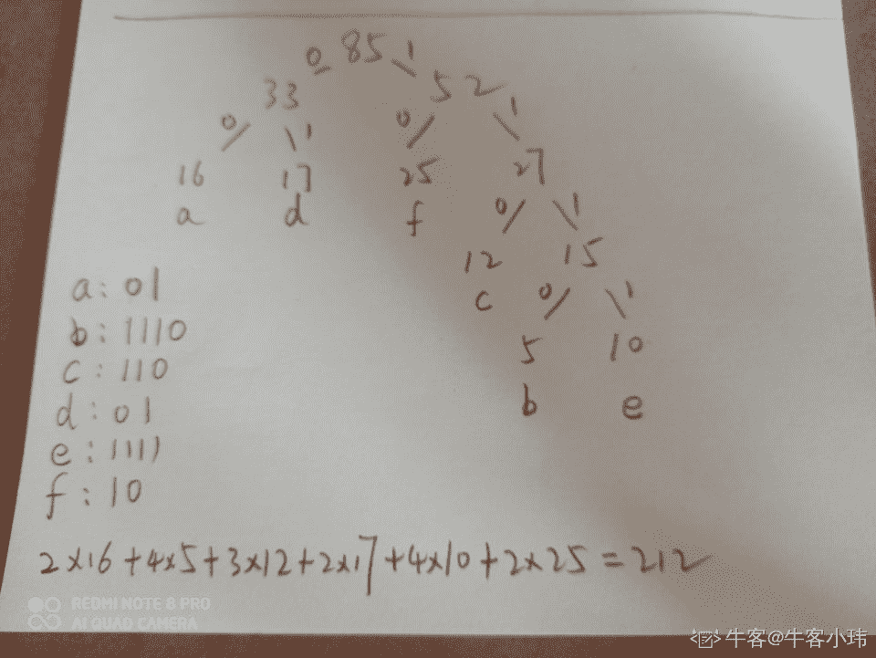

# 【2021】微众银行校招技术类 B 卷

## 1

假定字符集为{a,b,c,d,e,f}，每个字符在文件中的出现次数分别为{16,5,12,17,10,25}，则编码这些字符需要的最少比特位为（     ）

正确答案: A   你的答案: 空 (错误)

```cpp
212
```

```cpp
231
```

```cpp
255
```

```cpp
272
```

本题知识点

Java 工程师 微众银行 2021 运维工程师 安全工程师 测试开发工程师 测试工程师

讨论

[牛客 999785867 号](https://www.nowcoder.com/profile/999785867)

哈夫曼编码问题,建立哈夫曼树求带权路径长度:

发表于 2021-09-08 22:31:54

* * *

[牛客小玮](https://www.nowcoder.com/profile/200045406)



发表于 2021-09-22 17:26:33

* * *

[张小明 ZZYF](https://www.nowcoder.com/profile/208215544)

我算了两遍，出来结果是 213。不知道哪里错了

发表于 2021-08-26 21:17:13

* * *

## 2

设某无向图中有 n 个节点 e 条边，则建立该图邻接表的时间复杂度为（     ）

正确答案: A   你的答案: 空 (错误)

```cpp
O(n+e)
```

```cpp
O(n²)
```

```cpp
O(ne)
```

```cpp
O(n³)
```

本题知识点

Java 工程师 微众银行 2021 运维工程师 安全工程师 测试开发工程师 测试工程师

## 3

eclipse 如何提供调试浏览器操作的功能？

正确答案: A   你的答案: 空 (错误)

```cpp
内部网络浏览器
```

```cpp
chrome 网络浏览器
```

```cpp
firefox 网络浏览器
```

```cpp
Internet Explorer 浏览器
```

本题知识点

Java 工程师 微众银行 2021 运维工程师 安全工程师 测试开发工程师 测试工程师

## 4

若某二叉树的前序遍历序列是 ABCDEFG，中序遍历序列是 DBCAFGE，则该二叉树的后序遍历序列是

正确答案: D   你的答案: 空 (错误)

```cpp
DBCFGEA
```

```cpp
CDBGFEA
```

```cpp
GFCDEBA
```

```cpp
DCBGFEA
```

本题知识点

Java 工程师 微众银行 2021 运维工程师 安全工程师 测试开发工程师 测试工程师

讨论

[Decade_](https://www.nowcoder.com/profile/534829948)

这题的前序遍历应该是 ABDCEFG 吧....

发表于 2021-08-25 16:02:19

* * *

[有芝士的海](https://www.nowcoder.com/profile/911875867)

这道题我的解题思路是这样的： 从中序遍历和前序遍历当中我们可以迅速得出 A 是一个根节点，由此可知，BCD 和 EFG 分别是左右子树。那进一步细分，我们就可以得到一棵树，左子树就是 B 是根节点，D 是左子树，C 是右子树。 右子树，则 E 是根节点，注意，这里 F 是 E 的左子树，G 是 F 的右子树。由此就可以得到 D 答案了。 图片不知道上传，只能用文字描述了。

发表于 2021-10-08 08:01:58

* * *

[零葬](https://www.nowcoder.com/profile/75718849)

这个题的左子树很迷啊，怎么都不对

发表于 2021-09-03 17:17:59

* * *

## 5

堆是一种有用的数据结构，在以下排序码序列中小根堆是（      ）

正确答案: D   你的答案: 空 (错误)

```cpp
16,72,31,23,94,53
```

```cpp
94,53,31,72,16,53
```

```cpp
16,53,23,94,31,72
```

```cpp
16,31,23,94,53,72
```

本题知识点

Java 工程师 微众银行 2021 运维工程师 安全工程师 测试开发工程师 测试工程师

讨论

[零葬](https://www.nowcoder.com/profile/75718849)

父节点要比子节点小，一个个检查

发表于 2021-09-03 17:19:30

* * *

## 6

下列哪个地址为保留地址，主要用于 Internet 试验和开发（      ）

正确答案: D   你的答案: 空 (错误)

```cpp
127.0.0.1
```

```cpp
128.10.10.25
```

```cpp
192.168.1.1
```

```cpp
251.2.2.2
```

本题知识点

Java 工程师 微众银行 2021 运维工程师 安全工程师 测试开发工程师 测试工程师

讨论

[张小明 ZZYF](https://www.nowcoder.com/profile/208215544)

127.0.0.1 是回送地址，可以测试本地 TCP/IP 协议是否可用 E 类地址范围：240.0.0.0 - 255.255.255.255。其中 240.0.0.0-255.255.255.254 作为保留地址，主要用于 Internet 试验和开发

编辑于 2021-08-26 21:23:21

* * *

## 7

下列关于进程的定义叙述不正确的是（）

正确答案: B   你的答案: 空 (错误)

```cpp
进程是程序的一次执行
```

```cpp
进程是资源调度的最小单位
```

```cpp
进程是一个程序及其数据在处理机上执行时所发生的活动
```

```cpp
进程是系统进行资源分配和调度的一个独立单位
```

本题知识点

Java 工程师 微众银行 2021 运维工程师 安全工程师 测试开发工程师 测试工程师

讨论

[张小明 ZZYF](https://www.nowcoder.com/profile/208215544)

线程是资源调度的最小单位，进程是任务执行调度的基本单位。

发表于 2021-08-26 21:24:17

* * *

[牛客 544976319 号](https://www.nowcoder.com/profile/544976319)

进程是资源分配的最小单位，线程是运行调度的最小单位。

发表于 2021-08-30 18:43:58

* * *

## 8

以下关于类型检查，说法错误的是（   ）

正确答案: D   你的答案: 空 (错误)

```cpp
类型检查有两种规则，分别是综合和推导
```

```cpp
整数 8 在 8/2.5 的代码中被转换为浮点数
```

```cpp
重载函数可以解决功能类似但所处理数据类型不同的问题
```

```cpp
C++中的运行时多态性是通过函数重载实现的
```

本题知识点

Java 工程师 微众银行 2021 运维工程师 安全工程师 测试开发工程师 测试工程师

讨论

[张小明 ZZYF](https://www.nowcoder.com/profile/208215544)

C++有两种多态：

1.编译时的多态：函数重载和运算符重载，在编译时就决定调用哪个函数

2.运行时的多态：通过类继承和虚函数实现的。

发表于 2021-08-26 21:25:10

* * *

## 9

关系中候选码的诸属性称为（）

正确答案: D   你的答案: 空 (错误)

```cpp
外码
```

```cpp
列码
```

```cpp
全码
```

```cpp
主属性
```

本题知识点

Java 工程师 微众银行 2021 运维工程师 安全工程师 测试开发工程师 测试工程师

## 10

SQL Server 中系统默认的事务管理模式是

正确答案: A   你的答案: 空 (错误)

```cpp
自动提交事务模式
```

```cpp
显式事务模式
```

```cpp
隐式事务模式
```

```cpp
分布式事务模式
```

本题知识点

Java 工程师 微众银行 2021 运维工程师 安全工程师 测试开发工程师 测试工程师

## 11

执行下列程序的输出结果为（      ）
public class onetest {
    public static void main(String args[]) {
        String s = "xxxxxxxxxxxxxxx#123#456#zzzzz";  
        int n = s.indexOf("#");      
        int k = s.indexOf("#", n+1);  
        String s2 = s.substring(n+2, k);  
        System.out.println(s2); 
    }
}

正确答案: B   你的答案: 空 (错误)

```cpp
12
```

```cpp
23
```

```cpp
123
```

```cpp
#123
```

本题知识点

Java 工程师 微众银行 2021 运维工程师 安全工程师 测试开发工程师 测试工程师

讨论

[零葬](https://www.nowcoder.com/profile/75718849)

n 是第一个#的索引，indexOf 传第二个参数说明从 n+1 开始找#，因此找到的是第二个#，最后 substring 操作不会截取到第 2 个#，结果为 23

发表于 2021-09-03 17:21:53

* * *

## 12

下列代码输出结果为（      ）
class Animal {
    public void show(Dog dog){
        System.out.println("a");
    }

    public void show(){
        System.out.println("b");
    }
}

class Dog extends Animal {
    public void show(Dog dog){
        System.out.println("c");
    }
    public void show(){
        System.out.println("d");
    }
}

public class Base {
    public static void main(String[] args) {
        Animal animal = new Dog();
        animal.show(new Dog());
        animal.show();
    }
}

正确答案: D   你的答案: 空 (错误)

```cpp
a,b
```

```cpp
a,d
```

```cpp
c,b
```

```cpp
c,d
```

本题知识点

Java 工程师 微众银行 2021 运维工程师 安全工程师 测试开发工程师 测试工程师

讨论

[阿肖要继续努力鸭~](https://www.nowcoder.com/profile/943271393)

考察多态父类中不存在的方法，向上转型后，不能丢失该方法父类中存在的方法，子类进行了重写，在调用时，使用子类的方法

发表于 2021-09-16 16:40:05

* * *

## 13

以下代码执行输出结果为（      ）
public class Test{
    public static void main(String args[]){
        int a[] = new int[2];
        try{
            System.out.println(a[3]);
        }
        catch(ArrayIndexOutOfBoundsException e){
            System.out.println("Exception thrown: ArrayIndexOutOfBoundsException");
            return;
        }
        finally{
            System.out.println("The finally statement is executed");
        }

        System.out.println("The test is end");
        return;
    }
}

正确答案: C   你的答案: 空 (错误)

```cpp
Exception thrown: ArrayIndexOutOfBoundsException
The finally statement is executed
The test is end

```

```cpp
Exception thrown: ArrayIndexOutOfBoundsException
The test is end

```

```cpp
Exception thrown: ArrayIndexOutOfBoundsException
The finally statement is executed

```

```cpp
Exception thrown: ArrayIndexOutOfBoundsException
```

本题知识点

Java 工程师 微众银行 2021 运维工程师 安全工程师 测试开发工程师 测试工程师

讨论

[有芝士的海](https://www.nowcoder.com/profile/911875867)

这题旨在考查 try-catch-finally 语句块的使用，很显然，因为 ArrayIndexOutOfBoundsException 的异常会进入到 catch 当中，但由于存在 finally 语句块，所以在 catch 语句当中的 return 之前，会先执行 finally 语句中的方法，而又由于已经再 catch 语句当中就 return 了，所以第三步也就输出不了了。

发表于 2021-09-25 22:17:17

* * *

## 14

在下面的 Java 代码中，哪一行代码是错误的（）：
public class Test{
    public static void main(String[] args) {
     Parent b1 = new Child(); 
     Child b2 = new Child(); 
     b1.m1();  //1
     b1.m3();  //2
     b2.m1();  //3
     b2.m2();  //4
 }
}
class Parent{
 public void m1(){}
 public void m2(){}
}
class Child extends Parent{
 public void m1(){}
 public void m3(){}
}

正确答案: B   你的答案: 空 (错误)

```cpp
代码 1
```

```cpp
代码 2
```

```cpp
代码 3
```

```cpp
代码 4
```

本题知识点

Java 工程师 微众银行 2021 运维工程师 安全工程师 测试开发工程师 测试工程师

讨论

[零葬](https://www.nowcoder.com/profile/75718849)

b1 声明的是父类的类型，不能调用子类自己的方法

发表于 2021-09-03 17:24:30

* * *

## 15

public class Test{

private void test() {
  System.out.println('1'+1+1);
}

static public void main(String[] a) {
  new Test().test();
}

}
上面程序段输出结果为（）

正确答案: D   你的答案: 空 (错误)

```cpp
111
```

```cpp
12
```

```cpp
50
```

```cpp
51
```

本题知识点

Java 工程师 微众银行 2021 运维工程师 安全工程师 测试开发工程师 测试工程师

讨论

[牛客 544976319 号](https://www.nowcoder.com/profile/544976319)

System.out.println('1'+1+1);注意第一个 1 是单引号，所以是字符对应的 ascii 码 49，所以结果是 51；如果是双引号就当字符串处理结果是 111

发表于 2021-08-30 18:58:13

* * *

## 16

（）布局管理器将容器分为东西南北中五个区域

正确答案: B   你的答案: 空 (错误)

```cpp
FlowLayout
```

```cpp
BorderLayout
```

```cpp
GridLayout
```

```cpp
BoxLayout
```

本题知识点

Java 工程师 微众银行 2021 运维工程师 安全工程师 测试开发工程师 测试工程师

## 17

关于封装的特点，下面的描述不正确的是（）

正确答案: D   你的答案: 空 (错误)

```cpp
封装的良好使用，可以降低程序模块的耦合
```

```cpp
封装可以隐藏信息及实现的细节
```

```cpp
封装可以对成员变量赋值进行有效的控制
```

```cpp
封装会导致错误的隐藏，增加了代码的复杂性和维护成本
```

本题知识点

Java 工程师 微众银行 2021 运维工程师 安全工程师 测试开发工程师 测试工程师

## 18

下列语句哪些会出现编译错误（      ）

正确答案: B C D   你的答案: 空 (错误)

```cpp
interface MyIntf{
    void pirnt1();
}

interface MyIntf2{
    void pirnt1();
}

public class Test implements MyIntf,MyIntf2{
    public void pirnt1() {}

    public static void main(String[] args)  {}
}

```

```cpp
interface MyIntf{
    int pirnt1();
}

interface MyIntf2{
    void pirnt1();
}

public class Test implements MyIntf,MyIntf2{
    public void pirnt1() { }

    public static void main(String[] args)  { }
}

```

```cpp
interface MyIntf{
    void pirnt1();
}

public class Test{
    public static void main(String[] args)  {
        MyIntf Intf = new MyIntf();
    }
}

```

```cpp
interface MyIntf{
    int pirnt1();
}

interface MyIntf2{
    void pirnt1();
}

public class Test implements MyIntf,MyIntf2{
    public int pirnt1() {}

    public static void main(String[] args)  {}
}

```

本题知识点

Java 工程师 微众银行 2021 运维工程师 安全工程师 测试开发工程师 测试工程师

讨论

[阿肖要继续努力鸭~](https://www.nowcoder.com/profile/943271393)

除非实现接口的类是抽象类，否则需要实现接口的所以方法

发表于 2021-09-16 16:45:38

* * *

## 19

调用 Thread 类的哪些方法可以终止当前进程的执行（      ）

正确答案: A B   你的答案: 空 (错误)

```cpp
sleep()
```

```cpp
yield()
```

```cpp
synchronized()
```

```cpp
notify()
```

本题知识点

Java 工程师 微众银行 2021 运维工程师 安全工程师 测试开发工程师 测试工程师

讨论

[阿肖要继续努力鸭~](https://www.nowcoder.com/profile/943271393)

synchronized 协调多个线程对共享数据的存取 notify 唤醒线程 sleep 让出 cpu 资源，不释放锁资源 wait 让出 cpu，锁资源 yield：让出 cpu 调度，不能指定用户暂停多久，且只让给同优先级的线程

发表于 2021-09-16 16:51:54

* * *

## 20

cn.test 包中 Person 类定义如下，下列哪些方法可以获取 class 对象（      ）
class Person {
    private String name;

    public Person(String name) {
        this.name = name;
    }

    public String getName() {
        return name;
    }

    public void setName(String name) {
        this.name = name;
    }
}

正确答案: A C D   你的答案: 空 (错误)

```cpp
Person p = new Person();
Class c = p.getClass();

```

```cpp
Class c = Person.class;
```

```cpp
Class c = Person.Class;
```

```cpp
Class c4 = Class.forName("cn.test");
```

本题知识点

Java 工程师 微众银行 2021 运维工程师 安全工程师 测试开发工程师 测试工程师

讨论

[Decade_](https://www.nowcoder.com/profile/534829948)

这答案也太扯了,ACD 明显是错的，以下结论均自己在 IDE 中验证过：首先 A 选项不对，这个类连个无参构造器都没有。Person p = new Person()根本不可能编译通过。用反射获取 class 对象的话，常用的有三种方法：1\. Class clazz = Person.class;2\. Person p = new Person("NiuKeWoShiNiDaYe");   Class clazz = str.getClass();3\. Class clazz = Class.forName("cn.test.Person");再加的话顶多还有一种用类加载器的方法来获取：ClassLoader classLoader = Person.class.getClassLoader();classLoader.loadClass("cn.test.Person");C 选项.Class  C 不应该是大写的 D 选项，人家 forName 里面的参数应该是包名.类名，答案里面只写到了包名总之我觉得应该选 B

编辑于 2021-08-25 16:23:47

* * *

[牛客 794917340 号](https://www.nowcoder.com/profile/794917340)

编译器 获取到的是小写 class **错题

发表于 2021-11-04 15:33:30

* * *

[牛客 544976319 号](https://www.nowcoder.com/profile/544976319)

AB，C 选项 class 是静态属性，小写不是大写 D 选项是全限限名

发表于 2021-08-30 19:03:38

* * *

## 21

假象一个绝对光滑的，高度很高的盒子，长度为，宽度为 1。在其中，有许多的光滑铁块，铁块的每一个角一定位于整数坐标上。

由于宽度为 1，我们可以用二维字符图来表示每一个铁块的位置。如下图是一个长度为 4，其中有 7 个铁块的二维字符图（'x'代表铁块，'o'代表没有铁块）：

oooo
xooo
xoxo
xxxx

每一列的铁块数分别为 3,1,2,1

由于重力的缘故，所有的铁块要么下面是盒子底面，要么下面是另一个铁块。现在，在盒子的右边增加一个强磁铁。所有右边没有其他铁块或边界的铁块会向右移动，直到撞上一个铁块和边界停下。

在上一张二维图上，加入磁铁后的字符图会变为：

oooo

ooox

ooxx

xxxx

每一列的铁块数分别为。可以证明，这样操作后所有铁块要么下面是盒子底面，要么下面是另一个铁块。
现在给你初始每一列有多少个铁块，请你计算，加入磁铁后每一列有多少铁块。

本题知识点

Java 工程师 微众银行 2021 运维工程师 安全工程师 测试开发工程师 测试工程师

讨论

[零葬](https://www.nowcoder.com/profile/75718849)

其实根据物理知识，肯定就是最右边的磁铁最多，然后依次往左边单调不增，排个序就好了。

```cpp
import java.io.BufferedReader;
import java.io.InputStreamReader;
import java.io.IOException;
import java.util.Arrays;

public class Main {
    public static void main(String[] args) throws IOException {
        BufferedReader br = new BufferedReader(new InputStreamReader(System.in));
        int n = Integer.parseInt(br.readLine());
        String[] strArr = br.readLine().trim().split(" ");
        int[] arr = new int[n];
        for(int i = 0; i < n; i++) arr[i] = Integer.parseInt(strArr[i]);
        Arrays.sort(arr);
        for(int i = 0; i < n; i++) System.out.print(arr[i] + " ");
    }
}
```

python 版

```cpp
n = int(input())
print(' '.join(list(map(str, sorted(list(map(int, input().split())))))))
```

编辑于 2021-09-02 15:33:25

* * *

[牛客 85762678 号](https://www.nowcoder.com/profile/85762678)

```cpp
import java.util.*;
public class Main{
    public static void main(String args[])
    {
        Scanner in=new Scanner(System.in);
        int n=in.nextInt();
        int a[]=new int[n];int i=0;
        while(in.hasNextInt())
        {

            a[i]=in.nextInt();
            i++;

        }
        Arrays.sort(a);
        for(int ii:a)
        {
            System.out.print(ii+" ");
        }

    }
}

```

发表于 2021-08-25 10:00:58

* * *

[Sushine](https://www.nowcoder.com/profile/918496688)

```cpp
import java.io.BufferedReader;
import java.io.IOException;
import java.io.InputStreamReader;
import java.util.Arrays;

public class Main {
    public static void main(String[] args) throws IOException {
        BufferedReader br = new BufferedReader(new InputStreamReader(System.in));
        int n = Integer.parseInt(br.readLine());
        String[] sp = br.readLine().split(" ");
        int[] arr = new int[n];
        for (int i = 0; i < sp.length; i++) {
            arr[i] = Integer.parseInt(sp[i]);
        }
        Arrays.sort(arr);
        for (int i : arr) {
            System.out.print(i + " ");
        }
    }
}
```

发表于 2021-09-21 19:14:41

* * *

## 22

现在你在玩一款游戏，叫做节奏小师。它有三种判定

P : Perfect 完美，加 200 分。

G : Great 很棒，加 100 分。

M : Miss 错过，不加分也不扣分，但累计三次 Miss 就会输掉游戏。

 另外有一种奖励是连击奖励。一旦连续三个 Perfect 之后，后续连击的 Perfect 分数将变成 250 分，但一旦打出了 Great 或者 Miss 则连击数将重新开始计算。

你的任务是根据游戏记录计算分数。特别地，失败记为零分。

本题知识点

Java 工程师 微众银行 2021 运维工程师 安全工程师 测试开发工程师 测试工程师

讨论

[零葬](https://www.nowcoder.com/profile/75718849)

遍历字符串模拟游戏过程就行

```cpp
import java.io.BufferedReader;
import java.io.InputStreamReader;
import java.io.IOException;

public class Main {
    public static void main(String[] args) throws IOException {
        BufferedReader br = new BufferedReader(new InputStreamReader(System.in));
        char[] chars = br.readLine().trim().toCharArray();
        int Pcnt = 0;     // 连续打出 Perfect 的计数
        int Mcnt = 0;
        int score = 0;
        for(int i = 0; i < chars.length; i++){
            if(chars[i] == 'P'){
                Pcnt ++;
                if(Pcnt > 3)
                    score += 250;    // 连续 3 次以上打出 Perfect，每次+250
                else
                    score += 200;    // 常规打出 Perfect，每次+200
            }else if(chars[i] == 'G'){
                score += 100;
                Pcnt = 0;       // 打出 Great，Perfect 就重新计数
            }else{
                Mcnt ++;
                Pcnt = 0;       // 打出 Miss，Perfect 也重新计数
                if(Mcnt == 3){
                    // 累积 3 次失败就输掉游戏
                    score = 0;
                    break;
                }
            }
        }
        System.out.println(score);
    }
}
```

发表于 2021-09-03 16:04:09

* * *

[Andre201902191541320](https://www.nowcoder.com/profile/606918994)

```cpp
import java.util.*;

public class Main{
    public static void main(String[] args) {
        Scanner scan = new Scanner(System.in);
        String str = scan.next();
        int score = 0;
        int perfect = 0;
        int miss = 0;
        for (int i = 0; i < str.length(); i++) {
            char ch = str.charAt(i);
            if ( ch == 'P') {
                miss = 0;
                perfect++;
                if (perfect <= 3) {
                    score += 200;
                }else if (perfect > 3) {
                    score += 250;
                }
            } else if (ch == 'G') {
                perfect = 0;
                miss = 0;
                score += 100;
            } else if (ch == 'M') {
                perfect = 0;
                miss++;
                if (miss == 3) {
                    score = 0;
                    break;
                }
            }
        }
       System.out.println(score);
    }
}
```

发表于 2021-09-14 14:56:12

* * *

[程序新猿](https://www.nowcoder.com/profile/3434017)

```cpp
public static void main(String[] args) { int pScore = 200; int gScore = 100; int sum = 0;   List<String> importList = Arrays.asList("P", "P", "P", "P", "P", "G", "P", "P", "M", "P");  Map<Integer, String> map = new HashMap<>();  for (int i = 0; i < importList.size(); i++) {
        map.put(i,importList.get(i)); if ("M".equals(map.get(i)) && "M".equals(map.get(i - 1)) && "M".equals(map.get(i - 2))){
            sum = 0;  return;  } if ("P".equals(importList.get(i))) {
            sum += pScore; if ("P".equals(map.get(i)) && "P".equals(map.get(i - 1)) && "P".equals(map.get(i - 2)) && "P".equals(map.get(i - 3))) {
                sum += 50;  }
        } if ("G".equals(importList.get(i))) {
            sum += gScore;  }

    }
    System.out.println(sum);   }
```

发表于 2021-08-26 15:48:06

* * *

## 23

给一个数不包含前导 0 的数 n，现在将 n 的各位数字的顺序重组，在这些数中，有多少个数是 m 的倍数？
例如 112,重组后有三个数：112,121,211

本题知识点

Java 工程师 微众银行 2021 运维工程师 安全工程师 测试开发工程师 测试工程师