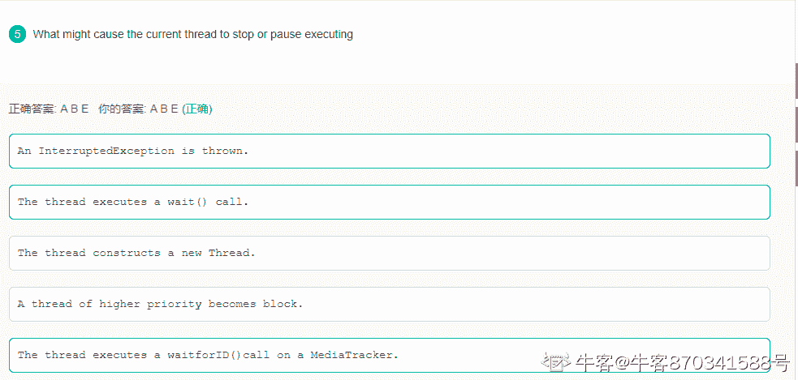
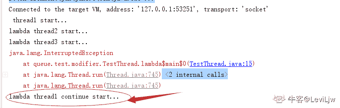
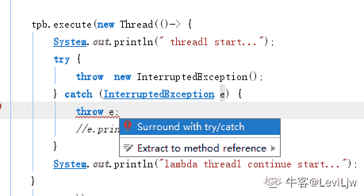

# 【2021】微众银行校招技术类 A 卷

## 1

假定字符集为{a,b,c,d,e,f}，每个字符在文件中的出现次数分别为{16,5,12,17,10,25}，则哪一个字符需要的编码比特位最多（     ）

正确答案: B   你的答案: 空 (错误)

```cpp
a
```

```cpp
b
```

```cpp
c
```

```cpp
f
```

本题知识点

Java 工程师 微众银行 2021 运维工程师 安全工程师 测试开发工程师 测试工程师

讨论

[牛客 272687188 号](https://www.nowcoder.com/profile/272687188)

这个题目没有说用什么编码其实有点问题不过拿无损压缩效率最高的哈夫曼编码的举例来说，频率越低，需要的编码位越多，所以选 B

编辑于 2021-08-23 23:06:35

* * *

[零葬](https://www.nowcoder.com/profile/75718849)

根据频率建立哈夫曼树可以发现 b 和 e 两个字符的编码比特位最多，但是选项中没有 e，所以选 b

编辑于 2021-09-03 14:02:55

* * *

[牛客 158015031 号](https://www.nowcoder.com/profile/158015031)

**哈夫曼的特点**：

1.权值越大的叶子节点越靠近根节点，权值越小的叶子节点越远离根节点。

2.只有度为 0（叶子节点）和度为 2（分支节点）的节点，没有度为 1 的节点。

发表于 2022-03-04 07:17:09

* * *

## 2

如果某图的邻接矩阵是对角线元素均为零的上三角矩阵，则此图是（     ）

正确答案: D   你的答案: 空 (错误)

```cpp
有向完全图
```

```cpp
连通图
```

```cpp
强连通图
```

```cpp
有向无环图
```

本题知识点

Java 工程师 微众银行 2021 运维工程师 安全工程师 测试开发工程师 测试工程师

讨论

[零葬](https://www.nowcoder.com/profile/75718849)

邻接矩阵是上三角阵无疑是有向图，那我们再检查一下有没有可能有环。上三角阵的某一非零元素表示某个编号小的节点到某个编号大的节点是存在边的，如果要形成环，那一定会存在一个编号大的节点指回这个编号小的节点，但是这样的非零元素显然在下三角，与题设矛盾，因此只能是有向无环图。

发表于 2021-09-03 14:37:22

* * *

## 3

哪种模式允许我们在执行过程中观察源代码和变量的同时交互运行程序？

正确答案: B   你的答案: 空 (错误)

```cpp
安全模式
```

```cpp
调试模式
```

```cpp
成功运行模式
```

```cpp
异常模式
```

本题知识点

Java 工程师 微众银行 2021 运维工程师 安全工程师 测试开发工程师 测试工程师

讨论

[零葬](https://www.nowcoder.com/profile/75718849)

用 IDE 进行 debug 的时候就可以在执行过程中观察源代码和变量的同时交互运行程序

发表于 2021-09-03 14:05:02

* * *

## 4

下列关于树的说法，正确的有
①树的终端结点又称为叶子结点
②树的度就是叶子结点的度
③根结点是除自身以外的所有结点的祖先结点
④叶子结点是除自身以外的所有结点的子孙结点

正确答案: A   你的答案: 空 (错误)

```cpp
①③
```

```cpp
①④
```

```cpp
②③
```

```cpp
②④
```

本题知识点

Java 工程师 微众银行 2021 运维工程师 安全工程师 测试开发工程师 测试工程师

讨论

[零葬](https://www.nowcoder.com/profile/75718849)

②树的度应该是树中节点度的最大值④某一分支的叶子节点是不可能为另一分支节点的子孙节点的，并且叶子节点除了自己以外也不能为其他叶子节点的子孙节点

编辑于 2021-09-03 14:34:21

* * *

[牛客 163590005 号](https://www.nowcoder.com/profile/163590005)

树中一个结点的孩子个数称为该节点的度；树中节点的最大度数称为树的度；

发表于 2021-09-29 17:47:57

* * *

## 5

一个元素序列的排序码为{46,79,56,38,40,84}，采用快速排序（以第一个元素为轴点）得到的以此划分结果为（      ）

正确答案: C   你的答案: 空 (错误)

```cpp
{38,46,79,56,40,84}
```

```cpp
{38,79,56,46,40,84}
```

```cpp
{40,38,46,79,56,84}
```

```cpp
{38,46,56,79,40,84}
```

本题知识点

Java 工程师 微众银行 2021 运维工程师 安全工程师 测试开发工程师 测试工程师

讨论

[零葬](https://www.nowcoder.com/profile/75718849)

快排经过一次 partition 应该满足轴点元素左边的元素都比它小，右边的元素都比它大，好像只有 C 满足这一条件，但是 C 的 79 和 56 应该是反了。下面还原一下第一次 partition 的过程 46,79,56,38,40,8484 比 46 大，右指针左移到 40,40 比 46 小，进行一次交换，左指针右移到 7940,79,56,38,46,84
79 又比 46 大，再次交换，右指针左移到 3840,46,56,38,79,84 38 比 46 小，交换，左指针右移到 5640,38,56,46,79,84 最后交换 56 和 46 得到 40,38,46,56,79,84

编辑于 2021-09-03 14:47:35

* * *

[牛客 204336503 号](https://www.nowcoder.com/profile/204336503)

没有正确答案，正确答案应该是 38，40，46，56，79，84 初始 46,79,56,38,40,84 右指针 40  左指针 79  交换后 46,**40**,56,38,**79**,84 右指针 38 左指针 56 交换 46,40,**38,56**,79,84 右指针 38 左指针 56 此时，右指针在左指针的左边 ，交换第一个数和右指针指向的数结果 **38**,40,**46**,56,79,84

发表于 2021-10-18 20:27:31

* * *

[小蔓一定会有心仪 offer](https://www.nowcoder.com/profile/801029538)

轴点左边的比轴点小，轴点右边的应该比轴点大，所以选择 C

发表于 2021-08-27 15:29:17

* * *

## 6

下面关于 TCP 协议的描述，错误的是（      ）

正确答案: D   你的答案: 空 (错误)

```cpp
只能提供点对点服务
```

```cpp
提供可靠交付的服务
```

```cpp
面向字节流
```

```cpp
面向连接的网络层协议
```

本题知识点

Java 工程师 微众银行 2021 运维工程师 安全工程师 测试开发工程师 测试工程师

讨论

[小蔓一定会有心仪 offer](https://www.nowcoder.com/profile/801029538)

是传输层协议~

发表于 2021-08-27 15:31:04

* * *

[牛客 163590005 号](https://www.nowcoder.com/profile/163590005)

Tcp 是面向连接的传输层协议；每条 tcp 连接只能有两个端点，每条 tcp 连接只能是点对点的；tcp 提供可靠的交互服务，保证传送的数据无差错、不丢失、不重复且有序；tcp 是面向字节流的，虽然应用程序和 tcp 的交互是一次一个数据块，但 tcp 把应用程序交下来的数据仅视为一连串的无结构的字节流。

发表于 2021-09-29 17:54:21

* * *

[写 HelloWorld 都有 bug](https://www.nowcoder.com/profile/454015585)

tcp，udp 都是传输层的协议

发表于 2021-09-11 21:11:38

* * *

## 7

可能引起进程挂起的原因有（）

正确答案: C   你的答案: 空 (错误)

```cpp
时间片用完
```

```cpp
就绪队列中有优先级更高的进程
```

```cpp
终端用户或父进程的请求
```

```cpp
申请缓冲空间
```

本题知识点

Java 工程师 微众银行 2021 运维工程师 安全工程师 测试开发工程师 测试工程师

讨论

[]☆~放弃爱❤](https://www.nowcoder.com/profile/6957431)

（1）终端用户的请求。当终端用户在自己的程序运行期间发现有可疑问题时，希望暂停使自己的程序静止下来。亦即，使正在执行的进程暂停执行；若此时用户进 程正处于就绪状态而未执行，则该进程暂不接受调度，以便用户研究其执行情况或对程序进行修改。我们把这种静止状态称为“挂起状态”。
（2）父进程的请求。有时父进程希望挂起自己的某个子进程，以便考察和修改子进程，或者协调各子进程间的活动。
（3）负荷调节的需要。当实时系统中的工作负荷较重，已可能影响到对实时任务的控制时，可由系统把一些不重要的进程挂起，以保证系统能正常运行。
（4）操作系统的需要。操作系统有时希望挂起某些进程，以便检查运行中的资源使用情况或进行记账。

发表于 2021-09-07 15:42:27

* * *

## 8

以下关于属性文法，说法不正确的是()

正确答案: D   你的答案: 空 (错误)

```cpp
属性文法是没有副作用的语法制导翻译
```

```cpp
终结符号可以有综合属性、但不能有继承属性
```

```cpp
一个结点的综合属性只能由其子节点或该节点本身的属性值来定义
```

```cpp
一个结点的继承属性只能通过其兄弟节点的属性值来定义
```

本题知识点

Java 工程师 微众银行 2021 运维工程师 安全工程师 测试开发工程师 测试工程师

## 9

不同的事务交叉执行可能会破坏事务的哪一特性

正确答案: C   你的答案: 空 (错误)

```cpp
atomicity
```

```cpp
consistency
```

```cpp
isolation
```

```cpp
durability
```

本题知识点

Java 工程师 微众银行 2021 运维工程师 安全工程师 测试开发工程师 测试工程师

讨论

[牛客网荷宝](https://www.nowcoder.com/profile/314430003)

A 原子性 要么都执行，要么都不执行 C 一致性 事物执行前后数据库保持一致的正确状态 I 隔离性 不同事务之间互不干扰 D 持久性 事务一旦提交，对数据库中数据的变更是永久的

发表于 2021-08-30 10:20:00

* * *

## 10

若关系中某一属性组的值能唯一地标识一个元组，而其子集不能，则称该属性组为（）

正确答案: C   你的答案: 空 (错误)

```cpp
外码
```

```cpp
内码
```

```cpp
候选码
```

```cpp
连接码
```

本题知识点

Java 工程师 微众银行 2021 运维工程师 安全工程师 测试开发工程师 测试工程师

## 11

下列哪条语句使用方法是正确的（      ）

```cpp
public class Example{
    private float f=1.0f;
    int i=12;
    static int j=1;
    public static void main(String args[]){
        Example test=new Example();
    }
}
```

正确答案: D   你的答案: 空 (错误)

```cpp
test.f = 1.0
```

```cpp
this.j
```

```cpp
Example.i
```

```cpp
Example.j
```

本题知识点

Java 工程师 度小满 2019 微众银行 2021 运维工程师 安全工程师 测试开发工程师 测试工程师

讨论

[Clark🎃](https://www.nowcoder.com/profile/510704576)

main 方法是 static 的哦，在 static 方法里面只能调用 static 的变量或函数哦，所以这里只能调用 Example.jstatic 在对象创建之前就已经写入内存了，所以不能用 this.j 哦

发表于 2019-08-30 14:36:03

* * *

[零葬](https://www.nowcoder.com/profile/75718849)

A：f 是 test 对象的私有属性，不能直接用点获得 B：j 是静态属性，用类名加点获得 C：i 是成员属性，要用对象获得

发表于 2021-09-03 14:09:50

* * *

[coolcz](https://www.nowcoder.com/profile/210003280)

这个题没看明白啊 那你告诉我 我在 main 函数中为什么不能用 this.j?? 另外这个是 java 的题吧？？

发表于 2019-08-27 17:53:00

* * *

## 12

下列代码输出结果为（      ）
class Animal{
    public void move(){
        System.out.println("动物可以移动");
    }
}

class Dog extends Animal{
    public void move(){
        System.out.println("狗可以跑和走");
    }
    public void bark(){
        System.out.println("狗可以吠叫");
    }
}

public class TestDog{
    public static void main(String args[]){
        Animal a = new Animal();
        Animal b = new Dog(); 

        a.move();
        b.move();
        b.bark();
    }
}

正确答案: D   你的答案: 空 (错误)

```cpp
动物可以移动
狗可以跑和走
狗可以吠叫

```

```cpp
动物可以移动
动物可以移动
狗可以吠叫

```

```cpp
运行错误
```

```cpp
编译错误
```

本题知识点

Java 工程师 微众银行 2021 运维工程师 安全工程师 测试开发工程师 测试工程师

讨论

[零葬](https://www.nowcoder.com/profile/75718849)

Dog 的对象被声明成父类 Animal 了，Animal 没有 bark 的方法，通不过编译

发表于 2021-09-03 14:10:58

* * *

[一面试就自信的小昏昏](https://www.nowcoder.com/profile/369482639)

编译看左，运行看右。

发表于 2021-08-24 12:39:57

* * *

[灵魂出窍 Imperio](https://www.nowcoder.com/profile/894727200)

Animal b = new Dog(); 此句使用父类类型，父类没有 bark()方法。会出现编译错误。

发表于 2021-08-28 16:31:53

* * *

## 13

下列程序的输出结果为（      ）
public class Base {
    public static void main(String[] args) {
        int a = 6;
        int b = 0;

        try {
            System.out.println("start");
            a = a / b;
            System.out.println("try");
        } 
        catch (ArithmeticException e) {
            System.out.println("ArithmeticException");
        } 
        catch (Exception e) {
            System.out.println("Exception");
        }

        System.out.println("end");
    }
}

正确答案: D   你的答案: 空 (错误)

```cpp
start
ArithmeticException

```

```cpp
start
Exception
end

```

```cpp
start
ArithmeticException
try
end

```

```cpp
start
ArithmeticException
end

```

本题知识点

Java 工程师 微众银行 2021 运维工程师 安全工程师 测试开发工程师 测试工程师

讨论

[零葬](https://www.nowcoder.com/profile/75718849)

当执行 a/b 的时候就会被范围更小且位于最前面的 ArithmeticException 异常捕获，因此 try 不会再打印，下面范围更大的 Exception 块也不会再执行

发表于 2021-09-03 14:13:44

* * *

[数据大脑](https://www.nowcoder.com/profile/626076379)

按照捕获顺序，前面的先捕获，后面的在无需进行捕获。

发表于 2021-12-21 15:38:55

* * *

## 14

下列代码输出结果为（      ）
public class Test {
    private int age;
    protected String name;    
    public int id;

    public static void main(String[] args) throws NoSuchFieldException {
        Test test = new Test();

        Field[] fields = Test.class.getDeclaredFields();
        for (int i = 0; i < fields.length; i++) {
            fields[i].setAccessible(true);
            System.out.println(fields[i].getName());
        }
    }
}

正确答案: C   你的答案: 空 (错误)

```cpp
age
id

```

```cpp
name
id

```

```cpp
age
name
id

```

```cpp
其他几项都不对
```

本题知识点

Java 工程师 微众银行 2021 运维工程师 安全工程师 测试开发工程师 测试工程师

讨论

[零葬](https://www.nowcoder.com/profile/75718849)

将权限设置为 true 了，每个属性的名称都可以访问到

发表于 2021-09-03 14:14:54

* * *

## 15

在 Java 中，已知类 com.demo1.P 中定义 protected 修饰属性，类 A 和 B 分别在包 com.demo2 中，代码片段如下：
class P{
  protected String name;
}
class A{
   public void m(){
        P p = new P();
       System.out.println(p.name);
   }
}
class B extends P{
  public void m(){
      System.out.println(this.pname);
  }
}
阅读上述代码，下面分析中说法正确的是？

正确答案: B   你的答案: 空 (错误)

```cpp
类 A 中代码可以正常执行，可以直接访问 protected 属性
但是类 B 中编译错误

```

```cpp
类 A 中代码编译错误，不能访问不同包的类中 protected 属性
类 B 中可以通过编译，因为子类可以访问父类 protected 方法

```

```cpp
类 B 中代码编译错误，因为不同包中类不能直接访问
类 A 中编译错误

```

```cpp
类 A 类 B 中代码都可以编译通过
```

本题知识点

Java 工程师 微众银行 2021 运维工程师 安全工程师 测试开发工程师 测试工程师

讨论

[零葬](https://www.nowcoder.com/profile/75718849)

如果 B 不是继承了 P，也无法访问 protected 的属性，protected 的属性需要同一个包下或者其子类才能访问

发表于 2021-09-03 14:17:05

* * *

[牛客 263896786 号](https://www.nowcoder.com/profile/263896786)

这题有问题，B 打印的 pname 而不是 name，所以咋都是错的

发表于 2021-10-25 10:46:01

* * *

[牛客 670970410 号](https://www.nowcoder.com/profile/670970410)

大意了。以为一个包下

发表于 2021-08-25 11:41:51

* * *

## 16

public class Test{

private void test() {
  System.out.println(1 + 1 + "wow!");
}

static public void main(String[] a) {
  new Test().test();
}

}
上面程序段输出结果为（）

正确答案: A   你的答案: 空 (错误)

```cpp
2wow!
```

```cpp
11wow!
```

```cpp
编译错误
```

```cpp
1+1+1wow！
```

本题知识点

Java 工程师 微众银行 2021 运维工程师 安全工程师 测试开发工程师 测试工程师

讨论

[零葬](https://www.nowcoder.com/profile/75718849)

这个题就是 1+1=2 之后把这个 2 和后面 wow 相加时变成字符串连接了

发表于 2021-09-03 14:17:58

* * *

## 17

给文本框增加文本监视器的方法是（）

正确答案: A   你的答案: 空 (错误)

```cpp
addTextListener（TextListener）
```

```cpp
setTextListener（TextListener）
```

```cpp
addListener（TextListener）
```

```cpp
setListener（TextListener）
```

本题知识点

Java 工程师 微众银行 2021 运维工程师 安全工程师 测试开发工程师 测试工程师

## 18

下列选项中，哪一项的描述是正确的（）

正确答案: D   你的答案: 空 (错误)

```cpp
成员变量的名字不可以和局部变量的相同
```

```cpp
方法的形参名字可以和方法中声明的局部变量的名字相同
```

```cpp
成员变量没有默认值
```

```cpp
局部变量没有默认值
```

本题知识点

Java 工程师 微众银行 2021 运维工程师 安全工程师 测试开发工程师 测试工程师

讨论

[苏大大要写代码](https://www.nowcoder.com/profile/5658293)

局部变量在创建的时候 会赋初值

发表于 2021-09-16 12:29:21

* * *

## 19

接口中的属性默认是哪些修饰符修饰（      ）

正确答案: A B C   你的答案: 空 (错误)

```cpp
public
```

```cpp
static
```

```cpp
final
```

```cpp
abstract
```

本题知识点

Java 工程师 微众银行 2021 运维工程师 安全工程师 测试开发工程师 测试工程师

讨论

[sungalaxy](https://www.nowcoder.com/profile/720122324)

是属性，不是方法属性（变量）：公共静态 final 方法：公共抽象

发表于 2021-09-10 19:43:08

* * *

[牛客 880443227 号](https://www.nowcoder.com/profile/880443227)

接口中的属性只能是 final，而且是 public static final,属性也必须初始化。

发表于 2021-09-23 15:41:49

* * *

## 20

下列哪些情况下会导致线程中断或停止运行（      ）

正确答案: B   你的答案: 空 (错误)

```cpp
InterruptedException 异常被捕获
```

```cpp
线程调用了 wait 方法
```

```cpp
当前线程创建了一个新的线程
```

```cpp
高优先级线程进入就绪状态
```

本题知识点

Java 工程师 C++工程师 度小满 Java 2019 微众银行 2021 运维工程师 安全工程师 测试开发工程师 测试工程师

讨论

[我的天鸭](https://www.nowcoder.com/profile/243498)

A 选项正确，Java 中一般通过 interrupt 方法中断线程 B 选项正确，线程使用了 wait 方法，会强行打断当前操作，进入阻塞（暂停）状态，然后需要 notify 方法或 notifyAll 方法才能进入就绪状态 C 选项错误，新创建的线程不会抢占时间片，只有等当前线程把时间片用完，其他线程才有资格拿到时间片去执行。D 选项错误，调度算法未必是剥夺式的，而准备就绪但是还没有获得 CPU，它的权限更高只能说明它获得 CPU 被执行的几率更大而已

发表于 2019-08-21 17:37:48

* * *

[牛客 870341588 号](https://www.nowcoder.com/profile/870341588)

关于 A 选项

*   ```cpp
    InterruptedException 异常被捕获
    ```


貌似找到原题了我怀疑是出题人翻译问题英文原题 A 选项是：抛出 Interruption 异常，并没有说捕获，所以 A 会导致线程停止

编辑于 2021-06-05 12:35:08

* * *

[LeviLjw](https://www.nowcoder.com/profile/2782666)

```cpp
 public static void main(String[] args) {
        ExecutorService tpb  = Executors.newFixedThreadPool(3);

        tpb.execute(new Thread(()-> {
            System.out.println(" thread1 start...");
            try {
                throw  new InterruptedException();
            } catch (InterruptedException e) {
                e.printStackTrace();
            }
            System.out.println("lambda thread1 continue start...");
        }
                ));
        tpb.execute(new Thread(()-> System.out.println("lambda thread2 start...")));
        tpb.execute(new Thread(()-> System.out.println("lambda thread3 start...")));

    }
```

A 答案，异常捕获处理了，程序是继续执行的，题的问题吧，我如果在捕获代码里继续抛异常，程序是会中断的，如果做了处理，就会继续执行
这里还要继续处理，如果觉得我的回答有问题，希望回复

发表于 2020-01-04 09:14:37

* * *

## 21

假象一个绝对光滑的，高度很高的盒子，长度为，宽度为 1。在其中，有许多的光滑铁块，铁块的每一个角一定位于整数坐标上。

由于宽度为 1，我们可以用二维字符图来表示每一个铁块的位置。如下图是一个长度为 4，其中有 7 个铁块的二维字符图（'x'代表铁块，'o'代表没有铁块）：

oooo
xooo
xoxo
xxxx

每一列的铁块数分别为 3,1,2,1

由于重力的缘故，所有的铁块要么下面是盒子底面，要么下面是另一个铁块。现在，在盒子的右边增加一个强磁铁。所有右边没有其他铁块或边界的铁块会向右移动，直到撞上一个铁块和边界停下。

在上一张二维图上，加入磁铁后的字符图会变为：

oooo

ooox

ooxx

xxxx

每一列的铁块数分别为。可以证明，这样操作后所有铁块要么下面是盒子底面，要么下面是另一个铁块。
现在给你初始每一列有多少个铁块，请你计算，加入磁铁后每一列有多少铁块。

本题知识点

Java 工程师 微众银行 2021 运维工程师 安全工程师 测试开发工程师 测试工程师

讨论

[零葬](https://www.nowcoder.com/profile/75718849)

其实根据物理知识，肯定就是最右边的磁铁最多，然后依次往左边单调不增，排个序就好了。

```cpp
import java.io.BufferedReader;
import java.io.InputStreamReader;
import java.io.IOException;
import java.util.Arrays;

public class Main {
    public static void main(String[] args) throws IOException {
        BufferedReader br = new BufferedReader(new InputStreamReader(System.in));
        int n = Integer.parseInt(br.readLine());
        String[] strArr = br.readLine().trim().split(" ");
        int[] arr = new int[n];
        for(int i = 0; i < n; i++) arr[i] = Integer.parseInt(strArr[i]);
        Arrays.sort(arr);
        for(int i = 0; i < n; i++) System.out.print(arr[i] + " ");
    }
}
```

python 版

```cpp
n = int(input())
print(' '.join(list(map(str, sorted(list(map(int, input().split())))))))
```

编辑于 2021-09-02 15:33:25

* * *

[牛客 85762678 号](https://www.nowcoder.com/profile/85762678)

```cpp
import java.util.*;
public class Main{
    public static void main(String args[])
    {
        Scanner in=new Scanner(System.in);
        int n=in.nextInt();
        int a[]=new int[n];int i=0;
        while(in.hasNextInt())
        {

            a[i]=in.nextInt();
            i++;

        }
        Arrays.sort(a);
        for(int ii:a)
        {
            System.out.print(ii+" ");
        }

    }
}

```

发表于 2021-08-25 10:00:58

* * *

[Sushine](https://www.nowcoder.com/profile/918496688)

```cpp
import java.io.BufferedReader;
import java.io.IOException;
import java.io.InputStreamReader;
import java.util.Arrays;

public class Main {
    public static void main(String[] args) throws IOException {
        BufferedReader br = new BufferedReader(new InputStreamReader(System.in));
        int n = Integer.parseInt(br.readLine());
        String[] sp = br.readLine().split(" ");
        int[] arr = new int[n];
        for (int i = 0; i < sp.length; i++) {
            arr[i] = Integer.parseInt(sp[i]);
        }
        Arrays.sort(arr);
        for (int i : arr) {
            System.out.print(i + " ");
        }
    }
}
```

发表于 2021-09-21 19:14:41

* * *

## 22

平面上有一个矩形，大小为 n×m，其中，长度为 n 的边是竖直的，长度为 m 的边是水平的。将矩形切割成 n×m 个小正方形，规定左上角的小正方形坐标为,左下角的小正方形坐标为,右上角的小正方形坐标为,右下角的小正方形坐标为。从上往下数第 x 行，从左往右数第列的小正方形坐标为(x,y).

现在，我们对这个矩形进行如下操作，将其顺时针旋转 90 度 x 次，然后将其水平翻转 y 次，然后将其逆时针旋转 90 度 z 次。

接着，我们将这个操作后的矩形重新标上坐标，每一个小正方形就有一个原来的坐标和新的坐标。

然后有 Q 个询问，每一次询问一个原来坐标为的小正方形的新坐标。你需要对所有询问作出回答。

本题知识点

Java 工程师 微众银行 2021 运维工程师 安全工程师 测试开发工程师 测试工程师

讨论

[零葬](https://www.nowcoder.com/profile/75718849)

进行一次顺时针旋转，原来第**i**行就变成倒数第**i**列，第**j**列就变成第**j**行，逆时针旋转相反；水平反转仅将原来第**j**列变成倒数第**j**列。直接坐标变换就行，但是我们注意到一个细节，逆时针或顺时针旋转 4 次相当于没转，水平反转 2 次相当于没转，因此可以通过取模进一步降低时间复杂度。

```cpp
import java.io.BufferedReader;
import java.io.InputStreamReader;
import java.io.IOException;

public class Main {
    public static int n;
    public static int m;
    public static void main(String[] args) throws IOException {
        BufferedReader br = new BufferedReader(new InputStreamReader(System.in));
        String[] params = br.readLine().trim().split(" ");
        int x = Integer.parseInt(params[0]);
        int y = Integer.parseInt(params[1]);
        int z = Integer.parseInt(params[2]);
        params = br.readLine().trim().split(" ");
        int rows = Integer.parseInt(params[0]);
        int cols = Integer.parseInt(params[1]);
        int q = Integer.parseInt(br.readLine());
        for(int i = 0; i < q; i++){
            n = rows;
            m = cols;
            params = br.readLine().trim().split(" ");
            int x1 = Integer.parseInt(params[0]);
            int x2 = Integer.parseInt(params[1]);
            int[] pos = new int[]{x1, x2};
            pos = antiClockwise(flip(clockwise(pos, x), y), z);
            System.out.println(pos[0] + " " + pos[1]);
        }
    }

    private static int[] clockwise(int[] pos, int times){
        times %= 4;
        while(times-- > 0){
            // 每旋转一次会行列尺寸互换
            n = n ^ m;
            m = n ^ m;
            n = n ^ m;
            // 坐标变换
            int temp = m - pos[0] + 1;
            pos[0] = pos[1];
            pos[1] = temp;
        }
        return pos;
    }

    private static int[] flip(int[] pos, int times){
        if(times % 2 == 1)
            pos[1] = m - pos[1] + 1;
        return pos;
    }

    private static int[] antiClockwise(int[] pos, int times){
        times %= 4;
        while(times-- > 0){
            n = n ^ m;
            m = n ^ m;
            n = n ^ m;
            int temp = pos[0];
            pos[0] = n - pos[1] + 1;
            pos[1] = temp;
        }
        return pos;
    }
}
```

发表于 2021-09-02 14:12:18

* * *

[牛客 219166328 号](https://www.nowcoder.com/profile/219166328)

c++版本 坐标变换

```cpp
#include<bits/stdc++.h>
using namespace std;
void cycle(pair<int,int> shape,pair<int,int> &position,int time)
{
    for(int i=1;i<time+1;i++)
    {
    int row=shape.first;
    int cow=shape.second;
    if(i%2==0)
    {
        swap(row,cow);
    }
    int temp=position.second;
    position.second=row-position.first+1;
    position.first=temp;
    }
}
void revesecycle(pair<int,int> shape,pair<int,int> &position,int time)
{
    for(int i=1;i<time+1;i++)
    {
    int row=shape.first;
    int cow=shape.second;
    if(i%2==0)
    {
        swap(row,cow);
    }
    int temp=position.first;
    position.first=cow-position.second+1;
    position.second=temp;
    }
}
void mirror(pair<int,int>shape,pair<int,int> &position,int time)
{
    if(time%2==0)
    {
        return ;
    }
    else
    {
        position.second=shape.second-position.second+1;
        return ;
    }
}
int main()
{
    int exce[3];
    for(int i=0;i<3;i++)
    {
        cin>>exce[i];
    }
    pair<int,int> shape;
    cin>>shape.first;
    int row=shape.first;
    cin>>shape.second;
    int cow=shape.second;
    int nums;
    cin>>nums;
    for(int i=0;i<nums;i++)
    {
        shape.first=row;
        shape.second=cow;
        pair<int,int> temp;
        cin>>temp.first>>temp.second;
        cycle(shape,temp,exce[0]);
        if(exce[0]%2==1)
        {
            swap(shape.first,shape.second);
        }
        mirror(shape,temp,exce[1]);
        revesecycle(shape,temp,exce[2]);
        cout<<temp.first<<' '<<temp.second<<endl;
    }
    return
``` 

发表于 2021-10-28 11:30:18

* * *

## 23

给你一个长度为 n 的序列 A，你需要算出有多少个三元组(A[i，]A[j,]A[k])满足 i<j<k 且 Ai![]Aj![]A[k]。

本题知识点

Java 工程师 微众银行 2021 运维工程师 安全工程师 测试开发工程师 测试工程师

讨论

[零葬](https://www.nowcoder.com/profile/75718849)

这个题我真的服了，10 个测试用例只有一个是示例中按空格分隔数组的格式，还有 9 个都是把数组换行输入的，对于我这种喜欢用缓冲流读取数据的考生真是神坑，只能用 Scanner 了这个题思路不是很难，主要就是遍历数组，让数组中的元素挨个成为三元组的中间元素，然后用二分法寻找小于等于它和大于等于它的数，构成单调不减的三元组。

```cpp
import java.util.Scanner;
import java.util.ArrayList;
import java.util.Collections;

public class Main {
    public static void main(String[] args) {
        Scanner sc = new Scanner(System.in);
        int n = sc.nextInt();
        ArrayList<Integer> used = new ArrayList<>();       // 已使用数据
        ArrayList<Integer> standby = new ArrayList<>();    // 待使用数据
        int[] arr = new int[n + 1];
        for(int i = 0; i < n; i++) {
            arr[i + 1] = sc.nextInt();
            if(i == 0)
                used.add(arr[i + 1]);
            else
                standby.add(arr[i + 1]);
        }
        Collections.sort(standby);
        long res = 0L;
        for(int i = 2; i <= n; i++){
            // 以 arr[i]作为中间数
            int minIdx = upper_bound(used, arr[i]);       // 从小索引的数据中找到第一个大于 arr[i]的位置
            int maxIdx = lower_bound(standby, arr[i]);    // 从大索引的数据中找到第一个大于等于 arr[i]的位置
            long count1 = minIdx;                         // minIdx 前面的数都可以作为三元组的最小数
            long count2 = standby.size() - maxIdx - 1;    // maxIdx 后面的数都可以作为三元组的最大数
            res += count1 * count2;          // 累加上以 arr[i]为中间数时的三元组数
            used.add(minIdx, arr[i]);
            standby.remove(maxIdx);
        }
        System.out.println(res);
    }

    private static int lower_bound(ArrayList<Integer> list, int target) {
        int left = 0;
        int right = list.size() - 1;
        int res = right + 1;
        while(left <= right){
            int mid = (left + right) >> 1;
            if(list.get(mid) >= target){
                right = mid - 1;
                res = mid;
            }else{
                left = mid + 1;
            }
        }
        return res;
    }

    private static int upper_bound(ArrayList<Integer> list, int target) {
        int left = 0;
        int right = list.size() - 1;
        int res = right + 1;
        while(left <= right){
            int mid = (left + right) >> 1;
            if(list.get(mid) > target){
                right = mid - 1;
                res = mid;
            }else{
                left = mid + 1;
            }
        }
        return res;
    }
}
```

编辑于 2021-09-03 13:24:05

* * *

[C.C.K.](https://www.nowcoder.com/profile/522736177)

归并排序

发表于 2021-08-26 10:29:52

* * *

[牛客 658970523 号](https://www.nowcoder.com/profile/658970523)

```cpp

```
 ```cpp
import java.io.*; 
public  class Main{
        public static void main(String[] args) throws Exception {
            BufferedReader br=new BufferedReader(new InputStreamReader(System.in));
            int n= Integer.parseInt(br.readLine());
            int[] arr=new int[n];
            String[] sp=br.readLine().split(" ");
            for (int i = 0; i <n ; i++) {
                arr[i]=Integer.parseInt(sp[i]);
            }
            int ans= process(3,0,Integer.MAX_VALUE,arr);
            System.out.println(ans);
        }
        public static int process(int rest , int i , int preChose , int[] arr){
            if (rest==0){
                return 1;
            }
            if (i>=arr.length){
                return 0;
            }
            if (preChose!=Integer.MAX_VALUE&& preChose>arr[i]){
                return 0;
            }
            int res=0;//返回的答案
            int p1=process(rest-1,i+1,arr[i],arr);
            int p2=process(rest,i+1,preChose,arr);
            res=p1+p2;
            return res;
        }
    }

``` 
```cpp

```

发表于 2022-02-03 20:16:53

* * *