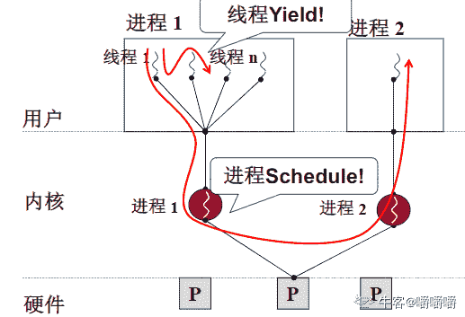
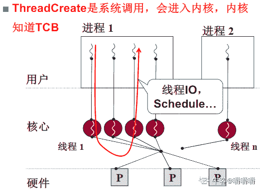
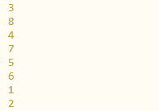

# 【2022】Shopee 秋招提前批 FE 笔试

## 1

以下网段最能精确包含 10.100.21.0/24,10.100.22.0/24,10.100.23.0/24 的是

正确答案: C   你的答案: 空 (错误)

```cpp
10.100.16.0/21
```

```cpp
10.100.16/22
```

```cpp
10.100.20/22
```

```cpp
10.100.20/23
```

本题知识点

前端工程师 Shopee

讨论

[牛客 136568685 号](https://www.nowcoder.com/profile/136568685)

10.100.21.0/24,10.100.22.0/24,10.100.23.0/24 21:0001010122:0001011023:00010111 变化的只有后两位, --> 网络前缀 = 8 + 8 + 6 = 22 --> 000101 = 20 -> 10.100.20/22

发表于 2021-08-26 11:47:31

* * *

## 2

Array 实例的方法不包括

正确答案: B   你的答案: 空 (错误)

```cpp
copyWithin
```

```cpp
length
```

```cpp
reverse
```

```cpp
toString
```

本题知识点

前端工程师 Shopee

讨论

[嚼嚼嚼](https://www.nowcoder.com/profile/287192684)

length 是属性不是方法 reverse 和 toString 是常见的方法 copyWithin() 方法用于从数组的指定位置拷贝元素到数组的另一个指定位置中。

发表于 2021-08-27 18:58:11

* * *

[迷途小学生](https://www.nowcoder.com/profile/246775)

length 是属性

发表于 2021-11-17 14:58:43

* * *

## 3

以下关于 js 的说法正确的是

正确答案: D   你的答案: 空 (错误)

```cpp
Symbol()函数会返回 symbol 类型的值，a=Symbol(1)和 b=Symbol(1)，a 与 b 是相等的。
```

```cpp
Proxy 可实现对象的调用拦截。一个 proxy 的对象，我们可以通过 instanceof 来判断其是否是 proxy 对象。
```

```cpp
调用正则对象的 test()匹配后，可通过 RegExp.$n 来查看正则的第 N 组匹配分组而无限制。
```

```cpp
a = function(x, y) { return x+y; }创建的函数，a.name 返回的函数名是"a"。
```

本题知识点

前端工程师 Shopee

讨论

[国王 KING221](https://www.nowcoder.com/profile/590048183)

A 选项：Symbol 确保唯一，即使采用相同的名称，也会产生不同的值。a 与 b 并不会相等。B 选项： 无法确定对象是否是 proxy 对象（透明虚拟化）👉[`exploringjs.com/es6/ch_proxies.html#sec_proxies-explained`](https://exploringjs.com/es6/ch_proxies.html#sec_proxies-explained)C 选项： 括号匹配项是无限的, 但是 RegExp 对象能捕获的只有九个👉[`developer.mozilla.org/zh-CN/docs/Web/JavaScript/Reference/Global_Objects/RegExp/n`](https://developer.mozilla.org/zh-CN/docs/Web/JavaScript/Reference/Global_Objects/RegExp/n)

发表于 2021-12-11 15:23:40

* * *

[嚼嚼嚼](https://www.nowcoder.com/profile/287192684)

火狐、safari、谷歌和 Opera 浏览器都给函数定义了一个非标准的 name 属性，通过这个属性可以访问到给函数指定的名字，匿名函数的 name 属性是空字符串

发表于 2021-08-27 19:01:22

* * *

## 4

正则表达式不能进行下面哪个操作？

正确答案: D   你的答案: 空 (错误)

```cpp
替换所有数字。
```

```cpp
将最外层成对双引号（"）内的字符解析出来。
```

```cpp
替换字符串内的所有 ABC/Abc/abc 为空字符串。
```

```cpp
检查字符串内的括号是否成对出现。
```

本题知识点

前端工程师 Shopee

## 5

某主机的 IP 地址为 180.80.77.55，子网掩码为 255.255.252.0。若该主机向其所在子网发送广播分组，则目的地址是

正确答案: D   你的答案: 空 (错误)

```cpp
180.80.76.0
```

```cpp
180.80.77.0
```

```cpp
180.80.77.255
```

```cpp
180.80.79.255
```

本题知识点

前端工程师 Shopee

讨论

[牛客 438821193 号](https://www.nowcoder.com/profile/438821193)

由子网掩码 255.255.252.0（11111111.11111111.11111100.00000000）可知网络为连续的 1，那么主机位为连续的 0，也就是 10 位，然后题目要发送广播分组，所以求的是广播地址，广播地址的主机位也是全为 1，所以主机 180.80.77.55 所在的广播地址就是 180.80.010011（11.11111111），括号里面的是主机号，主机号全为 1 就是广播地址，即 180.80.79.255

 发表于 2021-08-25 09:59:15

* * *

## 6

操作系统内核不能调度以下哪一项？

正确答案: B   你的答案: 空 (错误)

```cpp
内核级线程
```

```cpp
用户级线程
```

```cpp
进程
```

```cpp
以上都不是
```

本题知识点

前端工程师 Shopee

讨论

[嚼嚼嚼](https://www.nowcoder.com/profile/287192684)

左图为用户级线程，右图为核心级线程，操作系统不能调度用户级线程

编辑于 2021-08-27 19:08:40

* * *

## 7

以下代码输出顺序是：setImmediate(() => {  console.log(1);  Promise.resolve().then(() => {    console.log(2);  });}, 0);new Promise((resolve) => {  console.log(3);  resolve();}).then(() => {  console.log(4);  process.nextTick(() => {    console.log(5)  });  setTimeout(() => {    console.log(6);  }, 0);}).then(() => {  console.log(7);});console.log(8);

正确答案: D   你的答案: 空 (错误)

```cpp
8,3,4,7,5,1,6,2
```

```cpp
8,3,4,5,7,1,6,2
```

```cpp
3,8,4,5,7,1,2,6
```

```cpp
3,8,4,7,5,1,2,6
```

本题知识点

前端工程师 Shopee

讨论

[牛客 789741155 号](https://www.nowcoder.com/profile/789741155)

setImmediate 方法用来把一些需要长时间运行的操作放在一个回调函数里,在浏览器完成后面的其他语句后,就立刻执行这个回调函数,该方法可以用来替代 setTimeout(0) 方法来滞后完成一些需要占用大量 cpu 时间的操作. 

发表于 2021-09-28 19:41:19

* * *

[牛客 460564317 号](https://www.nowcoder.com/profile/460564317)

我输出的结果在选项中没有啊

发表于 2021-08-25 20:41:00

* * *

[超努力](https://www.nowcoder.com/profile/119865990)

我放在 vue 项目中运行结果是 38471256

发表于 2021-12-27 15:32:22

* * *

## 8

用某种排序方法对关键字排序（25 、84、21、47、15、27、68、35、20）进行排序时，序列的变化情况如下：20、15、21、25、47、27、68、35、8415、20、21、25、35、27、47、68、8415、20、21、25、27、35、47、68、84 则采用的排序方法是哪种排序？

正确答案: B   你的答案: 空 (错误)

```cpp
选择排序
```

```cpp
快速排序
```

```cpp
归并排序
```

```cpp
希尔排序
```

本题知识点

前端工程师 Shopee

讨论

[苏里苏里](https://www.nowcoder.com/profile/7163773)

25 是基准，比基准小的放左边，比基准大的放右边

发表于 2021-08-30 21:01:12

* * *

[MOSIAW](https://www.nowcoder.com/profile/631295796)

84 不会在最后吧，执行一次应该在 25 的后一位

发表于 2021-12-27 23:56:19

* * *

## 9

现有如下结构: html    <html>      <style>        body {          width: 1000px;          height: 500px;          padding: 100px;        }        .out {          width: 200px;          height: 100px;          padding: 10%;        }        .inner {          width: 100px;          height: 50px;          padding: 10%;        }      </style>      <body>        <div class="out">          <div class="inner">inner</div>        </div>      </body>    <html>请问: inner 所在盒模型的 padding 值是?

正确答案: C   你的答案: 空 (错误)

```cpp
1px
```

```cpp
10px
```

```cpp
20px
```

```cpp
30px
```

本题知识点

前端工程师 Shopee

讨论

[Roman_](https://www.nowcoder.com/profile/60637121)

这个题考了 css 包含块的概念，当我们对一个元素指定百分比的数值时，这些值的计算值，就是通过元素的包含块计算得来。    1.如果 position 属性为 **static** 、**relative**或** sticky，**包含块就是该元素最近的祖先块级元素的 content 决定    2.如果 position 属性为 **absolute、fixed，包含块还要额外算上 padding，**即 content + padding。例 1: 包含块为 content 区域 组成 ```cpp
<style>
    .box {
      position: relative;
      width: 200px;
      height: 200px;
      padding: 10px;;
    }
    .inbox {
      /* position 为 relative, 包含块就是 box 的 content  */
      position: relative; 
      /* 200 * 0.5 = 100px */
      width: 50%;
      height: 50%;
    }
  </style>

<div class="box">
    <div class="inbox">
    </div>
</div>
```

例 2: 包含块由 content + padding 组成 ```cpp
  <style>
    .box {
      position: relative;
      width: 200px;
      height: 200px;
      padding: 10px;;
    }
    .inbox {
      /* 是 absolute, 包含块就是 box 的 content + padding  */
      position: absolute; 
      /* (200 + 10 * 2) * 0.5 = 110px */
      width: 50%;
      height: 50%;
    }
  </style>

<div class="box">
  <div class="inbox">
  </div>
</div>
``` 

发表于 2021-09-03 08:44:47

* * *

[嚼嚼嚼](https://www.nowcoder.com/profile/287192684)

padding 值为百分比时，其值是基于其父元素的宽度（width，不包含 padding 和 border）来定义的 ```cpp
.out {

		    width: 200px;

		}

		.inner {

		    padding: 10%;

		}

```

所以 inner 的 padding 值=200*10%=20px 

编辑于 2021-08-27 19:27:34

* * *

## 10

Cache-Control 被用于在 http 请求和响应中，通过指定指令来实现缓存机制。以下哪个说法是错的？

正确答案: D   你的答案: 空 (错误)

```cpp
如果指定 max-age 值为 0，那么每次请求都需要重新发到服务器。
```

```cpp
如果设置了 no-cache，表示每次请求，缓存会将此请求发到服务器验证是否过期，若未过期，则缓存才使用本地缓存副本。
```

```cpp
public 指令表明响应可以被任何中间人缓存，即使是通常不可缓存的内容。
```

```cpp
must-revalidate 指令表明即使未超过 max-age，也必须与服务器重新校验之后才能使用缓存。
```

本题知识点

前端工程师 Shopee

讨论

[Roman_](https://www.nowcoder.com/profile/60637121)

must-revalidate 表示缓存过期后必须重新向服务器验证

发表于 2021-09-03 09:04:56

* * *

## 11

以下哪些属于使用虚拟 DOM 的好处

正确答案: B C D   你的答案: 空 (错误)

```cpp
比直接操作 DOM 性能更高
```

```cpp
跨平台
```

```cpp
只需要操作数据，开发效率更高
```

```cpp
通过 DOM diff 算法，可减少不必要的 DOM 操作
```

本题知识点

前端工程师 Shopee

讨论

[夜寻极光。](https://www.nowcoder.com/profile/868966489)

优点：

保证性能下限： 框架的虚拟 DOM 需要适配任何上层 API 可能产生的操作，它的一些 DOM 操作的实现必须是普适的，所以它的性能并不是最优的；但是比起粗暴的 DOM 操作性能要好很多，因此框架的虚拟 DOM 至少可以保证在你不需要手动优化的情况下，依然可以提供还不错的性能，即保证性能的下限；
无需手动操作 DOM： 我们不再需要手动去操作 DOM，只需要写好 View-Model 的代码逻辑，框架会根据虚拟 DOM 和 数据双向绑定，帮我们以可预期的方式更新视图，极大提高我们的开发效率；
跨平台： 虚拟 DOM 本质上是 JavaScript 对象,而 DOM 与平台强相关，相比之下虚拟 DOM 可以进行更方便地跨平台操作，例如服务器渲染、weex 开发等等。
缺点:

无法进行极致优化： 虽然虚拟 DOM + 合理的优化，足以应对绝大部分应用的性能需求，但在一些性能要求极高的应用中虚拟 DOM 无法进行针对性的极致优化。
首次渲染大量 DOM 时，由于多了一层虚拟 DOM 的计算，会比 innerHTML 插入慢。

发表于 2021-09-01 10:44:10

* * *

## 12

下面关于 position 的值，其定位原点说法正确的是

正确答案: A B D   你的答案: 空 (错误)

```cpp
static 没有定位，元素出现在正常的流中
```

```cpp
relative 生成相对定位的元素，相对于其正常位置进行定位
```

```cpp
fixed 生成绝对定位的元素，相对于浏览器窗口进行定位，是默认值
```

```cpp
absolute 生成绝对定位的元素，相对于 static 定位以外的第一个父元素进行定位
```

本题知识点

前端工程师 Shopee

讨论

[牛客 161991501 号](https://www.nowcoder.com/profile/161991501)

fixed 好像不是默认值吧

发表于 2021-12-10 19:08:34

* * *

[牛客 848219841 号](https://www.nowcoder.com/profile/848219841)

默认值是 static。

发表于 2022-01-30 10:05:46

* * *

[weirdo-](https://www.nowcoder.com/profile/221603403)

fixed 不是默认值

发表于 2021-08-31 21:53:34

* * *

## 13

以下描述正确的是

正确答案: A B D   你的答案: 空 (错误)

```cpp
线程可提高程序的并发执行，可提高系统效率
```

```cpp
一个线程可创建多个线程
```

```cpp
系统支持线程和用户级线程，都需要内核的支持完成切换
```

```cpp
线程间可使用信号量来实现同步
```

本题知识点

前端工程师 Shopee

## 14

以下浏览器与浏览器前缀对应关系中，哪些是错误的？

正确答案: A B   你的答案: 空 (错误)

```cpp
Internet Explorer: -moz-
```

```cpp
Firefox: -ms-
```

```cpp
Opera: -o-
```

```cpp
Chrome, Safari: -webkit-
```

本题知识点

前端工程师 Shopee

讨论

[夜寻极光。](https://www.nowcoder.com/profile/868966489)

火狐                                 -moz-谷歌、苹果、360             -webkit-欧朋                                 -o-ie                                     -ms-

发表于 2021-09-01 15:17:54

* * *

[牛客 840047813 号](https://www.nowcoder.com/profile/840047813)

浏览器名称         内核             简称 Mozilla firefox    gecko           -mozOpera                presto           -OChrome             webkit           -webkitSafari                 webkit           -webkitIE                       trient             -ms

发表于 2021-10-06 20:09:40

* * *

[牛客 583246413 号](https://www.nowcoder.com/profile/583246413)

火狐                                 -ms-谷歌、苹果、360             -webkit-欧朋                                 -o-ie                                    -moz-

发表于 2021-09-10 17:13:23

* * *

## 15

关于 Javascript 执行引擎描述正确的是?

正确答案: A B D   你的答案: 空 (错误)

```cpp
Node.js 通过 libuv 抽象封装层不同平台使用不同方法实现异步 I/O，windows 是 IOCP，*nix 是自定义线程池
```

```cpp
V8 作为最先进的 Javascript 执行引擎, 执行阶段先生成字节码，再在运行过程中逐步将高频函数转化成优化后的机器码
```

```cpp
Node.js 的 Buffer 类型对象在创建时内存会分配到 V8 堆上
```

```cpp
代码正确的情况下，垃圾回收也会导致有内存无法回收
```

本题知识点

前端工程师 Shopee

讨论

[牛客 789741155 号](https://www.nowcoder.com/profile/789741155)

Buffer 所占用的内存不是通过 V8 分配的，属于堆外内存。

发表于 2021-09-28 20:21:38

* * *

## 16

将输入的变量名转换为小驼峰写法

可能的输入命名格式如下：

TestVariable

test_variable

TEST_VARIABLE，

最终输出为 testVariable 数据范围：输入的字符串长度满足 
进阶：空间复杂度  ， 时间复杂度 

本题知识点

前端工程师 Shopee

讨论

[JChaosW](https://www.nowcoder.com/profile/549714960)

```cpp
char* format(char* name ) {
    int i;//原字符串长度计步
    int j;//新字符串长度计步
    char out1[30];

    out1[0]=name[0];
    if(name[0]<='Z'&&name[0]>='A')
    {
        out1[0]=name[0]+32;
    }//更改首字母

    for(i=1,j=1;i<=strlen(name);i++,j++)//从第二位开始检查
    {
        out1[j]=name[i];
        if(name[i]>='A'&&name[i]<='Z')
        {
            if(name[i-1]>='A'&&name[i-1]<='Z')
                out1[j]=name[i]+32;
        }//大写改小写
        else if(name[i]=='_')
        {
            i++;
            out1[j]=name[i];
            if(name[i]>='a'&&name[i]<='z')
                out1[j]=name[i]-32;//小写改大写
        }
    }
    return out1;
}

```

为什么我要用 c 来做这个题呢

发表于 2021-08-27 11:28:56

* * *

[嚼嚼嚼](https://www.nowcoder.com/profile/287192684)

```cpp
function format( name ) {
    if(!name) return "";
    //用下划线来分割字符串，存放在一个数组中
    var arr=name.split("_");
    var arrLen=arr.length;
    var result="";
    //arr 的长度为 1 表示没有下划线的输入情况
    if(arrLen===1){
        //只需把首字母改为小写
        result=name[0].toLowerCase();
        result+=name.substr(1);
    }else{
        //有下划线且全为小写字母的输入情况
        if(name[0]>="a"&&name[0]<="z"){
            for(let i=1;i<arrLen;i++){
                //只需把每个单词的首字母改为大写
                arr[i]=arr[i][0].toUpperCase()+arr[i].substr(1);
            }
            result=arr.join("");
        }else if(name[0]>="A"&&name[0]<="Z"){
            //有下划线且全为大写字母的输入情况
            arr[0]=arr[0].toLowerCase();
            for(let i=1;i<arrLen;i++){
                arr[i]=arr[i].toLowerCase();
                arr[i]=arr[i][0].toUpperCase()+arr[i].substr(1);
            }
            result=arr.join("");
        }
    }
    return result;
}
module.exports = {
    format : format
};
```

发表于 2021-08-27 19:46:51

* * *

[XDJcc](https://www.nowcoder.com/profile/959534390)

```cpp
啧啧啧...
代码的魅力！
```

```cpp
function format( name ) {
    // write code here
    if(name == "") return name  

    //字符串存在  _   就全部转换为小写
   if(name.indexOf('_') != -1){
        name = name.toLowerCase()
     }

   //replace 实现替换所有的 _*   大写字母
    let newStr =  name.replace(/\_([A-Za-z])/g, function(all, letter){
        return letter.toUpperCase();
    });

    // 所有情况下首字母变成小写
    let strAry = newStr.split(' ');
    strAry[0] = strAry[0].toLowerCase();

    newStr =  strAry.join('');
    return newStr
}
```

 发表于 2021-09-11 15:58:51

* * *

## 17

输入一个字符串 s ，请返回该字符串的“只包含一种字符的最长非空子字符串”。数据范围：
进阶：空间复杂度  ，时间复杂度 

本题知识点

前端工程师 Shopee

讨论

[Ollyder](https://www.nowcoder.com/profile/2647030)

*错误详情*

用例输入 "LLLLLLLlllllooooolllll"
预期输出 "LLLLLLLlllll"
实际输出 "LLLLLLL"
？？？ 这个输入 case 是认真的么？？？

输入一个字符串 s，请返回该字符串的“**只包含一种字符**的最长非空子字符串”。
`L` 和 `l` 能严谨点儿么？

发表于 2021-09-04 17:37:30

* * *

[零葬](https://www.nowcoder.com/profile/75718849)

一边遍历字符串中的字符，一边对连续相同的字符进行计数，找到最长的就行。但本题有个坑：“字符如果只是字母大小写的区别，也算作相等。”这个条件讲道理应该写在题面上，不然我咋调试？或者你给的示例里有这种情况也可啊。

```cpp
import java.util.*;

public class Solution {
    /**
     * 代码中的类名、方法名、参数名已经指定，请勿修改，直接返回方法规定的值即可
     *
     * 
     * @param str string 字符串 1 <= str.length <= 1000
     * @return string 字符串
     */
    public String findLongestSubstr (String str) {
        // write code here
        char[] chars = str.toCharArray();
        char prevChar = chars[0];
        int count = 1;
        int maxLen = 1;
        StringBuilder res = new StringBuilder();
        res.append(prevChar);
        StringBuilder temp = new StringBuilder();
        temp.append(prevChar);
        for(int i = 1; i < chars.length; i++){
            if(equalsIgnoreCase(chars[i], prevChar)){
                temp.append(chars[i]);
                prevChar = chars[i];
            }else{
                if(temp.length() > maxLen) {
                    res = temp;
                    maxLen = temp.length();
                }
                prevChar = chars[i];
                temp = new StringBuilder();
                temp.append(prevChar);
            }
        }
        if(temp.length() > maxLen) res = temp;
        return res.toString();
    }

    // 忽略大小写的字符比较
    private boolean equalsIgnoreCase(char c1, char c2) {
        if(c1 >= 'A' && c1 <= 'Z' && c2 >= 'A' && c2 <= 'Z')
            return c1 == c2;
        else if(c1 >= 'A' && c1 <= 'Z'){
            char newC1 = (char)(c1 + 32);
            return newC1 == c2;
        }else if(c2 >= 'A' && c2 <= 'Z'){
            char newC2 = (char)(c2 + 32);
            return c1 == newC2;
        }
        return c1 == c2;
    }
}
```

编辑于 2021-09-24 15:44:58

* * *

[嚼嚼嚼](https://www.nowcoder.com/profile/287192684)

通过 8/10，好想知道没通过的用例是啥...

```cpp
function findLongestSubstr( str ) {
    if(!str) return "";
    var strLen=str.length;
    var arr=[];
    var len=1;
    //把每个相同字符的子串都存到数组中
    for(let i=0;i<strLen;i++){
       if(str[i+1]===str[i]){
           len++;
       }else{
           arr.push(str.substr(i-len+1,len));
           len=1;
       }
    }
    var maxStr="";
    var maxLen=0;
    var arrLen=arr.length;
    //遍历找出最长子串
    for(let i=0;i<arrLen;i++){
        if(maxLen<arr[i].length){
            maxLen=arr[i].length;
            maxStr=arr[i];
        }
    }
    return maxStr;
}
module.exports = {
    findLongestSubstr : findLongestSubstr
};
```

发表于 2021-08-27 19:53:42

* * *

## 18

给定字符串，请帮小虾米找出最后一个只出现一次的字符。

本题知识点

前端工程师 Shopee

讨论

[嚼嚼嚼](https://www.nowcoder.com/profile/287192684)

```cpp
function lastUniqueChar( str ) {
    if(!str) return "";
    //uniques 数组按序存放 str 中只出现一次的字符
    var uniques=[];
    var strLen=str.length;
    for(let i=0;i<strLen;i++){
        if(str.indexOf(str[i])===str.lastIndexOf(str[i])){
            uniques.push(str[i]);
        }
    }
    //一定不要漏掉全都是重复出现的字符的情况
    if(uniques.length===0)
        return "";
    else
        return uniques[uniques.length-1];
}
module.exports = {
    lastUniqueChar : lastUniqueChar
};
```

编辑于 2021-08-27 20:06:06

* * *

[轻风 123](https://www.nowcoder.com/profile/158237750)

```cpp
function lastUniqueChar(str) {
        var obj = {}
        for(let i=0;i<str.length;i++){
            !obj[str[i]] ? obj[str[i]]=1 : obj[str[i]]++;
        }
        var result = ''
        for(let k in obj){
            if(obj[k]==1){
                result = k
            }
        }
        return result;
    }

```

发表于 2022-03-12 20:04:12

* * *

[零葬](https://www.nowcoder.com/profile/75718849)

无脑 wordcount，然后找到最后一个计数为 1 的字符

```cpp
import java.util.*;

public class Solution {
    /**
     * 代码中的类名、方法名、参数名已经指定，请勿修改，直接返回方法规定的值即可
     *
     * 给定两个无序数组 arr1 和 arr2，返回一个新的数组 arr3，arr3 里面的元素同时出现在 arr1 和 arr2 里面，而且要求 arr3 是正序的并且不包含重复值。
     * @param str string 字符串 无序数组 1
     * @return string 字符串
     */
    public String lastUniqueChar (String str) {
        // write code here
        HashMap<Character, Integer> counter = new HashMap<>();
        for(int i = 0; i < str.length(); i++){
            char c = str.charAt(i);
            counter.put(c, counter.getOrDefault(c, 0) + 1);
        }
        for(int i = str.length() - 1; i >= 0; i--)
            if(counter.get(str.charAt(i)) == 1) return "" + str.charAt(i);
        return "";
    }
}
```

发表于 2021-09-24 15:48:30

* * *