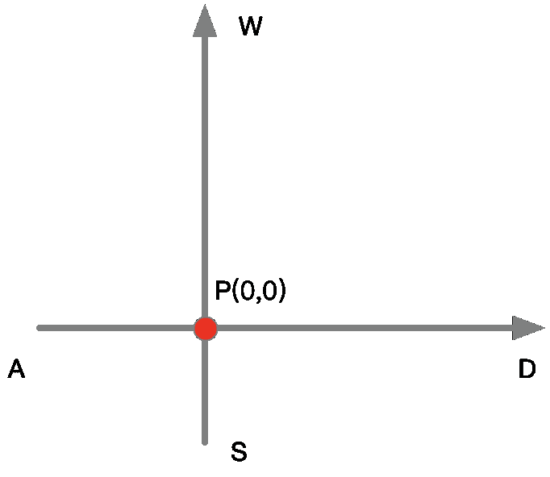

# 【2022】Shopee 秋招提前批 BE 笔试

## 1

若客户端首先向服务器发送 FIN 段请求断开 TCP 连接，则当客户端收到的服务器发送的 FIN 段并向服务器发送 ACK 段后，TCP 状态转换为(  )。

正确答案: B   你的答案: 空 (错误)

```cpp
CLOSE_WAIT
```

```cpp
TIME_WAIT
```

```cpp
FIN_WAIT_1
```

```cpp
FIN_WAIT_2
```

本题知识点

Java 工程师 PHP 工程师 golang 工程师 信息技术岗 Shopee

讨论

[ForZSJ](https://www.nowcoder.com/profile/680753813)

直觉 0.0

发表于 2022-03-06 14:06:13

* * *

[牛客 762855210 号](https://www.nowcoder.com/profile/762855210)

不理解，为什么不是 D

发表于 2022-03-05 16:44:42

* * *

## 2

Unix 一共有五种 I/O 模型，分别是阻塞式 I/O、非阻塞式 I/O、I/O 复用、信号驱动式 I/O、异步 I/O，以下关于这些 I/O 模型说法错误的是

正确答案: C   你的答案: 空 (错误)

```cpp
阻塞时 I/O 的特点是在 I/O 的执行的两个阶段都被阻塞了:阻塞等待数据，阻塞拷贝数据
```

```cpp
非阻塞 I/O 在 I/O 执行的过程中，应用进行可以继续执行，但是需要不断的执行系统调用来获知 I/O 是否完成，也就是轮询
```

```cpp
I/O 复用不会阻塞用户进程
```

```cpp
异步 I/O 不会阻塞用户进程
```

本题知识点

Java 工程师 PHP 工程师 golang 工程师 信息技术岗 Shopee

## 3

下列函数的时间复杂度是 int test(int n) {    int i = 0, sum = 0;      while(sum < n)        sum += ++i;      return i;}

正确答案: C   你的答案: 空 (错误)

```cpp
O(log2n)
```

```cpp
O(n)
```

```cpp
O(n⁰.5)
```

```cpp
O(nlog2n)
```

本题知识点

Java 工程师 PHP 工程师 golang 工程师 信息技术岗 Shopee

讨论

[零葬](https://www.nowcoder.com/profile/75718849)

sum 要加到 n，根据高斯求和公式，从 0 加到 i 得 sum=(0+i)*(i+1)/2=i*(i+1)/2=n，一共操作了 i+1 次，n 为 i 的平方量级，所以复杂度为 O(n⁰.5)

编辑于 2021-09-25 12:27:43

* * *

## 4

关于 Java JMM 之 Happens-Before，描述错误的是？

正确答案: D   你的答案: 空 (错误)

```cpp
Thread 对象的 start() 方法先行发生于此线程的每一个动作
```

```cpp
一个对象的初始化完成先行发生于他的 finalize() 方法的开始
```

```cpp
对线程 interrupt() 方法的调用先行发生于被中断线程的代码检测到中断事件的发生
```

```cpp
对一个变量的写操作先行发生于后面对这个变量的读操作
```

本题知识点

Java 工程师 PHP 工程师 golang 工程师 信息技术岗 Shopee

讨论

[yzy 加油](https://www.nowcoder.com/profile/670963610)

Happens-Before 规则

Happens-Before 的八个规则（摘自《深入理解 Java 虚拟机》12.3.6 章节）：

1.  程序次序规则：一个线程内，按照代码顺序，书写在前面的操作先行发生于书写在后面的操作；
2.  管程锁定规则：一个 unLock 操作先行发生于后面对**同一个锁**的 lock 操作；（此处后面指时间的先后）
3.  volatile 变量规则：对一个变量的写操作先行发生于后面对这个变量的读操作；（此处后面指时间的先后）
4.  线程启动规则：Thread 对象的 start()方法先行发生于此线程的每个一个动作；
5.  线程终结规则：线程中所有的操作都先行发生于线程的终止检测，我们可以通过 Thread.join()方法结束、Thread.isAlive()的返回值手段检测到线程已经终止执行；
6.  线程中断规则：对线程 interrupt()方法的调用先行发生于被中断线程的代码检测到中断事件的发生；
7.  对象终结规则：一个对象的初始化完成先行发生于他的 finalize()方法的开始；
8.  传递性：如果操作 A 先行发生于操作 B，而操作 B 又先行发生于操作 C，则可以得出操作 A 先行发生于操作 C；

发表于 2021-09-07 15:14:48

* * *

[牛客 422270033 号](https://www.nowcoder.com/profile/422270033)

D 为什么错了？什么**题目啊

发表于 2021-10-09 21:53:28

* * *

## 5

关于 0/1 背包问题，以下描述正确的是

正确答案: D   你的答案: 空 (错误)

```cpp
可以使用贪心算法找到最优解
```

```cpp
能找到多项式时间的有效算法
```

```cpp
使用教材介绍的动态规划方法可求解任意 0－1 背包问题
```

```cpp
对于同一背包与相同的物品，背包问题取得的总价值一定大于等于做 0/1 背包问题
```

本题知识点

Java 工程师 PHP 工程师 golang 工程师 信息技术岗 Shopee

讨论

[牛客 286677313 号](https://www.nowcoder.com/profile/286677313)

其他背包问题(如完全背包，物品无限)，一定大于 0 / 1 背包的结果

发表于 2022-01-19 22:26:53

* * *

## 6

有一对夫妇，先后生了两个孩子，其中一个孩子是女孩，问另一个孩子是男孩的概率是

正确答案: C   你的答案: 空 (错误)

```cpp
1/4
```

```cpp
1/2
```

```cpp
2/3
```

```cpp
2/5
```

本题知识点

数学运算

讨论

[HaiBro](https://www.nowcoder.com/profile/942445565)

男孩 Boy  女孩 Girl 按孩子出生先后顺序共 4 种情况：BB，BG，GB，GG 已知有一个女孩，有 3 种情况（BG，GG，GB），另一个为男孩只有 BG 和 GB 两种，所以 2/3 概率

发表于 2020-02-13 20:39:34

* * *

[牛客 296957304 号](https://www.nowcoder.com/profile/296957304)

如果说先生的是女孩，问后生的是男孩的概率是多少，就应该是 1/2；但已知一个是女孩，还有一个是男孩的概率就应该是 p(一个男孩一个女孩)/p(有女孩) =2/3

发表于 2020-03-14 13:45:58

* * *

[研松](https://www.nowcoder.com/profile/879061220)

问题有歧义，这个问法毫无疑问就是 50%，较真那就是独立同分布，还是 50%。

发表于 2020-07-24 23:44:12

* * *

## 7

下面有关 sql 绑定变量的描述，说法错误的是？

正确答案: D   你的答案: 空 (错误)

```cpp
绑定变量是指在 SQL 语句中使用变量，改变变量的值来改变 SQL 语句的执行结果
```

```cpp
使用绑定变量，可以减少 SQL 语句的解析，能减少数据库引擎消耗在 SQL 语句解析上的资源
```

```cpp
使用绑定变量，提高了编程效率和可靠性，减少访问数据库的次数
```

```cpp
使用绑定变量，查询优化器会预估的比字面变量更加真实
```

本题知识点

数据库 阿里巴巴 Java 工程师 PHP 工程师 golang 工程师 信息技术岗 Shopee

讨论

[Lyan](https://www.nowcoder.com/profile/515373)

D，绑定变量被使用时，查询优化器会忽略其具体值，因此其预估的准确性远不如使用字面量值真实

发表于 2015-07-15 08:34:41

* * *

[夜络](https://www.nowcoder.com/profile/950215)

绑定变量是相对文本变量来讲的,所谓文本变量是指在 SQL 直接书写查询条件，这样的 SQL 在不同条件下需要反复解析,绑定变量是指使用变量来代替直接书写条件，查询 bind value 在运行时传递，然后绑定执行。优点是减少硬解析,降低 CPU 的争用,节省 shared_pool ;缺点是不能使用 histogram,sql 优化比较困难

发表于 2014-10-25 00:26:16

* * *

[萌](https://www.nowcoder.com/profile/911097)

减少访问数据库的次数怎么理解

发表于 2016-07-15 17:15:29

* * *

## 8

对数组[45, 31, 47, 50, 90, 78, 34]构建一个大顶堆， 则结果是：

正确答案: C   你的答案: 空 (错误)

```cpp
[90, 50, 47, 78, 45, 31, 34]
```

```cpp
[90, 45, 78, 50, 31, 34, 47]
```

```cpp
[90, 78, 47, 50, 31, 45, 34]
```

```cpp
[90, 47, 78, 50, 45, 31, 34]
```

本题知识点

Java 工程师 PHP 工程师 golang 工程师 信息技术岗 Shopee

## 9

以下关于进程通信方式描述错误的是：

正确答案: C   你的答案: 空 (错误)

```cpp
管道是单向的、先进先出的、无结构的、固定大小的字节流
```

```cpp
信号量是一个计数器，可以用来控制多个进程对共享资源的访问
```

```cpp
消息队列，是一个在系统内存中用来保存消息的队列
```

```cpp
共享内存允许两个或多个进程访问同一个逻辑内存
```

```cpp
套接字是一种进程间通信机制，与其它通信机制不同的是，它可用于不同机器间的进程通信
```

本题知识点

Java 工程师 PHP 工程师 golang 工程师 信息技术岗 Shopee

讨论

[WSGWJ](https://www.nowcoder.com/profile/717446657)

消息的链表

发表于 2021-09-12 09:44:54

* * *

## 10

如果 x=2，以下表达式中，值不为 6 的是（）

正确答案: A   你的答案: 空 (错误)

```cpp
2*x,x+=2
```

```cpp
x++,2*x
```

```cpp
x*=(1+x)
```

```cpp
x*=x+1
```

本题知识点

Java 工程师 PHP 工程师 golang 工程师 信息技术岗 Shopee

讨论

[牛客网 234787](https://www.nowcoder.com/profile/247909802)

逗号表达式的值是后一部分的值，前面的 2*x 只是算了一下

发表于 2021-08-28 12:33:48

* * *

[零葬](https://www.nowcoder.com/profile/75718849)

A 选项的 2*x 并没有变量来接收这个表达式的值，因此 x 还是等于 2，x+=2 后 x 为 4

发表于 2021-09-25 12:34:01

* * *

[牛客 95493561 号](https://www.nowcoder.com/profile/95493561)

无语，这出的什么水平的题啊？？哪个语言里 A 能算出来是 6 啊？

发表于 2022-03-10 12:51:47

* * *

## 11

以下替换算法中，属于堆栈型替换算法的是

正确答案: B C D   你的答案: 空 (错误)

```cpp
先进先出算法
```

```cpp
近期最少使用算法
```

```cpp
近期最久未用过算法
```

```cpp
优化替换算法
```

本题知识点

Java 工程师 PHP 工程师 golang 工程师 信息技术岗 Shopee

## 12

下列属于防火墙技术的是

正确答案: B C D   你的答案: 空 (错误)

```cpp
IPsec 技术
```

```cpp
应用级网关
```

```cpp
代理防火墙
```

```cpp
数据包过滤
```

本题知识点

Java 工程师 PHP 工程师 golang 工程师 信息技术岗 Shopee

讨论

[Joge 夜神](https://www.nowcoder.com/profile/498747188)

哪位大佬给个解析

发表于 2022-03-07 16:33:18

* * *

## 13

int x =5;const int * const p = &x;const int &q=x; int const *next=&x;const int *j=&x;以下哪行代码存在问题：

正确答案: B C D   你的答案: 空 (错误)

```cpp
next++;
```

```cpp
q++;
```

```cpp
(*j)++;
```

```cpp
*  p =1;
```

本题知识点

Java 工程师 PHP 工程师 golang 工程师 信息技术岗 Shopee

## 14

下列哪些方案可实现幂等

正确答案: A B C   你的答案: 空 (错误)

```cpp
数据库唯一主键
```

```cpp
数据库乐观锁
```

```cpp
Token 令牌
```

```cpp
数据库自增 ID
```

本题知识点

Java 工程师 PHP 工程师 golang 工程师 信息技术岗 Shopee

讨论

[Awybupt](https://www.nowcoder.com/profile/2008734)

幂等的意思是相同的请求参数有相同的响应

发表于 2021-09-16 01:07:05

* * *

## 15

对于文件的写入描述正确的有？

正确答案: A B C D   你的答案: 空 (错误)

```cpp
文件的写入分为直接 I/O 和带缓存的 I/O
```

```cpp
直接 I/O 会跑过缓存层，直接到设备驱动层
```

```cpp
缓存 I/O 会将内容拷贝到内核态的页中，形成脏页
```

```cpp
如果脏页太多，就需要回写磁盘
```

本题知识点

Java 工程师 PHP 工程师 golang 工程师 信息技术岗 Shopee

## 16

假设点 P 处于坐标轴原点，W 表示向上，A 表示向左，S 表示向下，D 表示向右，输入一串指令代表 P 点的移动轨迹，输出最终 P 的位置

例如 "2W2D"表示向上移动两个坐标位置，再向右移动两个坐标位置

"W2D"表示向上移动一个坐标位置，再向右移动两个坐标位置

本题知识点

Java 工程师 PHP 工程师 golang 工程师 信息技术岗 Shopee

讨论

[零葬](https://www.nowcoder.com/profile/75718849)

正则表达式求解，把带数字的和不带数字的操作都匹配出来再进行移动（这题很坑，大小写的字母都有）

```cpp
class Solution:
    def GetEndPoint(self , order ):
        # write code here
        import re
        x, y = 0, 0
        order = order.upper()
        for match in re.findall("\d+[A-Z]", order):
            if match.endswith("W"):
                y += int(match[:-1])
            elif match.endswith("S"):
                y -= int(match[:-1])
            elif match.endswith("A"):
                x -= int(match[:-1])
            elif match.endswith("D"):
                x += int(match[:-1])
        for match in re.findall("(?<![0-9])[A-Z]+", order):
            for direction in match:
                if direction.endswith("W"):
                    y += 1
                elif direction.endswith("S"):
                    y -= 1
                elif direction.endswith("A"):
                    x -= 1
                elif direction.endswith("D"):
                    x += 1
        return [x, y]
```

编辑于 2021-09-24 12:22:28

* * *

[牛客 286677313 号](https://www.nowcoder.com/profile/286677313)

比较简洁的做法，建立一个以字符为 key 的 map，忽略大小写需要的数据结构：忽略大小字符的 map；n(n 为 0 时，表示字符前没有数字，对应的 value 加 1：n 不为 0 时，表示前面有数字，对应的 key 加 n)核心思想是：遍历- 如果碰到数字了，就保存下来，最后组成一个整数；- 如果是字符，就看前面有没有保存数字(判断 n 的值)，n 为 0 的话 value 加 1，否则对应的 value 加 n，最后清楚 n(令 n = 0)

```cpp
class Solution {
public:
    struct cmp{
        bool operator()(const char& a,const char& b){
            return tolower(a) < tolower(b);
        }
    };
    vector<int> GetEndPoint(string order) {
        // write code here
        int x = 0, y = 0;
        int n = 0;
        map<char,int, cmp> memo;
        for(int i = 0; i < order.size(); i++){
            if(order[i] >= '0' && order[i] <= '9')
                n = n*10 +order[i] -'0';
            else {
                memo[order[i]] += n == 0 ? 1 : n;
                n = 0;
            }
        }
        return {memo['D'] - memo['A'],memo['W'] - memo['S']};
    }
};
```

发表于 2022-01-19 22:19:51

* * *

[牛客 841776330 号](https://www.nowcoder.com/profile/841776330)

```cpp
/**
 * 代码中的类名、方法名、参数名已经指定，请勿修改，直接返回方法规定的值即可
 *
 * 
 * @param order string 字符串 
 * @return int 整型一维数组
 * @return int* returnSize 返回数组行数
 *
 * C 语言声明定义全局变量请加上 static，防止重复定义
 */
int* GetEndPoint(char* order, int* returnSize ) {
    // write code here
    int x = 0, y = 0, t = 0;
    for(int i = 0; i < strlen(order); i++){
        if(!(order[i] == 'W' || order[i] == 'w') && !(order[i] == 'S' || order[i] == 's') && !(order[i] == 'A' || order[i] == 'a') && !(order[i] == 'D' || order[i] == 'd')){
            t += order[i]-'0';
            t *= 10;
            printf("i=%d t=%d\n",i,t/10);
        }else{
            if(t == 0)t = 10;
            if(order[i] == 'W' || order[i] == 'w'){
                y = y + t/10;
            }else if(order[i] == 'S' || order[i] == 's'){
                y = y - t/10;
            }else if(order[i] == 'A' || order[i] == 'a'){
                x = x - t/10;
            }else{
                x = x + t/10;
            }
            t = 0;
            printf("x=%d y=%d\n", x, y);
        }
    }

    int* res = (int*)malloc(sizeof(int)*2);
    res[0] = x;
    res[1] = y;
    *returnSize = 2;
    return res;
}

```

发表于 2022-03-07 08:30:33

* * *

## 17

利用字符重复出现的次数，编写一种方法，实现基本的字符串压缩功能。比如，字符串 aabcccccaaa 会变为 a2bc5a3。
1.如果只有一个字符，1 不用写
2.字符串中只包含大小写英文字母（a 至 z）。 数据范围:0<=字符串长度<=50000 要求：时间复杂度 O(N）

本题知识点

字符串 *双指针* *讨论

[零葬](https://www.nowcoder.com/profile/75718849)

很简单，一边遍历一边计数。保存上一个字符用来对比当前字符，如果计数超过 1 就追加字符+计数，否则只追加字符。

```cpp
import java.util.*;

public class Solution {
    /**
     * 代码中的类名、方法名、参数名已经指定，请勿修改，直接返回方法规定的值即可
     *
     * 
     * @param param string 字符串 
     * @return string 字符串
     */
    public String compressString (String param) {
        // write code here
        if(params.length() == 0){
            return "";
        }
        StringBuilder sb = new StringBuilder();
        char prevChar = param.charAt(0);
        int count = 1;
        for(int i = 1; i < param.length(); i++){
            char curChar = param.charAt(i);
            if(prevChar == curChar){
                count += 1;
            }else{
                if(count > 1)
                    sb.append(prevChar).append(count);
                else
                    sb.append(prevChar);
                prevChar = curChar;
                count = 1;
            }
        }
        if(count > 1)
            sb.append(prevChar).append(count);
        else
            sb.append(prevChar);
        return sb.toString();
    }
}

```

编辑于 2022-02-21 17:18:38

* * *

[196514583](https://www.nowcoder.com/profile/196514583)

```cpp
import java.util.*;

public class Solution {
    /**
     * 代码中的类名、方法名、参数名已经指定，请勿修改，直接返回方法规定的值即可
     *
     * 
     * @param param string 字符串 
     * @return string 字符串
     */
    public String compressString (String param) {
        // write code here
        char[] cs = param.toCharArray();
        StringBuilder res = new StringBuilder();
        int count = 1;
        for(int i = 0; i < cs.length-1; i++){
            if(cs[i] == cs[i+1]){
                count++;
            }else{
                res.append(cs[i]);
                if(count > 1) res.append(count);
                count = 1;
            }
        }
        // 判断最后的字符
        res.append(cs[cs.length-1]);
        if(count > 1) res.append(count);
        return res.toString();
    }
}
```

发表于 2021-09-01 23:51:00

* * *

[笑着活下去丶](https://www.nowcoder.com/profile/446400381)

这个应该是双指针吧？

```cpp
public String compressString(String param) {
        StringBuilder sb = new StringBuilder();
        int len = param.length(), i = 0;
        while (i < len) {
            int j = i, count = 0;
            while (i < len && j < len && param.charAt(j) == param.charAt(i)) {
                j++;
                count++;
            }
            if (count == 1) {
                sb.append(param.charAt(i));
            } else {
                sb.append(param.charAt(i)).append(count);
            }
            i = j;
        }
        return sb.toString();
    }
```

发表于 2022-03-20 09:03:44

* * *

## 18

手上有 n 朵花，每朵的花瓣数保存在一个数组中。我们每次可以选择任意一朵，拿走其中的一瓣或者两瓣，求掰完所有花的最少次数。

本题知识点

Java 工程师 PHP 工程师 golang 工程师 信息技术岗 Shopee

讨论

[零葬](https://www.nowcoder.com/profile/75718849)

每朵花的花瓣掰完需要花瓣数除以 2 向上取整次，加起来就得到了所有花的花瓣掰完的总次数

```cpp
import java.util.*;

public class Solution {
    /**
     * 代码中的类名、方法名、参数名已经指定，请勿修改，直接返回方法规定的值即可
     *
     * 
     * @param petals int 整型一维数组 花瓣数
     * @return int 整型
     */
    public int petalsBreak (int[] petals) {
        // write code here
        int times = 0;
        for(int num: petals) times += (num + 1) / 2;
        return times;
    }
}
```

编辑于 2021-09-24 13:17:19

* * *

[196514583](https://www.nowcoder.com/profile/196514583)

关键在于 **每次选择其中一朵**

```cpp
import java.util.*;

public class Solution {
    /**
     * 代码中的类名、方法名、参数名已经指定，请勿修改，直接返回方法规定的值即可
     *
     * 
     * @param petals int 整型一维数组 花瓣数
     * @return int 整型
     */
    public int petalsBreak (int[] petals) {
        // write code here
        int res = 0;
        for(int petal: petals){
            if(petal % 2 == 0) res += petal/2;
            else res += petal/2 + 1;
        }
        return res;
    }
}
```

发表于 2021-09-01 23:52:57

* * *

[小鹏同学哟](https://www.nowcoder.com/profile/399856313)

每次可以选择任意一朵，所以可以直接遍历 petals，即从第一朵开始按顺序拿 ```cpp
class Solution {
public:
    /**
     * 代码中的类名、方法名、参数名已经指定，请勿修改，直接返回方法规定的值即可
     *
     * 
     * @param petals int 整型 vector 花瓣数
     * @return int 整型
     */
    int petalsBreak(vector<int>& petals) {
        int num;
        int temp;
        for(int i=0; i<petals.size(); i++){
            if(petals[i] % 2){  // 不是偶数
                num += (petals[i]+1) / 2;
            }
            else{  // 偶数
                num += petals[i] / 2;
            }
        }
        return num;
    }
};
``` 

发表于 2021-12-17 16:28:35

* * **