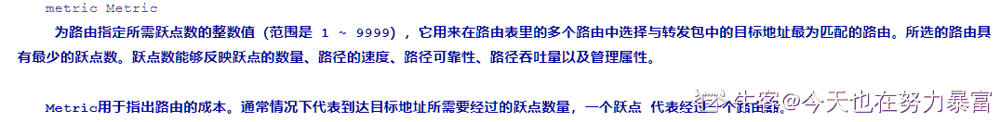
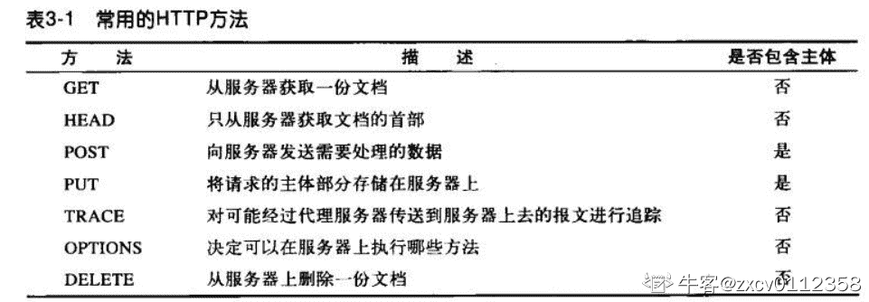

# 【2022】Shopee 秋招提前批 SRE 笔试

## 1

关系数据库中的数据逻辑结构是

正确答案: B   你的答案: 空 (错误)

```cpp
层次结构
```

```cpp
二维表格
```

```cpp
树形结构
```

```cpp
网状结构
```

本题知识点

Java 工程师 C++工程师 PHP 工程师 golang 工程师 安卓工程师 iOS 工程师 算法工程师 大数据开发工程师 游戏研发工程师 Shopee

讨论

[想要 offer 的菜戟](https://www.nowcoder.com/profile/942799491)

以网状结构为数据逻辑结构的是对象数据库

发表于 2022-03-21 18:15:52

* * *

[ssajhsangs](https://www.nowcoder.com/profile/687262)

关系型数据库的逻辑结构!什么叫逻辑结构!! 逻辑结构肯定是网状的啊

发表于 2021-10-26 21:57:20

* * *

[牛客 32206802 号](https://www.nowcoder.com/profile/32206802)

a

发表于 2021-10-09 14:24:08

* * *

## 2

现有 3 个开发任务需要分配给 5 个组内成员来完成，不同的任务分配方式有多少种

正确答案: A   你的答案: 空 (错误)

```cpp
125
```

```cpp
64
```

```cpp
81
```

```cpp
14
```

本题知识点

Java 工程师 C++工程师 PHP 工程师 golang 工程师 安卓工程师 iOS 工程师 算法工程师 大数据开发工程师 游戏研发工程师 Shopee

讨论

[zzzzzzy123](https://www.nowcoder.com/profile/771536601)

题目描述不清晰, 正常来说一个任务可以由一个人完成, 同时也可以由(2, 3, 4, 5)个人共同完成. 

发表于 2021-08-31 09:17:20

* * *

[牛客 563071307 号](https://www.nowcoder.com/profile/563071307)

第个任务分给 5 个人都有 5 种可能，故一共有 5*5*5=125 种可能。

发表于 2021-08-25 10:59:37

* * *

[影子 201904011534502](https://www.nowcoder.com/profile/58740982)

3 个任务给一个人：5； 3 个任务给两个人：任务分组有 3 种可能，5 个人中获取两个人，5*4=20 中可能一共有 3*20=60 中可能；3 个任务分给 3 个人：即 5 个人中随机选取 3 个人并排序，即 5*4*3=60 这题是在靠高中的排列组合吧

发表于 2021-09-05 14:12:55

* * *

## 3

设栈 S 和队列 Q 的初始状态为空，元素 e1、e2、e3、e4、e5、e6 依次通过栈 S，每一个元素出栈后立即进入队列 Q，若 6 个元素出队列的序列是 e2、e4、e3、e6、e5、e1，则栈 S 的容量至少应该是

正确答案: C   你的答案: 空 (错误)

```cpp
6
```

```cpp
4
```

```cpp
3
```

```cpp
2
```

本题知识点

Java 工程师 C++工程师 PHP 工程师 golang 工程师 安卓工程师 iOS 工程师 算法工程师 大数据开发工程师 游戏研发工程师 Shopee

讨论

[No$Bug](https://www.nowcoder.com/profile/232170091)

选 C 栈：先进后出队列：先进先出 a.通过栈次序：e1、e2、e3、e4、e5、e6b.出队列次序：e2、e4、e3、e6、e5、e1 通过栈顺序：e1、e2 进栈，stack.size = 2;e2 出栈，入队列，stack.size = 1;e3、e4 进栈，stack.size = 3;e4、e3 出栈，入队列，stack.size = 1;e5、e6 进栈，stack.size = 3;e6、e5、e1 出栈，入队列，stack.size = 0;

发表于 2021-08-24 20:13:54

* * *

## 4

若变量已正确定义，有下列程序段：int a=3,b=5,c=7;if(a>b) a=b; c=a;if(c!=a) c=b;printf("%d,%d,%d\n", a, b, c);

正确答案: B   你的答案: 空 (错误)

```cpp
3, 5, 5
```

```cpp
3, 5, 3
```

```cpp
3, 5, 7
```

```cpp
5, 3, 5
```

本题知识点

Java 工程师 C++工程师 PHP 工程师 golang 工程师 安卓工程师 iOS 工程师 算法工程师 大数据开发工程师 游戏研发工程师 Shopee

讨论

[零葬](https://www.nowcoder.com/profile/75718849)

if(a > b)只能作用到 a=b，后面的 c=a 不受其约束，此时 c==a 为 true，第二个 if 语句不会再走

发表于 2021-08-30 10:38:45

* * *

[一个弱鸡的追梦者](https://www.nowcoder.com/profile/300018543)

这道题有点坑啊，没注意到第二行 没有{} if(a>b) 只有 a=b 有效，c=a；不受约束

发表于 2021-08-31 20:03:34

* * *

[陈君何](https://www.nowcoder.com/profile/40109458)

第一个判断没用  因为 c=a 第二个判断也没用了。。。

发表于 2021-09-01 16:32:15

* * *

## 5

设有一张商品表(商品号，商品名，属地，价格)，其中商品号是主键。现要查询属地为“中国”的价格为 100 的商品数量，下列语句中能正确完成该查询要求的是

正确答案: C   你的答案: 空 (错误)

```cpp
SELECT SUM(属地) FROM 商品表 WHERE 属地 = ‘中国’ or 价格 = ‘100’
```

```cpp
SELECT SUM(*) FROM 商品表 WHERE 属地 = ‘中国’ or 价格 = ‘100’
```

```cpp
SELECT COUNT(属地) FROM 商品表 WHERE 属地 = ‘中国’ and 价格 = ‘100’
```

```cpp
SELECT COUNT(*) FROM 商品表 WHERE 属地 = ‘中国’ or 价格 = ‘100’
```

本题知识点

Java 工程师 C++工程师 PHP 工程师 golang 工程师 安卓工程师 iOS 工程师 算法工程师 大数据开发工程师 游戏研发工程师 Shopee

讨论

[层析](https://www.nowcoder.com/profile/690830959)

查询条件是必须两个都满足，所以选择 and

发表于 2021-09-01 17:25:41

* * *

## 6

给定如下 SQL 语句 CREATE  VIEW  test.V_testASSELECT * FROM test.students  WHERE  age < 19;该语句的功能是

正确答案: C   你的答案: 空 (错误)

```cpp
在 test 表上建立一个名为 V_test 的视图
```

```cpp
在 students 表上建立一个查询，存储在名为 test 的表中
```

```cpp
在 test 数据库的 students 表上建立一个名为 V_test 的视图
```

```cpp
在 test 表上建立一个名为 students 的视图
```

本题知识点

Java 工程师 C++工程师 PHP 工程师 golang 工程师 安卓工程师 iOS 工程师 算法工程师 大数据开发工程师 游戏研发工程师 Shopee

## 7

linux 系统中如果要列出一个目录下的所有文件，可以使用下面哪个命令+参数

正确答案: B   你的答案: 空 (错误)

```cpp
ls -l
```

```cpp
ls -a
```

```cpp
ls -d
```

```cpp
ls -t
```

本题知识点

Java 工程师 C++工程师 PHP 工程师 golang 工程师 安卓工程师 iOS 工程师 算法工程师 大数据开发工程师 游戏研发工程师 Shopee

讨论

[牛客 415578944 号](https://www.nowcoder.com/profile/415578944)

B  把-a 理解为 all   所有 

发表于 2021-09-01 15:46:16

* * *

## 8

局域网的网络地址 192.168.1.0/24，局域网连接其他网络的网关地址是 192.168.1.1。该局域网下一台主机 192.168.1.2 需要访问 172.16.1.0/22 网络，其路由设置正确的是：

正确答案: A   你的答案: 空 (错误)

```cpp
route add -net 172.16.1.0 gw 192.168.1.1 netmask 255.255.252.0 metric 1
```

```cpp
route add -net 192.168.1.0 gw 192.168.1.1 netmask 255.255.254.0 metric 1
```

```cpp
route add default 192.168.1.0 netmask 172.168.1.1 metic 1
```

```cpp
route add -net 172.16.1.0 gw 192.168.1.1 netmask 255.255.253.0 metic 1
```

本题知识点

Java 工程师 C++工程师 PHP 工程师 golang 工程师 安卓工程师 iOS 工程师 算法工程师 大数据开发工程师 游戏研发工程师 Shopee

讨论

[今天也在努力暴富](https://www.nowcoder.com/profile/977066664)

roote add -net 目标网址 gw 网关 netmask 子网掩码 metric 1-9999 子网掩码: 22---> (每 8 位为 255)-->255.255.252.0

发表于 2021-08-28 09:59:11

* * *

## 9

运行以下 python 代码>>> map(lambda x: x+1, range(6))输出正确的是

正确答案: C   你的答案: 空 (错误)

```cpp
[6, 5, 4, 3, 2, 1]
```

```cpp
[5, 4, 3, 2, 1, 0]
```

```cpp
[1, 2, 3, 4, 5, 6]
```

```cpp
[0, 1, 2, 3, 4, 5]
```

本题知识点

Java 工程师 C++工程师 PHP 工程师 golang 工程师 安卓工程师 iOS 工程师 算法工程师 大数据开发工程师 游戏研发工程师 Shopee

讨论

[牛客 185389614 号](https://www.nowcoder.com/profile/185389614)

range（6）应该是 0-5 题中有 x+1 所以变成了 1-6 了

发表于 2021-09-07 15:35:56

* * *

## 10

小虾以 200 元一颗的价格从黑商那里买了一些珍珠，现在拿去卖给店铺，如果是真货则以 1700 元一颗卖出。据统计，大约只有 10%的珍珠是真货，则小虾平均每颗损失多少元

正确答案: B   你的答案: 空 (错误)

```cpp
10
```

```cpp
30
```

```cpp
50
```

```cpp
100
```

本题知识点

Java 工程师 C++工程师 PHP 工程师 golang 工程师 安卓工程师 iOS 工程师 算法工程师 大数据开发工程师 游戏研发工程师 Shopee

讨论

[零葬](https://www.nowcoder.com/profile/75718849)

有 0.1 的概率可以挣 1700-200=1500 元，有 0.9 的概率会损失 200 元，因此数学期望为 0.1*1500-0.9*200=-30，即平均每颗损失 30 元

发表于 2021-08-30 10:41:19

* * *

[牛客 65753853](https://www.nowcoder.com/profile/178630453)

200 - 1700 * 0.1

发表于 2021-08-27 08:50:11

* * *

[祗回](https://www.nowcoder.com/profile/311236081)

(1700-200) * 0.1 + (0-200) * 0.9 = -30

发表于 2021-08-25 10:50:45

* * *

## 11

以下关于进程、线程、协程的的说法正确的是？

正确答案: B D   你的答案: 空 (错误)

```cpp
进程是操作系统能够进行运算调度的最小单位
```

```cpp
线程是堆共享，栈私有
```

```cpp
线程是堆私有，栈共享
```

```cpp
一般而言，执行开销进程 > 线程 > 协程
```

本题知识点

Java 工程师 C++工程师 PHP 工程师 golang 工程师 安卓工程师 iOS 工程师 算法工程师 大数据开发工程师 游戏研发工程师 Shopee

讨论

[杰 201904031653631](https://www.nowcoder.com/profile/297181520)

A.线程才是运算调度

发表于 2021-09-02 15:30:44

* * *

[修狗](https://www.nowcoder.com/profile/434913473)

对操作系统来说，线程是最小的执行单元，进程是最小的资源管理单元。无论进程还是线程，都是由操作系统所管理的。协程，英文 Coroutines，是一种比线程更加轻量级的存在。

发表于 2022-03-22 23:59:50

* * *

[想要 offer 的菜戟](https://www.nowcoder.com/profile/942799491)

线程是堆共享 栈私有

发表于 2022-03-21 18:24:30

* * *

## 12

已知字母 A 的 ASCII 代码值为 65，若变量 K 为 char 型，下列能正确判断出 K 中的值为大写字母的表达式是

正确答案: A C D   你的答案: 空 (错误)

```cpp
K>='A'&&K<='Z'
```

```cpp
!(K>='A'||K<='2')
```

```cpp
(K+32)>='a'&&(K+32)<='2'
```

```cpp
isalpha(K)&&(K<=91)
```

本题知识点

Java 工程师 C++工程师 PHP 工程师 golang 工程师 安卓工程师 iOS 工程师 算法工程师 大数据开发工程师 游戏研发工程师 Shopee

讨论

[401_Unauthorized](https://www.nowcoder.com/profile/9245326)

只有我这边显示为 2 么？

发表于 2021-08-26 23:20:38

* * *

[牛客 353657942 号](https://www.nowcoder.com/profile/353657942)

D 项 K 要≤90 吧

发表于 2021-08-31 15:14:59

* * *

[++油少年](https://www.nowcoder.com/profile/60861148)

为啥 D 选项要 K<=91 ？

发表于 2021-11-07 18:23:39

* * *

## 13

以下哪些请求方法是 HTTP 规范中支持的请求方法

正确答案: A B D E   你的答案: 空 (错误)

```cpp
GET
```

```cpp
HEAD
```

```cpp
INSERT
```

```cpp
DELETE
```

```cpp
TRACE
```

本题知识点

Java 工程师 C++工程师 PHP 工程师 golang 工程师 安卓工程师 iOS 工程师 算法工程师 大数据开发工程师 游戏研发工程师 Shopee

讨论

[zxcv0112358](https://www.nowcoder.com/profile/473856205)

还有一个 PATCH method 参考《HTTP 权威指南》

编辑于 2021-09-01 11:57:47

* * *

## 14

局域网内的某台主机用 ping 能够访问相同内网的主机，但是 ping www.shopee.cn 发现无法 ping 通，可能有哪些原因导致该问题

正确答案: B C D   你的答案: 空 (错误)

```cpp
主机 IP 设置有误
```

```cpp
没有设置连接局域网的网关
```

```cpp
DNS 服务器设置有误
```

```cpp
防火墙没有放开 icmp 协议
```

本题知识点

Java 工程师 C++工程师 PHP 工程师 golang 工程师 安卓工程师 iOS 工程师 算法工程师 大数据开发工程师 游戏研发工程师 Shopee

讨论

[秃头大太阳](https://www.nowcoder.com/profile/278356649)

ping 使用的是 ICMP 包，如果***不开放，就相当于防 ping 了

发表于 2021-09-17 09:12:42

* * *

## 15

在 TCP/IP 协议体系结构中，下面哪些为可靠传输协议

正确答案: A C   你的答案: 空 (错误)

```cpp
TCP
```

```cpp
UDP
```

```cpp
SMTP
```

```cpp
IP
```

本题知识点

Java 工程师 C++工程师 PHP 工程师 golang 工程师 安卓工程师 iOS 工程师 算法工程师 大数据开发工程师 游戏研发工程师 Shopee

讨论

[菜菜饿饿 offer](https://www.nowcoder.com/profile/475540774)

SMTP 使用的 TCP 协议

发表于 2021-09-04 10:50:14

* * *

## 16

在 Linux 中，具有相当丰富的帮助功能。用户通常可以通过下面哪几种方式来获取操作命令的使用方法或者参数选项内容

正确答案: A B C D   你的答案: 空 (错误)

```cpp
man 命令
```

```cpp
whatis 命令
```

```cpp
info 命令
```

```cpp
命令 --help
```

本题知识点

Java 工程师 C++工程师 PHP 工程师 golang 工程师 安卓工程师 iOS 工程师 算法工程师 大数据开发工程师 游戏研发工程师 Shopee

讨论

[一个弱鸡的追梦者](https://www.nowcoder.com/profile/300018543)

whatis 就只是说明一下命令的功能，就一句话。怎么能说使用方法和参数选项内容？？

发表于 2021-08-31 20:14:04

* * *

## 17

下列关于 PC 机性能的叙述中，哪些是正确的

正确答案: A B C   你的答案: 空 (错误)

```cpp
逻辑结构相同时，CPU 主频越高，速度就越快
```

```cpp
总线的传输速率与总线的数据线宽带、总线工作频率等有关
```

```cpp
通常 cache 容量越大，访问 cache 的命中率就越高
```

```cpp
主存的存取周期越长，存取速度就越快
```

本题知识点

Java 工程师 C++工程师 PHP 工程师 golang 工程师 安卓工程师 iOS 工程师 算法工程师 大数据开发工程师 游戏研发工程师 Shopee

讨论

[毅航](https://www.nowcoder.com/profile/3691572)

cache 越大，我缓存大量无用数据，此时命中率并不会提高呀

发表于 2021-08-30 12:03:00

* * *

## 18

在一次挥手断开连接的过程中，以下 TCP 网络连接状态，哪些会出现在主动断开的一方

正确答案: A B C   你的答案: 空 (错误)

```cpp
FIN
```

```cpp
ACK
```

```cpp
TIME_WAIT
```

```cpp
CLOSE_WAIT
```

本题知识点

Java 工程师 C++工程师 PHP 工程师 golang 工程师 安卓工程师 iOS 工程师 算法工程师 大数据开发工程师 游戏研发工程师 Shopee

讨论

[牛客 725254632 号](https://www.nowcoder.com/profile/725254632)

CLOSE_WAIT 是被动断链的状态

发表于 2021-09-04 18:39:27

* * *

[有芝士的海](https://www.nowcoder.com/profile/911875867)

1、FIN 不用说，这个就是由主动关闭方发起的，没有它后面屁事没有😂。 2、ACK 这个主动关闭方会发送，被动关闭方也会发送。主动关闭方发送是为了告知对面自己已经关闭了的时候做出的回应，而被动关闭方则是第一次接收到 FIN 时候时表示自己收到了对方的报文信息做出的回应。 3、TIME_WAIT 表示收到了对方的 FIN 报文，并发送出了 ACK 报文后就会进入到这个状态。如果 FIN_WAIT_1 状态下，收到了对方同时带 FIN 标志和 ACK 标志的报文时，可以直接进入到 TIME_WAIT 状态，而无须经过 FIN_WAIT_2 状态。 4、CLOSE_WAIT 是在被动方发送了 FIN 和 ACK 后就会进入的一个状态和主动方无关。

发表于 2021-09-02 20:49:52

* * *

[还有 offer 嘛](https://www.nowcoder.com/profile/733239666)

题出的都不标准，FIN WAIT1 和 FIN WAIT2 都没有

发表于 2021-10-08 18:52:53

* * *

## 19

编译程序工作时，通常有以下哪些阶段

正确答案: A B C E   你的答案: 空 (错误)

```cpp
词法分析
```

```cpp
语法分析
```

```cpp
中间代码生成
```

```cpp
语义分析
```

```cpp
目标代码生成
```

本题知识点

Java 工程师 C++工程师 PHP 工程师 golang 工程师 安卓工程师 iOS 工程师 算法工程师 大数据开发工程师 游戏研发工程师 Shopee

讨论

[还有 offer 嘛](https://www.nowcoder.com/profile/733239666)

题出错了吧，怎么可能没有语义分析？

发表于 2021-10-08 18:58:47

* * *

[牛客 986084322 号](https://www.nowcoder.com/profile/986084322)

中间代码生成不是必须的

发表于 2021-09-07 01:07:11

* * *

[oceanao](https://www.nowcoder.com/profile/3461356)

A B C E 目标代码生成 不是必须的 

发表于 2021-09-07 19:01:43

* * *

## 20

以下哪些方式可以提高 HTTP 网站的访问能力

正确答案: A C D   你的答案: 空 (错误)

```cpp
增大 HTTP 网站服务器数量
```

```cpp
增大 HTTP 网站服务器磁盘空间
```

```cpp
增大 HTTP 网站服务器内存大小
```

```cpp
提高 HTTP 网站服务器 CPU 主频
```

本题知识点

Java 工程师 C++工程师 PHP 工程师 golang 工程师 安卓工程师 iOS 工程师 算法工程师 大数据开发工程师 游戏研发工程师 Shopee

讨论

[想要 offer 的菜戟](https://www.nowcoder.com/profile/942799491)

增加服务器数，提高并发能力。 增加内存大小加快 CPU，增加进程的运行速度

发表于 2022-03-21 18:31:02

* * *

[Tyler201812161301702](https://www.nowcoder.com/profile/194524665)

DDos 警告

发表于 2021-09-24 18:25:01

* * *

## 21

对于给定的一个包含连续字母、连续数字及空格的字符串（不会出现字母和数字连在一起出现），实现字母部分按出现顺序排列而数字按照从小到达顺序排在最后一个字母的后面。数据范围： 字符串长度满足 
进阶：空间复杂度  ， 时间复杂度 

本题知识点

Java 工程师 C++工程师 PHP 工程师 golang 工程师 安卓工程师 iOS 工程师 算法工程师 大数据开发工程师 游戏研发工程师 Shopee

讨论

[零葬](https://www.nowcoder.com/profile/75718849)

遍历字符串中的所有 item，将字母 item 直接追加到 StringBuilder 中，而数字 item 追加到一个按数字大小升序排列的优先队列中。遍历完成后再将优先队列中的 item 按顺序全部追加到 StringBuilder 中即可。

```cpp
import java.util.*;

public class Solution {
    /**
     * 代码中的类名、方法名、参数名已经指定，请勿修改，直接返回方法规定的值即可
     *
     * 
     * @param text_source string 字符串 原始输入
     * @return string 字符串
     */
    public String char_and_num_return (String text_source) {
        if("".equals(text_source)){
            return "";
        }
        String[] words = text_source.split(" ");
        PriorityQueue<String> pq = new PriorityQueue<>(new Comparator<String>(){
            public int compare(String a, String b){
                return (int)(Long.parseLong(a) - Long.parseLong(b));
            }
        });
        StringBuilder sb = new StringBuilder();
        for(String word: words){
            if(word.charAt(0) > 57){    // 首字符的 ascii 码大于 57 一定是字母 item
                sb.append(word).append(" ");      // 字母字符串直接加入 stringbuilder
            }else{
                pq.offer(word);       // 数字字符串加入小根堆
            }
        }
        // 将数字字符串按升序出队
        while(!pq.isEmpty()) {
            sb.append(pq.poll()).append(" ");
        }
        return sb.toString().trim();
    }
}

```

编辑于 2022-03-09 21:11:51

* * *

[有梦的咸鱼](https://www.nowcoder.com/profile/234842662)

```cpp
class Solution:
    def char_and_num_return(self , text_source ):
        text_source = text_source.split(' ')
        point = 0
        for i in range(len(text_source)):
            if not text_source[i].isdigit():
                text_source[point],text_source[i] = text_source[i],text_source[point]
                point+=1
            else:
                text_source[i] = int(text_source[i])
        text_source[point:] = [str(s) for s in sorted(text_source[point:])]
        return ' '.join(text_source)
```

发表于 2022-03-05 12:05:10

* * *

[Bo 良 ki 影](https://www.nowcoder.com/profile/562102339)

根据字母和数字指定不同的排序规则，利用 Arrays.sort()排序

```cpp
import java.util.*;

public class Solution {
    /**
     * 代码中的类名、方法名、参数名已经指定，请勿修改，直接返回方法规定的值即可
     *
     * 
     * @param text_source string 字符串 原始输入
     * @return string 字符串
     */
    public String char_and_num_return (String text_source) {
        //先把 String 转成 String 数组
        String[] s = text_source.split(" ");
        Arrays.sort(s, (a, b) -> {
           if(isString(a) && isString(b)) {
               return 0;
           } else if(isString(a) && !isString(b)) {
               return -1;
           } else if(!isString(a) && isString(b)) {
               return 1;
           } else {
               return (int)(Long.valueOf(a) - Long.valueOf(b));
           }
        });
        StringBuilder res = new StringBuilder();
        for(String item : s) {
            res.append(item).append(" ");
        }
        return res.toString().trim();
    }

    boolean isString(String c) {
        return c.charAt(0) > 57;
    }
}
```

发表于 2021-12-12 22:34:45

* * *

## 22

成对的 69 匹配序列定义为：

1、 空串""是一个成对的 69 序列；

2、如果"X"和"Y"是成对的 69 序列，那么"XY"也是成对的 69 序列；

3、如果"X"是一个成对的 69 序列，那么"6X9"也是一个成对的 69 序列；

4、每个成对的 69 序列都可以由以上规则生成。 例如，"", "69", "6699", "6969"都是成对的。

现在给出一个序列 S，允许你的操作是： 在 S 的开始和结尾出添加一定数量的 6 或者 9，使序列 S 变为一个成对的 69 序列。输出添加最少的 6 或者 9 之后成对的 69 序列是什么。

本题知识点

Java 工程师 C++工程师 PHP 工程师 golang 工程师 安卓工程师 iOS 工程师 算法工程师 大数据开发工程师 游戏研发工程师 Shopee

讨论

[零葬](https://www.nowcoder.com/profile/75718849)

与生成有效括号的方式相同，不断平衡成对的 69，缺 6 往前补 6，缺 9 往后补 9

```cpp
import java.util.*;

public class Solution {
    /**
     * 代码中的类名、方法名、参数名已经指定，请勿修改，直接返回方法规定的值即可
     *
     * 
     * @param S string 字符串 
     * @return string 字符串
     */
    public String Paired69 (String S) {
        // write code here
        Stack<Character> stack = new Stack<>();
        StringBuilder sb = new StringBuilder();
        for(char c: S.toCharArray()){
            if(c == '6'){
                stack.push(c);
            }else{
                if(!stack.isEmpty())
                    stack.pop();              // 还有 6 就弹出来与 9 配对
                else
                    sb.insert(0, '6');     // 否则缺 6，需要在前面补
            }
            sb.append(c);
        }
        while(!stack.isEmpty()){       // 6 有余，往后补 9
            stack.pop();
            sb.append('9');
        }
        return sb.toString();
    }
}
```

发表于 2021-08-30 10:19:26

* * *

[ch20190329135644](https://www.nowcoder.com/profile/750502519)

```cppclass Solution {
public:
    /**
     * 代码中的类名、方法名、参数名已经指定，请勿修改，直接返回方法规定的值即可
     *
     * 
     * @param S string 字符串 
     * @return string 字符串
     */
    string Paired69(string S) {        //栈中保存字符串 S 中 6 的个数        //主要思路：从头遍历字符串，当遍历到 6 时就把 6 入栈，遍历到 9 时，就判断栈是否为空，若不为空，则说明可以和现有字符串 S 的 6        //匹配，否则说明当前 S 中不存在与 9 匹配的 6   那么就需要在开头插入一个 6        //当遍历完整个字符串后，如果栈不为空，则说明还有剩余的 6   那么只需要在答案字符串填上对应的 6 即可
        stack<int> st;
        string ans;
        for(int i = 0;i < S.size();i ++){
            if(S[i] == '6'){
                st.push(6);
                ans += to_string(6);
            }else{
                if(st.empty()){
                    ans = to_string(6) + ans;
                    ans += to_string(9);
                }else{
                    ans += to_string(9);
                    st.pop();
                }
            }
        }
        while(!st.empty()){
            st.pop();
            ans += to_string(9);
        }
        return ans;
    }
};

```

发表于 2021-08-26 22:07:07

* * *

[马克西姆莫](https://www.nowcoder.com/profile/726873727)

```cpp
import java.util.*;

public class Solution {
    /**
     * 代码中的类名、方法名、参数名已经指定，请勿修改，直接返回方法规定的值即可
     *
     * 
     * @param S string 字符串 
     * @return string 字符串
     */
    public String Paired69 (String S) {
        // write code here
        if (S.equals(""))
            return "";

        int str_len = S.length();
        Stack<Character> six = new Stack<Character>();
        Stack<Character> nine = new Stack<Character>();

        for (int i = 0; i < str_len; i++) {
            if ( S.charAt(i) == '6' ) {
                six.push('6');
            }
            else if ( !six.empty() ) {
                six.pop();
            }
            else {
                nine.push('9');
            }
        }

        StringBuilder output = new StringBuilder();
        int six_size = six.size();
        int nine_size = nine.size();
        for ( int i = 0; i < nine_size; i++ )
            output.append('6');
        output.append(S);
        for ( int i = 0; i < six_size; i++ )
            output.append('9');

        return output.toString();
    }
}
```

发表于 2022-03-05 16:32:17

* * *

## 23

有一排商品，每一个商品都有自己的价值，现在需要花一定金额购买这些商品。规则是：如果一个商品的价值比它旁边的一个商品要高，那么这个商品就必须比它旁边的商品花费更多金额。所有的商品至少要进行一次金额购买。假设一次购买花费金额单位为 1，最少需要多少金额可以购买所有商品？

现给定一个数组，数组元素表示每个商品的价值。请编写代码输出最少需要花费的金额。

本题知识点

Java 工程师 C++工程师 PHP 工程师 golang 工程师 安卓工程师 iOS 工程师 算法工程师 大数据开发工程师 游戏研发工程师 Shopee

讨论

[零葬](https://www.nowcoder.com/profile/75718849)

贪心算法，先将所有商品的花费初始化为 1。从左往右遍历一遍，检查当前位置商品的花费相较于左邻居是否合理，不合理就以最小限度超过它；再从右往左遍历一遍，检查当前位置商品的花费相较于右邻居是否合理，不合理也以最小限度超过它。最后将所有商品的花费累加起来即可。

```cpp
import java.util.*;

public class Solution {
    /**
     * 代码中的类名、方法名、参数名已经指定，请勿修改，直接返回方法规定的值即可
     *
     * 
     * @param array int 整型一维数组 
     * @return int 整型
     */
    public int cost (int[] array) {
        // write code here
        int n = array.length;
        int[] cost = new int[n];
        Arrays.fill(cost, 1);
        for(int i = 1; i < n; i++){
            if(array[i] > array[i - 1] && cost[i] <= cost[i - 1])
                cost[i] = cost[i - 1] + 1;
        }
        for(int i = n - 2; i >= 0; i--){
            if(array[i] > array[i + 1] && cost[i] <= cost[i + 1])
                cost[i] = cost[i + 1] + 1;
        }
        int res = 0;
        for(int i = 0; i < n; i++) res += cost[i];
        return res;
    }
}
```

发表于 2021-08-29 22:54:06

* * *

[YXXY](https://www.nowcoder.com/profile/244090088)

难道就我一个没看懂题目的吗。。。我太菜了

发表于 2021-09-01 11:40:44

* * *

[hun2i](https://www.nowcoder.com/profile/233993613)

贪心，从左往右遍历计算当前值左边有几个连续比它低的值个数，再从右往左遍历计算当前值右边又有几个连续比它低的值个数，那么当前值最终的价格应该是 max(左边个数，右边个数)，最后累加起来就是总共需要的金额，描述的有点差，看代码🙂 ```cpp
int cost(vector<int>& array) {
    int len = array.size();
    vector<int> l(len, 1);
    vector<int> r(len, 1);
    for(int i = 1; i < len; i ++)
        if(array[i] > array[i - 1])
            l[i] = l[i - 1] + 1;
    for(int i = len - 2; i >= 0; i --)
        if(array[i] > array[i + 1])
            r[i] = r[i + 1] + 1;
    int res = 0;
    for(int i = 0; i < len; i ++)
        res += max(l[i], r[i]);
    return res;
}
``` 

编辑于 2021-08-30 16:25:14

* * *