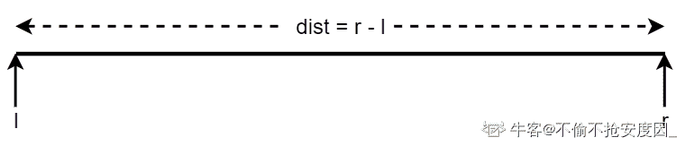
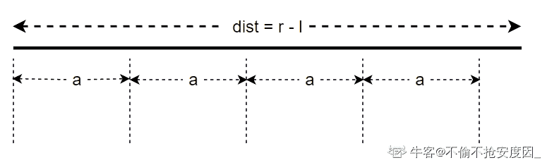
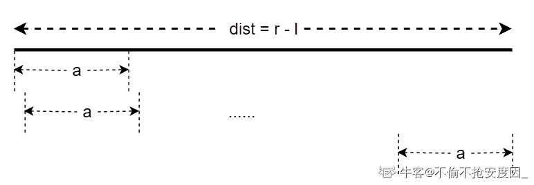

# 【2021】牛客模考（五模）编程题集合

## 1

众所周知水在低于 0 摄氏度的时候是固态，在高于 0 摄氏度的时候是液态，在等于 0 摄氏度的时候是可能是液态也可能是固态还可能是固液混合

现在有个加热工具，加热 c 秒可以使冰升温 1 摄氏度。

加热 d 秒可以使 0 摄氏度的冰变成 0 摄氏度的水。

加热 e 秒可以使水升温 1 摄氏度。

现在给出两个温度 a , b ，请计算用这个加热工具将水从 a 摄氏度加热到 b 摄氏度所需要的时间。保证 a 不为零。
数据范围：，
进阶：空间复杂度 ，时间复杂度 

本题知识点

Java 工程师 C++工程师 PHP 工程师 golang 工程师 前端工程师 安卓工程师 iOS 工程师 算法工程师 大数据开发工程师 信息技术岗 运维工程师 安全工程师 数据分析师 数据库工程师 游戏研发工程师 区块链 测试开发工程师 测试工程师 牛客 2021

讨论

[sky 丶 Mamba2](https://www.nowcoder.com/profile/445320583)

A = int(input())
B = int(input())
C = int(input())
D = int(input())
E = int(input())
if A < 0:
    if B <= 0:
        t = C*(B-A)
    else:
        t = C*abs(A)+D+E*B
else:
    t = E*(B-A)
print(t)

发表于 2021-09-21 10:58:31

* * *

[零葬](https://www.nowcoder.com/profile/75718849)

用数学方法做就能达成题中进阶的复杂度，需要写成分段函数。

1.  如果 a>0，就不会存在从 0 下温度加热至 0°的过程，耗时 0 秒；如果 a<0，从 a°升温至 0°就需要耗费 c*a 秒。
2.  如果 a<0，就需要花费 d 秒将 0°的冰变成 0°的水；如果 a>0，就没有这个过程，耗时 0 秒。
3.  如果 a<0，就需要花费 d*b 秒来将 0°的水升温至 b°；如果 a>0，就只需要花费(b-a)*d 秒将 a°的水升温至 b°。

```cpp
import java.io.BufferedReader;
import java.io.InputStreamReader;
import java.io.IOException;

public class Main {
    public static void main(String[] args) throws IOException {
        BufferedReader br = new BufferedReader(new InputStreamReader(System.in));
        int a = Integer.parseInt(br.readLine());
        int b = Integer.parseInt(br.readLine());
        int c = Integer.parseInt(br.readLine());
        int d = Integer.parseInt(br.readLine());
        int e = Integer.parseInt(br.readLine());
        System.out.println(c*Math.max(0, -a) + (a < 0? d: 0) + e*(b - Math.max(0, a)));
    }
}
```

发表于 2022-01-16 22:43:26

* * *

[牛客 693413875 号](https://www.nowcoder.com/profile/693413875)

```cpp
a=[]
for i in range(5):
    a.append(int(input()))
if a[0]<0:
    b=-a[0]*a[2]+a[3]+a[1]*a[4]
else:
    b=a[4]*(a[1]-a[0])
print(b)
```

发表于 2021-10-31 22:13:34

* * *

## 2

科学家正在计划利用  行星上的一个研究模块进行一项重要的测量实验，测量共分为两次进行。

因为宇宙中有多种不确定因素，科学家们已经确定了最佳测量的时间在 l 到 r 范围内。

测量的要求是两次测量的间隔时间必须是 a 的倍数，现在请你帮助科学家计算测量方式的数量。

即有多少对测量时间 i 和 j 满足 l <= i < j <= r ，并且 j-i 是 a 的倍数。进阶：空间复杂度 ，时间复杂度   

本题知识点

Java 工程师 C++工程师 PHP 工程师 golang 工程师 前端工程师 安卓工程师 iOS 工程师 算法工程师 大数据开发工程师 信息技术岗 运维工程师 安全工程师 数据分析师 数据库工程师 游戏研发工程师 区块链 测试开发工程师 测试工程师 牛客 2021

讨论

[不偷不抢安度因 _](https://www.nowcoder.com/profile/275523507)

先看 code：


这题就是个纯粹的计算题，下面分析解题思路。

首先，记监测区间的长度为`dist`。



那么在这个`dist`区间中，最多可以容纳 `dist / a` 个`a`，即`j - i` 的最大值是 `dist - a`，记为`k`。



如上图所示的例子，`k = 4`.

那么当`j - i = a`时，很显然，可以有 `dist - a + 1`对 `{i, j}`。



同理，当 `j - i = 2a`时，可以有 `dist - 2a + 1`对`{i, j}`。

所以，一共可能的`{i, j}`的对数为：


发表于 2021-09-18 11:14:38

* * *

[元气少女李逵](https://www.nowcoder.com/profile/931701688)

```cpp
#include<iostream>
using namespace std;
int main(){
    long r,l,a;
    cin>>l>>r>>a;
    long s;
    s=(r-l)/a;
    long m,n;
    m=r-l-s*a+1;
    n=r-l-a+1;
    long count;
    count=(m+n)*s/2;
    cout<<count;
    return 0;

}
```

发表于 2021-11-16 11:12:20

* * *

[零葬](https://www.nowcoder.com/profile/75718849)

其实就是计算步长为 1 时，能够滑出多少个长度为 i*a 的窗口？其中。同样使用数学方法来做，但没能达成时间复杂度 O(1)的成就。根据卷积过程可以知道，对于长度为 n 的区间，如果步长为 1，窗口长度为 a 进行滑窗，可以产生 n-a+1 个窗口。因此只需要尝试所有可能的窗口大小就可以统计出窗口总数。

```cpp
import java.io.BufferedReader;
import java.io.InputStreamReader;
import java.io.IOException;

public class Main {
    public static void main(String[] args) throws IOException {
        BufferedReader br = new BufferedReader(new InputStreamReader(System.in));
        int l = Integer.parseInt(br.readLine());
        int r = Integer.parseInt(br.readLine());
        int a = Integer.parseInt(br.readLine());
        int n = r - l;
        long count = 0;
        for(int i = 1; i <= n / a; i++){
            count += n - i*a + 1;      // 窗口大小为 i*a 时，能够滑出的窗口数
        }
        System.out.println(count);
    }
}
```

后来发现评论区大佬们把这个求和过程写成一个统一的公式了，妙哉妙哉！

发表于 2022-01-16 22:50:11

* * *

## 3

现有  个城市，这  个城市构成了一棵树，即这  个城市中有  条边，每条边都连接着两个不同的城市，使得从任意一个城市出发，通过若干条边能达到其它任意一个城市，且每个城市都有一个正整数值  代表这个城市的人口密集度。

突然某天瘟疫爆发，瘟疫会在人口密集度大于或等于  的城市中肆意横行，这些城市会进行封城，与这些城市相连的边都会被切断。这时这棵树就会被切分为若干连通块，同一个连通块中的城市之间可以通过若干条边互相达到。

政府为了稳定局势，想请你求出在瘟疫爆发后城市形成的连通块的数量小于等于  的情况下，  的最小值可以是多少，当的值可以无穷小时，输出。

本题知识点

Java 工程师 C++工程师 PHP 工程师 golang 工程师 前端工程师 安卓工程师 iOS 工程师 算法工程师 大数据开发工程师 信息技术岗 运维工程师 安全工程师 数据分析师 数据库工程师 游戏研发工程师 区块链 测试开发工程师 测试工程师 牛客 2021

讨论

[零葬](https://www.nowcoder.com/profile/75718849)

这个题好难，感谢评论区大佬给的思路，附上一个 java 版本

```cpp
import java.io.*;
import java.util.*;

public class Main {
    public static void main(String[] args) {
        Scanner sc = new Scanner(System.in);
        int n = sc.nextInt();
        int m = sc.nextInt();
        TreeSet<Integer> densitySet = new TreeSet<>((a, b) -> b - a);
        int[] density = new int[n];
        for(int i = 0; i < n; i++){
            density[i] = sc.nextInt();
            densitySet.add(density[i]);
        }
        int[] degree = new int[n];
        for(int i = 0; i < n - 1; i++){
            int x = sc.nextInt() - 1, y = sc.nextInt() - 1;
            if(density[x] > density[y]){
                degree[x]++;
            }else{
                degree[y]++;
            }
        }
        HashMap<Integer, Integer> map = new HashMap<>();      // 存储同一人口密度下，一共有多少度
        for(int i = 0; i < n; i++){
            map.put(density[i], map.getOrDefault(density[i], 0) + degree[i]);
        }
        int res = 0;
        Iterator<Integer> iter = densitySet.iterator();
        m--;
        int index = 0;
        while(m >= 0 && iter.hasNext()){
            res = iter.next();
            m -= map.get(res);
        }
        System.out.println(iter.hasNext()? res + 1: -1);
    }
}
```

顺带提一句，数据输入格式有点迷，用缓冲流读取数据会出问题，非得用扫描器。

发表于 2022-01-20 16:11:54

* * *

[Yejf](https://www.nowcoder.com/profile/852469710)

Cpp

```cpp
#include<bits/stdc++.h>
using namespace std;

int main() {
    int n, m; cin >> n >> m;
    if(n < m) return -1;
    int a[n]; set<int> us; for(int i = 0; i < n; ++i) cin >> a[i], us.insert(a[i]); //过滤重复值，其使其有序
    int d[n]; memset(d, 0, sizeof(d)); for(int i = 0, x, y; i < n-1; ++i) cin >> x >> y, a[x-1] > a[y-1] ? d[x-1]++ : d[y-1]++;
    unordered_map<int, int> nums; for(int i = 0; i < n; ++i) nums[a[i]] += d[i]; //同样密度的点的度
    auto iter = us.rbegin(); m--;
    while(m >= 0 && iter != us.rend()) {
        m -= nums[*iter]; //连通块数量和点的度相关
        ++iter;
    }
    cout << (iter == us.rend() ? -1 : *prev(iter)+1);
    return 0;
}
```

发表于 2021-09-17 16:55:24

* * *

[落荒草](https://www.nowcoder.com/profile/7756543)

```cpp
class Solution:
    def minValueofh(self, n, m, line, array):
        from collections import defaultdict
        dic = defaultdict(list)
        for a, b in array:
            dic[a].append(b)
            dic[b].append(a)
        for i in range(m, 0, -1):
            if not self.check(i, line, dic):
                continue
            else:
                return self.check(i, line, dic)
        return -1
    def check(self, i, line, dic):
        leaf = []
        father = {}
        k = 1
        for f, s in dic.items():
            if len(s) == 1:
                leaf.append(f)
            else:
                father[f] = len(s)
                flag = max(line) + 1
            while flag > 0:
                for f, s in dic.items():
                    if line[f-1] >= flag:
                        if f in leaf:
                            k += 1
                        else:
                            k += father[f]
                    else:
                        continue
                if i == k:
                    return flag
                flag -= 1
            return 0
if __name__ == "__main__":
    [n, m] = list(map(int, input().split()))
    line = list(map(int, input().split()))
    array = []
    for _ in range(n-1):
        lists = list(map(int, input().split()))
        array.append(lists)
    s = Solution()
    ans = s.minValueofh(n, m, line, array)
    print(ans)
```

发表于 2021-09-15 17:05:36

* * *