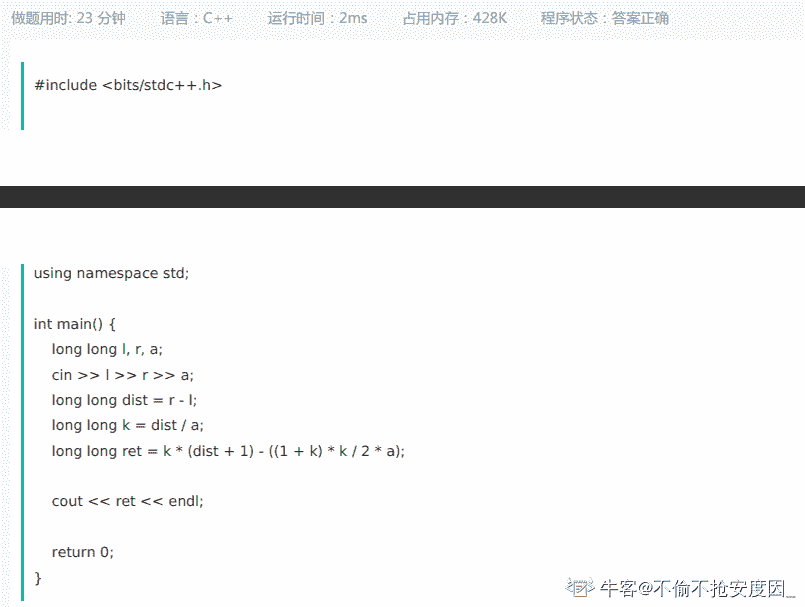
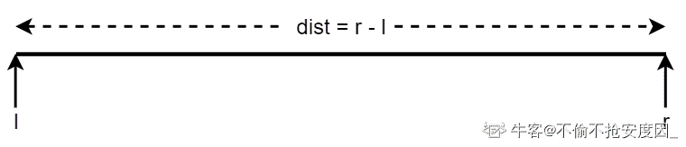
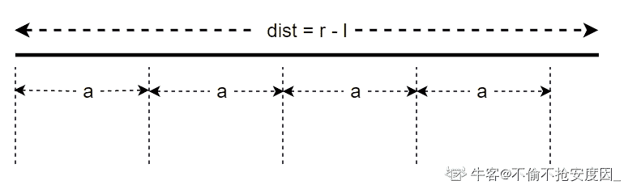
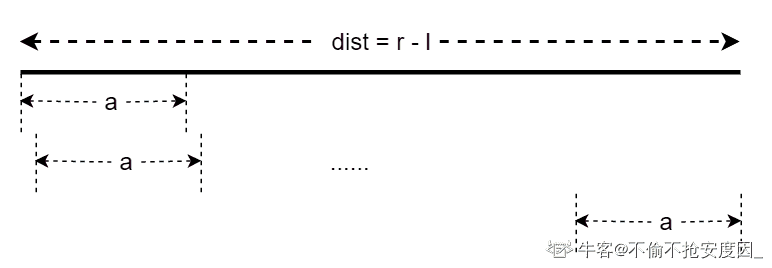

# 【2021】牛客模考（五模）数据分析笔试

## 1

有 10 粒糖，如果每天至少吃一粒（多不限），吃完为止，求有多少种不同吃法？（ ）

正确答案: C   你的答案: 空 (错误)

```cpp
144
```

```cpp
217
```

```cpp
512
```

```cpp
640
```

本题知识点

数学运算 数据分析师 牛客 2021

讨论

[cccdzhpdxhz](https://www.nowcoder.com/profile/7253906)

答案是 C          所有元素无差别，每份至少包含一个元素（每天至少吃一粒），因此考虑采用隔板法求解。将 10 粒糖并列一排放置，中间形成 9 个空位，每个空位有两种选择(有隔板或没隔板)，因此共有 2⁹=512 种，选 C

发表于 2018-02-17 23:37:07

* * *

[SunburstRun](https://www.nowcoder.com/profile/557336)

答案是 C         根据题意可知，此题满足插板法的应用条件：所有元素无差别，每份至少包含一个元素（每天至少吃一粒），因此考虑采用插板法求解。将 10 粒糖并列一排放置，中间形成 9 个空位，在这 9 个空位中任意插入 0，-，9 个隔板，（即表示 10 粒糖在 1 到 10 天吃完），故共有，即 C 为 512 种吃法。因此，选 C

编辑于 2016-12-13 16:30:58

* * *

[路过的熊](https://www.nowcoder.com/profile/5639504)

C(0,9)+C(1,9)+C(2,9)+...+C(9,9) = 512

发表于 2016-12-17 20:50:00

* * *

## 2

一个圆形的屋子，每隔 3 米摆放一盆花，屋子周长 90 米，则共需要 多少盆花？

正确答案: A   你的答案: 空 (错误)

```cpp
30
```

```cpp
31
```

```cpp
60
```

```cpp
62
```

本题知识点

组合数学 *数据分析师 牛客 2021* *讨论

[何博明](https://www.nowcoder.com/profile/2621707)

这道题***：圆形的屋子，如果按周长 90 米摆花盆摆 30 盆，每两盆之间的圆弧距离为 3 米，直线距离小于 3 米，题目给出的   每隔 3 米摆一盆花，这句话非常不严谨，因此不考虑是否有正确答案

发表于 2017-01-13 13:33:08

* * *

[牛客 607958 号](https://www.nowcoder.com/profile/607958)

题目不理解，为什么非要在边上摆呢？中间不行吗？计算可以 80 多

发表于 2017-08-14 21:38:10

* * *

[花开满楼](https://www.nowcoder.com/profile/4866322)

为什么只在圆周算，中间也可以的啊

发表于 2018-04-16 14:19:32

* * *

## 3

北京到广州的距离为 a,有一辆火车以每小时 15 公里的速度离开北京直奔广州，同时另一辆火车每小时 20 公里的速度从广州开往北京。如果有一只鸟，以 30 公里每小时的速度和两辆火 车同时启动，从北京出发，碰到另一辆车后就向相反的方向返回去飞，就这样依次在两辆火车之间来回地飞，直到两辆火车相遇。请问，这只鸟约飞行了多少公里?

正确答案: D   你的答案: 空 (错误)

```cpp
(1/7)*a
```

```cpp
(3/7)*a
```

```cpp
(4/7)*a
```

```cpp
(6/7)*a
```

本题知识点

数据分析师 牛客 2021

讨论

[ballballoffer 降临](https://www.nowcoder.com/profile/415032967)

> 其实不用算鸟分了多远，只要知道它飞了多久就行了，它跟火车一起出发，直到火车相遇，一共飞了 a/（15+20），然后乘上它飞的速度就行了

[`www.tilaile.com/index.php/question/26311`](http://www.tilaile.com/index.php/question/26311)

发表于 2021-09-07 21:55:57

* * *

[零葬](https://www.nowcoder.com/profile/75718849)

两俩火车的相对速度为 35km/h，鸟的速度 v=30km/h，不管鸟飞得如何曲折，当两辆火车相遇时，它飞行的时间都是，因此它飞行的距离为

编辑于 2022-01-20 16:17:44

* * *

[三岁开始卷](https://www.nowcoder.com/profile/617884285)

求小鸟飞行距离，可知距离=时间（t）* 速度 有题意可知 相遇时间即为小鸟往返飞行的总时间。设相遇时间为 t   ，两车相遇时则有 他  t*（15+20）=a,则 t=a/35,所以小鸟飞行距离=a/35 *30 故为 6/7a 

发表于 2021-10-26 00:01:39

* * *

## 4

春节期间，叶某、杨某、牛妹三个人用支付宝玩发红包游戏，
他们只能通过各自账户余额来发红包，
第一轮叶某给杨某的红包金额等于杨某支付宝钱包里面的账户余额，
叶某给牛妹的红包金额等于牛妹支付宝钱包里面的账户余额，
与此相同，第二轮杨某给叶某和牛妹的红包金额等于他们各自支付宝钱包的账户余额，
第三轮牛妹给叶某和杨某的红包金额等于他们各自支付宝钱包里面的账户余额，
若最后大家支付宝钱包里面的余额都是 16 元，则叶某最初的支付宝钱包账户余额为

正确答案: B   你的答案: 空 (错误)

```cpp
24
```

```cpp
26
```

```cpp
28
```

```cpp
30
```

本题知识点

数据分析师 牛客 2021

讨论

[那天 201909022246956](https://www.nowcoder.com/profile/241834611)

x+y+z=16*3(x-y-z)*4=16

发表于 2021-09-08 11:17:07

* * *

[sky 丶 Mamba2](https://www.nowcoder.com/profile/445320583)

设 x,y,z 分别为三个人的初始金额最后得到 2(x-y-z)=83y-x-z=84z-16=16

发表于 2021-09-11 22:23:57

* * *

[零葬](https://www.nowcoder.com/profile/75718849)

假设叶某、杨某和牛妹最初分别有 x，y，z 元，根据题意模拟红包游戏可以得到三个方程 4x - 4y - 4z=16
-2x+6y-2z=16
-x-y+7z=16 解得 x=26，y=14，z=8

发表于 2022-01-20 16:20:34

* * *

## 5

某天天气炎热,小明和聚会的小伙伴在楼下买了一个西瓜,回到住的地方，小明用水果刀平整地切了 9 刀,问最多能切成多少份,最少能切成多少份?

正确答案: C   你的答案: 空 (错误)

```cpp
9 130
```

```cpp
9 200
```

```cpp
10 130
```

```cpp
10 200
```

本题知识点

管理培训生 牛客 2021 数据分析师

讨论

[牛客 566107644 号](https://www.nowcoder.com/profile/566107644)

我在家切西瓜的时候，西瓜是可以移动的，不知道你们能不能拿的动，在此基础上，一刀两份，并排摆一起，两刀四份，九刀就是 2 的九次方，512 份我切出来了。

发表于 2021-09-27 15:14:58

* * *

[牛客 659783390 号](https://www.nowcoder.com/profile/659783390)

不应该是 9 刀最少 9 块吗？？？你一个圆从圆心切九刀就是 9 块啊

发表于 2021-09-10 19:57:46

* * *

[牛客 847955842 号](https://www.nowcoder.com/profile/847955842)


发表于 2021-09-11 22:40:06

* * *

## 6

牛客有个传统，就是每月都要组织员工进行一次聚餐，每个员工都可以带家属参加。某一次聚餐活动，一共有 20 个人(含员工和家属)参加。已知如果随机选取 3 位员工以及该 3 位员工的家属，一共有 220 组合。问如果每次随机选取 4 个员工及该 4 位员工的家属，会有多少组合?

正确答案: C   你的答案: 空 (错误)

```cpp
405
```

```cpp
455
```

```cpp
495
```

```cpp
505
```

本题知识点

数据分析师 牛客 2021

讨论

[零葬](https://www.nowcoder.com/profile/75718849)

这个题不太严谨，没说员工能带多少个家属，选出来的 4 个员工也有可能有没带家属的。但是不要纠结，笔试纠结就没完了，原则上要解方程。别解，赶时间，先化简成。试不了几次就能找出答案 10*11*12=1320，即 x=12。带家属的员工有 12 个，于是随机选取 4 个员工及该 4 位员工的家属会有组合种。

编辑于 2022-01-20 16:40:32

* * *

[Van 崽](https://www.nowcoder.com/profile/71316006)

把每位员工及其家属同视为一个个体，设共有 x 位员工连同其家属，C³[x]等于 220，x=12.

发表于 2021-09-08 22:55:44

* * *

[╰青春献给 D°°](https://www.nowcoder.com/profile/1214851)

这个题目其实有点不是很严谨。20 人参加，如果都有家属的话，那抽取结果是 C10（3），为 120 种。但根据题目意思，是 220 种，所以有部分员工是没有带家属的。所以根据题目中的意思，是反推计算员工的数量，为 12 人，与是否抽家属没有任何关系的，因为是否带家属并不影响抽取的结果。

发表于 2021-11-12 16:10:44

* * *

## 7

某班同学要订甲乙丙丁四种文学杂志，每人至少订一种，最多订四种，那么每个同学有 （）种不同的预订方式？

正确答案: C   你的答案: 空 (错误)

```cpp
7
```

```cpp
12
```

```cpp
15
```

```cpp
21
```

本题知识点

数据分析师 牛客 2021

讨论

[零葬](https://www.nowcoder.com/profile/75718849)

4 种里面选 1 种4 种里面选 2 种4 种里面选 3 种4 种里面全选一共 15 种预订方式

发表于 2022-01-20 16:34:11

* * *

[温帅帅💤](https://www.nowcoder.com/profile/575567334)

2⁴-1

发表于 2021-10-08 10:46:43

* * *

[牛客 913026472 号](https://www.nowcoder.com/profile/913026472)

4!/1! + 4!/2! + 4!/3! +1 = 15 订 1 本: 4!/1! , 有 4 种可能；订 2 本：4!/2!  ， 有 6 种可能；订 3 本： 4!/3! ， 有 4 中可能；订 4 本只有一种可能；

发表于 2021-09-17 01:05:16

* * *

## 8

袋子里红蓝黄橙四个颜色的球，每种颜色各 100 个，现在每个人过来随机抽一个球，最多 ____ 个人抽完之后，
能保证一定集齐 20 个相同颜色的球。

正确答案: D   你的答案: 空 (错误)

```cpp
45
```

```cpp
48
```

```cpp
50
```

```cpp
77
```

本题知识点

数据分析师 牛客 2021

讨论

[零葬](https://www.nowcoder.com/profile/75718849)

假设运气极差，每 4 个人都拿不同颜色的球，进行了 19 个 4 人次都这样，就已经有 76 人拿了球，4 种颜色的球各 19 个，这是最差的情况。此时再来一个人拿球，怎么着也能凑出某一种颜色的球 20 个，因此是 77 人。

编辑于 2022-01-20 16:39:41

* * *

[牛客 32919631 号](https://www.nowcoder.com/profile/32919631)

由抽屉原理得，放入四个抽屉（4 种颜色），要让 20 个球颜色相同，要求人数最少时候，3 个抽屉有 19 个，1 个抽屉是 20 个，所以是 19*4+1

发表于 2021-09-28 14:50:35

* * *

[牛客 387919692 号](https://www.nowcoder.com/profile/387919692)

19*4+1

发表于 2021-09-07 22:15:40

* * *

## 9

从所给的四个选项中，选择最合适的一个填入问号处，使之呈现一定的规律性.（）

正确答案: B   你的答案: 空 (错误)

```cpp
图 A
```

```cpp
图 B
```

```cpp
图 C
```

```cpp
图 D
```

本题知识点

判断推理 运营 牛客 2018 2019 产品 管理培训生 2021 数据分析师

讨论

[墨宸 mc](https://www.nowcoder.com/profile/731539746)

第一行都有圆形； 第二行都有矩形； 第三行都有三角形。

发表于 2019-08-26 00:05:02

* * *

[牛客 752862422 号](https://www.nowcoder.com/profile/752862422)

这是人类可以出的题吗

发表于 2021-03-14 19:00:10

* * *

[土豆成瘾少女](https://www.nowcoder.com/profile/293050228)

第一行：有三角形的有一个图，有圆的有三个图第二行：有三角形的有两个图，有圆的有两个图第三行：有三角形的有三个图，有圆的有一个图

发表于 2019-07-24 13:12:50

* * *

## 10

假设有选课表 course_relation(student_id, course_id)，其中 student_id 表示学号，course_id 表示课程编号，如果小易现在想获取每个学生所选课程的个数信息，请问如下的 sql 语句正确的是（ ）

正确答案: D   你的答案: 空 (错误)

```cpp
select student_id, sum(course_id) from course_relation;
```

```cpp
select student_id, sum(course_id) from lcourse_relation group by student_id;
```

```cpp
select student_id, count(course_id) from course_relation;
```

```cpp
select student_id, count(course_id) from course_relation group by student_id;
```

本题知识点

SQL 数据分析师 牛客 2021 数据库

讨论

[MapleAndJoker](https://www.nowcoder.com/profile/310356190)

求和用累加 sum(),求行的个数用累计 count()。（复制粘贴的）

发表于 2020-02-25 19:24:05

* * *

[筱妉儿](https://www.nowcoder.com/profile/5411729)

group by 更多的起到了同类对应求和，不加的话只会机械式的把所有的求和，对数据的查询提取无法实现。

发表于 2021-07-15 16:28:45

* * *

[Lucval](https://www.nowcoder.com/profile/300108835)

要注意区分 sum()和 count()的用法区别。假如有有三门课程及其编号：语文-A，数学-B，英语-C 而 sum(course_id)=A+B+C，并非题目所求 

发表于 2020-07-24 15:48:29

* * *

## 11

牛客每天有很多人登录，请你统计一下牛客新登录用户的次日成功的留存率，
有一个登录(login)记录表，简况如下:

| id  | user_id | client_id  | date  |
| 1 | 2 | 1 | 2020-10-12 |
| 2 | 3 | 2 | 2020-10-12  |
| 3 | 1 | 2 | 2020-10-12  |
| 4 | 2 | 2 | 2020-10-13  |
| 5 | 4 | 1 | 2020-10-13  |
| 6 | 1 | 2 | 2020-10-13  |
| 7 | 1 | 2 | 2020-10-14  |

第 1 行表示 user_id 为 2 的用户在 2020-10-12 使用了客户端 id 为 1 的设备第一次新登录了牛客网
。。。
第 4 行表示 user_id 为 2 的用户在 2020-10-12 使用了客户端 id 为 2 的设备登录了牛客网。。。最后 1 行表示 user_id 为 1 的用户在 2020-10-14 使用了客户端 id 为 2 的设备登录了牛客网

请你写出一个 sql 语句查询新登录用户次日成功的留存率，即第 1 天登陆之后，第 2 天再次登陆的概率,保存小数点后面 3 位(3 位之后的四舍五入)，上面的例子查询结果如下:

| p |
| 0.500 |

查询结果表明:user_id 为 1 的用户在 2020-10-12 第一次新登录了，在 2020-10-13 又登录了，算是成功的留存
user_id 为 2 的用户在 2020-10-12 第一次新登录了，在 2020-10-13 又登录了，算是成功的留存
user_id 为 3 的用户在 2020-10-12 第一次新登录了，在 2020-10-13 没登录了，算是失败的留存 user_id 为 4 的用户在 2020-10-13 第一次新登录了，在 2020-10-14 没登录了，算是失败的留存
故次日成功的留存率为 2/4=0.5
(sqlite 里查找某一天的后一天的用法是:date(yyyy-mm-dd, '+1 day')，四舍五入的函数为 round，sqlite 1/2 得到的不是 0.5，得到的是 0，只有 1*1.0/2 才会得到 0.5mysql 里查找某一天的后一天的用法是:DATE_ADD(yyyy-mm-dd,INTERVAL 1 DAY)，四舍五入的函数为 round)

本题知识点

数据分析师 牛客 2021

讨论

[SunburstRun](https://www.nowcoder.com/profile/557336)

要统计牛客新登录用户的次日成功的留存率，首先把公式列出来:（第一天登录的新用户并且第二天也登录的用户）/（总用户）即为新登录用户的次日成功的留存率总用户其实挺好算，如下：

```cpp
select count(distinct user_id) from login
```

找到每个用户第一天登陆的日子，其实挺好找，和前面找最近登录的日子差不多，一个是 max，一个是 min:

```cpp
select user_id,min(date) from login group by user_id
```

比如上面查找语句是 1，2020-10-12；那么如果找到一个结果为 1，2020-10-13 的那么是不是就符合结果了，于是可以如下写:

```cpp
select user_id,date(min(date),'+1 day') from login group by user_id
```

这样就可以找到所有的在第一天登录的新用户并且第二天也登录的用户，以及第二天的日期。
所以从这个里面找到所有的 count(distinct user_id)除以总用户就可以得到结果了，于是整个 sql 语句如下:

```cpp
select 
round(count(distinct user_id)*1.0/(select count(distinct user_id) from login) ,3)
from login
where (user_id,date)
in (select user_id,date(min(date),'+1 day') from login group by user_id);

```

 mysql 的解法为:

```cpp
select 
round(count(distinct user_id)*1.0/(select count(distinct user_id) from login) ,3)
from login
where (user_id,date)
in (select user_id,DATE_ADD(min(date),INTERVAL 1 DAY) from login group by user_id);

```

编辑于 2020-11-05 16:00:12

* * *

[机器不学习 er](https://www.nowcoder.com/profile/755656660)

*   留存率 = 第一天且下一天也登陆的用户数 / 总用户数
*   总用户数

    ```cpp
    SELECT COUNT(DISTINCT user_id) FROM login
    ```

*   第一天且下一天也登陆的用户数

    ```cpp
    SELECT COUNT(DISTINCT user_id)
    FROM login
    WHERE (user_id, date) in (
      select user_id, DATE_ADD(min(date), INTERVAL 1 DAY)
      from login
      GROUP by user_id
    )
    ```

*   汇总两部分代码，计算留存率

    ```cpp
    SELECT ROUND(COUNT(DISTINCT user_id) * 1.0 / (SELECT COUNT(DISTINCT user_id) FROM login), 3) as p
    FROM login
    WHERE (user_id, date) in (
      select user_id, DATE_ADD(min(date), INTERVAL 1 DAY)
      from login
      GROUP by user_id
    )
    ```

发表于 2021-08-10 14:26:36

* * *

[牛客 131204989 号](https://www.nowcoder.com/profile/131204989)

思路：1.首先建立窗口函数，算出每一行对应的首次登陆时间

```cpp
select *,min(date) over(partition by user_id) firstday
from login；
```

2.把该表设为 a 表，查找 a 表中登陆时间和首次登陆时间之差为 1 的数据，统计用户 id 出现的次数

```cpp
select round(count(distinct a.user_id)
 from
  (select *,min(date) over(partition by user_id) firstday
   from login) a
where datediff(date,firstday)=1;
```

3.算得第二日留存的用户数，用这个数除以总用户数，并保留三位小数即可最终代码：

```cpp
select round(count(distinct a.user_id)/
(select count(distinct user_id)
 from login),3)
 from
  (select *,min(date) over(partition by user_id) firstday
   from login) a
where datediff(date,firstday)=1;
```

编辑于 2021-03-12 15:00:18

* * *

## 12

现有  个城市，这  个城市构成了一棵树，即这  个城市中有  条边，每条边都连接着两个不同的城市，使得从任意一个城市出发，通过若干条边能达到其它任意一个城市，且每个城市都有一个正整数值  代表这个城市的人口密集度。

突然某天瘟疫爆发，瘟疫会在人口密集度大于或等于  的城市中肆意横行，这些城市会进行封城，与这些城市相连的边都会被切断。这时这棵树就会被切分为若干连通块，同一个连通块中的城市之间可以通过若干条边互相达到。

政府为了稳定局势，想请你求出在瘟疫爆发后城市形成的连通块的数量小于等于  的情况下，  的最小值可以是多少，当的值可以无穷小时，输出。

本题知识点

Java 工程师 C++工程师 PHP 工程师 golang 工程师 前端工程师 安卓工程师 iOS 工程师 算法工程师 大数据开发工程师 信息技术岗 运维工程师 安全工程师 数据分析师 数据库工程师 游戏研发工程师 区块链 测试开发工程师 测试工程师 牛客 2021

讨论

[零葬](https://www.nowcoder.com/profile/75718849)

这个题好难，感谢评论区大佬给的思路，附上一个 java 版本

```cpp
import java.io.*;
import java.util.*;

public class Main {
    public static void main(String[] args) {
        Scanner sc = new Scanner(System.in);
        int n = sc.nextInt();
        int m = sc.nextInt();
        TreeSet<Integer> densitySet = new TreeSet<>((a, b) -> b - a);
        int[] density = new int[n];
        for(int i = 0; i < n; i++){
            density[i] = sc.nextInt();
            densitySet.add(density[i]);
        }
        int[] degree = new int[n];
        for(int i = 0; i < n - 1; i++){
            int x = sc.nextInt() - 1, y = sc.nextInt() - 1;
            if(density[x] > density[y]){
                degree[x]++;
            }else{
                degree[y]++;
            }
        }
        HashMap<Integer, Integer> map = new HashMap<>();      // 存储同一人口密度下，一共有多少度
        for(int i = 0; i < n; i++){
            map.put(density[i], map.getOrDefault(density[i], 0) + degree[i]);
        }
        int res = 0;
        Iterator<Integer> iter = densitySet.iterator();
        m--;
        int index = 0;
        while(m >= 0 && iter.hasNext()){
            res = iter.next();
            m -= map.get(res);
        }
        System.out.println(iter.hasNext()? res + 1: -1);
    }
}
```

顺带提一句，数据输入格式有点迷，用缓冲流读取数据会出问题，非得用扫描器。

发表于 2022-01-20 16:11:54

* * *

[Yejf](https://www.nowcoder.com/profile/852469710)

Cpp

```cpp
#include<bits/stdc++.h>
using namespace std;

int main() {
    int n, m; cin >> n >> m;
    if(n < m) return -1;
    int a[n]; set<int> us; for(int i = 0; i < n; ++i) cin >> a[i], us.insert(a[i]); //过滤重复值，其使其有序
    int d[n]; memset(d, 0, sizeof(d)); for(int i = 0, x, y; i < n-1; ++i) cin >> x >> y, a[x-1] > a[y-1] ? d[x-1]++ : d[y-1]++;
    unordered_map<int, int> nums; for(int i = 0; i < n; ++i) nums[a[i]] += d[i]; //同样密度的点的度
    auto iter = us.rbegin(); m--;
    while(m >= 0 && iter != us.rend()) {
        m -= nums[*iter]; //连通块数量和点的度相关
        ++iter;
    }
    cout << (iter == us.rend() ? -1 : *prev(iter)+1);
    return 0;
}
```

发表于 2021-09-17 16:55:24

* * *

[落荒草](https://www.nowcoder.com/profile/7756543)

```cpp
class Solution:
    def minValueofh(self, n, m, line, array):
        from collections import defaultdict
        dic = defaultdict(list)
        for a, b in array:
            dic[a].append(b)
            dic[b].append(a)
        for i in range(m, 0, -1):
            if not self.check(i, line, dic):
                continue
            else:
                return self.check(i, line, dic)
        return -1
    def check(self, i, line, dic):
        leaf = []
        father = {}
        k = 1
        for f, s in dic.items():
            if len(s) == 1:
                leaf.append(f)
            else:
                father[f] = len(s)
                flag = max(line) + 1
            while flag > 0:
                for f, s in dic.items():
                    if line[f-1] >= flag:
                        if f in leaf:
                            k += 1
                        else:
                            k += father[f]
                    else:
                        continue
                if i == k:
                    return flag
                flag -= 1
            return 0
if __name__ == "__main__":
    [n, m] = list(map(int, input().split()))
    line = list(map(int, input().split()))
    array = []
    for _ in range(n-1):
        lists = list(map(int, input().split()))
        array.append(lists)
    s = Solution()
    ans = s.minValueofh(n, m, line, array)
    print(ans)
```

发表于 2021-09-15 17:05:36

* * *

## 13

众所周知水在低于 0 摄氏度的时候是固态，在高于 0 摄氏度的时候是液态，在等于 0 摄氏度的时候是可能是液态也可能是固态还可能是固液混合

现在有个加热工具，加热 c 秒可以使冰升温 1 摄氏度。

加热 d 秒可以使 0 摄氏度的冰变成 0 摄氏度的水。

加热 e 秒可以使水升温 1 摄氏度。

现在给出两个温度 a , b ，请计算用这个加热工具将水从 a 摄氏度加热到 b 摄氏度所需要的时间。保证 a 不为零。
数据范围：，
进阶：空间复杂度 ，时间复杂度 

本题知识点

Java 工程师 C++工程师 PHP 工程师 golang 工程师 前端工程师 安卓工程师 iOS 工程师 算法工程师 大数据开发工程师 信息技术岗 运维工程师 安全工程师 数据分析师 数据库工程师 游戏研发工程师 区块链 测试开发工程师 测试工程师 牛客 2021

讨论

[sky 丶 Mamba2](https://www.nowcoder.com/profile/445320583)

A = int(input())
B = int(input())
C = int(input())
D = int(input())
E = int(input())
if A < 0:
    if B <= 0:
        t = C*(B-A)
    else:
        t = C*abs(A)+D+E*B
else:
    t = E*(B-A)
print(t)

发表于 2021-09-21 10:58:31

* * *

[零葬](https://www.nowcoder.com/profile/75718849)

用数学方法做就能达成题中进阶的复杂度，需要写成分段函数。

1.  如果 a>0，就不会存在从 0 下温度加热至 0°的过程，耗时 0 秒；如果 a<0，从 a°升温至 0°就需要耗费 c*a 秒。
2.  如果 a<0，就需要花费 d 秒将 0°的冰变成 0°的水；如果 a>0，就没有这个过程，耗时 0 秒。
3.  如果 a<0，就需要花费 d*b 秒来将 0°的水升温至 b°；如果 a>0，就只需要花费(b-a)*d 秒将 a°的水升温至 b°。

```cpp
import java.io.BufferedReader;
import java.io.InputStreamReader;
import java.io.IOException;

public class Main {
    public static void main(String[] args) throws IOException {
        BufferedReader br = new BufferedReader(new InputStreamReader(System.in));
        int a = Integer.parseInt(br.readLine());
        int b = Integer.parseInt(br.readLine());
        int c = Integer.parseInt(br.readLine());
        int d = Integer.parseInt(br.readLine());
        int e = Integer.parseInt(br.readLine());
        System.out.println(c*Math.max(0, -a) + (a < 0? d: 0) + e*(b - Math.max(0, a)));
    }
}
```

发表于 2022-01-16 22:43:26

* * *

[牛客 693413875 号](https://www.nowcoder.com/profile/693413875)

```cpp
a=[]
for i in range(5):
    a.append(int(input()))
if a[0]<0:
    b=-a[0]*a[2]+a[3]+a[1]*a[4]
else:
    b=a[4]*(a[1]-a[0])
print(b)
```

发表于 2021-10-31 22:13:34

* * *

## 14

科学家正在计划利用  行星上的一个研究模块进行一项重要的测量实验，测量共分为两次进行。

因为宇宙中有多种不确定因素，科学家们已经确定了最佳测量的时间在 l 到 r 范围内。

测量的要求是两次测量的间隔时间必须是 a 的倍数，现在请你帮助科学家计算测量方式的数量。

即有多少对测量时间 i 和 j 满足 l <= i < j <= r ，并且 j-i 是 a 的倍数。进阶：空间复杂度 ，时间复杂度   

本题知识点

Java 工程师 C++工程师 PHP 工程师 golang 工程师 前端工程师 安卓工程师 iOS 工程师 算法工程师 大数据开发工程师 信息技术岗 运维工程师 安全工程师 数据分析师 数据库工程师 游戏研发工程师 区块链 测试开发工程师 测试工程师 牛客 2021

讨论

[不偷不抢安度因 _](https://www.nowcoder.com/profile/275523507)

先看 code：



这题就是个纯粹的计算题，下面分析解题思路。

首先，记监测区间的长度为`dist`。



那么在这个`dist`区间中，最多可以容纳 `dist / a` 个`a`，即`j - i` 的最大值是 `dist - a`，记为`k`。



如上图所示的例子，`k = 4`.

那么当`j - i = a`时，很显然，可以有 `dist - a + 1`对 `{i, j}`。



同理，当 `j - i = 2a`时，可以有 `dist - 2a + 1`对`{i, j}`。

所以，一共可能的`{i, j}`的对数为：


发表于 2021-09-18 11:14:38

* * *

[元气少女李逵](https://www.nowcoder.com/profile/931701688)

```cpp
#include<iostream>
using namespace std;
int main(){
    long r,l,a;
    cin>>l>>r>>a;
    long s;
    s=(r-l)/a;
    long m,n;
    m=r-l-s*a+1;
    n=r-l-a+1;
    long count;
    count=(m+n)*s/2;
    cout<<count;
    return 0;

}
```

发表于 2021-11-16 11:12:20

* * *

[零葬](https://www.nowcoder.com/profile/75718849)

其实就是计算步长为 1 时，能够滑出多少个长度为 i*a 的窗口？其中。同样使用数学方法来做，但没能达成时间复杂度 O(1)的成就。根据卷积过程可以知道，对于长度为 n 的区间，如果步长为 1，窗口长度为 a 进行滑窗，可以产生 n-a+1 个窗口。因此只需要尝试所有可能的窗口大小就可以统计出窗口总数。

```cpp
import java.io.BufferedReader;
import java.io.InputStreamReader;
import java.io.IOException;

public class Main {
    public static void main(String[] args) throws IOException {
        BufferedReader br = new BufferedReader(new InputStreamReader(System.in));
        int l = Integer.parseInt(br.readLine());
        int r = Integer.parseInt(br.readLine());
        int a = Integer.parseInt(br.readLine());
        int n = r - l;
        long count = 0;
        for(int i = 1; i <= n / a; i++){
            count += n - i*a + 1;      // 窗口大小为 i*a 时，能够滑出的窗口数
        }
        System.out.println(count);
    }
}
```

后来发现评论区大佬们把这个求和过程写成一个统一的公式了，妙哉妙哉！

发表于 2022-01-16 22:50:11

* * *

## 15

请你估算 2021 年北京三里屯太古里商圈五一法定假期期间的人员流量。

你的答案

本题知识点

运营 牛客 2021 数据分析师

讨论

[牛客 288612523 号](https://www.nowcoder.com/profile/288612523)

通过商场二维码扫码数据进行处理和估算

发表于 2021-07-22 16:33:36

* * **