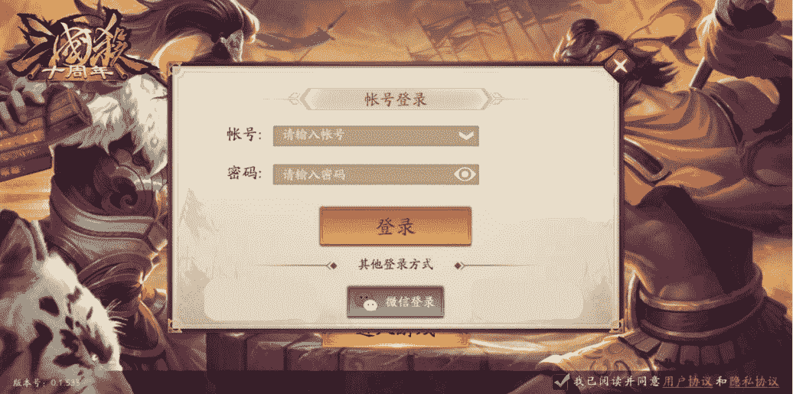

# 【2022】游卡校招测试笔试

## 1

登录界面是我们在使用各个平台或者工具时经常会接触的一个场景，下图是三国杀十周年游戏移动端截取的登录界面图片。如果这是一个尚未经过测试的产品，为保障产品的质量和可靠性，你觉得有哪些页面元素和功能场景需要检查校验呢？

请根据下图所示的登录界面，对登录过程进行测试用例设计。

（可以结合自身经验，从基本功能验证、特殊/极端场景、安全等角度思考，尽可能全面地回答）



你的答案

本题知识点

测试开发工程师 测试工程师 游卡

讨论

[坑坑坑坑坑坑坑](https://www.nowcoder.com/profile/1670477)

太困了，就随便写了点，可能有错字基本功能验证 1.账号输入栏：输入是否有正则限制，是否符合规范 2.账号输入栏下拉框：为空，已经保存一个账号，已经保存超过分页的等情况是否会形变                                   选中保存的，自动将保存的账号密码填入账号输入栏和密码输入栏，之后也可以成功切换，切均可以正确登陆 3.密码输入栏：输入是否有正则限制，键盘是否有限制，是否符合规范 4.密码输入栏小眼睛：小眼睛闭合，密码输入栏加密；小眼睛张开不加密 5.登陆：账号错误，密码错误，账号密码均正确，进入页面和提示提示均正确             如果账号是手机号，验证手机号为合法手机号，看是否会提示注册 6.微信：手机有微信跳转微信登陆页面，手机无微信按需求提示或跳转下载页面 7.可否进入用户协议和隐私协议页面，未选中状态点击登陆是否会提示安全等角度：1.登陆接口一般要加密，没有加密也要对密码加密，接口请求和相应是否符合标准 2.接口是否可以识别是否是模拟器，防止模拟器上作弊特殊/极端场景 1.不同尺寸、型号、品牌，以及苹果安卓是否可以兼容 2.使用 jmeter 并发跑这个接口，看是否符合预计用户量 3.开了方向锁定的情况下，从其他竖屏在是否可以自动横屏

发表于 2021-09-20 00:03:41

* * *

[禾里](https://www.nowcoder.com/profile/213304159)

不成熟的解答，个人的一个想法。基本功能验证：输入正确的账号密码能否进行正常登录，输入错误的账号密码是否会进行报错；登录页面的跳转是否流畅；其他登陆方式能否进行正常跳转，是否能成功登录；BUTTON 按钮的点击是否正常会不会出现无响应。特殊、极端场景：输入的账号密码中含有特殊字符或者账号输入过长或过短，系统能否识别出来并提示。安全：用户输入错误能否提示。

发表于 2021-09-12 17:19:24

* * *

[TestNovice](https://www.nowcoder.com/profile/560973407)

1.凡是可点击的页面元素均需要测试，页面可点击元素有 文本框，下拉框，单选框（必选），登录，微信登录，删除按钮,查看密码，开始游戏按钮。2.功能场景：《1》基本功能（1）.打开游戏，同意协议使用正常登录。（2）.打开游戏，同意协议使用微信登录，（3）.多个账号，点击下拉框是否有记录。（4）输入密码时点击密码查看，是否会显示明文。（5）点击删除是否会有相应结果。（6）不同意协议会怎样.(7)点击用户协议或者隐私协议会跳转页面吗？《2》特殊场景：（1）输入其他进制的账号密码是否登录成功呢。（2）我不点删除操作，我点其他页面元素是否有效果呢《3》安全角度：sql 注入会怎么样。

发表于 2022-03-23 19:01:58

* * *

## 2

现有 2 个已知重量砝码，分别为 2g，6g 以及一架天平秤。使用上述物品对重量为 1~12g 且无标识的 12 个未知砝码进行称量，砝码重量均为整数且不考虑损耗及生锈。那么利用现有的 2 个砝码和天平可以知道哪些砝码的重量。请写出答案及称量过程。

注：称量出重量的未知砝码不可参与后续称量,且不同重量的砝码大小一致。

你的答案

本题知识点

测试开发工程师 测试工程师 游卡

讨论

[牛客 753866380 号](https://www.nowcoder.com/profile/753866380)

1 能直接算出的砝码：2g,6g,1g(小于 2g 的砝码)，4g(2g+砝码=6g)，8g 砝码（2g+6g=砝码），即 1 2 4 6 8 2 将剩下的砝码且小于(2+6)8g 的砝码称量出来，是 3 5 7，称量大于 6g 的，即为 7g 砝码。将天平一边放 2g 砝码，一边 6g 砝码，将剩余砝码放左边，2+3<6 的是 3g 砝码，5+2>6 的是 5g 砝码，即求解出 3 5 73 剩余 9 10 11 12 四个砝码，可以使用 2g 砝码辅助称重，也可以四个互相比较每次选出最大的

发表于 2021-09-14 12:50:53

* * *

[牛客 402943823 号](https://www.nowcoder.com/profile/402943823)

我都不需要砝码，因为附加条件是称量出重量的砝码不可参与后续称量，但是未称量出的砝码是可以的那么就用冒泡法，每次都能找出最小重量的砝码，所以所有的砝码都可以找出重量

发表于 2021-09-12 19:06:47

* * *

[Smile_strcpy](https://www.nowcoder.com/profile/4844368)

1、已知重量 2g 砝码放在天平一端，选择未知重量砝码依次置于天平另一端  天平水平时，测出砝码重量为 2g2、已知重量 6g 砝码放在天平一端，选择未知重量砝码依次置于天平另一端，天平水平时，测出砝码重量为 6g3、已知重量 2g 砝码和 6g 砝码放在天平一端，选择未知重量砝码依次置于天平另一端，天平水平时，测出砝码重量为 8g4、已知重量 2g 砝码放在天平一端，已知重量 6g 砝码放在天平另一端，选择未知重量砝码依次置于天平放置 2g 砝码那一端，天平水平时，测出砝码重量为 4g5、已知重量 2g 砝码放在天平一端，选择未知重量砝码依次置于天平另一端，天平重量偏向 2g 砝码那一端时，测出砝码重量为 1g

发表于 2021-09-14 11:24:30

* * *

## 3

给出 N 名运动员的成绩，找出他们的相对名次并授予前三名对应的奖牌。前三名运动员将会被分别授予 “金牌”，“银牌” 和“ 铜牌”（"Gold Medal", "Silver Medal", "Bronze Medal"）。
分数越高的选手，排名越靠前。数据范围 0<=N<=10⁵

本题知识点

测试开发工程师 测试工程师 游卡

讨论

[零葬](https://www.nowcoder.com/profile/75718849)

这个题有点卡语言吧，同样的思路 Java 超时，非得换成 C++才能 AC。思路很简单，只要用 map 来实现一个类似 argsort 的功能就行。

```cpp
class Solution {
public:
    /**
     * 代码中的类名、方法名、参数名已经指定，请勿修改，直接返回方法规定的值即可
     *
     * 
     * @param score int 整型 vector 运动员成绩
     * @return string 字符串 vector
     */
    static bool cmp(int a, int b){
        return a > b;
    }
    vector<string> findRelativeRanks(vector<int>& score) {
        // write code here
        vector<int> sortedScore = score;
        sort(sortedScore.begin(), sortedScore.end(), cmp);
        unordered_map<int, string> map;
        for(int i = 0; i < score.size(); i++){
            if(i == 0){
                map[sortedScore[i]] = "Gold Medal";
            }else if(i == 1){
                map[sortedScore[i]] = "Silver Medal";
            }else if(i == 2){
                map[sortedScore[i]] = "Bronze Medal";
            }else{
                map[sortedScore[i]] = to_string(i + 1);
            }
        }
        vector<string> result;
        for(int i = 0; i < score.size(); i++) result.push_back(map[score[i]]);
        return result;
    }
};
```

发表于 2021-09-21 08:27:36

* * *

[wayne_17](https://www.nowcoder.com/profile/1482696)

```cpp
class Solution:
    def findRelativeRanks(self , score ):
        tmp = sorted(list(set(score))) # 去重排序
        tmp = dict(zip(tmp, list(range(len(tmp), 0, -1)))) # 每个元素的索引（名次，从 1 开始）
        res = [str(tmp[i]) for i in score] # 根据分数排名次

        for i in range(len(score)):
            if res[i] == '1':
                res[i] = 'Gold Medal'
            if res[i] == '2':
                res[i] = 'Silver Medal'
            if res[i] == '3':
                res[i] = 'Bronze Medal'

        return res
```

发表于 2022-03-21 22:06:49

* * *

## 4

给你一个整数数组 nums ，你需要找出一个 连续子数组 ，如果对这个子数组进行升序排序，那么整个数组都会变为升序排序。请你找出符合题意的 最短 子数组，并输出它的长度。1 <= nums.length <= 10⁷

本题知识点

测试开发工程师 测试工程师 游卡

讨论

[wayne_17](https://www.nowcoder.com/profile/1482696)

排序后与原数组进行比较即可，类似双指针

```cpp
class Solution:
    def findUnsortedSubarray(self , nums ):
        sortNums = sorted(nums)
        i, j=0, len(nums)-1
        while i<len(nums):
            if nums[i] != sortNums[i]:
                break
            i += 1
        while j>=i: # 防止重复比较
            if nums[j] != sortNums[j]:
                break
            j -= 1
        return j-i+1

```

发表于 2022-03-21 22:29:58

* * *

[零葬](https://www.nowcoder.com/profile/75718849)

比较排序前和排序后的数组，找到第一个不一致元素的索引 start 和最后一个不一致元素的索引 end 就能求得长度 end - start + 1。但要注意本来就为升序的数组，这样计算出来的长度会小于 0，需要特殊处理一下。

```cpp
import java.util.*;

public class Solution {
    /**
     * 代码中的类名、方法名、参数名已经指定，请勿修改，直接返回方法规定的值即可
     *
     * 
     * @param nums int 整型一维数组 
     * @return int 整型
     */
    public int findUnsortedSubarray (int[] nums) {
        // write code here
        int[] sortedNums = Arrays.copyOfRange(nums, 0, nums.length);
        Arrays.sort(sortedNums);
        int start = 0;
        while(start < nums.length){
            if(sortedNums[start] != nums[start]) break;
            start ++;
        }
        int end = nums.length - 1;
        while(end >= 0){
            if(sortedNums[end] != nums[end]) break;
            end --;
        }
        return Math.max(end - start + 1, 0);
    }
}
```

编辑于 2021-09-21 10:10:42

* * *

[牛客 973466469 号](https://www.nowcoder.com/profile/973466469)

import java.util.*;public class Solution {
    public int findUnsortedSubarray (int[] nums) {

        int start=start(nums,nums.length);
        if(start==-1)
            return 0;
        int tail=start;
        int max=nums[start];
        for(int i=start;i<nums.length-1;i++){
            if(nums[i+1]<max){
                tail=i+1;
            }
            if(nums[i+1]>max){
                max=nums[i+1];
            }
}
        return tail-start+1;
    }

    public int start(int[] nums,int length){
        if (length <=1)
            return -1;
        for(int i=0;i<length-1;i++){
            if (nums[i]>nums[i+1])
                return i;
        }
            return -1;
    }
}

发表于 2021-09-16 10:32:55

* * *