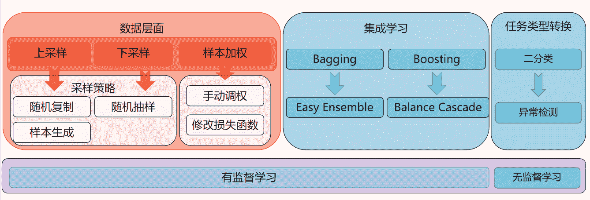

# TME2022 校园招聘技术研究类/数据类笔试（I）

## 1

牛妹给了牛牛一个长度为  的下标从开始的正整型数组  ，粗心的牛牛不小心把其中的一些数字删除了。

假如被删除了，则。对于所有被删除的数字，牛牛必须选择一个正整数填充上。现在牛牛想知道有多少种填充方案使得：

*    且对于所有的满足 。

函数传入一个下标从开始的数组  和一个正整数  ，请返回合法的填充方案数对 取模的值,保证不存在方案数为 0 的数据。

本题知识点

数组 动态规划

讨论

[秋喀喀喀](https://www.nowcoder.com/profile/62368996)

双指针+一维数组优化+CPP5ms 444KB 利用双指针来确定连续 0 的区域，确定连续 0 的左端点值设为 min，右端点值设为 max，那么区域内的 0 只能用[min,max]中的值来填充，当只有一个 0 的时候，总方案数就是[min,max]内的值都选择一次，故可以设置一个数组 tmp,其长度为 max-min+1，为方便理解，不妨设下标为 min-max，表示第一个 0 填充的值等于下标时的方案数，比如若第一个 0 用 min 去填充，那么 tmp[min]就代表第一个 0 填充 min 时的方案数，那么总的方案数就是 tmp[min]+...+tmp[max]，tmp[]初始化全为 1，因为只有一个 0 时，只能填充一次，采用“后缀和”也就是从后往前累加，如此 tmp[min]就是总方案数：tmp[min]=max-min+1,这样做也是为了方便后续处理不止一个 0 时的情况；当有两个连续 0 时，先固定第一个 0 的取值，然后去填充第二个 0，第一个 0 填充 min，那么 tmp[min]就等于填充第二个 0 的可行方案数：大于等于 min，小于等于 max 的填充值的个数 max-min+1；第一个 0 填充 min+1 时，tmp[min+1]就等于填充第二个 0 的可行方案数：大于等于 min+1，小于等于 max 的填充值的个数 max-min......第一个 0 填充 max 时，tmp[max]就等于填充第二个 0 的方案数：等于 max 的个数:1。可以发现和“后缀和”处理后的 tmp[]一致，那么同样后缀和处理，此时 tmp[min]就是两个连续 0 时的总方案数；依此类推，每多一个 0 就后缀和处理一次。同时，为了不用特别处理边界问题，可以用值 1 作为起始值，k 作为末尾值

```cpp
class Solution {
public:
    int FillArray(vector<int>& a, int k) {
        vector<long long> res;
        long long ans=1,mod=1000000007;
        long len=a.size(),l=0,r=0;
        a.insert(a.begin(),1);
        a.push_back(k);
        for(long i=0;i<len+2;i++){
            if(a[i]==0){
                l=i-1;
                while(a[i]==0)
                    i++;
                r=i;
                vector<long long> tmp(a[r]-a[l]+1,1);
                for(long j=r-l-1;j>0;j--){
                    for(long long t=a[r]-a[l]-1;t>=0;t--){
                        tmp[t]+=tmp[t+1]%mod;//样例数很恶心，时刻注意取余
                    }
                }
                res.push_back(tmp[0]%mod);
            }
        }
        for(long i=0;i<res.size();i++)
            ans=(ans*res[i])%mod;
        return ans;
    }
};
```

编辑于 2022-02-28 23:52:23

* * *

[hzy1721](https://www.nowcoder.com/profile/5376314)

```cpp
class Solution {
public:
    int FillArray(vector<int>& a, int k) {
        int n = a.size();
        vector<vector<int> > dp(n + 1, vector<int>(k + 1));
        const int MOD = 1000000007;
        for (int j = 1; j <= k; ++j)
            dp[1][j] = j;
        for (int i = 2; i <= n; ++i)
            dp[i][0] = 0;
        for (int i = 2; i <= n; ++i)
            for (int j = 1; j <= k; ++j)
                dp[i][j] = (dp[i][j-1] + dp[i-1][j]) % MOD;
        int i = 0;
        int ans = 1;
        while (i < n) {
            while (i < n && a[i] != 0)
                ++i;
            if (i == n)
                break;
            int st = i;
            int lo = (i > 0 ? a[i-1] : 1);
            while (i < n && a[i] == 0)
                ++i;
            int ed = i;
            int hi = (i < n ? a[i] : k);
            ans = ((long long)ans * dp[ed-st][hi-lo+1]) % MOD;
        }
        return ans;
    }
};
```

发表于 2022-01-13 15:35:58

* * *

[牛客 226198207 号](https://www.nowcoder.com/profile/226198207)

运行时间 70ms 占用内存 14716KB   1.必须要使用 BigInteger,不然会溢出;    2.方案数拆开来其实是个简单的数列自增问题    3.fillZero 方法是关键(不要递归,递归效率会崩)因为太久不做数学题导致敏感性下降,结果很简单的问题本来看懂了规律却没想出来公式,只能套递归,崩了,参考了评论里的第一条才想明白公式原来这么简单,看来人已经废了...    public int FillArray (int[] a, int k) {        // write code here
        return findSolution(a,k).mod(BigInteger.valueOf(1000000007)).intValue();
    }
    private BigInteger findSolution (int[] a, int k) {
        int[] b = new int[a.length+2];
        b[0] = 1;
        b[b.length-1] = k;
        System.arraycopy(a,0,b,1,a.length);

        BigInteger res = BigInteger.ONE;
        int begin=1;
        int lastIndex = b.length-1;

        while(begin<lastIndex){
            while(0!=b[begin]){
                if (lastIndex == begin) return res;
                begin++;
            }
            int min= b[begin-1];
            int zero=0;
            while(0==b[begin]){
                zero++;
                begin++;
            }
            int max= b[begin];
            int sols= max-min+1;
            res = res.multiply(fillZero(sols,zero));
        }
        return res;
    }

   private BigInteger fillZero (int sols, int zero) {
        if (zero > 1) {
            BigInteger[] prob = new BigInteger[sols];
            for (int i=0;i<sols;i++){
                prob[i]= BigInteger.valueOf(i+1);
            }
            while (zero-->1){
                BigInteger[] temp = new BigInteger[sols];
                for (int j=1;j<sols;j++){
                    prob[j]=prob[j-1].add(prob[j]);
                }
            }
            return prob[sols-1];
        } else {
            return BigInteger.valueOf(sols);
        }
    }

编辑于 2021-12-13 23:58:52

* * *

## 2

有一个只由字符'1'到'9'组成的长度为  的字符串  ，现在可以截取其中一段长度为  的子串并且将该子串当作十进制的正整数，如对于子串"123"，其对应的十进制数字就是 。

如果想让这个正整数尽可能的大的话，问该正整数最大能是多少。

函数传入一个长度为  的字符串  和一个正整数  ，请你返回答案。

本题知识点

字符串 *讨论

[零葬](https://www.nowcoder.com/profile/75718849)

滑窗截取所有长度为 k 的子串，并将其转化为十进制数，然后求得最大值就可以了

```cpp
import java.util.*;

public class Solution {
    /**
     * 代码中的类名、方法名、参数名已经指定，请勿修改，直接返回方法规定的值即可
     *
     * 
     * @param s string 字符串 
     * @param k int 整型 
     * @return int 整型
     */
    public int maxValue (String s, int k) {
        // write code here
        int maxValue = -1;
        for(int i = 0; i <= s.length() - k; i++)
            maxValue = Math.max(maxValue, Integer.parseInt(s.substring(i, i + k)));
        return maxValue;
    }
}
```

发表于 2021-10-26 21:43:25

* * *

[QNBZ](https://www.nowcoder.com/profile/967487251)

```cpp
class Solution {
public:
    int maxValue(string s, int k) {
        int Max=stoi(s.substr(0,k));

       for(int i=1;i+k<s.size();i++)
       {
           int num=stoi(s.substr(i,k));
           Max=max(Max,num);
       }
        return Max;
    }
};
```

 发表于 2022-01-14 16:55:18

* * *

[生于南](https://www.nowcoder.com/profile/133610594)

functionmaxValue( s ,  k ) {    const arr = [];    for(let i = 0;i < s.length;i++){        if(k < s.length){            arr.push(s.substring(i,k++));        }    }    arr.sort();    arr.reverse();    return arr[0];    }

发表于 2021-10-20 13:47:21

* * *

## 3

有一棵有个节点的二叉树，其根节点为。修剪规则如下:1.修剪掉当前二叉树的叶子节点，但是不能直接删除叶子节点 2.只能修剪叶子节点的父节点，修剪了父节点之后，叶子节点也会对应删掉 3.如果想在留下尽可能多的节点前提下，修剪掉所有的叶子节点。请你返回修剪后的二叉树。有如下二叉树:

```cpp
     o
    / \
   o   o
  / \  / \
 o  o o   o
```

修剪过后仅会留下根节点。

本题知识点

树

讨论

[hzy1721](https://www.nowcoder.com/profile/5376314)

```cpp
class Solution {
private:
    bool isLeaf(TreeNode *root) {
        return root && !root->left && !root->right;
    }
public:
    TreeNode* pruneLeaves(TreeNode* root) {
        if (!root || isLeaf(root) || isLeaf(root->left) || isLeaf(root->right))
            return nullptr;
        root->left = pruneLeaves(root->left);
        root->right = pruneLeaves(root->right);
        return root;
    }
};
```

发表于 2022-01-13 15:35:01

* * *

[零葬](https://www.nowcoder.com/profile/75718849)

递归就行

```cpp
import java.util.*;

/*
 * public class TreeNode {
 *   int val = 0;
 *   TreeNode left = null;
 *   TreeNode right = null;
 *   public TreeNode(int val) {
 *     this.val = val;
 *   }
 * }
 */

public class Solution {
    /**
     * 代码中的类名、方法名、参数名已经指定，请勿修改，直接返回方法规定的值即可
     *
     * 
     * @param root TreeNode 类 
     * @return TreeNode 类
     */
    public TreeNode pruneLeaves (TreeNode root) {
        // 以下三种情况会将当前节点修剪掉
        // 当前节点是空节点
        if(root == null)
            return null;
        // 左孩子是叶子节点
        if(root.left != null && root.left.left == null && root.left.right == null)
            return null;
        // 右节点是叶子节点
        if(root.right != null && root.right.left == null && root.right.right == null)
            return null;
        root.left = pruneLeaves(root.left);
        root.right = pruneLeaves(root.right);
        return root;
    }
}
```

发表于 2021-10-26 21:38:15

* * *

[不偷不抢安度因 _](https://www.nowcoder.com/profile/275523507)

```cpp
class Solution {
public:
    /**
     * 代码中的类名、方法名、参数名已经指定，请勿修改，直接返回方法规定的值即可
     *
     *
     * @param root TreeNode 类
     * @return TreeNode 类
     */
    TreeNode* pruneLeaves(TreeNode* root) {
        // write code here
        if (root == nullptr) {
            return nullptr;
        }
        if (root->left == nullptr && root->right == nullptr) {
            return nullptr;
        }
        if (root->left != nullptr && root->left->left == nullptr && root->left->right == nullptr) {
            return nullptr;
        }
        if (root->right != nullptr && root->right->left == nullptr && root->right->right == nullptr) {
            return nullptr;
        }
        root->left = pruneLeaves(root->left);
        root->right = pruneLeaves(root->right);
        return root;
    }
};
```

发表于 2021-10-14 17:15:55

* * *

## 4

训练数据不平衡是深度学习项目中的常见现象，数据不平衡问题会带来什么问题，有哪些常用的解决办法？

你的答案

本题知识点

算法工程师 大数据开发工程师 数据分析师 数据库工程师 腾讯音乐娱乐

讨论

[零葬](https://www.nowcoder.com/profile/75718849)

由于通常情况下模型的损失函数对所有样本“一视同仁”（总损失由各个样本的损失求平均得到，所有样本的权重其实是相同的）。因此，数据不平衡会使得模型在少数类样本上毫无泛化性，或完全被多数类样本压制，完全学不到少数类样本的特点。因为即使模型只能识别多数类，也能使得总损失很低，而模型训练的过程仅仅是降低总损失。我们通常可以从数据层面、模型层面和任务类型来解决数据不平衡问题，如下图所示：

编辑于 2021-12-07 11:26:57

* * **