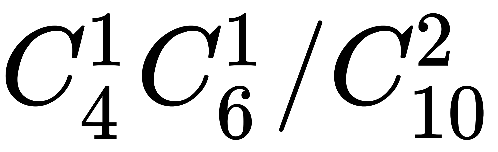
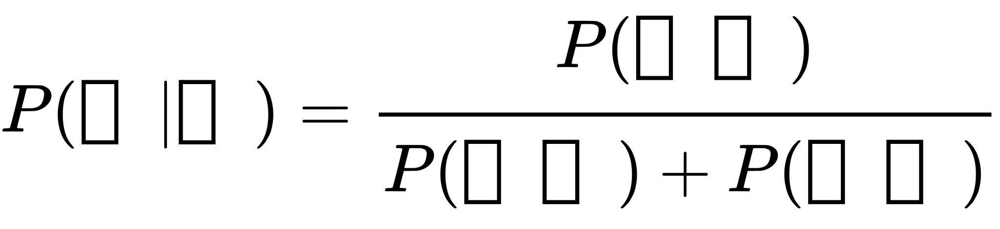
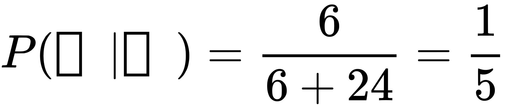
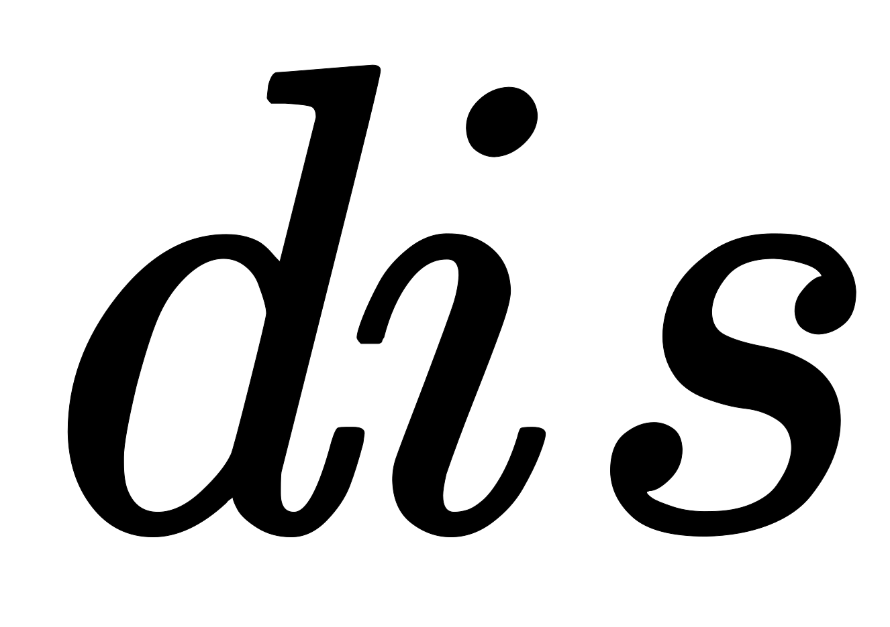
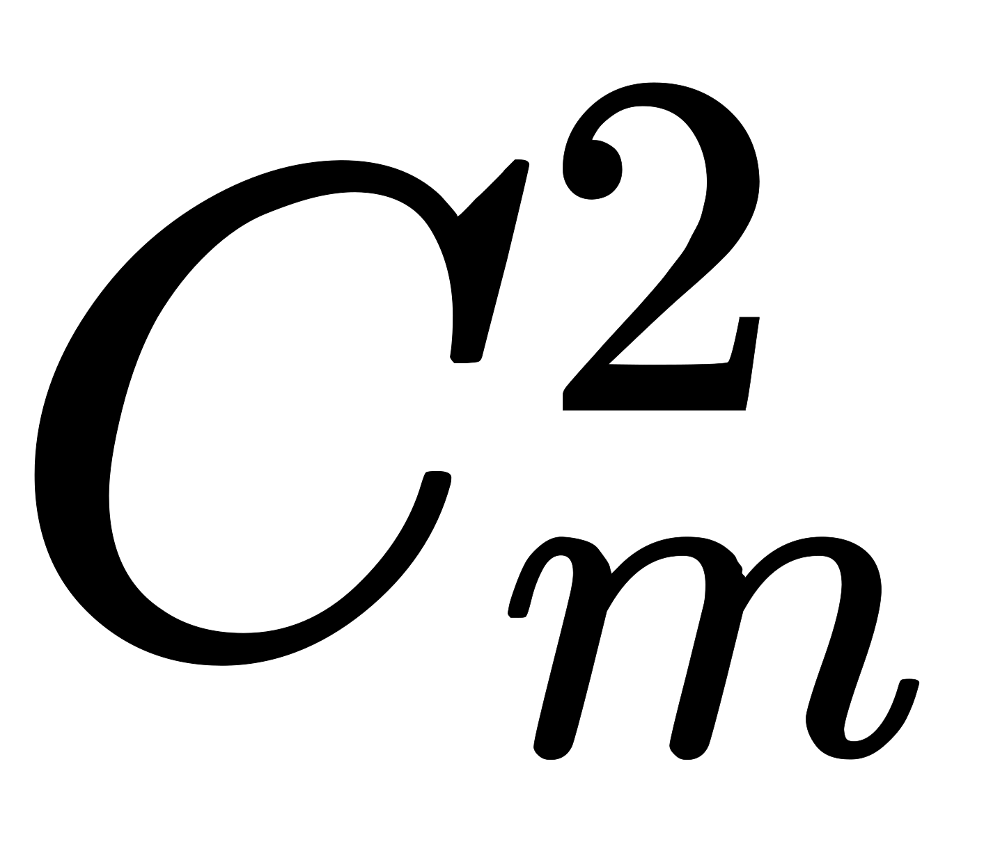
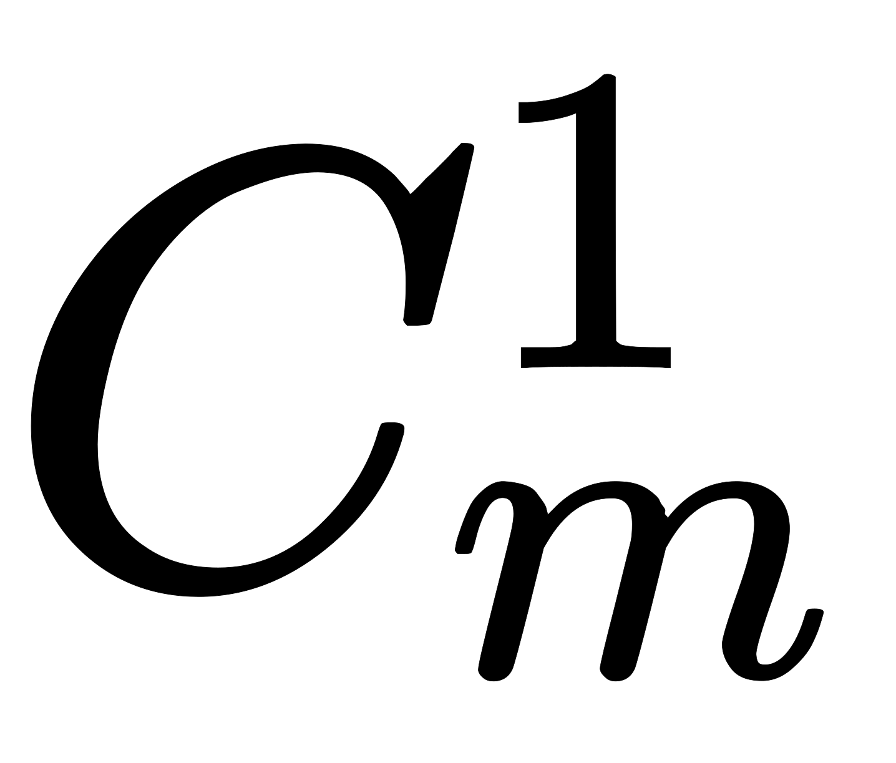

# 【2021】牛客模考·大厂定制真题算法工程师

## 1

下面关于 new/delete 和 malloc/free 这四个关键字的说法错误的是（）

正确答案: C   你的答案: 空 (错误)

```cpp
new/delete 是 C++运算符
```

```cpp
malloc/free 是 C/C++标准库函数
```

```cpp
malloc/free 可以用来创建和释放动态对象
```

```cpp
new 和 malloc 用来申请内存，delete 和 free 用来释放内存
```

None

## 2

下面关于 const 和#define 说法错误的是（）

正确答案: B   你的答案: 空 (错误)

```cpp
#define 宏在预处理阶段展开，const 常量在编译运行阶段使用
```

```cpp
const 变量和#define 宏都会分配内存
```

```cpp
#define 宏不做任何类型检查，const 常量在编译阶段就会进行类型安全检查
```

```cpp
#define a 1 与 const int a 定义的 a 类型不一样
```

None

讨论

[零葬](https://www.nowcoder.com/profile/75718849)

#define 宏不需要检查类型，无需分配内存

发表于 2022-01-15 23:01:27

* * *

## 3

C4.5 算法是机器学习算法中的一种分类决策树算法，下面关于 C4.5 算法错误的是（）

正确答案: C   你的答案: 空 (错误)

```cpp
C4.5 算法产生的分类规则易于理解，准确率较高
```

```cpp
 C4.5 算法继承了 ID3 算法
```

```cpp
在构造树的过程中， C4.5 算法效率较高
```

```cpp
 C4.5 算法可以对不完整数据进行处理。 
```

None

讨论

[零葬](https://www.nowcoder.com/profile/75718849)

C4.5 算法选择划分属性使用的信息增益率，ID3 使用的是信息增益，信息增益率的计算效率会更低一些

发表于 2022-01-15 23:00:53

* * *

## 4

假设文本文件中有多处连续的空白行，下边哪个命令可以压缩相邻的空白行 

正确答案: C   你的答案: 空 (错误)

```cpp
cat -b file
```

```cpp
cat -n file
```

```cpp
cat -s file
```

```cpp
cat -T file
```

None

讨论

[blacker50](https://www.nowcoder.com/profile/2219065)

-n 或 --number：由 1 开始对所有输出的行数编号。
-b 或 --number-nonblank：和 -n 相似，只不过对于空白行不编号。
-s 或 --squeeze-blank：当遇到有连续两行以上的空白行，就代换为一行的空白行。
-T 或 --show-tabs: 将 TAB 字符显示为 ^I。

发表于 2022-01-05 15:39:49

* * *

## 5

以下哪些命令不能实现打印文件 file 中第 7 行文本的功能

正确答案: D   你的答案: 空 (错误)

```cpp
head -7 file |tail -1
```

```cpp
sed -n 7p file
```

```cpp
awk '7 == NR' file
```

```cpp
cat s 7 file
```

None

讨论

[blacker50](https://www.nowcoder.com/profile/2219065)

A 中 head -7 file 表示打印文件前 7 行，tail -1 表示从末尾算起第一行，两个指令结合起来表示输出第 7 行

B 应为

```cpp
sed -n '7p' file
```

其中 -n 这个参数是--quiet 或者--silent 的意思。表明忽略执行过程的输出，只输出我们的结果即可
’7p‘分为 7 行输出（print）

C 指令可以
D 中 cat s 7 file，只查到-s 表示输出中隐藏重复的空行

编辑于 2022-01-05 16:10:25

* * *

## 6

下列关于强化学习和无监督学习说法错误的是：

正确答案: C   你的答案: 空 (错误)

```cpp
对非监督学习来说，它通过对没有概念标记的训练例进行学习，以发现训练例中隐藏的结构性知识。
```

```cpp
对强化学习来说，它通过对没有概念标记、但与一个延迟奖赏或效用（可视为延迟的概念标记）相关联的训练例进行学习，以获得某种从状态到行动的映射。
```

```cpp
强化学习的训练也需要大量的监督信号来提供奖励
```

```cpp
非监督式不是学习输入到输出的映射，而是模式
```

None

## 7

如图所示的是一个经典的神经网络结构，下列说法正确的是：


正确答案: A   你的答案: 空 (错误)

```cpp
这是 LeNet 结构
```

```cpp
该网络可以用于 ImageNet 图像分类中
```

```cpp
该网络没有非线性激活
```

```cpp
这是 AlexNet 结构
```

None

讨论

[零葬](https://www.nowcoder.com/profile/75718849)

ImageNet 是 1000 分类，图示的 LeNet 只有 10 个输出，做不了 ImageNet 的图像分类

发表于 2022-01-15 22:59:34

* * *

## 8

如图所示。最有可能的深度学习技术是：


正确答案: B   你的答案: 空 (错误)

```cpp
模型量化

```

```cpp
模型剪枝
```

```cpp
dropout
```

```cpp
dropact
```

None

## 9

1. 分别以下列序列构造二叉排序树，层次遍历序列与用其它三个结果不同的是（）

正确答案: D   你的答案: 空 (错误)

```cpp

（100，80，90，140，50，120，160)

```

```cpp

（100，140，160，120，80，50，90）

```

```cpp

（100，80，50，90，140，160，120）

```

```cpp

（100，50，90，80，120，140，160）

```

None

讨论

[MindCoder](https://www.nowcoder.com/profile/396253723)

二叉排序树的特点，左子树的所有节点都比根节点小，右子树的所有节点都比根节点大，左、右子树也是个二叉排序数

发表于 2022-02-23 18:55:05

* * *

[零葬](https://www.nowcoder.com/profile/75718849)

从上往下遵循二叉搜索树的性质插入节点，A、B、C 得到的树都是         100         /      \      80      140   /     \       /    \50    90   120  160D 得到的树是      100      /     \   50     120      \          \      90      140      /               \    80            160

编辑于 2022-01-16 15:59:08

* * *

## 10

在 python 中我们可以使用分片操作来访问一定范围内的元素。

假如 a = [0,1,2,3,4,5,7,8,9]

并且我们知道进行了索引后，

得到 list b 为[1, 3, 5, 7]，那么进行的索引操作为

正确答案: D   你的答案: 空 (错误)

```cpp

b=a[0::2]

```

```cpp

b=a[1:-1]

```

```cpp

b=a[1::2]

```

```cpp

b=a[1:-1:2]

```

None

讨论

[零葬](https://www.nowcoder.com/profile/75718849)

这个题有问题，5 和 7 之间少了个 6

发表于 2022-01-15 22:52:19

* * *

## 11

小明在写一个 Python 程序，他定义了函数 mytripler 函数如下，那么请问 mytripler(10)等于多少

def myfunc(n):    
    return lambda a : a * n
mytripler = myfunc(3)

正确答案: B   你的答案: 空 (错误)

```cpp
10
```

```cpp
30
```

```cpp
100
```

```cpp
1000
```

None

## 12

若干个等待访问磁盘者依次要访问的磁道为 22,46,43,7,82,14,79,当前磁头位于 43 号柱面，若用最短寻道时间优先磁盘调度算法，则访问序列为?

正确答案: B   你的答案: 空 (错误)

```cpp
22, 46, 43, 7, 82, 14, 79
```

```cpp
43, 46, 22, 14, 7, 79, 82

```
43, 46, 79, 82, 22, 14, 7
```cpp

```
43, 46, 79, 82, 7, 14, 22
```cpp

```
43, 46, 79, 82, 14, 7, 22
```cpp

        None

讨论

[零葬](https://www.nowcoder.com/profile/75718849)

                                                                    每次找离自己最近的道就行

发表于 2022-01-15 22:51:13

* * *

## 13

        下面关于页式存储管理说法错误的是?

正确答案:
                                A
                                                                          你的答案:

                  空
                             (错误)

```
页帧(page frame 即物理地址空间的基本分配单位，有的也叫页框)和页面(逻辑地址空间基本的分配单位)大小可以不一样
```cpp

```
某些页面可能会映射不到物理页帧，那么会产生缺页中断或缺页错误
```cpp

```
进程的逻辑地址空间被划分为大小相同的页，页内偏移等于帧内偏移，页号通常不等于帧号
```cpp

```
逻辑地址的页号连续，对应的物理地址帧号不一定连续
```cpp

        None

## 14

   在一个非递减数组 a 中查找数字 target，如果存在返回 true，否则返回 false，那么下面代码需要补充为（）。  

```
bool find(int a[], int target) {
    int l = 0, r = arraySize, mid;
    while(l <= r) {
        mid = (l + r)/2;
        if(a[mid] > target) r = mid - 1;
        else if(a[mid] == target)   return true;
        else l = mid + 1;
    }
    return false;
}

```cpp

正确答案:
                                A
                                                                          你的答案:

                  空
                             (错误)

```

①l <= r ②a[mid] == target

```cpp

```

①l < r ②a[mid] != target

```cpp

```

①l < r ②a[mid] == target

```cpp

```

①l <= r ②a[mid] != target

```cpp

        None

## 15

          二叉树 T1，点集为{A, B, C, D, E}, 边集为{A-B, A-C, C-D, C-E}。二叉树 T2，点集为{A, B, C, D, E}, 边集为{A-D, B-E, C-E, D-E}。下列（）既是 T1 的 BFS 序，又是 T2 的 DFS 序.  
   ①ABCDE ②ABCED ③ACBDE ④ACBED

正确答案:
                                                                                   D
                       你的答案:

                  空
                             (错误)

```
①②
```cpp

```
②③
```cpp

```
①②③
```cpp

```
②④
```cpp

        None

讨论

[憧憬 201906251931631](https://www.nowcoder.com/profile/866551052)

                                                                    这题 t2 根本就不是二叉树，***题怎么这么多

发表于 2022-01-13 10:56:54

* * *

[零葬](https://www.nowcoder.com/profile/75718849)

                                                                      注意边集不一定是父节点指向子节点，子节点指向父节点也是边 
   二叉树 T1 为以下两种结构，层次遍历分别为：ABCED，ACBED 
           A                           A 
         /    \                       /    \ 
       B      C                  C     B 
              /    \                       /   \ 
            E     D                   E     D 
   二叉树 T2 为以下两种结构，后序遍历分别为：ABCED，ACBED 
           D                          D 
          /   \                       /    \ 
        A     E                   A      E 
              /   \                         /  \ 
            B     C                    C    B 

发表于 2022-01-15 23:09:00

* * *

[Joker 清风](https://www.nowcoder.com/profile/5582190)

                                                                    A
  /
 D
  \
  E
  /\
 B C
不是么？

发表于 2022-03-02 18:25:55

* * *

## 16

    在机器学习中，以下关于数据降维技术的描述，正确的是（）。   

正确答案:
                                                                                   D
                       你的答案:

                  空
                             (错误)

```

PCA 的目标是发现可以最优化分类的特征子空间。

```cpp

```

LDA 是在高维数据中找到最大方差的方向，将数据映射到一个维度不大于原始数据的新的子空间上。

```cpp

```

LDA 与 PCA 都是可用于降维的非线性转换技巧，其中 PCA 是无监督算法，而 LDA 是监督算法。

```cpp

```

LDA 假定特征呈正态分布且特征间相互独立，若数据违背该假设，LDA 仍能很好地完成降维任务。

```cpp

        None

## 17

           

正确答案:
                                A
                                                                          你的答案:

                  空
                             (错误)

```
0.99
```cpp

```
0.90
```cpp

```
0.89
```cpp

```
0.80
```cpp

        None

## 18

        过拟合是在指在模型训练过程中，在训练集上的结果远好于在测试集上的结果。通过 ____ 可以减弱过拟合现象。

正确答案:
                                                                                   D
                       你的答案:

                  空
                             (错误)

```
增加测试集数据量
```cpp

```
减少测试集数据量
```cpp

```
使用拟合能力更强的模型
```cpp

```
为损失函数增加正则项
```cpp

        None

## 19

          Softmax 函数是多分类任务中非常常用的一个激活函数，可以将一个向量映射成一个概率分布。但是因为 Softmax 在计算时涉及到指数运算，非常容易出现数值溢出。下列哪个方法可以解决这个问题（） 

正确答案:
                                                                  C
                                        你的答案:

                  空
                             (错误)

```
将向量中的每个元素都减去向量中的最小值
```cpp

```
将向量中的每个元素都加上向量中的最小值
```cpp

```
将向量中的每个元素都减去向量中的最大值
```cpp

```
将向量中的每个元素都加上向量中的最大值
```cpp

        None

## 20

          支持向量机（SVM）可以通过什么办法解决非线性分类问题（） 

正确答案:
                                                                  C
                                        你的答案:

                  空
                             (错误)

```
修改损失函数
```cpp

```
修改网络结构
```cpp

```
使用核方法
```cpp

```
使用软间隔
```cpp

        None

## 21

        假设有一个箱子，箱子里面有 10 个乒乓球，其中有 4 个是黄球，6 个是白球，从中任取两个球，已知两个球中有一个球为黄球，那么另一个球也是黄球的概率为（）。

正确答案:
                                                                  C
                                        你的答案:

                  空
                             (错误)

```
1/2
```cpp

```
2/3
```cpp

```
1/5
```cpp

```
2/5
```cpp

        None

讨论

[Trust9ourself](https://www.nowcoder.com/profile/144938615)

                                                                      根据题目已知两个球中有一个球为黄球，那么第二个球可能为黄也可能为白，但是我们需要的结果是两黄。  
   这下思路就清晰了：  
   想要的答案就应该等于 = 黄黄/（黄白+黄黄） 
   =>黄黄==2/15 
   =>黄白==8/15 
   把数据带进公式就可以得到：2/15 / (2/15+8/15) = 1/5 

编辑于 2022-01-06 14:41:10

* * *

[零葬](https://www.nowcoder.com/profile/75718849)

                                                                      取两个球，有四种情况：(黄,白)，(白,黄)，(黄,黄)，(白,白)。在其中一个球为黄色的情况下，根据条件概率，应该抛弃事件(白,白) 
   

   两个黄球的概率为 
   一黄一白的概率为 
   最终得 

发表于 2022-01-15 23:17:47

* * *

## 22

          考虑下面的结构声明，这个结构体共需要（）字节，s.x 的偏移量为（）。 

```
struct prob{
    int *p;
    struct{
        int x;
        int y;
    } s;
    struct prob *next;
};
```cpp

正确答案:
                                                 B
                                                         你的答案:

                  空
                             (错误)

```
24    4
```cpp

```
24    8
```cpp

```
12    4
```cpp

```
32    8
```cpp

        None

## 23

        DMA 技术是指外部设备不通过 CPU 而直接与系统内存交换数据的接口技术。它允许在外部设备和存储器之间直接读写数据，既不通过 CPU，也不需要 CPU 干预，是一种高速的数据传输操作。那么有关 DMA 的描述正确的是（）

正确答案:
                                                                  C
                                        你的答案:

                  空
                             (错误)

```
DMA 传送方式中，DMA 控制器每传送一个数据就窃取一个指令周期
```cpp

```
中断发生时，CPU 首先执行入栈指令将程序计数器内容保护起来
```cpp

```
输入输出操作的最终目的是要实现 CPU 与外设之间的数据传输
```cpp

```
在 DMA 周期内，CPU 不能执行程序
```cpp

        None

## 24

        对于一个正整数 n ，当他被质数之手摸过后，会变成若干个不同的质数，并且这些质数的长度都与 n 相等，构成其中任意一个质数的数字种类和数量，都和构成 n 的种类和数量相同（即构成这个数的所有数字都是由原数的每一位构成的）。请你找出 n 被质数之手摸过后，有多少种不同的素数会出现。如果出现了至少一种素数，请输出其中最小的一个。

        None

讨论

[UPMagic](https://www.nowcoder.com/profile/4079837)

```
import java.util.*;
public class Main{
    public static void main(String[] args){
        Scanner in = new Scanner(System.in);
        String num  = in.next();
        getFrom(num,"",0);
        System.out.println(n);
        if(n!=0){
            System.out.println(min);
        }
    }
    public static int n = 0;
    public static int min = 0;
    public static Set<String> hset = new HashSet<String>();
    public static void getFrom(String num,String t,int l){
        if(num.length()>0){
            for(int i=0;i<num.length();i++){
                if(l==0){
                    if(num.charAt(i)-'0'==0){
                        return;
                    }
                }
                String tp = t + String.valueOf(num.charAt(i));
                String newNum = new StringBuffer(num).deleteCharAt(i).toString();
                getFrom(newNum,tp,l+1);
            }
        }else{
            if(hset.contains(t)){
                return;
            }
            hset.add(t);
            int tn = Integer.parseInt(t);
            for(int i=2;i<=Math.sqrt(tn);i++){
                if(tn%i==0){
                    return;
                }
            }
            n++;
            if(min==0){
                min=tn;
            }else{
                min = min<tn?min:tn;
            }
        }
    }
}

```cpp

发表于 2022-02-23 17:59:29

* * *

[零葬](https://www.nowcoder.com/profile/75718849)

  回溯法 

   故弄玄虚，题干这么绕口，其实就是对某个数的各位进行全排列后的所有数中有多少是质数？最小的质数是多少？输入的数最大只有 7 位，全排列是完全 hold 得住的，但是我们可以进行一些常数时间的优化。 

1.  一上来就把能被 3 整除的数排除掉；      

2.  在深搜的过程中排除有前导 0 的数和偶数；      

3.  用数学方法来判断质数。     

```
import java.io.BufferedReader;
import java.io.InputStreamReader;
import java.io.IOException;
import java.util.TreeSet;

public class Main {
    static TreeSet<Integer> set;
    public static void main(String[] args) throws IOException {
        BufferedReader br = new BufferedReader(new InputStreamReader(System.in));
        String str = br.readLine();
        if(Integer.parseInt(str) % 3 == 0){
            System.out.println(0);     // 先把能被 3 整除的数排除
        }else{
            set = new TreeSet<>();
            char[] n = str.toCharArray();
            permutation(n, 0, n.length - 1);
            System.out.println(set.size());
            if(set.size() > 0){
                System.out.println(set.first());
            }
        }
    }

    private static void permutation(char[] nums, int start, int end) {
        if(start == end){
            if(nums[0] != '0'){
                int num = Integer.parseInt(new String(nums));
                if(isPrime(num)){
                    set.add(num);
                }
            }
        }else{
            for(int i = start; i <= end; i++){
                swap(nums, start, i);
                permutation(nums, start + 1, end);
                swap(nums, start, i);
            }
        }
    }

    private static boolean isPrime(long num){
        if(num == 2 || num == 3){
            return true;
        }
        if(num % 6 != 1 && num % 6 != 5){
            return false;
        }
        long temp = (long)Math.sqrt(num);
        for(long i = 5; i <= temp; i += 6){
            if(num % i == 0 || num % (i + 2) == 0){
                return false;
            }
        }
        return true;
    }

    private static void swap(char[] arr, int i, int j) {
        if(i != j){
            char temp = arr[i];
            arr[i] = arr[j];
            arr[j] = temp;
        }
    }
}
```cpp

编辑于 2022-02-13 19:02:50

* * *

[Vtech](https://www.nowcoder.com/profile/881344695)

  判断素数+回溯法得到全排列（注意去重） 

   可以先把输入的数字转为字符数组，然后排序，这样在回溯获取全排列过程时最先得到的就是满足条件最小的素数。 

   牛客插入代码格式老是有问题  

```
import java.io.*;
import java.util.*;

public class Main{
    static boolean[] visited;
    static int len;
    static StringBuilder sb = new StringBuilder();
    static List<String> res = new ArrayList<>();
    public static void main(String[] args){
        Scanner input = new Scanner(System.in);
        String num = input.next();
        char[] cs = num.toCharArray();
        len = num.length();
        visited = new boolean[num.length()];
        Arrays.sort(cs);
        backTracking(cs);
        System.out.println(res.size());
        if(res.size()!=0)System.out.println(res.get(0));
    }

    static boolean judge(String s){
        if(s.charAt(0)=='0')return false;
        int num = Integer.parseInt(s);
        if(num==1)return false;
        for(int i=2;i<=Math.sqrt(num);i++){
            if(num%i==0)return false;
        }
        return true;
    }
    static void backTracking(char[] cs){
        if(len==0){
            if(judge(sb.toString()))res.add(sb.toString());
            return;
        }
        boolean[] used = new boolean[10];
        for(int i=0;i<cs.length;i++){
            if(!used[cs[i]-'0']&&!visited[i]){
                used[cs[i]-'0']=true;
                len--;
                visited[i]=true;
                sb.append(cs[i]);
                backTracking(cs);
                sb.deleteCharAt(sb.length()-1);
                visited[i]=false;
                len++;
            }
        }
    }
}
```cpp

编辑于 2022-02-13 19:03:44

* * *

## 25

        一排学生共  个人在一起听课，分别坐在位置 ，每个人都有一个听课认真度 ，这时来了一个调皮的插班生，他会影响别人听课。具体来说，距离他  的学生（距离即两个人位置之差的绝对值），听课认真度将减少 ，注意，一位学生的听课认真度不会因为插班生的到来而被降低到负数（即最少被降低到 0）。总共有  个座位供插班生选择，被占领座位的学生将被踢出班级，其他人的座位不变，但听课认真度会减少。现在想知道，如果插班生坐在了位置 ，所有学生的听课认真度之和分别是多少。（插班生没有听课认真度）

        None

## 26

          牛牛有棵二叉树，其编号为。牛牛会将这棵树合并为一棵。牛牛每次可以从这棵树中挑选出两棵树，并创建一个新根且节点权值为，该新根的左儿子为这两棵树中节点数量较少的根节点，右儿子为节点数量较多的根节点。每次合并的花费为两棵树的大小之和，得到的新树的编号为当前最大编号加一。若的大小不是唯一的，那么牛牛会换成和大小相同且编号最小的树参与合并，同理。当和大小相等时，牛牛会将编号较小的树作为左儿子，编号较大的树作为右儿子。牛牛想在花费最小的情况下将这棵树合并为一棵，请你返回最后的树。 
   如有两棵二叉树:  

```
T1:        T2:
   1          1
  / \        / 
 1   1      1
```cpp

    他们合并后为:   

```
T3:
    1
   / \
  1   1
 /   / \
1   1   1
```cpp 

        None

讨论

[零葬](https://www.nowcoder.com/profile/75718849)

                                                                      哈夫曼编码问题，构造一个小根堆存储信息体，信息体包括如下的三个信息： 

1.  树的编号      

2.  树的节点个数      

3.  树的根节点指针     

 小根堆的排序规则：如果两棵树的节点个数不同就按照节点数从小到大排序，否则按照树的编号从小到大排序。在堆的大小大于 1 时，堆顶的两棵树就是规模最小的两棵树，每次弹出它们两进行合并。然后将新树加入到小根堆中，并更新此时的最大树编号。 

```
/**
 * struct TreeNode {
 *	int val;
 *	struct TreeNode *left;
 *	struct TreeNode *right;
 *	TreeNode(int x) : val(x), left(nullptr), right(nullptr) {}
 * };
 */

struct Info {
    int index;
    int nodeNum;
    TreeNode* tree;
};

class cmp{
    public:
    bool operator() (Info* info1, Info* info2){
        return info1->nodeNum != info2->nodeNum? info1->nodeNum > info2->nodeNum: info1->index > info2->index;
    }
};

class Solution {
public:
    /**
     * 代码中的类名、方法名、参数名已经指定，请勿修改，直接返回方法规定的值即可
     *
     * 
     * @param T TreeNode 类 vector 
     * @return TreeNode 类
     */
    TreeNode* mergeTree(vector<TreeNode*>& T) {
        // write code here
        priority_queue <Info*, vector<Info*>, cmp> pq;
        int n = T.size();
        for(int i = 0; i < n; i++){
            Info* info = new Info();
            info->index = i;
            info->nodeNum = getNodeNum(T[i]);
            info->tree = T[i];
            pq.push(info);
        }
        int curMaxIndex = n - 1;
        while(pq.size() > 1){
            // 合并两个节点数量最少的树
            TreeNode* root = new TreeNode(1);
            Info* leftInfo = pq.top();
            pq.pop();
            Info* rightInfo = pq.top();
            pq.pop();
            root->left = leftInfo->tree;
            root->right = rightInfo->tree;
            // 将新树加入堆
            int treeIndex = curMaxIndex + 1;     // 新树编号
            Info* info = new Info();
            info->index = treeIndex;
            info->nodeNum = 1 + leftInfo->nodeNum + rightInfo->nodeNum;    // 新树节点数(左子树节点数+右子树节点数+根节点)
            info->tree = root;      // 新树根节点
            pq.push(info);
            curMaxIndex = treeIndex;    // 更新最大节点编号
        }
        return pq.top()->tree;
    }

// 层次遍历求树的节点数
private:
    int getNodeNum(TreeNode* root) {
        if(root == nullptr){
            return 0;
        }
        int count = 0;
        queue<TreeNode*> queue;
        queue.push(root);
        while(!queue.empty()){
            TreeNode* cur = queue.front();
            queue.pop();
            count++;
            if(cur->left != nullptr){
                queue.push(cur->left);
            }
            if(cur->right != nullptr){
                queue.push(cur->right);
            }
        }
        return count;
    }
};
```cpp

 这个题本身思路很容易想到，但是有点卡常，本来我先用的 java 实现，但是只能过 60%，同样的逻辑换成 C++就 AC 了，离谱！ 

编辑于 2022-01-15 16:11:51

* * *

## 27

        现有两条平行的直线 l1 和 l2，两条直线上分别有 m 和 n 个互不重合的点，那么这些所有的点中能构成多少个不同的三角形？

正确答案:
                                A
                                                                          你的答案:

                  空
                             (错误)

```
0.5*mn(m+n-2)
```cpp

```
0.5*(m+n)(m+n-1)
```cpp

```
(m+n)mn(m+n-1)
```cpp

```
0.5*m(m+1)n(n+1)
```cpp

        None

讨论

[零葬](https://www.nowcoder.com/profile/75718849)

                                                                      有两种方式 

1.  从 l[1]上选两个点，从 l[2]上选一个点      

2.  从 l[1]上选一个点，从 l[2]上选两个点 

 因此总数为 

发表于 2022-01-15 22:49:12

* * *

## 28

          设随机变量 X 服从分布，那么如下矩阵的特征值全为实数的概率是多少？ 
   

正确答案:
                                                 B
                                                         你的答案:

                  空
                             (错误)

        None

讨论

[零葬](https://www.nowcoder.com/profile/75718849)

                                                                    这个题感觉矩阵有点问题，因式分解出来不是解析里的那样，应该是

发表于 2022-01-15 22:44:38

* * *

```