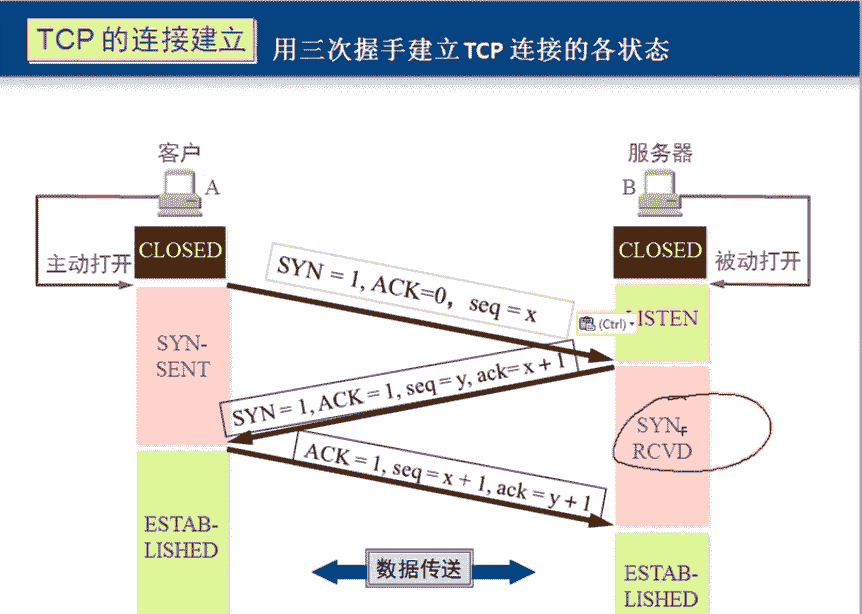
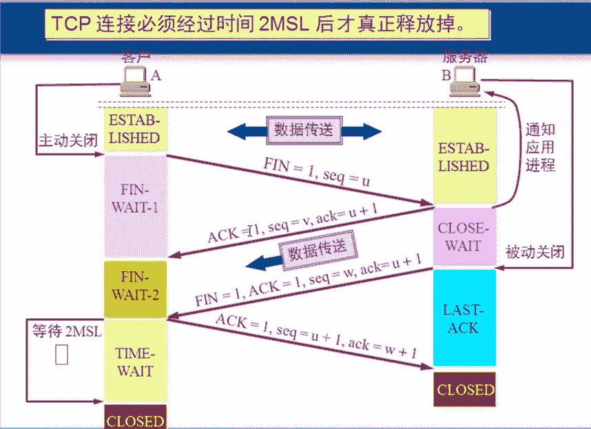
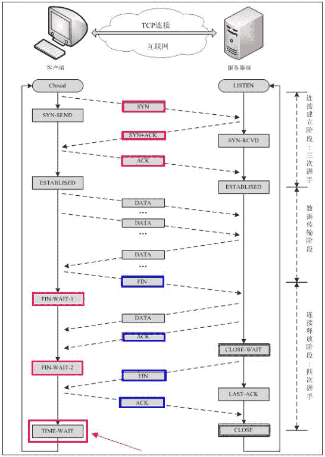
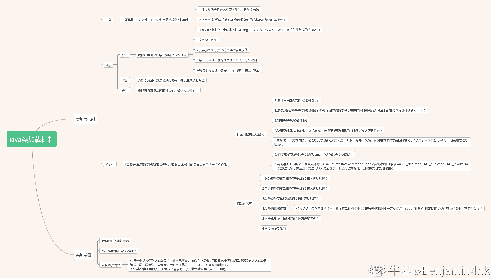

# 远景智能-2022 届秋季招聘软件技术笔试题

## 1

有关多线程，多进程的描述错误的是

正确答案: D   你的答案: 空 (错误)

```cpp
子进程获得父进程的数据空间，堆和栈的复制品
```

```cpp
线程可以与同进程的其他线程共享数据，但是它拥有自己的栈空间且拥有独立的执行序列
```

```cpp
线程执行开销小，但是不利于资源管理和保护
```

```cpp
进程适合在 SMP 机器上进行，而线程则可以跨机器迁移
```

本题知识点

操作系统 并发

讨论

[雷天琪](https://www.nowcoder.com/profile/112935)

SMP：Symmetrical Multi-Processing，对称性多核处理器，多进程可以在不同的核上运行，但是线程不可以跨机器迁移，因为线程是存在于单一的进程之中，只能在一个核上运行

发表于 2015-08-19 07:02:25

* * *

[huixieqingchun](https://www.nowcoder.com/profile/551201)

**多进程可以在不同的核上运行，但是线程不可以跨机器迁移，因为线程是存在于单一的进程之中，只能在一个核上运行**

发表于 2016-07-12 13:40:49

* * *

[Neilhy](https://www.nowcoder.com/profile/5024940)

选 D 。SMP 是 Symmetric Multi Processing 的简称，意为**对称多处理系统**，内有许多紧耦合多处理器，这种系统最大的特点就是**共享所有资源**。与之相对立的标准是 MPP（Massively Parallel Processing），意为**大规模并行处理系统**，这样的系统是由许多松耦合处理单元组成的，这里指的是处理单元而不是处理器。每个单元内的 CPU 都有自己私有的资源，如总线、内存、硬盘灯。在每个单元内都有操作系统和管理 数据库 的实例副本。这种结构最大的特点在于**不共享资源。****因而线程更适合在 SMP 机器上进行，而进程则可以跨机器迁移。**

编辑于 2017-03-23 21:23:14

* * *

## 2

有一个二维数组 A[10][5]，每个数据元素占 1 个字节，且 A[0][0]的存储地址是 1000，则 A[i][j]的地址是多少 ？

正确答案: C   你的答案: 空 (错误)

```cpp
1000+10i+j
```

```cpp
1000+i+j
```

```cpp
1000+5i+j
```

```cpp
1000+10i+5j
```

本题知识点

数组 C++ 阿里巴巴 C 语言

讨论

[garyyunfei](https://www.nowcoder.com/profile/583051)

C，因为是 5 列 10 行的数组，而且分配内存地址是连续的，如果按行存储的，则每增加 1 行地址就会增加 5，然后加上所在的列就是当前的地址，所以就是 1000+5i+j

编辑于 2021-08-19 17:01:07

* * *

[侯卿](https://www.nowcoder.com/profile/8037781)

这里的 A[11][5]并不是有些人理解的 12 行 6 列,这里是指初始化的时候传进去参数，所以的就是 11 行，5 列， 但是(☆_☆)注意了！注意了！ 求的 A[i][j]实际上是问的第 i+1 行 j+1 列那个数的地址，默认行储存，所以前面一共 5i+j 个元素。

发表于 2017-11-23 16:25:38

* * *

[空空以空空](https://www.nowcoder.com/profile/479441)

我当时怎么都没想就乱填😂😂本来很简单的题，被我想的复杂。因为是 10 行 5 列，那么到[0,5]的时候就是 1005,到了[1,1]就是 1006，算一下就知道

发表于 2017-03-28 23:41:44

* * *

## 3

下列对 MD5 的叙述不正确的是：

正确答案: C   你的答案: 空 (错误)

```cpp
是一种散列算法
```

```cpp
指纹(摘要)的长度为 128 位
```

```cpp
是一种对称加密算法
```

```cpp
可用来校验数据的完整性
```

本题知识点

加密和安全 阿里巴巴 Java 工程师 C++工程师 PHP 工程师 golang 工程师 前端工程师 安卓工程师 iOS 工程师 算法工程师 大数据开发工程师 运维工程师 安全工程师 数据库工程师 游戏研发工程师 测试开发工程师 测试工程师 2021 远景能源有限公司

讨论

[甫艾蒽廷](https://www.nowcoder.com/profile/7698448)

**MD5 是摘要算法不是加密算法，两者的本质区别是：摘要算法是单向的，即明文可以通过摘要算法生成摘要结果，但反之则不能通过摘要结果还原成明文。而加密算法是双向的，即可以从明文通过加密算法生成密文，反之也可以通过解密算法将密文还原成明文。**
**所以，摘要算法主要用来检查明文是否发生过变动，而加密算法则用来传递不能让第三方知晓的内容。**

发表于 2016-11-16 10:58:52

* * *

[zhisheng_blog](https://www.nowcoder.com/profile/616717)

MD5 算法不是加密算法，是 Message Digest Algorithm 报文摘要算法。

发表于 2016-08-17 08:48:53

* * *

[huixieqingchun](https://www.nowcoder.com/profile/551201)

**MD5 是数据摘要算法，不是加密算法。**

发表于 2016-07-13 14:10:02

* * *

## 4

避免死锁的一个著名的算法是（ ）

正确答案: B   你的答案: 空 (错误)

```cpp
先入先出法
```

```cpp
银行家算法
```

```cpp
优秀级算法
```

```cpp
资源按序分配法
```

None

## 5

下面关于并行和并发的区别，说法错误的是？

正确答案: C   你的答案: 空 (错误)

```cpp
并发计算是一种程序计算的形式，在系统中，至少有两个以上的计算在同时运作，计算结果可能同时发生
```

```cpp
并行计算指许多指令得以同时进行的计算模式。在同时进行的前提下，可以将计算的过程分解成小部份，之后以并发方式来加以解决
```

```cpp
并行是同时发生的多个并发事件，并发事件之间一定要同一时刻发生
```

```cpp
并发是逻辑上的同时发生（simultaneous），而并行是物理上的同时发生
```

本题知识点

并发 网易 Java 工程师 C++工程师 PHP 工程师 golang 工程师 前端工程师 安卓工程师 iOS 工程师 算法工程师 大数据开发工程师 运维工程师 安全工程师 数据库工程师 游戏研发工程师 测试开发工程师 测试工程师 2021 远景能源有限公司

讨论

[eagle](https://www.nowcoder.com/profile/603476)

C 不一定同时发生  查看全部)

编辑于 2015-02-03 14:42:38

* * *

[昱磊](https://www.nowcoder.com/profile/633465)

C 你吃饭吃到一半，电话来了，你一直到吃完了以后才去接，这就说明你不支持并发也不支持并行。你吃饭吃到一半，电话来了，你停了下来接了电话，接完后继续吃饭，这说明你支持并发。  你吃饭吃到一半，电话来了，你一边打电话一边吃饭，这说明你支持并行。  并发的关键是你有处理多个任务的能力，不一定要同时。  并行的关键是你有同时处理多个任务的能力。  所以我认为它们最关键的点就是：是否是『同时』。

编辑于 2016-08-31 15:14:25

* * *

[Tau_woo](https://www.nowcoder.com/profile/311328)

并行的概念往往适用于多 CPU 情况下。同一时刻，不用 CPU 之间的事件是并行的。

发表于 2015-09-06 17:03:43

* * *

## 6

下面对于 cookie 的描述中错误的是？

正确答案: A   你的答案: 空 (错误)

```cpp
Cookie 通过 HTTP Headers 从浏览器端发送到服务器端并存储在服务器端
```

```cpp
Cookie 的大小限制在 4kb 左右，对于复杂的存储需求来说是不够用的
```

```cpp
如果在一台计算机中安装多个浏览器，每个浏览器都会以独立的空间存放 cookie
```

```cpp
由于在 HTTP 请求中的 Cookie 是明文传递的，所以安全性成问题
```

本题知识点

安全工程师 滴滴 2017

讨论

[树上的朋友 rocketman](https://www.nowcoder.com/profile/830541)

选 A，描述反了，cookie 应该是由服务端发送到客户浏览器端并保存在浏览器端

发表于 2016-12-21 11:12:04

* * *

## 7

接口的作用是;

正确答案: B   你的答案: 空 (错误)

```cpp
减小堆大小
```

```cpp
契约式设计以封装实现
```

```cpp
实现抽象工厂模式
```

```cpp
使抽象类具化
```

None

## 8

若一进程有 10 个用户线程，则在系统调度执行时间上占用的时间片是()

正确答案: A   你的答案: 空 (错误)

```cpp
1
```

```cpp
0
```

```cpp
42014
```

```cpp
10
```

本题知识点

操作系统 Java 工程师 C++工程师 运维工程师 算法工程师 PHP 工程师

讨论

[钉子](https://www.nowcoder.com/profile/506749)

**由于用户线程不依赖于操作系统内核，因此，操作系统内核是不知道用户线程的存在的**，用户线程是由用户来管理和调度的，用户利用线程库提供的 API 来创建、同步、调度和管理线程。所以，**用户线程的调度在用户程序内部进行**，通常采用非抢先式和更简单的规则，也无须用户态和核心态切换，所以速度很快。**由于操作系统不知道用户线程的存在，所以，操作系统把 CPU 的时间片分配给用户进程，再由用户进程的管理器将时间分配给用户线程。**那么，用户进程能得到的时间片即为所有用户线程共享。因此，正确答案应为 A。

发表于 2016-06-23 21:31:39

* * *

[keglly](https://www.nowcoder.com/profile/413805)

系统调用时间片是进程的个数

发表于 2016-06-28 15:57:06

* * *

[小虎牙](https://www.nowcoder.com/profile/512935)

正确答案：A
解析：本题主要考查关于进程和线程之间资源共享的知识点。在引入线程的操作系统中，线程是进程中的一个实体，是系统独立调度和分派的基本单位。但是线程自己基本上不拥有系统资源，所以它不是资源分配的基本单位，它只拥有一部分在运行中必不可少的与处理机相关的资源，如线程状态、寄存器上下文和栈等，它同样有就绪、阻塞和执行三种基本状态。它可与同属一个进程的其他线程共享进程所拥有的全部资源。一个线程可以创建和撤销另一个线程；同一个进程中的多个线程之间可以并发执行。由于用户线程不依赖于操作系统内核，因此，操作系统内核是不知道用户线程的存在的，用户线程是由用户来管理和调度的，用户利用线程库提供的 API 来创建、同步、调度和管理线程。所以，用户线程的调度在用户程序内部进行，通常采用非抢先式和更简单的规则，也无须用户态和核心态切换，所以速度很快。由于操作系统不知道用户线程的存在，所以，操作系统把 CPU 的时间片分配给用户进程，再由用户进程的管理器将时间分配给用户线程。那么，用户进程能得到的时间片即为所有用户线程共享。因此，正确答案应为 A。

发表于 2015-10-15 08:16:15

* * *

## 9

多个线程可同时操作一个数据，为了保证该数据的准确性，可将操作该数据的部分改为:

正确答案: D   你的答案: 空 (错误)

```cpp
只写
```

```cpp
只读
```

```cpp
异步
```

```cpp
同步
```

本题知识点

并发 C++工程师 Java 工程师 美团 2016

讨论

[offer 过来自己动](https://www.nowcoder.com/profile/372304342)

链接：[`www.nowcoder.com/questionTerminal/0061be88463e4949863f68ba38175ae9?toCommentId=7323`](https://www.nowcoder.com/questionTerminal/0061be88463e4949863f68ba38175ae9?toCommentId=7323)
来源：牛客网

1\. 并发：在 [操作系统](http://baike.baidu.com/view/880.htm) 中，是指一个时间段中有几个程序都处于已启动运行到运行完毕之间，且这几个程序都是在同一个 [处理机](http://baike.baidu.com/view/2107226.htm) 上运行。其中两种并发关系分别是同步和互斥
2\. 互斥：进程间相互排斥的使用临界资源的现象，就叫互斥。
3\. 同步： 进程之间的关系不是相互排斥临界资源的关系，而是相互依赖的关系。进一步的说明：就是前一个进程的输出作为后一个进程的输入，当第一个进程没有输出时第二个进程必须等待。具有同步关系的一组并发进程相互发送的信息称为消息或事件。
其中并发又有伪并发和真并发，伪并发是指单核处理器的并发，真并发是指多核处理器的并发。
4\. 并行：在单处理器中多道程序设计系统中，进程被交替执行，表现出一种并发的外部特种；在多处理器系统中，进程不仅可以交替执行，而且可以重叠执行。在多处理器上的程序才可实现并行处理。从而可知，并行是针对多处理器而言的。并行是同时发生的多个并发事件，具有并发的含义，但并发不一定并行，也亦是说并发事件之间不一定要同一时刻发生。

5\. 多线程：多线程是程序设计的逻辑层概念，它是进程中并发运行的一段代码。多线程可以实现线程间的切换执行。

6\. 异步：异步和同步是相对的，同步就是顺序执行，执行完一个再执行下一个，需要等待、协调运行。异步就是彼此独立,在等待某事件的过程中继续做自己的事，不需要等待这一事件完成后再工作。线程就是实现异步的一个方式。异步是让调用方法的主线程不需要同步等待另一线程的完成，从而可以让主线程干其它的事情。
   异步和多线程并不是一个同等关系,异步是最终目的,多线程只是我们实现异步的一种手段。异步是当一个调用请求发送给被调用者,而调用者不用等待其结果的返回而可以做其它的事情。实现异步可以采用多线程技术或则交给另外的进程来处理。

发表于 2020-09-30 23:07:37

* * *

[ajavastudent](https://www.nowcoder.com/profile/936566)

答案：D 对该数据加锁，放在同步代码块中 synchronize(){}

发表于 2016-01-08 10:08:09

* * *

[Better29](https://www.nowcoder.com/profile/4195045)

只读也保证了数据的准确性和一致性呢 感觉应该选 B D

发表于 2017-05-30 17:50:55

* * *

## 10

给定 n 个节点的平衡二叉搜索树，每个节点的值是整数。给定一个整数，在树中找出与该整数最接近的节点的最小算法复杂度是（）

正确答案: A   你的答案: 空 (错误)

```cpp
Θ(logn)
```

```cpp
Θ(n²)
```

```cpp
Θ(nlogn)
```

```cpp
Θ(n)
```

```cpp
Θ(1)
```

```cpp
Θ(n!)
```

None

## 11

在 Java 中，HashMap 中是用哪些方法来解决哈希冲突的？

正确答案: C   你的答案: 空 (错误)

```cpp
开放地址法
```

```cpp
二次哈希法
```

```cpp
链地址法
```

```cpp
建立一个公共溢出区
```

本题知识点

Java

讨论

[范二 er](https://www.nowcoder.com/profile/8797374)

以上方法都是解决哈希填冲突的策略，但是在 java.util.HashMap 中，总体来说是使用的**链地址法**来解决冲突的。当然了，使用链地址***导致 get 的效率从 o（1）降至 o（n），所以在 Java8 中，使用的是平衡树来解决提高效率的。参考：http://blog.csdn.net/cpcpcp123/article/details/52744331

发表于 2017-02-21 09:38:27

* * *

[紫旋](https://www.nowcoder.com/profile/795206)

解决哈希冲突常用的两种方法是：**开放定址法和链地址法**
  开放定址法：当冲突发生时，使用某种探查(亦称探测)技术在散列表中形成一个探查(测)序列。沿此序列逐个单元地查找，直到找到给定 的关键字，或者碰到一个开放的地址(即该地址单元为空)为止（若要插入，在探查到开放的地址，则可将待插入的新结点存人该地址单元）。查找时探查到开放的 地址则表明表中无待查的关键字，即查找失败。 
  链地址法：将所有关键字为同义词的结点链接在同一个单链表中。若选定的散列表长度为 m，则可将散列表定义为一个由 m 个头指针组成的指针数 组 T[0..m-1]。凡是散列地址为 i 的结点，均插入到以 T[i]为头指针的单链表中。T 中各分量的初值均应为空指针。

编辑于 2017-03-22 18:04:53

* * *

[kkk_123](https://www.nowcoder.com/profile/872256)

常见的哈希冲突解决方法：1.开放地址法 2.链地址法（拉链法）3.再散列 4.建立一个公共溢出区难道不应该是这四个吗？？

发表于 2017-02-01 11:50:20

* * *

## 12

在一个含有 group by 的查询 sql 中，同时存在 having 和 where，sql 在解析执行的时候，先执行的是哪一个？

正确答案: B   你的答案: 空 (错误)

```cpp
having
```

```cpp
where
```

本题知识点

数据库

讨论

[冰封无痕](https://www.nowcoder.com/profile/266593)

执行顺序：from,where,group by,having,select,order by

发表于 2016-12-30 14:49:25

* * *

[Moonshine](https://www.nowcoder.com/profile/5958855)

选 B。执行顺序：FROM>ON>JOIN>WHERE>GROUP BY>WITH CUBE or WITH ROLLUP>HAVING>SELECT>DISTINCT>ORDER BY>TOP

发表于 2017-02-23 15:03:19

* * *

[青山崖野](https://www.nowcoder.com/profile/7614806)

where 过滤 from 所指定的数据源，但对于 group by 所产生的分组无效；having 过滤分组，它依附于 group by 存在。

发表于 2017-05-03 15:05:58

* * *

## 13

下列程序的输出是（）

```cpp
#define add(a，b) a+b
int main()
{
    printf("%d\n",5*add(3，4));
    return 0;
}
```

正确答案: D   你的答案: 空 (错误)

```cpp
23
```

```cpp
35
```

```cpp
16
```

```cpp
19
```

本题知识点

C 语言

讨论

[小小马大](https://www.nowcoder.com/profile/231352144)

宏函数的**二义性**

```cpp
5*add(3，4) = 5*3+4 = 19
```

发表于 2020-11-20 10:35:59

* * *

[阳光下的风影](https://www.nowcoder.com/profile/151085247)

宏替换 输出结果为 5*3 + 4 = 19 ，所以说宏定义小括号很重要

发表于 2019-03-20 14:09:30

* * *

[韭菜 king](https://www.nowcoder.com/profile/107472468)

宏只是机械替换

发表于 2021-02-22 19:47:14

* * *

## 14

已知 10 个元素 (54,28,16,34,,73,62,95,60,26,43) ，按照依次插入的方法生成一棵二叉排序树，查找值为 62 的结点所需比较次数为（）

正确答案: B   你的答案: 空 (错误)

```cpp
4
```

```cpp
3
```

```cpp
2
```

```cpp
5
```

本题知识点

树 查找 *讨论

[丨太阳与月亮丨](https://www.nowcoder.com/profile/9415270)

B 依次插入将带插入值直  查看全部)

编辑于 2017-03-18 09:00:12

* * *

[美团到店招聘](https://www.nowcoder.com/profile/3472441)

构造完的二叉搜索树是：                                            54
                                28                    73
                            16    34            62    95
                                26    43    60
所以需要比较的数是：54,73,62，共需要 3 次

发表于 2017-02-17 10:12:32

* * *

[will well](https://www.nowcoder.com/profile/3728418)

我怎么觉得是 2

发表于 2016-12-08 19:40:10

* * *

## 15

关于计算机网络，下列描述当中，正确的是（）

正确答案: C   你的答案: 空 (错误)

```cpp
在同一信道上同一时刻，可进行双向数据传送的通信方式是半双工
```

```cpp
TCP 协议是无连接的；UDP 协议是面向连接的
```

```cpp
假设一个主机的 ip 地址为 192.168.8.123，而子网掩码为 255.255.255.248，那么该主机的网络号是 192.168.8.120
```

```cpp
计算机网络中的 OSI 结构分别是：物理层，数据链路层，传输层，会话层，表示层，应用层
```

本题知识点

网络基础 前端工程师 4399 游戏 2017

讨论

[黛玛葛](https://www.nowcoder.com/profile/2964502)

A：同一信道同一时刻通信的是全双工，半双工是是指在通信过程的任意时刻，信息既可由 A 传到 B，又能由 B 传 A，但只能 由一个方向上的传输存在。B：TCP 协议是有连接的，UDP 是无连接的。C：IP 和子网掩码相与得到网络号，应该是 192.168.8.120.D：OSI 七层协议，少了网络层

编辑于 2017-04-08 14:18:30

* * *

[花开花落情](https://www.nowcoder.com/profile/5485093)

子网掩码转换成二进制最后 8 位为 11111000，所以网络位为 29，主机位为 3，把主机 ip123 转换为二进制为 01111011，因为后 3 位为主机位所以为 01111000 转为十进制为 120

发表于 2017-10-22 16:03:01

* * *

[梦境迷离](https://www.nowcoder.com/profile/759736)

主机&子网掩码= 网络号

发表于 2018-03-04 20:47:56

* * *

## 16

0.6332 的数据类型是（）

正确答案: B   你的答案: 空 (错误)

```cpp
float
```

```cpp
double
```

```cpp
Float
```

```cpp
Double
```

本题知识点

Java 工程师 C++工程师 蘑菇街 系统工程师 2018

## 17

http 协议中，状态码 500 的意思为（）

正确答案: D   你的答案: 空 (错误)

```cpp
重定向
```

```cpp
访问被拒绝
```

```cpp
未找到请求的内容
```

```cpp
服务器内部有错误
```

None

## 18

关于下列程序段的输出结果，说法正确的是：（ ） 

```cpp
public class MyClass{
    static int i;
    public static void main(String argv[]){
        System.out.println(i);
    }
}
```

正确答案: D   你的答案: 空 (错误)

```cpp
有错误，变量 i 没有初始化。
```

```cpp
null
```

```cpp
1
```

```cpp
0
```

本题知识点

Java

讨论

[心静、世界就静](https://www.nowcoder.com/profile/818881)

类变量在不设置初始值时，会进行默认值赋值，而局部方法中声明的变量则必须进行初始化，他不会进行默认值赋值。

发表于 2017-02-02 16:23:45

* * *

[普罗米修斯 YL](https://www.nowcoder.com/profile/2233164)

成员变量和局部变量的区别 1、成员变量是独立于方法外的变量，[局部变量](https://www.baidu.com/s?wd=%E5%B1%80%E9%83%A8%E5%8F%98%E9%87%8F&tn=44039180_cpr&fenlei=mv6quAkxTZn0IZRqIHckPjm4nH00T1Y3mWD4rH0YuWTkmW0znAc40ZwV5Hcvrjm3rH6sPfKWUMw85HfYnjn4nH6sgvPsT6KdThsqpZwYTjCEQLGCpyw9Uz4Bmy-bIi4WUvYETgN-TLwGUv3EnHTsPWfLPjc3n1T4njRdnjmvn0)是类的方法中的变量 1）、成员变量：包括[实例变量](https://www.baidu.com/s?wd=%E5%AE%9E%E4%BE%8B%E5%8F%98%E9%87%8F&tn=44039180_cpr&fenlei=mv6quAkxTZn0IZRqIHckPjm4nH00T1Y3mWD4rH0YuWTkmW0znAc40ZwV5Hcvrjm3rH6sPfKWUMw85HfYnjn4nH6sgvPsT6KdThsqpZwYTjCEQLGCpyw9Uz4Bmy-bIi4WUvYETgN-TLwGUv3EnHTsPWfLPjc3n1T4njRdnjmvn0)和[类变量](https://www.baidu.com/s?wd=%E7%B1%BB%E5%8F%98%E9%87%8F&tn=44039180_cpr&fenlei=mv6quAkxTZn0IZRqIHckPjm4nH00T1Y3mWD4rH0YuWTkmW0znAc40ZwV5Hcvrjm3rH6sPfKWUMw85HfYnjn4nH6sgvPsT6KdThsqpZwYTjCEQLGCpyw9Uz4Bmy-bIi4WUvYETgN-TLwGUv3EnHTsPWfLPjc3n1T4njRdnjmvn0)，用 static 修饰的是[类变量](https://www.baidu.com/s?wd=%E7%B1%BB%E5%8F%98%E9%87%8F&tn=44039180_cpr&fenlei=mv6quAkxTZn0IZRqIHckPjm4nH00T1Y3mWD4rH0YuWTkmW0znAc40ZwV5Hcvrjm3rH6sPfKWUMw85HfYnjn4nH6sgvPsT6KdThsqpZwYTjCEQLGCpyw9Uz4Bmy-bIi4WUvYETgN-TLwGUv3EnHTsPWfLPjc3n1T4njRdnjmvn0)，不用 static 修饰的是[实例变量](https://www.baidu.com/s?wd=%E5%AE%9E%E4%BE%8B%E5%8F%98%E9%87%8F&tn=44039180_cpr&fenlei=mv6quAkxTZn0IZRqIHckPjm4nH00T1Y3mWD4rH0YuWTkmW0znAc40ZwV5Hcvrjm3rH6sPfKWUMw85HfYnjn4nH6sgvPsT6KdThsqpZwYTjCEQLGCpyw9Uz4Bmy-bIi4WUvYETgN-TLwGUv3EnHTsPWfLPjc3n1T4njRdnjmvn0)，所有类的成员变量可以通过 this 来引用。
2）、局部变量：包括形参，方法局部变量，代码块局部变量，存在于方法的参数列表和方法定义中以及代码块中。
2、成员变量可以被 public，protect，private，static 等修饰符修饰，而局部变量不能被控制修饰符及 static 修饰；两者都可以定义成 final 型。
3、成员变量存储在堆，局部变量存储在栈。局部变量的作用域仅限于定义它的方法，在该方法的外部无法访问它。成员变量的作用域在整个类内部都是可见的，所有成员方法都可以使用它。如果[访问权限](https://www.baidu.com/s?wd=%E8%AE%BF%E9%97%AE%E6%9D%83%E9%99%90&tn=44039180_cpr&fenlei=mv6quAkxTZn0IZRqIHckPjm4nH00T1Y3mWD4rH0YuWTkmW0znAc40ZwV5Hcvrjm3rH6sPfKWUMw85HfYnjn4nH6sgvPsT6KdThsqpZwYTjCEQLGCpyw9Uz4Bmy-bIi4WUvYETgN-TLwGUv3EnHTsPWfLPjc3n1T4njRdnjmvn0)允许，还可以在类的外部使用成员变量。
4、局部变量的生存周期与方法的执行期相同。当方法执行到定义局部变量的语句时，局部变量被创建；执行到它所在的作用域的最后一条语句时，局部变量被销毁。类的成员变量，如果是实例成员变量，它和对象的生存期相同。而[静态成员变量](https://www.baidu.com/s?wd=%E9%9D%99%E6%80%81%E6%88%90%E5%91%98%E5%8F%98%E9%87%8F&tn=44039180_cpr&fenlei=mv6quAkxTZn0IZRqIHckPjm4nH00T1Y3mWD4rH0YuWTkmW0znAc40ZwV5Hcvrjm3rH6sPfKWUMw85HfYnjn4nH6sgvPsT6KdThsqpZwYTjCEQLGCpyw9Uz4Bmy-bIi4WUvYETgN-TLwGUv3EnHTsPWfLPjc3n1T4njRdnjmvn0)的生存期是整个程序运行期。
5、成员变量在累加载或实例被创建时，系统自动[分配内存](https://www.baidu.com/s?wd=%E5%88%86%E9%85%8D%E5%86%85%E5%AD%98&tn=44039180_cpr&fenlei=mv6quAkxTZn0IZRqIHckPjm4nH00T1Y3mWD4rH0YuWTkmW0znAc40ZwV5Hcvrjm3rH6sPfKWUMw85HfYnjn4nH6sgvPsT6KdThsqpZwYTjCEQLGCpyw9Uz4Bmy-bIi4WUvYETgN-TLwGUv3EnHTsPWfLPjc3n1T4njRdnjmvn0)空间，并在分配空间后自动为成员变量指定初始化值，初始化值为默认值，基本类型的默认值为 0，复合类型的默认值为 null。（被 final 修饰且没有 static 的必须显式赋值），局部变量在定义后必须经过显式初始化后才能使用，系统不会为局部变量执行初始化。
6、局部变量可以和成员变量 同名，且在使用时，局部变量具有更高的优先级，直接使用同名访问，访问的是局部变量，如需要访问成员变量可以用 this.变量名访问本例中 i 为成员变量，有默认的初始值，如果定义在方法内部，就没有初始值

编辑于 2017-11-27 17:56:35

* * *

[zhaoyun](https://www.nowcoder.com/profile/626681)

静态变量会默认赋初值，局部变量和 final 声明的变量必须手动赋初值

发表于 2017-03-09 21:52:26

* * *

## 19

将实体-联系模型转换为关系模型时，实体之间多对多联系在关系模型中的实现方式是（  ）

正确答案: A   你的答案: 空 (错误)

```cpp
建立新的关系
```

```cpp
建立新的属性
```

```cpp
增加新的关键字
```

```cpp
建立新的实体
```

本题知识点

数据库

讨论

[文嘉](https://www.nowcoder.com/profile/464125923)

可以反推，1 对 1 和 1 对 n 转化关系模式都只有两个，而 m 对 n 是 3 个，所以和关系有关。

发表于 2018-12-24 18:39:20

* * *

[牛 100](https://www.nowcoder.com/profile/5918115)

将实体-联系模型转换为关系模型时，一个 m:n 的联系可以转换为一个独立的关系模式，与该联系相连的各实体的码及联系本身的属性均转换为关系的属性，而关系的码为各实体码的组合。故本题答案为 A 选项。

发表于 2017-02-13 00:54:13

* * *

## 20

下列各排序法中，最坏情况下的时间复杂度最低的是（ ）

正确答案: C   你的答案: 空 (错误)

```cpp
希尔排序
```

```cpp
快速排序
```

```cpp
堆排序
```

```cpp
冒泡排序
```

本题知识点

复杂度 2021 远景能源有限公司

讨论

[牛 100](https://www.nowcoder.com/profile/5918115)

堆排序最坏情况时间下的时间复杂度为 O(nlog2n) ；希尔排序最坏情况时间下的时间复杂度为 O(n1.5) ；快速排序、冒泡排序最坏情况时间下的时间复杂度为 O(n2) 。故本题答案为 C 选项。

发表于 2017-02-13 10:27:52

* * *

[今天和明天](https://www.nowcoder.com/profile/187083494)

堆排序最坏的时间复杂度为 O(nlog2n)希尔排序最坏的时间复杂度为 O(n1.5)快排和冒泡最坏的时间复杂度为 O(n2)

发表于 2021-03-14 17:24:38

* * *

[牛客 580050057 号](https://www.nowcoder.com/profile/580050057)

堆排序最坏情况时间下的时间复杂度位 O(nlog2n)希尔排序最坏情况下的时间复杂度 O(n1.5)快速排序，冒泡排序最坏情况时间下的时间复杂度为 O(n2)

发表于 2021-03-13 10:39:50

* * *

## 21

TCP 的握手与分手，可能出现的情形有（）。

正确答案: A B C D   你的答案: 空 (错误)

```cpp
握手需要 3 次通信
```

```cpp
分手需要进行 4 次通信
```

```cpp
FIN 和 ACK 在同一包里
```

```cpp
ACK 和 SYN 在同一包里
```

本题知识点

网络基础 腾讯

讨论

[dh_chen](https://www.nowcoder.com/profile/973723)

ABCD， C 正确，理论上在接受到 fin 后，接收方恰好也要关闭连接，则可以在一个包内发送 fin 和 ack（这从 tcp 包头格式可以看出是正确的，fin 和 ack 不是在同一个 bit 位上的，所以为什么不能同时发），其次在 tcp 状态转移图中也可以看到从 fin_wait1 直接到 time_wait 的情况，这种情况就就同时接受到 fin 和 ack 的结果

发表于 2016-03-27 11:34:07

* * *

[江山如画君](https://www.nowcoder.com/profile/408769)

  

编辑于 2016-05-12 21:08:05

* * *

[牛客 444334 号](https://www.nowcoder.com/profile/444334)

ABD

建立 TCP 需要三次握手才能建立，而断开连接则需要四次握手。整个过程如下图所示：


编辑于 2015-08-20 09:33:02

* * *

## 22

下面网络知识的阐述中，存在错误的是？

正确答案: A C   你的答案: 空 (错误)

```cpp
ARP 协议根据 MAC 地址查询其对应的 IP 地址，便于 IP 通信。
```

```cpp
TCP 协议是面向连接的，UDP 协议时面向无连接的。
```

```cpp
127.0.0.1 属于私有地址。
```

```cpp
IPV6 协议是下一代 IP 协议。
```

本题知识点

网络基础 华为

讨论

[单程车票](https://www.nowcoder.com/profile/384290)

ACA:arp 是根据 IP 寻找 MAC 地址的协议 C:127.0.0.1 是环回地址,而不是私有地址

发表于 2015-01-23 00:37:55

* * *

[Moriarty](https://www.nowcoder.com/profile/430713)

私有地址有：
A 类：10.0.0.0 到 10.255.255.255
B 类：172.16.0.0 到 172.31.255.255
C 类：192.168.0.0 到 192.168.255.255

发表于 2015-08-05 17:17:56

* * *

[牛涛涛 12121](https://www.nowcoder.com/profile/1967629)

环回地址是主机用于向自身发送通信的一个特殊地址。环回地址为同一台设备上运行的 TCP/IP 应用程序和服务之间相互通 信提供了一条捷径。同一台主机上的两项服务若使用环回地址而非分配的主机地址，就可以绕开 TCP/IP 协议栈的下层。通过 ping 环回地址，还可以测试本地主机上的 TCP/IP 配置。

IPv4 的环回地址是保留地址之一 127.0.0.1。尽管只使用 127.0.0.1 这一个地址，但地址 127.0.0.0 到 127.255.255.255 均予以保留。此地址块中的任何地址都将环回到本地主机中。此地址块中的任何地址都绝不会出现在任何网络中。

发表于 2016-07-27 10:26:48

* * *

## 23

堆栈溢出一般是由什么原因导致的？

正确答案: B C   你的答案: 空 (错误)

```cpp
函数代码长度过长
```

```cpp
循环的递归调用
```

```cpp
大数据结构的局部变量
```

```cpp
代码运行时错误
```

本题知识点

C++

讨论

[水星哥](https://www.nowcoder.com/profile/826477)

1 代码存储在程序区，与栈没有关系。2 递归涉及到压栈入栈。3 局部变量存在栈区。4 栈的大小是固定的。

发表于 2015-09-22 20:20:57

* * *

[青空](https://www.nowcoder.com/profile/399993)

1.代码是存在程序区，压根不会与栈区相关 2.函数递归调用会压栈入栈 3.局部变量存在栈区

发表于 2015-08-31 22:10:41

* * *

[zhuomuniao](https://www.nowcoder.com/profile/327643)

```cpp
1、内存泄露，比如某一数组原先已定义好大小，但是在后续操作中存放的个数超出这一既定长度，会导致堆栈溢出 
2、由于程序员动态申请的内存块使用后未立即释放，导致内存区不够用，也会导致堆栈溢出 
3、程序陷入死循环，往内存写数据，不断地消耗内存空间 
4、程序本身运行起来就要消耗一定大小的内存，但是系统提供的实际内存不够，比如 JVM 虚拟内存不够让程序使用
```

发表于 2015-08-27 22:23:27

* * *

## 24

如何在命令行查看一台 linux 机器的 CPU、SWAP 分区信息、硬盘信息?

正确答案: A C D   你的答案: 空 (错误)

```cpp
cat /proc/cpuinfo
```

```cpp
du
```

```cpp
cat /proc/swaps
```

```cpp
df -lh
```

本题知识点

Linux

讨论

[へ°飄渺尐孩](https://www.nowcoder.com/profile/884269)

```cpp
cat /proc/cpuinfo：查看一台 linux 机器的 CPU 信息 du：查看该目录占用文件系统数据块的情况 
```

```cpp
cat /proc/swaps：查看 SWAP 分区信息
```

```cpp
df -lh：查看硬盘信息
```

编辑于 2015-09-13 17:30:03

* * *

[后劲好大](https://www.nowcoder.com/profile/4013442)

du 是查看文件或者目录占用的磁盘空间的大小

发表于 2017-06-08 21:11:56

* * *

[柯罗诺斯](https://www.nowcoder.com/profile/4291398)

du:查看档案或者目录的磁盘使用空间 df：显示文件系统的信息和使用情况 dd：磁盘镜像拷贝命令

发表于 2019-03-29 00:22:25

* * *

## 25

String str = new String(“abc”)，“abc”在内存中是怎么分配的？

正确答案: A C   你的答案: 空 (错误)

```cpp
堆
```

```cpp
栈
```

```cpp
字符串常量区
```

```cpp
寄存器
```

本题知识点

字符串 *操作系统 Java 人人网* *讨论

[androidyue](https://www.nowcoder.com/profile/972980)

又是研究过的文章，题目考查的  查看全部)

编辑于 2015-01-26 19:54:30

* * *

[小杨 vita](https://www.nowcoder.com/profile/576504)

“abc”保存在常量池，str 引用的对象保存在堆里，而 java7 中又把常量池移到了堆中，所以这题题目就不够严谨

编辑于 2015-09-06 17:39:15

* * *

[EVER 刀](https://www.nowcoder.com/profile/947550)

应该是 AC,即是堆和字符串常量池中，当你 new String("abc")时，其实会先在字符串常量区生成一个 abc 的对象，然后 new String()时会在堆中分配空间，然后此时会把字符串常量区中 abc 复制一个给堆中的 String，故 abc 应该在堆中和字符串常量区

发表于 2015-01-05 14:33:49

* * *

## 26

下面哪些机制可以用于进程间通信？

正确答案: A B E   你的答案: 空 (错误)

```cpp
Socket
```

```cpp
Named pipe
```

```cpp
Named event
```

```cpp
Critical Section
```

```cpp
Shared memory
```

```cpp
Virtual memory
```

本题知识点

操作系统 Java 工程师 C++工程师 运维工程师 算法工程师 美团 2016

讨论

[拉风小伙](https://www.nowcoder.com/profile/407743)

Linux 进程间通信：管道、  查看全部)

编辑于 2016-03-26 12:54:48

* * *

[炫](https://www.nowcoder.com/profile/376795)

# 管道( pipe )：管道是一种半双工的通信方式，数据只能单向流动，而且只能在具有亲缘关系的进程间使用。进程的亲缘关系通常是指父子进程关系。
# 有名管道 (named pipe) ： 有名管道也是半双工的通信方式，但是它允许无亲缘关系进程间的通信。
# 信号量( semophore ) ： 信号量是一个计数器，可以用来控制多个进程对共享资源的访问。它常作为一种锁机制，防止某进程正在访问共享资源时，其他进程也访问该资源。因此，主要作为进程间以及同一进程内不同线程之间的同步手段。
# 消息队列( message queue ) ： 消息队列是由消息的链表，存放在内核中并由消息队列标识符标识。消息队列克服了信号传递信息少、管道只能承载无格式字节流以及缓冲区大小受限等缺点。
# 信号 ( signal ) ： 信号是一种比较复杂的通信方式，用于通知接收进程某个事件已经发生。
# 共享内存( shared memory ) ：共享内存就是映射一段能被其他进程所访问的内存，这段共享内存由一个进程创建，但多个进程都可以访问。共享内存是最快的 IPC 方式，它是针对其他进程间通信方式运行效率低而专门设计的。它往往与其他通信机制，如信号两，配合使用，来实现进程间的同步和通信。
# 套接字( socket ) ： 套解口也是一种进程间通信机制，与其他通信机制不同的是，它可用于不同及其间的进程通信。

发表于 2015-12-22 13:13:30

* * *

[美团校招内推直达](https://www.nowcoder.com/profile/458054)

**答案 ABE：****进程间通信：**     **1.管道（pipe）及有名管道（named pipe）**   2.信号（signal）    3.消息队列（message queue）     **4.共享内存（shared memory）**  5.信号量（semaphore） **6.套接字（socket）****参考：** [`cqgw2.blog.163.com/blog/static/2352470201032210542930/`](http://cqgw2.blog.163.com/blog/static/2352470201032210542930/)

发表于 2015-10-11 19:55:47

* * *

## 27

以下选项中哪些是 SQL 的 DML 语句？

正确答案: B D   你的答案: 空 (错误)

```cpp
drop
```

```cpp
insert
```

```cpp
alter
```

```cpp
delete
```

```cpp
create
```

None

## 28

下面有关 java 类加载器,说法正确的是?()

正确答案: B C D   你的答案: 空 (错误)

```cpp
引导类加载器(bootstrap class loader):它用来加载 Java 的核心库,是用原生代码来实现的
```

```cpp
扩展类加载器(extensions class loader):它用来加载 Java 的扩展库。
```

```cpp
系统类加载器(system class loader):它根据 Java 应用的类路径(CLASSPATH)来加载 Java 类
```

```cpp
tomcat 为每个 App 创建一个 Loader,里面保存着此 WebApp 的 ClassLoader。需要加载 WebApp 下的类时,就取出 ClassLoader 来使用
```

本题知识点

Java

讨论

[牛客 318796 号](https://www.nowcoder.com/profile/318796)

类的加载是由类加载器完成的，类加载器包括：根加载器（ BootStrap ）、扩展加载器（ Extension ）、系统加载器（ System ）和用户自定义类加载器（ java.lang.ClassLoader 的子类）。从 Java 2 （ JDK 1.2 ）开始，类加载过程采取了父亲委托机制（ PDM ）。 PDM 更好的保证了 Java 平台的安全性，在该机制中， JVM 自带的 Bootstrap 是根加载器，其他的加载器都有且仅有一个父类加载器。类的加载首先请求父类加载器加载，父类加载器无能为力时才由其子类加载器自行加载。 JVM 不会向 Java 程序提供对 Bootstrap 的引用。下面是关于几个类加载器的说明：

*   Bootstrap ：一般用本地代码实现，负责加载 JVM 基础核心类库（ rt.jar ）；
*   Extension ：从 java.ext.dirs 系统属性所指定的目录中加载类库，它的父加载器是 Bootstrap ；
*   system class loader ：又叫应用类加载器，其父类是 Extension 。它是应用最广泛的类加载器。它从环境变量 classpath 或者系统属性 java.class.path 所指定的目录中记载类，是用户自定义加载器的默认父加载器。
*   用户自定义类加载器： java.lang.ClassLoader 的子类

    父类委托机制是可以修改的，有些服务器就是自定义类加载器优先的。

编辑于 2016-03-26 10:34:20

* * *

[cairo](https://www.nowcoder.com/profile/768973)

```cpp
 1）Bootstrap ClassLoader

	负责加载$JAVA_HOME 中 jre/lib/rt.jar 里所有的 class，由 C++实现，不是 ClassLoader 子类

	2）Extension ClassLoader

	负责加载 java 平台中扩展功能的一些 jar 包，包括$JAVA_HOME 中 jre/lib/*.jar 或-Djava.ext.dirs 指定目录下的 jar 包

	3）App ClassLoader

	负责记载 classpath 中指定的 jar 包及目录中 class

	4）Custom ClassLoader

	属于应用程序根据自身需要自定义的 ClassLoader，如 tomcat、jboss 都会根据 j2ee 规范自行实现 ClassLoader

	加载过程中会先检查类是否被已加载，检查顺序是自底向上，从 Custom ClassLoader 到 BootStrap ClassLoader 逐层检查，只要某个 classloader 已加载就视为已加载此类，保证此类只所有 ClassLoader 加载一次。而加载的顺序是自顶向下，也就是由上层来逐层尝试加载此类。 
```

发表于 2015-11-13 11:33:05

* * *

[程序猿 Go 师傅](https://www.nowcoder.com/profile/242025553)



编辑于 2019-10-21 16:52:09

* * *

## 29

如下四个选项中，哪些是数据库模糊查询的通配符?

正确答案: C D   你的答案: 空 (错误)

```cpp
?
```

```cpp
*
```

```cpp
%
```

```cpp
_
```

本题知识点

数据库

讨论

[彤彤是个大美女](https://www.nowcoder.com/profile/6553109)

1 、 LIKE'Mc%' 将搜索以字母 Mc 开头的所有字符串（如 McBadden ）。 2 、 LIKE'%inger' 将搜索以字母 inger 结尾的所有字符串（如 Ringer 、 Stringer ）。 3 、 LIKE'%en%' 将搜索在任何位置包含字母 en 的所有字符串（如 Bennet 、 Green 、 McBadden ）。 4 、 LIKE'_heryl' 将搜索以字母 heryl 结尾的所有六个字母的名称（如 Cheryl 、 Sheryl ）。 5 、 LIKE'[CK]ars[eo]n' 将搜索下列字符串： Carsen 、 Karsen 、 Carson 和 Karson （如 Carson ）。 6 、 LIKE'[M-Z]inger' 将搜索以字符串 inger 结尾、以从 M 到 Z 的任何单个字母开头的所有名称（如 Ringer ）。 7 、 LIKE'M[^c]%' 将搜索以字母 M 开头，并且第二个字母不是 c 的所有名称（如 MacFeather ）。  

发表于 2017-06-12 14:07:17

* * *

[牛客 lucky](https://www.nowcoder.com/profile/570832)

纠正楼上：  _   表示一个字符

发表于 2017-03-23 20:22:07

* * *

[蓝波 aiku](https://www.nowcoder.com/profile/6463706)

%代表任意长度（长度可以为 0）的字符串 _（下横线）代表任意单个字符

发表于 2018-01-30 09:52:18

* * *

## 30

以下 json 格式数据，错误的是

正确答案: A C   你的答案: 空 (错误)

```cpp
{company：4399}
```

```cpp
{"company":{"name":[4399,4399,4399]}}
```

```cpp
{[4399,4399,4399]}
```

```cpp
{"company":[4399,4399,4399]}
```

```cpp
{"company":{"name":4399}}
```

本题知识点

Java 前端工程师 4399 游戏 2017

讨论

[cyanlong](https://www.nowcoder.com/profile/8977519)

A:错误  {company  查看全部)

编辑于 2017-03-17 23:40:44

* * *

[ThinkingOverflow](https://www.nowcoder.com/profile/165701207)

  JSON 由{键:值}组成，需要注意的是：
1）键用引号(单双都行)引起来，也可以不使用引号；
2）值得取值类型：
1\. 数字（整数或浮点数）
2\. 字符串（在双引号中）
3\. 逻辑值（true 或 false）
4\. 数组（在方括号中） {"persons":[value1 , value2]}
5\. JSON 对象（在花括号中） {"address":{"province"："陕西"....}}
6\. null

据此分析，BDE 是对的，A 中冒号是中文冒号（...尼玛这样出题），C 中没有键

发表于 2020-03-19 23:33:11

* * *

[zhisheng_blog](https://www.nowcoder.com/profile/616717)

看选项猜答案。 应该是需要加引号，并且是一对一对出现的。

发表于 2017-03-23 10:33:28

* * *

## 31

原始链表为单链表 L，指定节点序号 N, 若 L 中节点所在序号为 N 的整数倍，则删除该节点。头结点序号为 1，次节点为 2，依次累加 None

## 32

远景科技集团承诺 2022 年实现运营碳中和,2028 年实现全价值链碳中和.
绿证是实现碳中和的一个环节, 国际知名的颁发机构 I-REC 颁发的绿证编号是符合一定规则定义的字符串:
a.所有字符由数字和“-”构成;
b.“-”隔开的数字不超过 64 位最大整数.

例如:
0000-0000-100000000001-01

当企业购买一批绿证时, 会得到数个证书编号, 这些证书编号可能连续, 两个编号连续同时符合以下要求:
a.两个编号长度一致;
b.两个编号"-"所在位置一致;
c.第一个编号加 1, 恰好等于第二个编号(注意: ”-“前后的数字可以产生进位, “-”不参与计算) , 例如: A-10-99 加 1 = A-11-00

例如: 
下面几种情况都是连续的 a.0000-0000-1,0000-0000-2 (因为 1+1=2)b. 0000-0000-10-99, 0000-0000-11-00  (因为 99+1=00, 向前一段进位 1, 10+1=11, 结果是 0000-0000-11-00, 与第二个编号一致)

下面几种情况不是连续的 a. 0000-0000-1,0000-0000-3 (因为 1+1=2, 后一个末尾却是 3)b. 0000-0000-10-99, 0000-0000-11-01 (因为 99+1=00, 向前一段进位 1, 10+1=11, 结果是 0000-0000-11-00, 与第二个编号不一样)

为了界面显示简洁, 要求把连续的编号合并在一起, 即相同的前缀不重复显示, 不相同的部分用“ to ”隔开, 注意: to 左右包含英文空格.例如: 0000-0000-10-99, 0000-0000-11-00, 0000-0000-11-01 合并后为: 0000-0000-10-99 to 11-01
请实现合并逻辑, 输入编号数量和离散的编号, 返回合并后的编号, 并要求结果按 ASCII 码排序.

None**