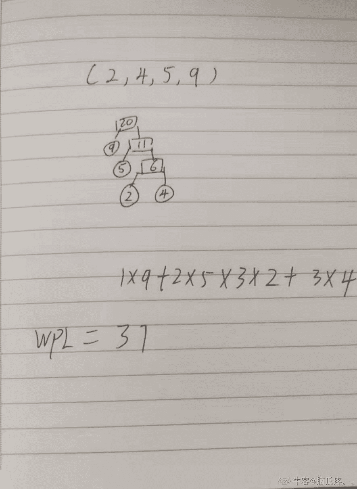

# 【2021】奇安信春招 C++方向试卷 2

## 1

以下各项中，不是 IP 数据报操作特点的是

正确答案: B   你的答案: 空 (错误)

```cpp
每个分组自身携带有足够的信息，它的传送是被单独处理的
```

```cpp
使所有分组按顺序到达目的端系统
```

```cpp
在整个传送过程中，不需建立虚电路
```

```cpp
网络节点要为每个分组做出路由选择
```

None

讨论

[封魂](https://www.nowcoder.com/profile/5751524)

数据报是通过网络传输数据的基本单元，包含报头和数据本身，其中报头描述了数据的目的地址及与其他数据 之间的关系。

在数据操作方式中，每个数据报自身携带足够的信息，它的传送时被单独处理的。 整个数据传送过程中，不需要建立虚电路，网络节点为每个数据报作路由选择，各数据报不能保证按顺序到达目的节点，有些还可能丢失

发表于 2022-02-14 00:30:14

* * *

## 2

在 DNS 的资源记录的是什么

正确答案: B   你的答案: 空 (错误)

```cpp
表示 IP 地址到主机名的映射
```

```cpp
表示主机名到 IP 地址的映射
```

```cpp
指定授权服务器
```

```cpp
指定区域邮件服务器
```

None

## 3

在 STP 协议中，端口会在不同的端口状态中进行转换，当一个端口从不转发状态进入转发状态时，需要等待（ ）Forward Delay 间隔。

正确答案: A   你的答案: 空 (错误)

```cpp
2 个
```

```cpp
3 个
```

```cpp
4 个
```

```cpp
1 个
```

None

讨论

[牛客 738221359 号](https://www.nowcoder.com/profile/738221359)


发表于 2022-02-05 16:50:10

* * *

## 4

下列说法正确的是：

正确答案: C   你的答案: 空 (错误)

```cpp
在删除整表数据，同时保留表结构时，采用 truncate Table 的效率比 drop table 要高；
```

```cpp
索引字段值不唯一，应该选择的索引类型为候选索引；
```

```cpp
用户不能在包括 GROUP BY 子句的视图上执行任何 DML 操作
```

```cpp
如果指定参照完整性的删除规则为“级联”，则当删除父表中的记录时，系统自动备份父表中被删除记录到一个新表中
```

None

## 5

SQL 优化说法错误的是

正确答案: C   你的答案: 空 (错误)

```cpp
类似分页功能的 SQL，可以先用主键关联，然后返回结果集，会提高效率
```

```cpp
多表联接查询时，关联字段类型尽量一致，并且都要有索引
```

```cpp
join 的性能比较差，建议改造成子查询写法
```

```cpp
使用 TEXT/BLOB 类型建议拆分到子表中，不要和主表放在一起，避免 SELECT* 的时候读性能太差
```

None

## 6

在单处理机计算机系统中，多道程序的执行具有（）的特点。

正确答案: A B C   你的答案: 空 (错误)

```cpp
程序执行宏观上并行
```

```cpp
程序执行微观上串行
```

```cpp
设备和处理机可以并行
```

```cpp
设备和处理机只能串行
```

本题知识点

操作系统

讨论

[dflg](https://www.nowcoder.com/profile/7885255)

C 选项并行可以指，当有 I/O 通道时设备和处理机是并行的

发表于 2018-01-10 17:28:02

* * *

[牛客 650859 号](https://www.nowcoder.com/profile/650859)

1、多道：即计算机内存中同时存放几道相互独立的程序。2、宏观上并行：同时进入 系统的几道程序都处于运行过程中，即它们先后开始了各自的运行，但都未运行完毕。3、微观上串行：从微观上看，内存中的多道程序轮流地或分时地占有[处理机](http://baike.baidu.com/view/2107226.htm)。

发表于 2015-07-15 11:26:37

* * *

[翻红的番茄](https://www.nowcoder.com/profile/809140863)

通道技术可以实现 I/O 设备与 CPU 并行

发表于 2020-06-24 10:21:06

* * *

## 7

在下列进程调度算法中，可能引起进程长时间得不到运行的算法是

正确答案: A   你的答案: 空 (错误)

```cpp
可抢占式静态优先数算法
```

```cpp
不可抢占式动态优先数算法
```

```cpp
时间片轮转算法
```

```cpp
不可抢占式静态优先数算法
```

None

讨论

[牛客 841776330 号](https://www.nowcoder.com/profile/841776330)

AD 因为静态优先算法，不管是可抢占的还是不可抢占的，都会发生饥饿的现象，因为优先级低得进程会长时间得不到运行。为了解决静态优先算法的问题，所谓动态是指：在创建进程时所赋予的优先权，是可以**随进程的推进或随其等待时间的增加而改变的**，以便获得更好的调度性能。

发表于 2022-03-04 23:01:52

* * *

[每天编程一小时](https://www.nowcoder.com/profile/435920378)

答案不是 D 吗？

发表于 2022-02-06 20:21:25

* * *

## 8

给定的一组权值（2，4，5，9） ,构造 huffman 树，该树的带权外部路径长度为

正确答案: D   你的答案: 空 (错误)

```cpp
20
```

```cpp
35
```

```cpp
36
```

```cpp
37
```

None

讨论

[脑瓜疼。。](https://www.nowcoder.com/profile/543823954)



编辑于 2022-01-11 19:14:38

* * *

[零葬](https://www.nowcoder.com/profile/75718849)

构建哈夫曼树，先合并最小的权值 2 和 4 得到节点 6，然后合并最小的 5 和 6 得到节点 11，最后合并 11 和 9 得到根节点 20。2 和 4 到根节点有 3 条边，5 到根节点有 2 条边，9 到根节点有 1 条边，带权路径长度为：(2＋6)×3＋5×2＋9×1＝37

发表于 2022-01-10 23:07:04

* * *

## 9

以下属于稳定排序算法的是

正确答案: A   你的答案: 空 (错误)

```cpp
归并排序
```

```cpp
快速排序
```

```cpp
希尔排序
```

```cpp
选择排序
```

None

讨论

[薛汤圆](https://www.nowcoder.com/profile/268071137)

稳定不稳定就看相同的关键字在排序前后的次序是否发生变化，稳定的有：冒泡排序、插入排序、归并排序；不稳定的有选择排序、快速排序、堆排序和希尔排序。

发表于 2022-03-05 13:25:53

* * *

## 10

以下不是 RBTree 特征的是

正确答案: D   你的答案: 空 (错误)

```cpp
每个红色结点的两个子结点都是黑色
```

```cpp
根结点是黑色
```

```cpp
每个叶子节点都是 NIL，颜色为黑色
```

```cpp
从一个节点到该节点的子孙节点的所有路径上包含相同数目的红节点
```

None

讨论

[零葬](https://www.nowcoder.com/profile/75718849)

D 选项应该是相同的黑结点，而不是红结点

发表于 2022-01-10 22:50:00

* * *

## 11

下面程序段的时间复杂度为 for(int i = 0;i < m; i++)    for(int j=0;j<n;j++) a[i][j] = i*j

正确答案: C   你的答案: 空 (错误)

```cpp
O（m²）
```

```cpp
O(n²)
```

```cpp
O（m*n）
```

```cpp
O（m+n）
```

None

## 12

在一个具有 n 个单元的顺序栈中，假定以地址低端（即 0 单元）作为栈底，以 top 作为栈顶指针，当做出栈处理时，top 变化为

正确答案: C   你的答案: 空 (错误)

```cpp
top 不变
```

```cpp
top=0
```

```cpp
top--
```

```cpp
top++
```

None

## 13

一颗具有 5 层的二叉树，结点总数不可能是？

正确答案: B   你的答案: 空 (错误)

```cpp
16
```

```cpp
32
```

```cpp
24
```

```cpp
8
```

None

讨论

[Error-500](https://www.nowcoder.com/profile/779471873)

最大节点数计算方法，(2^n)-1 个节点，每层最大节点数 2^n-1;

编辑于 2022-03-05 12:07:41

* * *

[零葬](https://www.nowcoder.com/profile/75718849)

5 层的二叉树结点最多也就是在满二叉树下的 31 个结点，不可能更多了

发表于 2022-01-10 22:58:52

* * *

## 14

下列哪种说法是错误的

正确答案: A   你的答案: 空 (错误)

```cpp
链接文件不是实际存在的文件，即它没有索引节点和文件内容
```

```cpp
新建目录文件的连接数为 2
```

```cpp
块设备文件主要指存储设备
```

```cpp
脚本文件实际是经过组织的多个可执行文件的有序集合
```

None

## 15

在 Linux 系统下，如下的几项中，与其它类型不一样的是

正确答案: D   你的答案: 空 (错误)

```cpp
fopen()
```

```cpp
printf()
```

```cpp
malloc()
```

```cpp
open()
```

None

讨论

[牛客 361600645 号](https://www.nowcoder.com/profile/361600645)

open 是 linux 下的底层系统调用函数，fopen 与 freopen c/c++下的标准 I/O 库函数，带输入/输出缓冲。

发表于 2022-03-14 22:14:36

* * *

## 16

以下关于 Linux DBUS 的描述，错误的是：

正确答案: B   你的答案: 空 (错误)

```cpp
DBUS 是一种低延迟、低开销、高可用性的进程间通信机制。
```

```cpp
DBUS 支持进程间一对一和一对多的对等通信，但不能支持多对多的通信。
```

```cpp
DBUS 提供一种高效的进程间通信机制，主要用于进程间函数调用以及进程间信号广播。
```

```cpp
DBUS 使用二进制协议。
```

None

讨论

[薛汤圆](https://www.nowcoder.com/profile/268071137)

支持多对多通信

发表于 2022-03-05 13:38:02

* * *

## 17

以下 C++程序在 64 位机器上，其输出结果正确的选项是？#include <stdio.h>class C{ int c;public: C(int n):c(n){printf("construct C:%d\n", c);} ~C(){}};class B{ int b;public: B(int n):b(n){printf("construct B:%d\n", b);} ~B(){}};class A { C c; int a; B b;public: A(int n):b(a),a(n),c(a){printf("construct A:%d", a);} ~A(){}};void main(){ A a(100);}

正确答案: A   你的答案: 空 (错误)

```cpp
  construct C:随机值   construct B:100   construct A:100 
```

```cpp
  construct C:100   construct B:100   construct A:100 
```

```cpp
  construct B:100   construct C:随机值   construct A:100 
```

```cpp
  construct B:100   construct C:100   construct A:100 
```

None

## 18

下列关于 C++11 里智能指针的说法，错误的选项是？

正确答案: B   你的答案: 空 (错误)

```cpp
C++11 支持 shared_ptr, weak_ptr, unique_ptr 三种智能指针
```

```cpp
  以下代码片断的写法是正确的   std::unique_ptr<int> sp1(new int(1));   std::unique_ptr<int> sp2(new int(2));   sp1 = sp2; 
```

```cpp
多个 shared_ptr 实例可以指向同一个动态对象，该对象和其相关资源会在“最后一个引用被销毁”时候释放
```

```cpp
weak_ptr 是为了配合 shared_ptr 而引入的一种智能指针，它指向一个由 shared_ptr 管理的对象而不影响所指对象的生命周期，将一个 weak_ptr 绑定到一个 shared_ptr 不会改变 shared_ptr 的引用计数
```

None

## 19

下面不能够判断字符串 S 是空串的是（字符串是 char 类型）

正确答案: D   你的答案: 空 (错误)

```cpp
if(S[0]==0)
```

```cpp
if(strlen(S)==0)
```

```cpp
if(strcmp(S,"")==0)
```

```cpp
if(S=='\0')
```

None

## 20

如何在语句中申明游标

正确答案: B   你的答案: 空 (错误)

```cpp
CREATE CURSOR
```

```cpp
DECLARE CURSOR
```

```cpp
ALTER CURSOR
```

```cpp
SET CURSOR
```

None

## 21

对网际控制报文协议（ICMP）描述正确的有

正确答案: A C D   你的答案: 空 (错误)

```cpp
ICMP 封装在 IP 数据报的数据部分
```

```cpp
ICMP 是属于应用层的协议
```

```cpp
ICMP 是 IP 协议的必需的一个部分
```

```cpp
ICMP 可用来进行拥塞控制
```

None

## 22

IP 数据报头中用于控制数据报分段和重组字段的是哪些

正确答案: A B D   你的答案: 空 (错误)

```cpp
标识符字段
```

```cpp
标志字段
```

```cpp
生命周期字段
```

```cpp
片偏移字段
```

None

## 23

drop table 在什么场景下使用

正确答案: A D   你的答案: 空 (错误)

```cpp
删除速度快
```

```cpp
可带 where
```

```cpp
属于 DML
```

```cpp
不可带 where
```

None

## 24

以下描述正确的是

正确答案: C D   你的答案: 空 (错误)

```cpp
视图可以和表一起使用
```

```cpp
为了创建视图，必须具有足够的访问权限
```

```cpp
更新视图时不能先用 DROP 再用 CREATE
```

```cpp
视图不能索引，但是可以有关联的触发器
```

None

## 25

在 Linux 系统中，下列哪些方式可以用做进程间通信？

正确答案: A B C D   你的答案: 空 (错误)

```cpp
管道
```

```cpp
信号
```

```cpp
套接字
```

```cpp
文件锁
```

None

## 26

下述是 Linux 下多线程编程常用的 pthread 库提供的函数名和意义，说法正确的有？

正确答案: A B C D   你的答案: 空 (错误)

```cpp
pthread_create 创建一个线程
```

```cpp
pthread_join 用来等待一个线程的结束
```

```cpp
pthread_mutex_init 初始化一个线程互斥锁
```

```cpp
pthread_exit 结束一个线程
```

本题知识点

网易 C++

讨论

[花开一季落一年](https://www.nowcoder.com/profile/795420)

pthread_join()函数等待线程指定的线程
终止。 如果线程已经终止,那么 pthread_join()
立即返回。 指定的线程必须可接合线程。

如果 retval 不是 NULL,那么 pthread_join()退出状态的副本
目标线程(即。 目标线程提供的价值
pthread_exit(3))* retval 所指向的位置。 如果沥青量
线程被取消了,那么 PTHREAD_CANCELED 放在* retval。

如果多个线程同时试图加入相同的线程,
结果是未定义的。 如果线程调用 pthread_join()
取消,然后目标仍可接合线程(即。 ,它将
不分离)。

发表于 2016-03-16 21:57:17

* * *

[牛客 948031750 号](https://www.nowcoder.com/profile/948031750)

pthread_join()线程回收函数 用于回收结束的线程

发表于 2021-11-16 18:51:46

* * *

[后劲好大](https://www.nowcoder.com/profile/4013442)

全选。。

发表于 2017-06-08 20:25:47

* * *

## 27

以下哪些命令可用于检查远端服务器端口

正确答案: A D   你的答案: 空 (错误)

```cpp
nc
```

```cpp
netstat
```

```cpp
ping
```

```cpp
telnet
```

本题知识点

安卓工程师 iOS 工程师 奇安信 2020 运维工程师 Java 工程师 C++工程师 golang 工程师 PHP 工程师

讨论

[木曰一](https://www.nowcoder.com/profile/660532458)

telnetncnmap

发表于 2021-09-05 22:54:49

* * *

[psychowo](https://www.nowcoder.com/profile/980213287)

[`www.cnblogs.com/pizitai/p/6519872.html`](https://www.cnblogs.com/pizitai/p/6519872.html)

发表于 2021-05-29 16:45:04

* * *

## 28

LINUX 中进程在运行时的基本状态包括

正确答案: A B D   你的答案: 空 (错误)

```cpp
就绪状态
```

```cpp
执行状态
```

```cpp
睡眠状态
```

```cpp
阻塞状态
```

本题知识点

运维工程师 奇安信 2020 Java 工程师 C++工程师 golang 工程师 PHP 工程师 大数据开发工程师

讨论

[wyn_365](https://www.nowcoder.com/profile/518029179)

**注意：进程没有睡眠状态，有睡眠状态的是线程**

发表于 2021-09-20 18:16:30

* * *

## 29

下列对函数指针声明描述正确的是

正确答案: C D E   你的答案: 空 (错误)

```cpp
void  fptr(int*)；
```

```cpp
void *fptr(int*)；
```

```cpp
void (*fptr)(int*)；
```

```cpp
typedef void (*fptr)(int*);
```

```cpp
typedef void* (*fptr)(int*);
```

None

## 30

C++11 里，关于 lambda 表达式捕获外部作用域内变量的方式，下列哪些选项是正确的

正确答案: A B C   你的答案: 空 (错误)

```cpp
[] 不捕获任何外部变量
```

```cpp
[=] 以值的形式捕获所有外部变量
```

```cpp
[&] 以引用形式捕获所有外部变量
```

```cpp
[*] 以指针的形式捕获外部所有变量
```

None

## 31

一个长方体，长宽高都是质数，已知长宽高之和为 n【n 为[6，10000]范围内的自然数。】，求这个长方体的体积最大值。
输入值：长宽高之和。输出值：体积的最大可能值。 None

讨论

[零葬](https://www.nowcoder.com/profile/75718849)

穷举

求 n 以内的质数，然后枚举所有的三元组(a,b,c)，当 a+b+c=n 时更新最大体积。本题的加速可以从两方面入手：(1)枚举三元组时的剪枝；(2)用数学方法判断质数。

```cpp
import java.util.*;

public class Solution {
    /**
     * 代码中的类名、方法名、参数名已经指定，请勿修改，直接返回方法规定的值即可
     *
     * 得到体积的最大可能值
     * @param n long 长整型 长方形的长宽高之和。长宽高都为质数。
     * @return long 长整型
     */
    public long getMaxVolume (long n) {
        ArrayList<Long> primeTable = new ArrayList<>();
        // 先求 n 以内的质数
        for(long num = 2L; num < n; num++){
            if(isPrime(num)){
                primeTable.add(num);
            }
        }
        int size = primeTable.size();
        long maxVolume = 0;
        for(int i = 0; i < size; i++){
            for(int j = i; j < size; j++){
                for(int k = j; k < size; k++){
                    if(primeTable.get(i) + primeTable.get(j) + primeTable.get(k) == n){
                        maxVolume = Math.max(maxVolume, primeTable.get(i) * primeTable.get(j) * primeTable.get(k));
                    }
                }
                if(i + j >= n){
                    break;
                }
            }
            if(i >= n){
                break;
            }
        }
        return maxVolume;
    }

    private boolean isPrime(long num){
        // 两个较小数另外处理
        if(num == 2 || num == 3){
            return true;
        }
        // 不在 6 的倍数两侧的一定不是质数
        if(num % 6 != 1 && num % 6 != 5){
            return false;
        }
        long temp = (long)Math.sqrt(num);
        // 在 6 的倍数两侧的也可能不是质数
        for(long i = 5; i <= temp; i += 6){
            if(num % i == 0 || num % (i + 2) == 0){
                return false;
            }
        }
        // 排除所有，剩余的是质数
        return true;
    }
}
```

编辑于 2022-01-09 17:45:49

* * *

[送吕蒙](https://www.nowcoder.com/profile/921516302)

//没有按照答案的标准编写，变量都是自己随便定义的
#include<stdio.h>main(){

    int x,max=0,min,i,j=1,z,s[100]={0},a,b,c,t;
    s[0]=2;                         //2 是最小的质数，不判断，直接赋值
    scanf("%d",&x);
    for(z=3;z<x;z++){        //求长宽高之和内的质数
        t=1;
        for(i=2;i<z;i++){
            if(z%i==0){
            t=0;
            break;
            }
        }
        if(t)  s[j++]=z;           //将得到的质数放在数组内

    }
    for(a=0;a<j;a++){
        for(b=0;b<j;b++){
            for(c=0;c<j;c++){
                if(s[a]+s[b]+s[c]==x)  //判断将三个质数相加是否等于长宽高之和
                  min=s[a]*s[b]*s[c];  //求体积
                if(min>max)             //max 存放较大的体积
                  max=min;
            }
        }
    }
    printf("%d",max);

}

编辑于 2022-01-21 21:42:40

* * *

## 32

有 n 辆共享单车，编号依次为 A，B，C，... 。现在要将单车整齐摆放，其中 A 车、B 车属于特殊车型，并且 B 车比 A 车大，现要求 B 车必须摆在 A 车后，例如 A-B-C， A-C-B 等，有多少种摆放方法。备注：至少 3 辆单车。 None

讨论

[零葬](https://www.nowcoder.com/profile/75718849)

憋了很久，本想对 AA…ABB…B 进行插空，但这样好像只能计算出方案数，不容易得到具体的排列。并且在其他类型的车比 AB 的间隔多时会牵涉到某一段的全排列，并没有提高效率。所以懒得憋高超诡谲的技巧了，先用暴力方法试试测试用例，结果 AC 了。其实仔细想想也可以发现，让列出所有排列组合可能性的题，基本都允许使用暴力解。

深度优先搜索

DFS 进行全排列得到所有的方案，在生成方案的过程中检查方案是否满足所有 A 都在 B 之前（只需检查最后一个 A 是不是在第一个 B 之前），同时计数，将满足题意的方案添加进结果字符串。

```cpp
import java.io.BufferedReader;
import java.io.InputStreamReader;
import java.io.IOException;

public class Main {
    static int count = 0;
    static StringBuilder res = new StringBuilder();
    public static void main(String[] args) throws IOException {
        BufferedReader br = new BufferedReader(new InputStreamReader(System.in));
        int n = Integer.parseInt(br.readLine());
        String[] bikes = br.readLine().split(" ");
        permutation(bikes, 0, n - 1);
        res.append(count);
        System.out.println(res);
    }

    private static void permutation(String[] arr, int start, int end) {
        if(start == end){
            if(isValid(arr)) {
                count ++;
                StringBuilder path = new StringBuilder();
                for(int i = 0; i < arr.length; i++){
                    path.append(arr[i]);
                    if(i < arr.length - 1){
                        path.append("-");
                    }else{
                        path.append(" ");
                    }
                }
                res.append(path.toString());
            }
        }else{
            for(int i = start; i <= end; i++){
                swap(arr, start, i);
                permutation(arr, start + 1, end);
                swap(arr, start, i);
            }
        }
    }

    private static boolean isValid(String[] arr) {
        int lastA = 0, firstB = 0;
        boolean flag = true;
        for(int i = 0; i < arr.length; i++){
            if(flag && "B".equals(arr[i])){
                firstB = i;
                flag = false;
            }
            if("A".equals(arr[i])){
                lastA = i;
            }
        }
        return lastA < firstB;
    }

    private static void swap(String[] arr, int i, int j) {
        if(i != j){
            String temp = arr[i];
            arr[i] = arr[j];
            arr[j] = temp;
        }
    }
}
```

不得不说奇安信春招的算法编程题比秋招还是要难的，春招的题多少还有点技巧，秋招卷的编程题都是些水题，所以同学们还是尽量不要拖到春招啊，秋招赶紧上岸~

编辑于 2022-01-13 16:17:51

* * *

[窓](https://www.nowcoder.com/profile/294170949)

```cpp
def printStrABC(strABC):
    for i in strABC[:-1]:
        print(i + '-', end='')
    print(strABC[-1], end=' ')

def fullPrem(strABC, start, end, counter):
    if start == end:
        if strABC.index('A')<strABC.index('B'):
            counter[0] += 1
            printStrABC(strABC)
    for i in range(start, end):
        strABC[start], strABC[i] = strABC[i], strABC[start]
        fullPrem(strABC, start + 1, end, counter)
        strABC[start], strABC[i] = strABC[i], strABC[start]
        i += 1

def main():
    counter = [0]
    num = int(input())
    strABC = input().split(' ')
    fullPrem(strABC, 0, num, counter)
    print(counter[0])

if __name__ == '__main__':
    main()

```

贴个 python 版，思路也是先全排列，然后判断是否符合 A 在 B 前并计数输出

发表于 2022-03-04 21:41:50

* * *